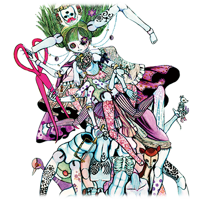

# 丽丽爱丽丝·秋水仙

| 角色信息   |          |
| ----------- | ----------- |
| 名称    |丽丽爱丽丝·秋水仙 |
| 年龄   | 人偶年龄12岁   |
|职业|有毒人偶|
|对应曲|玩具狂奏曲 -終焉- アナタニナルノ|
|初出|Chunithm Air|
|CV|田中理惠|

注：该人物故事作者为人设画师“剧团犬咖喱”。

## Episode 1 丽丽爱丽丝·秋水仙
> 呐，我现在，是不是从指尖到脚跟，都长得很像人类了呢？

在这座小镇，有一个可怕的传闻。

“如果见到了身上长着秋水仙，会说话的球体关节人偶的话，绝对不能回答她的问题哦。因为她的问题不存在正确和错误的答案。只要回答了她的问题的话，最后都会被这个有毒的人偶吸收掉灵魂啊。”

然而，这个传闻，实际上却有一些缺失和谬误。

有毒的人偶所求之物并非灵魂。

有毒的人偶所追求的，只是那些被吸收了灵魂的人的身体部分而已。而长出来的部分，也仅限对方美丽的部分。

吸收来的灵魂，不过是有毒的人偶为了做出美丽的身体所需的原材料罢了。

## Episode 2 徘徊的人偶
>请问有没有漂亮的身体呢？有的话，能不能分给我一下呢？

在一间古老的人偶店的被遗忘的角落，一个人偶无意中掉到了地上。

可爱的脸蛋上左眼被一朵秋水仙花所取代，而华奢的身体则被散发出香味的布料包裹着。手脚和躯干宛如树木的枝干般生长开叉，整体看起来就像是异国的神明一般。

没有人知道这个人偶的制作者是谁。

也没有人知道为什么要做出这样的人偶。唯一能知道的是，这个人偶的体内流淌的并不是血液，而是剧毒。

每晚，人偶都会趁着夜色出现在街上，向那些拥有美丽的身体的人类搭话，利用带毒的吐息将对方的灵魂抽取出来。
  
为什么要做这么残酷的事情呢？
  
那是因为有毒的人偶通过吸收夺来的灵魂，就可以将对方身上最漂亮最美丽的身体部分模仿出来，长在自己的身上。

如果吸收了拥有美丽双脚的人类灵魂，那有毒的人偶就会长出同样美丽的双脚。

如果吸收了拥有美丽双耳的人类灵魂，那有毒的人偶就会长出同样美丽的双耳。

这就是为什么有毒的人偶长出了那么多的躯干和肢体的缘故。

而有毒的人偶坚信，只要收集众多的美丽肢体的话，总有一天，自己也会成为人类。

“为什么明明拥有着这么多美丽的躯体部件，却无法成为人类，依旧是人偶的样子呢？”

愚蠢的有毒人偶躲在昏暗的人偶店角落，深深地叹了口气。

## Episode 3 被咬到的小指
>竟敢把我最宝贵的身体当成食物！是可忍孰不可忍！

剧毒的人偶不喜欢太阳光。因为如果被那强烈且无法抗拒的太阳光照射到的话，辛辛苦苦收集来的身体和布料都会褪色消失的。所以剧毒的人偶只能在太阳所触及不到的店内的阴暗角落默默待着，直到太阳下山，时钟的指针在顶端重合的时候，才能出来。

然而今天，她却在时钟两针重合的很久之前，便被咔嚓咔嚓的巨大声音吵醒了。剧毒的人偶从右边数起的第二条腿的小脚趾似乎被什么东西咬到了的样子。而咬到的犯人，则是一只只剩骸骨的老鼠。

“哎！这根小指头本来可是我最喜欢的部分呢！虽然说我身上的每根指头都很漂亮，但这根指头可是长短最适合的哦？居然敢把这根指头咬掉一截！看我不把你用铁板压成肉饼再用火烧掉，然后在背上刻上诅咒的话语！”

剧毒的人偶抓住了骸骨老鼠，大喊着。

如果是普通的老鼠的话，只是碰到人偶的话就会毒发身亡的，然而骸骨老鼠却不为所动。只剩骸骨的身体由于没有血液流通，也没法将毒液传递至全身。然而，想从人偶那众多的手臂中逃脱，对于只有普通老鼠体能的它来说，难如登天。

于是骸骨老鼠选择了放弃抵抗并且啾啾地叫着，乞求原谅。

“真的非常抱歉。因为从来没有想过还有活着的人偶存在。我什么都会做的，请饶了我一命！”

既然都说了什么都会做的话，不使唤一下未免太可惜。话是这么说，能从骸骨老鼠上拿到的，也不可能是刚刚被咬掉的脚趾头，于是，莉莉爱丽丝·秋水仙决定向这只骸骨老鼠询问如何成为人类的方法。

## Episode 4 骸骨老鼠的建议
>你的身体内不是空空如也的吗。连内脏都没有，怎么能叫人类呢？

骸骨老鼠的意见一针见血。的确，从来没有听说过没有内脏的人类。说不定莉莉爱丽丝·秋水仙迄今为止未能成为人类，就是因为没有内脏的缘故。然而，有毒的人偶只是露出烦躁的表情摇了摇头。

“我才不要呢。要把那种腥臭的东西塞进体内，是不是脑子进水了啊。还有啊，时钟这种东西也好，风琴也好，不靠这种东西不也能驱动吗？”

认真回答的骸骨老鼠只能让步。

“再怎么说，能够组成身体的部分已经足够多了，还是不能成为人类的原因，应该是内部空空如也吧。如果内心空空如也，就不足以称为人类呢。对了，试试看把头发塞进去如何？”

莉莉爱丽丝·秋水仙露出一副听到麻烦事情的表情回道。

“不要。乱糟糟的，翘起来可是很痒的。”
“那么，眼珠子如何呢？”
“虽然看起来不错，不过眼珠子一般不是放在口中的吧？好歹也要注意一下礼仪呢。”

## Episode 5 填补空虚之物
>如果在我的体内填满什么东西的话，我就能成为人类了吗？

骸骨老鼠叹了叹气，说到。

“按你这么说难道就没有能够装在体内的东西了吗？总该有一个吧。人类可是有众多的部件的，至少选一个靠谱的吧。”

“嗯……那么，牙齿如何？”

“啾！这个可以。如果是牙齿的话，就算是一名人类也能获得很多的量，您体内的空洞也可以立刻填满的吧。”
  
于是，那天夜里，莉莉爱丽丝·秋水仙和骸骨老鼠便在街上寻找着人类，凡是见到人类，就将牙齿一个个拔出来。
  
“长得这么难看的人类的牙齿我才不要呢。我要更加可爱的女孩子的牙齿。”

“忍忍吧。你不也说过不要较小的乳牙吗。相比较之下，已经成年的人类能获得的牙齿，都是已经长成完美形状的牙齿啊。之后只要好好洗干净就行了。”

## Episode 6 可怕传言的真实面貌
>知道了一切的人类为之愤怒，毫无慈悲地举起武器，开始了对剧毒人偶的追捕。

很快，传言在人们间变的严重起来。由于剧毒的人偶迄今为止为了不伤害到美丽的身体，都是以十分纤细而谨慎的方法慢慢将人催眠并抽取出灵魂的，所以受害者的尸体都毫无损伤。而且由于能入人偶法眼的美人本来就不多，所以迄今为止都在缓慢地收集而已。

就算偶尔出现在夜晚的道路上有女孩突然没有了呼吸，人们也不会考虑到是不是被剧毒的人偶袭击致死，只会以传言的形式流传下去。

然而，当剧毒的人偶开始只想要牙齿的时候，作案的手段就瞬间变得非常粗暴了。人偶会先随便抓住人类，然后将腿打断防止逃跑，接着粗暴地斩下头颅，连灵魂都不吸收，直接拔走口中的牙齿。

像这样的行为，一般都是在夜间进行，而他们已经取走了好几个人的牙齿。当太阳终于升起的时候，人们在街角看到的，是牙齿被拔光的头颅，以及失去头颅的几具尸体。人们终于意识到有什么可怕的东西正潜藏在这片街道之中。

而一名只有乳牙的小孩子看到了案发的过程，人们才明白原来人偶的传言并非子虚乌有。人们为之害怕，而那些朋友和家人被杀的人们则为之悲愤。

## Episode 7 人偶猎人的袭击
>在这美丽而可爱的身体面前，难道不应该先为之感慨吗？

寻找人偶的人们，自然不会放过人偶商的店铺。虽然人偶商人拼命恳求着不要破坏店里的商品，但是也不能放过不知道躲在何处的剧毒人偶，而且人们也觉得，剧毒的人偶说不定会躲在普通的人偶中拟态躲过追杀。

于是，人们破坏了店里的所有人偶，终于，他们来到了阴暗潮湿的店铺深处，也就是剧毒人偶所在的房间。由于现在仍旧是白天，觉得麻烦的莉莉爱丽丝·秋水仙决定直接趴在地上，假扮成普通的人偶逃过一劫。然而，一名壮硕的男性直接冲了进来，手上的斧子无意中挥向了地面，斧子就这么斩断了人偶第三条手臂的右手腕。

被突如其来的攻击吓到的莉莉爱丽丝·秋水仙叫了起来。

“哎呀！怎么会有这么无礼的人类！”

看着发出咔嚓咔嚓声音站起来的剧毒人偶，人们不禁发出了悲鸣。

“找到了！真的找到了！会说话的人偶妖怪！”

话音刚落，手持钝器和刀剑的人们纷纷冲入了房间。莉莉爱丽丝·秋水仙用着丝毫不少于他们人数的手臂将这些失礼的人们打飞，宛如蜈蚣般飞速地钻进了狭窄的人偶店内部。

跟丢了剧毒人偶的人偶猎人们并未继续向深处前进，而是决定将整间店铺都烧掉。

很快，人偶店就被火焰所包裹，老旧的木板，布料，以及人偶们都变成了极佳的火源，随着轰轰的燃烧声音变成了巨大的火焰团。人们都认为在这么大的火势下，就算是那个人偶也会化为灰烬，然而现实却不如所愿。在这间人偶店的地下，有一间作为仓库使用的地下室。而剧毒的人偶和骸骨老鼠就这么躲进了地下室，逃过了熊熊燃烧的火焰。

## Episode 8 骸骨老鼠的策略
>你的身体部件不是还有很多吗？稍微用用也无所谓吧？

非常幸运的是，烈焰并未影响到石头建成的地下室。

不过，等到火势退去，人们应该就会立刻发现这个地下室的存在吧。必须在这之前找到脱身的方法。

骸骨老鼠啾啾地发出声音，说到。

“既然如此的话，你就把你身上多余的身体部分做成诱敌的人偶吧。我们还算走运，这里还有大量的人偶呢。只要把你真身的部分身体混进去的话，总能够瞒天过海的。”

听到这个方法的剧毒人偶为之一惊。

“我才不要呢！你竟然敢说我这千方百计才收集来的漂亮身体是多余的累赘！”

“就算不说多余与否，身体部件什么的再收集起来不就好了嘛？再不快点，人们就要冲进来把我们大卸八块咯。”

正如骸骨老鼠所言。剧毒的人偶只能忍痛放弃了自己身上多余的部件组装到了其他人偶身上做成诱饵。骸骨老鼠利用人偶身上的头发结成绳索，然后像是上吊般地悬挂到了房梁上。

## Episode 9 剧毒人偶和人偶猎人的决战
>如果认为我不会将那些我不感兴趣的人类大卸八块的话，那可是天大的误会哦。

在昏暗的地下室进行的诱饵作战成功了。

人们看到当做诱饵的人偶，都当成了真正的剧毒人偶，宛如发狂般的破坏起来。

只有这个时候，人们的愤怒才勉强超过了理智，人们的眼中放着凶光，带着湿润的眼角，拼命挥舞着武器攻击无数的诱饵人偶。

“你这该死的杀人人偶！把我父亲的命还回来！”

“竟然把我的女儿！把我的女儿给！不可饶恕！就算你跑到天涯海角我也要宰了你！”

就在人们破坏着人偶的时候，从这些人偶的残骸中漏出了秋水仙的剧毒，布满了狭窄的地下室。人们的身体出现了些微的麻痹感。虽然这毒的效果并非立竿见影，但是对剧毒的人偶来说，已经是绝佳的机会。

躲藏在人偶堆成的小山里的剧毒人偶跳了出来，用宛如穿堂风一般的速度冲向了人们。在剧毒人偶的利爪之下，人们连悲鸣都发不出来，就瞬间被切成了碎片。

“明明这样挑选起来更加简单了，不过，这些身体还是不要算了。虽然有点浪费，不过只能拿来当肥料呢。”

剧毒的人偶在被切碎的尸体面前大放阙词，然而却忘不了那些人们的憎恨。

因为迄今为止，剧毒的人偶从来都对自己被人憎恨这一事实毫不知情。

## Episode 10 无解的人心
>明明我是那么地爱着人类，为什么人类要这么残酷对我？

莉莉爱丽丝·秋水仙的心中仿佛嘎吱作响，感觉到了一股揪心的疼痛。

明明自己为了成为自己最喜欢的人类，用尽了各种手段，最后却只换来人类对自己的诅咒和怨恨。
  
“还不是因为你夺走了那么多人的性命嘛。还那么粗暴地拔走牙齿，换做是被夺走东西的一方，会愤怒是正常不过的。”
  
虽然骸骨老鼠说的是正论，然而剧毒的人偶还是露出了不服的表情。

“人类和人偶可不一样，他们不仅大量存在，甚至还在繁衍增多呢。只是稍微从他们身上拿走一点两点什么的无所谓吧。”

“从今以后，还是好好地分清楚能拿的和不能拿的东西比较好啊。如果你同意这点的话，那以后就没啥问题。”

“明明脑袋瓜子这么小，懂的还挺多嘛。”

剧毒人偶对骸骨老鼠的意见感到满意。

从此以后，剧毒的人偶便从这片街道彻底消失了。坐上了一辆不知道通往何方的邮车，剧毒人偶开始了她的云游生涯。

不论如何，毒人偶的传说，就此销声匿迹。

## Episode 11 骸骨老鼠，啾啾作响
>肯定还有想要舍弃身体的人。找到他们并且从他们身上夺走就好了。

等到又一年春天到来，花朵盛开的时候，一封用红黑色墨水书写的信送到了曾经人偶商店所在的地方。

亲爱的人偶店主：

我从此以后走遍了众多国家，收集了各种各样的上等的身体，所以不需要担心我。

这次我会用影响最小的方式慢慢收集那些不被需要的躯体了。

对了，最近我开始收集起骨头了呢。就算是再怎么丑陋外表的人，体内的骨骼却仍保留着美丽到夺人心智的形状，这可是前所未有的大发现呢。

想必找到这点的我，应该能更加地接近人类吧。

我期待着成为人类，和您再次见面的一天。

当你的内心万念俱灰的时候，说不定从某个角落就会咕噜噜地出现一体剧毒的人偶。

“贵安。请问您是否拥有着令人爱怜而美丽的身体，还是拥有着未经虫蛀的完美牙齿，亦或是质地光滑的骨头呢？”

如果您不要了的话，请分给我一点吧。

——你，应该也很期望成为我的一部分吧？如果是这样的话，那么，就成为我的一部分吧。而我，也将获得你的一部分。”