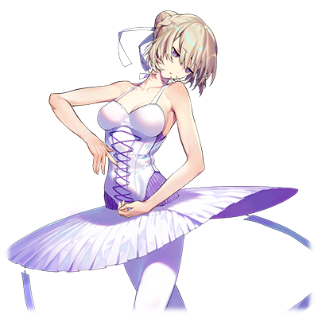

  
# 艾尔莎·冯·奥迪特

| 角色信息   |  |
| ----------- | ----------- |
| 名称    | 艾尔莎·冯·奥迪特    |
| 年龄   | 17岁        |
| 职业 |  反正就是学校的吊车尾  |
| 对应曲目|パームカルマ|
|对应版本| Chunithm Crystal Plus|

该角色为官方OST《カゲロウリレイション》的封面人物。

注：由于该文章中的主角为芭蕾舞者，会出现一定量的芭蕾舞术语。

## Episode 1 形单影只的天鹅女孩
> 尊敬的，未来的主舞小姐：     你好。不知道你是否还像以前一样呢？我一直在担心着你，是不是像以前那样，一个人躲在角落哭着呢。

在我的书桌上摆着一张照片。照片上面的，是已经去世的母亲的笑容。

那天，一场事故夺去了带着灿烂笑容的母亲。

而从那天起，我在家里的容身之处也跟着不见了。

  

我的母亲曾经是优秀的芭蕾舞者，而父亲则是剧团的发起人。

我和妹妹正是这两人生下的孩子，理所当然地被寄予了对未来的厚望。

从母亲那里传承下来的天赋，还有父亲为我们提供的最棒的舞台。我们的未来本该是一片光明的。

那个时候的我，不但没有将周围人的期待当成压力，反而为之自豪。

由母亲的舞蹈所带来的这个世界，将由我继承这件事，当时的我深信不疑。

  

然而，数年以后，一起进入了芭蕾舞学校，但最后展现出才华的，并不是我，而是妹妹索菲。

技术，表现，魅力，我的妹妹每天都在以可怕的速度追赶着我，并将我抛在了后面。不知何时，我甚至每天的夜里，都会向着神明乞求着——“还请明天不要再到来”什么的。

当然，这样无理取闹的愿望也不可能实现，我和妹妹的差距，正越来越大。

和平平无奇，毫无变化的我不同，索菲的舞蹈随着时间推移变得越来越漂亮。

而她的动作和神态，像极了我的母亲。

会这么想的人，不止我和周围的人……当然，我的父亲也是这么想的。

然后，我的父亲便将重心放到了索菲的身上，而他的眼中再也没有我的身影。

不管是才能，还是父亲，最后都抛弃了我。

即便如此，我还是选择继续跳着舞。

心中已是一片荒芜的我，只能无谓的跳着舞度过空虚的每一天。因为，我根本找不到除了跳舞以外的方法填满这样的日常。

回到宿舍，迎接我的，是只留下生活起居的最低要求的，空荡荡的房间。

我轻轻地摸着母亲露出笑容的照片，躺在了床上，打开了一封信。

* * *

生日快乐! 艾尔莎！

随着你长大了一岁，这也代表着你往成熟的淑女更进一步了哦！

爱你的妈妈。

* * **

这封书信已经被我翻阅了无数次，以至于变得皱皱的。

而这封信，则是母亲，寄给“十岁的我”的。是我最重要的宝物。

而今天，是我的17岁生日。

然而，却没有一个人为我庆祝。

## Episode 2 和某个人完全不同的我

> 我这边没有问题哦。我已经不是小孩子了，总不能一直躲在被窝里哭泣吧。

一整面墙的镜子，以及围着整个房间设置的横杠，这间白色的房间，就是一间没什么特别的设施，为基础的学生建立的练舞室。

在练舞室里，正坐着一群刚刚结束了基础练习在喝水休息的学生们。

在这些学生中，没有我的妹妹，索菲的身影。

由于索菲的实力突飞猛进，她早就不在这里练习，而是跟着父亲一起去芭蕾舞团的练习场地，以准主演的标准进行训练。现在的她，应该和身为剧团发起人的父亲一起，在不知道哪个剧院活跃着吧。

  

“索菲真的很厉害呢。估计等到她毕业的话，就算没有选拔估计也能够直接进剧团的吧？”

“是吧。虽然现在的她还只能当伴舞，不过她应该很快就能够独当一面成为独奏者了吧？”

“果然，天赋什么的还是最重要的啊。跟我们这些人就是不一样呢。”

“是……呢。”

我听到了同学们的谈论。而且，同学们那尖锐的视线令我芒刺在背。

这个学校不是谁都能入学的。能够进来的，都是经历了严苛的考试的精英。不管是谁，都非常明白后天努力的辛苦和荣誉感，所以一般大家都不会明着嘲讽或者欺负别人。不过，实际上她们的内心是怎么想的，大家都很清楚。

所以。

我选择了放弃这点矜持。是的。“我就是和那个天才的妹妹不一样呀。”像这样说着的话，还能轻松一点。

只要说着“对啊，我就是那个吊车尾”的话，事情可就轻松多了。

  

结束了一天的练习回到了宿舍。宿管递给了我一封信。

我拿过信翻到背面确认了一下，发现送出的人是我的父亲。

我瞬间瞪大了眼睛，立刻爬上了楼梯奔向自己的房间。

（他还记着！他还记着我的生日！！）

他究竟会写什么东西呢。

是“有在努力吗？”，还是“身体情况如何？”呢。

嗯嗯。其实我想要看到的，就算不是这些也行。只要一句简单的“恭喜你”就足够了。

我默默地想着，拆开了信封。

但是，信封里装着的不是信纸。只是一张留有这个月的生活费的，支票而已。

虽说父亲是个不善于表达的人，不过……为什么，就连一个女儿的生日，他都记不住呢。

我将书桌下的椅子抽了出来，无力地坐了上去。

我的心中已经没有一丝悲伤了。只是，为刚刚还在期待着这一切的自己感到了些许悲哀。

  

“母亲。为什么我要一个人活在这个世界上呢？”

我的问题没有人能够解答。回应我的，只有照片中微笑着的母亲。

## Episode 3 只属于你的白月光

>因为你总是展现强势的一面，我就在想，你会不会是在勉强自己呢。

最近，我的状态直线下降。

虽然平时练习的时候我就常常被老师打断要求更正，但今天我一次都没被老师打断过练习。

肯定是老师已经对我不抱希望了吧。

在没有人的练舞室里。我打开了录音机，然后加大了音响的音量。

有时候，我会像这样在大家结束了训练之后，自己呆在这里练习。

这不是什么改善练习的缺陷之处的自主练习。我只是想在没有人的练舞室里，自由地伸展肢体罢了。

随着音响中传出来的小提琴声，我摆动着自己的手臂。

  

《天鹅湖》——奥迪特(Odette)的单人舞段。

那是《天鹅湖》里，奥迪特在月光照耀下短暂变回人形的时候，和王子邂逅的段落。

那是我从小便十分熟悉的，母亲最擅长的舞步。

我从那个时候开始，就十分憧憬着母亲。

  

随着曲子的结束，在除了我以外空无一人的练舞室里，响起了一阵掌声。

我心底一惊，慌忙地转过了头，才看到一个蓄着络腮胡的高大男子，正不停地鼓掌着。

“真的是太棒了啊。不过，作为第二幕的奥迪特来说，是不是太悲伤了呢？”

“……你是谁？我可要叫保安了。”

如果是精通芭蕾的学校的关系者的话，是绝对不可能对我这样的吊车尾跳的舞步鼓掌的。我不禁对眼前的这个男人起了戒心。

“那个，能不能稍微让我解释一下。我可不是什么可疑的人。”

“所有的可疑人士都是这么解释的。”

“啊哈哈。感觉你很强势呢。放心吧，我可是经过学校的许可才进来的。”

男人露出了困扰的表情，抓了抓头。

“哼……不过大叔究竟是什么身份也和我无关啊。那么，你找我有何贵干？”

“哎呀，其实我只是被你所扮演的奥迪特折服了啊。今天的我只是来参观的客人而已。”

真是烦人……。我都已经把厌烦的表情写在脸上了，能不能赶紧走啊。

“谢谢夸奖。这么说就行了吧。不过，比我厉害的家伙这个学校可是到处都是呢。”

“说不定就像你说的那样。不过，我从你的身上，感觉到了一丝特别之处啊。对了，为了证明我不是什么可疑人士，这个给你……这是我的名片。”

  

男人从口袋里掏出了一张卡片。赶紧拿完回宿舍吧。

然而卡片上的文字却吸引了我的注意力。

“阿尔伯特·芭蕾舞室？”

“是的。我就是名片上面写的那个阿尔伯特。你的名字是？”

“艾尔莎。”

“艾尔莎吗。这是个好名字。如果你有兴趣的话，可以来名片上的这个地址找我。我随时都欢迎你的到来。”

这么说着，阿尔伯特露出了真挚的笑容，摆摆手离开了这里。

虽然说他的样子要说是芭蕾舞的教练也未免太邋遢了，不过既然已经知道他是什么人的话也就不必那么警戒了吧。

不如说，最后看到的那个表情，有种令人怀念的感觉。对我来说，这种感觉太不可思议了。

## Episode 4 父亲与我的真实想法

> 要说不会寂寞什么的，那是骗人的……但是我还有很多事情要完成。我得更加努力。

几天后，我从结束了公演的父亲那里收到了前去他的事务所的通知。

虽然说不感兴趣，但也不能无视他的要求。

  

来到社长室门前的我，下定了决心之后便打开了门。父亲撇了我一眼便重新将视线投向桌上的文件，百无聊赖地开了口。

“你都不敲一下门的吗？”

“非常抱歉。”

明明是和自己的亲生女儿的久别重逢，父亲却没有正眼瞧着我。

“在学校生活的咋样？”

“没什么变化。”

“没什么变化……吗。我还想着你说不定能够长进一些呢。”

  

父亲那冷淡的回答，让我感觉到，他在回答的人仿佛是个相隔千里，毫无瓜葛牵连的陌生人一般。

我想不出该回答他的话，只能站在原地感受着那股冰冷的空气。

“……”

“我从教练那里听到了情况。听说你最近训练的状态不太好的样子啊。也不用勉强自己，现在赶紧放弃不干这行也好。”

“为，为什么！”

“你看看这个。”

父亲这么说着，将数份文件扔到了我的面前。

我拿了起来，发现上面贴着一张看年龄比我大差不多十来岁的男人的照片，旁边则附着他的资料。

“也差不多得跟你讨论相亲的事情了。”

“可是，我才十七岁啊！竟然就要这么和一个完全不认识的男人结婚什么的！！”

“对啊。十七岁，这不刚刚好吗。反正你也快毕业了吧，在这之后，你能够决定你的未来吗？我想和这个人背后的公司牵线搭桥。当女儿的就不能为父亲的事业想一想吗。”

  

……原来是这么一回事吗。

在这个人的眼中，我的事情怎么都好，只要有索菲在就足够了，吗。

这个男人，只要为了自己的事业，连自己的亲生女儿都能当成事业的垫脚石吗。

迄今为止，父亲虽然放养着我，但是至少他从未直接干涉我的行动。

现在，从这个男人这里听到了如此残酷的“答案”。

我不禁感觉到一阵头晕目眩。

“我考虑一下。”这么说着，离开了办公室。

  

终于回到宿舍的我，趴在了床上。

我迄今为止，已经不知道忍受了多少次。

在曾经会对我露出笑容的父亲转头望向索菲，为索菲的成就而欣喜的时候。

在我被人从各个角度和妹妹比较，最后被人投以怜悯的目光的时候。

在我考试考砸的时候，在我一个人孤独地呆在宿舍里度过暑假的时候，还是因为感冒彻夜未眠的时候。

还是说，在母亲的葬礼上，我不停地安慰着大哭的索菲的时候！

我一直，一直，一直，一直，都忍着不哭啊！！

“对不起……这真的是我的极限了……母亲……”

  

我将脸埋在枕头里，大声地哭了出来。

这是我入学以来第一次爆发这样的情绪。

哭累了，哭到出不了声为止。直到这个时候我才发现外面已经夜幕降临。

我抬头看着课桌上的东西，前几天刚收到的名片映入我的眼帘。

现在的我，不知为何，非常想拜访这个人。

## Episode 5 成功成仁

> 不好意思呀，我的坏习惯就是容易过度担心事情呢。对于已经长成亭亭玉立的淑女的你来说，说不定有些失礼了呢。

“还真的有啊……阿尔伯特·芭蕾舞室。”

虽然这间处于一座砖瓦楼里的三层的练舞室，并没有那么宽敞崭新，但是还是能看得出打理的井井有条。这里，就是阿尔伯特的练舞室。

我轻轻地打开了练舞室的门，从里面传出了华尔兹的旋律。在由整个楼层改造而成的练舞室里，正有几名年轻学生在练习。

阿尔伯特从玄关的镜子那里看到了我的身影，露出了笑容。他在旋律刚好的位置停止了音乐的播放并示意学生们去休息。之后便向我走了过来。就像预料到了我会造访这里一般，和我开始了对话。

“现在她们还只是少年级别呢。不过，未来肯定能够成为主演的。当然，这些人里，也包括你哦，艾尔莎。”

“要我成为主演级别，这玩笑未免开太大了吧？如果是我的妹妹的话还有可能。”

明明只是闲聊而已，我却闹了别扭。这时的我才注意到自己是多么的感性，再次陷入了沮丧状态。

阿尔伯特只是露出一副“不用在意”的表情拿了一张小凳子过来，然后坐了下来，用温柔的语气说着。

“总之，还是先坐下来说一说吧。今天，如果不先从你这里问到事情的来龙去脉的话，啥都开始不了哦。”

“为什么？”

“啊哈哈。你还没注意到吗？现在的你，和之前那个跳着《天鹅湖》的艾尔莎，可是判若两人啊，眼睛都哭肿了哦。”

“不是吧……”

听到阿尔伯特的这句话，我如梦初醒，而且感到无比羞耻。

“我可是不会说谎的。总之，先来杯咖啡镇静一下吧？”

阿尔伯特倒了一杯略浓的咖啡。从那杯中咖啡的倒影看，我的表情的确十分糟糕，以至于让我心生厌恶，于是我一口气喝完了咖啡。

在这之后，我和阿尔伯特，就一边看着学生们的自主训练，一边向阿尔伯特说着自己的事情。

母亲的事情，妹妹的事情，还有从父亲那里得到“放弃芭蕾”的意见的事情，还有自己被他抛弃的事情。

我一直都想着向谁诉说着这些事情。

明明面前听我说话的不是什么至亲至交，但我还是宛如决堤般，说出了我自己内心所想的一切。

阿尔伯特身上的那股不可思议的气氛让我稍微放松了一下，最后，我说出了这句话。

“……我，从今以后，究竟应该怎么做是好呢……”

一边说着，我一边抱着自己的膝盖蜷缩了起来。而阿尔伯特的回答让我十分意外。

“那，放弃也不错呢。”

“咦？”

面对阿尔伯特的这句话，我不禁叫出了声。

阿尔伯特直直地望着我，用着冷静的语调和我说到。

“我最近才开始注意到一件事……人生，其实是比我们想象中还要短的。所以如果有什么辛苦的事情，那也没必要坚持下去啊。不过，现在，并不是你脱下芭蕾舞鞋，离开这个领域的时候。如果你真的想要放弃这一切的话，为什么不弄得轰轰烈烈一点呢？”

“轰轰烈烈地……你是说让我去参加大赛吗？怕不是要自取其辱啊。”

我又低下了头，不敢直视阿尔伯特的视线。大赛什么的，那里可不是我该在的地方。

“虽然对于已经适应了现在生活的你没啥实感，但是，你可不是白白呆在那个学校的啊。那可是从入学就要经历千辛万苦，不知道多少人折戟沉沙，只有精英中的精英才能入学的学校。而你直到现在，仍旧没有放弃芭蕾，也没有逃离这个学校，仍然在那里顽强地活着。这就足以证明你对芭蕾的爱还没有燃尽啊。”

“对芭蕾的……爱吗？”

“你也不想像这样，被所有的人忽视，宛如幽灵一般活在这个世上对吧？你必须活着，在这个世界上留下一点属于自己的痕迹，证明自己还活着啊。”

不知何时，阿尔伯特的语气变得越来越热情。从他那冷静的语调中，我感觉到了某种坚定的意志。

我抬起了头，看到的是用真挚的眼神看着我的阿尔伯特。

“艾尔莎，要不要试试来我这边练习呢。不会对你做坏事的。”

属于我的痕迹，证明自己还活着的证据……。

是啊。我既不是“有名的芭蕾主演舞者的女儿”，也不是“著名剧团发起人的女儿”，更不是“将来有望成为名芭蕾舞者的女孩的姐姐”啊。

我就是我。我必须向这个世界证明我在这个世界上存在啊。

不久，我就同意了阿尔伯特的提案。

## Episode 6 母亲的幻影

>你那边状况如何？一想起你平时那毫无生活感的样子就没法想象你在那边该如何生活呢。

在阿尔伯特的帮助下，我获得了在学校外练习的许可。

第一天从宿舍出发前往他的练舞室那天，我还在想阿尔伯特会是怎样的课程呢。但是到了现场之后，我才发现我的担忧是多余的。

“你太集中于维持动作了。好好听音乐的节奏！”

“是！”

“把脚再抬高点！你的极限可不止这个程度啊！”

“好的！”

我的四肢，终于能跟随着我的心意而动了。

阿尔伯特的指导真的是细致入微，从我平时动作的小习惯，到肌肉的锻炼，还有我自己的心理活动方面，他都能给我准确的意见。自从来到他这里几天，我可以很明确地感觉到自己正在进步。

不知何时，我开始享受起了每天训练的过程。

那天，我比自己设置的闹钟时间要稍微早了一点出门，提前来到了练舞室。

打开了门，我却从本该空无一人的练舞室里听到了音乐声。而在练舞室里，我看到了阿尔伯特正独自一人在练舞室中起舞。

奥迪尔的Pas de deux（男女双人舞）——本该由男女两人合作的双人舞，阿尔伯特却在一个人跳着。他的双脚轻如飞燕，但却有一股从内向外散发出来的力道。
（注：奥迪尔是指《天鹅湖》剧中的黑天鹅。）

Pas de deux中的男性舞者的目的，是为了表现身为搭档的女性舞伴的魅力。如果两人不经过长期的训练，以眼神等各种方式配合沟通的话，是不可能做到天衣无缝的配合，也没法向观众展现这种舞的魅力的。

但是，眼前的阿尔伯特却在一个人跳着。他的动作，仿佛就像是在一人分饰男女两角的配合演出一般，从旁看着的我，还感觉到了某种只剩孤身一人的寂寞。

然后，等到阿尔伯特温柔地用手腕“抱着”某样东西的时候，我似乎从他的怀里看到了某个女性的身影。

阿尔伯特的手腕到脚踝的距离，还有支撑着“女伴”脚尖旋转的腰部的手的高度。在他的动作衬托之下，我仿佛看到了某个不存在于那儿的，某个人的幻影。

我很熟悉这个身影。阿尔伯特勾勒出来的这个身影。

那是我心心念念不知道多少次的人。

那个人就是——

“母亲？”

我不自觉地说了出口。

注意到我的存在的阿尔伯特，停住了舞步，并暂停了音乐，露出一副腼腆的表情向我走了过来。

“今天……你来的还真早啊。刚刚看到那个……我有点儿不好意思啊。”

“……刚刚，你是在和我的母亲‘共舞’，是吧？”

虽然从理性的角度来看，阿尔伯特的眼中是不可能看着某个人的。

但我却不知为何，确信了跳舞中的他，眼中的搭档，就是我的母亲。

“嗯，你也感觉到了和我共舞的‘不该存在的搭档’了吗？看来我的芭蕾跳的还很不错嘛。”

“不要蒙混过去。”

我瞪着他说到。因为我觉得我内心中的问题的答案，就在阿尔伯特身上。

“好吧，我也不是故意隐瞒这些事的。来吧，跟你说一些陈年往事……”

阿尔伯特擦了擦汗，便拉过来一张小凳子，缓缓地讲了起来。

而他讲的故事，则是我从未知晓的，母亲曾经的故事……。

## Episode 7 曾经在这里的青春

>这边的日常还是一成不变，唯一的遗憾就是没能亲眼目睹你的成长啊。

阿尔伯特笑着讲述了他青春时期的故事。

曾经，阿尔伯特和我的父母，是所属于同个剧团的同期生。

母亲是剧团的主演舞者，而父亲则是负责后台的工作。

三人是多年的好友，但是，那个时候的他们的关系不止于此。阿尔伯特和我的父亲，那个时候还是互相争着母亲的关系。

阿尔伯特虽然有一阵子和母亲交往过，但是看到了对着当时的母亲疯狂开展攻势的父亲，便选择了退出。

阿尔伯特说的这些故事我从未听闻，让我无比惊讶。但是我看到阿尔伯特那笑着谈论的样子，却又冷静了下来。

“我可是和你的母亲跳了不知道多少次芭蕾舞啊。所以刚刚才想象着你的母亲，一个人跳起了双人舞……总觉得很不好意思啊。”

阿尔伯特不好意思地笑了出来，努力地向着窗外看着。

“原来是这样的吗。那个，虽然关于这些事情可能不是我该知道的……但是，为什么你那个时候要选择退出呢？“

