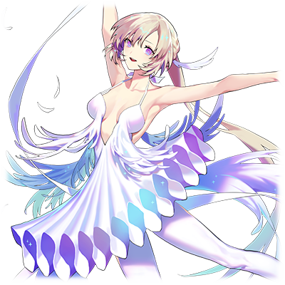

  
# 艾尔莎·冯·奥迪特

| 角色信息   |  |
| ----------- | ----------- |
| 名称    | 艾尔莎·冯·奥迪特    |
| 年龄   | 17岁        |
| 职业 |  反正就是学校的吊车尾  |
| 对应曲目|パームカルマ|
|对应版本| Chunithm Crystal Plus|

该角色为官方OST《カゲロウリレイション》的封面人物。

注：由于该文章中的主角为芭蕾舞者，会出现一定量的芭蕾舞术语。

## Episode 1 形单影只的天鹅女孩
> 尊敬的，未来的主舞小姐：     你好。不知道你是否还像以前一样呢？我一直在担心着你，是不是像以前那样，一个人躲在角落哭着呢。

在我的书桌上摆着一张照片。照片上面的，是已经去世的母亲的笑容。

那天，一场事故夺去了带着灿烂笑容的母亲。

而从那天起，我在家里的容身之处也跟着不见了。

  

我的母亲曾经是优秀的芭蕾舞者，而父亲则是剧团的发起人。

我和妹妹正是这两人生下的孩子，理所当然地被寄予了对未来的厚望。

从母亲那里传承下来的天赋，还有父亲为我们提供的最棒的舞台。我们的未来本该是一片光明的。

那个时候的我，不但没有将周围人的期待当成压力，反而为之自豪。

由母亲的舞蹈所带来的这个世界，将由我继承这件事，当时的我深信不疑。

  

然而，数年以后，一起进入了芭蕾舞学校，但最后展现出才华的，并不是我，而是妹妹索菲。

技术，表现，魅力，我的妹妹每天都在以可怕的速度追赶着我，并将我抛在了后面。不知何时，我甚至每天的夜里，都会向着神明乞求着——“还请明天不要再到来”什么的。

当然，这样无理取闹的愿望也不可能实现，我和妹妹的差距，正越来越大。

和平平无奇，毫无变化的我不同，索菲的舞蹈随着时间推移变得越来越漂亮。

而她的动作和神态，像极了我的母亲。

会这么想的人，不止我和周围的人……当然，我的父亲也是这么想的。

然后，我的父亲便将重心放到了索菲的身上，而他的眼中再也没有我的身影。

不管是才能，还是父亲，最后都抛弃了我。

即便如此，我还是选择继续跳着舞。

心中已是一片荒芜的我，只能无谓的跳着舞度过空虚的每一天。因为，我根本找不到除了跳舞以外的方法填满这样的日常。

回到宿舍，迎接我的，是只留下生活起居的最低要求的，空荡荡的房间。

我轻轻地摸着母亲露出笑容的照片，躺在了床上，打开了一封信。

* * *

生日快乐! 艾尔莎！

随着你长大了一岁，这也代表着你往成熟的淑女更进一步了哦！

爱你的妈妈。

* * **

这封书信已经被我翻阅了无数次，以至于变得皱皱的。

而这封信，则是母亲，寄给“十岁的我”的。是我最重要的宝物。

而今天，是我的17岁生日。

然而，却没有一个人为我庆祝。

## Episode 2 和某个人完全不同的我

> 我这边没有问题哦。我已经不是小孩子了，总不能一直躲在被窝里哭泣吧。

一整面墙的镜子，以及围着整个房间设置的横杠，这间白色的房间，就是一间没什么特别的设施，为基础的学生建立的练舞室。

在练舞室里，正坐着一群刚刚结束了基础练习在喝水休息的学生们。

在这些学生中，没有我的妹妹，索菲的身影。

由于索菲的实力突飞猛进，她早就不在这里练习，而是跟着父亲一起去芭蕾舞团的练习场地，以准主演的标准进行训练。现在的她，应该和身为剧团发起人的父亲一起，在不知道哪个剧院活跃着吧。

  

“索菲真的很厉害呢。估计等到她毕业的话，就算没有选拔估计也能够直接进剧团的吧？”

“是吧。虽然现在的她还只能当伴舞，不过她应该很快就能够独当一面成为独奏者了吧？”

“果然，天赋什么的还是最重要的啊。跟我们这些人就是不一样呢。”

“是……呢。”

我听到了同学们的谈论。而且，同学们那尖锐的视线令我芒刺在背。

这个学校不是谁都能入学的。能够进来的，都是经历了严苛的考试的精英。不管是谁，都非常明白后天努力的辛苦和荣誉感，所以一般大家都不会明着嘲讽或者欺负别人。不过，实际上她们的内心是怎么想的，大家都很清楚。

所以。

我选择了放弃这点矜持。是的。“我就是和那个天才的妹妹不一样呀。”像这样说着的话，还能轻松一点。

只要说着“对啊，我就是那个吊车尾”的话，事情可就轻松多了。

  

结束了一天的练习回到了宿舍。宿管递给了我一封信。

我拿过信翻到背面确认了一下，发现送出的人是我的父亲。

我瞬间瞪大了眼睛，立刻爬上了楼梯奔向自己的房间。

（他还记着！他还记着我的生日！！）

他究竟会写什么东西呢。

是“有在努力吗？”，还是“身体情况如何？”呢。

嗯嗯。其实我想要看到的，就算不是这些也行。只要一句简单的“恭喜你”就足够了。

我默默地想着，拆开了信封。

但是，信封里装着的不是信纸。只是一张留有这个月的生活费的，支票而已。

虽说父亲是个不善于表达的人，不过……为什么，就连一个女儿的生日，他都记不住呢。

我将书桌下的椅子抽了出来，无力地坐了上去。

我的心中已经没有一丝悲伤了。只是，为刚刚还在期待着这一切的自己感到了些许悲哀。

  

“母亲。为什么我要一个人活在这个世界上呢？”

我的问题没有人能够解答。回应我的，只有照片中微笑着的母亲。

## Episode 3 只属于你的白月光

>因为你总是展现强势的一面，我就在想，你会不会是在勉强自己呢。

最近，我的状态直线下降。

虽然平时练习的时候我就常常被老师打断要求更正，但今天我一次都没被老师打断过练习。

肯定是老师已经对我不抱希望了吧。

在没有人的练舞室里。我打开了录音机，然后加大了音响的音量。

有时候，我会像这样在大家结束了训练之后，自己呆在这里练习。

这不是什么改善练习的缺陷之处的自主练习。我只是想在没有人的练舞室里，自由地伸展肢体罢了。

随着音响中传出来的小提琴声，我摆动着自己的手臂。

  

《天鹅湖》——奥迪特(Odette)的单人舞段。

那是《天鹅湖》里，奥迪特在月光照耀下短暂变回人形的时候，和王子邂逅的段落。

那是我从小便十分熟悉的，母亲最擅长的舞步。

我从那个时候开始，就十分憧憬着母亲。

  

随着曲子的结束，在除了我以外空无一人的练舞室里，响起了一阵掌声。

我心底一惊，慌忙地转过了头，才看到一个蓄着络腮胡的高大男子，正不停地鼓掌着。

“真的是太棒了啊。不过，作为第二幕的奥迪特来说，是不是太悲伤了呢？”

“……你是谁？我可要叫保安了。”

如果是精通芭蕾的学校的关系者的话，是绝对不可能对我这样的吊车尾跳的舞步鼓掌的。我不禁对眼前的这个男人起了戒心。

“那个，能不能稍微让我解释一下。我可不是什么可疑的人。”

“所有的可疑人士都是这么解释的。”

“啊哈哈。感觉你很强势呢。放心吧，我可是经过学校的许可才进来的。”

男人露出了困扰的表情，抓了抓头。

“哼……不过大叔究竟是什么身份也和我无关啊。那么，你找我有何贵干？”

“哎呀，其实我只是被你所扮演的奥迪特折服了啊。今天的我只是来参观的客人而已。”

真是烦人……。我都已经把厌烦的表情写在脸上了，能不能赶紧走啊。

“谢谢夸奖。这么说就行了吧。不过，比我厉害的家伙这个学校可是到处都是呢。”

“说不定就像你说的那样。不过，我从你的身上，感觉到了一丝特别之处啊。对了，为了证明我不是什么可疑人士，这个给你……这是我的名片。”

  

男人从口袋里掏出了一张卡片。赶紧拿完回宿舍吧。

然而卡片上的文字却吸引了我的注意力。

“阿尔伯特·芭蕾舞室？”

“是的。我就是名片上面写的那个阿尔伯特。你的名字是？”

“艾尔莎。”

“艾尔莎吗。这是个好名字。如果你有兴趣的话，可以来名片上的这个地址找我。我随时都欢迎你的到来。”

这么说着，阿尔伯特露出了真挚的笑容，摆摆手离开了这里。

虽然说他的样子要说是芭蕾舞的教练也未免太邋遢了，不过既然已经知道他是什么人的话也就不必那么警戒了吧。

不如说，最后看到的那个表情，有种令人怀念的感觉。对我来说，这种感觉太不可思议了。

## Episode 4 父亲与我的真实想法

> 要说不会寂寞什么的，那是骗人的……但是我还有很多事情要完成。我得更加努力。

几天后，我从结束了公演的父亲那里收到了前去他的事务所的通知。

虽然说不感兴趣，但也不能无视他的要求。

  

来到社长室门前的我，下定了决心之后便打开了门。父亲撇了我一眼便重新将视线投向桌上的文件，百无聊赖地开了口。

“你都不敲一下门的吗？”

“非常抱歉。”

明明是和自己的亲生女儿的久别重逢，父亲却没有正眼瞧着我。

“在学校生活的咋样？”

“没什么变化。”

“没什么变化……吗。我还想着你说不定能够长进一些呢。”

  

父亲那冷淡的回答，让我感觉到，他在回答的人仿佛是个相隔千里，毫无瓜葛牵连的陌生人一般。

我想不出该回答他的话，只能站在原地感受着那股冰冷的空气。

“……”

“我从教练那里听到了情况。听说你最近训练的状态不太好的样子啊。也不用勉强自己，现在赶紧放弃不干这行也好。”

“为，为什么！”

“你看看这个。”

父亲这么说着，将数份文件扔到了我的面前。

我拿了起来，发现上面贴着一张看年龄比我大差不多十来岁的男人的照片，旁边则附着他的资料。

“也差不多得跟你讨论相亲的事情了。”

“可是，我才十七岁啊！竟然就要这么和一个完全不认识的男人结婚什么的！！”

“对啊。十七岁，这不刚刚好吗。反正你也快毕业了吧，在这之后，你能够决定你的未来吗？我想和这个人背后的公司牵线搭桥。当女儿的就不能为父亲的事业想一想吗。”

  

……原来是这么一回事吗。

在这个人的眼中，我的事情怎么都好，只要有索菲在就足够了，吗。

这个男人，只要为了自己的事业，连自己的亲生女儿都能当成事业的垫脚石吗。

迄今为止，父亲虽然放养着我，但是至少他从未直接干涉我的行动。

现在，从这个男人这里听到了如此残酷的“答案”。

我不禁感觉到一阵头晕目眩。

“我考虑一下。”这么说着，离开了办公室。

  

终于回到宿舍的我，趴在了床上。

我迄今为止，已经不知道忍受了多少次。

在曾经会对我露出笑容的父亲转头望向索菲，为索菲的成就而欣喜的时候。

在我被人从各个角度和妹妹比较，最后被人投以怜悯的目光的时候。

在我考试考砸的时候，在我一个人孤独地呆在宿舍里度过暑假的时候，还是因为感冒彻夜未眠的时候。

还是说，在母亲的葬礼上，我不停地安慰着大哭的索菲的时候！

我一直，一直，一直，一直，都忍着不哭啊！！

“对不起……这真的是我的极限了……母亲……”

  

我将脸埋在枕头里，大声地哭了出来。

这是我入学以来第一次爆发这样的情绪。

哭累了，哭到出不了声为止。直到这个时候我才发现外面已经夜幕降临。

我抬头看着课桌上的东西，前几天刚收到的名片映入我的眼帘。

现在的我，不知为何，非常想拜访这个人。

## Episode 5 成功成仁

> 不好意思呀，我的坏习惯就是容易过度担心事情呢。对于已经长成亭亭玉立的淑女的你来说，说不定有些失礼了呢。

“还真的有啊……阿尔伯特·芭蕾舞室。”

虽然这间处于一座砖瓦楼里的三层的练舞室，并没有那么宽敞崭新，但是还是能看得出打理的井井有条。这里，就是阿尔伯特的练舞室。

我轻轻地打开了练舞室的门，从里面传出了华尔兹的旋律。在由整个楼层改造而成的练舞室里，正有几名年轻学生在练习。

  

阿尔伯特从玄关的镜子那里看到了我的身影，露出了笑容。他在旋律刚好的位置停止了音乐的播放并示意学生们去休息。之后便向我走了过来。就像预料到了我会造访这里一般，和我开始了对话。

“现在她们还只是少年级别呢。不过，未来肯定能够成为主演的。当然，这些人里，也包括你哦，艾尔莎。”

“要我成为主演级别，这玩笑未免开太大了吧？如果是我的妹妹的话还有可能。”

明明只是闲聊而已，我却闹了别扭。这时的我才注意到自己是多么的感性，再次陷入了沮丧状态。

  

阿尔伯特只是露出一副“不用在意”的表情拿了一张小凳子过来，然后坐了下来，用温柔的语气说着。

“总之，还是先坐下来说一说吧。今天，如果不先从你这里问到事情的来龙去脉的话，啥都开始不了哦。”

“为什么？”

“啊哈哈。你还没注意到吗？现在的你，和之前那个跳着《天鹅湖》的艾尔莎，可是判若两人啊，眼睛都哭肿了哦。”

“不是吧……”

听到阿尔伯特的这句话，我如梦初醒，而且感到无比羞耻。

  

“我可是不会说谎的。总之，先来杯咖啡镇静一下吧？”

阿尔伯特倒了一杯略浓的咖啡。从那杯中咖啡的倒影看，我的表情的确十分糟糕，以至于让我心生厌恶，于是我一口气喝完了咖啡。

在这之后，我和阿尔伯特，就一边看着学生们的自主训练，一边向阿尔伯特说着自己的事情。

母亲的事情，妹妹的事情，还有从父亲那里得到“放弃芭蕾”的意见的事情，还有自己被他抛弃的事情。

我一直都想着向谁诉说着这些事情。

明明面前听我说话的不是什么至亲至交，但我还是宛如决堤般，说出了我自己内心所想的一切。

阿尔伯特身上的那股不可思议的气氛让我稍微放松了一下，最后，我说出了这句话。

“……我，从今以后，究竟应该怎么做是好呢……”

  

一边说着，我一边抱着自己的膝盖蜷缩了起来。而阿尔伯特的回答让我十分意外。

“那，放弃也不错呢。”

“咦？”

面对阿尔伯特的这句话，我不禁叫出了声。

  

阿尔伯特直直地望着我，用着冷静的语调和我说到。

“我最近才开始注意到一件事……人生，其实是比我们想象中还要短的。所以如果有什么辛苦的事情，那也没必要坚持下去啊。不过，现在，并不是你脱下芭蕾舞鞋，离开这个领域的时候。如果你真的想要放弃这一切的话，为什么不弄得轰轰烈烈一点呢？”

“轰轰烈烈地……你是说让我去参加大赛吗？怕不是要自取其辱啊。”

我又低下了头，不敢直视阿尔伯特的视线。大赛什么的，那里可不是我该在的地方。

“虽然对于已经适应了现在生活的你没啥实感，但是，你可不是白白呆在那个学校的啊。那可是从入学就要经历千辛万苦，不知道多少人折戟沉沙，只有精英中的精英才能入学的学校。而你直到现在，仍旧没有放弃芭蕾，也没有逃离这个学校，仍然在那里顽强地活着。这就足以证明你对芭蕾的爱还没有燃尽啊。”

“对芭蕾的……爱吗？”

“你也不想像这样，被所有的人忽视，宛如幽灵一般活在这个世上对吧？你必须活着，在这个世界上留下一点属于自己的痕迹，证明自己还活着啊。”

不知何时，阿尔伯特的语气变得越来越热情。从他那冷静的语调中，我感觉到了某种坚定的意志。

我抬起了头，看到的是用真挚的眼神看着我的阿尔伯特。

“艾尔莎，要不要试试来我这边练习呢。不会对你做坏事的。”

  

属于我的痕迹，证明自己还活着的证据……。

是啊。我既不是“有名的芭蕾主演舞者的女儿”，也不是“著名剧团发起人的女儿”，更不是“将来有望成为名芭蕾舞者的女孩的姐姐”啊。

我就是我。我必须向这个世界证明我在这个世界上存在啊。

不久，我就同意了阿尔伯特的提案。

## Episode 6 母亲的幻影

>你那边状况如何？一想起你平时那毫无生活感的样子就没法想象你在那边该如何生活呢。

在阿尔伯特的帮助下，我获得了在学校外练习的许可。

第一天从宿舍出发前往他的练舞室那天，我还在想阿尔伯特会是怎样的课程呢。但是到了现场之后，我才发现我的担忧是多余的。
  

“你太集中于维持动作了。好好听音乐的节奏！”

“是！”

“把脚再抬高点！你的极限可不止这个程度啊！”

“好的！”

我的四肢，终于能跟随着我的心意而动了。

阿尔伯特的指导真的是细致入微，从我平时动作的小习惯，到肌肉的锻炼，还有我自己的心理活动方面，他都能给我准确的意见。自从来到他这里几天，我可以很明确地感觉到自己正在进步。

不知何时，我开始享受起了每天训练的过程。

  

那天，我比自己设置的闹钟时间要稍微早了一点出门，提前来到了练舞室。

打开了门，我却从本该空无一人的练舞室里听到了音乐声。而在练舞室里，我看到了阿尔伯特正独自一人在练舞室中起舞。

奥迪尔的Pas de deux（男女双人舞）——本该由男女两人合作的双人舞，阿尔伯特却在一个人跳着。他的双脚轻如飞燕，但却有一股从内向外散发出来的力道。
（注：奥迪尔是指《天鹅湖》剧中的黑天鹅。）

Pas de deux中的男性舞者的目的，是为了表现身为搭档的女性舞伴的魅力。如果两人不经过长期的训练，以眼神等各种方式配合沟通的话，是不可能做到天衣无缝的配合，也没法向观众展现这种舞的魅力的。

但是，眼前的阿尔伯特却在一个人跳着。他的动作，仿佛就像是在一人分饰男女两角的配合演出一般，从旁看着的我，还感觉到了某种只剩孤身一人的寂寞。

然后，等到阿尔伯特温柔地用手腕“抱着”某样东西的时候，我似乎从他的怀里看到了某个女性的身影。

阿尔伯特的手腕到脚踝的距离，还有支撑着“女伴”脚尖旋转的腰部的手的高度。在他的动作衬托之下，我仿佛看到了某个不存在于那儿的，某个人的幻影。

我很熟悉这个身影。阿尔伯特勾勒出来的这个身影。

那是我心心念念不知道多少次的人。

那个人就是——

“母亲？”

我不自觉地说了出口。

  

注意到我的存在的阿尔伯特，停住了舞步，并暂停了音乐，露出一副腼腆的表情向我走了过来。

“今天……你来的还真早啊。刚刚看到那个……我有点儿不好意思啊。”

“……刚刚，你是在和我的母亲‘共舞’，是吧？”

虽然从理性的角度来看，阿尔伯特的眼中是不可能看着某个人的。

但我却不知为何，确信了跳舞中的他，眼中的搭档，就是我的母亲。

“嗯，你也感觉到了和我共舞的‘不该存在的搭档’了吗？看来我的芭蕾跳的还很不错嘛。”

“不要蒙混过去。”

  

我瞪着他说到。因为我觉得我内心中的问题的答案，就在阿尔伯特身上。

“好吧，我也不是故意隐瞒这些事的。来吧，跟你说一些陈年往事……”

阿尔伯特擦了擦汗，便拉过来一张小凳子，缓缓地讲了起来。

而他讲的故事，则是我从未知晓的，母亲曾经的故事……。

## Episode 7 曾经在这里的青春

>这边的日常还是一成不变，唯一的遗憾就是没能亲眼目睹你的成长啊。

阿尔伯特笑着讲述了他青春时期的故事。

曾经，阿尔伯特和我的父母，是所属于同个剧团的同期生。

母亲是剧团的主演舞者，而父亲则是负责后台的工作。

三人是多年的好友，但是，那个时候的他们的关系不止于此。阿尔伯特和我的父亲，那个时候还是情敌。

  

阿尔伯特虽然有一阵子和母亲交往过，但是看到了对着当时的母亲疯狂开展攻势的父亲，便选择了退出。

阿尔伯特说的这些故事我从未听闻，让我无比惊讶。但是我看到阿尔伯特那笑着谈论的样子，却又冷静了下来。

“我可是和你的母亲跳了不知道多少次芭蕾舞啊。所以刚刚才想象着你的母亲，一个人跳起了双人舞……总觉得很不好意思啊。”

阿尔伯特不好意思地笑了出来，努力地向着窗外看着。

“原来是这样的吗。那个，虽然关于这些事情可能不是我该知道的……但是，为什么你那个时候要选择退出呢？“

“哈哈……被那个人的女儿这么直面说，感觉更绷不住啊！实际上，还有一个理由没有明说。”

  

阿尔伯特直直地看着我，用着一如既往的笑容说着。

“其实呢，那个时候的我患有心脏病。虽然说病情不是太严重，但是对于那个时候的我来说，准备公演的负担实在是太大了。所以，当时发觉到病情严重的我不得不决定退出舞坛，而且，为了她的将来考虑，也只能放弃这份恋情了啊。”

“心脏病……现在没有问题吗！？”

“嘛，只要不再复发就没有问题。看看，这样跳两步都没问题的啦！”

阿尔伯特站了起来，在我的面前稍微跑跳了一下。

我不知不觉笑出了声。

  

再次坐回凳子上的阿尔伯特深深地吸了一口气，继续说了下去。

“正因如此，那天我在学校看到你的时候，我是真的很惊讶。你的样子，和你的母亲真的是同一个模子里刻出来的啊。”

“我？客套话就不必了吧。我和我的母亲相比，可是一个天上，一个地下啊。”

“确实，从客观角度来看，那个人的技术水平堪称天才的级别，从这种评判标准来看，或许你的妹妹会和她更加相像啊。”

  

阿尔伯特突然露出了我第一次来到他的练舞室的时候的那副认真表情继续说道。

“不过，你的舞蹈里，可是寄宿着‘强烈的感情’啊。那个时候，我从你的舞蹈中仿佛听到了一个声音。那个声音正不停地传达着——‘我很寂寞。这里就是我所在的地方。’哦。”

“从我的舞蹈中……听见的？”

“正是。不是任何人都能够做到这点的，这是就是你不同于别人的地方啊。于是我就在想，培养你，让你走向世界的舞台，正是我的使命，也是对那个人的交待。”

阿尔伯特这么说着站了起来，露出了一副腼腆的表情说着：“好啦，故事时间就到这里！”。

  

他刚才所说的那些话，都是那么的真挚。不管是他在回忆着母亲的过往，还是看着我讨论的那些话，都充满了一股慈爱。

那股慈爱之情，和男女之间的爱情完全不同，想必，他就是那样温柔的人吧。

我本以为相信着别人，无数次地相信着别人却被无数次地背叛的我，再也不可能有这样的体验了。

但现在不同了。不，就算被他再度背叛也可以。

我对阿尔伯特的信赖，已经积累到了这样的地步了。

## Episode 8 初次领悟的感情

> 不过，我很明白，你一直都在担心着我的事情。

迄今为止的我，肯定是在为着别人而活的吧。

被妹妹超越，心生焦虑，为了让自己得到认可我才为着“家人”而跳舞。

现在的我，则是为了那些还未见面的“观众们”，还有“我自己”而起舞。想要打动大家的心，想要让技术登峰造极。为了达到这个目标，我能做到什么，有什么事情是只有我能做到的……。

开始将这些想法挂在嘴边的我，已经不会为高强度的练习所苦了。

为了比赛，必须练习，不停地练习，拼命练习。事情就是这么简单。时间就在我日以继夜的练习中度过。

  

终于，来到了大赛当天。

穿过大堂走向职员入口的我，见到了我的妹妹，索菲。

这并不意外，因为我早就从赛前公布的出演者名单看到了她的名字。

索菲看到了我，露出了开心的笑容向我跑来。但是，旁边的父亲高声制止了她。

“索菲，给我站住。”

“……父亲。”

索菲静静地退在一旁，皱起眉头的父亲，露出严峻的表情向我走了过来。

“艾尔莎，你在这种地方干什么？”

“出席比赛。”

“真是个不明事理的孩子啊……你听好，艾尔莎。人啊，都是有着或大或小的职责的。跳芭蕾舞这种事，是索菲应该做的事情啊。”

“你这是什么意思？”

“我是在说，这里不是你应该在的地方。你好好想想看自己应该做的事情吧。”

  

我呆在原地。这个人，把自己当成了什么了？

蜷缩在一旁露出愧疚的表情的索菲，看着就很可怜。

“说起来，你还去了阿尔伯特那里练习了，对吧。”

“是的。”

  

——我有不祥的预感。

父亲的脸变得极度扭曲，从口中说出的，是充满了愤恨，憎恨的恶毒话语。

“竟然会去找那种江郎才尽的家伙拜师学习……你可真是个无可救药的家伙。索菲，我们走。”

这么说着，他离开了这里。

如果是我自己的事情的话，我被怎么说都可以，但是，我不允许有人这样侮辱阿尔伯特。

我的心中涌出了和迄今为止的绝望，叹息，悲伤等完全不同的感情。

我的心中，正有一股愤慨之火正在燃烧着。

## Episode 9 勇气，常伴你身

> 那时候，宛如天鹅张开双翅飞向天空的光景我还历历在目。如果这双眼睛能永远地铭记住如此的美景该多好啊。

大赛开始前，我的出演顺序被排到了最后一个。

虽然不是说对其他人的演出不感兴趣，但我还是只看了索菲的部分。

  

不如说，是亲眼目睹了。

不知是不是稍微隔了一阵子才见面的缘故，索菲相比上次又进步了不少，而且不知是不是站在正式的舞台上，索菲的演出比想象中的还要厉害。不论是谁都能够看出来，已经超过了学生大赛的级别。

我的心弦不禁绷紧起来。种种念头在脑中回荡着。

对父亲的愤怒，想要给他一点颜色看看的不服气。

看到蜷缩在一旁瑟瑟发抖的索菲我却无能为力的不甘心。

各种各样的想法在我的脑内回响，让我彻底失去了冷静。

后台的屏幕上显示着正在台上表演的舞者们。

很快就到我了。

别说做好心理准备了，我现在连自己胸中的感情都无处安放。

即便这样，时间仍旧在无情地流逝着。必须赶紧做好准备。我一边这么自言自语，一边打开了放着芭蕾舞鞋的盒子，然后，我看到了里面放着的一张纸条。

上面写着十分熟悉的字迹。

* * * * * 
哟，艾尔莎，你终于走到了这一步呢。如果你不紧张的话也好。

不过，还是让我给即将挑战人生的大舞台的你一句话吧。

曾经，你的母亲和我这么说过。

“虽说才能这种东西说不定是上天赐予的，但是，靠努力的话，人也是能够变为天才的哦。”

就算是被称为天才的，你的母亲，她也曾是个努力的人啊。

这句话，我认为非常适合现在的你。

相信自己吧。你一定做得到的。

给未来的主演舞者。

阿尔伯特

* * * * * 

我静静地将阿尔伯特的信收起来放进包里，站在了镜子前。

用橡皮筋扎好头发，站在镜子前望着画好妆的自己。

深呼吸，确认自己的状况。

我的眼中已经没有一丝迷惘了。

现在还不是哭泣的时候。要哭泣的话，就等到结束之后，和阿尔伯特一起吧。

  

被选为课题曲的，正是母亲最得意的《奥蒂特的单人舞》。

幕布拉下。终于要轮到我登场了。

## Episode 10 属于我的道路

> 肯定总有一天我们能再见的吧。直到那个时候都要等着我哦。 
艾尔莎敬上。

我的表演结束了。会场一片静寂。

那四分多钟，对我来说，就宛如永恒一般。

还不能放松。保持身体的平衡和架势，慢慢地调整呼吸。

我收起了动作，深吸了一口气，这次面向了一片寂静的观众席行了一礼。

低着头的我，听到了零星的拍手声，然后，拍手声渐渐地聚集起来，最终，成为了宛如海啸般响亮的掌声。

阿尔伯特……谢谢你。

在众人的喝彩声中，我无数次地感谢着他。

  

“艾尔莎小姐！恭喜你获得最优秀奖！”

“可以的话请来我们的剧团吧！就算讨论一下也好！”

换完衣服，走出后台的我碰见的，是大批的记者和希望招募我的芭蕾舞团的人。

从未见过如此阵仗的我，在众多的提问和劝诱中举足无措。而父亲则这些人群隔开，带着索菲走到了我的面前。

“哦哦，艾尔莎！恭喜你！”

“……谢谢。”

“看来我还是看走了眼啊。没想到最后继承了母亲的才能的人，是你啊！索菲看来还是不行，居然只拿了学生大赛的第三名，真是羞耻！”

父亲的这番话残酷无比，简直不将人心放在眼里。

听到这句话的索菲虽然努力地挤出了个表情，但是渐渐地，她的眼中还是流出了大颗大颗的泪水。

这也没办法。索菲，从小就是比别人更容易哭的爱哭鬼。她怎么可能忍受这个人毫无顾虑的任性话呢。

父亲没有将这样的索菲看在眼里，举起了双臂向我说道。

“来吧！让我们讨论一下在这之后的事情如何！只要有我的话，我就能将你培养成最厉害的主演舞者！”

  

这个人，一直在追逐着母亲的影子。

迷失在黑暗之中，只能追求着母亲那曾经的气息的亡灵。

到底是他本来就是这样的人呢，还是因为失去了他最爱的母亲，才变成这样的呢，我已经不得而知。

但是，我就是我，不是母亲。我既不是某个人的替代品，也没有任何人能做到这点。

我的心中涌现了和父亲决别的未来。

但我没有一丝寂寞的感觉。

我深深地吸了一口气，狠狠地扇了父亲一巴掌。

“给我适可而止吧！我可不是你的人偶！我要，走我自己的道路！”

我拨开呆在原地的父亲，还有陷入震惊的闲杂人等，走到了索菲面前。我擦干了她脸上的泪水，抱着她温柔地说到。

“索菲的演出，真的很棒哦。不过，那并不是属于索菲的‘芭蕾舞’。你已经不用再追随着母亲的身影了。你也必须找到属于你自己的道路。”

瞬间，索菲的泪水宛如决堤般涌了出来。她扑在姐姐的怀里，无数次地呼喊着姐姐的名字哭泣着。

  

等到索菲终于停止了哭泣之后，我向索菲挥了挥手，离开了会场。

索菲，不必担心。我们，已经没事了哦。

因为，我们的人生，才要从这里开始——

  

我离开了会场，回到了练舞室，迎接我的，是阿尔伯特和其他学生们的祝福。

我们吃着直到正式比赛之前都尽力封印着的零食，大笑着。

阿尔伯特默默地看着难得露出笑容嬉闹的我。

在我迄今为止一片灰色的人生，不，可能是从今以后的人生之中。

这一天，都将是我人生中最幸福的一天。

## Episode 11 信

> 我一直期待着能和你重逢的那天。应该不会太远了。 
阿尔伯特

从此以后，我便加入了某个知名的芭蕾舞团，从此每天奔赴于大小舞台之中。

我的评判也随着连续不停的公演愈发上升，最终，以新人的身份，奇迹般地获得了成为主演的机会。

然而，就在即将公演的第一天。

阿尔伯特的病情，突然恶化了，并且前往了那个世界。

  

病情突然恶化的阿尔伯特虽然被及时送到了医院，但是医生也已经回天乏术，只能看着他离开这个世界。

在这之后，我在他的只为近亲好友开放的丧礼上，才知道了某件事。

阿尔伯特来到学校的那一天，正是他知道自己命不久矣的时候。

本来，那天他是来向学校的那些关系者问候并传达这件事情的。

但是，那天的他看到了我之后，便放弃了这个想法。

肯定，是他认为我的舞蹈能够轰动这个世界吧……。所以，他从来都没将这件事说出口。这就是他这个人的本性啊。

  

在应接不暇的日常之中，对我来说反而是一种救赎。

由于事发突然，我甚至无法接受阿尔伯特的死亡，脑海中的某个角落变得十分朦胧。

曾经，如果打开练舞室的大门的话，他肯定会带着笑容前来迎接我的。

但是，这个笑容已经再也不会来到我的面前了。即使如此，我还是以忙碌的生活为借口将这个事实忘在脑后。

  

又是几个月后。我在抽出了短暂的几天休假的时候，回到了久违的宿舍整理行李。我一边收拾着宿舍的私人物品，一边回想起了各种记忆。

虽说这间房间，相比较快乐的回忆，痛苦的回忆更多，但现在的我，已经能够笑着和这些东西说再见了。

我确认了房间已经清空之后，便背上背包走向了宿舍大门。前往下一个出演的国家的航班，很快就要起飞了。

我急急忙忙地冲向大门，却被宿管叫住了。

似乎是有一封信留给我。

我从宿管那里拿到了这封信，便赶忙奔向了叫来的出租车。跟司机交代好了目的地之后，我终于能够稍微喘口气了。

在我稍微发呆望向窗外的风景一阵子之后，便掏出了那封信。

* * *
《哟，艾尔莎》
* * *

这熟悉的便签，熟悉的字迹。

我慌忙坐直了身子，仔细地看着信纸。

* * * 
谢谢你送来的入场卷。

没想到你那么快就能够前往如此宽广的舞台了啊，超出了我的想象。

我肯定会如时前往那里，目睹你腾飞的身姿的。

之所以要用书信这样郑重的形式，是因为我想起还有最后一件事情没有教给你。

请你记住我教你的最后一课吧。

最后一课。

那就是不忘初心。随着你的心，舞动你的身体吧。

说不定对你来说，这句话已经没有必要了呢。

我很期待正式演出的那一刻。

送给未来的主演舞者

阿尔伯特

* * *

“真的……你真的……是个温柔的人啊……”

我努力地忍着不哭，但是几滴泪水还是渗进了信纸，打花了字迹。

从信封看，这是阿尔伯特死前几天就写好的。

在这一刻，我终于真正意识到阿尔伯特，已经不在人世了。我不禁无语凝噎。

——大骗子。你明明说自己是不会骗人的。

  

司机向我传来了关心，我努力地向他传达自己已经没事的信息，深深的吸了一口气。

我将信纸攥在怀里想着。

在未来，肯定还有辛劳和痛苦迎接着我的吧。

但是，不管发生什么事情，我都必须继续跳下去。

因为只要我还在跳着，母亲和阿尔伯特就会永远地在我的心中活着。

承载着从他们那里拿到的东西，为了走得更远，我必须要做的事情……只有一件。

我小心地将阿尔伯特的信和母亲的信放在一起，放在自己最珍重的文件夹里。

回过神来，我才看到飞机已经在自己的上空盘旋着了。

机场就要到了。

振翅起飞的时刻，即将到来。

