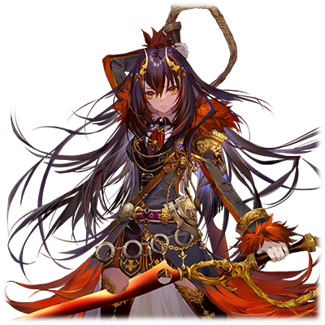
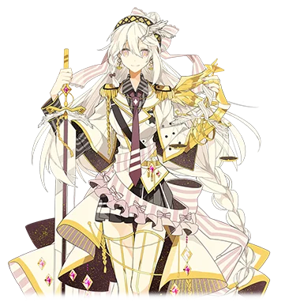
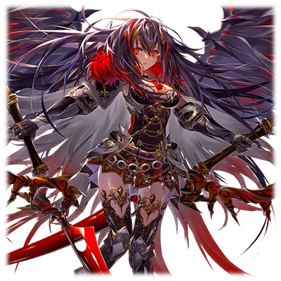

# 西尔维娅斯

  

| 角色信息   |  |
| ----------- | ----------- |
| 名称    | 西尔维娅斯    |
| 年龄   | 不明    |
| 职业 |  奏者
|CV|佐藤利奈
| 对应曲目|folern
|对应版本| Chunithm Amazon

## Episode 1 神速的英雄

>我的名字是西尔维娅斯。虽然人们将我称作“神速的英雄”……但我并不是什么英雄，我只是一个与神为敌的人。

曾经，神明遍布于地上。然而，现在却已是只剩人类存在的世界。而她，就生活于这个世界之中。

西尔维娅斯。拥有着“神速”的别号的她，正是将与神明的一切联系，一切的命运之丝线所斩断之人。

行走于被血染红的大地，手持深邃玄色的黑色剪刀，她就用这把武器将所有挡在眼前的敌人一一杀尽。

那连接着天上的命运之线，在她的眼中未曾消失。

因为那正是身为斩断命运之人绝不会放过之物。她正是为了斩断那丝线，才成为了英雄，成为了奏者。

不过，这还是稍微往前一点的，未来的故事。

少女终有一天会开辟自己的道路，踏遍整个世界，最终挑战神明。

所以，这并不是一个英雄的故事。

而且，也不是属于神明的故事。

这只是一个看得见命运的少女的，永无止境的探求之故事罢了。

## Episode 2 神明的傲慢

>曾经支配着这片大地的神明，舍弃了人类，留下了拥有自己血脉的继承人之后，就回到了天上。

太古往昔，那是神明为了统治世界，而降临于大地之上的时代。

神明与人们共同生活在地上，统治着人们，宣传着正确的道理。

然而，神明与人类的思想终究无法相容，地上的统治就一直处于半途而废的状态之中。

终于，众多的神明意识到了和人类这一种族的不同，放弃了地上的统治，最终回到了天上的世界。

但是，就在这时，神明和人类之间诞生了继承了神明血脉的混血种。神明将对人类的慈爱托付混血种之中，希望他们能够成为人类的希望，成为替代神明的统治者，为人类带来幸福。

然而，即便是继承了神明血脉的混血者，也无法完全统治所有的人类，也无法带领他们前进。

最终，地上只是变得更加混沌，残留于地上的少数神明也失望离去，回到了天界。

就这样，地上最终成为了人类的所有物。虽然在这片荒芜的大地上生存并不容易，但是从神明的枷锁中解放的人们，即便再艰苦，也没有放弃，在这片大地上齐心协力地活着。

## Episode 3 全新的火种

>拥有着神的血脉的“奏者”，是比人类更加优越的存在。终于，神明开始了对奏者以外的人类的肃清。

在这个神已经不复存在的世界中，人们虽然深陷于混沌之中，但仍旧拼命地活着。

然而，即便神明已经退去，神明所留下来的法则和力量却也并未全部消失。

曾经流淌着神明血脉的人们……那些统治着地上的，神明的代行者的后裔们。

那些继承了少许神明力量的人们，仍旧存在于这片大地上。

这些人最终被人称作“奏者”。

他们要么是拥有强大或者特别的才能或者力量，被人称作英雄……要么就是那些仍未释放出来，但已有如此潜力的人们。他们所拥有的力量，正是由神之血这一命运的丝线所联系起来的。

经过漫长的时光，天上的神明开始忧虑起变得无比污秽的大地，决定对人类下达神的制裁。但是，就在这些神明之中，却有一名爱着人类，爱着地上世界，并想要保护这个世界的女神。

她正是审判与正义的星之女神——阿斯特莱雅。她相信人类所拥有的可能性，相信他们正确的心性。而且，比任何人都热爱着这片美丽的大地。

  

于是，她想要在神明降下制裁之前，守护大地，将人类带向正确的未来。

于是，她开始了对奏者们的选别。

## Episode 4 公平的选别

>我从小生活的村庄，在名为阿斯特莱雅的女神所进行的奏者候补的筛选中，只有我被选拔出来，其他的人则……

有一名少女，名为西尔维娅斯。

她从小父母双亡，被贫困的边境小村的寺院所收养。

虽然生活算不上多么好，但是在人们安贫乐道，扶持弱者的教义熏陶之下，西尔维娅斯的精神生活极为富足。而且，她也坚信着，像自己这样的生存方式，才是“正确”的。

然而某天，一名容姿秀丽，和这边陲小镇毫不相配的女人，造访了这里。女人的名字，叫“阿斯特莱雅”。

村人们热情地迎接了她，而她也以温和的笑容回应，并且表达了感谢之情。

西尔维娅斯面对从未见过的来访者，不禁发出了“就像是女神大人”一样的感想，躲在角落偷偷地看着。

就在那天傍晚。阿斯特莱雅露出了一副悲伤的表情，向着村民们，用澄澈的声音，用着宛如歌唱一般的声调，向着大家宣告着。

“各位，真的很对不起。从现在开始，整个世界将要开始选别的进程。我所能做的，就只有为你们能够被选中而祈祷了……希望各位，都是被神所加护的人们……”

阿斯特莱雅单膝跪地，向着天上祈祷。接着，天上降下了一柄缠绕着火焰的剑。

西尔维娅斯，开始对眼前发生的一切，感到不解。

为什么，整个村子都陷入了一片火海？

为什么，在自己的眼前站着那名女人呢？

为什么，村里的其他人都——

## Episode 5 神位的篡夺者·西尔维娅斯

>阿斯特莱雅竟然把这样的“选别”称之为正义。像这种自以为是的神明……我是绝不会认同的！

除了阿斯特莱雅和西尔维娅斯以外，其他的村民们，在一瞬间就被火焰所包围。

“大家……大家都怎么了！”

在常人都难以承受的突发状况之中，西尔维娅斯却很快就从恐慌中恢复了过来。

“大姐姐！快救救大家啊！再这样下去的话……再这样下去的话……！”

虽然西尔维娅斯拼命地哀求着，但是阿斯特莱雅并未做出反应，只是默默地闭着眼睛祈祷着。

然后，等到火焰散去，阿斯特莱雅睁开了眼睛，向着幸存下来的西尔维娅斯施以祝福。

“想必你的内心此刻应该是无比痛苦的吧……。不过这样的话，就代表你被选中了。恭喜你。”

面对刚刚发生的惨剧，到底有什么好庆贺的？西尔维娅斯完全无法理解眼前的女性所说的话。

“真的很对不起……。那道火焰，是‘审判之炎’……不过请放心吧。被这个世界选中的你，是不会被这道火焰所灼烧的。”

阿斯特莱雅仍旧维持着平静的表情，阐述着由这个世界所下达的裁决。

“能够守护这片大地的，能够将人类的历史带向正确的道路的人……那些被称作‘奏者’的人们。能够从这片大火之中幸存的你，正是拥有奏者资格的人。”

阿斯特莱雅露出悲伤的表情望着西尔维娅斯。

“……等等……难道你是在说，村里的那些人，只是因为没有奏者的资格，就得被火焰烧死吗？”

“不要憎恨我。他们只是被这个世界所筛选了而已。”

“别开玩笑了！”

“虽然不是不能明白你的心情，但是为了保护这片大地上的人类，需要的是能够做出正确的决断的人。我是守护天秤的女神……而我的所作所为，都是为了拯救更多的生命，由这个世界所下达的决定……”

“正确什么的……这哪里算得上正确了啊！”

西尔维娅斯，并未认为这些村人们做错了什么。

“我是绝对不会认同你的想法的！你才不是什么‘正确’的象征！”

“我是正义的女神，所以是绝对正确的……不过，我也知道另一个事实。那就是‘正义’是以各不相同的形式所存在的……。如果你想要证明属于你的‘正义’的话，那就先成为‘奏者’吧。”

“……成为‘奏者’的话，就能够杀掉你了吗？”

“嗯嗯。成为‘奏者’的话，就代表距离神进了一步……而身为奏者，是有资格质问‘正义’的所在的。”

在这之后，似乎又说了些什么的样子，但是西尔维娅斯的脑中已经听不进一句话了。

最后，艾斯特莱雅离开了这里。

站在被火焰完全烧毁，只剩下残垣断壁和灰烬的村子中，西尔维娅斯指天发誓。

“……我发誓，一定要成为奏者，然后，将阿斯特莱雅……将这些神明们一一杀死！”

## Episode 6 讨伐“正义”的正义

>我憎恨着神明的正义，所以我不停地锻炼自己，不停地战斗，拯救了许多人。最终，我被人当成了英雄，被他们所盛赞。

就这样，西尔维娅斯开始了复仇的旅途。

在踏遍世界的旅途之中，西尔维娅斯意识到了自己迄今为止所生活着的世界是多么的美丽。

有着那些让孩子拿起武器参加战斗的人们，也有万事皆靠暴力手段解决问题的城镇。这些东西，就已经足以让身负心伤的西尔维娅斯改变想法了。

原来如此，还真的和阿斯特莱雅以及其他的神明们所说的那样，人类说不定真的是无比愚蠢，污秽，足以毁灭大地的存在呢。

“但是，像你们这样傲慢的神明，是没有资格毁灭这片大地的！”

在战场上，她夺去了无数的性命，向着神明呐喊着。西尔维娅斯踏遍了无数的战场，寻找着神的痕迹。

随着她不停战斗，沉睡于体内的神之血也愈发显露出其力量，让她距离神又近了一步。

随着西尔维娅斯体内的神之力越来越强大，她也愈发憎恨着神明。

而她所憎恨的对象并不只有神。那些盲目信仰着神明的人类，对她来说也是深恶痛绝的存在。

“既然能够统治世界的是阿斯特莱雅的话，那么破坏这个世界的也是阿斯特莱雅！”

“不要以神之名称呼他们！他们不过是一群什么用处都没有的乌合之众！身为人类，能信任的东西，就只有自己的力量而已！”

西尔维娅斯的心中燃烧着黑暗而滚烫的复仇之火。历经了无数的战火，从无数次的死战之中生存归来的她，不知何时，被人冠以“英雄”之名。

然后……她终于成为了奏者，前往了将神诛杀的战场。

## Episode 7 天选之人的战斗

>既然为了见到神明就需要从奏者中选拔出最优秀的人的话，那么，只要将那些同等的英雄们一个不留地杀死的话，总有一天……！

“奏者”的宝座，那是为了引导地上的人们，由神所准备的，属于神的代行者的位子。

而作为能够接近神明的第一步……她来到了曾经神明从大地上退去的神殿之中。

站在西尔维娅斯周围的，是同样想要接近神明的人们。他们都是和西尔维娅斯一样，被神之血脉这一共同命运所联系在一起的，穿越了无数战场的“英雄”们。

不知从何时开始，西尔维娅斯从那些与自己相同的人们之中，看到了一条自己同样也拥有的，丝线一样的东西。

那条丝线伸向无垠的天空之中，伸向那云层之上无法触及的高处……那条线究竟伸向何方，她很清楚。

那条丝线，伸向的是诞生了众多她所憎恨的世界的法则的神明们。而这些神明们所产生的命运之线，将无数的“英雄”们联系到了一起。在这些人中，有被众人所尊重的人，有居功自傲之人，也有被寄予希望之人……知道了如此多的“英雄”存在的西尔维娅斯为此感到惊讶，甚至感到了有些恶心。

“只有被神所选中的人们，才能享受这个世界的恩泽？……这些不过是你们这些被选中的幸存者们才说的出口的话啊！”

西尔维娅斯脑内浮现的，是那些被制造了整个世界的神当成“恶”，当成不必要之物，无情烧毁的，家人们的身影。

西尔维娅斯拔出了剑，指向了那些和自己敌对的“英雄”们。

“我绝对会成为奏者……将神，将阿斯特莱雅，杀死！胆敢阻止我的人，杀无赦！”

## Episode 8 胜利收于我手

>最终，我将众多英雄打败，再也没有人能够阻碍我了……来吧！神啊，将我选为“奏者”吧！

虽然英雄们群起而攻之，但是在西尔维娅斯的赤红刀刃下，都纷纷落败。

被飞溅的鲜血染成一片鲜红的她，露出了不详而疯狂的表情。

西尔维娅斯认为如果要将地上和神明之间的联系全部斩断的话，即便要将这里变成血流成河，尸山血海的地狱，她也在所不辞。

……最终，在这片凄惨的厮杀之中，那些只是抱持着半吊子的觉悟来到这里的英雄，都被西尔维娅斯鬼神一般的身姿所战栗，再也不敢上前争夺。

她的灵魂，压倒了无数的英雄，绽放出了更加鲜红，更加耀眼的光芒。

“……来吧！选择我吧！”

就像是呼应着她一般，空中降下了光芒。生着翅膀的神的使徒，降临于西尔维娅斯的跟前。神的使徒露出了轻蔑的表情，说到。

“沉浸于鲜血之中，可恶又忌恨的人之子民啊……如果想要成为真正的奏者的话，那就打倒我，展现尔等的正义吧……这就是最后的试炼！”

“……正合我意！”

西尔维娅斯甚至都等不及将脸上的鲜血擦净，立马扑向了一身纯白的神之使徒！

## Episode 9 鲜血之奏者

>当我将身为最终试炼的神的使徒们一一葬送之后，我终于成为了奏者！然后，天界的大门终于向我敞开！

——最终，两者斗了个两败俱伤。

在一场激战之后，神的使徒的身体已经被鲜红色的血染透，失去了双翼的使徒，已经无法再支撑身体的站立了。

西尔维娅斯的身上也被打穿了几个大洞，生命也宛如风中残烛。

现在，两边甚至连将对方置于死地的力气都没有。

然而，双方的战意却丝毫没有消散。神的使徒为的是将自己创造出来的创造主，而西尔维娅斯则是为了前往仇敌·阿斯特莱雅的所在。

为了打倒眼前的敌人，从而完成自己的目的的两人摆好了架势——一闪而过，各自挥舞出了最后的一击。

“嘎哈……”

随着血液喷涌而出，神的使徒，应声而倒。

神之使徒已然绝命，纯净无比，未曾沾染污秽的血液滴入大地。一道光芒照向了遍体鳞伤，跪倒在地的西尔维娅斯。

然后，刚刚还奄奄一息的西尔维娅斯的身体，就这样慢慢地恢复了伤势。不但如此，身体的力量还在上升，甚至超越了平时的极限。

是的。她终于拿到了“奏者”的力量。

  

“是吗……终于到了这个时刻……！”

成为了奏者的西尔维娅斯，举手指天，号令着天界的大门快快敞开。

通往天界的道路，现在终于打通了。

## Episode 10 与正义女神的再会

>阿斯特莱雅，我就是为了这一刻，才活到现在的。既然你们神明自诩“正义”的话，那要我成为“邪恶”，也在所不辞！

天界的门，在西尔维娅斯的面前敞开。然后，那些仍然幸存的英雄中，走出了一些人，并且愿意跟随西尔维娅斯一同前行。

在他们之中，也有和西尔维娅斯一样，发誓向神明复仇，从神明的力量之中解放的人存在。

“……想跟的话，随你们便。”

穿过了天界的大门，一个声音传了过来。

“……西尔维娅斯。你终于来到了这里了啊。”

“……”

这个声音，她绝不会忘记。

“阿斯特莱雅！！！”

“今天，既是一个悲伤的日子，又是一个欢喜的日子。迄今为止，我从未有和任何人拥有如此深厚的‘联系’。但是，现在的你我之间，正由‘憎恨’，这一无比强烈的意志而联系在一起。对你来说，说不定并不是神明所预想中的，能够带领人类前进的英雄也说不定。不过，既然人们靠他们的意志选择了你，而你也走到了这里……那么，身为代表着神的正义的我，就必须向你的‘诞生’而祝福了……”

……真是肆意妄为的说法。不对，说不定本来神明看待事物的角度就和人类完全不同。毕竟，她从生来就不是人类，而是神。

“阿斯特莱雅哟……既然你们神明自诩为这个世界的正义的话。那么，要我成为邪恶，我也没有意见。以恶之名，阻止正义的暴虐行径！”

“既然这是属于你的正义的话……我明白了。”

阿斯特莱雅的声音就此中断，一道覆盖着淡淡光芒的，通往神域的阶梯出现了。

站在顶上的，正是真正的阿斯特莱雅。

## Episode 11 绽放的恶之花

>我要靠这把剑将神明的世界彻底葬送！将他们全都破坏掉，开创全新的时代啊！

在西尔维娅斯的眼前出现了通往神明的通路。而在这阶梯的顶端，阿斯特莱雅正镇坐于天穹之顶。

而在她周围的，则是那些由她所祝福的，被她所选中的“奏者”们。

“……要上了！”

西尔维娅斯握紧长剑，和同伴们一起爬上了阶梯。为的是破坏掉这个产生奏者的法则，结束神明的时代。

“这把剑，就要将你，阿斯特莱雅，还有地上与天界的一切联系都斩断！你就乖乖前往另一个世界吧！”

“啊啊……我能感觉得到……这股纯粹无比，充满了复仇心的正义……这正是世界的法则所给出的答案……正是我等最为恐惧的东西。果然，你正是对人类来说，无比相称的‘英雄’呢……！”

……正义与邪恶。这是随着人看待的角度，正邪之间都会发生逆转的战斗。

而在那里，没有标准的答案。

所以，这并不是英雄的故事，也不是神明的故事。

一边是忧虑地上，不愿被那些搅乱世界的人们将地上缓缓带往灭亡与停滞的神明。另一边，则是希望维持自己的意志，在这个世界之中决定坚强地活着的人类，被这绝对无法违抗的命运所玩弄的，神与人的记忆。

——从结果上来看，人与神，终究不是一条道上的存在。

而结果是她将神斩于刀下，还是神明的正义最终取得了胜利，仍旧统治着我们呢。最终的结果无人知晓。