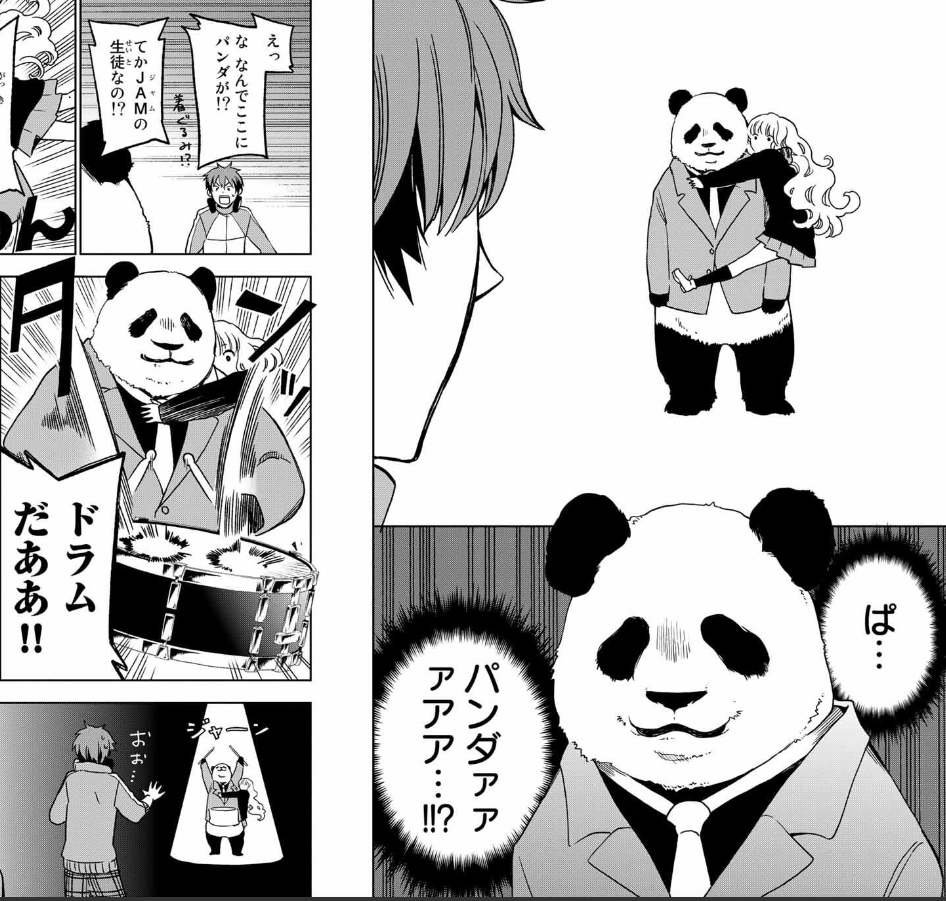

# 星河歌/不死原求

| 角色信息   |          | 角色信息   |          |
| ----------- | ----------- | ----------- | ----------- |
名称|星河歌|名称|不死原求|
年龄|15岁|年龄|15岁|
职业|学生|职业|学生|
初出|Chunithm AIR
对应曲|後夜祭

注：两个人物为田口囁一的漫画《フジキュー!!!　～Fｕｊｉ Cｕｅ’ｓ Mｕｓｉｃ～（汉化名：富士急）》里的男主角与女主角。该漫画讲述了为了加入梦寐以求的摇滚乐队，入学了日本国立音乐学院的主角·不死原求，在学校内突破难关，为梦想而努力的故事，共4卷，已完结。

虽然身为别的作品的角色，然而在游戏中也同样被视为CHUNITHM AIR的角色，是全游戏中少见的外部作品却与原创角色并列的情况。

此人物故事为漫画的外传故事，是以女主角星河歌为主视角写的。

## Episode 1 星河歌

>明明我无法在他人陪伴下享受音乐，却还想从事音乐相关的事业……这样是不是不对的呢？

我从未想过自己为何会弹奏钢琴。因为对我而言，这就如同呼吸一般自然而平常。至少在那一天之前是这样的。

幼时，在钢琴比赛现场发生了某件事。

当时，我正在弹奏着钢琴，无数人的目光正注视着我，随着我慌了一下，便有越来越多的眼睛饶有兴致地看着我，就这样愈演愈烈……。从那天起，我便再也无法在众人面前演奏了。

音乐曾让我陷入低谷。但将我从中拯救出来的，同样也是音乐。

那是一首正在电视里播放的某支乐队的歌曲。那首歌欢快得有些傻气，听着却那么的美妙。尽管我依旧无法在他人面前演奏……但我也想奏响那样的音乐！……我是这么想的。

 

“明明我无法与别人一同享受音乐，却还想从事音乐相关的事业…… 这样是不是不对的呢？”

## Episode 2 通往梦想的道路 

>能知道如何接近梦想，是一件非常幸福的事哦。

Japan Academy of Music，通称 JAM。

这是为了给低迷的音乐产业注入活力，由大型唱片公司与国家联合设立的音乐高等专科学校。

如今在这个国家，想从事流行音乐行业的人里，没听说过这所学校的人寥寥无几。

我所憧憬的那支乐队的成员们，以及其他音乐界人士，大多都与这所学校有着不解之缘。

一直沉浸在古典音乐世界里的我此前对此一无所知，但如今的音乐界似乎早已是这样的格局。

 

这是一所奉行超实力主义、竞争残酷的学校。学校本身就如同一个小型音乐界。入学与毕业的门槛都极高。

朋友们都劝我放弃，但我一定要去！

 

“能知道如何靠近梦想，是一件非常幸福的事哦。既然知道了，接下来就只剩挑战了嘛！……至于能不能成功，那就是另一回事了……嘿嘿”

## Episode 3 笨拙二人组 

>就算是谎言也没关系。因为我，正因这句谎言而感到了真实的喜悦。

明明因为入学考试时被众人注视着，我根本无法正常演奏，但我却不知为何奇迹般地合格了，得以进入 JAM 就读！

学校立刻给我们新生布置了一项任务：与学校指定的伙伴组队进行舞台演奏。

据说，这是因为商业音乐无法一人完成，所以校方才希望我们能够提前适应团队协作的氛围。

像我这样无法在他人面前演奏的人，舞台表现全取决于搭档的能力。然而，与我组队的，却是入学考试中的 “吊车尾”、笨拙的吉他手——不死原求（大家都叫他富士急）。

富士急虽然确实笨手笨脚的，却对我说他喜欢我弹奏的音乐。尽管我们俩都如此不完美，但无论如何，我们都要站上舞台完成演奏！

 

“就算是谎言也没关系。因为，我因这句谎言而感到喜悦的心情是真实的。只要有哪怕一个人说喜欢我的音乐，我……就会继续坚持下去”

## Episode 4 光芒之中

>舞台好可怕……人们好可怕……视线……光……声音……甚至连我自己的音乐都让我感到恐惧！但是，现在……

欢呼声与璀璨的灯光如期而至，仿佛在迎接我们的登场。

上一组表演的双人组合似乎把现场气氛炒得火热。

我们是不是也能做到呢……结果也唯有天知道。

 

“准备好了……上！”

 

以富士急的这句话为信号，我按下了琴键。

我的脸上戴着为了掩饰在众人面前的紧张而准备的面具。我很清楚，这个主意看起来很傻，但我除此之外别无他法。

缓缓开篇的乐曲逐渐变得激昂，观众、我还有富士急，不知不觉间融为一体。

享受音乐本就无需任何附加条件。是从什么时候开始，连这般理所当然的事都被我遗忘了呢。

我在这里！我的旋律也在这里！

 

“我害怕舞台……害怕人群……害怕那些目光……那些灯光……那些声音……害怕我自己的音乐…… 我好害怕！曾经无比害怕！但现在…… 我有了能支撑我的伙伴。此刻，这份温暖比恐惧更让我心动！”

## Episode 5 并非一人

>我憧憬的是一个完整的乐队。带着鼓手、贝斯手、吉他手，以及歌手！啊，偶尔也会附带个键盘手就是了！

“我们组个乐队吧！”

 

富士急说出这话时，距离那场演唱会的热度消退已经过去好几天了。

他甚至没确认我的想法，就已经把我当成乐队成员，开始盘算着寻找其他成员的事。真是个怪人。不过，会为他这份古怪感到开心的我，大概也一样奇怪吧。

 

“难道星河你不喜欢乐队吗？”

 

或许是察觉到我的反应有些冷淡，富士急关切地问道。

我怎么会不喜欢！怎么可能不喜欢！

 

“我一直憧憬的就是乐队啊。要有鼓手，有贝斯手，有吉他手和主唱，有时候还会有键盘手！我已经不想再只有一个人了……”

 

话音刚落，一个手持鼓棒、穿着熊猫玩偶服的身影从旁边走过。

熊猫？为什么是熊猫？

那个熊猫要打鼓吗？打得好吗？

我心里满是疑问，但还没等想出答案，身体就已经不由自主地行动起来。

 

“熊猫先生，和我们一起组乐队吧！”

## Episode 6 寻找伙伴

>如果因为所有的存在都终将消失，就觉得没有意义的话，那我们的生命不也是一样的吗？

成功邀请到熊猫先生担任鼓手加入我们后，接下来我们需要寻找的是贝斯手。

既然要招入伙伴，我当然希望能找个合得来的人，但富士急看中的，却是一个性格阴郁又显得很固执的男生——溺谷君。

富士急说他从溺谷君身上 “感受到了摇滚的灵魂！”，不过说实话，我有点搞不懂他在说什么。男生真是种不可思议的生物。

富士急想尽各种办法劝说溺谷君加入。我也打着帮忙的旗号被他拉去玩了角色扮演，不过我敢肯定，这根本就是富士急自己的兴趣爱好罢了……

面对我们这般契而不舍的邀请，溺谷君终于开口了——

 

“摇滚乐队这种留不下历史印记、毫无价值的音乐，根本不值得去做！”

 

嗯。说实话，他这话确实戳到我了。

 

“如果说终将消逝的东西就没有意义，那我们的生命不也一样吗？就算是看似愚蠢又无聊的事物，也绝不可能是毫无价值的！”

 

溺谷君的眼神仿佛在问我：你疯了吗？当然没有。我之所以来到 JAM，就是为了证明这一点。

## Episode 7 真实的自我

>音乐当然不止只有快乐，我知道。但是……要是没有快乐的话，也不会称之为音乐了，我是这么想的。

溺谷君加入后，我们的乐队变成了四人组。虽然他到最后都摆着一副 “勉为其难加入你们吧” 的态度，但其实他只是个不擅长人际交往的音乐迷，内心很渴望伙伴的。这一点我可是看得明明白白哦，哼！

好不容易凑齐了乐队成员，可在 JAM 根本没有悠闲度日的时间。我们立刻就报名参加了为登上学园祭主舞台而举办的选拔试镜。

就在那里，我遇到了一个人。

“终于见到你了，星河歌。”

 

她知道我过去的样子。她自称西园寺港。

她彻底改变了自己，塑造出了一个具备商业价值的自我。变化之大，甚至让我认不出过去的她了。

她所做的音乐，不是为了享受，而是为了走红。

她是对的。至少在这所 JAM 里是这样。但我却……

 

“音乐当然不止只有快乐，我知道。但是……要是没有快乐的话，也不会称之为音乐了，我是这么想的。”

 

我们要保持自己的本色，登上学园祭的舞台！

## Episode 8 随着心中的想法，歌唱

>一定存在能让我们保持本真的地方。让我们一起去寻找吧！

一场始料未及的首次登台。这是我们四人全员到齐后的首场演唱会。

这是由西园寺发起的双人联合演出活动。但实际上，这根本不只是一场普通的演唱会，而是一场赌上自尊心的较量。富士急他们个个斗志昂扬，可说实话……我完全提不起劲。我既不明白西园寺为何将我视为眼中钉，可只要身处 JAM，就不得不参与演唱会。没办法，我们只好在录音棚里埋头苦练数日，全力备战这场演出。

台下的观众几乎都是为西园寺小姐的乐队而来的。根本没人对我们抱有期待，我们完全处于客场劣势。不过没关系！我们这些入学考试的 “吊车尾”，早就习惯了这种不被看好的处境！……虽然说出来还挺心酸的。

我们正通过音乐，一点点拉近与那些对我们毫无兴趣的观众之间的距离。

初次见面，大家好，请多指教。

虽然不存在能打动所有人的歌曲，但我们依然要放声歌唱。遵循内心的指引去唱。

初次见面，大家好，请多指教！

 

“一定存在能让我们保持本真的地方。让我们一起去寻找吧！”

## Episode 9 演奏的理由

>想看到从未见过的东西，想听见从未听过的声音。只是这样的想法……难道不够吗？

从事音乐的理由。在商业音乐学校 JAM 就读的理由。最近富士急似乎正为这类问题烦恼不已。向来不假思索一路走到现在的他，第一次遇上了难以跨越的障碍。

我们每天都在与各种阻碍碰撞交锋——有时跨越过去，有时强行闯出一条路…… 偶尔也会萌生放弃的念头，却依然在坚持前行。对我而言，最大的障碍是无法在他人陪伴下享受音乐。一旦站在众人面前，过去的创伤就会复苏，让我无法流畅演奏。但如今，即便是这样的我，也拥有了伙伴。熊猫先生、溺谷君，还有富士急。

 

“星河，你为什么会在这里，又为什么要继续坚持音乐呢？”

 

这个问题的答案，想必终究要靠自己去寻找。但富士急是我的恩人，我无论如何都想为他出一份力。毕竟我们只是一群痴迷音乐却又对音乐一知半解的家伙啊。

 

“我想亲眼看看从未见过的风景，亲耳听听从未听过的旋律。单凭这份心意……难道还不够吗？”

 

我真心希望，事实能如我所说的这样。

## Episode 10 距离决胜，还有少许

>我能够邂逅音乐……邂逅大家，真是太好了……

我们收到了入围学园祭的主舞台决赛的邀请。

虽说 “晴天霹雳” 这词听着像坏消息，但对我们而言，除此之外实在找不到更贴切的说法来形容此刻的心情。一支刚组建不久、还有两名 “问题成员” 的乐队，竟然能成功闯进决赛，这简直难以置信。

 

“咱们来制定一套冲刺决赛的方案吧。不过，得是属于我们的风格。”

 

这场由溺谷君主导的战术会议，最终演变成了一场以会议为名的晋级庆祝会 —— 熊猫在一旁闹个不停，溺谷君忙着制止，富士急又跟着添乱，热闹非凡。

突然，富士急的手碰到了我的脸颊。我吓了一跳，猛地后退了一步。映入眼帘的，是他满是担忧的神情，以及他指尖沾着的水珠。

水珠？啊，我竟然在哭吗？

熊猫、溺谷君、富士急，所有人的目光都聚焦在我的眼睛上。

 

“能与音乐…… 能与大家相遇，真的太好了。”

 

距离决赛，就只剩最后一小段路了。

## Episode 11 即便是神明也罢

>明明我无法在他人陪伴下享受音乐，却还想从事音乐相关的事业……这样是不是不对的呢？

舞台帷幕后，能清晰感受到许多人的气息。饱含期待的欢呼声与热烈的氛围，源源不断地传递到这里。

溺谷君正全神贯注地调整状态，熊猫则依旧是那副标志性的熊猫模样。至于我和富士急，正在为我待会儿登台要戴的面具做准备。

说到底，我直到今天还是没能克服内心的创伤。一旦站在众人面前，不戴面具就无法好好演奏，我真是个糟糕的钢琴手。

我忽然转头问身旁的富士急。

 

“明明我无法在他人陪伴下享受音乐，却还想从事音乐相关的事业……这样是不是不对的呢？”

 

听了我的话，富士急摇了摇头，笑着说道。

 

“音乐才不是这么心胸狭隘的东西呢。”

“即将正式开场。” 听到工作人员的通知，我们一同站起身来。帷幕缓缓拉开，刺眼的灯光直射眼底。今天的演奏能否顺利进行，或许只有神明才知道……不，不对。

 

即便神明，此刻也无从知晓答案。

因为这是属于我们的音乐，是由我们亲手奏响的、独一无二的旋律啊。对吧？