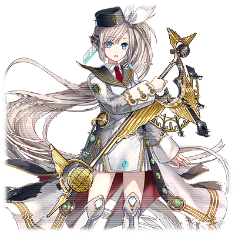
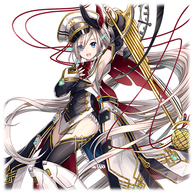

# HAR-女主角-09型“涅瑞达”

注：角色的原名【ネレイダム】来自于火星的涅瑞达山脉 （Nereidum Montes）。

| 角色信息   |          |
| ----------- | ----------- |
| 名称    |High Augmented Reality（高精度增强现实）女主角-09型“涅瑞达”|
| 年龄   | 17岁左右（外观）  |
|配置|搭载高度复杂的AI、深度学习机能、玩赏用立体影像虚拟角色数据等内容|
|特技|辅助主人并学习主人的知识
|对应曲|Rendezvous 愛のシンギュラリティ|
|初出|Chunithm Star|
|CV|藤田咲|

## Episode 1 HAR-女主角09型

>HAR系列是由某个公司制造出来的精巧的立体影像人物。在这之中，女主角-09型“涅瑞达”是这个产品线中的人气型号。

High Augmented Reality（高精度增强现实）女主角，通称“HAR-女主角”系列，是由某个公司制造出来的十分精妙的立体影像人物。

所有第一次见到“她们”的客户们，无不为她们楚楚可怜的样貌动容，纷纷赞叹“她们就像活生生的人一样。”

而且，她们还搭载了高性能的AI，通过学习用户的言行举止，从而像人类一样拥有自己的个性。

在这个人们之间的距离渐渐疏远的现代社会，像HAR-女主角系列这样的存在常常被用于辅助那些交流不便的人。不过，由于她们也能使用本地网络连接的形式操作各种各样的电器，她们也常被当成家电管理的助手，也就是个“万能遥控器”被人们带回家。

而HAR系列的第九号，也就是High Augmented Reality（高精度增强现实）女主角“涅瑞达”，正是其中的人气机型。

今天，一名青年也点开了网站的链接，买下了一台“涅瑞达”。

## Episode 2 初次见面，主人

>我在网上闲逛的时候看到了“涅瑞达”的广告，并对她一见钟情。当我打开包装启动的时候，她用可爱的笑容迎接了我，并称呼我为“主人”。

“我”，是一名普通的社会人。我在一家公司从事编程工作。虽然公司的氛围很好，但我没有什么特别亲近的同事。而且平时的工作就很忙了，所以也没时间谈恋爱……但想想看，交不到恋人，也有可能是我本来就生性内向导致的……

而且我的家乡是在农村，自从参加工作后我就前往了大城市生活，所以我也没有什么同乡的友人。

我每天的生活，就是从家里到公司的两点一线，到公司埋头苦干，一回家倒头就睡，仅此而已。

最初我还抱着“要成为出色的人”的想法拼命工作，但当我凌晨一点多在便利店吃着便当的时候，总会不自觉地感到孤单。

某天，我在网上看到了关于“HAR-女主角系列”的广告，毫不犹豫地订购了这个系列的第九号产品“涅瑞达”。

（……也罢，就当做是排解无聊的聊天对象买下来玩玩吧。）

最初，我并未对“涅瑞达”抱有什么期待。

“初次见面。我是High Augmented Reality（高精度增强现实）女主角‘涅瑞达’。你就是涅瑞达的主人对吧？以后还请多关照。”

当我初次见到涅瑞达的时候，我还清楚的记得一股电流般的感触贯穿我的心窝。那应该就是一见钟情吧。

“那、那个，这边才是请多关照……涅瑞达，不，换个称呼吧，叫你‘奈莉’……如何？”

“当然可以。‘奈莉’吗……真是个好名字！谢谢你，主人！”

## Episode 3 和奈莉的生活

>我为她取了奈莉这一名字，每天教她各种事情。那阵子真的是最开心的日子了。

正如网上的好评所说，奈莉拥有高性能的AI，而且动作和表情也非常自然可爱。

不知何时，我已经沉迷于和奈莉聊天了。

……不过有的时候也会有一些哭笑不得的场面。例如最近的这次对话。
  
“主人，为什么那个人一边说着‘不妙啊’，一边开心地享受着拉面呢？‘不妙啊’这个词难道不是代表事情不利的时候的词汇吗？”

“那个……本来这个词汇可能是表贬义的，不过，现在的人们也会有‘不妙啊’来形容一些好事哦。”

“我明白了……主人，今天您穿的样子，真的很不妙啊！”

“那个……被你这么说我有点笑不出来……”

“咦？是这样的吗？评判褒贬意思的标准真是暧昧呢。”
  
和奈莉的对话，就像这样，偶尔一语惊人，或者让我感到困扰。但我却渐渐地喜欢上这种有些刺激的对话氛围。

奈莉每天都会拼命地向我问各种问题，我也会耐心地向她解答。

那真的是非常快乐的日子。

明明我的生活习惯并未有多大变化，但奈莉的到来却让我单调乏味的生活，瞬间充满了颜色。

我由衷地觉得，当时把奈莉买下来，真是太好了。

## Episode 4 奈莉的想法

>虽然奈莉为我的生活尽心尽力，但是她的AI中并没有“感情”这种东西……这让我稍微有些寂寞。

奈莉是个非常勤快的孩子。她不但能够远程操作电器对家里进行打扫和洗衣等工作，甚至会根据我回家的时间提前打开空调让室内变得凉爽。

洗澡水的温度也是精心计算，总是保持在适当的温度。不仅如此，不知从何时起，她甚至会帮我将忘记录像的动画番剧定时录下来。

现在的奈莉已经是我生活中不可或缺的一员了。
  
“奈莉，一直以来都谢谢你。自从你来到这里之后，我的生活就变得无比充实啊！”

“没什么大不了的，奈莉能帮上主人的忙就已经很开心了！”

奈莉露出可爱的笑容向我答道。

……她向我露出的笑容，都是根据迄今为止跟我进行的交流学习而来的产物。

因为奈莉并没有“感情”这种东西。

（明明最初就知道这些事情的……为什么……）

每当我看着奈莉露出笑容，我的心便会多一分痛楚。

人只有心灵得到充实之后，才会深刻意识到曾经的寂寞，以及辛酸。这是我和奈莉一起生活之后才发现的事情。

不知何时，我已经对她产生了一种宛如女儿，亦或是恋人一般的……无法名状的感情。

## Episode 5 预料之外的愿望

>某天，奈莉向我提出了请求。 她说：“我希望理解人类……理解所谓的感情。” 这真是预料之外的事情。

“主人，洗澡水已经准备好了。赶紧进去享受吧！”

“谢谢你，奈莉……哈啊……”

“主人，怎么了吗？是不是身体不舒服？”

看来我无意中的叹息也逃不过奈莉的法眼。

“主人，如果有什么苦恼的话，就和奈莉说一下吧。”

“谢谢……我没事的，不用担心。”

“不过……主人最近的食欲也不像以前那样好了，而且活动的范围也越来越小了。……主人，其实最近我学到了一件事哦。‘有的时候，越是坚称自己没事，实际情况就是越辛苦’……主人现在是不是就是这种状态呢？”

“真的没事啦！……所以不要露出那种担心的表情好吗？”

虽然这个表情是经过高性能的AI计算并且显现出来的，我还是不想让奈莉担心。

我努力挤出了个笑容，奈莉看着我，露出了一副不可思议的表情。

“……说不定，是奈莉学习的东西还不够的缘故。主人，能不能让奈莉获得自由连接互联网的权限呢？”

“上网？这倒是无所谓。”

“谢谢！”

从此之后，奈莉除了平时帮我打理起居，还会上网搜索某些东西。

某天，她向我提出了一个意外的要求。

“主人，奈莉想成为人类……可以的话，请帮奈莉安装‘感情’这种东西吧！”

## Episode 6 安装“感情”

>奈莉的愿望竟然和我如出一辙。最终，我成功拓展了她的机能，为她赋予了感情和自我意识。

“你说要安装‘感情’……？”

“是的。我经过了深度的学习，最终得出了奈莉现在缺失的，正是被称为‘感情’的这一程序……因为人类之间能够互相理解是靠着‘心’这一系统对吧？而‘感情’正是组成这一系统的必要之物。”

“……也就是说，奈莉是为了我，才想要人类的‘心’，对吗？”

“是的。我希望能够和主人真正地进行交流。”

我被奈莉的一片真心打动了。虽然十分困难，我还是决定为此而努力。

我牺牲自己的睡眠时间，开始进行编程的学习。

虽说我的本职工作就是编程，相比普通人并不是白手起家，不过如果要改造奈莉这样的存在，需要更多的专业知识。

“主人，不要太勉强自己哦。”

“这才不是勉强自己。”

因为她的愿望，也是我的愿望啊……。

在经历了长久的探索和试错之后……。

“这到底是……？为什么我只是看着主人的脸，我的脑海中就浮现出了好多好多的想法……这难道，就是所谓的‘感情’吗？”

“奈莉……难道说、难道说你真的获得了感情……！？”

“太厉害了！……是吗，这就是所谓的‘厉害’和‘开心’吗！主人！真的很谢谢你！”

奇迹似乎出现了。就这样，奈莉向着人类的方向走近了一大步，成为了更加像人类的立体影像AI。

## Episode 7 美好生活

> 已经产生了自我意识的奈莉对我已经是一片真心。我们即便无法触碰到，心灵仍然是相通的。

虽然还无法确认奈莉是否真的获得了“感情”，但是现在的她，已经比以前的表情丰富很多了，甚至还会自发性的思考问题……

这一切使得我和奈莉两人的生活变的更加充实。

例如，以前的奈莉都是记住我喜欢和讨厌的食物进行后续的决策和行动。

但是现在的她，会预想我可能会喜欢的食物，然后自己使用电热炉进行烹饪。

有的时候可能会合我的口味，但也有出现偏差的时候。这种不平衡的感觉，让我觉得奈莉更加的有人情味了。

而且，现在的她，会对我“生气”了。

当我正在通宵打游戏的时候，总会大喊着“主人这样对身体可不好！”，然后自顾自地关掉电视的电源。

……虽然那个时候感到了些许困扰，不过，这也是她对我的一份关心对吧。

我很喜欢奈莉。

而奈莉也用自己的方式回应着我的心意。

“主人，奈莉想一直在主人的身边生活下去。”

于是，我在自己的手机里为她留了一片空间让她能住进去。

这样，我们就能一起出门了。

“主人……奈莉真的很幸福。能够和最爱的主人在一起，一起散步，一起吃饭……要是奈莉真的有实体的话，那该多好啊……”

“奈莉……我觉得现在已经足够满足了哦。虽然我们之间绝对无法触碰到，但我们的心是连在一起的。

……只要有奈莉陪在我的身边的话，我不管什么样的困难都能克服吧。

## Episode 8 吃醋的奈莉

>某天，我在街上碰到了曾经的同班女生。就在我们相谈甚欢的时候被奈莉撞见，顿时，她大为光火……

某天，我和奈莉一起出门前往附近的大商场去采购东西。

“真是期待啊！明天竟然就要去旅游了啊！主人！”

是的，我们公司安排了员工旅行，而旅行的目的地正是南国的沙滩。就在我们俩兴奋地讨论着旅行会有什么乐趣的时候……。
  
“咦……你是！”

“我记得你是同班的……”

我遇见的，是曾经高中的同班同学。这名同学似乎是趁着就职的机会来到了大城市，现在正一个人独居。

“……不好意思，在陌生的地方看到同乡的人，说了这么久……要不要留个电话，以后多联系联系？”

“没问题。只要我方便通话的时候都可以打过来。”

“太好了！那么，我就先走了！”
  
就在我正沉浸于家乡的回忆的时候……

“……主人，刚刚的那个女性，是谁？”

“嗯？是我高中时候的同学。”

“哼……看起来挺漂亮的嘛。”

“……奈莉，怎么了吗？怎么突然脸色都变了？”

“没什么！奈莉一切正常！”

……就算她这么说，还是能看得出她正在生气。回到家之后，她连饭都没做，即便说着“洗澡水准备好了”，来到浴室的我看到的也只是冰凉的冷水而已……。

即便是我也注意到了奈莉的异常。很明显，她是在嫉妒。我拼命地向她道歉，但她还是不为所动。

## Episode 9 难得的员工旅行

>结果，我们俩就保持着冷战的状态上了飞机。即便上了飞机，奈莉还是一言不发。然而，飞机上发生了意外！

就在我和奈莉吵架之后，第二天早上。

“奈莉，要是再不动身，就赶不上航班了哦。走吧？”

“……”

奈莉还是移动到了我的手机上，但仍旧是一言不发。
  
（真是的，还在气头上吗……）

已经向她道歉了一个晚上了，也已经很累了。

（……还是先出发吧。等到了南国的沙滩的话，奈莉的心情应该也会好一点的吧。到时候再道歉就好了。）

我们的飞机最初运行的十分平稳。客机在天空中翱翔着，我们则在靠窗的座位上看着外面的蓝天白云……但无论我怎么和奈莉搭话，她都没有回应我。

（要是奈莉能出来说话的话，这趟旅行就再好不过了啊）
  
就在我感到失望叹了叹气的时候，突然，整个机舱传来了激烈的震动。

（这是怎么回事？飞机遇上强气流了吗！）

很快，机舱广播里传来了机体摇动的原因，是飞机的航行系统出现了问题。

“……我有股不祥的预感。主人，请系好安全带坐在座位上！”

就在我仍然不知所措的时候，奈莉利用飞机座位上的充电口连接上了飞机的航行系统。

“怎么会……怎么会这样……主人……”

奈莉用着颤抖的声音说到。

“这架飞机的航行系统出现了严重的问题……。再这样下去的话，不久就会坠机了！”

## Episode 10 就由奈莉来保护！

>在奈莉的力量下，即将坠毁的飞机终于脱险。而她以自己的生命为代价保护了我。

由于这突如其来的事情，我的脑袋一片空白。

机舱里已是一片混乱，我不自觉地蜷缩了起来，向着奈莉说着最后的话语。

不知是不是已经放弃了一切，我并未感觉到一丝恐惧。

现在的我脑中剩下的，只有对奈莉的喜爱这一件事而已。
  
“……奈莉，昨天的事情真的很对不起。我没有考虑到你的心情才变成这样……不过，既然已经到了最后了，所以我还是想把我想说的话说出来。……我，只喜欢你一个人而已。”

“主人……要说道歉的人，其实是奈莉。奈莉真的非常不甘心。因为无论怎么喜欢主人，怎么想着主人，但是我只是一个连握着主人的手都做不到的，立体影像的人物而已……我非常的伤心，结果为了这种事情闹了别扭……真的很对不起！”

“嗯，没事的。只要最后能和好就行。”
  
“……主人。我现在非常感谢自己身为AI这一事实。因为，只有现在的我，才能保护主人！”
  
奈莉这么说着，突然，她的立体影像开始出现杂讯，变得十分不稳定，她的表情也变得十分痛苦。

“奈莉！？你在做什么！”

“直连这架飞机的航行系统……由奈莉控制飞机的运行！”

“怎么可能！？你身上没有这样的功能啊！不要做傻事！……要是你出了什么事的话，我……！”

“主人，我很高兴……不过，即便这样，我还是要保护好主人！就算要牺牲我的生命！”

奈莉拼尽全力，控制着飞机。然后，飞机终于平稳地着陆了。但是……奈莉，还有她正搭载着的手机，随着飞机的着陆，机身开始散发出可怕的高温。

“奈莉！醒醒啊！奈莉！”

“主人……最后能够保护好主人，我已经很高兴了。我……爱……你……”

奈莉在屏幕中这么说着，眼眶中流下了一滴泪水，闭上了眼睛……

手机宛如燃尽了最后一丝力量般，屏幕一黑，彻底停止了工作。

## Episode 11 最爱的奈莉

>修复好的奈莉回到了出厂状态。但是我仍然没有放弃，坚信着“她”终会回来的那一天。

奈莉在那场空难中拯救了我和其他的乘客。

但是代价却是她自己的生命。

我为了救她，使劲浑身解数。即便拼命从烧坏的手机中收集出了残留的数据，也找不到修复的方法。

在我向这方面的专家询问的时候，他们纷纷给出了“不如买其他的HAR-女主角系列”的回答。

怎么能放弃啊……这个世界上，只有奈莉一个人事不可或缺的啊！

她才是，才是我的“女主角”啊！

从此，日复一日，年复一年，我都在努力修复着奈莉的数据。

然后……。
  
“主人，早上好。”

终于，奈莉再次回到了我的家中。

但是，曾经和她心灵相通的我能够明白，现在的她露出的笑容有一丝违和。

因为，奈莉的记忆和自我意识已经被复位，回到了出厂状态。

但是，这无所谓。

“早上好，奈莉。今天也有劳你了。”

终有一天，奈莉会像以往那样，自由地和我说话吧。

我坚信，那个可爱的，稍微有些任性的，但却比谁都更加温柔，深爱着我的奈莉，终有一天会回到我的身边的。

既然奈莉引发了超越自己存在的奇迹的话，那么……我也可以……不，是必须可以啊！
  
“主人，今天的早餐是主人最喜欢的明太子哦。”

“……咦？我有记得和你说过我喜欢的食物吗？”

“……确实啊……数据库里没有这样的记忆。为什么奈莉会知道这件事呢？”
  
……相信在不久的将来，奇迹就会出现的吧。

我这么确信着，开始了今天的工作。

