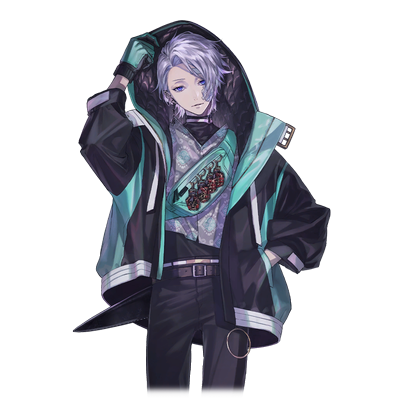
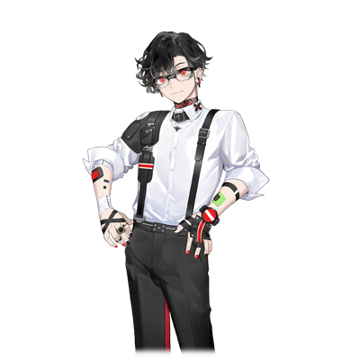

# 向来隼

| 角色信息   |          |
| ----------- | ----------- |
| 名称    |向来隼|
| 年龄   | 17岁 |
|职业|高中二年级学生|
|对应曲|B100d Hunter|
|初出|Chunithm Paradise|
|CV|石田彰|

## Episode 1 搭档

>与那家伙所度过的日子，是我最为宝贵的日常。

妖魔——

人们将其称作妖怪，抑或是恶魔。

 

而我们则是在新宿的街头讨伐他们的存在。

与我一同斩妖除魔的，是我唯一的挚友。

现在，我那唯一的挚友，正一如既往地哼着小曲，走进我们的据点。

“哼～♪哼哼哼哼～♪……啊，隼你怎么又在睡大觉啊？赶紧一起去现场啦！”

 

昴摇晃着我的身体。

明明正是睡大觉的时候，为啥非得来找我出去啊？

 

“好啦，赶紧起来。再不出去的话太阳就要下山了！”

“就让我多睡一会吧，昴……”

 

明明这边眼皮还跟灌了铅一样，昴却仍旧露出一副毫不在乎的样子向我露出笑容。

 

“这可不行啊，隼。我们可是要出门的，不赶紧准备怎么行？”

“你要的，是我能够听见死者声音的能力吗？还是说这东西的能力？”

 

我把手伸向了放在床边的一把刀。

——百鬼。

这是把吸收妖魔之血的刀，也是我的力量的一部分。

没有这把刀的话，我也没办法打倒它们。

 

“真是的～是不是因为我打扰你睡觉了你才闹别扭啊？不是啦，我要的不是你的力量，而是你本人♪”

“又在那边说什么傻话……”

“好啦，赶紧起床做准备吧！之后我会请客的。”

“好啦好啦……”

“那么，今天我们要上哪儿逛逛呢♪”

 

我打开了手机地图。

昴定好了今天的目的地。

 

“好，我们就去这里吧！”

“要是决定好了，那就赶紧出发吧。要是在现场收集情报耽搁太久的话，天可真的就要亮了。”

 

我随便披上一件外套，走出了据点。

 

“那个可恶的神‘阿德拉斯’还在沉睡着吗？”

“嗯。不过，也差不多快醒了。得赶紧让妖魔进食了，不然……”

 

要是它再闹腾起来，昴就又要受伤了。

 

“……知道了，那我们赶紧走吧。”

“嗯。那就拜托你啦，搭档♪”

 

现在已是第二天的凌晨，任何人都早该进入梦乡的时间。

但是，那一排排高楼林立的街头依旧灯火辉煌。

在这一如既往的街上猎杀妖魔，这就是我们的日常。

## Episode 2 伊始

>如果要我举一个能被称作挚友的人的话，那应该就只有昴了。

“哈啊啊啊啊！！”

我挥舞着刀，将妖魔的四肢纷纷斩断，失去力量的妖魔轰然倒地。

 

“不愧是搭档！这剑术一如既往的精湛呀。”

“行了，再不快点让它被吃掉就要消失了哦。”

“我知道啦。”

 

昴朝着妖魔伸出手，接着，一团黑色的雾气出现，随后那团雾气就被吸进了昴的身体里。

 

“好了，这下就结束了呢。” 

 

昴——不，阿德拉斯，会吸收妖魔的力量，并将其转化为自身的力量。

他说过这是为了向封印自己的阴阳师复仇所必需的力量。

其实给阿德拉斯输送力量是很危险的行为，但要是不喂给他“食物”，阿德拉斯就会失控发狂。

 

“怎么了呀，一脸担心的样子……没事的哦。要是我失控暴走了，隼，你会杀了我的，对吧？”

“哎呀，那可说不准呢。”

“啊～，你又这么说，故意捉弄我呀。这可是咱们俩约定好的事呀，你可得好好遵守哦。”

“好好好……”

 

真不知道这家伙到底有几分是认真的。

 

“来——趁饮料还冷的时候赶紧拿去喝吧。这是给你的谢礼哦，毕竟帮了我大忙。而且……这可是今天才发售的新产品呢！”

 

昴兴高采烈地把罐装果汁递给我。

 

“其实不用谢礼也行的。”

“没关系的啦，这是我想做的嘛。”

 

说着，昴就开始喝起果汁来。

嘛，我打完妖魔喉咙也干得很，正好喝点东西润润喉。

我也学着昴的样子喝了一口果汁，甜甜的味道在嘴里散开。

 

“……隼喝的果汁看起来好好喝呀。给我喝一口呗。”

“那你当时为啥不买一样的？”

“买的时候没觉得呀，看你喝着就觉得好喝了呢。”

 

我忍住差点想吐槽“那难道你不会是想买给我看起来就不好喝的东西吗”的想法，沉默不语。

 

“知道了啦。喏，就一口哦。”

“谢谢～，那我就不客气啦♪” 

 

御影昴——。

既是我从小一起长大的朋友，也是我的救命恩人……不过，他的身上却有一个秘密。

那就是——他是被太古时期的神“阿德拉斯”所附身的半人半妖。

为了这家伙的目的，我到现在都还在跟着他行动。

要是不让他吞噬妖魔，阿德拉斯就会通过昴的身体发作，大肆破坏。

我绝不能让那样的事发生，所以，我决定去猎杀妖魔，好成为昴的助力。

不管是妖魔也好，人类也罢，只要是为了昴，我都可以一刀两断。

毕竟我的这条命，就是昴救下来的啊——。

 

——那是很久很久以前的事了。

 

“隼君，这边这边～！”

“等等我呀～！”

 

和同班同学一起上下学，聊着些无关紧要的对话。

那时候，我就是个随处可见的普通小学生。

要说有一点不一样的话——。

 

“—好—可—怜—啊—”

 

每天，我都会听到一些特别的噪音。

这是来自这个世界上已经不存在的、死去之人的声音。

是只有我能听见的、来自死者的声音。

我都不记得是从什么时候开始能听到这些声音的了，不过，这也无所谓了。

 

“怎么了呀，隼君？”

“嗯，没什么啦！要是慢悠悠的，会被落下的哦！”

“啊，好狡猾！”

 

现在想来，我可能一直以来都还算挺幸运的吧。

也许正是因为如此，我才不想破坏那样的生活环境，所以撒谎的本事也渐渐变得高明起来了。

 

“去—哪—里—呀—”

 

那声音又响起来了，不过我倒也不害怕。

这种声音，过段时间就会自己消失的吧。

 

“对了，昨天的电视节目——”

 

我一回头，发现刚才还在的同学不见了。

周围的空气一下子变得冰冷，我不禁打了个寒颤。

 

“喂，你们都上哪儿了？啊，难道是在玩捉迷藏吗！那咱们来用石头剪刀布决定谁当鬼吧！”

 

……可是，没有任何回应，也看不到人影。

我慌忙跑了起来，可那里已经不再是我熟悉的那条平常回家的路了。

 

“怎、怎么办呀，得赶紧回去啊！”

 

我盲目地跑着，可路上一个人都没有。

好害怕，好害怕，好害怕，好害怕——。

不管是谁都行，赶紧都出来吧……

在拐弯的瞬间，我撞到了一堵像墙一样的东西。

 

“好痛……这是什么呀——”

 

我抬起头，看到一个怪物站在我面前。

由于事发突然，我连声音都发不出来。

眼前是个让人感觉无比恶心，却又有着实实在在形体的强大妖魔。这还是我人生中第一次见到这种东西。那大大的眼睛紧紧地盯着我，然后，发出了咆哮声。

 

“谁，来……救我……”

 

我一边哭着，一边求救。

在连正常说话都做不到的状态下，又有谁会来救我呢。

即便如此，我还是拼命地想要从喉咙里挤出声音来。

然而，这样的挣扎都是徒劳的。怪物高高举起了手臂，朝着我挥了下来——

 

“哇啊啊啊——！”

 

我最后能发出的，只有这声惨叫了。

我蹲下来，用手臂捂住脸。

下一个瞬间，热乎乎的液体溅到了我的身上。

 

“咦……怎么不痛……”

 

到底发生了什么事？

我抬头一看，从怪物的身体里喷出了和溅到我身上一样的黑色液体，从那切口中喷出的体液，就像喷泉一样。

 

“啊，啊……”

 

虽然搞不清楚状况，但那怪物的液体流进了我大张着的嘴里。

我将那体液吐了出来，看向四周，发现有个和我差不多大的男孩子站在那里。

 

“是、是你干的……？”

“我、我……哇啊啊啊！！！”

 

男孩子突然大哭起来。

这孩子也是迷路闯进这里的吧。

我也不明白这是什么情况，只是，虽然很害怕，但看着正在哭泣的男孩子，我不知怎的就握住了他的手。

 

“是你救了我吧，谢谢你哦。”

“啊？你、你是……？”

“我是向来隼，你叫什么名字？”

 

男孩子紧紧地回握住了我的手。

 

“御影昴……”

“这样啊，是昴君呀！好呀！喂，咱们一起去喝果汁吧！”

 

说完这话，我还记得昴当时害羞地点了点头的样子。

那就是我和昴的相遇，也是我们故事的开始。

平安回去之后，我和昴就经常见面了。他每天都和我一起玩耍，不知不觉间，他甚至还会来我家里玩了。

我的父母也很疼爱不怎么愿意回家的昴——。

 

“简直就像亲兄弟一样呢。”

 

说这话的，不知道是爸爸还是妈妈。

确实，我对昴有着超越朋友的情谊，就算到现在，我也依旧这么觉得。

所以，即便我知道了他的所有秘密，也从没想过要抛弃他。

 

“啊！我好像喝多了。我把我的这份给你吧，你就饶了我吧♪”

“好好好……”

 

也正因如此，现在我所能做的，就是继续去猎杀那些怪物——也就是妖魔，好早日把昴从这束缚中解放出来。

我能做的，仅此而已。 

## Episode 3 波纹

>只要我一个人战斗就足够了。昴……我还是不希望你参加战斗。

太古之神·阿德拉斯——

那就是依附在昴的身上的邪恶神明。

据说是被强大的阴阳师所封印，失去了力量，只剩下灵魂存在于世。

听说它会寻找与自身血统相近的子孙，并且寄宿于其中生存下去。

也正是这个缘故，昴总是遇上各种麻烦。

正常情况下，这东西只会在昴的体内沉睡着，但要是苏醒了那就是一等一的大麻烦。

所以，今天我也在拼命地寻找着能够将这家伙从昴身上分离开来的方法——

 

“今天也是毫无收获吗……”

 

现在的情况可以说是毫无头绪。

曾经封印阿德拉斯的阴阳师，似乎从很久以前就断绝了消息，完全没有线索可寻。

 

“哼哼，没想到能在这儿见到你啊。在做什么呢？”

 

不知何时，昴正站在我的面前。

虽然说得像是偶遇一样，不过以他的个性，想必是一直在找我吧。

 

“保密。”

“搞什么嘛～你不知道一旦说了要保密，那不就只会让人更在意吗！”

“比起那个，我从死者那里得到了消息。今天就去那里看看吧。”

 

我撇下昴，脚步匆匆地离开了那个地方。

 

“啊，等一下。别丢下我呀～！”

 

快接近目的地的时候，传来了声响。

肯定没错——

 

“昴，前面好像有人在战斗。在我说可以之前，你可千万不能动用阿德拉斯的力量哦。”

“嗯，我知道了。”

 

昴没有战斗的能力。

所以如果要和妖魔战斗的话，就只能借助阿德拉斯的力量了。

但是，能避免的话还是尽量不要用到那股力量。

 

“我去查看下情况，待在这儿别动。”

 

我先走一步，悄悄躲在角落里查看着情况。

一个人？不，那是三个人吧。一个男人正带着两个孩子，手持刀剑和一头巨大的妖魔战斗着。

“看招！！”

 

一剑过去，妖魔身上只留下了一道浅浅的伤口。

 

“看你们似乎在忙着啊，我也来帮忙！”

 

趁妖魔还没注意到这里，我掏出了“百鬼”，将怪物一刀两断。

 

“你是什么人！？”

“至少不是你们的敌人。现在就让我们通力合作把看着像敌人的家伙全砍了如何？”

“哦，说，说的也是啊！”

“北斗，你可不要因为多了个人就放松警惕啊！”

“我知道啦，玄武大人！”

 

我一马当先，挥动手中的“百鬼”在前方斩杀妖魔，那个叫“北斗”的男的也紧随其后。

妖魔反扑过来的攻击掠过我的脸颊。

敌人是个大块头，而且还皮糙肉厚，只靠我们两人的火力实在是不够看。

下个瞬间，某个东西就击飞了眼前的妖魔。

 

“刚刚那个是什么！？”

“谁让你总想着一个人硬撑。咱们不是说好，战斗的时候要两个人一起上的吗？”

“昴！？”

 

不知何时，昴已经站在了我们身后。

他伸出的手正对准着妖魔的方向。

难道昴动用了阿德拉斯的力量？

原本倒在地上的妖魔，缓缓地站了起来。

 

“那家伙是你的同伴啊。既然这样，就请他来帮个忙吧！”

 

北斗朝着倒地的妖魔挥剑砍去。

 

“别乱来啊，昴！”

“知道啦知道啦，我心里有数！”

 

几分钟后 ——。

妖魔庞大的身躯缓缓倒在了地上。

 

“终于结束了吗。昴，你没事吧——”

 

我正要开口询问，昴却朝着倒地的妖魔走了过去。

北斗疑惑地注视着他的举动。

 

“喂，你在干什么？”

“……少废话，安静看着就好。”

 

昴对着妖魔伸出手，一团黑色的雾气随即出现，之后被他的身体缓缓吸了进去。

 

“这是怎么回事？”

“他在吸收妖魔的力量。”

 

说话的是站在北斗身旁的孩子，好像叫玄武来着。

居然一眼就看出来了。

 

“呜……”

“昴！？”

 

我慌忙冲过去扶住摇摇欲坠的昴。

 

“哈哈哈，好像力量用的太多了……搭档，接下来就交给你啦……”

 

说完这句话，昴便沉沉睡了过去。

按理说战斗时间并不长，但他似乎比我预想的还要过度使用了阿德拉斯的力量。

不过，此刻的他还保持着原本的模样。

距离履行那个约定的日子，恐怕还很遥远。

 

“那家伙没事吧？”

“只是睡着而已，没什么大碍。我要带他回去休息，我们就先走了。”

“啊啊，今天真是多亏了你们，欠你们一个人情了。”

“我们也是为了自己的目的才战斗的，并没打算让你们欠什么人情。”

“别在意，就当成是我的个人想法吧。要是以后遇到什么麻烦尽管找我们，我们平时基本都在中野一带活动。”

 

我抱起昴，准备离开这里。

 

“你们俩真是对有意思的组合呢。……用‘吴越同舟’来形容也不为过。”

“这话是什么意思？”

“你该不会是想拯救那家伙吧？”

 

听到这句话，我不由得绷紧了脸。

这孩子为什么会说出这种话？

 

“如果真是这样的话，我劝你还是现在就放弃为好。因为这是根本没可能的事啊……”

## Episode 4 疑惑

>不管谁怎么说，我的想法都不会改变。只要是为了救昴，我什么都会去做。

中野的商店街——

昨天遇到的那个叫北斗的男人，说他平时就在这一带活动。

听说他在能听见死者声音的人当中挺有名的，果然，没过几十分钟就找到了他。

“你的搭档没跟你一起来吗？”

“我邀请过他了，但被拒绝了。”

 

虽然难得被昴拒绝让我有点在意，但现在还有更需要确认的事要做。

 

“说吧，找我们有什么事？”

“我想问点昨天的事。不是问你，是问那边那个‘乌龟’。”

 

我指向北斗身边的玄武，话音刚落，玄武就从乌龟的形态变成了人的样子。

 

“你之前说让我放弃拯救昴，那句话到底是什么意思？”

“就是字面意思啊。不管你再怎么坚持，也救不了那个男人的。”

“这么说的话，难道还有其他能解放昴的方法？”

“解放的方法？怎么可能有啊。这种事就算是神明也办不到。”

 

我不明白玄武为什么能说得这么斩钉截铁。

这种话，我怎么可能相信。

 

“要是没有拯救他的方法，那可就糟了！”

“不过啊…”

“昴他……昴他可是我的挚友啊……。所以，我绝对必须救他……”

“喂，玄武大人。真的没有任何办法了吗？”

“既然你这么不甘心放弃，不如自己去确认一下怎么样？”

“确认？”

 

玄武拿起纸开始写着什么，然后把纸递给了我。

看起来像是一张地图，但这到底是……。

 

“去这里的话，能找到和阴阳师相关的书籍。要是你没打算放弃，就去看看吧。”

“那肯定了！我去确认一下！”

“嘛，你就尽你所能去试试吧——”

 

绝望之中，终于看到了一丝微弱的光芒。

只要能了解到封印阿德拉斯的阴阳师的事，说不定就能把那家伙从昴的身体里剥离出来。

 

地图上标记的地方，是一座古老的神社。

我随便找了个 “来学习历史” 的借口跟神社的住持说明情况，获准可以阅读神社里收藏的书籍。

 

“这里面，会不会有什么线索……”

 

我一本本仔细地翻阅着眼前堆积如山的书，生怕错过任何一个细节。
突然，一个熟悉的词汇映入了眼帘。

 

“百鬼……？ 为什么阴阳师的文献里会出现这个名字？”

 

我又仔细查阅了其他书籍，发现里面也同样留有关于 “百鬼” 的记载。

 

“阴阳师和百鬼之间有联系吗？…… 可恶，写得也太简略了。”

 

不过，至少能确定阴阳师和百鬼是有关联的。之前我一直追查的是阴阳师和阿德拉斯的线索。

但从现在开始，要是调查百鬼的话，说不定能找到新的突破口。

 

“还是叫昴来帮忙吧。这么多书，我一个人读太费劲了。”

 

我拿出手机给昴打电话。

电话铃声一直响着，却始终没人接。

 

“平时他都会马上接电话的啊。难道是时机不巧……”

 

我打算过会儿再打，重新把注意力转回书本上。

现在回想起来，当时我要是能多留意一下昴的情况就好了。

要是那样的话，说不定就不会发生之后的事了。

## Episode 5 离别

>昴一直与我形影不离，我曾经坚信这样的日子，不论多少年都不会变。

距离我开始调查百鬼的事，已经过去好几天了。

这期间我试着邀请过昴好几次，但每次得到的回应都是一样对——

 

“其实我真的很想跟你一起去啊～。抱歉啦，我有点事，没法陪你了。”

 

他总是这样拒绝我的邀请。

换作平时的昴的话——

 

“隼居然邀请我约会，好开心呀～！”

 

然后就像这样立刻就跟过来的才对。

或许是因为阿德拉斯的缘故，他状态真的不太好。

不管怎样，现在先集中精力研究眼前的文献吧。

关于百鬼的秘密，就快能解开了。

 

“……这到底是怎么回事？”

 

解读文献的过程中，我得出了一个结论。

所有文献里都记载着同一件事。

 

“百鬼只能由阴阳师所使用……？”

 

我无法掩饰内心的困惑与震惊。

之前费尽心机四处寻找，好不容易找到的答案竟然是这个。

如果只有阴阳师能操控百鬼，那么被阿德拉斯憎恨了千年的阴阳师后裔，难道就是——

 

“是我吗……”

 

也就是说，这个世界上唯一能对付阿德拉斯的人，只有我。

要是昴知道我就是他仇敌的后代，真不知道他会做出什么事来。

阿德拉斯一心想要向阴阳师复仇。

要是那家伙失控，我可能就不得不与被他附身的昴……兵戎相见了。

 

“不行，我绝对不能让这种事发生。”

 

更何况，如果是昴的话，他很可能在事情发展到那一步之前就有所行动。

他从小就洞察力过人。

万一，当他清楚知晓我与他的渊源时——。

 

“……不会吧！？”

 

一股不祥的预感涌上心头，我立刻全速奔跑起来，朝着昴所在的据点赶去。

我不断告诉自己，不会的，一定是自己想多了，但内心的焦躁却根本无法平息。

 

“昴！”

 

推开门，里面却没有昴的身影。

我还抱有一丝 “他肯定只是临时出去了” 的侥幸，直到一张小纸条彻底击碎了我的幻想。

 

“隼，谢谢你一直以来的照顾。保重。”

## Episode 6 选择 

>我要怎么选择，早就已经有数了。但是……

我独自一人走在新宿的街头。

那个平日里总陪伴在我身旁的昴，已经不在了。

昴离开据点，大概已经过去十天了吧。

我四处搜集情报，无论生者还是死者都未曾放过，但至今仍未掌握他的行踪。

 

“封印着神的地方，就是这里吗……”

 

我已经没有其他线索可以追查了。

虽然心里清楚，就算继续漫无目的地游荡也找不到他，但我实在无法什么都不做。

所以，我才来到了这里。

这是那批文献中，唯一没能解读出来的地点。

我从未想过，在那座神社的后方，竟然藏着传说中远古时期封印神明的场所。

穿过被草木覆盖的小径，我终于抵达了那座荒废得只剩骨架的古老神社。

 

“住持所说的那座古老神社，就是这里吧。”

 

神社里供奉着一块巨大的石头，上面的文字已经磨损得无法辨认。

听说这里以前是本殿，后来因为建筑老化，才新建了殿堂。

当我靠近那块石头时，突然传来一阵尖锐的声响。

 

“这到底是……？”

 

我环顾四周，发现腰侧附近的百鬼身上正散发着光芒。

 

“……我还睡得正好呢，竟然被人以这种方式吵醒了啊。”

 

听到这道诡异的声音，我以为又是死者的声音，便抬头望向头顶。

那里站着一个身穿狩衣的男人。

 

“你是阴阳师吗……？”

“呵，真是个无礼的小子。没错，我正是当年封印了那可憎神明的阴阳师。”

 

万万没有想到，我竟然能见到当年封印神明的本人。

这是不可多得的机会！

只要问他，说不定就能知道拯救昴的方法。

 

“我就直说了，我想从那个……寄宿着阿德拉斯的人体内，把那家伙解放出来。请告诉我方法。”

“真是个无聊的家伙。总之就是，你想解放阿德拉斯是吗？”

 

听完我的话，阴阳师笑了起来。

有什么好笑的？这对我来说，是比自己的性命还要重要的事啊。

 

“没有那种方法。”

“你们怎么都这么说。既然如此——”

 

那又怎样？

就算别人说做不到，我也绝对不能放弃。

我没有放弃的资格。

 

“那我就自己去找！”

“哈哈，真没想到我的后裔竟是如此愚蠢！罢了，小子，你先听我把话说完。”

 

我背对着他，却还是听着他继续说下去。

 

“听着，这世上不存在能直接封印神明本体的方法。若是存在，我早在很久以前就做了。即便以我的力量，也无法封印住它的灵魂。神明这种东西，就是如此棘手。”

“那又怎样？你是想说，因为做不到，所以我就该放弃吗？”

“别急着打断我。就算你真的从那个叫昴的小子体内解放了神明，被释放的神明也只会给人间带来灾难。”

“可就算这样……”

 

没错，对我来说，重要的不是其他陌生人。

而是我无可替代的搭档 —— 昴。

 

“但，你必须这么做。如今寄宿在他体内的神明，力量已经恢复到了接近被封印时的水平。所以，你必须在它完全恢复力量之前，将神明连同它的宿主一同封印。”

“什！？连昴一起封印？这怎么可能做到！”

 

我忍不住大喊起来，而阴阳师则用一种带着怜悯却又淡漠的语气，继续说道。

 

“你只能听到死者的声音，却看不到他们的身影，对吧？”

“没错，我看不到。真搞不懂你为什么能看见。”

“也就是说，经过世代传承，你体内的阴阳师血脉已经淡薄了许多。”

“这么说，古时候的阴阳师能看见死者的模样？”

“正是。以你现在的能力，能做的事寥寥无几 —— 所以，你必须做出选择。”

“选择？”

“你朋友的性命固然重要，但你必须在他的性命和其他无数无辜之人的性命之间做出抉择。”

 

这种事根本不需要犹豫。

我一定要——

 

“你不妨再问问自己。你想要拯救的这位朋友，会为了自己的性命，而心安理得地让他人牺牲吗？”

## Episode 7 异变

>最好的答案究竟是哪个，我也不知道。但是，我只想作出不会后悔的选择。

与阴阳师告别后，我踏上了归途。

从未想过，有一天我会被迫在昴的性命和无数人的性命之间做出抉择。

我的答案早已确定无疑。

可昴他会怎么想？

就算我真的救了他的命，他还会像以前那样，笑着迎接我吗？

 

“昴，你是怎么想的呢……？”

 

我对自己这种毫无意义的发问感到无奈。

必须做出选择的人，是拥有操控百鬼能力的阴阳师。

也就是我自己啊。

我重重地叹了口气，走到据点门口时，发现门竟然虚掩着一条缝。

 

“昴……？”

 

回应我的并非人声，而是一段熟悉的歌声——

 

“哼～哼～哼～♪”

“这歌声是！？”

 

我以为是昴回来了，急忙想推门进去，却发现门把手已经坏了。

那家伙肯定是没带钥匙，才强行破门而入的吧？

我扶着半开的门走了进去。

 

“昴，你在吗？”

 

一进房间，不用刻意寻找，就看到昴孤零零地站在屋子正中央。

我走上前试图叫他。

突然，我凭着直觉察觉到他身上的气场透着一股异样，瞬间停住了脚步。

 

“你……真的是昴吗——”

 

我正想再叫他一声，下一秒，昴的拳头就朝着我的脸挥了过来。

 

“什——！？”

 

突如其来的攻击加上惊人的速度让我猝不及防，一下子摔了个屁股墩。

但也多亏了这一摔。

他的拳头擦着我的头顶飞过，重重砸在了身后的墙上。

被拳头击中的墙壁轰然倒塌，裂缝一直延伸到了地板上。

此刻，他看向摔倒在地的我的表情，并非往日熟悉的笑容，而是一张极度扭曲的邪恶笑脸。

 

“桀桀桀，你这小子运气不错嘛。”

“难、难道是……阿德拉斯！？”

## Episode 8 暗转

>眼前渐渐地变成一片漆黑。难道避开了真相的人是我吗？

这里是我和昴一同生活过的地方。

我们曾在这里一同欢笑、一同哭泣，也曾有过争吵。

这是个无人打扰的地方。

本该是只属于我和昴……两个人的专属空间。

 

“要逃跑吗？桀桀……哈哈哈哈！好啊，再让我多乐呵乐呵吧！”

 

伴随着阿德拉斯狂妄的笑声，我们的据点正被一点点摧毁。

 

“可恶！”

 

在阿德拉斯的攻击下，整栋建筑逐渐崩塌。

面对他挥下的拳头，我除了躲避别无他法。

此刻的我，根本没有拔出百鬼的勇气。

再继续留在这里，只会和被这坍塌的大楼活埋。

可若是把阿德拉斯引到外面，又会造成更大的伤亡。

我到底该怎么办……？

 

“怎么了？你腰上的刀只是摆设吗？既然如此，就让我好好折磨你这千年的仇敌吧！”

“你早就知道了吗……知道我是阴阳师？”

“当然，是你的好伙伴告诉我的啊！”

“好伙伴……？……你把昴怎么了！”

“桀桀桀，现在才反应过来？你这小子真是后知后觉啊？”

 

阿德拉斯的力量，已经强大到和以前并肩作战时完全无法相提并论。

这让我不得不认清一个事实——

“昴”已经不复存在了。

 

“……！把昴还给我！！”

 

就在这时，我突然想起了阴阳师说过的话。

 

“你朋友的性命固然重要，但你必须在他的性命和其他无数无辜之人的性命之间做出抉择。”

 

阿德拉斯挥下的拳头终于击穿了地板。

我被崩塌的落脚点裹挟，身体失去了平衡。

 

“糟了——！？”

“哇哈哈哈！先吃我一拳！”

 

我仓促间挡住了阿德拉斯的拳头，可一股仿佛要贯穿天灵盖的剧痛瞬间席卷了我的手臂。

只听“咔嚓”一声脆响，伴随着剧烈的疼痛，我被巨大的冲击力掀飞，撞破了窗户。

 

“哎？有个男孩子掉下来了！”

“喂，你没事吧？”

 

被甩到室外的我周围很快聚集了人群。

不好——

 

“快逃！”

 

我的一只胳膊恐怕已经骨折了，我强忍着剧痛催促大家离开，可周围的人却迟迟不肯挪动脚步。

 

“我还没折磨够你呢——！”

 

从上方俯冲而下的阿德拉斯，他的目标不言而喻。

 

“快躲开！！”

 

我强行推开围观的人群，迫使他们远离危险区域。

 

“你干什么——”

 

那人的话音未落，就被阿德拉斯踏碎地面的巨响所淹没。

 

“喂喂，别躲啊！”

“什、什……！？”

 

突如其来的变故让所有人都僵在原地动弹不得。

 

“快跑啊，会被杀的！！”

 

我的呼喊终于唤醒了众人，他们尖叫着四散奔逃。

这样就好。只要他们逃走了，就不会被卷入这场战斗。

 

“桀桀桀，你还真是个烂好人啊！既然如此，不如先从他们开始收拾怎么样？”

 

我下意识地伸手去触碰百鬼。

只要动用它的力量，或许真的能阻止阿德拉斯。

可那样做就意味着……

 

“昴……”

 

眼前的人无疑是阿德拉斯。

但他的样貌，却是昴本人。

可他如今，和我以往斩杀的妖魔已经没有区别了。

虽然理智告诉我，他是必须打倒的敌人，但身体却无论如何也不听使唤。

 

“胆小鬼，你就连战斗的勇气都没有吗！”

 

这句话让我猛然惊醒，可一切都已经太迟了。

阿德拉斯的拳头再次狠狠砸进了我的身体。

 

“哇啊——！？”

 

这一次的声响与之前截然不同。

仿佛全身骨骼都碎裂的声音在耳边回荡。

我被径直向后击飞，身体像贴画一样狠狠撞在建筑物的墙壁上。

剧烈的冲击让我吐尽了胃里的所有东西。

 

“哈哈哈，瞧你这傻样，都吐满全身了啊，小鬼！”

 

阿德拉斯的笑声在远处回荡。

我想挪动身体，可剧痛让我根本无法掌控自己的肢体。

手脚沉重得如同灌了铅，眼前的视线也开始摇晃模糊。

 

“我可还没玩够呢！可别那么快就死掉啊！”

 

在模糊的视线中，他正一步步向我逼近。

然后，他伸出手，想要扼住我的脖子……

真是狼狈啊……

我既没能救得了昴，最终也没能做出任何抉择，就要这样结束了吗？

剧痛之中，我满心都是不甘与悔恨。

就在意识即将消散的瞬间，一句名字自然而然地从我口中溢出——

 

“——昴”

………………

他的手，在我的眼前停住了。

 

“隼……”

 

用温柔的声音呼唤我的人，是他——

“昴”回来了。

## Episode 9 决心

>我已经——不再迷惘了。

一直以来都是这样。

无论是提议去什么地方玩，还是想出新的游戏点子，永远都是昴先提出来的。

 

“好！下次咱们去那片森林探险吧。走啦，隼！”

“好！”

 

现在回想起来，那时候的我，大概总是跟在他身后奔跑追逐吧。

记得有一次，我和昴准备一起跳进河里游泳，可我却迟迟不敢跳。

当时，昴对我说了这样一句话——。

 

即将涣散的意识渐渐回归。

 

“昴——”

 

不等我喊出他的名字，昴就用颤抖的手握住我的手，将百鬼塞进了我的掌心。

我眼睁睁地看着，他触碰百鬼的手瞬间被严重的烧伤覆盖。

我想开口让他停下，可当我的目光从他的手移到他的眼眸时，却看到了一张从未见过的、无比认真的脸庞。

我一时语塞。

昴已经做好了觉悟。

可我怎么能……怎么能做这样的事……。

 

“……要遵守约定哦。”

 

这句我最不想听、最不愿从他口中听到的话，终究还是来了。

如果连他都已经坦然接受了这一切，那我也只能做出决断了。

每次都是他的话，在推着我这个犹豫不决、优柔寡断的家伙前进啊。

对了，那时候昴也是这样……。

 

“让我看看，最帅气的隼吧。”

“……嗯。”

 

我抛开所有犹豫，满怀决心地回应了昴。

然而，就在那一瞬间，昴的身体猛地向后一跃，离开了我的身边。

 

“你这小子，竟敢多管闲事——！啊，可恶！我的右手怎么会变成这样——！”

 

昴——不，是阿德拉斯，一边护着已经废了的右手，一边满脸怒容地瞪向我们。

 

“你这小子，你——！？”

 

我直视着阿德拉斯，眼神坚定。

再也没有丝毫犹豫。

我用还能动弹的那只手，紧紧握住了百鬼。

## Episode 10 亲友

>一起战斗吧，搭档。

阿德拉斯——。

你不仅折磨着我和昴，更让无数人饱受痛苦折磨。

但你的恶行，今天就将在此终结。

由我，亲手终结！

 

“你这小鬼啊啊啊啊！！！”

 

阿德拉斯鼓足气势，发出一声怒吼，倾尽全身力气挥拳向我袭来。

不知为何，我心中毫无惧意。

面对眼前这巨大的威胁，我的头脑异常清醒，方才的剧痛也丝毫没有干扰我的思考。

 

“你的左手，由我来斩断！”

 

阿德拉斯的拳头仿佛在慢动作回放。

我身形轻盈得宛若生了翅膀，避开他的拳头，径直冲入他的怀中。

 

“什——！？”

 

我的举动显然超出了他的预料。他对我能避开攻击感到惊愕，仓促间便想抬起左手防御。

这也在情理之中，毕竟我早已宣告要斩断他的左手，他必然会做出这样的反应。

正因如此，我才能预判他的动作。

一闪。

挥出的百鬼利刃划破了阿德拉斯的双眼，鲜血四溅。

 

“呜啊啊啊啊！？眼睛，我的眼睛啊啊啊！饶不了你！我饶不了你啊！我一定要杀了你啊啊啊！！”

 

他用左手按住被劈开的双眼，即便如此，拳头依旧精准地瞄准了我。

他的动作幅度已经降到最小，剩余的体力也所剩无几。

所以，我只能静待给予他致命一击的瞬间。

 

“不过是无用功！只要能感知到你的气息，你的位置对我来说就一目了然！！”

 

阿德拉斯脸上浮现出轻蔑的笑容，高高举起了右手。

他是想凭借这一拳摧毁整片区域吗？

若是如此，那挥拳落下的瞬间，便是他露出最大破绽之时，也是我唯一的绝佳机会。

我的大脑变得异常清晰。

人们的惨叫、上空直升机的轰鸣、阿德拉斯的怒吼，全都消失不见，世界陷入一片极致的寂静。

 

“去死吧啊啊啊！！”

 

阿德拉斯的拳头如同静止画面般，一点点向我逼近。

我摆好闪避的架势，可他的拳头却突然停住了。

虽然只是短暂的一瞬间，连一秒都不到，但他的拳头确实停住了。

是吗。昴，是你在为我助力啊……。

这一瞬间，对此刻的我而言，却漫长如永恒。

所以，我必须抓住这个机会，一击致命。

我倾尽全身仅剩的力量，将百鬼刺向阿德拉斯的心脏——也就是昴的心脏！

 

“—— 啊？”

 

百鬼径直贯穿了昴的心脏。

鲜血在我眼前飞溅，熊熊业火瞬间将他的全身包裹。

——结束了。

 

我，亲手终结了昴的生命。

身体与内心骤然被沉重感淹没。

我不知道这份沉重是否源于罪恶感，只能呆呆地凝视着昴被火焰吞噬的身影。

包裹着昴的火焰渐渐熄灭。想必是百鬼将阿德拉斯的灵魂彻底焚烧殆尽了吧。

我将倒地的昴抱入怀中。

 

“都结束了，一切都结束了……”

 

我以为，他再也无法回应我了。

 

“隼……”

 

耳边传来昴微弱的声音。

我慌忙看向他的脸，那张我熟悉的笑容，正静静地绽放在那里。

 

“昴，昴……！”

 

泪水如决堤般涌出。

能再次见到这张我以为再也无缘得见的笑脸，我满心欢喜，可离别的悲伤也随之而来。

我泣不成声。真没用啊，明明早已做好了觉悟，却还是在他面前哭得如此狼狈。

我紧紧握住了触碰我脸颊的昴的手。

 

“喂，隼……。我们，永远都是挚友（搭档）对吧……”

“嗯…… 嗯，那是当然！我们永远都是…… 喂，昴？”

 

他像睡着了一般闭上了眼睛，再也没有回应。

 

“昴，你快回答我啊……。我还没来得及向你道谢呢……”

 

直升机在天空盘旋，城市里依旧能听到人们的惨叫。

唯有我们周围，仿佛被寂静笼罩。

我在心中立下了新的誓言。

 

“我一定会去接你的……。在那之前，不许擅自先走啊……”

## Episode 11 约定

>这是我们俩的约定……可必须遵守才行。

从那天起，我的 “日常” 发生了些许改变。

我依旧会在夜晚的街道上徘徊，倾听死者的声音，狩猎潜藏在黑暗中的妖魔。

最大的不同，是身边再也没有了那位挚友的身影。

 

“渴了啊……”

 

再也没有那个说着 “我去买杯喝的当谢礼” 就跑开的家伙了。

我喝着事先买好的酒，继续在夜色中前行。

从那天到现在，已经过去多久了呢？

我听过了无数死者的声音，却始终没能找到我真正追寻的那个身影。

即便如此，我依然没有放弃寻找。

因为我早已下定决心，无论需要花费数年、数十年，我也一定会去接他回来。

 

“终于……找到了啊。”

 

不过，这份漫长的追寻，今天也该画上句点了。

我终于，抵达了目的地。

 

“哼～哼～哼～♪”

 

风中夹杂着一丝微弱却无比熟悉的歌声。

 

“花了不少时间啊……”

 

虽然看不见他的身影，但我能确定，他就在那里。

我有太多太多的话想对他说。

——终于，能来接你了。

我没有出声打扰，只是闭上双眼，静静聆听着那首歌。

脑海中，不断浮现出那位再也无法相见的挚友的笑容。

