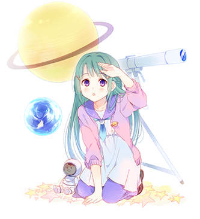

# 织原姬美

 
| 角色信息   |     
     
       |
| ----------- | ----------- |
| 名称    | 织原姬美|
| 年龄   | 17岁   |
|职业|训练生|
|特技 |无重力游泳|
|对应曲|stella=steLLa|
|初出|Chunithm

## Episode 1 织原姬美

>宇宙还真是宽广啊……不过，只要努力的话，总会见面的吧？

没想到邻家的大哥哥，竟然是宇航员！？

他曾经是自己无比憧憬的存在……

但是在她将心意传达出去之前，他就踏上了旅途。

  

虽然偶尔能够从向宇宙的中继通信中看到他的身影。

但是，这终究是在千里之外的遥远太空之上。没办法简单说上话。
  

每天晚上，她都会用望远镜向着天空，寻找着自己心心念念的大哥哥所在的地方。

宇宙到底是怎样的地方呢？

到底要怎样才能前往宇宙呢？

和宇宙相关的工作，到底是怎么样的呢？

  
“想要和大哥哥见一面”

抱着这样的想法，她开始了行动。

## Episode 2 很久很久以前

>我从小就一直在大哥哥身边，他是我憧憬的对象。但是，某一天他却抛下了我……

那是在稍微有点远的未来。

在某个地方，住着一位女孩子，和她隔壁的大哥哥。

两人从小就关系很好。女孩子一直憧憬着大哥哥。

然而，某一天，大哥哥却不知道去向了什么地方，留下女孩子一个人独自悲伤。

——为什么不带上自己一起去呢？
  

然而，在那之后又过了一阵子。

大哥哥出现在了电视上。说着“早上好！姬美！”，隔着电视屏幕，向着女孩子打了个招呼。

女孩子又惊又喜，向着大哥哥所在的天空望去。

在那九天之上的遥远地方。

太遥远了，根本看不到。到底该怎么做，才能看到呢？

  

——啊，对了。这样的话，我也前去那里，不就行了吗？

就这样，女孩子下定了决心。

## Episode 3 现在的我和大哥哥

>从那以后，已经过了十年。然而，大哥哥却从未回来。好想跟他见一面啊。见上一面，好好地谈谈……

自从出发之后，大哥哥就再也没回到隔壁的家中。

就算只有一阵都行，真想和大哥哥见面啊。

在那之后又经过了十多年，我也已经十七岁了。

大哥哥作为宇航员，已经成为了有名人。

现在他正在为了前往ISS（国际宇宙空间站），成为上面的乘员，而进行着为期约两年的训练。

  

好厉害啊。大哥哥又要去宇宙了吗。

听说ISS的乘员在地上也是很忙的。

要访问那些参与了空间站计划的国家，要为了宇宙空间的工作而去学习以及参加技能考试。

而且还需要跟在宇宙中的乘员们持续交流。他们全体，就是一个不可分割的团队。众人就像家人一样亲密，互相分享着研究的内容与成果。

可以说正是因为有大家的头脑和勇气在，ISS才能够运作。

  

不过，我就不像大哥哥那样身材高大了，也不擅长讲英语，甚至有点认生。

嗯——这么看宇宙还真是遥远啊。

## Episode 4 通过望远镜向天遥望

>七夕之夜，感觉会发生什么好事的样子。不知道能不能看到围绕着地球在转的大哥哥呢？

虽然也不是说到了七夕才会这么想什么的，其实，我一直都想见一见大哥哥，不过因为见不到，我也只能每天都仰望着天空。

其实呢，这次大哥哥去宇宙的预定被提早了很多。

因为ISS半年一次的定期载人火箭，乘员出现了欠缺。

所以上级取消了大哥哥作为下一期成员的预定，让他作为临时的外援，出发前往ISS帮忙工作。

驾驶飞船前去接送在宇宙的同伴，并且让他们安全回到地上，就是大哥哥这次的任务。

  

我带着望远镜，前往了一片漆黑的深山中，试着用望远镜观测天空中的大哥哥。

如果顺利的话，说不定就能看到ISS跟大哥哥的飞船对接的瞬间呢！啊！是那个吗？

星空果然还是太宽广了啊。

明明知道位置，但是总会有各种毫无关联的人造卫星啊，流星之类的东西跑进镜头画面里。

要是ISS有更加显眼的标志就好了啊……

如果不这样的话，那本该相会的牛郎织女也会迷路了啊！

## Episode 5 比月亮更近的遥远地方

>我的个子一点没长。大哥哥所在的地方，我根本碰不到。

大哥哥开始为再度前往宇宙做准备。

宇航员在出发之前，行程都是保密的。

但是大哥哥留下了视频留言，而这份视频则是上了电视，向着“全日本的各位”放送。

大哥哥在电视上，对着即将前往太空站进行的新实验滔滔不绝。
  

嗯……可是，果然还是很寂寞啊。

这次甚至都没有说“我要走了哦，姬美”这样的话……明明我还在幼儿园的那次，还会这么说的。

大哥哥，是不是已经把我的事情忘掉了呢……

毕竟已经很多年没见面了，也没办法呢。
  

ISS在位于地上400公里高度的轨道上。

比月亮要近不少，也比那些静止人造卫星还要近。

但是，果然还是无法触及那里。

我的个头一点都没长。

明明已经那么努力，取得了那么好的成绩。

  
如果我能够一口气跳到月亮上的话，说不定就能跟大哥哥握手了吧……看来， 身体也要多加锻炼啊。

## Episode 6 祈愿的指环

>集中精神——将电波传达出去。Hello——Hello——大哥哥，听得见吗？

某天，一通航空快递送到了姬美的家中。

>“听说姬美从小就喜欢关于宇宙的各种故事，所以，我和同事们送了一份礼物给你。”

竟然是大哥哥寄来的！我现在，真的十分惊喜！

难道是大哥哥还在地上的时候寄过来的吗？

快递箱里装的，除了许多跟宇宙相关的图鉴和百科，还有一枚十分可爱的戒指。

那是我在小的时候，和大哥哥一起在电视上看到的，那种外国的科幻电影里会出现的装置一样的戒指。
  

>“虽然只是个便宜的玩具戒指，有点对不起姬美呢。”

不会的啦，大哥哥！我会把它当成我一生的宝物的！

我将闪闪发光的戒指戴到了左手的中指上，打开从学校那边借来的业余制作的无线电仪器，祈祷着。

因为ISS为了跟地上的义工组织联系，所以设置了一个无线通信局。

虽然不是任何时候都能对话，不过要是运气不错的话，说不定就能见到大哥哥了也说不定……

拜托了，让我联系上吧！我想亲自向他道谢啊！

## Episode 7 远走高飞

>大哥哥！我终于也能去宇宙了哦！至少，是距离宇宙很近的地方。说不定，是努力学习英语的成果哦？

在宇宙空间中工作的人们是以英语作为通用语言的。

我在不知不觉中就十分擅长与物理方面的计算了，不过英语还是苦手，所以之后花了一番功夫刻苦学习。

不管是要读那些宇宙相关的百科，还是使用无线电什么的，英语都是很重要的技能。所以，我一定要努力。

  

就在这时，我成为了留学生的翻译……

学校里虽然来自各种国家的人都有，但是只要用英语的话，基本上都能够交流。

通过跟各种各样的人用英语交流，说不定就能治好我这认生的毛病吧。

  

之后，某天我被老师叫住了。

没想到我竟然被学校选中，要前往距离宇宙仅有一步之遥的地方进行修学旅行！

在成千上万的候选者之中，我脱颖而出。

最大的理由是因为我在候选者之中个头最小。

没想到会有感恩自己个头小，体重轻的一天啊。

  

我要前往的，是被称作卡门线的，海拔100公里高度的高空中。
 （注：卡门线（Kármán line）是一条位于海拔100 km（330,000英尺）处，被广泛认可为外太空与地球大气层的界线的分界线。此线还是国际航空联合会（国际的航空航天标准制定、记录保存机构）所接受的现行的大气层和太空的界线。）

再往上，就是宇宙空间了。

而我所乘坐的滑翔机，将飞到那宇宙的边界之处。

## Episode 8 从比邻之地打个招呼

>无重力什么的，果然好好玩啊！在ISS上的大哥哥，我现在，就在这里哦！

在出发之前，我接受了低重力环境的适应性测试。自由落体塔的胶囊，我都不知道乘坐了几次。

  

坐在利用地下通道建成的，大概有两公里高度的胶囊中自由落体，大概会有数十秒的时间内暂时处于无重力——准确来说是低重力的状态。而在这期间，坐在里面的人，就会像气球一样飘起来。

哈哈，感觉好好玩啊！真想这样一直漂浮下去！

大哥哥他们在宇宙中，也是这样的吗？

不过，看周围的人都好像晕船了一样，脸色不太好看的样子……然而我却什么事都没有发生，真怪。

  

因为我在测试中确认了没有任何异常，所以很快就来到了正式出行的时候。

这场旅行，要乘坐专用的飞行器，飞到超高的高空中，再释放小型的滑翔机，让其慢慢飞行到地上。

实际的体验比无重力测试的时候还要平稳，实在是舒服不少。

在观测气球都触及不到的遥远高空中，我们乘坐着滑翔机，在这能看见极光的天空之中滑翔着。

在获得准许之后，我解开了安全带，飘到滑翔机的窗口，向着一片黑暗的宇宙挥动双手。

  

ISS的大哥哥！现在，我就在这里哦！

现在，我又距离你近了一分哦！虽然大概还有三百来公里左右！

请你注意到我吧！

## Episode 9 制作小型卫星

>宇宙开发工作，似乎很耗钱的样子呢。不过，我果然还是想从事宇宙相关的工作！

在我成功到达距离宇宙最近的地方之后，事情也就止步于此了。

曾经邀请我们这些学生前往宇宙旅行的富豪也已不在人世。

ISS虽然仍旧斜切着赤道的轨道飞着，不过本身也已经破旧不堪，据说也要换代了。

宇宙开发事业也需要大量的资金，许多国家已经削减了预算的样子……

  

我靠着跳级提早进入了大学的研究所，现在正一边制作着被称作“微型卫星”的小尺寸人造卫星，一边学习着各种各样的自然科学知识。

从生物，到地球，再到天上的陨石和天体……

我对世间的一切都充满了好奇。从思考，再到记忆，我想要知道更多的东西。这份热情，不管经历多久都不会消退。

嗯……不过，果然还是想要更加具体的，想要做跟宇宙更加接近的工作啊。

大哥哥，我该怎么办呢？

  

就在这时，不知是谁将一张传单递了过来。

那是来自JAXA的公募。
 （注：即日本宇宙航空研究开发机构（Japan Aerospace Exploration Agency），负责日本的航空、太空开发事业的独立行政机构。）

## Episode 10 宇航员的公募要求

>相比较偶像的选拔，宇航员的竞争率还比较低？不过看这条件，问题根本不在这里吧——！

JAXA开始了新一轮的宇航员招募。

总结了一下他们的公募要求。
  

>·要求大学本科毕业以上，推荐读完博士课程 ·至少担任自然科学类的技术职位三年以上 ·能够熟练运用包含各种专业名词在内的英语知识 ·能够适应长期滞留于宇宙环境的体能，精神，协调能力。

哇，这一看我就没自信了。

不过，大哥哥竟然通过了这么多的考验吗……

  

话说回来，这竞争率也太高了吧。

至少也得有上千人竞争这个位置了。

是谁说这东西比偶像的选拔还要轻松的啊？

问题出在这里吗？

就连朋友也揶揄我，“姬美，要不要就试试看？说不定这次真的能见到你的大哥哥哦？”

那个朋友，知道我手上的戒指和哥哥的事情。

  

嗯嗯嗯……既然都这么说的话，那就试试看吧……

## Episode 11 姬美的未来

>在那之后又经过了十年。现在，我正在准备自己的椅子。当然，这是为了成为宇航员做的准备……

自从那场JAXA的公募之后，已经过了十年。

现在我正在工作人员的帮助下取得座椅的模型。

因为旧型号的往返飞船，没有泛用的座椅。

所以乘员都要根据自己的体型定制专用的座椅，这样才能从强烈的重力和热量中保护自己。

虽然知道这是不得已而为之……不过要光着身子涂满石膏做成模具什么的，果然还是很不好意思啊！

  

在这之后，我就成为了宇航员，前往了宇宙空间。

据说ISS下一代的建设地，需要将周围的太空垃圾清除干净，所以现在正有许多的宇航员和机器人在那里工作着。

而且听说还要启用那种会不停回转着的旋转式单元，进行人工重力的实验。真期待啊。

  

由于前往宇宙的人也越来越多，要怎么在宇宙解决吃饭的问题，还有治病的问题……总之，增加了各种各样的课题。

不过，挑战也与机遇同在。

只要我们继续努力的话，说不定就算是没有资质的普通人，也能居住在这浩瀚星海之中呢。

对吧，大哥哥？

我向着月球的背面，默默问到。

