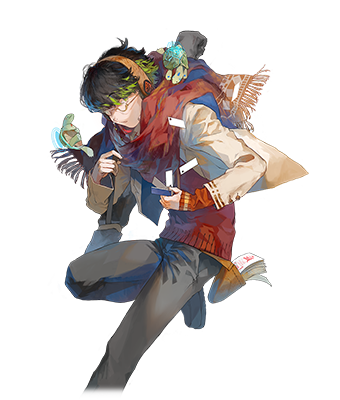
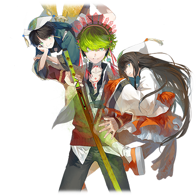

# 黑龟北斗

（译者：Lunate）

| 角色信息   |  |
| ----------- | ----------- |
| 名称    | 黒亀　北斗   |
| 年龄   |17岁 |
| 职业 |  高中生（白天）、Ghostbuster（夜晚）  |
| 对应曲   |BOKUTO |
| 对应版本 | Chunithm Air|
|CV|阿部敦|

注：Ghostbuster原文为ゴーストバスター，应该是取《捉鬼敢死队》之名。此处取英文名进行处理。

## Episode 1虽然令人难以置信

>“我的名字是黑龟北斗。平时，是普通的高中生……但到了晚上，是一名Ghostbuster。”

“……魑魅魍魎哟，回到理应存在的地方！WARFARE！”
 
 
在这万籁俱寂，深更半夜之时。眼前的妖怪在我的喊声中化为光柱消失了。
 
“呼……总算收拾干净了。被害者的状况如何……？”
 
我确认了被妖怪附身的被害者还有呼吸后，轻声叹息道。 
“……看起来没事。还好还好。之后就顺便叫个救护车……” 
正当我转来转去找公共电话（最近少了很多让我很难办）的时候，突然听到有人在我背后偷笑。 
  
“嘻嘻……” 
“什么‘还好还好’的。那种杂鱼你就不能两下子解决吗？” 
“……您俩要真这么觉得，就稍微帮我一下嘛。玄武大人们。” 
  
极其美貌的少年与少女从我头顶冒出。他们并不是普通人类。而是富有灵力的神明……玄武大人们。
 
更令人难以置信的是，是他们让我从事这份除灵（夜间限定）工作的。

## Episode 2 简单介绍下我自己

>“小时候有2头乌龟……神明大人救下了溺水的我，自那之后我就被妖怪盯上了。”

为何我这个普通高中生会从事Ghostbuster这种幻想系工作呢……

小时候……我和朋友在附近的神社玩耍。
因为有人觉得这座古老神社里“真的会有什么东西出现”，所以它在孩子间非常有名。

然后……当时还是个臭小鬼的我，一不留神就噗通一声，掉进神社的池子里。很快我就沉底了。

（我马上就要死了吗……？） 
我在漆黑的水中，意识朦胧地问道。 
令我意外的是，立刻就有人回答说： 
 
“……你、不想死吧？” 
“是、谁！？” 
“别管了快说！你是不是不想死？” 
“不、不想死！” 
“……行吧。那么，作为救下你的回报，你就成为吾等的眷属吧。从今以后你要作为吾等的手足，替吾等工作到死哦？……你、叫什么名？” 
“……黑龟北斗。” 
“那么北斗！契约成立！” 
  
……于是我就这样平安生还了，但从此两只乌龟（偶尔变成人）就一直缠在我身边。此外我还甚至能看到“妖怪”了。 
……明明一直以来我都只想当个普通人的。

## Episode 3 正因我不是天才型

> “玄武大人基本不怎么会赐予我力量。无奈之下我只能自学成才。”

说到妖怪，它是一种从人类心灵创伤或阴影中诞生的负面存在。 
妖怪有各种姿态及形式，其中也有像动漫或漫画中会出现的类型。 
自从我被玄武大人附身后，那些妖怪就会来袭击我了。 
  
“……为、为什么我会被妖怪袭击啊！” 
“普通人类看不到妖怪，而看得见的你对它们来说稀奇又碍事。所以为了将你排除才袭击你。” 
“怎么会！真会给人添麻烦！……那玄武大人您俩就不能帮我一把嘛！您俩不是很强的吗！？” 
“才不要。” 
“好麻烦的。” 
“什么——！？” 

……我真是可悲啊，居然要自学掌握对抗妖怪的力量。我本身也不是天才型选手，不想打架也不想花钱的我，修行可谓是极其困难。  

此外我还没钱，买不起什么像样的护符或符纸。结果只能用“木刀”一通乱揍，直到对手动弹不得，整个过程还挺费时间的。  

后来我上了高中，姑且也能算是一名Ghostbuster，在里世界小有名气。

## Episode 4 妖怪是不是变强了？

> “唔！？本以为被解决掉的妖怪居然复活了！？虽然不知为何……总有种不好的预感。”

“北斗！小心身后！” 
沉浸在回忆中的我听到玄武大人的声音后，急忙回头看去。发现本应被打倒的妖怪居然原地满血复活，并准备攻击我。 
“唔！？为、为什么已经被打倒的妖怪会！？” 
妖怪也并不打算回答我的问题，张大嘴直接冲向了我！ 
我慌忙躲开，但妖怪一头扎进了月亮百货里的商店！ 
（原文ムーンモール捏他自中野著名的サンモール(太阳百货)商店街）
  
“哇！？怎么会！？完蛋……是符纸用的太省，导致结界变弱了吗！” 
虽然我很担心店铺的损失，但必须先解决眼前的妖怪！ 
“……这下你总该！恶灵退散！看招啊啊啊！” 
……妖怪化作光消失了。 
 
但是……我肯定是把妖怪灭掉了啊，那究竟为什么…… 
说起来，最近对付妖怪用的时间好像也比原来长了。 
“话说啊……玄武大人？或许是我的错觉……但最近的妖怪，是不是变强了？” 
“嗯？搞什么嘛，你才发现啊？” 
“啊哈哈……也是呢……” 
比起思考妖怪为何极速变强，还是处理当下…… 
“……今早就要期中考试了。糟了——完全没看——” 
现在回去也复习不了多少…… 
……这可咋整啊？ 

## Episode 5 白天的我是普通高中生

> “明明是期中考试，却完全没时间复习……没办法。夜晚要退治妖怪啊。”

结果，期中考试答的很惨。 
这也没办法啊——我晚上可是拼了命的在当Ghostbuster。也没时间拿来学习啊。 
“哎……” 
“怎么了？北斗！愁眉苦脸的！” 
“哎……我好像考砸了。” 
“别太放在心上！……对了！咱今天一块去ワックン吧！我给你画明天的考试重点！” 
“真的吗！？帮大忙了！” 
果然比起抖S神明还是朋友更靠谱啊！我和朋友一同踏上了去月亮百货的路。 
 
“……欸？那家店，昨天不是还好好的吗？” 
我顺着朋友所指的方向，看到了那家被妖怪砸成废墟的店铺…… 
“嗯嗯！？是这样吗！？我、我不记得了——” 
 
之后我们就在ワックン复习考试，随便聊了几句。 
“……说起来，最近有什么新鲜事？” 
这种朴实的打听方式还是挺重要的。 
“新鲜事？哦对了，最近在中野百幼汇那边好像有怪人出没。” 
(原文中野ナロウウェイneta自中野ブロードウェイ（中野百老汇），ナロウ意为狭窄，ブロード意为宽阔) 
“真的！？还有别的吗！？” 
“再就是……听说有个叫阿佐谷的超强不良女高中生……” 
“……这就不必了。”  

感觉中野百幼汇值得去调查一下。 

## Episode 6最重要的是以策万全

> “朋友说过在这看到了奇怪的人影。特地跑一趟好麻烦……但也没法放着不管。”

“啊——好困。人家好想现在就回去复习啊——” 
我走进了朋友说的那个中野百幼汇。 
现在已是丑时三刻，附近感觉不到有人存在。 
（约为日本时间2:00至2:30） 
 
“北斗一脸倦意呢——” 
“不想干就回家呗。” 
“别把话说的这么轻松啊。玄武大人。” 
没错，最好以防万一。要是再像昨天那样突然冒出一堆强化版妖怪，受伤的只会是我。  

但我转遍了中野百幼汇，也只找到一堆小妖怪。 
别说怪人了，我连个影都没看到。 
（而且总觉得，是什么人特意把小妖怪聚集在这里……？） 
 
觉察到一丝违和感的我叹息道： 
“……没办法。再调查一下吧——” 
就在我不情愿地起身时…… 
“Chest——！” 
“哇啊啊啊啊——！？” 

突然有个女的从天而降，拿着巨大的锤子朝我头顶砸过来了！

## Episode 7什么！？你谁啊！？

> “等等！？为什么我突然被袭击了啊！？我没招惹过不良吧！”

“您、您谁啊？天降女高中生！？” 
“讲人话，搞不懂你在想什么！” 
“是我搞不懂你在想什么才对吧！为什么我这种普通又善良的高中生要被你这种不良袭击啊！” 
“哈！还普通高中生？别逗老子了！普通人哪有你这种气息！” 
 
这个不良绝对是能感觉到玄武大人的。 
“玄武大人，您或许认识那个不良？” 
“欸——！我才没见过这种奇怪的小姑娘呢——” 
那个不良好像也没和玄武大人接触过（当然也可能是玄武大人自己忘了）。 
并且我好像也没法和她正常交流。好——！这种时候就该……！ 
 
“……三十六计走为上策！！” 
“啊？妈的！你小子！给老子站住！” 
哪能让我站住我就真的站住啊。我直接一个冲刺逃走了。 
 
“呼……呼……总、总算甩开她了。” 
我确认不良锤子女没追过来后，一下子跪倒在地。 
“呼……搞什么啊。比起妖怪还是不良更恐怖吧。” 

## Episode 8 那就是传闻中的可疑人物吗

> “总之我逃离了不良女的魔爪，到达了月亮广场……那就是传闻中的可疑人物吗？”

平安从不良女手上逃走的我，重新走向北口。 
实际上，已经有情报确认说在中野月亮广场见过人影了。 
（同前，Neta自中野太阳广场） 
 
“……真希望这次能找到啊——” 
我决定，试试入侵中野月亮广场…… 
“……Bingo！那家伙绝对就是传闻中的那个人！” 
 
　
一名看着就很可疑的男人正披着长袍站在舞台上，向着聚集在身边的几名年轻人低语着什么。 
 
年轻人们似乎是被催眠了，眼神空虚，步履蹒跚。虽然在我这个距离听不清长袍男在说什么，但估计是在念咒语吧。 
 
下一刻，随着超大号长袍被掀开的声音，年轻人们一同化作了妖怪！
  
“将人类转化为妖怪！？我可从没听说过还有这种技术！？”
  
总而言之，看到了就不能放着不管！要是让这些怪物跑到街上就完了！我拿起心爱的木刀，集中精神后冲上了舞台。

## Episode 9还能这样的！？

> “人类突然化作妖怪！？而且还聚集在一起……还有这种事！？该怎么办！？”

化作妖怪的人们个个都很强，让我陷入苦战。 
妖怪的强度是个问题但…… 

（可恶！他们是人变的，于情于理我都不能往死里打啊！） 
我如果就这样简单地制伏掉的话，变回去的人如果受伤或者留下后遗症那该怎么办……？ 
这么一想，我是无论如何都不敢使出全力了。 
 
“哈啊……哈啊……！” 
“呵呵呵……你就是中野的知名Ghostbuster啊。也没啥能耐嘛。” 

“……这么说来你又是什么人？” 

“……没有必要告诉像你这样的小角色！” 

“行吧……这种标准反派台词还是免了——” 

（总之，必须要把被害者从妖怪身上分离出来！）  
想到这里我拿出了符纸……然而，就在这一瞬间……那些妖怪居然合体了！ 
“……骗人的吧！？都已经这么强了，怎么还能合体的！？” 
现实无情，眼前的大妖怪转过身，用强烈的一击问候了我。 
 
“唔！？” 
大妖怪一下就打碎了我的眼镜，我的制服也变得破破烂烂…… 
（不妙——我这不是陷入危机了吗！？） 

## Episode 10 觉醒版的我别具一格？

> “凭借着从玄武大人那借来的力量觉醒的我，和平时不太一样哦？魑魅魍魎哟，回到理应存在的地方！WARFARE！”

“唉、北斗你可真没出息啊——” 
“超级废呢——应该叫你超级大废柴吧！” 
明明我这个宿主正处于危难时刻，玄武大人们居然还能不慌不忙地diss我一顿。 
  
“废柴北斗，需不需要吾等将力量借给你啊？” 
“当、当然需要！请多借我点！” 
“……那、要请我吃原宿的薄煎饼哦？” 
“我要银座狮子屋的极品羊羹！” 
“嗯！？” 
“……怎么？有意见？” 
“没有！请现在就借给我力量！” 
“行吧！……哈！” 
玄武大人吟唱了类似祝福的东西后，我立刻感到身上涌出了力量。 
 
“嘿嘿嘿……我就是为了这一刻！觉醒版的我，登场！” 
我平时只能用木刀和符纸，但凭借玄武大人的力量，发挥真正的能力时，就能吟唱出能降服所有妖魔鬼怪的特殊咒文。 

　「臨（りん）兵（ぴょう）闘（とう）者（しゃ）皆（かい）陣（じん）列（れつ）在（ざい）前（ぜん）」  
伴随我的声音，飞舞在天上的符纸围住了大妖怪。 
 
　「……魑魅魍魎よ！　あるべき場所に戻れ！ＷＡＲＦＡＲＥ！」 
在我吟唱咒文后，一股令人睁不开眼的眩光包裹住了我。 

## Episode 11 每天都是妖怪退治

>“总算退治了妖怪……但事件还是谜团重重。而且今天不仅要给玄武大人献礼，还要参加期中考试……哎。”

光芒散去，大妖怪消失了。舞台上，被大妖怪附身的人们纷纷倒地，所幸全都没有生命危险。 
然而……可疑长袍男的身影消失了。 
 
“逃掉了吗……感觉之后也会是个麻烦……哈。” 
对方应该知道我的底细。就算我不愿意，短期内也会再碰到他吧。 
……和他打实在是太耗精力了，但到时候也不得不开战。谁叫我喜欢这条街和居住在这里的人们呢。  

“……能将人类化作妖怪的神秘男子……他究竟是什么人，又有什么目的？” 
我很在意那名男子…… 
但是，我还有件更在意的事。 
“呐——！我说——！北斗！薄煎饼！” 
“别忘了还有羊羹哦——！” 
“那个啊，玄武大人们。现在店还没开门哦？而且……我这个月，手头还挺紧的？” 
“我才不管！给我上供——！” 
……玄武大人们在我耳边呜哇乱叫。饶了我吧！ 
 
闹来闹去，东边天空已不知不觉中逐渐变白。 
“……哎——已经早上了……啊！今天还有期中考试！” 
就我今天这样，肯定又要考砸了吧。 
而且，我的制服也破破烂烂了！ 
“呜——！……Ghostbuster好难当啊！” 
