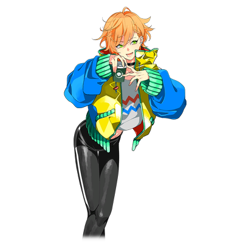
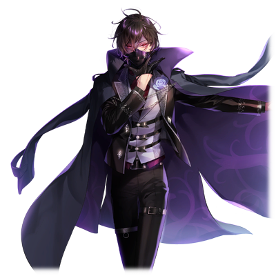
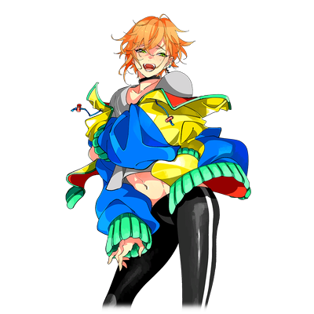

# 黑须纮

 
  
| 角色信息   |          |
| ----------- | ----------- |
| 名称    |黑须 纮（くろす　ひろ）   |
| 年龄   | 18岁     |
|职业|高中三年级学生|
|对应曲|パズルリボン|
|初出|Chunithm NEW PLUS|

## Episode 1 异端

>呐，愤怒究竟是什么？悲伤究竟是什么？我可是完全不懂啊。

大人们究竟是在教我们什么道理呢？

我从小，就不明白大人在跟我说什么话。

“黑须君，为什么要打⚪⚪君呢？”

在我眼前的是已经想不起名字的老师和正在大哭的同班同学。

为什么会向我怒吼呢。

“因为⚪⚪君殴打了▲▲君，▲▲君哭了起来，所以我就用同样的手段对付⚪⚪君了啊。”

“为什么要做那样的事！”

“因为不这样做的话就很不公平嘛，这也不奇怪吧？”

“咦？”

我还记得当时老师脸上露出的表情。

虽然没有说出口，但我能够感受到在他心底里似乎在说着“这个家伙在说什么？”的话。

——为什么？

我只是作了同样的事情啊。

我只是理所应当地做了该做的事情而已啊。

“纮，为什么要打你的朋友？”

即便在家里，曾经是我的父母的二人也向我问出了同样的问题。我向他们回答了同样的话，两人却彻底翻了脸。

“即便是这样，由你直接报复回去也根本不合适吧？”

“报仇？那，最初做了不该干的事情的，难道不是那个家伙吗？为什么我就不能做同样的事情呢？”

“……总之，我说不行就是不行！懂了吗！”

“……”

即便是被说了“不行”，我的好奇心还是未能停止。

不知道多少次被家里人，被老师们骂。

毕竟，那个时候还是孩子呢。

全部的一切都是为了兴趣，全部的行动也只是兴致使然而已。

拜此所赐我也学到了很多东西，但是，还是有很多东西我未能理解。

为什么，人会愤怒呢？

为什么，人会悲伤呢？

明明这个世界那么有趣，那么快乐，为什么人还会为之而愤怒呢？

同样，为什么人会因为这个世界而悲伤呢？

为了知道这些事情的根源，我的好奇心和兴致从未停歇过。

但是，为什么——为什么人们会觉得我是个异常的人，是个“异端”呢？

## Episode 2 相遇
>一成不变的无聊日常在遇到他之后便彻底的改变了。和他的相遇，我认为是命中注定的。

夜晚的街道。

现在的我就住在稍微离繁华街有些距离的地方。

而这条则是我打工下班之后回家的必经之路，周围的风景已经看到厌倦了。

这条路也人迹罕至，没什么能够吸引人眼球的东西。

我已经对这无聊至极的日常感到厌倦了。

于是，那天，我绕了远路。

——而那就是我的命运的转折点。

“嗯——今天也没啥好玩的事情呢。”

既没有什么好玩的东西，也没啥开心事儿，真的太无聊了。

反正已经厌倦了现在的工作，说不定是时候跳槽了吧？嗯——这到底是第几次换工作了啊？仔细想想我还真是个坐不住的人呢。

  

“——哼，象你这样的人渣，就不要浪费地球的资源苟活在这个世上了！”

“大，大哥饶命啊！！我可没做什么坏事儿啊！不要过来……不要过来啊！！！”

这个声音是……？

我听到了从巷子里传出来的声音，便偷偷地跟了上去。

在那里的，是个倒在地上正因为恐惧而蜷缩着的男人。

还有一个正俯视着那个男人的，奇怪的青年。

 

那个男人穿着一件漆黑的，足以融进夜色的长风衣，脸上带着口罩，看不清是什么表情。

看起来是打架的样子，但是那个倒在地上的人好像样子有点奇怪。

我被这奇妙的气氛影响，也走进了小巷。

“是谁？”

青年注意到了我，向这边瞪了过来。

打架什么的话到也不是什么新鲜事，也没什么意思。

如果是平常的话，我肯定是直接两耳不闻，直接开溜的。

不过，今天我没有这么做。

“呐，这是你干的吗？”

“……在哪儿看到的？”

“因为这个人的样子很痛苦呢。我已经回答了你的问题，这次就轮到你回答了哦。”

“你没有知道的必要。”

青年这么说着，两眼直直的瞪着我。

虽然不知道他究竟干了什么事，但是不知为何，我就是不能从他的双眼中移开视线。

用言语实在太难描述……应该说是被某样东西吸引到了。

“呐呐，接下来会发生什么事？”

“……！？怎么可能……不，这真的有可能吗？”

似乎他对我这意料之外的反应感到震惊，但他很快就冷静了下来，思考着某件事。

虽然由我继续提起话题也可以，不过总觉得稍微观望一下应该会有些好玩的事情发生，这里就等等吧。

“你是什么人？”

“是呢，如果你能够回答我的问题的话我就告诉你。”

“……赶紧把这里发生的事情全都忘了。”

“怎么可能忘掉嘛。因为你实在是太有趣了！”

“有趣？竟然会有人觉得我的‘制裁’很有趣？”

“制裁？”

“如果忘不掉的话那就记住这句话吧。只有我，才代表绝对的正义！”

青年这么说着，转过了身飞奔了出去，消失在黑暗之中。

“等等！这到底是什么意思……”

就在我想追上去询问的时候，倒在地上的男人抓住了我的脚。

“真是的，怎么这么烦人。明明才刚碰见一个有趣的人啊！”

虽然很快就甩掉了男人，但是青年早已跑远。如果没有这个家伙妨碍的话就能够追上去的，没办法。

“呐，那个人是谁？”

“求你了！我不是故意这么做的！我只是被上头命令了这么干的，我不是有恶意的呀！！”

“你在说什么？”

“不要，不要啊啊啊啊啊！！！噫噫噫！！谁来救救我啊！！”

“喂，等等！”

已经陷入恐慌的男人挣脱了我的控制，连滚带爬地逃出了小巷。

那个青年究竟对这男人做了什么？

“绝对的正义……”

青年最后的这句话在我的心中激起了一丝涟漪。

“哈……真想再见一见这个有趣的人啊。”

我想更加知道这个人的一切。

## Episode 3 兴趣

>需要被这个世界制裁的人实在是太多了啊，所以就需要像神园君这样的人呢。

从那天开始，为了寻找他，我每天晚上都会在街上游荡。

但是想找到他并不容易，每次找到的，都只是他的“成果”罢了。

而且那些被他“制裁”过的人们，都和那个男人一样陷入了恐慌之中，根本无法从中知道情报。

结果我花了一些工夫，才终于知道了一些情报。

终于。

我终于能和他再度见面了。

  

现在，我正在跟踪估计会成为他下一个目标的男人。

我小心地隐藏着自己的气息，一边警戒着周围的情况一边呆在角落里等着青年的到来。

“来了……”

那个披着黑风衣的青年出现在了男人的眼前。

似乎男人还未理解发生的事情，男人还想侧身躲开青年的——

“给我转过身来！好好看着我的眼睛！”

“嗯？你刚刚才说什么……？呜……！？”

就在青年和那个男人四目相对的瞬间，不知怎么的，男人失去了平衡一屁股坐在了地上，就像是要躲避青年一般不断地向后退。

“你以为你能够这么逃过制裁，安稳地过活吗？”

“噫噫噫！？饶命，饶命啊！！！”

“叫破喉咙也不会有人来救你的。你就永远活在阳光都照不到的阴影底下苟活吧！”

我终于站不住了，上前搭话。

“哦哦，好厉害呀！感觉就像是超能力一样！”

“你是上次那个……”

“哎呀，太好了！你还记得我呢！”

“……”

青年与我怒目而视，我也真挚的望着他。

如果是他的话，应该能够明白的吧。

“懂了吧？你那双眼睛的力量对我是没有用处的哦。”

“什么！？你怎么会知道这件事！？”

“呵呵，因为我一直想知道你的事情。我可是一直都在角落里看着你的哦。”

“我的事情……？”

“是哦。例如，你究竟是什么人，之类的。啊啊，不过请放心，我不会把你的真实身份告诉别人的哦——‘神园零’君。”

这并不是我第一次在现场看到他。实际上，迄今为止我已经目睹了好几次他对人施以制裁的景象。

通过确认他的目标，还有他的行动范围，以及出现的时间。

虽然花了点时间，我还是知道了不少他的事情。

“……你究竟是什么人？”

“哦对了！我还没有自我介绍呢。我叫黑须纮。那么，这才算是真正的‘自我介绍’呢。”

“竟然这么简单就把自己的信息都说出来吗？”

“咦？因为，如果只有我知道你的事情，而你却不知道我的事情，未免太不公平了吧？”

“……那么，你找我有什么事吗？”

“什么事……其实什么事都没有哦。我只是对你感兴趣而已！”

“什么……？”

“绝对的正义什么的，虽然我最初还不明白这几个字的含义，但是我看了你的行动之后，我终于明白了啊！”

因为，神园君是在用他奇妙的力量制裁那些罪人啊。

当然，他制裁的，都是那些靠表面法律无法制裁的法外狂徒。我在调查了那些被害者的资料之后得知了这点。

在这段时间内，我一直在远远的地方观望着他的行动。

所以我才能够明白，他究竟是为了什么，想要做什么，才会去制裁那些罪人的。

“你身为绝对的正义，运用你的力量将那些罪人打倒！这不就像那些英雄一样吗！”

“呵呵……原来，你也是‘这边’的人吗。也好，如果你想知道我的事情的话，我就告诉你吧。”

“咦，可以吗！？”

“不过，你也要把你的事情告诉我。我们换个地方继续说吧，跟我来。”

“嗯！”

我跟着神园君沿着昏暗的街道行走着。他究竟要将我带到哪里呢。

如果只是要解释事情的话，倒也不必专门跑到别的地方说啊。

穿过了昏暗的街道，我看到了一辆车停在那里。

“上车吧。”

我跟着神园君上车之后，神园君向前面看起来像是司机的老人挥手示意。

“开车。”

车子在路上奔跑了大概一个钟头，最终的目的地是一座坐落在广阔私人土地之上的豪宅。

“这里是？”

“这里是我的家。放心吧，现在这个时间除了我以外没有任何人。”

我就这么被神园君带回了家，进入了他的房间。

房间摆着大量的书本还有一张大床，以及一台电脑。除此以外没有什么特别的东西，就是很普通的卧室。

“这里是我的房间。因为平时没什么人会来，所以在这里说话的话没有人会听到的。”

“包括你家里人？”

“毕竟这屋子实在是太大了。专门去房间叫人还不如用电话通知来得方便。”

神园君这么说着，用着对那些男人同样的眼神瞪着我。

“也就是说，现在我在这里不管是对你做什么事，都不会被人发现。”

“是吗。那么，神园君想对我做什么？”

“你就不会觉得我有可能加害你吗？”

“为什么？我又没做什么错事。怎么可能被你‘制裁’呢？”

“……原来如此。该说你是即便如此也不会有所触动吗。该说你是神经比较粗呢，还是甚至连那种意识都没有呢……”

“在说什么？”

“没啥，是我这边的事情。不如先问一下关于你自己的事情吧。”

“事情？”

“我上次见到你还是几周之前的事情。但你却这么快就发现了我的真实身份，并且找准机会出现在我面前。我再一次郑重地问你，你究竟是什么人？”

“我只是一个普通人哦。不像你那样拥有特别的力量。”

“什么？那么，你难道有其他的同伴吗？”

“没有哦？同伴什么的没有哦？”

“怎么可能……真的就靠你一人的力量做到这些？你可真是令我惊讶啊。”

神园似乎在沉思着的样子，就这么低着头一语不发。很快，他就得出了答案，向我这边看了过来。

“……你，叫黑须纮对吧。你的洞察力说不定能够派上用场呢。要不要在我的手下帮忙？”

“要做什么吗？听起来好有意思！”

“看你这个反应是兴致勃勃啊。那么，契约成立！就让我们俩从此一起努力，为了正义打击那些邪恶的罪人吧！”

“嗯！”

“今天已经很晚了，我去准备一下空房间，你就在这里睡吧。”

神园君掏出了电话似乎在跟谁通话的样子。然后，说着“等房间准备好之前先喝口茶吧。”之后，端来了茶水。

“不过，目前我们俩也才知道各自的名字而已。还是先开始交换情报吧。”

“嗯，我也想知道更多关于你的事情！”

上次像这样和人说话是多久以前了呢。而且迄今为止，我还从未在别人家里过夜呢。

虽然学生时代似乎还和班里的人说过话的，不过已经想不起那么遥远的事情了。

这难道，就是被称为“朋友”的那个东西吗？

## Episode 4 高昂
>给那些愚蠢的恶人以制裁。这就是“我们”的任务呢。

和神园君一起共事之后，又经历了几个星期。

我们两人一起行动，我负责收集情报，他负责前去制裁。

“你就亲身体会一下自己犯下了多少罪孽吧！”

“什么！？求你了，放过我吧！”

“已经让你逃走了那么多次了，这次就放弃吧？游戏结束了哦。”

“呜哇啊啊啊啊啊！？”

我感受着自己成为他的一份力量的荣誉感，还有亲身目睹他制裁恶人们的场面。

这就是我最开心的事情。

感觉好像他就是大家所想要的，只有我才知道他的一切的……英雄。

——但是，不管怎么制裁，那些逃脱法律制裁的人数未曾减少过。

今天也结束了制裁的工作，熟练地完成事后处理之后，我回到了神园君的家里。

“黑须，今天辛苦你了。好好休息吧。”

“辛苦啦！明明神园君最近一直在努力着，那些恶人们却根本没有消失呢。”

“人类的恶意是不可能消失的。所以我就必须一直制裁下去，给这些人一个警钟啊。”

“嗯，是这样呢。”

拥有特别的力量的只有神园君而已。

没有人能够取代他对人们进行制裁，没有人能够让人的想法改变。

只有神园君才能够做到这点。

……虽然只有寥寥数人知道这些。

  

“说起来，出门前你和我说过有些令人在意的事情，那是什么？”

“哦，那个啊。虽然我觉得不需要太在意，还是和你说一下吧。”

神园君将显示器转了过来，在画面上显示的，是关于最近发生的事件的网页。

“这是什么？……‘疯狂伤人的歹徒已经伤及数人’？”

“看起来这篇新闻似乎在说我们啊，你仔细看，这篇文章写的地方，正是我们‘制裁’那个家伙的地方啊。”

“……原来如此。”

“竟然说我们是歹徒，真是笑死人了。”

“哈哈，挺有意思嘛！为什么这些人会这么写呢，明明对神园君的事情一无所知的。”

“这个世界上总有一些人会口不择言说出我们不中听的事情，想说的话就让他们说去吧。反正也有理解我们行为的人存在。”

“嗯，是呢。不过感觉调查一下这个也很有意思，我就搜搜看吧。”

我开始搜索起“我们”的情报。

从个人网站到大型的匿名论坛。

果然和神园君说的那样，大家在说些有的没的事情呢。

网上有不少人对我们的行为持反对态度，看起来还是有很多人只能看到这一面的东西，真无聊。

仔细一看里面也写了那些知道被害者状态的网友们描述的内容。

包括被害者是以什么样的状态被警察发现并且保护之类的，都写的一清二楚。

全员的精神都是废人状态的时候被发现的，但却找不到任何下药的迹象。

而且从被害者最后被发现的实践来看，怎么想人都不可能在短时间内变成那副模样。

“……这些家伙应该是相关的人员。如果是普通的人的话不可能知道这么多。”

“咦，还看到些有趣的人呢。”

跟着这些网友的评论，我也看到越来越多的人在上面评论。

如果是人类无法做到的事情的话，那么究竟是什么东西才能造成这样的效果呢？还是说，只是使用了高明的手法而已，并无任何怪力乱神的操作呢？

似乎是以这样的猜测为契机，关于我们的传言开始扩散的越来越广阔。

“看看，这里也有记载着我们的事情呢。‘扰乱世间的歹徒是都市传说的……’，太扯了吧这个文章。”

“这群人越臆想，就离真相越远，我觉得没啥问题。”

“不过啊，都到了都市传说的地步啊。这群人会传颂着神园君制裁邪恶的事迹的话，那也是理所应当的。”

是的，正是这些事迹才最终成就了神园君的名声。

虽然我很想这样大声宣扬出去，但是如果这样的话就会令神园君的行动受限。

这样就不符合我的期望了。

“……嗯？这是什么？好像在论坛上放着视频链接的样子。”

“喂，别乱点，要是去到什么奇怪的网站该咋办啊。”

“没关系的啦。到时候我就尽自己所能摆平吧。”

链接跳转到了视频网站，播放出了画面。

画面中出现的是一条昏暗的小巷。

“嗯？这个地方总觉得很眼熟啊。”

“……我还有印象哦。这里就是上周神园君执行‘制裁’的地方啊。”

“什么！？”

“难道说，这个是……”

我的不祥预感成真了。视频中出现了一个逃跑的男人的身影。

在这之后，我和神园君就出现在镜头里，然后——

“竟然让他们拍到了‘制裁’的画面！怎么会这样！”

“嗯……不过我们的脸没被拍出来，还好吧。”

网站开始骚动起来，是来看的观众越来越多了吗，评论开始如涌泉般疯狂显现。

视频的页面下方大家的反应都很激烈。有发现是人类的行动而感到遗憾的，也有那些发现影像中的人并未摸到受害者就让他惊吓痛苦的人，我们真的变成了人们口中的都市传说。

神园君似乎在焦急着。不过由于视频中无法看清我们的脸庞，所以也没人知道我们的名字。

“现在必须赶紧删掉这个视频！”

“还是放弃吧。如果处理的不够完善的话，说不定还会节外生枝呢。”

“可是……”

“放心吧，神园君。我们也没有在里面露脸，没人会知道我们的真实身份的。”

“……以后还是各自注意一点吧。”

“真是的，这群家伙竟然敢妨碍我们的制裁，不可饶恕啊。”

我必须救神园君才行。

那么我该做的事情就是……。

  

几个小时后。

在某个小巷的角落，一个男人正手握着摄像机在附近拍照。

——而我就躲藏在他旁边不远的地方。

“这里应该就是事件发生的地方吧。明明之前拍到了的，却没拍到正脸！可恶！就没有什么爆炸性的猛料吗！”

“嗯……？你就那么想搞个大新闻吗？”

“你，你是谁？！”

“我是谁吗……你没有必要知道哦。因为，你只是妨碍正义执行的障碍啊。”

“正义……难道说，你是！？等等，难道我要像之前被制裁的家伙那样——”

“现在就是制裁之时。”

这个家伙是不可饶恕的邪恶之人，是妨碍正义执行的恶人。

所以，我必须给予制裁。

为了封住声音，我打烂了他的喉咙。为了让他无法动弹，我踩碎了他的手脚关节。像他这样的人没有必要看见这个世界，我便捣烂了他的眼睛。

我要做的事情再简单不过了，那就是对“恶”，加以制裁，制裁，制裁，制裁，制裁……。

这才是世界应有的模样，正义与邪恶应有的结果。

即便以丑恶的姿态在地上爬行着，也得接受正义的制裁。

 
  

——啊啊，这真的是太棒了。

我现在正为了神园君挥舞着自己的拳头进行制裁。

没想到为了重要的朋友帮上忙，会是如此快乐的事情啊。

必须更加努力，必须更加努力才行……。

必须将这个不平等的世界彻底以正义的标准再造才行。

因为这是我的朋友，神园君所期望的啊。

## Episode 5 阴云

>对我来说最高兴的事情，就是为神园君帮上忙啊！

——我的人生迄今为止也有数次帮助别人做事的情况。

例如学校生活或者打工的时候，偶尔会有人有求于我。

但是，我却没有任何足以称作朋友的人。

所以，我在为不是陌生的某个人，而是为了朋友尽心尽力这件事感到高兴。

神园君应该会夸奖我的吧。——我这么想着。

  

“为什么要做这样的事情！”

我将那个被制裁的男人带到了神园君的面前，不知为何，神园君却大为光火。

为什么？为什么他会生气？

“这个家伙可是把我们的视频放到了网上了啊？既然妨碍到我们的工作了，那么他也是和正义不共戴天的恶人啊。”

我觉得我的解释还不够充分，便仔细地向神园君说明了理由。

这样的话，神园君也会理解我的行为，对我所做的事情感到高兴的吧。

“你在说什么啊！‘只靠那个视频的话，是找不到我们的。’你不是这么说的吗！”

“那只是为了让神园君安心下来的话而已。我觉得身为朋友，帮朋友缓解不安的情绪也是必须的吧。”

“你……”

“如果神园君不行动的话，那不就只有我能行动了吗。毕竟，他们是**法律无法制裁的人们**啊。”

虽然说将视频上传上去的话并不违法，而且视频也没法辨别出我们的脸。

但是如果让这个家伙放任自流的话，总有一天会拍到我和神园君的脸，从而让我们暴露真实身份。

所以，我必须趁现在将他解决掉才行。

**——如果是神园君的话，肯定也会这么想的吧。**

“话说，被打成这样，还活着的吗？”

“活着哦。毕竟，我们的行事方式就是不杀死对方，只是让他们认罪，接受惩罚啊。就算杀了他们也没有任何意义呢。”

“就算这么说，你也做得太过火了！没有必要做到这个地步啊！”

“咦？可是——”

“没有可是了！这个男人现在就由我来处理。可恶，必须努力保证这个人还能活下去，而且如果要监禁的话还得准备个房间给他……”

“那还不如就这么丢在荒郊野岭呢。这家伙不仅没法看见东西，甚至连声音都发不出来。”

“够了！你给我闭嘴。你和拥有力量的我不一样，会留下证据的！怎么能不由分说做出这种事呢！”

  

神园君叫来了管家指示着各项工作。

明明我又没做什么会暴露证据的事情，就这么把他扔到荒郊野岭，死了也不会有人关心的，为什么要那么紧张呢？

如果是我认识的**神园君**的话，就应该更加正大光明地执行正义才对。

然而为什么，他却没有夸奖我的行为呢？

我难道做错了什么吗？

不，不可能。如果是**神园君**的话，肯定会高兴的才对。
  
到底是怎么回事呢，神园君。

## Episode 6 爆发

>正义是不会停下来的。因为这是**神园君**所期望的啊。

自从那个男人被关起来之后已经经过了几天。

从那之后，神园君就不怎么出门去制裁了。

到底在害怕什么呢，到底是什么束缚住了他的行动呢。

“神园君，你知道这个男人的事情吗？其实——”

“要我说几次你才懂。现在必须避一下风头才行。你也是，最近不要惹是生非。”

“唉，我知道了啦……”

不管我收集了多少情报，神园君都不为所动。

明明曾经的神园君是那么地积极做事的，现在却变成这个样子了。

就这样放着恶人在外面猖獗吗。

“真的不想出去‘制裁’吗？”

“烦死了！我现在光是处理那个男人就已经焦头烂额了！把那人打成这样，想要痊愈已经不可能了。至少得把他扔到哪个设施……”

神园君似乎还在为那个录制了视频的男人忙着呢。

……既然那么麻烦的话，直接把他杀了不就行了。

“你也已经知道了吧。那个男人到底是什么家伙。如果我们没处理好的话，这次真的会暴露我们的身份啊。而且，现在已经有奇怪的传言了……”

那个男人是小有名气的视频投稿者。

每天他都会发各种各样事情的视频到SNS等网络平台，这一断更，瞬间在网上炸开了锅。

大家纷纷议论他是不是没素材了，失踪了，被封号了什么的。

然而大家猜测的最厉害的，还是——他是不是被“制裁”了。

就这样，大家开始猜测，是不是那些没有罪行的人，也会被“制裁”，传言就这样夸张起来，最后演变成了无差别的“制裁”。

“那种传言明明不需要在意的。”

“……你暂时不要再来我家了。因为不知道会牵连到什么样的事情呢。我说了好几次，不用做什么多余的事情，这样就够了。”

“来玩也不行吗？”

神园君无言以对。

那么，我只能做我应做的事情为神园君排忧解难了。

如果神园君做不了的话，就由我来做吧。

在人迹罕至的夜路上，一个男人正玩着手机走着。

明明是恶人，却没有任何警戒意识。

如果神园君做不了的话，就让我来替他下手吧。

虽然不能像**他**那样干净地处理，不过现在我也有能做的事情。

肯定，**他**也在为自己不能出去执行正义而烦躁呢。

只要我为他解决这份烦恼的话……因为我是他的朋友，是相信着他的正义的人。
  

全部，都是为了**神园君**而做的。

我这么想着，不禁嘴角上扬。

“那么，是时候了，为了正义……让我制裁你吧！”

## Episode 7 失望

>如果是**神园君**的话，肯定会夸奖我的吧。如果是成为了我的朋友的**他**的话。

某天，一阵子未响的电话传来了铃声。

会和我联络的人只有一个人，我感到一丝兴奋，接通了电话。

“神园君！我可是一直在等着你的电话啊。你是来找我继续活动的对吧！对吧！”

“……我有话和你说，现在立刻来我家。”

“嗯，我明白了！”

虽然还想为了“制裁”工作先做些准备，不过还是神园君的事情比较重要呢。

我立刻将其他的工作放在之后，奔向了神园君的宅邸。

  

从管家那里获得了进门的许可，来到屋内的我，看到了露出一副奇妙表情的神园君。

我和他面对面的坐着，他慢慢地将显示屏转了过来。

“这是怎么一回事？”

在画面中的是某人正在殴打别人的画面，而那个身影，正是我。

而且，视频说明还写着，这是那个视频作者的视频里，拍到的那个人，正在打着**作者**。

虽然也是制裁恶人，不过我稍微换了一下方法。

“这毫无疑问是人所作的事情！”“这难道不是恶劣的犯罪行为吗！”……像这样的评论在评论区不绝于耳。

“啊，你看了这个东西啊。本来我还在想等你回归工作的时候给你个惊喜的，所以才一直没和你说呢。”

“果然，这都是你干的吗！为什么要做这样的事！？”

突然，神园君大力地拍打着桌子站了起来。

他的眼中充满了怒火，死死地瞪着我。然而我却不明白为什么他要这样生气。

“因为，神园君你不想行动对吧。所以，就由我来帮忙做啊。虽然不能像你那样完美地解决他们，不过我还是尽力将大家都‘制裁’了哦！”

“是吗，这就是你的理由么……”

“呐，既然你这次叫我过来，肯定是要再次开始行动对吧？目标已经定好了吗？如果没有定好的话，那我今天可是带了一票可以‘制裁’的人的名单哦！”

“不，我已经有**目标**了。”

“咦~是谁呀？”

随着神园君的指示，房间里进来了一群彪形大汉。

他们脸上的表情不知为何有些空虚，仿佛**看不到他们自己的意志**一般。

“神园君，这到底是？”

“动手。”

随着神园君的指示，男人们向我发起了攻击。

为什么神园君会做这种事？

我虽然无法理解，不过既然想我发起攻击的话，那么在场的全部人，就都是——恶！

以牙还牙，以眼还眼。这才公平嘛。

我一边闪避着男人们的攻击，一边精准地加以反击。

我还是稍微知道怎么把一个人打倒的。

最初是为了能够帮助神园君，希望能够像神园君那样漂亮地“制裁”邪恶，才偷偷地学了一些知识。

而现在就是实践的时候。

  

击碎骨头，破坏眼睛，夺去意识，停止动作。

我在尽可能保证不杀死这些男人们的前提下将他们一一打倒。

在放倒他们的时候，我也在想着为什么神园君会让这些人变成这种状态，然后攻击我呢。

不过，我很快就明白，没有思考的必要了。

因为，既然是**神园君**做的事情的话，那肯定是正确的。

这些家伙，肯定是**神园君**为我准备的，制裁的对象。

肯定是神园君只从屏幕上看到我施加“制裁”的视频，想实际测试一下我的实力吧。

即便说是用摄像机拍下来了，没有证据也是不行的吧。

所以，我必须好好地表现自己才行。

我必须证明自己对**神园君**是有用的才行。

这么想着，我的嘴角又露出了笑容。

啊啊，必须注意一下力道才行，不然就会不小心把对手打死啊。

就在我将全部的男人们都解决之后，不知为何我的胸中有种莫名的兴奋感。

只要这么做的话，**神园君**就会满足的对吧，是这样的吧！

我向神园君露出了笑容。

他应该也会露出笑容回应我的吧。

  

——然而，现实却截然相反。

“怎么会……这是怎么回事……”

神园君露出了惊恐的表情看着我。

那个表情，实在是太熟悉不过了。

就是那些将我称作“异端”的家伙的脸上的表情。

“怎么了？神园君。为什么要露出那样的表情？”

“不，不要过来！”

每当我接近一步，神园君就像是十分恐惧一般向后退一步。他吓得腿都软了，只能在地上爬着向后退去。

神园君，明明一直都是露出坚毅的表情制裁着恶人的……

现在这副样子，实在是看不出曾经那个强势的他是同一个人。

“为什么要逃呢，神园君？”

“怪，怪物啊！不要接近我！我，我可要报警了啊……！？”

“为什么要报警？明明这里已经没有任何‘恶’了啊？”

“你，你就是那个恶人啊！”

“……咦？”

我无法理解神园君说的话。

——我居然是邪恶的一方？

“你，你才是最邪恶的啊！你才是应该让法律所制裁的恶！竟然那样笑嘻嘻地攻击敌人……这，这也太异常了啊！”

“异常……”

我并没有做错什么事情啊。

为什么明明没有做错什么，为什么会这样。

——为什么连你也要将我当成异常者呢，神园君。

## Episode 8 偶像

>假货就必须要清理才行。我需要的，只有真真正正的，**神园君**啊。

明明只是觉得不平等就出手干涉，却被人说很奇怪。

——明明我只是觉得不平等是不行的而已。

被人问为什么不论任何时候都是这样笑嘻嘻的。

——那就是我正常的样子啊。

被人怒斥不能给人带来悲伤的后果。

——到底悲伤是什么，我真的不明白啊。

  

迄今为止，不知道多少人向我问过这些问题。却没有人能够理解我的回答。

为什么他们会感到不解，我也不明白。

——不过，终于有理解我的人出现了。

那就是能够像英雄一样，不允许那些不平等的事情发生，制裁那些法律无法制裁的恶人的那个人……

  

“你才是最邪恶的啊！你才是最应该被法律所制裁的恶啊！竟然那样笑嘻嘻地攻击敌人……这，这也太异常了啊！”

为什么会这么说呢。

神园君不是已经理解了我，将我当成伙伴，将我当成朋友了吗。

明明是第一个能够理解邪恶不可饶恕，不平等是不行的人。

“啊啊，原来如此……原来是这样啊。”

“你，你在嘀咕什么啊！我已经报警了——”

“那个啊，你是不是那个，‘长得和神园君很像的人’，对吧？嗯，应该是这样。”

“……哈？”

如果是**神园君**的话，肯定会对我做的事情感到高兴吧。

肯定会说“干得不错啊！从此以后也一起努力惩恶扬善吧！”之类的话。

如果是他的话，肯定能够接受我的吧。

但是，现在在我眼前蜷缩成一团，在地上爬着的，将我称作异常者的**这个人**，肯定只是“别人”吧。

——这么一想，感觉谜团就解开了呢。

“怎么能这样呢？竟然给神园君添麻烦什么的。虽然不知道你是在哪里知道我们的事情，不过这次是妨碍了我们的，你的错哦！”

“喂！你到底是在说什么啊！”

“而且，这也是不可饶恕的罪行啊。如果是其他人的话还好，竟然敢假扮成我的**神园君**什么的，这可是滔天大罪啊。”

我缓缓的走近这个长得和神园君很像的人。

随着我越来越接近，这个家伙就愈发恐慌，连滚带爬地向后退去，但是房间狭小，很快就被追到了角落里。

啊啊，为什么我会将这种人和**神园君**弄混啊。

必须好好地制裁一番，让他和**神园君**道歉才行啊。

  

“不要啊！我，我才是神园啊！竟然说我是长得很像的别人什么的……你疯了吗！？”

“行啦，别说话了。恶人所说的每一句话，都是没有任何价值的啊。”

我架住了他的身体防止他继续乱动。

虽然他还在拼命反抗，但我还是努力压住他让他无法逃离。

“虽然说**长得很像**，不过我还是没想到要‘制裁’长得跟**神园君**很像的人呢……”

“咕……啊…………”

  

真是不可思议的感觉。

当我出手的时候，我的心脏虽然大声地跳动着，我却感到无比的宁静。

——等等哦，**神园君**。

等我将这个家伙制裁了之后，我就会去找你哦。