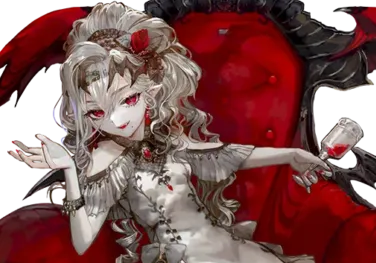
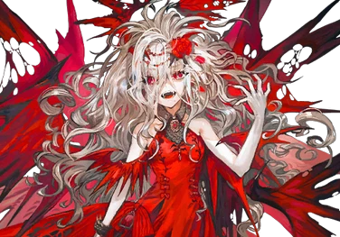

# 劳蕾塔

| 角色信息   |  |
| ----------- | ----------- |
名称|劳蕾塔
年龄|15岁（外表年龄）
职业|阿邦海德家的伯爵千金
| 对应曲   |あの日、あの部屋で、あったこと|
| 对应版本 | Chunithm X-Verse

## Episode 1 美梦与现实

当我矗立在那里的瞬间，顿时便有一股深深的哀愁席卷了我的身体，仿佛就像在一个遥远的梦境之中。    

穿过郊区的大森林，出现在我眼前的是一座古色古香的洋馆。    

这是我第一次造访这间屋子。   

所以，我对心底里涌现出来的这股奇妙的感情毫无头绪。

 

然而——

 

“这里真的有人居住吗？”

 

等到夕阳西下，从洋馆之中也看不到一点灯光。     

屋子里应该是一片漆黑的吧。    

我一边想着这些有的没的，向着前方进发。     

就像在迎接我的到来一般，洋馆的大门敞开了。      

 

“——”

 

从门后出现的，是一名女性。

随着她缓缓走出来，那白皙的皮肤也愈发显眼。

那白皙并非某种比喻或描述，那是一种极其异常的白。

那是一种即便周围夜幕降临，也能在这黑暗中清晰可见的白，简直就像是没有血色一般的苍白。

而那女性略带稚气却又充满英气的脸庞，又让我始终无法移开视线。

那张脸让人心生敬畏，却又如此美丽。

 

“嗯……？”

 

她的口中似乎在说些什么。

 

“欢”

“迎”

“回”

“来”

 

根据口型判断出来的这四个字，顿时让我毛骨悚然。

不知为何感觉有点喘不过气。

身体变得无比冰冷，只有血液像是沸腾一般在体内翻滚着。

我甚至无法确定自己是不是还站在这里。

 

明明，这是我第一次造访这里。

明明，这是我第一次见到了她。

 

但是——

 

我还是一无所知。

只感觉到一股脱力感。

眼前的视野渐渐被黑暗所笼罩。

只剩那奇丽的白，始终残存于我的脑海。

## Episode 2 故事的开始

我从朦胧中醒了过来。

最初映入眼帘的，是昏暗的房间。

房间的样子像是中世纪的贵族的那种装潢，而在房间的中央，暖炉正闪烁着火焰的亮光。

明明才刚醒来，我却有种还在梦中的感觉。

 

“哦，看来是醒了啊。”

 

从昏暗的空间之中听到了一个温柔的声音。

那声音如此自然地沁入身体，连我自己都为之惊讶。

 

"这...这里是...那栋宅邸的...里...里面吗？"

 

我的声音是如此嘶哑，几乎出不了声。

喉咙干渴得厉害。

 

"是的。你在抵达这里之前昏倒了。不过让陌生人躺床上也不合适吧？”

 

声音从身后传来。

这时我才察觉自己正坐在扶手椅上。

为何我迄今为止都没有注意到这件事？

 

“所以，虽然有些抱歉就让你直接坐在那里了。不过这椅子还是很舒服的。嘛，看你的样子睡得也很香。”

 

那背后传来的声音越来越近——

 

“看起来睡得不错啊。”

 

耳边这轻抚般的气息令我耳根升温，身体不由得一颤。

即便如此，我也不敢回头，只是死死地僵在那里。

总有种不能回头的感觉。

 

“那么——”

 

当我听到下一句的时候，她已经走到了面前。

她的皮肤如此白皙而美丽，简直就像一件艺术品般。

 

“初次见面，被选中的人啊。我的名字叫——”

 

——劳蕾塔。

她的眼睫轻轻颤动。

浮现在脑海中的名字，自然而然地从她口中说出。

她微微垂首，唇角勾起一丝笑意。

 

“那么，让我们开始吧。接下来，你将成为我的倾听者。”

## Episode 3 非人之物

劳蕾塔·阿本海德。

 

她便是出生于这座洋馆之中。

为什么这座洋馆周围会被森林所环绕，也是因为这里本就是贵族的领地。

而因为其特别的血脉，族人们便用其权势将她带到人迹罕至的地方将其隐蔽起来。

至于需要隐蔽起来的理由，不用多说。

 

——因为阿本海德家，正是由吸血鬼构成的世家。

 

如果放在现在这个科技发达的时代的话，听到这样的话想必谁都会笑出声的吧。

然而，吸血鬼是确实存在的。

既有在黑暗之地统治着国家的帝王，也有隐居于偏僻荒野之中的染血的女王。他们实力超群，即便对于那些四处播撒战火的国家来说，也是足以改变战局的存在。

这些黑暗中的存在，潜藏于历史的暗处，缓缓推动着世界的局势。

 

“原来如此。”

 

听着她的讲述，我终于明白了她叫我来的理由。

因为身为记者的我所负责的，正是超自然相关的报道。

 

“怎么了？已经听厌了吗？”

 

——这怎么可能呢。

她仿佛看透了我内心想着的这句话，才这么向我发问的。

不知为什么，她似乎能够——

（听懂我的心声）

 

“这么一说，确实是只有我才能做的事情呢。”

 

看着她微微一笑，我也不禁心潮澎湃。

充满威严的语气，与那温柔的声音所形成的反差。

以及宛如精致的人偶一般的美丽容貌，都让我对这非人存在的恐惧彻底消失了。

 

“怎么了，你好像很高兴的样子啊？”

“咦？”

 

这纯粹是我下意识的疑问——

我从未察觉自己露出过那种表情。

 

"嘛，你有兴趣反倒令我欣慰。这也就证明我讲述的故事具有价值"

"简直像是——"

 

刚要脱口而出的疑问被咽回喉咙。

但后续的话语却从她唇间流淌而出：

 

"像是在和熟人交谈一样？"

"……！？"

"不必惊讶。你的答案，就藏在我的故事里。"

 

是啊。若她真是非人之物，拥有超乎想象的能力也不足为奇。

 

"...请继续讲述吧"

"好"

 

真相究竟在何处仍未可知。

她的姿态确实透着非人气息。

就连现在坐在这里倾听着她的讲述这件事都充满了谜团。

但我的心却在雀跃——

因为，或许又能亲眼见证未知之物。

## Episode 4 某位少女

劳蕾塔·阿本海德，正是吸血鬼的一族的后裔。

然而，但她还年幼的时候，却也只是个普通的人类。——她如此说到。

 

“有极少数人的吸血鬼特质会后天觉醒，而我，正是那极少数的人之一。”

 

吸血鬼有一种被称作“血之觉醒”的，宛如虚构作品中才会出现的现象。

一般，当他们还在胎儿中就会觉醒，从而作为吸血鬼降生于世。然而，其中也有某些人并不会在出生前就觉醒吸血鬼的特质。

劳蕾塔正是并未觉醒吸血鬼的特质，以人类小孩的形式呱呱坠地的存在。

 

“虽然自己这么说有点那个，但是当时的我，真的可以说就是个不谙世事的深闺大小姐。直到那天，见到那个人为止。”

 

在劳蕾塔迎来十岁生日的前一天，她迎来了初潮。

迄今为止从未受过任何伤的她，第一次看到了从自己体内流出的赤红色的液体。她用手沾着这从未见过的赤红色液体，出神地望着，甚至沾了一点到自己的嘴边。直到她的嘴唇被血染成红色，她才初次意识到了某件事。

 

血，在她的眼中究竟是何等的美丽。

 

“从血液中，能够参透人心所不知道的东西。”

 

劳蕾塔的话，对于人类来说是无法理解的。

若是常人的话，一提到血的味道基本都是充满厌恶的反应。更别说亲口品尝了，对于常人来说，血液并没有任何区别。

但是，她不一样。

即便没有觉醒，她也仍旧从这血液中得知了自己从未知晓的另外一面。

 

“然而，即便如此，我也没有觉醒成为吸血鬼。”

 

即便是品尝了自己的血，她也没有觉醒吸血鬼的特质。

而她的家人，也并不希望她这样。

因为只要她仍旧是人类，就不会被人当作异端看待。

就能以人类的身份活下去。

劳蕾塔是个懂事的孩子。

相比较对未知的好奇心，她选择了尊重自己重要的人们的想法。

她决定在这片领地，以人类之身静静地过完余生。

 

——如果真的能如愿的话，那会是多么幸福的事情啊。

## Episode 5 旅人

当劳蕾塔14岁的时候，迎来了转机。

一架飞机，飞进了阿本海德家的领地。

驾驶那架飞机的，是一名仅仅十六岁的少年。

 

“你是从天上来的吗？”

“对。我是从遥远的天边来的。”

“那么，你是在旅行吗？”

“差不多吧。”

 

最先发现少年的，正是劳蕾塔。

年龄相仿的二人，很快就找到了共同语言。

从花朵，说到建筑物，再说到各自发生的故事。

以及——关于外面的世界。

虽然这名不速之客所知道的东西也很有限，但对于劳蕾塔来说，这一切的一切都是从未见过的事务。

当时的劳蕾塔，就是如此的不谙世事。

身居闺中的劳蕾塔只能从书上了解到外面的世界，除此之外，没有人愿意告诉她外界的事情。

然而，眼前的这个少年却不一样。

但是，能够交流的时间也就仅限于少年养好伤，修好飞机为止。

不过，劳蕾塔是个懂事的孩子。

她无比珍惜这段短暂的时光，然而却也很清楚自己的生活与这个少年之间的距离。

但是，劳蕾塔对这名少年却始终隐瞒着一件事。

那就是自己是吸血鬼一族的成员之事。不但如此，她还在少年失去意识的时候，舔舐过少年的血液。

 

——那股味道，是如此的甜美。

 

甜美到令劳蕾塔的心脏加速。

而这究竟是身为吸血鬼的本能呢，还是少女情窦的初开呢，对于纯洁的劳蕾塔来说，这种感觉实在是太难懂了。

 

“能不能让我记一记劳蕾塔的事情呢？”

“我的事情？”

 

他很喜欢攥写故事，少年如此说到。

只要在文字的世界中，就能够创造出从未见过的世界。而这件事，对于少年来说是无比快乐的事情。

 

“可以是可以，但是能跟我约好一件事吗？”

“是什么？例如……写好了第一个给你看什么的？”

“不用，只要你写好了，记得给我看就行。”

 

劳蕾塔注意到了一件事。那就是眼前的少年可以说是将写作当成了自己的天职一般。

因为从他的血液中，感觉到了这股气息。

 

“那就约好了。从你口中传述的故事，就由我编纂成书，传递给普罗大众吧。”

“呵呵。真是不错的台词啊。如果这样的话，能不能再答应我一个请求呢？”

“嗯？”

“故事中的少女，总有一天要环游整个世界。为的是确认，这天空的彼端，究竟伸向何方。”

 

不要放弃梦想，终有一天要实现——劳蕾塔，只是这般诚挚地，自然地祈愿着。

 

——而她的愿望，则以最糟糕的形式，实现了。

## Episode 6 终结与开始

自劳蕾塔与少年结下约定之后，又过了一阵子。

养好伤的少年，从劳蕾塔的家族以及领地的民众那里获得了援助，开始着手飞机的修理工作。

除了驾驶舱以外的其他地方都已修复完成，再过一阵子飞机就能起飞了。

然而，也正是在这个时候。

危机从天空的彼方袭来。

 

“那个也是飞机吗？”

“是的。那些飞机可是比这飞机要强悍的多的战斗机。”

 

编队飞行的战斗机掠过领地，将领地的天空染成了一片红色。

从少年险峻的表情来看，劳蕾塔明白了，天空中的那些东西并非善类。

 

——很快，战斗机开始了攻击。

劳蕾塔曾经最为珍视的领地，瞬间就陷入了一片火海中。

悲鸣声与爆炸声此起彼伏，橘红的火焰与赤红的血液占据了这里的一切。这里，仿佛就是地狱现世。

 

“快逃！！”

 

当少年的声音传到劳蕾塔的耳中的时候，已经太迟了。

流星火雨倾盆而降，将劳蕾塔眼前的一切都彻底化作灰烬。

 

——啊啊，一切都到此结束了吗？

已经只剩绝望了吗？然而，即便已经如此绝望……

劳蕾塔仍旧活着。手脚都已麻木，失去了知觉。

只能感觉到一股贴合着自己的，人类肌肤的温暖——

 

“旅人……先生……？”

 

没有回应。

少年用自己的生命保护了劳蕾塔。

他并未考虑自己的性命，只是一心想保护这个与自己共同欢笑的人。

如果是父亲或母亲的话，他们也会这么做吗？

劳蕾塔在脑海中思考着。虽然已经无从得知，但是劳蕾塔还是如此希望着，希望着他们也会这么做。

从少年的额头流淌出了鲜血，濡湿了劳蕾塔的嘴唇。

顿时，那股甜美的感觉袭来。

劳蕾塔当即就做出了决定——再也不要装成乖孩子的样子了。

她向着眼前那充满魅力的颈部咬了下去。

从口中传来了刺破皮肤的感觉。顿时，一股暖流就像是直击心脏一样，向着劳蕾塔袭来。

那是如此的滚烫，滚烫，滚烫，滚烫，滚烫。

身体宛如烈火焚身般灼热到无从释放。

失去知觉的四肢，不知何时也恢复了过来。

痛苦渐渐转化为快感，一切都回归了应有的形状。

 

——那是，何等爽快的感觉——

 

劳蕾塔就像是要将这份喜悦共享一般，咬破了自己的嘴唇，向少年注入了自己的血液。

 

“啊啊……啊……”

 

少年痛苦地喘息着。

那是因为这具垂死的身体，正半强行地从喉咙灌入别人的血液。

这股呛喉的感觉，想必十分痛苦吧。

 

“没事的，没事的……只要你相信的话，我们就能活到海枯石烂为止……”

 

因为——这里，将不会再有知道这一切的人存在了。

## Episode 7 问答

她彻底释放了力量，被当前的感情所支配。

四处播撒的血液，聚集到了她的体内。

曾经只在人们的空想中存在的吸血鬼之力，此刻，正现身于阿本海德的领地的上空，向着那些焚烧着这片大地的战斗机群袭来——

血红色的尖刺向着无垠的苍空中而去，在战斗机的面前炸开。战斗机被鲜红的血液所覆盖，彻底失去视野的驾驶员陷入了对未知敌人的混乱。渐渐的，一架又一架的战斗机失去了控制，坠到了地上。

就这样，这片领地上的生灵都已经死去，彻底变成了一种颜色。

不管是那些残垣断壁，还是熊熊燃烧的火焰，还是已经付之一炬的自然植被，还是被卷入战火惨死的人类，这一切，全都染成了一种颜色。

那便是——一望无际的红色。血红色，朱红色，橘红色，大红色……

这满天的红色，简直就像是怀胎十月中所见到的那股红色一般。

这幅景观令劳蕾塔无比安心。

打从心底里觉得是那么的美丽——

* * *

“所以，故事就到这里了？”

“谁知道呢。就先告一段落吧。说到底都是一百年前的事情了。细节什么的我可不会记得那么清楚。”

 

这么说着，劳蕾塔微微嗤笑着。

我也渐渐的掌握了整个故事的全貌。

 

“但是，我还有一个搞不明白的事情。”

“是什么？说说看吧。”

“首先，那个‘旅人’，最后到底怎么样了？”

“他吗。作为吸血鬼的眷属，将会永远地活下去。”

“如果你真的是吸血鬼，而你现在说的这些话都是事实的话……那现在，那个人又在哪里呢？”

“这种问题，不用问我，你也应该知道的吧？”

 

劳蕾塔的话语，让我倒吸了一口凉气。

这股确信的感觉，从我的心中油然而生。

所以，我必须亲口确认这件事。

 

“那名旅人……他还记得与你发生的那些故事吗？”

“哈——”

 

劳蕾塔发出了讥讽的笑声。

看不出她到底是明白这个问题的意思，还是不明白呢。

 

“他肯定不知道。所以，他肯定也不记得吧……不记得自己已经重获新生，再也不是当时的那个人了……”

 

看来，这就是答案。

而这也是我来到这里寻求的问题的答案。

那么——

 

“所以，你真的是，我一直记得的劳蕾塔吗？”

“是哦，我就是你一直所知的，劳蕾塔哦？”

 

她褪去那股傲慢的口吻，以轻柔的声音应答到。

## Episode 8 约定

——来自某位作家的记录——

* * * 

很久以前，在某座森林深处的洋馆，住着一名美丽的少女。

她的样貌从未衰老，甚至都没有人知道她的真实年龄。

而她的故事，则作为某位作家的写作原型，写成作品公之于世。接着，再改编成戏剧、电影、舞台剧、漫画、游戏……

她的故事以各种各样的形式被被改编，被传诵——渐渐的，她的故事传遍了世界，即便是从未听说的人，也对她的故事略知一二。

而那故事的主人公，正是拥有远超人知领域极限之美的，银发的吸血鬼。

然而身为故事主人公的原型的她，虽然仍旧美丽，但也只是一个普通的人类罢了。

为什么会有人知道她的真实模样？

那肯定是因为作为故事取材的时候，肯定必须亲眼见到本人才行。

 

——想必，这份记忆也会刻在血脉之中吧——

* * * 

正如这段话所说，她的故事在人们的口中传颂着。而我，正是她的眷属。

关于身为故事原型的她，最近发生了一件大新闻。

那就是她所居住的洋馆，遭遇了一场大火，就此付之一炬。

然而不可思议的是，在烧毁的废墟中却没有找到尸体。难道是像故事传说中描述的那样，化作灰烬消失了吗？还是说，只是消声觅迹，逃到了谁都不知道的地方吗？

我本人愿意相信后者的猜测。

不，如果是读过那个故事的人的话，想必也会这么想的吧。

哎呀，实在是太习惯这种认知了，也有些人并不知道这个故事来着呢。

那么换个说法，为什么，我会这么想呢？

 

因为——那正是个少女从箱庭之中离去，向着外界启航的故事。

希望各位读者，也能够从中领悟这般的道理呢。

* * *

即便说尽千言万语，也无法表达感谢之情。

曾经身为笼中之鸟的劳蕾塔·阿本海德，从那天起，初次获得了能够走出这里，向着外面的世界进发的勇气。

那一切的故事，既是现实，又并非完全的事实。

这一切，既是偶然，亦是必然。

少年所驾驶的那架飞机，其实原本就搭载了通讯机。而那些领地的人们，从一开始就明白，这位少年只是前来探查吸血鬼的领地的斥候罢了。

然而，阿本海德一组却是稳健派的吸血鬼。

被人们当成道具所利用，不得不潜藏起来生活的他们，已经对这一切感到了疲倦，于是选择了自我毁灭。

而对他们来说，身为他们的末裔的劳蕾塔，在并未觉醒的情况下降生于世，便是最为幸运之事。

因为，这意味着她能够以人的身份生活下去，做出选择。

她将不再背负身为非人之物的罪业，不再是阿本海德的吸血鬼，而只是一个普通的“劳蕾塔”活下去。

而年幼的劳蕾塔，也是如此希望着的。

不，只是她如此想着罢了。

——直到她与少年邂逅为止。

她认识到了这个世界上无数事物的存在方式，即便是身为异端之物的自己，也是能够活下去的。

而这便是一切故事的开端，也将延续至永不存在的尽头。

所以，劳蕾塔决定等待。一直一直等待着。

等待着自己约定好的那个人来到自己面前的那一刻。

 

“未来掌握在我的手中。从不断绝，从不枯竭，永远持续着——”

 

吸血鬼与她的眷属，就这样飞向了天空，踏上了环游世界的旅途。

为的是完成那曾经的约束——