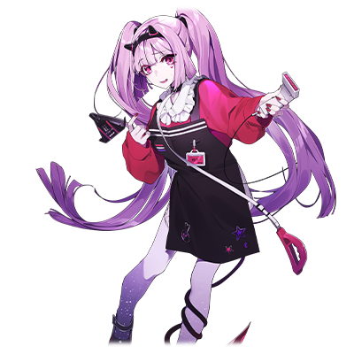
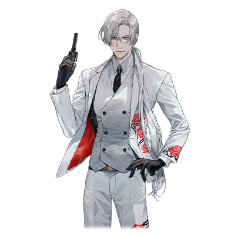

  

# 姬月露娜

| 角色信息   |  |
| ----------- | ----------- |
| 名称    | 姬月 露娜   |
| 年龄   |不公开（推测100岁以上）    |
| 职业 |  吸血鬼/便利店店员  |
| 对应曲   |再生不能 |
| 对应版本 | Chunithm Paradise Lost|

## Episode 1 病入膏肓！
> 明明露娜也那么努力，为什么还是无法获得幸福呢？哎~。已经受不了了。真想要去整形啊。

深夜两点。在一间离繁华街稍微有些距离的便利店。

既不会太繁忙，也不会太空闲。

在这间非常适合摸鱼上班的便利店里，有一名看起来差不多十几岁的女性正在店里工作。
  
“欢迎光~临”
  
这有气无力的声音和死鱼眼，以及破罐子破摔的待客态度。实在是和店员的外表相距甚远。

而这位拥有一头颜色显眼的头发以及红色的指甲的少女——姬月露娜，正坐在店里盯着时针的转动，默默地数着秒针指向的数字。
  
（一——二……嘿嘿……感觉就好像时间稍微快了一点点耶~……真是的，露娜究竟是在这里干什么啊……感觉跟个笨蛋一样。）
  
找到能够包容，接受自己的全部，能够尽情撒娇的白马王子（帅哥），并和他结婚成家，获得幸福。

抱着这样的念头，她从出生的村落跑到了大城市，然而她理想中的白马王子不但没有出现，而且还流落到不得不在便利店上夜班的地步。

话是这么说，这几年来，露娜也不是没有遇见过恋爱的事件。

虽说露娜的外表是有些特别，不过她的样貌在常人看来也是非常可爱的等级，所以平时在街上的时候偶尔还是有人搭话的。

不过，她的内心深处对理想异性的要求高到无法想象，还有那阴晴不定，不知何时就会爆发的情绪。

这些都让众多的男性避而远之。
  
（我是不是该死了这条心，乖乖回家乡过活啊……）
  
虽说她前往大城市的理由非常地简单，不过，像她这样的女孩子在城市里还真不少。

既有那些成功追梦获得幸福的人，也有那些梦碎于此，只能悻悻而归的人。

但是，露娜有一样决定性的东西，和这些普通的女孩不一样。

那就是——姬月露娜，并非人类。

露娜为了寻找理想的王子大人而前往大城市，已经是三十年前的事情了。

而她现在的样子，别说跟去年的样子比了，就算是十年，还是三十年前刚来的时候相比，都没有一丝变化。

因为，她正是只要活着就能保持容貌的，不老不死的存在，超越人类常理的怪物——吸血鬼。
  
——叮咚。

随着店门口的自动门缓缓打开，感应门铃也响了起来。

本来因为大半夜突然的客人来访感到厌烦的露娜露出了不耐烦的脸色，但随着她将视线投向顾客的时候，她的眼睛渐渐地恢复了生机。
  
（怎，怎么是个大帅哥啊！！）
  
顿时，她的态度一百八十度大转弯，用着和刚才判若两人的态度向客人打着招呼。

“欢迎光临~♥”

  
邂逅这种东西，就是不知道什么时候会在你的眼前上演。

而露娜早已将打工的事情忘在脑后，进入了狩猎帅哥的状态。

对她来说，最好的接触时机，就是客人走到前台准备结账的时候。她将一瓶饮料抓在手上，摆好了架势。

（就是现在！）

当帅哥客人正准备付款和拿饮料的这个瞬间，只要两手恭恭敬敬地把饮料递上去就可以——

  

“啊，敦君怎么这么快就下班了——”

“咦？你怎么跟来了？不是说好了叫你在家里等我的吗。”

“但是……我一个人在家里，放不下心嘛……”

“真是的……小可爱。赶紧回家吧。”

突然，露娜的眼前出现了怎么看都是这位帅哥的交往对象的女性。

露娜顿时面如死灰。在以最低限度的动作完成接客工作之后，她默默地望着正卿卿我我地走出店门打情骂俏的情侣二人，偷偷举起了中指。

哦不，一只手还不够，她举起了两只手。
  
“去死吧你们这群现充！！还有那边那个家伙，少给我玩这套‘夜深人静寂寞难耐’的戏码啊！！明明露娜一个人夜里在这种地方看店才寂寞好吗！！”

深夜，在一个客人都没有的便利店里，充满了嫉妒之火的咒骂声，在夜空中回响。

## Episode 2 露娜，说不定才是最强的？

>等等。这一切未免进行的太顺利了吧？难道说，属于露娜的春天，终于到来了吗！

足以横跨数个郡县的连绵群山，在这连绵的山脉之中，有一座位于岐阜之地的山峰，而在这深山老林之中，有着一处避人耳目，静静地在深山中生存的村落。

而没有任何人知道这个村庄的存在。

要问为什么的话，原因无他，那个村子里的居民，无一例外，都是吸血鬼的一族。
  
在很久以前的时候，这座村落，是那些远渡重洋，流落到此的吸血鬼们建起的居所。

姬月露娜，则是掌管这个村子的长老一族的千金小姐。

是的，她正是如假包换的大小姐。而像她这样的大小姐，从小养育她的，不是她的父母，而是在众多的家庭教师和女仆们的严厉教导下长大。

她唯一被允许的娱乐，就是阅读那些人类给自己的小孩提供的书籍——也就是绘本。

只有这件事情不会被家人干涉，对他人的爱情无限渴望的露娜，深深地迷上了那些绘本中的王子们。

她开始认为，只有像王子对公主那样的，惊天动地的爱情，才是爱本该有的形式。

直到露娜成年，可以自主行动的年纪的时候，露娜为了寻找属于她的王子大人，寻找属于她的真正爱情，她打破了一族的规矩，离开了村落。
  
经历了千辛万苦，她最终到达的，就是大城市——东京。

本就是深闺大小姐的她，性格上就缺乏主见，这使得她很快就染上了大都会的气息。

而且还是非常有个性的那一面。

自从她来到东京之后，这三十年间，露娜都在寻找着她的王子大人。
  
不过，花费了整整三十年间都毫无成果这个事实，就足以体现露娜的爱情之旅有多么艰难了。

平时为了拟态成人类的样子，就不得不向那些栖身于城市的黑暗角落的那些“非人之物”获取血液包以抑制自己的吸血本能，而且，还得回避吸血鬼的弱点——阳光，才选择了便利店的夜班。

不过，就算是有一份正当的工作，对于讨厌疲惫工作的露娜，一周去三次就已经是极限了。

对于除了吸血以外，还得正常吃饭的露娜来说，这样的收入根本不足以支撑生活。

不止如此，昂贵的房租，电费水费，通信费用，以及身为女孩子的，最重要的梳妆打扮消费。像这样各种各样的开销都让露娜的生活举步维艰。

然而即便现实如此残酷，露娜仍旧没有退却的意思。

既不想忍辱负重，也不想度过贫穷的生活——露娜在思考了许久之后，最终的解决方法就是：通过SNS认识那些“干爹”或者“大哥哥”，陪他们一起吃饭，驾驶，唱卡拉OK等各种各样的活动，从而获得他们的金钱资助。也就是很常说的“哥哥活”。

“今天真是谢谢你了。我还是第一次去生蚝酒吧吃呢♥”

“你还真是胡吃海喝啊……也罢。话说回来，在这之后……那个……”

“咦~？有什么事吗？”

“要不要一起去静一点的地方喝两杯？例如，我家……”

“啊~~不好意思，真的很~不好意思！今天呢，我有急事必须先回一趟家哦……”

“为啥？有什么急事吗？”

“嗯……我在宜○家订的那个家具今天就要到了……”

“喂……你在跟我开玩笑对吧？你知不知道我为你花了多少钱啊！”

“呀！这是家庭暴力呀~~！这个，算不算是言语上的家庭暴力啊！？要被杀掉了啊！！”

“切……小题大做的家伙……等等，你要上哪儿啊！给我站住！”

  

给自己的东西就照单全收，吃完东西就立刻脚底抹油溜走的露娜。

露娜作为干作为“哥哥活”的人来说，不仅跟他们交往起来非常地没耐心，而且就算是平时的交流也十分笨拙，老是无意中踩到别人的雷区，所以，露娜在那群人心中的评分一落千丈。

即便有着这么多的麻烦，每次总能平安无事地逃脱的露娜，今天也是过着用从凯子们那里赚来的钱花天酒地地生活着的日子。

“果然，露娜还是很可爱的嘛！结果，‘哥哥活’这种东西，还是得靠脸吃饭啊~！干脆把便利店的工作辞了吧！毕竟这么可爱的露娜可不适合做那种庶民的工作嘛！”

露娜的自尊心无限膨胀，即便现况如此，她也依旧保持着愉悦的心情。

就在她想着拿自己口袋里刚刚拿到的钱去附近的便利店将新出的零食一扫而空的时候。

突然从毫无人烟的巷口，传出了宛如呻吟般的声音。

## Episode 3 这是在拍什么？动画吗？

>不妙不妙不妙啊！这个样子也太不妙了，根本笑不出来！有什么万一的话……还请拿下这个饶我一命！

“咦、咦？这是啥？醉鬼？还是妖怪？”
  
吸血鬼在由这些“非人之物”所构成的黑暗世界之中，也是比较高位的存在。

所以对于露娜来说，妖怪，怪物什么的，根本不值得她害怕。

不如说对于需要拟态成为人类的她来说，最怕的东西，反而是那些会对她的生活造成威胁的“有危险的人类”。

不过，由于她的思维方式比较短视，所以本来身为人类的话绝对不会走进那条小巷子里，但是那天晚上的露娜，就这么不假思索地哼着小曲走向了发出声音的地方。

 

“看到那些醉的一塌糊涂的醉鬼什么的，露娜就觉得自己还勉强能过日子呢。”

 

说着这样的风凉话，走进小巷子里的露娜才发觉，除了呻吟声，还有钝重的声音。

等到眼睛习惯了黑暗，露娜才终于看清楚发出了声音的物体的真面目。

  
露娜不禁为自己轻率地走进巷子一事感到后悔。

在巷子里的，是数名穿着黑色西装的男人们正躺在地上，身上都是血迹，或者是四肢和关节被扭向了不该在的位置，这凄惨的样子足以让人觉得他们已经死了。

不过，他们之中还是有一个人稍微留着口气。他的双脚已经没有支撑身体的力气了，但还是被一只手狠狠地抓起来。

然后另一只手扑向了他的脸面。

一拳，两拳——宛如铁锤般的拳击正蹂躏着那个人的脸。

“噶……咕……”

露娜听到的呻吟声，正是拳头砸在脸上反射性发出的悲鸣。

等到那个人不再发出声音的时候，穿着黑西装的这个可怜虫就被这么扔到了路边。

他的脸已经被揍得血肉模糊。

“咿……呜！”

不假思索地叫出了声，露娜不得不赶忙双手遮住了自己的嘴巴。

但是为时已晚。

那个刚刚杀死了黑西装男子的男人，慢慢地回过头来望着露娜的方向。

  

晶莹剔透的银发，以及完全不输给那头银发的白皙皮肤，以及包裹全身的纯白色西装。

俊美得宛若不是这个世界的人，仿佛是一尊由最顶级的艺术家雕刻出来的雕像。而这个男人的双眼之中，正映射着露娜的样子。

 

（不……不好，要被杀掉了！！露娜要被做成吸血鬼肉酱了！不要不要不要！！我还有差不多3000来件事情没完成呢！！）

 

虽然露娜本人没有什么自觉，但是她的逃跑本领可以说是数一数二的。

迄今为止逃过了无数烦恼的她，毫不犹豫地转头跑向了原来的路线。

本能般的快速反应，以及身为吸血鬼的身体能力。露娜正是靠着这些，才无数次地在闯祸之后依旧能够全身而退。

所以，这次应该也能够逃掉的吧。事情本该如此。

  

“哈……哈……哈……！”

露娜听见了并非自己的喘气声。

而且不知不觉间就被追了上来，露娜的肩膀被青年的大手抓住了。

“呜哇啊啊啊啊啊啊！”

随着露娜的大喊，她一瞬间解除了人类的拟态，变回了吸血鬼的样子。

然后为了挣脱青年抓着的手，露娜调转了身子，露出獠牙直接向着青年的脖颈扑了上去。

吸血鬼最大的特性，也就是露娜的最后底牌——吸血。露娜为了保证对方不会反击，于是吸收了超过必要要求的血液量。

当露娜差不多吸收到足以让普通人类致死的血液量之后，青年失去了力气，倒在了地上。

如果是血液和精气都被彻底吸收了的话，那这个人三天以内都没法站起来了。

  

“啊啊啊……结果还是干了吗……没死对吧？真的没死对吧？这，这种情况，应该算是所谓的，正当防卫对吧！露娜什么都没做错！对，啥都没做错！！好，判决无罪！！谢谢法官！”

吓得脸色铁青的露娜杵在原地演着法官的独角戏。

反正自己只是被卷进麻烦事了而已。自己除了是个受害者，除此以外别无联系。

正当露娜这么想着打算离开现场的时候，后脑勺便受到了一阵冲击。

（咦？我撞到什么东西了吗？）

露娜就这么想着这个问题，失去了意识。

## Episode 4 我家来了个银发帅哥！？

> 就算说这么多……露娜的脑袋还是搞不明白啊……话说回来，首先……你到底是谁？

等到露娜醒来的时候，她发现自己正躺在自己房间的床上。

什么嘛，刚刚发生的事情全都是梦吗。

露娜放心了下来，从床上坐了起来看着屋子。

房间里挂着刺眼的桃红色窗帘，放着在“僵尸诃德”买到的便宜家具。其余还有只用了一次的减肥器具，还有个胡乱放着各种高人气漫画单行本的彩色塑料盒子。最后是几个自己在游戏中心的抓娃娃机拿到的布偶。

这里，毫无疑问是自己的房间。

但是，有些地方很奇怪。

本来被吃完剩下的杯面容器和饮料瓶等各种垃圾掩埋的床铺，现在却现身于自己的眼前。

不仅如此，堆积成山的未换洗衣物，还有装满了不知道什么时候用过的食器的水槽，这些杂乱无章的东西都被尽数打扫干净，而且整理得有条不紊。

当露娜还在为眼前的景象感到困惑的时候，玄关的门发出了响声。

“啊，你醒了吗。太好了……你没事吧？”

纯白的西装，晶莹剔透的银发。

那名美型的青年，正拿着便利店的塑料袋走进露娜的屋子里。

“未经允许就帮你打扫了屋子，抱歉。对了，我买了便当回来，一起吃吧。”

青年这么说着，然后就好像理所当然一般，拿着露娜的那份便当放在了饭桌上，然后向着她露出了微笑。

  

不过，露娜可没有心情笑出来。

为什么这个家伙会在屋里。他是怎么知道自己家的位置的。

话说回来，为什么几个小时前还在杀着人的杀人犯会在自己眼前微笑着说话……露娜的脑中一是一团乱麻，最后不假思索地大喊起来。

“且慢且慢且慢且慢！！为啥你会在这儿啊！？话说回来，你到底是谁啊！？露娜的SAN值已经快被折腾到见底了啊！？而且你还说了打扫……哇啊啊啊啊啊！！甚至连我的内衣都被叠的整整齐齐的！！”

脑子极度混乱的露娜，只能将自己脑海中想到的念头全部倒了出来。

究竟发生了什么事，为什么会变成这样。她有成千上万个问题要问。

就在露娜正想向眼前的青年问一大堆问题的时候。

突然，从青年的脸上流下了一行泪水。

眼泪滴落在那宛如陶瓷般精致的皮肤上，散发出一种神性般的气质。

由于实在是太美了，露娜甚至被感动到说不出话。青年则是默默地流着眼泪低下了头。

  

“没想到让你看到了那样残酷的画面……不止如此，还对你做了过分的事情……真是抱歉。当时的我只是想上去解释一下，没想到下手太重了……希望你能相信我。”

“啊……那个……是吗。”

“实际上……我被某个组织追杀着……那天晚上，我遭到了他们的追杀才决定反击的，没想到你竟然就在现场……”

“是……是这样的吗……”

青年的身上散发出一种不可思议的压力，露娜也只能呆呆地做出反应。

而青年之后的另一句话，则让露娜陷入了彻底的混乱。

  

“虽说事发突然……能不能让我稍微在你这里寄居一阵子呢……！”

## Episode 5 白马王子降临什么的不可能啦

>仔细一看的话……这家伙也太帅了吧！我的王子大人……你一定是来保护露娜的吧！

就算说有着深刻的理由，但是青年仍旧在露娜的眼前杀了人。

而这位青年正流着泪，正恳求着自己帮他躲避外来的追杀。

在这一连串超越常理的事件连续发生之后，露娜的脑子里只剩下一个简单的念头。

（给我等一下？突然闯进人家家里，现在又在说什么傻话？）

由于发生了太多难以置信的事情，露娜的脑子反而冷静了下来。

（赶紧把自己不懂的这些事情搞定，回到自己平稳的日常吧。）

露娜本来是这么想的，但是由于觉得稍微听一下这个杀人犯青年讲讲他的事情也无妨，于是露娜摆了摆手便说了句“请便。”

  

青年的名字叫文迪特。

身为亡国的王族的次子的他，某天，被那些对着王族虎视眈眈的反抗军盯上，并且卷入了他们的暴乱。

文迪特被抓住，并且在反抗军的手下被实施了惨无人道的人体改造实验。

虽然他趁着防卫部队的空隙勉强逃了出来，但是由于当时的骚乱，文迪特和他唯一的亲人，他的哥哥失散了。

他躲避着组织的追杀，最终流落到了这远东岛国的大都市——东京。

来到了东京之后，文迪特就一直孤苦伶仃地活着，无依无靠，居无定所，就这么在东京流浪。

自称为文迪特的青年，说出了自己迄今为止的人生。

  

“你看，这就是他们肆意改造我的身体的结果……这份超越普通人类的力量也是他们的改造带来的副产物。”

文迪特张开了自己的嘴，让露娜看他的舌头。

他的舌头就好像那些爬虫类动物般分叉成了两头，就像蛇信子一般舞动着。

仔细一看，从他的白西装的袖口里也能看到类似纹身般的东西，和文迪特的外表相得益彰，展现出一种妖艳的感觉。

王族的血统，叛乱军的战斗，人体实验，被刺客追杀着的命运。

这些宛如虚构的小说一样的内容正从青年的口中讲出，估计不论是谁，听到都会一笑置之的吧。

当然，露娜的反应是——

  

“呜哇啊啊啊啊啊啊啊啊~~~~太悲惨了吧！！”

  

嚎啕大哭。

已经完全融入了文迪特的故事的她，已经哭的梨花带雨，只能拿着大量的纸巾擦着鼻子。

虽然看起来非常夸张，不过，露娜本就对他人的感情十分敏感，也有她的性格阴晴不定的缘故。而且，露娜会如此信任文迪特的事情，也是出于有共感的缘故。

因为对于生而为吸血鬼的露娜来说，她的经历也是这些常人听着也无法理解，只能一笑置之的范畴。

对于同为“那个世界”的露娜来说，文迪特的故事就完全没法当成玩笑看待了。

终于冷静下来的露娜，在她认真听着文迪特说的时候，才发现了某件事。

  

文迪特那极其工整的外表，以及身上被人工改造过的，略显禁忌的“装饰”。

更不用说，那偶尔能够看到一丝阴影的表情。

文迪特的形象，正中红心——他正是露娜一直梦寐以求的，白马王子的样子啊。

## Episode 6 喜欢喜欢喜欢喜欢喜欢

>啊啊……这样的生活，我已经幸福的快要升天了啊……呐，文迪特，到死为止，都要陪在露娜身边哦……？

就这样，露娜和文迪特的同居生活开始了。

和彬彬有礼，充满绅士风度的文迪特的同居生活，对于露娜来说，是她自从来到东京以来，最幸福的时光。

不过，文迪特有的时候，也会一扫平时的温柔，性情大变。

文迪特的心中，总有那么几处难以预测的地雷，如果一不小心踩上去的话，他就会瞬间爆发，表现出极度的疯狂和愤怒。

愤怒时的文迪特就像是换了个人一般，吓得露娜退避三舍。

但是，等到文迪特冷静了下来之后，他就会抱着露娜在她的怀里流泪。

看着在自己怀中一边流泪一边道歉的文迪特，露娜的心情就会从恐惧转变成母性般的爱意，于是在她心中，对文迪特的爱就又深了一层。

“真的喜欢……不过总有种太过刺激甚至会致死的感觉？”

露娜出于“不想要当花心的女人”的理由，放弃了曾经那么沉迷的“哥哥活”，接了更多的零工，开始拼命照顾起了文迪特的生活。

然而，露娜却没有任何辛苦的感觉。

因为对于随性，任性，而且缺乏抗压能力的露娜来说，文迪特是她人生中第一件看得比自己还要重要的东西。

对露娜来说，没有什么比为了这样的他尽心尽力更加快乐的事情了。

然而，再怎么说，文迪特也不只有对着露娜撒娇的一面。

虽然金钱的来源坚决保密，但是在露娜的工作中，也有文迪特的支持在内，两人保证着最低限度的生活费用。

拜此所赐，一人生活的时候绝对不会存钱，一直都是月光族的露娜，竟然说着“这可是为了将来的二人生活存的钱哦☆”这样的话，开始存起了积蓄。

不过，就如前面所说，文迪特的行踪成谜，这点常常让露娜不安。

文迪特时常会只留着简单的书信，然后人间蒸发个两三天。

不管露娜怎么问他，都只能得到各种搪塞的回答。

不透明的行踪，以及整整数天都见不到文迪特的生活，对于已经从心底里开始依赖他的露娜来说，情绪阴晴不定的问题始终没有得到改善。

这种时候，露娜总是会哭诉着“自己是世界上最不幸的女人”这样的话，度过一天又一天。

但是，每当文迪特回来并且默默地将她拥入怀中的时候，露娜空虚的心总能被填满，并且回复平时的冷静。

虽然露娜的性格看起来非常地怪癖，不过，她从始至终，追求的东西就只有一件——那就是爱。

  
“露娜……一直以来真的很谢谢你。要是像这样的生活能够持续下去，直到永远就好了啊。”

“呀！好直球的发言！都要羞死了！不过，好高兴！！”
  
看着就和其他情侣般无异的亲密对话。

“相伴直到永远”这样美好的事情，听起来就像是彻底的天方夜谭。然而，对于露娜来说，“直到永远”这件事，其实并非不可能。

因为露娜拥有足以实现这个梦的能力。

作为吸收血液和精气的吸血鬼，他们拥有的另一样能力，那就是让人类成为眷属，从而获得永远的生命的能力。

只要露娜想做的话，她就能让两人获得永远的生命，永远地活下去。

不过，对于仍然保持有最低限度的常识，而且还是从绘本上学习到人类的事情，并且因此憧憬人类，最后来到东京的露娜来说，她是绝无可能做出这种超越人类常理的事情的。

即便如此，露娜还是禁不住想象，两人经历了漫长的岁月，幸福地生活着的未来。

以及，由于种族的差距，那终将来临的，两人分别的那一天——

  

（唉……虽说这种事情是难免的……不过想了想还是高兴不起来啊）

“露娜？怎么了吗？看你一直在发呆哦。”

“啊，没啥，真的没啥哦！只是想起之前在打工的地方闯祸的事情而已！”

即便心情低落，旁边仍旧有担心着她的人。

这样就足够了。露娜只想好好地享受这幸福的一刻。

## Episode 7 啊——结果还是变成这样了吗？

> 再怎么说，做出这种事情……就算说是什么特殊PLAY也实在是让人笑不出来了啊……哈哈哈……

露娜就这样度过了一阵蜜月期，而今晚，她也如往常般，在便利店上夜班。

过了凌晨三点就基本没什么客人来了。所以这段时间主要的工作就是订货和打扫这些接待客人以外的工作。

正和平常一样整理着货架的露娜，看着摆满货架的零食，脑子里正想着别的事情。

（等夜班结束后就帮文迪特买份吃的再回去吧。啊~露娜干脆也学一学怎么做菜吧……嗯……不行，果然还是不行……不过……啊）

  

就算迄今为止露娜一人过着自甘堕落的生活，大部分的养分还是聚集到了胸部。

虽然在人们的传说中，吸血鬼的印象基本上都是俊男美女，但是，实际上吸血鬼也像人类那样，有着千差万别的样子。而露娜在吸血鬼的种群之中则是拥有着顶级美貌的存在，这也是露娜少数足以自傲的优点。

但是——

露娜无意之中，稍微捏了一下自己肚子的肉。

结果，本来以前绝对掐不起来的地方，却捏到了点赘肉。

露娜不禁叹了口气，但又意外地笑了出来。

（哎呀~！这难道就是所谓的……幸福过度才会出现的肥胖吗~~~！？）

正初次享受着幸福生活的露娜。

她的思考回路，将所有的事情都向着积极的方向想去了。

  

“那个——打扰一下。”

突然，背后传来了别人的声音。

被突然传来的声音吓得一个激灵从座位上跳了起来，但还是勉强镇定了下来，回过头来努力接待客人。

“啊，抱歉，请问有什么……事……吗？”

出现在露娜面前的，是一群穿着黑色西装的男人。

即便被厚重的西装包裹着也无法掩盖他们虎背熊腰的样子。

五名黑西装的男子就这么围着露娜。

然后其中一人挥出了拳头。

露娜的意识就在这里中断了。

  

——之后过了一个月。

露娜正被囚禁在一间四面都是坚固的水泥墙组成的小房间里。

四肢都被埋进墙体内的锁链固定住，无法动弹。

浓浓的妆容早已被汗水弄花，头发也渗出了油。

自从露娜在便利店被那群黑衣男子袭击并且被诱拐之后，已经被困在这里足足一个月了。

而且是不吃不喝地被囚禁在这里。
  
（好难受……呜呜……）
  
她之所以能够在这漫长的一个月间不吃不喝还活着，都是多亏了她身为吸血鬼的种族优势。

露娜她们这一族虽然是能够摄取普通食物的吸血鬼种群，但对他们来说，吃普通的食物只是为了提供营养素和满足娱乐方面的需求而已。

他们唯一不能缺少的，还是血液。

就算是憧憬着人类的生活，甚至为之拟态成人类，极力避免变回原来形态的露娜，也不得不定时吸收血液包维持自己的生存。毕竟，吸血鬼终究不能缺少血液。

将吸血鬼的人身自由夺取，让他们随着时间自然饿死。

除了靠阳光，以及圣水等拥有神圣力量的东西进行封印这样需要稍微费点周折的方法以外，像这样囚禁着吸血鬼让他们慢慢饿死，才是对付他们的最好办法。

（肯定……会来救我的……虽然想这么说的……不过……看来这次……是真的到极限了……文迪特……不知道没有露娜在有没有事啊……真想最后再见一面啊……啊……刚刚，我是不是竖了个死亡FLAG）

露娜的身体也要到极限了，再这样下去真的会死在这里。

就算平时的露娜再怎么积极面对，面对如此的绝境也只能想着自己所爱的人而已。

  

然而，就在这个时候——

一阵强烈的爆炸声响彻了附近的空间，露娜抬起了头。

在露娜被拘束着的墙壁的对面，极其厚重的水泥墙被打开了个大洞，墙体对面的灯光照了进来。

由于过于刺眼露娜侧过了头，但还是战战兢兢的抬起了头，睁开了眼睛。

站在她眼前的，正是背着光，正抓着已经失去意识的黑西装男子的文迪特。

“文迪特！！”
  

前来拯救被囚禁的公主的王子大人。

眼前这幅光景，正是露娜长年以来梦寐以求的画面。

## Episode 8 王子的风度未免太帅了吧？

>稍微等下。虽然我刚刚确实感动到大哭了，不过真的用得着这么大阵仗吗？

“呜呜……这也太帅了吧~~~~”

“久等了，露娜，现在可不是流泪的时候，一起离开这里吧。”

文迪特拉着她的手穿过了墙上的大洞，露娜才发现外头的样子是和迄今为止被囚禁着的水泥屋完全不同的，类似于高级写字楼般的地方。

“呐，这里究竟是……”

“不好，这些家伙已经追上来了吗！”

露娜的话还没说完就被打断了。

远处长长的走廊上，可以看到无数的黑西装人正冲向这里。

“往这里来！”

露娜再次被文迪特拉着手跟着在大楼中盲目地穿行着。

  

但是，不论是电梯，还是安全楼梯，抑或是那些紧急出口之类的地方，都有追兵的堵截，渐渐地，两人被逼退到了一间房间里。

而那是一间非常宽敞的房间。

月光透过一整面的落地式玻璃照进了房间里。

终于见到外面的景色的露娜抱着赌一把的念头靠近了窗边，才发现，自己的脚下，是无数的高楼大厦。

露娜终于明白了目前所在的位置——他们正在摩天大楼的高层位置，已经插翅难飞。

文迪特愤恨不已的敲着玻璃，说着。

“可恶……这可真是不妙啊……”

“咦？难道这里不是应该出现那种‘实际上早有妙计’的戏码吗？”

“很抱歉……露娜……”

“啊，不是的！我刚刚不是在责怪文迪特啦！我只是觉得应该有王子那样的惊喜手段脱险的啦！是露娜不对！露娜笨！露娜笨！嘿嘿……”

正当露娜为了安慰文迪特，敲着自己的脑袋演着这一出戏的时候，枪声已经接近了这里。

听到枪声蜷缩起来的露娜的耳边，传来了更多的枪声。

中弹的强化玻璃虽然撑住了一波枪击，但终究是杯水车薪，其中一片直接碎成了渣，从而让高楼外的强风吹了进来。

从房间的入口涌进了一个又一个的黑衣人。

他们的手上都握着枪，正瞄准着露娜他们。
  
（啊呀呀……这样的话……就没法“正常地”逃离这里了啊……）

露娜一边想着，一边透过破裂的窗口望着外面。

只要回到吸血鬼的姿态张开翅膀的话，就可以飞离这里。

不过，这样的办法，是只有露娜才做得到的事情。

露娜是绝对不可能丢下文迪特自己逃走的。
  

“露娜……”

文迪特抱住了露娜的身体，背对着那群黑衣人，似乎就算自己被射成蜂窝也要保护露娜的安全。

虽然面对这么多人的射击，像这样的掩护也不过是无意义的行为，但文迪特的舍身一抱已经让露娜的心中激起了滔天巨浪。

被文迪特抱着的露娜的嘴边，就是文迪特那白皙的脖颈。

露娜面临着选择。

是这样一起被射成蜂窝，就这么彻底结束自己身为吸血鬼的一生呢。

抑或是——

“文迪特……对不住了……”

另一个选择。也就是将文迪特变为吸血鬼。

选择了后者的露娜，为了反过来将自己身上的血传给文迪特，张开大口，准备用前端的尖牙插进脖颈。

就在这个瞬间。

  

“还是别这么做为好。”

从黑衣人的军团中传来了一个沉稳的声音。

露娜停止了行动，而一名样子和文迪特长得很像的人走了出来。

“我是那边那个叫做文迪特的男人的哥哥。这番前来，为的就是将我愚蠢的弟弟带回去的。”

“咦……？哥哥？可是，文迪特不是说他的哥哥已经死了吗……”

和陷入混乱的露娜不同，文迪特的眼中是那么地深邃，浑浊。

他只是静静地望着窗外的景色。

## Episode 9 好吧好吧，谎话到此为止

>咦，竟然还有兄长吗……这可真是……啊抱歉。事情不是这么解释的。

“哦……竟然把我的事情说成已经死了吗。也罢，我确实有被你逼到濒临死亡的地步啊。”

  
自称是文迪特的兄长的男人，只是叹了叹气耷拉了下肩膀。

仍然没有理解现场状况的露娜，只是不停地打量着男人和文迪特两边。而文迪特仍然没有反应。
  

“本来我以为你最近老实多了，就打算放你一马的……结果还是重操旧业了啊，文迪特。”

“那，那个……能不能稍微解释一下是怎么回事呢……？”

“你是……叫做露娜对吧？真是可怜啊，吸血鬼的千金大小姐……”

“果然……像那样囚禁我的方法……果然是有人知道我的底细啊。”

“稍微理解了现况了吧？该说你是胆量异于常人呢，还是说……笨到无可救药的傻子呢……”

“不妙啊……明明被那么直接地鄙视了一把却找不到反驳的理由……”

  
露娜发现，眼前这个有着些许文迪特的影子的男人仔细一看，也相当地帅气。稍微带点抖M气质的露娜，即便被这个男人无情地耻笑着，也根本生气不起来。
  

但同时，这个自称是文迪特兄长的男人所说的东西是否属实这点，也让露娜十分在意。

男人并未在意露娜的心理活动，缓缓地走向了文迪特，说出了质问。

“不管是你的出身，还是那无聊的恋人游戏，都是骗这个小女孩玩的吧。你的目的，说到底还是她身上的吸血鬼之力，这才是你接近她的唯一理由。不是吗？文迪特？”

即便被这么质问着，文迪特依旧一语不发。

男人露出了鄙夷的神色，继续看着文迪特。

（不是吧……这算什么？文迪特他……怎么可能会做这种事情……）

  

露娜并不想怀疑文迪特。但是，眼前的男人确实知道自己是吸血鬼这件事。

然而，听到了这些话，文迪特却依旧巍然不动。

露娜稍微察觉到了事情的矛盾之处。

  

“文迪特在骗人什么的……是骗人的吧！啊，不对。这个‘骗人’说的是文迪特骗人这件事是在骗人的……”

“就是这样啊，露娜！你可是第一个接近我照顾我的人！我怎么可能骗你呢！像这种来历不明的人的话……怎么能听进去呢！”

  

看着露娜说着“果然是这样呢。”的男人，再也忍不住，透露了更多的信息。

“文迪特。你最初盯上吸血鬼的时候，并不是见到她的时候。去年，我从我的人那里得到了情报，你出现在了位于岐阜深山的吸血鬼之村中。”

（咦……那不就是露娜的家乡吗？）

“我不知道你是靠了什么手段才知道了她身在东京的事实，但结果是，你接近了她。这也非常合理，因为就算你再怎么神通广大，跟一整个村的吸血鬼种群对抗的风险实在是太大了。骗取那些愚蠢的女人的芳心，在利用完她们的所有价值之后就彻底丢弃，这才是你最擅长的手段啊。”

“……我不知道你在说什么。”

“你想说你忘了你的所做所为吗？知不知道每次都是我在帮你收拾后事啊。看看这些，想起来了吗？”

男人这么说着，将数份文件一般的东西扔向了文迪特的方向。

扔到地上的文件夹飞出了几张照片。

照片上的景象，是数名几乎看不出是正常死亡的惨状的女性的尸体。

“异能者，超能力者，甚至连妖怪都不放过。你眼前的这个男人，就是个为了力量，什么都能做出来的男人啊。没错吧？文迪特。”

  

看着眼前露出得意扬扬的表情的男人的露娜，她的眼中少有的充满了敌意。

露娜的爱是非常沉重而深刻的。

她的爱沉重到普通人都会被轻易碾碎的地步。

所以像这样的小事，是不可能动摇她的意志的。

  

“这……这根本算不上证据啊！肯定，肯定是那个对吧！那个叫什么CG啥的东西……随便糊弄人做出来的东西吧！”

“喂！把那个东西带上来！”

男人并未回应露娜，而是打了个响指。

然后，一名黑衣人便将一个同样穿着黑西装的男人带了过来。

那个男人的脸，露娜还有印象。那就是那天在便利店袭击她的男人。

自称为文迪特的兄长的男人，手放到了那个黑西装的男人肩上问到。

“这个男人不是我的部下。那么，接着就由你解释了。”

“我……我是那边那个家伙，那个叫文迪特的家伙雇来的打手啊。”

露娜瞪大了眼睛。

文迪特仍然纹丝不动。

看着这幅景象露出了满意的表情的文迪特的兄长，继续催促着黑衣人招供。

“我们只是被命令去把那个女的抓过来关上几天……测一测吸血鬼的生命力的极限而已……喂！我已经把能说的都说了啊！？还不快放我走啊！”

“……带下去。”

“喂！！你们要把我怎么样啊！？救命啊！这和说好的不一样啊……！！”

一眼都没再望向那个黑西装男人的兄长，这次转向了露娜。

“就算你再怎么愚蠢，在这铁一般的事实面前，也该明白了吧？吸血鬼的小女孩哟。文迪特，他从一开始就对你没有一丝一毫的爱意。如果你在这里把他变成你的眷属的话，那才是中了他的如意算盘啊。这个家伙，从以前就是这样的男人，唯一被蒙在鼓里陪着他玩家家酒的人，只有你啊。”

  

无数的铁证正揭示着残酷的事实。

但是，不管再怎么确凿的证据，露娜也不敢相信这是真的。

在她的脑中，她能想起来的，只有和文迪特那短暂而温馨的日常。

那互相舔祇着伤口，支持着彼此的短暂时光。

不管外面的现实再怎么残酷，那阵时光就是露娜唯一愿意信任的真实。

“你懂什么……你懂文迪特的……什么啊啊啊啊啊啊啊啊！！”

已经不想思考了，没有任何思考的意义了。

露娜放弃了思考，直接冲向了大笑着的男人。

## Episode 10 再怎么说也只能原谅了

>露娜每次发火的时候都会忘记发生了什么事，等到回过神来自己的身上都是血迹了。

在露娜奔向男人的瞬间，黑衣人的军团纷纷举起了枪。

而就在他们扣下扳机之前，露娜就解除了人类的拟态，变为了吸血鬼的本来样貌。

现在的露娜，任何细小的动静都能探知到。

当露娜察觉到子弹发射出去的时候，她便将自己的身体分散为无数小巧的蝙蝠。

无数的蝙蝠就这么穿过了子弹间的缝隙，躲开了乱射的弹幕。

  

（吸血鬼竟然还能做到这种事情吗！）

分散开来的蝙蝠群再次集结到了一起，又变成了狼的形状。

面对发出吼声的巨大肉食动物，黑衣人们纷纷退避三舍，但露娜并不在意这些人。

她的眼睛死死地盯着眼前这个自称为文迪特的兄长的男人。

然后，在几次用前爪抓着地面计算好时机之后，露娜便伴随着一声吼叫以风驰电掣之势扑了出去。

由于一个月的监禁生活导致血液严重不足的露娜，变回了吸血鬼的状态之后显得更加凶暴。

是把这个男人连皮到骨头都吸食的一干二净呢。

还是用最锐利的爪子将他切成无数的碎块呢。

怎么都好。她只想把所有妨碍文迪特的存在破坏殆尽。

就在这么想的时候，露娜扑向了男人。

  

但就在这个瞬间。

露娜听见了从某个角落传来的，某样东西倒在地上的声音。

而从那个方向传来声音的东西，只有一个。

“文迪特！？”

当露娜慌忙地回头，发现文迪特已经倒在地上的时候，她急忙调转方向奔向了文迪特的所在，并缓缓地将他抱了起来。

腹部渗出的血液已经将文迪特纯白的西装染红。

已经不用确认他的伤势了。吸血鬼的鼻子，已经闻到了他的血液的味道。

“哈哈……我可真是大意了啊……竟然会被流弹命中……”

“不是的！是露娜脑子一热冲出去才会这样的……”

已经身受致命伤，但文迪特仍然努力地挤出了几句话。露娜更加靠近了他的脸。

文迪特的脸上，已经多了几滴露娜的泪水。

“和你在一起的这阵子……真的……好开心啊……”

“不要不要不要！！不要说这种话！！说这种话的人一般都会死的啊！！”

黑衣人的军团架着枪，包围了两人。

露娜残存的时间，已经十分短暂了。

  

“露娜，绝对会救你的！不管发生什么事都会救你的！！”

露娜努力开动着自己的脑筋，努力用着估计是这辈子用的最多的脑细胞，分析着如何从这样的绝境中脱险的方法。

《抱着文迪特直接跳下大楼》——对于力量和常人无异的吸血鬼来说太难了。

《直接将眼前的黑衣人全部干掉》——不行，人实在是太多了，这样根本没法保护文迪特。

那么，最后的手段，《把文迪特变为眷属》呢——人类在变为吸血鬼的时候，肉体是会有极大的负荷的。生命已经是风中残烛的文迪特，如果撑不住，在吸血鬼化之前就死掉的话就毫无意义了。

  

就在露娜努力地思考着最佳的解决方案的时候。

黑衣人仍然在无情地接近着他们。

万事休矣。

束手无策的露娜只能紧紧地抱着文迪特。

突然，文迪特小声地向着露娜说着。

“就算只有你一个人活着……也要获得幸福啊——”

在听完这句话之前，文迪特就将露娜击飞了。

而击飞的方向，正是刚才被打破的窗口。飞出窗口的露娜，就这么顺着重力坠向地面。

露娜慌忙张开羽翼，想要尝试着飞回文迪特所在的位置，但是由于长期的监禁以及刚才的战斗已经把她的体力消耗殆尽，已经没有飞回去的能力了。

她唯一能做的，就只有靠这双翅膀努力减缓坠落的速度而已。

“不要……不要啊啊啊啊啊！！文迪特！！！”

  

在绘本描绘着的童话故事里，公主和王子的邂逅必然会以美好的结局告终。

但是，现实并不是都能够以美好的结局收尾的。

这个时候的露娜，才终于明白了这个道理。

## Episode 11 果然最后赢的还是露娜啊！

>我一直相信着……露娜的超级达令……文迪特和露娜的组合是永远的啊……！

“十五号月台准备发车了。请乘客走到黄线后面等待。”

露娜听着车站的广播，从长凳上站了起来，拖着行李箱走向了自己的目的地。

露娜，决定回到自己的故乡。

  
那天，失魂落魄的露娜回到她家的时候，迎接她的，是完全变为废墟的公寓。

虽然新闻上都说是瓦斯爆发导致的损坏，不过，肯定是盯上了文迪特的那帮人干的吧。

然而，祸不单行。

由于露娜整整一个月人间蒸发，结果彻底翘掉了便利店夜班的她失去了自己的工作，而且由于之前“哥哥活”的恶名已经彻底传了开来，再也没有人想找露娜了。

已经失去了容身之处的露娜，只有回去自己的家乡这一条道走了。

  

沿着新干线缓慢地行进着，再经历长途巴士摇摇晃晃的三小时车程，最后还得爬上陡峭的山峰，露娜才终于到达了她的故乡。

眼前是一大片极具日本风格的宽广的田野风景，还有数座座怎么看都和这片田野极不相称的洋馆在眼前矗立着。

露娜看着这怀念的光景，不由得自言自语。

“结果……还是回来了啊……”

曾经说这绝不会回来的豪言壮语，宛如离家出走般离开的故乡。

那已经是很久以前的事情了。

没有交到朋友，也没有恋人。而且本人也并不是那种满足于孤独生活的类型。

再怎么回顾以前的生活，也只能得到“活得非常寂寞”这一残酷的答案。

在那样无尽的孤独之中，终于找到的王子大人。

而那名王子大人，已经不在这个世上了。

当故乡的风景映入眼帘的时候，露娜才真正意识到，自己真的一无所有了。

  

“既不是梦，也不是幻影，这就是所谓的现实吗。啊~啊……这样下去真的要得病了……得病什么的……啊啊啊啊才不是啊！！露娜才没什么病啊啊啊！！”

实在是做了太多了的无用功。

但是，和以前那极度脆弱的精神相比，露娜获得了以前从未有过的某种“坚强”。

“露娜，从此以后，就要一个人活下去了！话说回来啊，都是那个叫做文迪特的行踪可疑的男人搞的鬼嘛。骗露娜玩真的有那么开心吗……嗯，肯定是这样！能够早点知道这个家伙的真面目真是太好了！好，果然还是露娜的胜利~！果然最后赢的还是露娜啊！就这样吧。既不再低落下去，也不再跟人陷入恋爱了！因为，王子大人什么的是不存在的嘛！！”

露娜说着这些鼓励自己的话，便继续拖着行李箱向着目的地前进。

  

很快就要到露娜的房子了。

“不知道回家会不会被骂啊……”，想着这样的宛如小孩子般想法的露娜，突然注意到了她的道路前方似乎站着什么人。

那是个虽然体型比较修长，但是看起仍然十分健壮的男人。

随风飞舞的银发。吹弹可破的精致皮肤。以及纯白色的西装。

以及，那本该死去的男人的样貌。

本该死去，本该从露娜的心中离开了的男人，现在正站在她的眼前。

瞬间，露娜扔下了手中的旅行箱，奔向了男人的方向。

“文！迪！特！！！！！我可是一直一直一直一直……都相信着你会回来迎接我的啊啊啊啊啊啊！！！露娜的王子大人啊啊啊~~~！！”

  

露娜声嘶力竭地大喊着，用尽全身力气抱着文迪特。

文迪特默默地摸着正嚎啕大哭的露娜的头，默默地说着。

“露娜，就让我们两人一起获得属于我们的幸福吧……这次一定。”