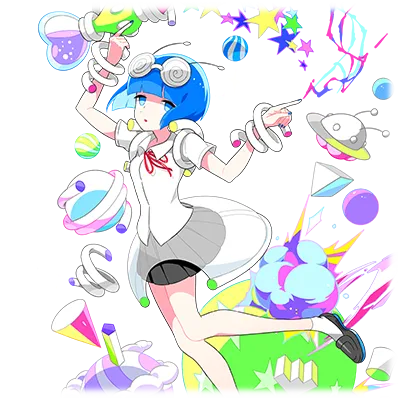

# 麦哲伦·麦哲伦

| 角色信息   |  |
| ----------- | ----------- |
名称|麦哲伦·麦哲伦
地球上的名字|大桥银子
年龄|2115岁
职业|地球的普通科高中生（高一）
喜欢的人|费迪南=梶木学长♥
| 对应曲   | 光線チューニング|
| 对应版本 | Chunithm STAR

注：女主角的名字致敬了第一个东向西跨太平洋的航海家费迪南·麦哲伦。学长的名字对应了麦哲伦的名字。

## Episode 1 麦哲伦是宇宙人

>我的名字叫麦哲伦·麦哲伦。在地球上的名字叫“大桥银子”。因为某件事，我决定前去地球上学啦！

“麦哲伦・麦哲伦”是一位居住在麦哲伦星云的女性外星人。

麦哲伦星人有着独特的生理特征——长在头上的奇特的触须，平日里还总是手持一把神秘的光线枪，但他们的外貌与地球人相差无几。

此外，麦哲伦星人性格十分友善。

凭借高超的科技水平，他们制造出宇宙飞船，通过星际旅行、海外留学等方式，积极推动不同星球间的交流。

 

而我们这个故事的主角“麦哲伦・麦哲伦”…… 地球名为 “大桥银子” 的她，也是麦哲伦星人的一员。

她的实际年龄有2115岁，换算成地球人的年龄的话，就是大约 15 至 16 岁，正处于升入高中的阶段。而她最终选择的学校，是地球的一所高中。

那是某地区的一所升学向高中，她之所以执意要进入这所学校，其实有着不为人知的 “特殊缘由”……

 

“什、什么！……居，居然没考上吗！？”

 

……看来，她最终还是没能考上那所高中。

## Episode 2 入学考试，意料之外的落榜

>明明已经为了心爱的学长从宇宙的尽头千里迢迢来到地球了……怎么就落榜了呢！

麦哲伦执意要考入地球那所升学高中的理由，既不是 “想要拯救故乡的星球”，也不是 “追寻可恨的仇敌” 这类宏大的目标。

但对她而言，这个理由的重要性却堪比整个宇宙。

 

特意离开故乡麦哲伦星云，下定决心要到这颗堪称边陲之地的遥远地球读高中的理由——那便是“恋爱”。

麦哲伦的心上人——名为费迪南·梶木。（フェルディナンド＝カジキ）。他是比麦哲伦高一年级的学长。

眉清目秀、文武双全、智勇兼备……这些词语仿佛就是为他量身定做的。但他从不因自身出众的才华而自视甚高，是一位如春风般清爽的美少年。

这样如同童话里王子般的学长，恐怕任何女生都会心生憧憬吧。

麦哲伦自然也不例外。

然而，当梶木学长为了实现 “宇宙外交官” 的未来梦想，进入了这所升学高中的时候，无数的女孩子也只能放弃了对他的追求。

就在这时，却有一位少女，明知山有虎，偏向虎山行。她下定决心，要追随学长的脚步进入那所学校……她就是麦哲伦。

 

“请你一定要等我呀，梶木学长……你的麦哲伦，这就来到你的身边！”

 

……这里必须说明一句，麦哲伦和梶木学长并非关系要好的前后辈。事实上，他们甚至从未有过任何交集。

即便如此，她仍能做到这般义无反顾。如此惊人的行动力与妄想力，正是支撑麦哲伦前行的动力源泉。

## Episode 3  目标是转校！

>既然如此，那就只能尝试转学了！区区考试什么的，看我略施小计……嗯？考试不能偷看别人的答案吗？

明明已经为了心爱的学长来到地球参加了入学考试……然而结果却只是个大大的“不及格”。

麦哲伦最终也只能去普通科的高中就读了。

 

“这种情况实在是超出了我的想象了啊……”

 

就连生性无忧无虑的麦哲伦，这次也不免对眼前的现实而叹气起来。

 

“既然这样的话！那就不得不努力考进学长的学校了啊！首先就从考试拿到高分开始吧！”

 

一不做二不休。麦哲伦立刻开始了行动。

可学长就读的学校是顶尖的升学高中，要是连考试都拿不到优异的成绩，还想转学过去简直就是痴人说梦。

但麦哲伦压根没有 “复习备考” 的概念，她最讨厌的就是 “努力” 这种事。

于是，为了应对考试，麦哲伦想出了个招——把教科书上的内容原封不动地抄在了胳膊、身体甚至桌子上。

没错，她竟然搞起了 “作弊” 这一套。

……可她的对手，是常年与学生作弊行为斗智斗勇的资深教师。麦哲伦的作弊手段被轻易识破，最后闹得连远在故乡的父母都被叫来学校，挨了一顿严厉的批评。

 

“可恶啊～…… 下次一定要想出完美的作弊方法！”

“话说回来，大桥同学？” 

 

面对丝毫不知悔改的麦哲伦，就连见多识广的老师都露出了无奈的表情。

 

“要是能把整本教科书都抄下来，还不如一开始就好好复习，反而更省时间吧？”

## Episode 4 老师和前路讨论

>竟然跟我说什么“放弃转校吧”……太过分了！你不是老师，其实只是扮成老师的邪恶外星人对吧！

麦哲伦的作弊计划以失败告终。

不出意料，考试的结果也是一败涂地。

但是，在麦哲伦的字典里没有“撤退”或者“放弃”这样的字眼。

 

“一定要前往学长所在的学校”

 

像这样的想法早已在她心中扎根。

班主任对着满脑子执念的麦哲伦，头疼地说到。

 

“大桥同学…… 很遗憾，以你现在的成绩，想进那所升学高中基本不可能。还是放弃吧。”

“也就是说，转去学长学校的概率是 0% 咯？”

“也不能说是 0%，但……”

“搞什么嘛！只要还有 1% 的可能性，那就简单了～！凭我和学长之间恋爱之力的话，肯定能搞定的啦～”

 

麦哲伦脸上挂着莫名自信的笑容，老师赶紧补充解释。

 

“不是啊！虽然不是绝对0%，但以你现在的学力，根本没半点机会的！首先得好好读书……”

 

老师拼尽全力想说服她，可麦哲伦完全听不进去。

 

“你为什么要说这种过分的话？难道你根本不是老师，而是邪恶的 M33星人伪装的吧！？”

 

……最后，就在麦哲伦掏出了她引以为傲的光线枪，正要对着老师发射 “麦哲伦光束”的时候，被听到骚动赶来的其他班级老师及时制止了。

## Episode 5 学习路上四处皆敌！

>嗯……明明想认真学习的，但是总会有像是睡意啊游戏啊什么的来捣乱……所以，学啥啊！摆烂了！

期中考试，麦哲伦考得一塌糊涂。所以，这次的模拟考必须拿个好成绩才行！

可都到这时候了，麦哲伦还在自顾自想着“肯定是批改试卷的机器出故障了嘛～”这样的事情。

面对这样的她，班里的朋友们只能叹着气劝说着。

 

“我说银子酱？你就试着好好学一次嘛？就一次也行呀。”

 

没办法，麦哲伦这辈子头一回正经开始了考前复习。

 

“呜～。先确认下考试范围…… 呼 ——！”

 

没想到，麦哲伦刚打开课本 3 秒，**就直接睡着了**。

倒头就睡的她，额头就这样狠狠地撞到了桌面上。由于疼痛猛地惊醒的麦哲伦只能忍着疼痛咒骂着不知道存在于何处的敌人。

 

“可、可恶啊～……难道是M33星人的攻击吗～？”

 

她环顾房间，没发现任何敌人的踪影，只好歪着脑袋嘟囔：

 

“……呜～。还是先做做别的，转换一下心情吧～！”

 

那之后，麦哲伦又接连败给了“打瞌睡”，“看漫画”，“看电视”，“打游戏”等无数诱惑，而每次她突然惊醒，就把锅甩给邪恶的外星人。

最后，她终于……

 

“…… 好啦！放弃啦！我果然不适合考试复习什么的啦！”

 

麦哲伦干脆利落地放弃了学习。

## Episode 6 名为模拟考试的中BOSS出现了！

>为了这场考试，我做出了只要丢一下就能够以二分之一几率获得正确答案的铅笔，不过，在考场丢铅笔会不会被骂啊……

终于到了模拟考当天。

完全没复习的麦哲伦，为了对付模拟考这个 “中 BOSS”，准备了她的秘密武器。

那就是运用麦哲伦星云的科技，开发出来的，——一转就有 1/2 概率算出答案的铅笔！

这里必须说明一下，这可不是因为麦哲伦有发明天赋。因为对麦哲伦星人来说，这种程度的发明，就跟系鞋带一样简单。

只是善良的麦哲伦星人，从来没想过要把引以为傲的科技用在这种无聊的事情上而已。

 

……但不管这招多没格调，终究是个办法。

麦哲伦信心满满地开始转起了铅笔。

（哼哼～♪ 有了这个，模拟考还不是小菜一碟～！啪咻！啪咻！）

麦哲伦正转得不亦乐乎，可就在这时……

“喂！大桥同学！认真答题！别以为搞这种小动作就能过掉转学考试啊！”

 

老师误以为她在 “玩闹”，一把没收了她的必杀铅笔。

但麦哲伦既没气馁，也没明白问题所在。

（原、原来是这样！老师说的是对的！毕竟铅笔掉在地上声音太响了嘛！而且这玩意儿只能应付选择题，怎么够用！）

完全误解了老师意思的麦哲伦，下定决心要开发更厉害的考试专用道具。

## Episode 7 决定命运的正式考试！

>终于来到正式考试了！不过，只要靠这副我亲手特制的麦哲伦眼镜，那就万事大吉了！

终于来到了决定命运的正式考试。

挡在麦哲伦眼前的，正是她人生最大的敌人——转入学长所在学校的入学考试。

 

（呼…… 呼…… 呼…… 终于等到这一天了！）

麦哲伦眼下挂着乌黑的黑眼圈，脸上却露出了诡异的笑容。

这两三天里，她一直在通宵赶工。

 

当然，不是为了考试而复习。

吸收了模拟考的失败经验，她为了这次考试，开发了专门的道具。

那就是……

 

（当当当当！『透视眼镜』！只要戴上这副眼镜扫描物体，就能看穿它的本质…… 只要盯着考题看，答案就会自动显示出来啦～！）

 

这次的发明，就算对于麦哲伦星人来说，也不是件易事。虽然麦哲伦这辈子头一回尝到了 “努力” 的滋味……但是努力的方向也完全跑偏了。

就这样，麦哲伦不仅顺利跨过了转学考试的 “合格线”，甚至获得了史上首例入学满分的奇迹成绩，成功拿到了转入心仪学长所在的升学高中的资格。

## Episode 8 那个和天才只有一纸之隔？

>当我被问到报考的原因时，我回答了“想和学长过甜甜蜜蜜的恋爱生活”，结果对面的老师露出了奇怪的表情呢？

终于到了最终BOSS的阶段——也就是转入学长所在的学校，最后的面试环节！

 

“大桥同学。听说你取得了前所未有的优异成绩……没想到竟然能在入学考试中取得全部满分的成绩，真是了不起。能取得如此出色成绩的你，是怀着怎样的志向选择我校的呢？”

 

并不知道麦哲伦的成绩来路不正的面试老师，还以为对面坐着的是这所学校创立以来首位获得满分的天才转学生，脸上仍是满面的笑容。

麦哲伦压根没把面试官放在心上，兴致勃勃地答道：

 

“我之所以要转来这所学校～就是因为学长在这里呀～！我呀，想和学长一起，在这里过甜甜蜜蜜、卿卿我我的校园生活呀～！嘿嘿嘿～！”

 

她一边露出没个正形的笑容扭动身子，一边沉浸在自己的妄想里。看着这样的麦哲伦，面试官也不由得愣住了。

但他很快像是想通了什么似的，点了点头：

 

“哈…… 原来如此。嘛，虽然不太明白…… 或许天才的想法，本就不是我们这些普通人能理解的吧。”

 

就这样，麦哲伦顺利成功转入了梶木学长所在的升学高中！

## Episode 9 那个女的……不可饶恕！

>明明见到了憧憬的学长，但是身边却多了个生面孔。竟然还有外星女人潜藏于其中！？你这家伙想对学长做什么！

麦哲伦，终于成功进入学长所在的学校。她并未前往自己所在的班级，而是直接奔向了学长所在的班级。

 

“梶木学长——！！您最心爱的麦哲伦……不对，银子，现在就来找您啦！”

 

麦哲伦，她的梦想终于要成真了。

 

……然而并非如此。

在她心爱的学长身旁，正有一名妖娆的女学生微笑着。

麦哲伦猛地停下脚步，惊愕不已。梶木学长则用毫无神采的眼神看向她，冷冷问到。

 

“你是谁？为什么知道我的名字？……能不能不要打扰我们了，能请你出去一下吗？”

 

仿佛要给瞪大双眼的麦哲伦再补一刀般，学长竟然与那女生旁若无人地深情拥吻！

 

（哇啊啊啊！？怎，怎么会了？学长怎么就这么跟这个女的亲热起来了！？）

麦哲伦呆立当场，耳边传来周围同班同学的议论声。

 

“梶木同学……自从和那个女生交往后，整个人都变了呢。”

 

（诶……！？难、难道说！）

麦哲伦立刻戴上挂在额头的“透视眼镜”，扫描了学长身边的女生。下一秒……那姣好的容貌便如同烟雾般消散，眼前的女生竟变成了丑陋的外星人！

她下意识确认对方的脖颈——那里赫然印着一颗心形胎记，正是邪恶的M33星人才会有的标记！

（啊、那是！不会错的！是M33星人！竟敢对我的学长，做了这种事 ——！）

麦哲伦攥紧小小的拳头，气得不停发抖。

## Episode 10 深夜的决战

>果然学长是被邪恶的外星人洗脑了吗！哎！接招吧！麦哲伦尼克斯光束！

麦哲伦将操控梶木学长的恶党——也就是伪装成地球人的邪恶 M33 星人，约到了夜晚的校舍。

 

“这么晚叫我出来，有什么事？”

“别装模作样了！你的真面目我早就看穿了！现出原形吧！邪恶的M33 星人！”

“！？……你怎么会知道我的身份！？可恶！我本想利用梶木这么优秀的美青年，就这样侵略地球的！”

 

邪恶的 M33 星人的本能就是侵略他人。

他们的 DNA 中刻着绝对的准则：“自己的东西是自己的，别人的东西也是自己的”。

麦哲伦星人天生拥有极致的善良（不过麦哲伦是个例外），与M33星人简直就是水火不容的宿敌。他们自古以来，便持续不断地相互争斗。而此刻，在这边陲之地・地球，新的战火已然点燃！

一开始，M33 星人占据了上风。但就算地球的和平与她无关，可事关心爱的梶木学长的心，麦哲伦绝不能输！

 

“…… 接招吧！麦哲伦光束！啪咻啪咻啪咻啪咻啪咻！”

“这……这不可能！我居然……居然会栽在……！”

 

M33 星人被麦哲伦发射的光线枪彻底消灭。就这样，学长的心意得以守护，顺带也保住了地球的和平。

## Episode 11 爱情力量的大胜利

>在邪恶的外星人被打倒之后的第二天，学长向我摆出了个笑容。看来我们两人已经是两情相悦了呢！

邪恶的 M33 星人被消灭了。这样一来，梶木学长的洗脑应该也顺利解除了才对……

第二天早上，麦哲伦在校门口等着，确认梶木的安危。

不久后，学长英姿飒爽地走进了学校。哪怕隔着一段距离，麦哲伦也能清晰看到他的身影。

（啊啊…… 学长果然还是这么迷人呀～）

随着学长不断靠近，麦哲伦的心跳越来越快。

 

然后…… 就在麦哲伦与学长擦肩而过的那一瞬间——

 

（啊！学、学长他！刚才是不是看着我的脸微笑了呀！？）

学长的笑容，不再是昨天那般空洞无神，而是他与生俱来的、如春风般清爽的模样。

看到这抹笑容，麦哲伦立刻确信：学长的洗脑已经解除，而且他对自己也有感觉！

（啊、你看！他还向我投来这么热烈的目光！……果然我和学长是被红色的光线所紧紧相连的呀～！）

 

……此刻的麦哲伦满脸通红、浑身发烫，沉浸在自己的幻想里，完全没发现 ——

梶木学长那所谓 “热烈的目光”，其实是投向她身后不远处的、被誉为 “校园女神” 的女生。

不过，那都不重要了。

就这样，今天的地球也依旧平安无事。