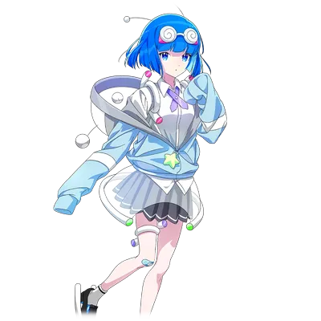
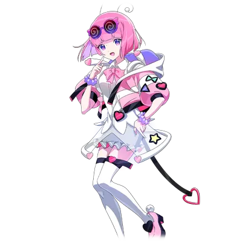
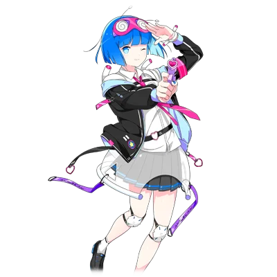

# 麦哲伦·麦哲伦/银河恋人

| 角色信息   |  |
| ----------- | ----------- |
名称|麦哲伦·麦哲伦
地球上的名字|大桥银子
年龄|2115岁
职业|地球的高中生（高一）
喜欢的人|费迪南=梶木学长♥
| 对应曲   |コスモポップファンクラブ
| 对应版本 | Chunithm NEW

## Episode 1 哦，梶木的样子……？

>不管睡着还是醒着，脑子里都是麦哲伦·麦哲伦。

前情提要。

麦哲伦星人“麦哲伦·麦哲伦”为了追随心仪的学长“费迪南德·梶木”，决心转入地球的高中。

历经重重困难，麦哲伦终于来到了梶木学长身边。

然而，梶木早已被企图侵略地球的M33星人洗脑操控。

为了解救梶木，麦哲伦毅然发起挑战，却在M33星人的猛烈攻势下陷入绝境。

但对梶木的爱意彻底爆发的麦哲伦，放出全力一击的光线，成功消灭了M33星人。

麦哲伦不仅赢得了胜利、解除了梶木的洗脑，还顺带守护了地球。

本以为接下来，她就能迎来和平又甜蜜的日子……

 

在那之后又过了几个月——梶木家中。

 

“麦哲伦现在在做什么呢……？”

 

梶木摊开纯白的笔记本，愣愣地喃喃自语着。

 

“啊……不行，得集中精力学习！唔唔唔……”

 

他重新打起精神，笔尖在笔记本上滑动——可没过多久。

 

“麦哲伦……麦哲伦……麦哲伦麦哲伦麦哲伦！不行啊！脑子里全是麦哲伦的事情，根本挥之不去——！”

 

他扔掉钢笔，点开手机的相册。

里面整齐排列着麦哲伦扑进他怀里的照片。

 

“刚认识的时候觉得她太古怪，完全搞不懂她在想什么，最近却变得沉稳多了……不对，是变得可爱了啊。会轻轻拽着我的衣角，还会突然对我笑……”

 

凝视着照片的梶木，脸上露出了慵懒又温柔的笑容。

 

“上次她不仅给我做了便当，还喂我吃……嘿嘿，一不小心就脸红了。如果她下次再给我做，我一定要……”

 

——（幻想的粉色泡泡音效）

麦哲伦（幻想中）：“学长～我带便当来啦！你一定会吃的对吧？”

梶木（幻想中）：“那当然！不止今天，我想每天都吃你做的便当啊。”

麦哲伦（幻想中）：“诶，那也就是说……”

梶木（幻想中）：“没错，一辈子都陪在我身边吧。”

麦哲伦（幻想中）：“学长……！”

——（幻想的粉色泡泡音效）

 

“然后两人深情相吻……就这么永远在一起！”

 

太过投入的梶木站起身，紧紧抱住了自己。

 

“呼……一想到这些就忍不住热血沸腾啊。”

 

似乎这对他来说已经是家常便饭了。

 

“哼，哼哼……脑内的演练也万无一失。明天的约会一定要成功！等到那时候……！”

 

梶木攥紧拳头，坚定了决心。

他随手瞥了眼手机，屏幕上显示的，是两人刚认识不久的照片——

照片里的麦哲伦笑得天真烂漫，而梶木则被她的吵闹弄得有些不耐烦。

 

“感觉已经是好久以前的事了啊……哈啊。”

 

梶木沉浸在怀旧的情绪里，困意渐渐袭来。

 

“明天要和麦哲伦约会……今天得早点睡才行。”

 

呼……呼……呼……

终于到了期盼已久的约会日。

梶木怀着紧张的心情赶往约定地点，却撞见了难以置信的一幕——

“你这个冒牌货～！竟敢模仿我，到底在打什么坏主意～？”

“哈啊～？什么冒牌货呀？人家完全听不懂你在说什么嘛～？”

 

麦哲伦和麦哲伦。

两个麦哲伦面面相对。

左边是麦哲伦，右边是麦哲伦。

西边是麦哲伦，东边是麦哲伦。

梶木的大脑彻底宕机，只剩下震撼的呐喊：

 

“怎……怎……怎么会有两个麦哲伦啊～～～！？”

## Episode 2 双重·麦哲伦

>竟然要和我以外的女人约会……？别以为我会饶了你！

“快现出原形吧，你这个冒牌货～！”

“都说了，人家就是麦哲伦呀～？”

 

两个麦哲伦，声音、样貌全都一模一样。

虽说世上总有三个长相相同的人，但如此近距离的目睹两个一模一样的人，还是有点难以置信了。

就算是被人以秀才所称的梶木，也被这无法理解的现实搞得头晕脑胀。

 

“到、到底发生什么事了……？其中一个是真的麦哲伦，另一个是……不对，等等……？”

 

就在这时，梶木突然灵光一闪！

 

“对啊！麦哲伦有两个也没关系啊！这肯定是空前绝后的麦哲伦后宫呀！能和两个人都交往，我也太幸运了吧！”

 

他自顾自往对自己有利的方向解读，兴高采烈地朝两个麦哲伦跑去。

 

“嗨～两位麦哲伦！今天天气真好呀！”

““学、学长！””

“哇～好久没见到学长啦！就算是隔了一个星期，学长还是这么帅啊～！”

“哈哈哈，麦哲伦你真有意思。我们明明每天都见面啊。”

“诶？”

“不过真没想到，竟然有两个麦哲伦！”

“才、才不是呢！我才是真的！我是正品，她是冒牌货～！”

“学、学长救我呀……突然冒出个和我长得一样的人，我都搞不清状况了……”

 

说着，右边的麦哲伦脚步虚浮地晃了晃，朝梶木靠了过去。

 

“麦、麦哲伦……？”

“喂！你对我的学长做什么呢！离他远点～！”

“学长……你难道……讨厌我吗～？”

“完全不讨厌！超级不讨厌！一直这样也挺好的嘛……嘿嘿。”

“你、你那是什么表情～！既然这样，我也不会输的～！”

 

左手一个麦哲伦，右手一个麦哲伦。

怀里不是鲜花，而是双倍的麦哲伦——这样的状况，梶木怎么可能不开心。

 

“咕努努……在我回星球的这一小段时间里，竟然敢抢走我的位置为所欲为……绝对不能原谅～！”

“诶～你在说什么呀？人家完全听不懂啦。”

“啊，对了，今天的约会该怎么办呢？”

“约、约约约约会！？不、不行呀！这种事绝对不能允许～！？”

“可是，这跟你没关系呀。”

“啊、啊啊啊——！”

“不过，学长真的要这样，在分不清真假的情况下去约会吗……？”

“不愧是学长～又绅士又温柔呀。”

“哎呀……”

“别一脸春心荡漾的样子！”

“那不然，我和她来比试，看谁更在乎学长怎么样呀？”

“奉陪到底～！”

“啊，不……那个……”

“学长肯定会选我约会的！”

“学长，你会选我的对吧？”

 

被两个麦哲伦步步紧逼，梶木犹豫不前。

最终他得出的答案是——

 

“我知道了！你们两个都拿出全力，好好展现对我的心意吧！”

 

究竟，胜利的女神会对哪一方露出笑容呢！？

## EPISODE3　冒牌货的真面目？

>别的事情怎样都无所谓……谁也别想诱惑学长～！

梶木被夹在中间，两个麦哲伦的视线碰撞出火花。

而略带腹黑的那个麦哲伦，此时心里已经乐开了花。

（哼哼～计划通！我可真是太完美了！不愧是我，米哲伦酱呀！）

米哲伦·米哲伦。

她正是米哲伦星人。

拥有连样貌、声音都能完美模仿的变身能力，专门破坏他人人际关系！

——这种能力就不能用在正经地方吗？

 

“毕竟，从一开始，胜利就注定是我的。”

“你刚才是不是说了很欠揍的话！”

“……是这样吗？”

“怎么可能呢，我怎么可能说这种话呢？”

说着，米哲伦牵起梶木的手，按在自己的胸口：

“学长，你能感觉的到吧……麦哲伦现在心口正小鹿乱撞呢……都怪学长，人家才会这样哦～”

“麦、麦、麦哲伦……”

“啊哈，学长的脸都红透啦。之后的事情……就等这场比试结束再说哦（❤～）”

“……（吞了吞唾沫）”

“你在干什么呀啊啊啊啊啊！”

“没干什么呀？”

“哼唔唔唔……不管冒牌货耍什么肮脏手段，我和学长可是在打败M33星人那天，被红色的光线紧紧相连的呀～！我们本来就是该相亲相爱的啊～！”

 

麦哲伦回忆着过去，激动得浑身发烫。

可她不知道，

那天梶木的注意力根本不在她身上，而是全放在了她身后的校园女神身上！

 

“啊……我看到了宇宙……”

（此处恶搞了《机动战士高达》里阿姆罗的台词“あぁ……刻が見える……”（啊啊……我看到了时间……））

 

然而梶木完全沉浸在温柔乡里，直接无视了这场争执！

这场比试，压根就没有呈现出势均力敌的样子。

## EPISODE4　女友力对决

>能让学长神魂颠倒的只有我！根本没冒牌货什么事～！

终于，决战的帷幕拉开了！

而掀起这场决战的，竟然是梶木本人。

 

“这种时候，就得用这个了。”

 

——唰。

 

梶木掏出的，是麦哲伦星人再熟悉不过的光线枪。

 

“那是什么呀？”

“不愧是学长，太懂了～！”

“呃……？”

 

解释一下！

对麦哲伦星人来说，最高级别的爱意表达，就是用光线枪射中对方。

这是米哲伦绝不可能知道的情报。

 

“这是麦哲伦星人的传统。就请接下我的心意吧！”

“我已经准备好接收学长的心意啦！”

“学长，轻点好不好嘛～”

 

麦哲伦张开双臂，做好了万全准备！

而米哲伦则吓得惊慌失措！

 

梶木手中的光线枪汇聚起红光——

 

“那个……学长，还没好吗？”

 

红光越聚越亮——

 

“喂，等等学长，这蓄力的是不是有点——”

“麦哲伦啊啊啊啊——！！！”

“呀啊！？”

 

发射出的红色光流，毫不留情地淹没了两个麦哲伦！

究竟，最后站着的会是谁呢！？

## EPISODE5　爱情破碎

>能接住学长爱意的只有我！果然我们是两情相悦的呀～！”

 

光线枪的光芒渐渐散去。

原地留下了两个麦哲伦，她们虽受了伤，却仍咬牙坚持站立着！

 

“呜……”

可下一秒，米哲伦就瘫倒在地。

 

“哼……学长的爱意！我接住啦！”

 

麦哲伦得意地对米哲伦摆出胜利的表情。

胜负，就在这一瞬间决出。

 

“这样就证明我才是正品啦～！接下来就能和学长甜甜蜜蜜约会……嘿嘿嘿。果然我们是两情相悦，从第一次见面就已经是命中注定啊～！”

 

哈哈哈！

就在麦哲伦全力炫耀胜利时，梶木却走向了倒地受伤的米哲伦。

 

“学、学长……”

“麦哲伦……”

“对不起……我、我输了……”

“……”

“我太弱了……所以，不能留在学长身边了……”

“怎么会……”

“在学长奔向她之前，能答应我一件事吗？”

“啊、好！什么都答应你！”

“费迪南·梶木同学……”

“……！”

“我喜欢你。”

 

泪水唰地从米哲伦脸颊滑落，

那泪水美丽又带着一丝虚幻，浸湿了地面。

 

“学长～！别管那个失败者了，快跟我一起去二人世界吧～！”

 

麦哲伦意气风发地跑过来，却感受到梶木身上散发出的低沉气息，疑惑地皱起眉头。

梶木痛苦地转过头，对她说。

 

“我做不到。”

“什啊啊啊啊啊！？”

 

麦哲伦被这突如其来的打击冻住了。

可梶木毫不在意，轻轻抱起了米哲伦。

 

“……我终于明白了。你才是我的麦哲伦。”

“学、学长……？”

 

梶木早已洞悉一切。

他真正不想让其伤心的。

不是麦哲伦，而是顶着麦哲伦样貌的米哲伦——

 

“我们去约会吧。”

 

听到梶木的话，米哲伦瞬间绽放出灿烂的笑容。

“……好呀！”

 

另一边的麦哲伦，仍然因为震惊，冻在原地。

这实在是太可怜了。

 

“——哈？”

 

紧接着，米哲伦像是炫耀胜利般，笑着——用自己的唇堵住了梶木的唇。

 

“#￥*&￥#（%*&（*……（%*……&（*&”

 

麦哲伦不敢相信眼前的景象，落荒而逃。

 

“别以为这样就赢了啊啊啊啊啊～！！！”

留下一句反派般的台词后，麦哲伦哭了整整三个小时。

话说回来，梶木的初吻怎么总被抢走啊！

## EPISODE6　伤心的麦哲伦

>如果想要从冒牌货的魔掌中救出学长……就得发明能让他迷上我的东西呀～！

“怎么能在这里认输……唔唔唔。怎样才能夺回学长呢？”

 

这种时候的麦哲伦，脑子转得比天才还快。她可不是一直都傻乎乎的。

 

“说到底，我和那家伙长得几乎一模一样……嗯？也就是说，我其实就是学长喜欢的类型呀～！”

 

这想法也太直球了！

 

“也就是说，只要发明出能让我魅力爆棚、远超冒牌货，让学长神魂颠倒的东西——有了！”

 

就在这时，一道电光闪过麦哲伦的脑海！

（此处恶搞了《斗牌传说》的台词“矢木に電流走る”）

 

“把这个像这样增幅一下的话……哼，嘿嘿嘿。这样就能让学长彻底迷上我啦。嘿嘿嘿……”

 

积极思考的麦哲伦脸上露出了邪恶的笑容。以这份屈辱为动力，麦哲伦开始了行动！

---

## EPISODE7　夺回爱情！

>就用这把『可爱猎手』，夺回学长的心～！

“接下来想去哪里？”

“只要和学长在一起，去哪里都好～……啊！学长，你嘴角沾到奶油啦？”

“诶，真的吗？可能是刚才吃可丽饼的时候沾到的吧？”

“别动哦。我来帮你擦掉♪”

 

约会已经开始好几个小时了。

两人正处于任谁看都会觉得是一对笨蛋情侣的约会气氛之中。

这时，不出所料的袭击者出现了！

 

“终、终于找到你们了！！”

 

麦哲伦摆着一个自认为超帅、实则有点滑稽的姿势，闪亮登场。

 

“麦、麦哲伦……？”

“嘘～学长别理她。只是个怪人罢了。”

“你才是怪人呢～！你这冒牌货的阴谋诡计也就到此为止了！！”

 

咔嚓！伴随着与体型不符的沉重声响，麦哲伦掏出了光线枪。

“那不是麦哲伦星的光线枪吗……？”

“诶，那东西很危险吗？”

 

梶木和米哲伦一脸嫌麻烦的表情，皱起了眉头。

 

“才不危险呢。这是我的秘密武器——它的名字叫『可爱猎手』！”

 

稍微说明一下吧！

这是运用麦哲伦星的高超科技，结合M33星人曾使用过的技术研发而成的最高杰作！

被这把光线枪射出的光束击中的人，对射击者的好感度会飙升到顶点！

效果持续时间因人而异，最长可达一个月以上。

原本好感度越低，效果持续时间越短，但它能让人迅速建立良好关系，简直是神器！

家家户户都值得拥有的发明品！

 

“——所以说，我一定要和学长过上甜甜蜜蜜、卿卿我我的校园生活～！”

“竟然想用这种东西玩弄学长的心！”

“冷静点，麦哲伦。我的心一直都属于你一个人。永远对你一见钟情。”

“这种话听起来怎么这么像flag呀？”

“学长！请再一次……接收我的心意吧——！”

 

——啪咻！

 

“不、不要啊！”

 

一切都发生在瞬间。

光束即将命中的前一秒，米哲伦奋不顾身地抱住了梶木，护住了他。

 

“呀啊啊啊！？”

“麦哲——唔哇——！！？”

 

然而，米哲伦的行动白费了——光束还是吞没了两人。

 

“等学长下次醒来，我们就会变成恋人啦～。嘻嘻嘻”

 

这行为也太强硬了！

简直就是彻头彻尾的反派。

## EPISODE8　爱情争夺战

>我只是想要学长的爱而已，为什么连冒牌货都迷上我了呀～！？

麦哲伦本以为，自己从米哲伦的魔掌中救出了梶木。

就能过上平和而甜蜜的日子……

“我呀，一直想成为你这样的人。”

“别、别过来呀～！”

 

米哲伦满脸通红，像是发烧了一样，凑近了麦哲伦。

 

“听我把话说完——”

“所以我才模仿你……想把学长从你身边抢走……”

“真相竟然是这样的吗！？”

 

就在这时，一枚鱼干猛地插进两人中间，将她们分开。

 

““！？””

“就是现在，麦哲伦！”

 

这是麦哲伦最想听到的声音。

 

“学、学长——哈？”

“麦哲伦……我绝不会交给任何人！”

 

闯入现场的，是戴着奇怪面具的梶木。

 

“你没事吧，麦哲伦。有我在，不用怕。”

“竟然想破坏我们的关系……绝对不能原谅！”

 

梶木以公主抱抱起了麦哲伦，朝着夕阳西下的街道狂奔而去。

 

“太、太幸福了～！”

 

麦哲伦沉浸在喜悦中，可这份喜悦并没有持续多久。

在他们身后，米哲伦面无表情地追了上来。

她全程毫无表情，跑步姿势标准得像个机器人。

 

“再射中一枪就能解除效果啦！”

 

麦哲伦大喊着明显的flag台词，举起了可爱猎手。

 

“麦哲伦，抓紧了！”

 

可就在这时，梶木突然高高跃起。

 

“喂啊啊啊啊啊！？”

 

可爱猎手被抛向空中，然后径直落下——

 

——噗！

“啊”

——咔嚓！

 

“啊、这也就是说，只能等到效果消失了吗……？”

 

察觉到危险的麦哲伦撒腿就跑。

 

“和我一起甜甜蜜蜜吧～！”

“我来保护麦哲伦！你快跑！”

 

身后，梶木和米哲伦已经开始用光线枪互相射击。

虽然能听到“噼啪噼啪”的枪声，但麦哲伦头也不回地拼命奔跑着。

 

“为什么会变成这样呀～！？”

 

麦哲伦开始反省自己的所作所为。

自己到底做错了什么。

麦哲伦究竟能不能和梶木过上甜甜蜜蜜的校园生活呢？

这一点，无人能够知晓。

