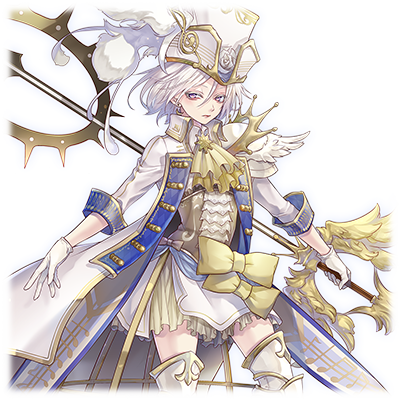

# 玛利梅亚·克雷斯坎斯

| 角色信息   | |
| ----------- | ----------- |
| 名称    | 玛利梅亚·克雷斯坎斯（叫玛利亚就可以了！）       |
| 年龄   | 15岁（正值青春可爱的年纪，很棒吧！）       |
| 职业 | 法王骑士团（别看这样我可是很强的！真的哦！）  |
| 对应曲   | Magic    |
| 初出   | Chunithm Amazon    |
|CV|斋藤千和

>注：整篇故事含有极多的跟《恶魔城》系列相关的梗（包括TAS视频的梗）。
 **选用的CV**：斋藤千和曾经在《恶魔城·绝望协奏曲》中担任玛利亚·雷纳德的配音。   **解禁名牌和系统语音的DUEL名称“暁月城Try Again Speed”**：与故事中大量的《恶魔城》以及与其相关的TAS视频梗遥相呼应。   TAS为“Tool-Assisted Speedrun”的缩写，即使用游戏机模拟器的辅助功能，在不修改游戏本体的前提下利用各种辅助工具进行的速通游玩。其中常常用到各种游戏中的漏洞或者小技巧，在系统允许的情况下达成常人难以达到的操作效果。   **「You can't hit me! ふっふっふ…当たらんよ!」（DUEL活动时的被攻击语音）**：两句台词都是《恶魔城·被夺走的刻印》里，本篇通关后可以使用的角色“阿尔巴斯”在使用传送时的台词。前半段为英文台词“You can't hit me!”，后半段为日文台词「フッフッフ…」（哼哼哼……）「当たらんよ…」（打不中我的……）   **「ちょwwwよくやったwwwwww」（选择继续游戏的语音）**：是《恶魔城·迷宫回廊》里的登场人物艾利克·利卡德的台词。 由于在TAS视频中高速跳过台词，所以台词会变成这样。 原本前半部分应该为「調子はどうだい？」。   <ruby>**（叫玛利亚就可以了！）**<rp>（</rp><rt>**(マリアって呼んでね!)**</rt><rp>）</rp></ruby>：来自《恶魔城X血之轮回》里玛利亚·雷纳德的台词。   **双剑“马克西姆”，“史黛拉”**/“<ruby>**（基辛流奥义）**<rp>（</rp><rt>**(キジン流奥義)**</rt><rp>）</rp></ruby>”/**「ムンッ! ムンッ! ハァイ!」**： 该梗来自于《恶魔城·白夜协奏曲》的角色马克西姆·基辛。武器是名为“Stellar Sword”（星光之剑）的长剑。会使用名为“基辛流”的武术。使用特殊招式会有「キシン流奥義!」的台词。对应Episode3里描述的各种内容。「ムンッ! ムンッ! ハァイ!」是该角色跳跃时的声音。  **赤月城**：恶搞“恶魔城”。与原作一样，都是神出鬼没的存在。  **「Show Time!」 / 「玛利亚！」「特尔敏特!」**：以上内容都是在捏它《恶魔城·迷宫的画廊》的内容。前者是在美版游戏标题画面按下按键后发出的语音。由于这部游戏可以随时换人进行闯关，而换人的时候就会呼喊对方的名字，后者正是对应这一场合（而且还是连续换人）。  **「空即是色!」 / 「トゥ、エィッ」**：来自于《恶魔城·晓月圆舞曲》的角色尤里乌斯·贝尔蒙特。在《恶魔城·绝望协奏曲》中，尤里乌斯有一招可以进行横向高速移动的招式“色即是空”。本文恶搞了这个名字。尤里乌斯在《恶魔城·晓月圆舞曲》中发动飞踢的声音就是「ドゥエ!」。  **「IGYAAAAAAAAAAAAAAAAA!」**：对应常常出现在《恶魔城》系列的过关流程动画，最终通关进入制作人员名单时，常常出现的弹幕。原本一般都是“IGAAAAAAAAAAAAAAAAAAAAA”，对应的是恶魔城系列的著名制作人五十岚孝司在游戏制作人员名单中的署名“IGA”。  **宝剑·真空刀**：恶搞了初登场于《恶魔城·月下夜想曲》的超强力武器“真空刃”（ヴァルマンウェ，Crissaegrim）的日文名称。该武器的日文名据说是以《魔戒》中司掌大气的瓦拉神“曼威”为原型，写为Vala-Manwe之后，音译而来，对应了真空刃在游戏中可以释放连续空气刃的设定。  **扎刚幻影（ザガンファントム）/「ヴォーーッ！！」**：对应《恶魔城·白夜协奏曲》之中附带了「ファントム」（幻影）后缀的BOSS。「ヴォーーッ！！」（呜噢噢噢噢————！！）是这类BOSS打倒之后的惨叫声。  **真是漫长而痛苦的一战啊……** 
<ruby>**「長く苦しい戦いだった……」**<rp>（</rp><rt>**Nagaku Kurushi Tatakaida-ta**</rt><rp>）</rp></ruby>:常出现于《恶魔城》系列的流程动画中，最终过关的时候看到的弹幕，可以略成为“NKT”（取罗马音首字母）  **1马克西姆**：指《恶魔城·白夜协奏曲》操作马克西姆的TAS动画中，从游戏启动到游戏通关（最后一次输入指令）为止，游戏模拟器所记录的时间长度。  以本文完成时间点来算，马克西姆的通关TAS动画所需时间大概为23秒左右，和文中“二十秒左右”刚好对应。 以2022年5月日本那边恶魔城的TAS速通记录来计算的话，最快时间为20.38秒，大概等于0.89661马克西姆。  <ruby>**噔嘞噔嘞噔嘞嘞嘞嘞**<rp>（</rp><rt>**デレデレデェェェン**</rt><rp>）</rp></ruby>：当《恶魔城·白夜协奏曲》开始播放制作人员名单和片尾曲的时候，就会出现以上弹幕用于形容播放的音乐。  **「ペポゥ……グルボァァァ！！！」**：出现在niconico网站上对恶魔城主菜单各种声效的配音弹幕。本篇中为怪物的吼声。

## Episode 1 狼人的少女

>我的名字是玛利梅亚·克雷斯坎斯！叫玛利亚就可以了！现在，我正在法皇手下的圣骑士团里工作！

好，这样就可以了。

那么再次让我介绍下自己吧。我的名字是“玛丽梅亚”。

大家都叫我玛利亚！

还有，这对双剑的名字叫“马克西姆”和“斯黛拉”。

听起来很帅对吧？

咦，你说我的耳朵吗？

是的，正如你们所想，我，可是“狼人”哦！

虽然和身为人类的各位有些不同……。

嘛，基本上就是力量稍微有些强一些，脚力比较好一些，长得比较可爱一些啦！要是能跟各位成为朋友就好了！

于是乎，人类和狼人以及吸血鬼之间的大大大大大冒险，就要开始啦！

咦？听起来似乎没那么长的样子？

嘛，总之还是好好听一听吧，听一听如此可爱的我和不可思议的她在因缘际会之下，邂逅，并且一同冒险的故事吧！

## Episode 2 追踪白蔷薇的罪人

>被下达了前去讨伐杀死了前法皇大人的“白蔷薇的罪人”的任务的我，前往了某位领主的宅邸。

“白蔷薇的罪人吗……”

当我到达城镇的时候，整个城镇都散发着一股晦暗的气息。

镇上的居民也是无精打采，明明见到了这么可爱的我，却一点笑容都没有！

不论如何，我被赐予了一个艰难的任务。

一个月前，法皇大人去世了。

虽然死讯仍未公之于众，但是，其死因并非自然死亡，而是被人所杀。

之后，我就收到了“讨伐白蔷薇的罪人”的任务。

“白蔷薇的罪人”，偏偏还是曾经所属于教会的吸血鬼猎人的原子爵夫人……然而她却成为了吸血鬼，杀死了教皇！

（……明明我还曾听说“白蔷薇的罪人”是吸血鬼猎人中的精英呢……这还真是惊人啊）

就算这么说，不过既然已经成为了吸血鬼的话，那事情就简单了。因为我也是讨伐吸血鬼的精锐啊！

而我正是听说了这座城镇有吸血鬼的目击情报，才来到这里的。

听说这里的领主的统治十分严苛，结果就是当我踏入这里的时候，感觉整个城镇的气氛就跟盛夏时期放在外头晾着不管的面包一样，潮湿阴森，感觉随时都会发霉一样。

就在这城镇之中，我发现了一个奇怪的人影。那个身影直接进入了领主的宅邸。

（……那身法，绝对不是人类所为！）

我跟着那个身影进入了屋子……

没想到等待着我的，却是一只巨大的吸血鬼！

## Episode 3 吸血鬼哈肯迪

>在宅邸中的，并不是“白蔷薇的罪人”，而是一只吸血鬼！然而在我的基辛流面前不堪一击！

“呸噗……咕噜啵啊啊啊啊啊啊！！！”

一只足足有我三倍高度的吸血鬼在我面前怒吼着。

“嗯，虽然这确实是只吸血鬼，不过与其说是白<ruby>蔷薇<rp>（</rp><rt>バラ</rt><rp>）</rp></ruby>……这更像是牛<ruby>五花肉<rp>（</rp><rt>バラ</rt><rp>）</rp></ruby>吧？”

眼前出现的是牛头人种类的吸血鬼，而这只怪物正向我直直冲来。

要是在这附近出现这么可怕的吸血鬼的话，骑士团也不会坐视不管的。

那么只有一种可能，那就是这只吸血鬼，就是这里的领主，哈肯迪。

“就当做是热身运动吧，看我三两下干掉你！”

哈肯迪的力量十分强大，驱使着那宛如小山一般壮硕的身躯挥舞着斧头与重拳，在地面上留下道道裂痕。

但是，在我灵活的身法和“马克西姆”与“斯黛拉”这对双剑面前，也不过是班门弄斧罢了。

“呜咕噗……呸噗……”

“哈哈！喘不上气了吧？看招！基辛流奥义！呀！哈！哈！哈！哈！呀！哈！呀！”

在我连绵不断的剑招之下，即便是哈肯迪那强韧的肉体，也如庖丁解牛一般被轻松分解。

回过神来，哈肯迪的身体已经被我斩到<ruby>四分五裂<rp>（</rp><rt>バラバラ</rt><rp>）</rp></ruby>了……虽然就是一堆牛<ruby>五花肉<rp>（</rp><rt>バラ</rt><rp>）</rp></ruby>啦。

……嘛，算是我的大获全胜啦。至少，现在是这样的。

## Episode 4 与白蔷薇的邂逅

>就在我即将杀死吸血鬼的时候，白蔷薇的罪人·特尔敏特出现在了我的眼前。然而，她并没有向我发起攻击。

“呸……咕……啊……”

“什么！？”

就在我以为敌人已经被杀死的时候，哈肯迪竟然还活着。

不，应该说是“即便死了却仍旧在抓着我的脚”比较合适吧。

“……噗……叽……咯……”

“难道是想同归于尽吗！”

不好，再这样下去的话……

——就在这时，哈肯迪的动作停了下来。一把银剑穿透了他的胸口。

然后，哈肯迪的身体很快腐朽，接着变成灰烬，消失的无影无踪。灰烬散去，出现在我面前的，是一名仿佛站在白与黑之间的美少女。

她就是漂亮到能够被如此可爱的我所称赞。

要怎么形容呢，对，就像是白色的蔷薇那样……。

“等等……难道你就是‘白蔷薇的罪人’……特尔敏特·薇尔吉……？”

“虽然我不记得被人叫做罪人，不过你说的没错，我正是特尔敏特……”

已经没有再继续听下去的必要了。

打倒吸血鬼。这就是我活下去的意义。

因为曾经养育我的伯爵，就是被吸血鬼所杀死的。身为人和人狼所生下的后代，我从小就被人遗弃，而伯爵，正是收养了我，并将我养育至今的恩人。

所以，我必须打倒那些吸血鬼。无论如何都要打倒才行……

“咕……可恶！你这个吸血鬼……！”

然而，特尔敏特却并没有与我战斗的意思。她只是一味地逃走、躲避。

……不对！

等我回过神来，我已经被特尔敏特从背后制服了。

“冷静下来吧，狼人的骑士。我只是来找你问一些事情的……”

## Episode 5 被暴露出来的可怕真相

>特尔敏特说，前法皇大人正是被称作“赤月的狂王”的吸血鬼之王，而现在的教会很危险……这是真的吗？

之后，特尔敏特开始说了起来。

“首先，虽然我的身体里流着吸血鬼的血，但我只是吸血鬼的混血种而已。而且，现在的我仍然是一名吸血鬼猎人，始终为人类而战。如果是身为人狼的你的话，应该能够从气味上分辨出来吧？”

我闻。

……还真是这样啊。可是，为什么特尔敏特并非完全的吸血鬼，却还是被打上“罪人”的标签呢？

“讨伐了前代法皇的人确实是我。可是，那是因为他的真面目正是被称作吸血鬼之王的‘赤月之狂王’。而且即便他已经被打倒，现在的教会中仍然潜藏着很多吸血鬼的爪牙。作为吸血鬼猎人，我必须将那些吸血鬼的残党打倒才行。”

……感觉还是难以相信。不过，至少从她身上看不出什么跟人类敌对的理由。

因为如果不是这样的话，那她早就将我置于死地了吧。

“……我知道了。我就相信你说的吧……”

就在这时，宅邸的门被打开，许多士兵闯了进来。

那是……骑士团的人们！

## Episode 6 讨伐命令

>本该前来救援的圣骑士团，却将我当成了敌人……这是怎么一回事啊！团长！

那些冲进宅邸的骑士们，正是属于我所在的骑士团的成员们。

“大家，怎么都在这里……怎么连萨布纳克团长也！”

虽然不知道为什么团长和骑士团的其他人会追着单独调查的我前来这里……

不过，这样刚好，这样就能够跟大家说明特尔敏特的事情了。就算是我，面对这么多事情也是一头雾水，更不用说“前法皇是吸血鬼”这样惊人的消息了。

“各位！摆好阵型！准备放箭！”

……咦？为什么不只是特尔敏特，他们也对准了我？

“团、团长？是我啊！玛丽梅亚·克雷斯坎斯啊！”

“……这可不妙啊……”

特尔敏特松开了我的手，然后……

“放箭！”

唰唰唰唰！无数的飞箭向我们袭来！

“怎么会变成这样啊！？”

回过神来，我已经在拼命奔跑了。不，只要不是一心求死的话谁都会立刻跑起来的吧！现在还是小命要紧！

“现在还是先离开这里吧！”

“已经在逃了！这下已经无处可回啦！”

突然，我闻到了东西烧焦的味道。萨布纳克团长，居然对这间屋子放火了吗！

怎么看都是要让我们死无葬身之地嘛！

“往这里走！”

“咦~~~！！”

就这样，我和白蔷薇的罪人，一同成为了通缉犯。

## Episode 7 吸血鬼萨布纳克

>特尔敏特说，萨布纳克团长也是吸血鬼。而现实也的确如此。果然现在的教会很危险！

“既然那个时候那些家伙选择了攻击我们的话，那身为团长的萨布纳克也应该算作吸血鬼一方的人吧。”

我们逃到了一处洞窟之中，特尔敏特如此说到。

“可是，萨布纳克团长，迄今为止不都在和我一直从吸血鬼之中保护那些市民们吗……”

还是有些难以相信特尔敏特所说的话。

所以，我决定再一次跟萨布纳克团长谈一谈。

等到日落西山，我偷偷地潜入了人影稀少的圣骑士团的哨所。

“哦哦，这不是玛丽梅亚吗。你终于回来了啊。”

团长对我露出了笑容。……果然是一直以来的团长啊。

“团长，白天发生的事情究竟是怎么……”

我还有好多事情想问。然而，等待我的，却不是我想要的回答。

“……啊啊，你能够回来，真是辛苦你了啊。这样，就少了出去找你的工夫了啊！”

我感觉到了一股强烈的杀气。

“团长，怎么会……”

萨布纳克用自己的血液做出了一柄长枪，并且骑着用血液制成的马，向我袭来！

面对这样的情况，我只能仓皇逃窜。并不是因为恐惧，只是因为震惊而已。

“去死吧！玛丽梅亚！”

“早知道会变成这样的话，那还不如从一开始就一个人活下去呢！”

“……所以我不是才说了吗……”

突然，几道烈风席卷了我的身体，一阵仿佛将空气切开的巨响在我身边响起。

“咕、啊……”

等我再次睁开眼睛的时候，萨布纳克的身上已经多了几道刀痕。会这么做的人，只有她。

“特尔敏特！”

“别误会。你要是就这样不明不白地死去的话，我可是会做噩梦的啊。”

“呜呜……太谢谢你了！”

我感动到痛哭流涕。虽然特尔敏特感觉是个初见看不出内心在想什么的少女，不过现在她所说的话，一字一句都说进了我的心里。

“啊，不要用我的衣服擦泪水和鼻涕啊！很脏的……！好啦，赶紧站起来吧。还有很多要干的事情呢。

特尔敏特给我递了张手帕。

“听说那个最近成为骑士团长的人有个不太好的传言。他不知道从哪里接受了一大笔捐款……”

那个捐了一大笔钱的人，是有名的富商，加米金。那可是富可敌国，从商之人无人不晓无人不知的大名人。

## Episode 8 复活！赤月城！

>我们前往了向教会大量捐款的那名富商的所在地！然后，那传说中的幻之吸血鬼之城·赤月城，复活了！

然后，我们为了确认真相，前往了加米金的所在……然而……

“……这是什么？”

加米金的屋子，不知何时已经变成了一座漆黑而巨大的城池。

“那是……赤月城！传说中神出鬼没，千变万化的吸血鬼之城……！……难道说那个家伙已经复活了吗！？”

特尔敏特的样子似乎有些兴奋。看来那个叫“赤月城”的地方， 就是那个吸血鬼之王——“赤月的狂王”所在的地方。

“咦……！？可是‘赤月的狂王’，那不就是前代法皇吗！？他不是已经被你打倒了吗！？”

“……本该是这样的……我们还是进入里面确认一下吧。”

已经没有必要再怀疑加米金是不是吸血鬼了。我们立刻冲进了赤月城。然而……

“这到底得有多少人啊……”

“看起来是吸血鬼的眷属们呢……难道说你怕了？”

“怎么会。不如说这才足够让人打起精神嘛！”

我们一边说着，一边冲破敌人的包围，飒爽地冲进城中。

“我说啊，要不要干脆比赛一下谁先把敌人打倒如何？反正挺无聊的。”

“……也好。不过，肯定会是我赢。”

“真能说啊！Show Time!!”

“空即是色！！”

即便再怎么奋力拼杀，敌人也没有减少的趋势。我们不管前方的敌人是强是弱，只是一并打倒。

特尔敏特一边“拓！哎！”地大喊着一边高速移动着，一边将敌人纷纷斩下。

我则是以基辛流的回转身法配合高速的移动，“姆！姆！哈！”地念着，有节奏地击倒一个又一个的敌人。

咦？你问为啥需要这样大喊出来？那当然是必杀技什么的没有声音就很无聊啊？

虽然这么写出来的确有些不好意思……

## Episode 9 黑暗神官加米金

>没想到，富商加米金竟然就是曾经侍奉于赤月的狂王身边的黑暗神官。他在死之前发动了召唤阵，之后就消失了。

“终于是到了啊……”

“这之后才是难关啊。要小心。”

一边战斗一边注意着我的安危的特尔敏特感觉就像姐姐一样。

咦？说起来，好像我的年纪比她还大的样子……

“吸血鬼猎人们啊，你们终于来到这里了。就以我的死灵之术款待二位吧。”

来到了王座之间，迎接我们的正是脸色险恶，怎么看都是一副坏人相的大汉，加米金。

加米金大手一挥，只见无数的尸体和骷髅，从房间中央的王座周围冒了出来。

“原来就是你！那个据说想要复活扎刚的吸血鬼亡灵法师……！”

“原、原来是这样的吗！不可饶恕！”

虽然我不太清楚这些事情，不过我还是配合着特尔敏特说到。

“哼，正是。不过已经太迟了！扎刚大人很快就会复活了！”

周围飘荡着危险的气息，现在可不是说笑的时候啊。

“玛利亚，能跟得上我的动作吗？”

“……没问题。只要能牵着我的手的话。”

虽然有些不好意思，但是内心极度害怕的我，还是向着特尔敏特询问着能否牵着我的手。

特尔敏特毫不犹豫地握住了我的手，向我微笑着。

我的内心涌现出一股勇气，然后，我们冲向了敌人。我们心有灵犀，有条不紊地向着加米金释放着连绵不断的攻击。

“玛利亚！”

“特尔敏特！”

“玛利亚！”

“特尔敏特！”

“玛利亚！”

“特尔敏特！”

我们就这样左右横跳着，互相变换着位置发动攻击，在加米金的身上留下道道伤痕。

“这样就！”

“结束了！”

两人齐心协力的一击，贯穿了加米金的心脏。

“ＩＧＹＡＡＡＡＡＡＡＡＡＡＡＡＡＡＡＡＡ！”

加米金的惨叫响彻云霄，随着惨叫，他的身体也化为沙尘，消失于黑暗之中。

“成、成功了！？”

“不，还没有！”

突然，房间中闪烁出了红色的光芒。

加米金在弥留之际，以自己的身体作为触媒，完成了魔法阵！

## Episode 10 扎刚·幻影

>在我们眼前出现的，是重新复活的前法皇——赤月的狂王·扎刚。但是他并非完美无缺的状态！与特尔敏特一起打倒他吧！

一个黑色的东西矗立于那里。

“这、这到底是……”

“那就是扎刚，可以称作是邪恶的化身的‘赤月的狂王’，也就是我曾经打倒的吸血鬼……前代的法皇。没想到竟然会以这样扭曲的形式，以阴影的形式复活啊……！”

扎刚，不，应该说是扎刚的幻影，似乎像是一团不完整的意识体一样。

下一刻，扎刚的幻影就吸收了周围吸血鬼的残骸，形成了拥有质量的触手，向我们袭来！

“玛利亚！危险！”

特尔敏特站在我的面前，挡住了伸向我的触手。然而……

“哇啊……！”

即便手持利剑，她也无法清理从四面八方席卷而来的触手。特尔敏特已经遍体鳞伤。

“特尔敏特……！”

“……我没事。还是集中于眼前的敌人吧！只要有这把曾经一度葬送过他的宝剑·真空刀以及你的基辛流奥义的话，肯定能打倒他的……所以……”

“……嗯，我明白了。我就帮你杀出一条血路吧！特尔敏特你就只管向前冲！”

死尸组成的触手再次向我们袭来。然而，在我手上的马克西姆和史黛拉这对双剑面前，这些触手也只能被被大卸八块。

如果是特尔敏特的话，肯定能做到的。我还记得握住她的手的时候，感觉得到的那股温暖。而这份温暖，将我的不安一扫而空。

如果是特尔敏特的话，一定能做到。

“再次沉睡吧，扎刚！”

“这样就结束了啊，你这个触手怪物！”

在真空刀，还有双剑马克西姆和史黛拉的共舞下，扎刚的幻影也渐渐分崩离析。

“喔哦哦哦——！”

随着最后的惨叫声响起，影子也渐渐地在黑暗中消失。

扎刚的幻影，完全消失了。

## Episode 11 花之旅途

>打倒了赤月的狂王的我，变成了教会的通缉犯，和特尔敏特结伴开始了旅行。

——第二天早上。

“<ruby>**真是漫长而痛苦的一战啊……**<rp>（</rp><rt>**「長く苦しい戦いだった……」**</rt><rp>）</rp></ruby>”

经历众多波折终于回到了安全屋的我，第二天醒来的时候等到的，是特尔敏特的一通消息。

“……不行啊。街上仍然贴着玛利亚的通缉令。”

“咦——————————！！”

我喊出了声，大概就1马克西姆的时间左右吧。

（※1马克西姆的意思是指我用马克西姆这把剑砍死100只杂鱼吸血鬼所需要的时间，现在的记录大概是20秒左右。—）

“咦，等一下！？为什么啊！？明明把强大的吸血鬼都打倒了，难道不该是回到普通生活之中，然后‘皆大欢喜！！’之类的剧本吗！？难道现在不该是尽情庆祝的尾声阶段吗！？”

心中已经在响着的“噔嘞噔嘞噔嘞嘞嘞嘞”的庆祝旋律，就这么戛然而止。

“怎么说呢，我也只能深表同情了呢……”

“怎么会……我还挺喜欢在这座城市生活的啊……”

“……如果可以的话，要不要跟我一起来呢？反正已经是通缉犯的事情也不会改变，既然不知道去哪里的话，那就跟我一起去狩猎那些吸血鬼吧？”

“特、特尔敏特！！”

特尔敏特露出温柔的笑容向我伸出了手。我伸出双手紧紧地握住了她。

这不仅代表着我对她的感谢，也代表着同意。

……就这样，虽然不是万事大吉的结果，我也还是获得了值得信赖的伙伴，开始了旅行。

我和姐姐……不对，是和特尔敏特的战斗，现在才要开始呢！