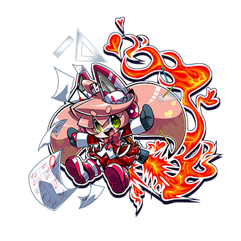
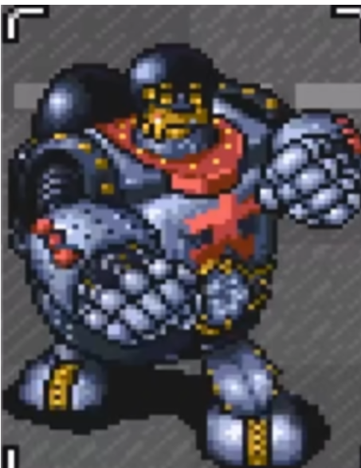
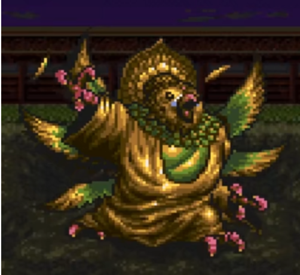

 
 

# 三田奈奈子

| 角色信息   |  |
| ----------- | ----------- |
| 名称    | 三田奈奈子      |
| 年龄   | 14岁      |
| 职业 |  中学生（安卓机器人） |
| 对应曲   |中学2年生のアンドロイド |
| 初出   | Chunithm Amazon  |

> 本人物剧情大量致敬RPG《时空旅人》的近未来篇。  三田奈奈子：原指游戏中的宠物乌龟“吉太郎”。游戏中的吉太郎是经由藤兵卫之手，将宠物乌龟的意识传输到流体机器人身上从而复活的机器人。三田奈奈子身为“持有心的机器人”这一设定与原作如出一辙。  坂田博士：人物设定源于原作的科学家“藤兵卫”。原作中原本是邪恶组织“筑波”的干部，然而与原作中的科学家“司德曼”（名称可以恶搞成“死的MAN”）产生冲突并脱离组织。人名的来源据说是来自于SRPG《前线任务》的架空企业サカタインダストリィ。  近未来都市镰仓：对应原作的“近未来篇”。游戏原作的舞台是日暮里。  松田君：对应游戏原作人物“无法松”。人设上出入较大，不过后面剧情常常直接称之为松。也和原作一样，强行操作了“铁皮大王”。  INVADERS：对应游戏原作中的暴力组织“十字军”。和原作一样，也是常常诱拐人的存在。  天龙：取材自游戏中以鹦鹉头的形象现世的日暮里寺主持“云龙”，和筑波的科学家“司德曼”。共通点是“为了拯救世界，不惜一切手段。”    罪恶大王/三重打击/重力飞踢：对应游戏原作中古代巴比伦的巨大机器人“铁皮大王”。和原作中一样，普通的人无法正常操作。招式名致敬了原作的“金属打击”，“巴比伦反重力踢”。     迦罗守观音/渡鸦飞拳/卡-昭和：对应游戏原作中放于日暮里的寺庙中的鹦鹉头大佛“隐呼大佛”（隐呼日文也可以读成ィンコ，即鹦鹉），对应的招式为“咕噜噜~飞踢”，“咕噜噜~昭和”等。渡鸦的名称来自于《前线任务》的渡鸦系列武器。  “对吧，松田君！”： 对应游戏原作中主人公“晃”的台词。  黑鸦四天王：可能对应的是“剑圣大和”里出现的四天王。  罪恶大王VS迦罗守观音：对应的是原作最后的战斗，即铁皮大王对隐呼大佛的战斗。

## Episode 1 正值中二的安卓机器人

> 我的名字叫三田奈奈子！是中学二年级的安卓机器人！不仅如此！我还是陷入了恋爱的安卓机器人哦！

近未来都市，镰仓。遍地都是双足步行的机器人代替人类劳动，车子理所应当地不再依靠轮胎，而是在空中飞行的地方。

这座城市就像是科幻电影的世界再现般矗立于大地之上。而一位天才且疯狂的博士就深居于此。

“咕咕咕……果然，我就是天才啊！只要完成了这个的话，人类就能得到拯救了啊！哈哈哈哈哈哈哈哈哈！”

眼前这位正在放声大笑的人，正是天才疯狂博士，坂田博士。

一名少女则趁他大笑的时候靠了上来。

“嘿”

“好痛啊！不要敲到我这天才的头脑！万一我的脑细胞死太多变成凡人的话，你要怎么负责啊！奈奈子！”

“咦——我又没做什么过分的事，而且就算变成普通人的话不也没差吗？反正只会做意义不明的东西。”

“说我的发明是意义不明的东西也太失礼了吧！这可是能够打倒人类的敌人的，究极的机器人……”

“好了好了， 博士太厉害了。饭都做好了，赶紧换衣服一起吃吧。”

被称作奈奈子的少女露出一副目瞪口呆的表情摇了摇头。

她的全名是三田奈奈子。是一名在坂田的家里居住的中学女生。

然而，她的真实身份是——。

“真是的，我可是一直都很认真……话说，奈奈子啊……现在是不是该去学校的时间了？”

“啊！大事不妙啊！我得赶忙去学校了！博士，我就先走了！”

“要和班里的松田君好好相处啊。”

博士用开玩笑的语气说着。

奈奈子瞬间变得满脸通红，手上的拳头宛如火箭般射了出去。

“咕哈啊啊啊！”

“真是的————！不要老拿这个开玩笑啊！啊啊，JC电路已经出现过热了啊！这都是博士害的啊！”

奈奈子回收了刚刚将博士击飞的拳头，装回了自己手上。

接着以气鼓鼓的样子嘟着嘴离开了这里。

“哈哈哈……真不愧是我可爱的女儿——不对，是我最棒的杰作啊……奈奈子……”

这就是坂田博士失去意识前最后的话语。

三田奈奈子，14岁。

她正是由坂田博士所开发的，即便在这个世界上也非常稀有的，持有心灵的安卓机器人。

## Episode 2 恋爱的安卓机器人

> 在我被不良少年困住的时候帅气地救出我的松田君……瞬间就让我堕入爱河了！

由坂田赋予生命的奈奈子和人类一样被教授了基本的常识和知识。所以，奈奈子很快就融入了人类的生活。

就算在这近未来都市·镰仓，持有心灵的安卓机器人也算是非常稀有的存在了。而好心且温柔的人们很快就接受了奈奈子的存在。

然而，并非所有的人都能认同奈奈子的存在。

“明明是个机器人却扮的和人类一样！像你这种又冰冷又光滑的机械身体怎么配得上漂亮的学生制服啊！”

因为无聊憋屈的学校生活积累了众多不满的不良少年，盯上了不会抵抗的安卓机器人。

“呜呜呜……求你们了……不要这么做……”

从眼睛里流出少女机关冷却水的奈奈子，助长了不良少年的气焰。

“切，竟然还敢流出眼泪！到底要模仿人类到什么地步啊！”

激动的不良少年举起了拳头。

“给我住手！！”

就在拳头即将碰到奈奈子的脸上的时候，一名少年从角落飞奔出来。

“这，这是怎么回事？”

“她在身为机器人之前，可是一名女孩子啊！欺负女孩子的人，我可饶不了你！你这家伙！你这家伙！”

少年用着明显非常不擅长肉搏的动作，敲打着不良少年的腹部。

“切，真够扫兴的……”

虽然是没有造成任何伤害的花拳绣腿，但不知是不是被少年的执念震慑到了呢，不良离开了这里。

“哈……哈……你没事吧！？”

少年由于大口喘气肩膀上下移动，但还是向奈奈子伸出了手。而奈奈子已经脸颊通红，头上冒出了整齐。

（这个人，不仅救了我……！还说了我不只是机器人，更是女孩子什么的！不好，这也太帅了吧……！JC电路要过热了啊！！）

“你真的没事吧？”

“哈！没，没关系呼！谢谢你救了我！你，你的名字是……？”

“我叫松田。请多关照。”

（松田君……！好帅气的名字啊……）

于是乎，这就是奈奈子诞生以来初次陷入恋爱的过程。

## Episode 3 JC电路过热！

> 只是想着松田君的事情，我的JC电路就要过热了！经过不懈的努力，我终于成为他的朋友了！

自从对松田一见钟情之后，奈奈子为了吸引到松田，实行了各种各样的作战。

但是，不管是“情书大作战”，还是“放学后约会大作战”，还是“制作便当大作战”，都因为执行途中JC电路产生的过热导致失败收场。

而且，不知是不是运气不错，松田君被调到奈奈子后面的座位的缘故，奈奈子由于距离过近而害羞，最终导致几乎每天都过热的情况。

然而，今天的奈奈子却不一样。

（我，我专门请博士将自己身上的少女机关冷却水冷冻到了极限了，所以，今天绝对不会过热！我要用“橡皮擦掉了，能不能捡一下呢？大作战”来一口气拉近和松田君的距离！！）

意气风发的奈奈子立刻就将手上的橡皮擦丢了出去。

“嗯啊啊啊啊啊啊——！为啥会这样——！”

似乎是用力过猛的样子，橡皮擦直接飞出了窗口。

“呜呜呜呜……不该是这样的……”

“奈奈子……？”

“哈！？松、松田君！？那、那个……刚刚那个是……”

“橡皮擦好像以非常有趣的方式掉了下去呢。不介意的话，用我的吧？”

松田君顾虑到了奈奈子的心情，将自己的橡皮擦递给了她。

（哇哇！松田君，太帅了吧！）

冷冰冰的冷却液也毫无意义，奈奈子的JC电路再次出现了过热。

过热误发了发射激光的模块，结果奈奈子射出了光束。

“喂！！奈奈子！！不要在老师说话的时候射出光束啊！！”

即便当堂的老师这么说着，奈奈子仍旧沉浸在自己的世界中。

看着这样活泼的奈奈子，身为同班同学的松田笑了出来。

“真是的，奈奈子也真是会添麻烦。明明老师还专门提醒了一下的……。喂，谁之后跟奈奈子好好将老师刚刚说的和她说一遍啊。‘最近有一伙被称为INVADERS的可疑犯罪团伙，要注意’，呢。”

当堂老师只能露出一副无可奈何的表情叹了叹气。

## Episode 4 与怪僧的邂逅

> 放学后和松田君一起回家的时候，一个奇怪的僧人向我们搭话了……这难道就是最近在说的可疑人物吗？

与预想完全不同，“橡皮擦掉了，能不能捡一下呢？大作战”获得了成功。而那天下午——

令人意想不到的是，奈奈子竟然和松田一起踏上了回家的旅途。

“最近有一伙被称作INVADERS的邪恶组织在附近作恶呢，女孩子一个人回家太危险了，我送你回去吧。”

“松、松、松、松田君……！！”

面对宛如绅士般态度的松田，奈奈子的JC回路就要到达过热的温度了。

（话说回来，两人一起回家什么的……。这不就是约会吗！？讨厌、这该怎么办啊——！不过如果只是一起回家的话也太寂寞了……！好想继续和松田君在一起！）

脑袋已经喷出蒸汽的奈奈子，正努力思考着怎么和松田在一起。

（哈，对了……就用“绕路去旁边的寺庙大作战”吧！）

“没事吧？看你的身体好像很热的样子……”

“没关系！我没事的！话，话说回来，要不要绕个远路？”

“绕远路？”

“其实呢，这附近有一间寺庙的……。那里坐落着最近被电视节目和杂志大幅介绍的观光景点‘迦罗寺观音’呢！”

“嘿……。那，一起去吧？”

“哇——！”

看着欢欣雀跃的奈奈子，松田露出笑容，两人便踏上了前往被称为极德院的寺庙的道路。

到了寺庙的两人，发现了一名奇妙的僧人，正吟唱着从未听过的经文。

“嗯？”

似乎注意到了两人，僧人停止了诵经。走向了两人。

“不好意思。我的名字叫天龙。……看你的外表，似乎是安卓机器人对吧？……持有心什么的，这可真是有趣啊……”

露出邪恶的笑容，一人自言自语的天龙，让二人感觉到了危险的气息。

“打扰您诵经真的很抱歉。我们就先回去了……”

松田站在了奈奈子面前，向着天龙这么说到。

而天龙的双眼，直钉钉地注视着很快离开此地的二人的背影。

## Episode 5 制作中的罪恶大王

> 我的爸爸，坂田博士现在正在制作巨大的机器人。说不定只要让松田君看到的话他会很高兴呢！

自从见到奇怪的僧人·天龙之后，奈奈子和松田二人就感觉到了一丝恐怖。

然而，对奈奈子来说这也是一件幸事。因为松田在这之后就一直形影不离地跟着她，送到了她的家门口。

迎接到家的奈奈子的是家中的坂田博士。最初，奈奈子还在担心是否要介绍身为疯狂科学家的坂田博士，然而这种担心很快就烟消云散。

松田君实际上非常喜欢机械类的东西，于是两个男人很快就臭味相投了。

“竟然能明白奈奈子身上的优秀之处吗！不愧是松田君啊！”

“是啊，是啊。那当然明白了。奈奈子就是最棒的存在啊！”

“两人不要这么说啦……！听得我都不好意思了……”

由于害羞，奈奈子的头顶已经喷射出了蒸汽，然而二人还是没有停下关于奈奈子的讨论。

经历了一段时间，坂田博士露出满意的表情拍了拍松田的肩膀。

“如果是你的话，给你看看那个东西也无妨！”

这么说着，博士拉开了盖着某个巨大物体的帆布。

“坂、坂田博士，这是什么！？”

“这可是被称为‘罪恶大王’的究极正义机器人！是对付人类的敌人，INVADERS的唯一武器啊！……不过这机子还在开发中呢。要操作这么大的机器人肯定是要驾驶员的，不过如果是人类驾驶的话，大脑会有严重的负担，最坏的情况甚至会致死啊……”

听着坂田博士讲解的奈奈子突然问到。

“嗯。那么，如果是身为安卓机器人的奈奈子的话，就没问题吗？”

“那没问题。但我不想让心爱的奈奈子遭遇这种危险啊……”

“博士……”

“所以，我现在正在研究怎么将这东西变成无人驾驶。不过改造的情况不容乐观啊……。而且还面临着INVADERS的威胁，真是丢脸……”

看着板着脸的坂田博士，奈奈子和松田露出了笑容。

“肯定没问题的。如果是坂田博士一定能做出来。不要急躁就好。”

“是啊！打起精神来！”

 

坂田博士受到了两人的鼓励，再度埋头于“罪恶大王”的调整中。

在这之后，似乎是和坂田博士兴趣相投的缘故，从那天起，松田就常常出入奈奈子的家了，而两人的感情也在这期间渐渐升温。

## Episode 6 奈奈子被诱拐了！

> 和平时一样正准备和松田君回家的，然而在我们面前出现了形迹可疑的人，将我拐走了！

这天，奈奈子正和松田两人正亲密地走在回家路上的时候，突然出现了一群黑色涂装的可疑机器人。

“你是三田·奈奈子，对吧？”

“是的……你们是什么人。”

“我们、没有、报上名号的、必要。跟我们、一起来。”

这些机器人不由分说就向奈奈子冲了过来。

“奈奈子，危险！”

“啊……”

察觉到奈奈子有危险的松田撞飞了她。奈奈子也因此闪开了机器人的攻击。

“谢谢你……松田君……！？松田君！？”

掩护了奈奈子的松田被这些机器人抓住了。

“咕啊……”

面对紧紧掐着松田脖子的机器人，奈奈子面露怒色，举起了右手。

“赶紧把松田君放开！！不放的话——”

“不放的话会怎样呢”

“咦……？”
“你是要射出火箭飞拳呢？还是说光束呢？不管怎样，这个男的，都肯定会被卷进去受伤的。”

“……你们……太卑鄙了！！”

“深感荣幸……。那么，如果想要我们放了这个男的……要做什么你很清楚吧？”

面对露出邪恶笑容的机器人，奈奈子只能收起自己的右手。

“好吧。我跟你们走……”

“！不行啊！奈奈子！”

“闭嘴！”

面对拼命挣扎的松田，机器人对他实施了毒打。

“咕啊……！”

“快住手！我不会反抗的！！所以不要对松田动粗……！”

听到奈奈子的回应的机器人们把松田扔到了一旁，抓住了奈奈子。

“咳……咳……奈奈子……！”

“……谢谢你，松田君……”

奈奈子拼命地寄出了一个笑容，便被机器人带走了。

“奈奈子酱啊啊啊啊！！”

小巷中响起了无法传到奈奈子耳边的悲鸣。

## Episode 7 邪恶组织·INVADERS

> 诱拐我的是被称为INVADERS的邪恶组织……他们到底是出于什么目的这么做的呢？

松田忍着眼泪，奔向了唯一能依赖的人的地方。

“坂田博士！！坂田博士在吗！！”

“嗯？发生什么事了，松田君！”

看到松田上气不接下气而且衣衫褴褛的样子，坂田博士慌忙跑了上来。

在坂田博士的照顾下，松田终于说出了事情的来龙去脉。

“是吗……。奈奈子被……。那些带走她的人，绝对是INVADERS的爪牙啊……。奈奈子可是持有心灵的，非常特别的安卓机器人啊。肯定是要利用她的能力来实行他们的计划……”

“计划……？”

“……也就是肃清人类。”

重重地叹了口气的坂田博士，慢慢地说起了自己的过去。

曾经，坂田博士也是INVADERS的科学技术部门的一员。但是随着INVADERS对人类的仇恨愈发加剧，无法接受的坂田博士便带着开发中的三田奈奈子一起脱离了组织。

“本来，奈奈子是他们为了进攻人类而制作出来的机器人。但我决不允许这种事情发生。所以，我才让奈奈子和普通的孩子一样去学校，希望给她带来正常的生活的……。就算这样，INVADERS也不愿放过她吗！”

“如果这样下去的话，奈奈子会怎样呢！？”

“不知道……。但绝对不会是什么好事……”

听到这里的松田，拖着伤痕累累的身体站了起来。

“等等！你还没恢复呢，说不定骨头会断掉啊！”

“那又怎么样！！现在奈奈子说不定正承受着比我所遭受的数倍以上的痛苦啊！！我可不是那种能乖乖坐在这里的人！！”

“但是，INVADERS他们的机器人都是战斗用的啊。只靠普通人的力量是无法与他们对抗的。”

松田听到博士这句话，只是默默地指向了正在调整中的“罪恶大王”。

“博士，请让我坐上罪恶大王吧。”

“别开玩笑了！那台机子还在调整中啊！现在让你乘坐上去的话根本不知道会发生什么事啊！要是造成了不可挽回的事情那就完了！”

“但是，如果不能救到我最重要的朋友的话！！对我来说，这一生都会生活在后悔中啊！！”

看着松田认真的眼神，坂田博士叹了叹气。

“……如果感知到危险的话，就立刻用脱出舱逃出去。明白吗？”
“是！太谢谢您了！奈奈子，我现在就去救你，等着我啊！”

就这样，松田坐上了罪恶大王，并且踏上了拯救奈奈子的旅程。

## Episode 8 奈奈子史上最大的危机！

> 敌人的老大竟然就是那个奇怪的僧人啊！竟然要将我解体并拿出JC电路……救救我！松田君！

与此同时，奈奈子正在敌人位于江之岛的INVADERS据点中。

“呵呵呵，状态如何啊，三田奈奈子君。”

“你，你不就是……！那个时候的……！”

在无法动弹的奈奈子面前出现的，正是之前在极德院出现的怪僧，天龙。

“奈奈子君，你知道迦罗守观音吗？”

“是不是那个被当做观光景点的……巨大佛像？”

“答对了一半。实际上，那个东西，可是我们的超级破坏兵器机器人啊！”

“咦！？但是，那个东西根本就不会动弹啊！？”

“正是。其最大的原因，正是能够赋予机器人生命的——头脑……也就是核心部件。而现在这个核心部件仍旧未安装上去啊。话说回来，奈奈子君，你认为最适合的核心部件是什么呢？”

“……？”

“有人说，人类的头脑，才是最棒的核心部件。但是，真的是这样吗？我觉得并非如此。要问为什么的话，那就是这个世界上，已经出现了超越人类的存在啊。而他们的头脑，才是最棒的材料啊。这个存在就是——”

天龙露出邪恶的笑容，轻轻摸着奈奈子的脸庞。

“就是你啊，安卓机器人，奈奈子。”

“不，不要啊！不要摸我！随便摸中学生的身体什么的，这可是犯罪啊！”

“仅限于人类的法律范畴内的话呢。”

天龙说着这句话，便在奈奈子面前脱下了衣服。本来吓得要叫出声的奈奈子，在看到天龙的身体后瞬间哑口无言。

“金属做的身体！？难道说，你也是安卓机器人？”

“正是……那么让我们回到刚才的话题。呵呵呵呵，只要将安卓机器人那最棒的头脑装入迦罗守观音的体内的话，最强的超级破坏机器人就完成了啊！”

一瞬间还没能理解天龙话语含义的奈奈子，突然明白了话中含义后，脸色变得铁青。

“等，等等！这难道是指，要用我的头脑当做机器人的部件吗？”

“正是如此！你的头脑将会变成机器人的脑部组件！”

“不、不要……！！为什么，为什么你要做出这种事情！？你到底是什么目的！！”

面对奈奈子的质问，天龙摆出夸张的动作，答道。

“这都是为了拯救世界啊。奈奈子，你也已经注意到了对吧？人类是那么地无能，丑陋啊！把我们制造出来后只是迫害我们，并以此为乐！真是不可理喻！既然人类如此，那么干脆直接毁灭，将整个地球变成我们安卓机器人的乐园岂不是更好吗？”

听着天龙愤怒的话语，奈奈子想起了曾经欺负过自己的不良少年们。

然而，奈奈子很快就摇了摇头。

“人，人类只是稍微犯错了而已啊！没有将他们灭绝的必要啊！”

奈奈子这么辩解着，而天龙只是叹了口气。

“这样的错误已经足够致命了。人类只有灭绝一途……。这个世界不需要这些不可理喻的人类。只要能够互相理解的安卓机器人就够了。呵呵呵，闲话就说到这里吧。奈奈子，我必须向你致以感谢，因为有你的伟大牺牲，安卓机器人的乐园才能建立起来啊！”

天龙取出了凶狠的解体工具，接近了奈奈子。

“不要，不要啊！！松田君，救救我！”

## Episode 9 驾着巨大机器人前来的王子

> 松田君竟然驾驶着罪恶大王来救我了！不过他也因此受了重伤……

“不要，不要啊！！松田君，救救我！”

在奈奈子惨叫的瞬间，INVADERS的据点传来了塌方声。

“怎、怎么回事！？”

天龙和奈奈子望着崩塌的天花板，那里矗立着“罪恶大王”的身姿。

当“罪恶大王”打开了驾驶舱，看到的正是松田的身影。

“奈奈子！我来救你了！”

“松，松田君！！”

乘着巨大机器人前来救场的王子，现在正出现在奈奈子的眼前。

松田仔细操作着“罪恶大王”，将奈奈子身上的枷锁解开，并且送到了驾驶舱里。

“呜呜……谢谢你，松田君……真的太谢谢你了……”

“哈哈哈，没事就好。”

看着得救的二人，天龙只能在原地气得咬牙切齿。

“可恶！看来这次必须先撤了……！”

“等等！别想跑！”

面对怒火中烧的奈奈子，为了掩护天龙撤离，INVADERS的战斗用安卓机器人围住了“罪恶大王”。

“这样就没法追上去了……”

“我们也先撤退吧。坐稳了，奈奈子！”

随着松田的吼声，罪恶大王打退了安卓机器人的大军并且离开了这里。

过了一阵子，两人终于到达了坂田博士的家里，松田将奈奈子交给了坂田博士。

“干得漂亮！你干的太漂亮了！松田君！”

“是，是吗……”

松田君露出了微笑，虚弱倒地。

“松田君！？”

坂田博士急忙上前确认倒地的松田的情况。

“……没事，只是失去意识而已。果然，对于人类来说，罪恶大王的负荷还是太重了吗……。看来，等他醒来还需要一段时间……”

“竟然不顾自己的身体变得遍体鳞伤，也要前来救我……谢谢你，松田君。”

奈奈子正想走到松田面前照顾他的时候，尖锐的警报声响彻了整个镰仓。

“紧急通报！紧急通报！INVADERS开始对人们进行无差别攻击了！居民们赶紧到附近的避难所避难！！”

“这些家伙，终于开始玩真的了吗。”

听着坂田博士沉重的话语，奈奈子下定了决心，坐上了“罪恶大王”。

“奈奈子！？”

“博士……我要出发了。迄今为止，都是松田君保护着我……。这次，轮到我保护他了！我要保护我最重要的松田君！还有博士！以及地球上的人类！”

“……奈奈子……”

“而且，我还有不得不和那个变态家伙说的话！我们是可以和人类互相理解的！安卓机器人是可以和人类互相理解的！……对吧，松田君！！”

坚定地说出这句话的奈奈子将受伤的松田交给了坂田博士，只身前往了天龙可能藏身的地方——迦楼罗观音所在的极德寺。

## Episode 10 罪恶大王VS迦罗守观音

> 我驾驶着罪恶大王，终于和敌人的巨大机器人·迦罗守观音展开了决战！并且靠着爱的力量取得了胜利！

奈奈子驾驶着罪恶大王飞向空中，飞向天龙的所在地。

途中虽然遇到了天龙派来阻拦的刺客，但是在爱与愤怒彻底爆表的奈奈子面前，都不是对手。

“滚开滚开滚开~~~！！”

罪恶大王轻松搞定了眼前的敌人后，奈奈子很快发现了INVADERS的镰仓据点，直接冲了进去。

很快，四名奇形怪状的安卓机器人出现在奈奈子面前。

“竟然单骑闯进这里，难怪天龙大人会这么欣赏你。”

“但是这势如破竹的攻势也就到此为止了。”

“我们是INVADERS的黒鸦四天王！”

“像你这种小妮子什么的我们才不会——”

“给我闭嘴啊啊啊啊！！我这边可是很忙的啊啊啊啊！！”

奈奈子大喊着，将自己的JC电路连接上了“罪恶大王”。

“超必杀！闪光射击——！！”

发出万丈光芒的“罪恶大王”飞上了高空，以身缠雷电的飞踢冲向了黒鸦四天王。

“等等，我们还在说台词呢——哇啊啊啊啊啊啊啊啊！！”

敌人受到了闪光射击的直击，黒鸦四天王就被这么狠狠击飞。

“你已经没有保护你的手下了！出来吧，天龙！”

“呵呵呵……不用你说我也会出来的，奈奈子君。”

随着一阵不详的低沉声音响彻地下，旁边的墙壁开始发出巨响并倒塌。

发出巨响的地方出现的，是巨大的迦罗守观音和身旁的天龙。

“奈奈子君。果然你是最棒的安卓机器人啊。只要有你的力量的话，这个世界一定能变成安卓机器人的乐园吧……和我一起成为新世界的亚当和夏娃吧。”

“竟然对中学女生告白，好恶心！而且在这之前，属于我的亚当的，只有松田君而已哦！”

“……事到如今还信着人类吗！愚蠢的家伙！那么，无话可说了！”

天龙乘上了迦罗守观音，连接上了自己的身体。

“哼，果然最初就该这么做的。你就和愚蠢的人类一起毁灭吧！”

“我拒绝！我可是……安卓机器人啊！既然能和人类互相理解的话！根本就没有毁灭的必要！”

于是，罪恶大王和迦罗守观音赌上人类生死存亡的决战就此开幕。

罪恶大王使出了“三重打击”、“重力飞踢”等强力招式，而迦罗守观音则以“渡鸦飞拳”“卡—昭和”回敬罪恶大王。

两者的战斗不相上下，然而随着时间推移，迦罗守观音被逼到了绝境。

“为什么？这是为什么？为什么身为至高的安卓机器人的我的头脑所驾驭的迦罗守观音会陷入苦战！！你到底，和我有什么不同啊……！！”

“很简单！我从心底里，信任着人类，博士，还有我心爱的松田君啊！！”

“信任？这种毫无逻辑的东西就足以打败我吗！这不可能，这不可能啊！！”

“放弃吧！！恋爱中的少女可是最强的啊！”

罪恶大王飞上了高空，随着奈奈子的呐喊使出了全部的动力，发动了最终的必杀技。

“唔啊啊啊啊啊啊啊啊啊！！”

“最终奥义！雷电轰炸！”

“咕哇啊啊啊啊啊啊啊啊！！”

全身缠着雷电的罪恶大王降下了飞踢，遭受直击的迦罗守观音绽放出了爆炸的蘑菇云。

就这样，赌上了人类生死存亡的战斗，最终以心中想着松田君的奈奈子的胜利而告终。

## Episode 11 享受青春的安卓机器人

> 虽然街道恢复了和平，不过我和松田君的关系还是没有起色……恋爱可比消灭邪恶组织什么的难多了啊！

由于奈奈子的活跃，INVADERS就此彻底消失了。

而失去意识的松田也恢复了原样，被INVADERS破坏的城市也开始复兴了。

就这样，奈奈子回到了应有的日常生活中。

……然而，奈奈子的战斗并未结束。

在一如既往的和松田一起走着的归途，奈奈子脸已经通红了。

（今天，就在今天！我一定要将自己的心意传达出去……！“和松田成为相亲相爱的恋人的大作战”！！开始！！）

“那个，那那那，那个，松田啾！”

“嗯？怎么了吗，奈奈子……等等，你怎么脸都红了！？而且感觉比平时冒出了更多蒸汽的样子……”

“那个……实际上……是……！”

“啊，莫非是驾驶了‘罪恶大王’的后遗症？我得赶紧告诉坂田博士啊！”

“咦！？不是……”

“我现在立刻去叫坂田博士过来！好好在这里待着啊！”

“等等我——不是这样的啊！！”

（真是的——！相比之下还是摧毁邪恶组织比较简单啊！）

陷入恋爱的中学二年级安卓机器人，三田奈奈子。

她的青春，不过是刚开始而已。

