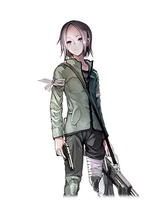

# 匹力欧

| 角色信息   |  |
| ----------- | ----------- |
名称|匹力欧
年龄|17岁
职业|反抗军
特技|闪钢机枪的操作与射击 培养植物
| 对应曲   | 閃鋼のブリューナク リ・フィクション・O
| 对应版本 | Chunithm  Chunithm Luminous

## EPISODE1　匹力欧（ピリオ）  

>遥远的未来，那是机械文明高度发达的世界。那里住着一位失去一条腿的少年。

遥远的未来，机械文明高度发达。

人类过度依赖机械，最终被机械——尤其是被称为“机人（キジン）”的机械生物管理、支配。

机人们以矗立在城市中央的巨大高塔为居所，不断向地面散播废弃物。

随着人们心中的反抗情绪不断累积，一场名为“花朵恐怖主义（フラワー・テロリズム）”的抗争爆发了。匹力欧作为抵抗军的一员，持续与机人交战。

他曾因失去一条腿而彷徨无依，后被抵抗军收留，获得了一条义肢，并在旧城区长大。

怀着对被机人掳走的亲人的思念，他主动加入了抵抗军。

## EPISODE2　人类与机人的故事  

>“和平之钟”带着悲凉的音色，在城市中回荡。 “人类与机人的抗争，要开始了吗——”

“你知道吗？机人支配人类的原因。”  

“不知道，是什么？”  

“机人拥有超越人类的记忆能力、运算能力，以及以有机生命体为媒介获得的更强的机动能力。说到底，我们人类在各方面都不是机人的对手。”  

“这种事情我知道。”  

* * *

“但他们有一样东西，是永远比不上人类的。”  

“……”  

“你猜到了吗？”  

“……是歌声……？”  

“没错。机人们都在‘嫉妒’人类编织出的歌声——”  

“原来是这样。这简直像天使的故事呢。”  

“是啊，是童话故事。但你要知道……”  

“？”  

“这是一个非常温柔的童话故事。”  

* * *

每年一次，“和平之钟”会带着悲凉的音色在城市中回荡。

这座名为“阿瓦隆”的都市被分为三部分：机人居住的巨大高塔、人类生活的旧城区（贫民窟），以及由机人废弃物堆积而成的垃圾山。

“钟声很快就要敲响三下。那就是信号，准备展开作战。”  

“什么和平之钟。就因为它，多少人类失去了性命。”  

“别窃窃私语了。立刻各就各位。”  

队长表情严肃地说完，便朝着钟声传来的方向缓缓走去。

“人类与机人的抗争，要开始了吗——”

## EPISODE3　调和仪式（ハーモナイゼ）  

>机人早已解决了人类永恒的课题——“存在”。

机人能以远超人类的能力水平，完成人类几乎所有的行为。更重要的是，它们通过0和1进行判断，早已解决了人类永恒的课题——“存在的命题”。

而人类为了满足机人的“存在命题”，被迫像奴隶一样被对待。人类生活所需的最低限度资源，由主计算机“以太（エーテル）”的意志计算、管理。

机人的高塔顶部，支撑着一个巨大的圆形天台，被称为“圆桌（ラウンドテーブル）”。据说居住在越高处的机人，地位越崇高。

圆桌的各处分布着类似礼拜堂的设施。每七天，这里会举行名为“调和仪式（ハーモナイゼ）”的典礼，聚集在此的机人们会唱起圣歌。

高塔中央安放的钟，便是“和平之钟”。

它是主计算机“以太”怀着物种共存的愿望，命令人类为机人建造的。

## EPISODE4　花朵恐怖主义（フラワー・テロリズム）  

>最终目的，是破坏主计算机“以太（エーテル）。

“和平之钟”建成后，人类被禁止干涉圆桌事务，还被迫迁移到曾经机人居住的旧城区。

居住在旧城区的人类，只能靠捡拾垃圾山中的废弃零件、采集野生可食用生物为生。由于生活高度依赖机械，许多人在四肢或内脏的部分植入了机械，靠着捡拾垃圾山的零件改造身体，勉强糊口。

久而久之，他们心中累积的反抗情绪，以“抵抗军”的形式凝聚成型。

以破坏“和平之钟”为开端，这场被称为“花朵恐怖主义”的人类抗争正式拉开序幕。

抗争的最终目的，是破坏主计算机“以太”。

以太不仅是缔造了人类被支配世界的核心大脑，还据说会挑选人类的躯体进行改造（采样），以此制造精密的机人。

机人们吟唱圣歌，是在尝试进行语言统制？还是在嘲笑人类的愚蠢行径？

如今，已经没有人知道答案了。

## EPISODE5　圆桌侵攻作战  

>把你们连带着这身钢铁躯壳，一起炸飞！

第一次圆桌侵攻作战。

通往圆桌的回廊里，深蓝色的墙壁上密密麻麻嵌入的电子回路，将身着军装的士兵们与机人们的白色装甲衬托得格外鲜明。

黑发青年锐利地盯着挡在面前的数台“战斗型”机人。机人们举起双手，瞬间迸发出光芒。与此同时，它们双手手指位置的枪口，射出了无数子弹。黑发青年迅速翻滚到前方的柱子后躲避，子弹击中柱子，留下了巨大的裂痕。

裸露在外的墙壁管道，发出“噼里啪啦”的刺耳杂音。

“可恶！”

青年用一双白皙纤细、不太像军人的手举起了枪。

“枪械对战斗型机人‘伊克斯戈特（イクスゴート）’无效，匹力欧。你先去和小队汇合，支援队长。”  

“……明白。”  

被称作匹力欧的青年，听到身后传来的声音，没有回头，只是点了点头。

他收起枪，从防护服内侧掏出一枚拳头大小的手榴弹，解开发条式的卡扣，朝着几十米外机人所在的方向扔了过去。

“把你们连带着这身钢铁躯壳，一起炸飞！”

伴随着剧烈的爆炸声，冲击波席卷而来。破碎的机人残骸四散飞溅。

爆炸引发了短暂的电波干扰，战斗型机人特有的红色单眼漫无目的地在空中乱转。匹力欧抓住这个间隙，如同穿梭在缝隙中一般，从机人群中疾驰而过。

## EPISODE6　与机人的邂逅  

>匹力欧靠近后，缓缓将手指扣在了扳机上。“为科隆（コロン），报仇——”

“这里是……？”  

匹力欧在圆桌内看到的，是一处酷似礼拜堂的建筑。

（看来和小队走散了。）

礼拜堂的门窗和外墙都已破损，四处堆积着深蓝色的瓦砾堆。

（一旦被破坏，和地面的景象也没什么两样了——）

就在这时。

匹力欧察觉到一丝微弱的气息，身体瞬间僵硬。

那不是人类的气息。

“……？”  

似乎有一台机人，正躲在瓦砾堆后。

（它没发现我的存在，要动手就现在——）

匹力欧立刻做出判断，拔出手枪，悄无声息地绕到侧面。

心脏狂跳不止，仿佛要炸开一般。

“冷静点，冷静点……就是现在！”  

匹力欧猛地冲出，对准目标扣动了扳机。

射出的子弹径直命中机人的颈部。

火花四溅，机人被击飞的头颅像被踩碎的甲虫一样，发出声响滚落在地。

短暂的安心过后，匹力欧看到那颗头颅，不禁低吟出声。

“这、这是人类的头……！？”

滚落的头颅，竟然是一个年幼少年的。

匹力欧立刻确认其类别——

颈部的接合处，确实装有机人特有的纳米接口（ナノソケット）。

“……怎么会这样……”

这台机人实在太像“人类”了，匹力欧惊愕不已。

仔细一看，它还穿着类似修道服的衣物。

『……蒂尔达？』

身后传来一个年幼孩童的声音。

匹力欧回头，只见破碎的彩色玻璃前，还站着另一台身着修道服的机人。它没有携带武器，只是静静地注视着滚落的头颅。

它没有进入战斗状态。

匹力欧缓缓靠近。

这台机人的模样，不由得让他想起了那一天——

那时他还年幼，那个重要的……

“—为科隆，报仇。”

匹力欧说完，将手指扣在了粗糙的扳机上。

---

## EPISODE7　维护日（メンテナンス・デイ）  

>“破坏机人，真的能获得救赎吗？” “它们不过是披着机械外皮的怪物罢了。

“偶尔也让我休息一下嘛。这种日子，义足的关节吱呀作响，难受死了。”  

“昨天才刚维护过吧？”  

“我的身体和心灵，全都是不合规格的东西。”  

“我再也不想整夜埋在垃圾山里了。”  

玛丽用一只手熟练地束起比肩膀略长的头发，另一只手操作着空中显示屏。

“我在想啊……”  

“想什么？”  

“像这样破坏机人，我们真的能获得救赎吗？”  

* * *

“它们不过是披着机械外皮的怪物罢了。”  

“……我以前也这么想。我本该这么想的……但是……”  

“但是什么？”  

“……我在某个机人的脸上看到了悲伤的表情。就像人类在挣扎一样，不，比那更深沉，仿佛在寻求救赎一般……”  

玛丽回头看向抱着头的匹力欧，露出了无奈的表情。

“到底是谁在挣扎啊。抵抗军可没有休息时间，好了，把那里所有的箱子都搬到E5仓库去。”  

“……到头来还是要去帮忙吗……”  

“你心里有想保护的人吧？现在只需要想这件事就好。你已经没有必要再烦恼了。”  

匹力欧陷入了沉思。

第一次圆桌侵攻作战时，在礼拜堂里的两台机人，到底在做什么？

破碎的彩色玻璃上，画着天使与少年的图案。

和他曾经听过的童话故事，非常相似。

---

## EPISODE8　“〇”（欧）协议

>匹力欧注视着自己的义足。这具冰冷的钢铁人工机械，替代了他失去的肢体。

在地下昏暗的射击场里，匹力欧扣动了造型奇特的枪支扳机。

枪口迸发耀眼的光芒，在模仿机人制造的靶心中心打出一个大洞。

“这是……”  

“试作型对机人枪。通过磁力控制超硬金属核心，高速旋转后射出，贯穿目标。”  

玛丽的脚步声“哒哒”地踩在坚硬的水泥地上，缓缓靠近。

“贯穿一切的武器……布琉纳克（ブリューナク）吗。”  

匹力欧用手指抚摸着这把以神话之枪命名的武器，思绪飘向了明天的圆桌侵攻作战。

“明天的作战，就由你带着它战斗。”

“为什么是我？”  

“因为你的相性很好。这把武器的控制系统，和你以前被俘虏时戴的‘枷锁’采用了相同的‘〇’协议。磁力控制对身体会有负担，但你的身体已经有了一定的耐受性。”  

“枷锁吗……”  

匹力欧注视着自己泛着冷光的义足。这是他被机人俘虏时失去肢体后，换上的冰冷钢铁人工机械。

……他还不知道，这具“义足”，正是身旁这位女性为他打造的。

## EPISODE9　回忆与自我（追憶とエゴイズム）

>和什么存在的命题无关，我现在就正在活着。就是活着啊，混蛋……

“还是不习惯一大早就能闻到弹药的味道啊。”  

“相比之下，垃圾山里的陶锅那股味道还稍微好一点。” 

匹力欧他们一整个小队，正在一间勉强能称之为基地的废弃房屋里，为下次侵攻整理着弹药。

“那个，科隆小姐？是你的恋人吗？”  

“……是我妹妹。”  

匹力欧的思绪，被拉回了少年时代曾去过的花园。

一片蓝天、一片花海、一条项链。

那里有一个长发随风飘动、温柔微笑的少女——

『真巧呢。』  

突然响起的声音，让匹力欧猛地回到现实。玛丽一边用纤细的手臂装填弹药，一边用平淡的语气继续说道。

“我以前也有个妹妹和弟弟，是双胞胎。他们被机人带走了。”  

“……这是我第一次听说！”  

“我也是第一次说这件事。”  

“……所以，你才加入抵抗军……？”  

玛丽注视着匹力欧的脸。

“很傻吧？连他们是否还活着都不知道，却依然在这里挣扎。”  

匹力欧像是在安慰她之前说过的气话，用细长的弹药尖端轻轻碰了碰玛丽。

“你也在迷茫吧？说到底，你和我也没什么两样。”  

“……是啊。但这就是人类啊？和什么存在的命题无关，我现在就正在活着。就是活着啊，混蛋……”

她清澈的眼眸中，悄然染上了忧愁。匹力欧不由得移开了视线。

那天，从圆桌掉落的废弃物之雨，依旧没有滋润大地，只是将一座座垃圾山染成了锈色。

## EPISODE10　再次，于礼拜堂中  

>布琉纳克迸发出了耀眼的光芒，击穿了彩色玻璃。 “机械混蛋，你们对人类做了什么！！”

匹力欧始终放不下上次在圆桌的遭遇，独自脱离战线，再次来到了礼拜堂。礼拜堂已经被修复，瓦砾堆也被清理得干干净净。

匹力欧推开了入口处精心重建、威严却又冷漠的大门。

随着大门缓缓开启，教堂深处那扇描绘着天使与少年的巨大彩色玻璃，以及在玻璃下的祭坛前吟唱祈祷之歌的一台机人，映入了他的眼帘。

那台机人是少女的模样。

匹力欧迅速拔出了机枪·布琉纳克。

“机械混蛋！”  

伴随着轰鸣声，耀眼的光芒迸发而出。

……

布琉纳克射出的光芒，击穿了彩色玻璃上天使的翅膀。

受惊的机人少女转过身来。

“机械混蛋，你们对人类做了什么！！”  

“……那、那个，我……”  

机人少女斟酌着词句，笨拙地开口。

匹力欧逼近一步，将枪径直对准了少女的头部。

心脏剧烈地跳动。

“你、你在这里做什么……！”  

“—我在，收集歌声。”  

之前在礼拜堂破坏的机人身影，闪过脑海。

“……”  

她的声音、动作，简直和人类一模一样——他心想。

“……我做不到。”  

匹力欧缓缓松开了扳机。

他向机人少女伸出了没有持枪的手。

“……你，有‘感情’吧。”  

“感、感情？”  

机人少女也学着他的样子，伸出了一只手。

## EPISODE11　闪钢之布琉纳克（閃鋼のブリューナク）  

>“‘忘记翅膀的天使的故事’吗？” “—这场抗争，真的有意义吗？”

—就在这时。

伴随着强烈的闪光，布琉纳克射出的子弹贯穿了机人的胸膛。

“扳机自己动了！？”  

机人胸膛流出了类似人类血液的红色液体。

匹力欧还没弄明白发生了什么，机人少女就倒在了他的脚边。

“……”  

匹力欧僵在原地，大脑一片空白。

他只能眼睁睁地看着这具少女般的身体停止动弹。

“……不可能……”  

『布琉纳克是有生命的枪。它会服从制造者的意志，破坏、歼灭机人。这是那个希望你“活下去”的“她”，为你做的考量吧。』  

低沉而厚重的声音在礼拜堂中回荡。

匹力欧惊讶地回头，只见一位脸颊带着干涸伤痕、留着白胡子的健壮男人站在那里。

“队长……！”  

被称作队长的男人瞥了匹力欧一眼，目光投向了破碎的彩色玻璃。

“‘忘记翅膀的天使的故事’吗？”  

“你为什么会在这里……”  

“我获取了关于以太系统的新情报，要重新制定作战计划。”  

他完全没有看一眼倒下的机人，转身就要离开。

不知为何，那一瞬间，匹力欧觉得他的身影与操作空中显示屏的玛丽重叠在了一起。

匹力欧不由得提出了疑问。

“—这场抗争，真的有意义吗？”  

构成彩色玻璃的无机化合物碎片，轻轻飘落。

队长的脚步，似乎停顿了一瞬……

但他终究没有回头。

“我都说过了，别窃窃私语。”  

匹力欧静静地注视着脚边滚落的机械残骸。

* * *

机人的手掌中，正藏着一把小型高频匕首。

