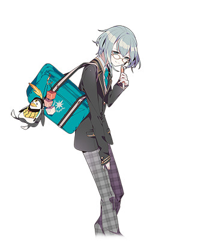
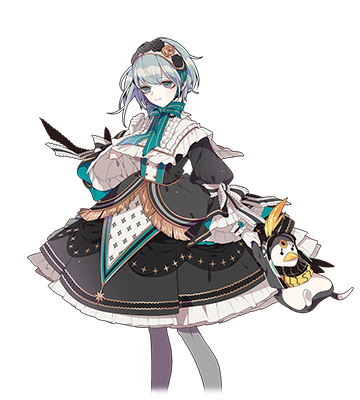

  

# 舞园星斗

| 角色信息   |  |
| ----------- | ----------- |
| 名称    | 舞园星斗   |
| 年龄   | 17岁        |
| 职业 |  高中二年级学生  |
|喜欢的东西| 可爱的东西|
| 对应曲   |RevolutionGame |
| 初出   | Chunithm Air |

## Episode 1 我的名字叫舞园星斗
> 17岁，高中二年级。兴趣是在街机厅打音乐游戏。请多关照。

我的名字叫“舞园星斗”。

是一名正值17岁的，随处可见的普通男高中生。

虽然在学校所属的是手艺部，不过由于社团的活动频率不高所以相当闲。

  
正因如此，所以我才常常在放学后出现在街机厅，是吧？虽然说不是足以被称为“玩家”那样的人。

关于喜欢的游戏类型，虽说格斗类到抓娃娃机什么的我都喜欢，不过，果然最喜欢的还是音乐游戏啊！

就是被称作“音游”的那个东西。

最近最喜欢的还是那个《CHUNITHM AIR》的游戏！虽说在那之前一直玩的都是maimai，不过现在已经完全沉迷于Chunithm了呢。

我在机厅也有不少朋友，其中以和我同年的女孩子，荒场流子关系最好！

我们常常在打完游戏之后一起出去喝茶。

## Episode 2 今天也要去玩音游

> 看起来，我还是比较适合玩Chunithm呢。最近，我的朋友流子也开始跟着玩起来了。

那天放学后，我和平时一样前往了机厅玩起了Chunithm。

虽然最初没什么状态……结果曲子后半的HOLD夹TAP打的不太好，分数比预期低了不少。

“嗯……果然这谱子我还是不适合打啊……我看看，写谱的果然是mai-Star啊……虽然名字听起来和我很像的不过还是很讨厌啊。哦对了，还有譜面－１００号写的也不太会打。”

就在我想着下次一定要拿SS然后手握着100日元硬币准备投下去的时候……。

“……哟。玩的咋样？”

“啊，是流子！”

“……嗯？这谱子，是mai-Star写的啊？”

“是啊。我有点儿不擅长这人写的谱子。”

“我懂。写出这种东西的mai-Star绝对是个性格扭曲的家伙！”

“呵呵，流子也真是的。”

“……果然星斗还是这么可爱啊。那看来被误会也是没办法的事呢。”

“咦，怎么回事？”

“其实啊，刚刚有个隔壁镇来这里玩的男子高中生本来对你的事情感兴趣就向我打听了一下，结果听到你是男的的时候大受打击了……真可怜。”

“咦……？就算你这么说也……”

……我也不是故意为了捉弄人才这么做的啊？

## Episode 3 我是不是稍微改变了呢？

>由于姐姐的影响，我从小就很喜欢那些可爱的女孩子的衣服……这会不会很奇怪啊？

我有个很疼爱我的姐姐。

某天，已经玩腻了娃娃的姐姐，突然冒出了把我当成换装的娃娃的想法。

从此，姐姐天天沉迷于给我换衣服，而随着姐姐的要求换衣服的我，几乎天天都是穿着裙子度日。

……虽说如果把这样的体验说出来的话，常常会得到“真是辛苦你了”之类的回复，不过对我自己来说，我倒是没什么厌恶的感觉，不如说很享受。

其实啊，我很喜欢那些可爱的东西。相比特摄英雄的剑，我其实更憧憬魔法少女的魔杖，相比较短裤，我更喜欢穿裙子。

即使我已经长大，这点也没什么变化……于是自然而然地，平时的我也穿起了“女装”。

  

话是这么说，这并不代表我厌恶自己身为男性这一事实。我的性向也很正常。

只是喜欢那些可爱的东西罢了。

但是这些事情，周围的人也未必能够理解。

  

我并不会隐藏自己女装的事实，包括学校里的朋友也知道我私下场合的样子。

如果是那些比较亲密的朋友的话还能够正常交流，不过大部分的人都会跟我划分一条看不见的线……所以有的时候会稍微有点难受。

（……到底有什么地方能够让我更加自由地度过呢？）

我开始思考起这个问题。

## Episode 4 和maimai的邂逅

> 咦？那个东西也是音游吗？怎么看都是台洗衣机吧……不过配色还挺可爱的。

某天放学后，我绕了个远路走向了机厅。

我记得最近应该是进了几台刚刚稼动的新的格斗游戏机子吧。

不过在我找到目标的游戏之前，我的眼睛被某样外形奇特的游戏夺走了视线，瞬间就印在了脑海里。

“……咦？这是……洗衣机吗？……不过总感觉配色还挺可爱的。”

这就是我和maimai的初次见面。

当时的我还没意识到这是台音乐游戏的机子。因为外形怎么看都是滚筒洗衣机啊。

当然，那时候的我也不知道怎么玩……不过向着杵在原地困惑的我伸出援手的，是周围那些亲切的玩家们。

这事我才注意到一件事。

（我一直以为音游是一种独自一人玩的孤独的游戏……原来像这样的，人与人之间的互动也是这么快乐的啊。）

从此，我就偶尔会去玩maimai了。随着时间的推移，我也渐渐的能和一起在机厅玩的人说上话了。平时除了和他们互相打招呼，讨论玩的情况，甚至在游戏厅以外的地方也见过面了。

流子也是其中一人。

那个时候我就学到了“分数就是音游的命根子”这个道理。因为在分数面前大家都是平等的。

就算我身穿女装，平时聚集于机厅的朋友们也不会对我的穿着做出奇怪的评价。

他们只会以我的分数来评判我的事情。

而这点让我的心里感到非常舒服。

## Episode 5 沉迷于Chunithm

> 我渐渐地沉迷于其中，不过这正合我意。看到我的分数能够登上游戏的排行榜我就很高兴啊！

最初，我还是集中于maimai的，不过渐渐地我发现自己游玩的中心偏向了Chunithm了。

（Chunithm的运指方式，对于弹过钢琴的我来说比较熟悉呢）

当我把这件事跟流子说的时候……

“啊，我懂的——！这也是你正热衷于Chunithm的证明啊。”

“是啊。另外，Chunithm也出了很多可爱的角色哦？例如这个叫‘鬼蝮尤莉亚’的女孩子……”

流子听着我说的话点了点头。

“‘鬼蝮尤莉亚’啊……总觉得有种莫名的亲近感。”

“……是胸部什么的吗？”

“信不信我宰了你。”

……我们就像这样度过平时的日常。而就在Chunithm AIR稼动不久，我的技术在自己常去的机厅那里，已经强到榜上有名的地步。

“好厉害啊！星斗！”

“谢、谢谢夸奖，流子……”

“哦对了快看看这个。‘雷击 游戏问卷调查’。你可是被标着‘穿着哥特萝莉装的白雪公主’被刊登在杂志上了啊！”

  

流子在说的似乎是专门刊登街机游戏相关内容的杂志。没想到我居然会有被当成“最近引人注目的玩家”看待，并刊登在杂志上的一天。

（没想到……我也有登上杂志的一天啊）

虽然没什么实感，不过玩着自己喜欢的东西的事情被人认可这件事，还是令我感到高兴。

## Episode 6 苦于推分

>嗯……果然还是很难把分数打上去啊。转换一下心情去别的机厅玩玩看吧。

这是我在Chunithm分数刚刚上榜不久的事情。

（嗯……总觉得我的分数还能够再往上推一点的……不过为什么老是在同一个地方摔跟头呢）

令我苦恼的谱面元凶果然还是譜面－１００号的产物啊……呜呜呜，可恶的譜面－１００号！

“……怎么了星斗？看你垂头丧气的。”

常常来机厅玩的人向我搭了话。

“其实呢，我不知道刷了多少次，总是在同一个地方失误，所以分数老是上不去……”

“这样啊。玩音游这是再常见不过的事情了。”

“真的？”

“真的。连续玩一首歌太多次，身体就容易记住老是造成失误的手法，也就是常说的‘手癖’哦。这种时候，脑子里明明想着‘这里不妙！’，但是手没法跟着思考行动。”

“对！就是这样！……那我该怎么办？”

“是呢……最直接的方法就是放置一段时间不去打，等到错误的肌肉记忆不见了，分数说不定就上去了。不过，转换一下心情去别的店里玩也是可以的。如果可以的话可以跟我们一起去。偶尔换换环境也不错。”

“太谢谢了！”

于是我就和那个人一起前往了别的店。

## Episode 7 机厅受辱

> 去其他机厅的时候，因为女装的事情被狠狠地取笑了一番。

我和平常游玩的人数人一起走进了别的店里。看来这边比较热闹，必须排队的样子。而刚开始排队不久的我们，很快就后悔起了来到这里出勤的决定。我们的前面似乎有好几个不良少年在闹。

“打了个B？……这么菜就别来这里出勤了啊！”

这群不良少年的态度非常恶劣，甚至对其他玩家的分数指手画脚。

……即便轮到我玩，我也没法发挥出平时的全力。

看到我的分数，不良们围了上来。

“哈！这里可不是穿这种轻飘飘的衣服的大小姐该来的地方啊！”

“难道是被一群死宅围着，享受着当公主的待遇？”

“不对，这家伙不是男的吗？记得杂志有刊登过啊！没想到能看到真人，恶心死了哈哈哈哈哈哈哈！！”

……由于说的话过于刺耳，我气的全身发抖。再怎么说我都行，但是连我的朋友都这么说怎么能忍！就在我回头瞪向他们的瞬间……我看到了他们的分数。

“SSS……！？”

那是个明显超出了我的想象的数字。我很清楚，在分数面前，大家都是平等的……我渐渐地收起了到嘴边的话，仿佛自己变成了丧家之犬一样。

## Episode 8 流子的鼓励

>自从被侮辱那天以后，我就再也没有去玩过音游。不过，鼓励着我度过难关的，是流子。

自从被那群不良侮辱以后，我就再也没有和那些在机厅玩的朋友见过面了。

不知何时，我连maimai和Chunithm都不再游玩了。喜欢的女装也收了起来，放进了柜子的角落里。

（果然……人还是不能特立独行地活着啊。配合大家的步调，才是正确的选择吧？）

我的脑中回响着这些想法，不知不觉中我和那些曾经那么痴迷的东西渐行渐远了。

不过……似乎是内心深处还残留着一些念想，身体还是会不自觉地走向机厅。那天，我正在机厅的门口徘徊的时候，我遇见了流子。

“……终于找到你了，星斗。就现在，和我一起打一局Chunithm吧。我请你。”

“咦！？为、为什么……那个，我已经不再玩音游了……”

流子拖着一脸不情愿的我走向了机子。结果还是一起玩了起来。

（流子竟然已经进步到这么厉害了吗！）

打完一首歌的流子深吸了一口气说到。

“这种感觉……已经是上瘾了啊。这已经不能叫‘中二节奏’（チュウニズム），该叫做‘中毒节奏’（チュウドクズム）了啊……这可都是多亏你啊，星斗。给我负起责任啊。”

“流子……”

“你还是很喜欢玩这个游戏的吧？Chunithm。”

“嗯……！”

从流子那里学到老老实实承认自己喜欢做的事情这个道理的我，决定再次回归音游。

## Episode 9 因为这是我最喜欢的事情

>多亏了流子的鼓励我才清醒过来。我喜欢这个游戏，而且，我才不想输给那些败类！

我再次回归了Chunithm这个游戏。当然，还是一直以来的女装样子。

“太好了星斗！你终于回来了啊！”

“是的！以后还是请多关照！”

……再次拾起这个游戏的时候，我才注意到一个问题。

（……迄今为止的我，都太过重视推分这一件事了，以至于忘了享受游戏的乐趣这件事。虽然推分的确是一件重要的事情，但更重要的是“心无旁骛地享受”才对啊。）

注意到这个事实的我，便开始随性地玩起了游戏。

（……不管是Chunithm，还是女装什么的，我都是因为喜欢才接触到的。这和别人没有关系！）

在这么想着的时候，我的脑海中浮现了那群嘲笑我和我的朋友的那群不良们。

（……竟然还有那种侮辱我喜欢的Chunithm的恶劣玩家存在……不过在我的分数还比他们低的时候，再怎么不甘心，说出来对他们来说也不过是丧家之犬的吼叫罢了。这一次，不是为了和别人比较，我要为了保护我最喜欢的东西，努力提升分数！）

一团怒火在我的心中燃起。而我也为了让这股火燃烧的更旺，更加拼命地练习。

不知何时，我在我常去的机厅那里拿到了第一名的成绩。而且分数在全国的排行榜也名列前茅。流子和其他伙伴们都非常开心。

“这不是挺厉害的嘛！星斗！这样你也算得上是顶级的玩家了啊！”

“谢谢……不过，在这之前我有不得不完成的一件事。”

## Episode 10 不服输的信念

>我再次向他们发起了挑战。而战斗的结果则是我获得了ALL JUSTICE。我获得了胜利。

我再次踏进了那间机厅。而和我预想的一样，那群不良正在店里旁若无人地玩着Chunithm。

“哦！这不是前阵子那个‘宅男公主’嘛！咋啦？又想要被我们取笑吗？”

“……我不是什么公主。今天我是来向你们发起挑战的。和我比一比Chunithm吧。我如果赢了的话，以后就不要再做这种妨害人的事情了。”

“……行啊。随时奉陪。不过要是你输了的话，就给我把衣服脱光绕这里跑一圈哦？”

“……我知道了。”

就这样，我和那群不良少年的老大开始了对决。他们指定的歌曲，是《レイジングサンダー》（Raging Thunder，恶搞Chunithm的歌曲《怒槌》）。这首歌是全游戏中最难的一首，就连我也只能打到SS的分数。

（不过，我不能输！绝对不能输！）

而在我的拼命努力之下，我拿到了ALL JUSTICE！华丽地获得了胜利！

不良们只能说着些狠话，灰溜溜地离开了机厅。而周围的玩家发出了欢呼声。

“我们一直深受其害没法正常玩Chunithm，你可是帮了我们除了大害啊！太谢谢你了！没想到外表看着挺可爱的，实力也很强啊！”

听到这样地赞赏之词，我的脸也不禁红了起来。

“……这个嘛，总有这种时候的。毕竟我也是男孩子啊。”

## Episode 11 我和CHUNITHM

> 我成功地保护了我喜欢的东西。从此以后我也要以这独一无二的才能享受着这个游戏！

在我成功地保护了我自认为唯一擅长的东西，Chunithm的那一战之后，我再度回到了每天出勤打机的日常。

我的手指轻快的飞舞着，丝毫不输于身上轻飘飘的裙摆。

最重要的分数，有的时候我能打出最棒的状态，也有不知不觉就提升了的时候。

（不过，这样也足够开心了啊）

用身体感受着街机带来的旋律，达到前人未及的领域。只要自己的身体状态全开的话，就能够发现自己未曾见过的一面。这种体验太棒了。

“……今天状态也不错呢，星斗。”

“啊，流子！”

和流子的关系依然如故。既是亲友，也是互争高分的对手。这样的关系对我来说最好不过了

“呐，星斗，那边那孩子......”

流子指向的方向，是一名从未在街机厅见过的男生。

似乎正在犹豫要不要玩 CHUNITHM AIR的样子。

我们俩相视一笑，点了点头便走向了那边。

“...可以的话，和我们一起联机如何？”

“不如第一次由我们请客？”

...就这样，我们的世界渐渐地变得宽广起来。

