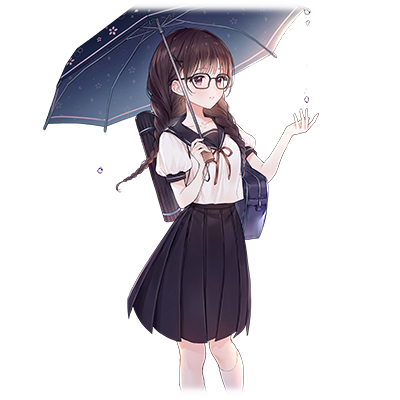
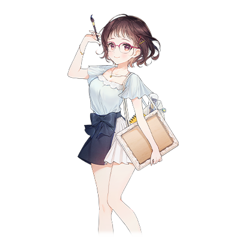

# 水户 雫

  

| 角色信息   |  |
| ----------- | ----------- |
| 名称    | 水户 雫   |
| 年龄   | 17岁        |
| 职业 |  高中二年级学生  |
| 对应曲   |レイニーカラー・ウォーターカラー 
| 初出   | Chunithm Paradise Lost |

## Episode 1 雨

>去寻找放晴时候的彩虹这样的行为，已经很久没做过了。

雨正不停地下着。

不管是遇上悲伤还是难受的时候，还是遇上痛苦的事情的时候……只要我的心情一低落，外面必定是阴雨连绵。

以前还会稍微思考一下为什么，但现在已经彻底习惯了。

只要等上一段时间，雨就会停止。

停息的不只是外面的雨，也是我心中的雨。

所以每当这个时候，我都会拿起画笔尽情作画。

看着宛如外头飘着的云朵般洁白的画布，尽情地挥洒着自己的颜色。

只有这个瞬间，我才会觉得整个世界都是属于我的颜色。

滴。

大颗的雨滴飞溅到了窗户上，发出了响声。

突然的雨声打断了我的思考，我停了下来。

我眺望着窗外的景观伸了个懒腰，充满水气的空气钻进了我的肺部，让我为之一震。

与此同时，我感觉到了一股忧郁的感情从某个地方袭来，不禁让我将视线从窗口移开。

映入眼帘的，是我一直使用的第二美术室。

除了我以外没有人造访的，孤独的画室。

虽然这么说，不过休息日还会来高中的美术室的人本来就很少见了——

但是，我能够自由地画画的地方，就只剩这里了。

父亲和母亲，都认为让我画画不是什么好事。

——即便如此，我也想画。

  

绘画。

这是我唯一打从心底里想做的事情。

那是如此的重要，以至于让我无暇顾及其他的事情。

  

——但是，这样真的好吗？

  

自从升上高中，我就从周围听到了不少令人不安的声音。例如恋爱，前程，将来的梦想之类的。

我再次拿起了画笔，尝试将心中的忧郁一扫而空。

不过，今天却再也没有动过一次笔。

## Episode 2 奇怪的客人

>就在这一成不变的日常之中，“他”突然出现了。

直到清场铃响起之前，我都会在美术室里画画，这是我的日常。

反正回家能做的事情也就只有学习，能够自由分配时间的地方也就只有学校了。

能够不顾及其他人，一人面对整个画布的，就只有这个安静的第二美术室了。

但是，门突然被人打开了——突然的动静令我僵在原地，连画笔都掉到了地上。

  

“咦？水户同学？难道说你这是在忙社团的活动？”

  

听到不熟悉的声音，我只是战战兢兢地背对着那个人，丝毫不敢回头观望，默默地点了点头。

没想到除了美术部的顾问以外，还会有其他人造访这里。

“啊……不好意思，我是不是打扰了……”

“不，不是的！我只是突然被吓到了而已……”
  
我诚实地将自己的情况告诉了对方，对方似乎是安心了下来，叹了一口气拍了下胸脯。

看着他的行动，我居然稍微觉得有一丝可爱，不过还是保密吧。

其实我是知道他的。他是和我同班的朝井阳真。

有些轻飘飘的发型和毫无掩饰的笑容。身材却又很高大……和他外表给人的感觉不同，是个很开朗的男生，总觉得有一种不平衡的感觉。
  
“水户同学，我是不是做了什么奇怪的事？”

“咦？”

“因为，怎么感觉你好像在笑？”
  
被这么一说，我赶紧摸了下自己的脸颊，似乎是真的，感觉嘴角有些缓和的样子。

明明我还没怎么和他说过话，竟然会露出这样失礼的表情……

我赶忙摇了摇头，然后低下了头，努力不让视线和他对上。

别看这样，这已经是我能做到的最明显的表态了。

……如果去照照镜子的话，我现在的表情一定很糟糕吧
  
“……呃……算了……总觉得，水户同学很有趣呢。”

“才不……有趣呢。”
  
就连我自己都察觉到自己现在的声音都在颤抖着。

心跳是如此之快，仿佛要撑破胸口一般，我只能努力的握着画笔让自己保持镇定。

  
“不、不好意思……我只是来还一下今天上课用到的画架而已。”

他手指着的，正是我面前立着的画架。

我感觉笼罩在自己心中的某样东西突然消失不见了。
  
“……呵呵。”
  
没想到居然会有人专门来到美术室还画架，真是尽责啊。
  
“朝井君……我是不是很奇怪啊？”

“……嗯，有的时候吧？”
  
朝井君这么说着，露出一副“哎呀哎呀”的表情，耷了耷肩。
  

“如果想还画架的话，你可以去第一美术室……因为大家结束社团活动后都会放到那里，等你用完后直接放那儿就行了。”

“知道了！谢谢你，水户同学！”
  
朝井从刚刚目瞪口呆的表情一转，变回了平常那毫无掩饰的笑容。看着他丰富的表情变化，不知为何我觉得非常可爱。

要是我也能像朝井君这样就好了。

“咦？这是水户同学画的画吗？”

就在我思考着的时候，不知何时他已经站到了我旁边。

我的脑子顿时宕机了。

怎么办……还从来没有人站在离我这么近的地方啊。
  
“总觉得是幅很不可思议的画呢。”

“……不可思议？”

“嗯，虽然画中描绘着漂亮的天空，但总觉得画中有一丝寂寥的感觉。”
  
这句话瞬间说中了我的内心。

一针见血。仿佛被人看透了我的内心一般。
  
“啊，我不是在说什么贬义的评价哦。我其实还挺喜欢这幅画的。”

“啊……”
  
喜欢。

我从来没有被这样赞赏过。

迄今为止，大家对我的赞赏，一般都是“好厉害”“好熟练”“画的好像真的一样”，像这样直接基于画作本身的评价。

但是，我希望得到的，并不只限于别人对我画技的赞赏。

因为我是喜欢画画这件事本身，才这么坚持下来的。
  
“……谢谢。”

我用细小到几乎听不见的声音说出了这句话。

朝井君说不定根本不会听到这句话吧。

现在我的表情应该是很害羞吧，我赶紧转头望向窗外。

窗外的景色一如既往，大雨仍然没有停息。
  
“雨根本没停呢。明明还没到梅雨季节，要是这么继续下的话感觉人都要变得郁闷了啊……”

——朝井君的无心之言，宛如一把尖刀般刺在了我的心上。

我努力忍着疼痛，拼命地寄出了几句话。

“——是这样呢。”

映在窗户上的朝井君的表情是那么的悲伤。

但是，我却无法回望。

## Episode 3 老师

> 虽然一个人也能画画。不过，两个人一起画画也不错。

从那天开始，我放学后并非一人独处的日子就突然增多了。

那是因为前几天发生的事情导致的……。

“那个，如果一直盯着我的话我就没法集中精神了……”

“哦……抱歉，一不小心就……”

最初我还不怎么在意，但从这周开始，他就每天都会造访这里。

我还是无法适应别人在自己身边的气氛，导致无法集中精神画画。

“……朝井君要不要试试看画点什么？”

本来提出这个建议是为了让他能稍微离自己远一点的——。
  
“那个，这难道是要教我画画的意思吗！？”
  
面对这超出预想的回答我不禁满头问号。

“哇——！太棒了！那么以后就请多关照了，老师！”

“老师？”

“就是在说水户同学哦！”

“咦！？”
  
面对这番话我不知所措，就这样不明不白地当上了人家的“老师”。

不过偶尔被人这么称呼，似乎也没想象中那么厌恶嘛。

直到这个时候我都还是这么想的——。
  
第二天开始，我每天都会花十五分钟左右的时间教他画画。

从最基础的知识，到一些技巧的运用。

“嗯……果然还是不能立刻就学会怎么画呢。老师又是怎么画出那样的画呢？”

他一边说着，一边在画布上动笔。

“那个……关于那个‘老师’的称呼，能不能不要再说了呢……？”

“为什么？现在你不就是我的‘老师’吗？”

“确实那个……是这样没错的……”

“那就没问题啦。”

“之前在教室里的时候你也这么称呼我了吧……我有点儿困扰。”
  
平时的我在班里只会和同学有最低程度的对话，但那个时候，几乎整个班的女生都围了上来。

不过，还是有帮我解围的人……。

“等等，朝井同学！你看水户同学都被吓到了啊。”

说着这话的是坐我隔壁的藤木茜同学。

个子矮小，头发染成了茶色，是个性格和我相差甚远的人，是班里的开心果。

虽然一直坐在我的隔壁，但我从未和她有过完整的对话。

“咦！？难道不是你们围在她身边才吓到她的吗？”

“才不是呢。对吧，水户同学？”

“那个……我只是突然被这么叫到了……倒不是……害怕什么的……不如说大家聚在这里，有点开心什么的……”

“看吧。所以你们也别聚在一起吓到水户同学啦。”

从此以后，我和她之间的对话开始多起来了。

虽然说还不能以朋友互称……应该吧。不过我觉得自己应该已经被她当成同班同学看待了吧。

——从结果上来说，是托了他的福……对吧？
  
我仔细看着用外号称呼我的朝井同学的脸。

当我看的越久，就总觉得心中有股难以名状的感情愈发强烈——

“是吗。果然叫‘老师’什么的还是太羞耻了吗。那么，不如直接叫你‘雫’如何？”

“名，名字的话……”

“是啊。反正我们是同班同学，从此以后还得一直打照面的，老是同学同学之类的称呼实在是太见外了，‘老师’还是‘雫’，你觉得哪个称呼比较好？”

“呜……那么，还是‘雫’吧……”

“好，一言为定！”
  
虽然被家人以外的人用名字称呼有点不好意思。

不过却有种舒服的感觉，这是为什么呢？

## Episode 4 魔法的话语

>我还从没有想过，自己有一天会被别人的话支持着，推动着自己向前进。

梅雨季就此来临，时间也到了6月。

今天的天气也是阴雨绵绵。已经连续四天都是这样了。

我的心中仍是一片忧郁。我连画画的心情都没有，只是坐在画布的面前发呆。

“打扰啦。哦，这张纸，是调查志愿的表格对吧？”

他和往常一样走进了第二美术室。他似乎在走廊外的时候就沿着大开的教室门看到了我手
上拿着的东西。

我赶忙将手上的志愿表折起来收进书包里。

为了不让他看到明明明天就是上交的日子，却还是一片空白的表格。
  
“水户同学应该是擅长学习的人吧。高考要考那些有名的大学吗？”

虽然感觉他的发言有些不着边际，不过像这样随意的态度说不定也是他的优点呢。

我只能露出苦笑糊弄过去。

“才不是呢。我学习也没那么好。”

因为——选择自己的未来这件事，对我来说太难了。

“那么……美术大学如何？虽然听说也不简单就是了。”

“美大？”

想起美大被人说是最应该回避报考的领域，我不禁握紧了手中的画笔。

能够在那种地方学习，随自己喜欢画画什么的，那得是多么幸福的事情啊。

但是——
  
“我……我可能就报个普通的大学吧。那些排名靠前的就不去考虑了，弄个凑合的就行。”

“不过，我觉得继续画画也不错哦。”

“……为什么？”

“因为，画画时的雫，露出的表情是最棒的。”
  
瞬间，我觉得整个世界都静止了。
  
——滴。
  
明明我听不见周围的声音，却只有雨滴的声音在耳边回响。
  
“我很喜欢。”
  
这话不是从我口中说出口的。

不是从我的口中，而是从热衷于某件事的人的口中所说出来的。

“啊——”
  
我的双眼已经无法从他身上离开了。

他只是露出温柔的笑容——在这个瞬间，连雨滴的声音，还有我的心跳声，都听不到了。

## Episode 5 决心前往何方

>我还是稍微积极一点吧。虽然做起来并不容易。

除了吃饭以外，已经很久没有和家里人一起坐在饭桌前了。

“那个……”

我拿出了调查志愿的表格。

上面已经填了一些内容。

当我回家的时候，已经填了一些必要的内容。

“希望给你们看看这个……”

我一边说着，一边低下了头。

我不敢抬头看父母现在的表情。
  
“……这是怎么回事？”

果然，和我想的一样。

“那个……”

“雫……总之，说话的时候，要抬起头正面说话才行。我不是说了很多次了吗？”

“……是。”

我的心中仍然充满忧郁，只能慢慢的抬起了头。
  
“咦……？”

父亲和母亲两人似乎并没有生气的样子。

不如说，那是充满疑惑的表情。

“雫，怎么了吗？”

“啊……那个，我没事。”

“是吗。总之……我还是想问一下你为什么要填这个。”

父亲这么说着，指向了志愿表里的第三个志愿。

上面写着的，是离家里最近的美术大学的名字。
  

“那个……那个……实际上……我只是还没把握主意，班里的人这么推荐我才……”

紧张的我只能不停的摆着手回答着父亲的问题。

父亲露出若有所思的表情，一手扶着下巴看着表。

“这样吗。雫。”

“那个……难道是不行吗……？”

“不，如果这是雫你自己的想法，这就够了。”

这么说着，父亲离开了饭桌。

——要找个好大学，然后顺利进入公司就职，当个好妻子。

这是父亲一直以来跟我说的事情。

所以，估计父亲也一直觉得我画画这件事不过是兴趣使然而已吧。

“我嘛……如果这是雫自己决定的事情的话，那我觉得也不错呢。”

——母亲这么说，估计也不是打从心底里赞成这件事吧。

“……嗯。”

我的心中充满了无法消除的不安，缓缓地从椅子上站了起来。

努力鼓起勇气做出的行动，只是发现自己只是笼中之鸟的现实罢了。

## Episode 6 理解者

>大家总是说能够理解对方的想法。不过，只有自己对自己到底想什么一无所知。

今天也是下着大雨。

虽然说梅雨季节就是这样，不过大雨仿佛就像是在映射着我的内心一般，令我更加郁闷。

手握着志愿调查表站在教师办公室门前，我总觉得周围的空气比平时更加沉重。

“打扰了。”

因为一直在苦恼着，结果第三志愿最后也没有涂掉。

虽然父亲可能会有些不满，但是如果真的把这个志愿划掉的话，我总觉得就再也没法自己选择这条道路了……。
  
“……好的，我已经确认水户同学的志愿表了。我还是再确认一次吧，你真的想填美大为第三志愿吗？”

“是的，我已经和父母谈过了，所以就填了这个……”

“是吗，水户同学如果不在意的话那也没问题……”

我向老师行了一礼之后便离开了办公室。

“咦？这不是雫吗？”

突然出现在我面前的正是他。

“那个，第二美术室的钥匙，是不是一直在你身上？”

“啊……”

这么一说我想起来了。

因为第二美术室几乎都是我在用，所以我从老师那里拿了一套钥匙。

不过现在使用那个房间的人又多了一个人——而我却忘了这件事。

“抱歉。我现在就过去吧……”

“是吗。那——”

要不要一起去呢。他说的这句话被突然打开的拉门声盖住了。

“哦，这不是朝井同学吗，刚刚好。如果你现在有时间的话，能不能和老师讨论一下以后的志愿呢？”

“咦，啊……没问题。”

“那么我们现在去办公室吧。”

在跟着班主任前去办公室的途中，他露出了一副充满歉意的表情苦笑着，看着他的脸，总觉得有点儿悲伤。

  

“——其实啊，我们家现在的经济状况很拮据呢……我打算高中毕业了就去找个工作赚钱的啊。”

他一边拿着画笔在画布上作画，一边满不在乎地说着。

我一瞬间不知道怎么反应，只能停下手中的画笔看着他。

他似乎也注意到了我的反应，又露出了和平时一样毫无掩饰的笑容。

“不过啊，刚刚偶然听到了雫的志愿，总觉得有点儿狡猾呢。”

“是……吗……”

“哈哈哈，关于我的事情果然很无聊对吧。”

虽然朝井君用着戏谑的表情说着，但我却不知怎么回应。

“那个……我倒也不是说对这种事情八卦。那个，我应该怎么说呢……我还以为朝井君肯定会选择升学的。”

听到这句话，他双手抱胸，陷入了沉思。

偶尔抓抓头，偶尔拍着手掌……。

“确实，最近有种想要继续学习的欲望，不过现在的情况实在是没有余力去做这些事啊……啊，不好意思，说这种阴沉的话题。就当作没听见，行吗？”

他说话的调子还是和平时一样轻松，但我却感觉到一股拒人于千里之外的寂寥感。

## Episode 7 我想做的事情。

>搞不明白。如果只是说这句话的话，未免也太轻松了吧。

毕业之后就去就职。

当我那天听完这句话之后，第二天，朝井君就再也没来到第二美术室。

我也久违地一人造访美术室，对着画布作画直到天黑为止。

明明之前还是那么自然地在一起画的——现在我却感到一阵不安，无法平静下来。

某样不知名的感情在我的心中乱窜，令我无法认真画画。

为什么会如此烦躁。我也弄不明白。
  
“啊啊……真是的！！”

实在受不了了，我只能把画笔放到一旁。

我为什么会如此动摇呢。

无意间望向了隔壁的画布。

那里放着的，当然是他画的画作了。

他最近开始越来越少向我寻求帮助了。因为我不想打扰他专心画画，所以我也不知道他究竟画了什么。

然后，我站了起来，眼睛不自然地向着画布以外的地方飘去。

是不是不想被人看到呢……我想着。
  
——反正今天也就我一个人，看看也无所谓吧？
  

虽然有些罪恶感，但好奇心还是战胜了一切，我掀开了幕布。

“——咦？”

画布上画着的——是露出笑容面向画布的，我。
  
“画画时的雫，露出的表情是最棒的。”
  
他的话开始在我的脑中回响。

原来，他不管自己的情况有多糟糕，一直都在背后默默地支持着我。

“……”
  
好后悔。好不甘心。

我为什么会没有注意到呢。

我为什么只想到自己的事情呢。

我一直都认为，进入一所好大学，进入一家好公司……然后和人成婚。虽然没有什么特别的东西，但是这种平凡的幸福，就足够了……我一直以来都是这么想的。

画画什么的，不过是任何时候都能捡起来的趣味而已……。

只要喜欢画画的话，这样就够了……
  
“咦？”
  
我的指尖突然感觉到一点冷冰冰的东西，我才注意到自己已经泪流满面。

我迄今为止，究竟在干什么呢。

——我为什么，会将这样一直在我的身边鼓励着我的人，视若罔闻呢？

## Episode 8 全部的勇气

>如果你觉得很奇怪……的话，也无所谓。

天空乌云密布。

沉闷的空气预示着没过多久就要下雨了。

不过，雨仍未落下的这段时间，对我来说就已经是比平常还好的天气了。

“朝井君！”

班会结束，我叫住了比别人先一步走出教室的他。

“咦？”

顿时，教室中的同学们都看着我。我也察觉了自己的双脚正不停地抖着。

“怎么回事？水户和朝井两人什么时候这么熟了？”

“难道说，这俩其实已经……？”

“居然在教室里——？”
  
好可怕——不管是同学们的视线，还是背后的声音。

就在这时，背后突然感觉到了一只手正推着我——。

“好啦，小雫。趁班里的人开始骚动之前，赶紧去做你该做的事情啦。”

站在我身后的，是由于朝井同学的那件事为契机，和我关系甚好的藤木同学。

藤木同学靠了上来，贴到了我的耳边——

“待会可要和我说一说最后什么结果哦。”

瞬间，我全身都感觉到了一股热气。

她露出一副猜到了的笑脸，双手推了我一把。

我就这么走到了他的面前。

他的脸上已经充满了惊讶。

“那个，跟我来一趟……！！”
  
我这么说着，便拉着他的手走向了某个地方。

目的地不用多说——就是第二美术室。

来到第二美术室的我，吸了一口气整理了一下自己的思路。
  
“……那个，我有些话想和你说。”

我深深地吸了一口气，慢慢地抬起了头，才发现他正背对着我。

我就这么对着他的背影，继续说着。

看不到脸，也没关系。

这样的话，更能冷静地将自己所想说出来。

“我，其实已经看到了。朝井同学的……画。”

“……！”

朝井君转了个身，露出了一张稍微皱着眉头，却又有种放弃了的表情。

“嘛……果然还是这样了吗。一般人都会去看的吧。”

“……嗯。因为你一直没来，所以我偷偷地去看了。”

这并不是否定他，只是我的小小借口。

虽然有点狡猾，不过这就是事实。

“……没想到画布上画着的是你对吧？是不是……有些轻蔑我了？”

我努力地摇了摇头。

我从来都没有这么想过。

所以——
  
“不是。我很高兴。”
  
然后，隔了一拍。
  
“谢谢你，阳真君。”
  
我直直地望向阳真君说出了这句话。

这句话让他露出了困惑的表情。
  
“我，已经决定去报考美术大学了。虽然一直都很害怕面对自己的梦想，但是和阳真君一起画画的这阵日子让我终于下定了决心。”

“雫……”

“所以，阳真君。请你跟我说一说，前阵子我还没能听到的，你的梦想。”

“……”
  
我等着他的回答。

虽然看起来很像是在使坏一样。

不过我还是希望从他的口中听到答案。

过了一阵子，他终于开了口。
  
“没有。”
  
是的，如此干脆。

但是，他很快继续了下去——

“没有……本该是没有的。但是，现在不一样了。我希望，能够让大家知道雫的画是多么棒……这是一直在雫身边看着她画画的……我的想法……哈哈……”

又是那副想将一切糊弄过去的笑容。不过，这次的笑容有所不同。似乎在他的脸颊那里，带了些许绯红。
  
——滴。

不知何时，大雨已经来临，雨滴拍打着窗户，在窗外飞溅着。

就像我们两人初次见面那天一样，雨滴的声音包围了整个第二美术室。

不过，有一件决定性的东西和那时候不一样。

——所以，我下定了决心。

“那么……要不要和我一起……实现那个梦想呢？”

“这到底……是什么意思？”

“我已经决定了去美术大学学习，希望让更多的人能看到我的画。也希望更多的人，能够对我的画加以赞赏……”

我充满决心的话语让他露出了笑容。

这个梦，已经不是形单影只的，一个人的无缘之梦了。

现在，这个梦想，已经由两个人所承担。

## Episode 9 他的事情

>我第一次见到那幅画的时候——我真的觉得太厉害了。

我——朝井阳真知道她的事情的契机，不过是偶然的事件罢了。

那天，刚好在值日的我，正好得归还上课借用的画架，才来到了美术室。

因为美术室没有详细的房间信息，我才来到了比较近的第二美术室。

不过，她却在那间美术室里。

“啊……不好意思，我是不是打扰了……”

“不，不是的！我只是突然被吓到了而已……”

她只是一个人在房间里画画而已。

隔壁的美术室也见不到人，虽然看着很像是留在这里工作什么的……不过我很快就明白了并非如此。

不，应该任何人都能明白的吧——只要看了她的画的话。

“总觉得是幅很不可思议的画呢。”

我不知不觉说出了口。

我就这么迷上了这幅画。
  

“嗯，虽然画中描绘着漂亮的天空，但总觉得画中有一丝寂寥的感觉。”

虽然我也不知道为什么会这么想，但我觉得应该是画的氛围和现在自己的心境重合了吧。

我们家其实并不富裕，家里还不断地有弟弟妹妹出生，渐渐地我在家里的容身之处也变得越来越少了。

周围的朋友们都是抱着玩玩的心态随便选择一所大学就读的，为什么我就只有养家糊口这一个选项呢。

虽然这也不是说没有梦想之类的，但这种“缺失”却令我不知不觉产生了一股虚无感……直到我看到这幅画的瞬间，我才明白这点。

在我谈论画的感想的时候，她露出了一副无话可说的表情。

“啊，我不是在说什么贬义的评价哦。我其实还挺喜欢这幅画的。”

所以我立刻补了一句。

——我是不是让气氛变得更加尴尬了啊。

我立刻转移话题。

“雨根本没停呢。明明还没到梅雨季节，要是这么继续下的话感觉人都要变得郁闷了啊……”

“——是呢。”
  
从此之后，对比周围的人们都产生了劣等感的我，开始常常来往于第二美术室了。

不知为何，和她在一起的时间总是那么的开心——
  
“明明现在根本不是能够安心享受的时候啊。”
  
不知何时，我开始一心支持着雫的梦了。

如果是我自己的理解的话，应该是以现实为理由，放弃了一切。

只是说着毫无责任的话，随便地将梦想托付于人。

当我注意到了这件事之后，我选择了逃避。

但是——
  
“那个，跟我来一趟……！！”

她靠着自己的意志抓住了我的手。
  
“那么……要不要和我一起……实现那个梦想呢？”
  
真是个狡猾的女孩啊。

竟然将别人卷进自己的梦想之中。

不过，说不定她自己其实都祈求着，被卷进来的人，是我就好了也说不定。

她虽然讨厌下雨，不过我却觉得十分相称。

不过，现在有些不一样了。

迎着雨后初晴的太阳绽放着的，凛然的紫阳花——现在的她，更加适合这样。

## Episode 10 紫阳花田的少女

>未来能够自己选择的。正是他的“话语”，改变了我。

在这之后，我听从了老师的忠告，将第一志愿改成了美术大学。

当我鼓起勇气向父母汇报的时候，虽然他们的脸上难掩惊讶，但还是表达了“想做的话就尽全力去做吧。”的话语。

之后，我就前去美术大学的预科学校上课了，放学以后再也没有前往第二美术室。

在这之后，又过了一阵子，来到了高中三年级的2月份。
  
“啊，是定期送来的报告。”

邮件中传来了他的绘画的进度。

摄影的人是小茜。

“明明已经是冬天了……”

他的画里却画着满满的紫阳花。

紫阳花在太阳雨之中被雨水打湿，但是打湿的花瓣又反射着云层间散射下来的日光，淡淡发亮。

“咦？”

画面和之前看到的略有不同。

有一名少女在紫阳花丛中。

明明画面中是站在地上的，却觉得好像是漂浮在其他画布之上。

“总觉得有点不可思议……”

明明看起来很不自然，却有一种强烈的主张，让人目不转睛。

如果要诚实地将感想说出来的话——

“果然，我还是喜欢阳真君的画呢。”

自然而然地，我的脸颊变得滚烫。

因为这句话对我来说，就是那么的特别。

* * *

“呐，朝井……能不能让我看看你的画？”

“可以。”

“不过居然花了这么久啊。明明年底就要去找工作了，现在还在忙着呢。”

“确实呢。”

我并未停手，只是继续回答着。

明明时间看起来还很充沛的，不知道什么时候，就到了那一天。

“如果将完成前的作品拍给她的话，会不会让反而没啥冲击力呢？”

嘛，一般都会这样的。

不过，没问题。

“雫的话肯定会注意到的。”

“诶~二位可真是打得火热啊。”

“行啦，别这么开玩笑啦……”

就这么说着，我放下了画笔。

“哦，完成了吗？”

“完成了。……终于是赶上了啊。”

我深吸了口气，然后听见了走廊传来了脚步声。

脚步声越来越快，最后来到了第二美术室面前。

——嘎拉拉拉！

门被用力地打开，脸色发红的她出现在我的面前。

虽然久违的看到她令我十分高兴，但现在并不是做这个的时候。

——空气变得十分紧张，我吞了一口唾沫。

“……结果出来了……是合格！”

“小雫~！我就知道你一定能成功的啊！！”

藤木和雫两人兴奋地拥抱在一起，两人在嘻笑过后，藤木偷偷地望向我。

看这眼神，是在跟我说“待会儿可得给我好好干啊。”

“雫，恭喜你合格！”

“谢谢！这都多亏了大家啊！”

雫露出了满脸的笑容面向我。

“雫……这幅画，我想拿给你看。

完成的那幅画里，她看到的画面里，只有一处地方不同。

“这是……”

在被紫阳花丛围着的少女身上——

在她的无名指上，戴着一枚戒指。

## Episode 11 太阳雨

>只要有你在的话，就算暴雨倾盆，也无所畏惧。

我曾经，十分讨厌梅雨。

因为每次下雨的时候，我总会觉得是因为自己的缘故。

“谢谢你们。”

“谢谢你带来这么棒的画作。”

“这边才是，能够受到你们的赞赏我非常高兴。”

现在的我，已经是一名新晋画家了。

自从从美术大学毕业两年，虽然有点慢，不过知道我的画的人越来越多。虽然还没有属于自己的工作室或者事务所之类的东西，不过最终也成功的开办了自己的个人画展。

“哟，小雫！！”

“小茜！”

前来的，是最初感觉有点可怕的同班同学，小茜。

不过，现在的她已经是我最亲密的朋友了。

“终于开始像那些有名的艺术家一样了……不过啊，画展第一天就下雨真是遗憾啊。”

“哈哈哈……我觉得这样反而更适合我。”

“啊，说得也是呢。”

不管是高中时代，还是大学时代，她都一直关心着我。

直到现在也未曾改变。

“不过啊，今天过来真的可以吗？”

“嗯嗯，今天没问题哦。”

小茜露出一副浑然不知的表情，但似乎很快就明白了我在说什么，满足地点了点头。

“咦？”

突然，一束阳光穿破云层照到了我的脸上。

虽然大部分还是被乌云覆盖着，但是从那个缺口我还是看到了蔚蓝色的天空。

就在我看得入神的时候，上衣口袋里的手机响了起来。

手机上表示着的，是他的名字。

手机的待机动画，一直都是那张他送给我的画，而他的名字就这么显示在画面的正中央。

“呵呵。”

真是绝佳的时间。就像是我的心也跟着这天空放晴一般。

“啊，这是朝井对吧。”

“嗯。”

“那个家伙究竟在干啥啊。偏偏在这个时候出国。”

“没关系的。因为这是我们两人的梦想啊。”

他自从毕业之后，就参加了大学的网课。

一边工作一边学习，最终进入了美术相关的工作。

那是一份将自己找到的美丽的东西，传递给整个世界的工作——这正是和他相得益彰的工作。

“那么，究竟说了些啥？”

“不会说的哦？这是我们俩的秘密。”

“咦~！小气鬼！”

这么说着，我们俩笑了出来。

就在这时，天空又下起了小雨。

我只是收起了手机，就这么不撑雨伞，走了出去。

“雫？”

我望着天空中的太阳，转了一圈。

行道树，还有花草们，都在雨水的洗涤中闪闪发亮。

仿佛就像为我们两人祝福一般。

因为，今天是属于我们的纪念日。

“真棒啊……阳真君。”

手上戴着的戒指，在阳光的照射下闪闪发亮。

和我那天我拿到的画作里，只有一处不同。

那就是，戒指并没有戴在右手，而是戴在左手的无名指处。

  
——呐，过去的我。

现在的我——已经不那么讨厌下雨了哦？

