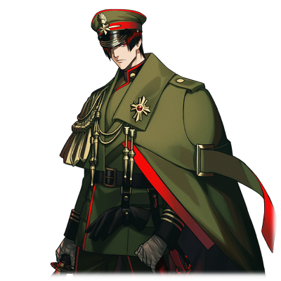

# 九十九宗治郎

| 角色信息   |          |
| ----------- | ----------- |
|  名称 |九十九宗治郎
|年龄 |26岁
|身份 |日本帝国军陆军少尉
|对应乐曲|夢路拍子
|初出|CHUNITHM NEW

## Episode 1 梦境间隙之中

>这里……难道是我的家乡吗……？记得我确实是在战场上啊……为什么什么都想不起来……

这是一个漫长而又带着些现实气息的梦境。

睡眼惺忪的九十九，正从这个宛如现实与梦境反转了一般真实的梦中醒来。

在他眼前的，是一片波澜不惊的水面。自己的头似乎正枕在某样柔软的东西身上。九十九坐起身来，才发现自己的面前正坐着一名身穿着白无垢的少女向着自己微笑。

少女的脸颊，就像晚霞一般红彤彤的——

  

九十九宗治郎，是一处山村之中的富裕人家所生下来的次子。

文武双全的宗治郎，成为了这所山村中的第一名士官学校的毕业生，现在的他，已经是位极陆军少尉的精英军人。

现在，正是和他国之间的战争愈发激烈的时候。

身为少尉的宗治郎也不能免俗，就和其他的军人一样前往了战场，指挥着战斗——这一切本该如此的。

然而，现在宗治郎的眼前所看到的，却是童年就曾下水玩过的河川，还有向远处眺望就能看到的，曾经在山上吹着草笛的山峰，以及近在眼前的，令人怀念的少女的脸庞。现在的他，毫无疑问正是在距离战场千里之外的故乡之地。

宗治郎露出一副充满疑惑的表情，抱紧了头。

他想不起来到这里之前的记忆。

看到这样的他，白无垢的少女露出担心的表情低下头来，握住了宗治郎的手。

“宗治郎先生……看来是在战场遭受了痛苦，让记忆也变得模糊了呢……真是可怜……”

“啊……啊啊……原来，是这样的吗……”

“您就在这里好好地修养吧。来，跟我去村里。”

少女一边这么说着，一边拉着宗治郎的手，慢慢走了出去。

走出大门，对面的村庄里传出了像是祭典一样的充满活力的声音。

（祭典……？原来是这样啊……今天……是“那一天”吗……）

这是宗治郎所生的村庄代代相传的风俗祭典。

而这个祭典，则让村里时隔二十年，再一次因此热闹了起来。

这个祭典，就是将活着的人献给神明当做贡品的——“人身御供”之祭典。

## Episode 2 村中传承的仪式

>是吗……原来仪式已经完成了一半吗……夜（ヨル）……我结果还是什么也做不到吗……

九十九宗治郎所生的村庄里，有着将活人献给神的风俗。

但是，这种风俗并不是一直都会进行着的。

只有村中生下被称为禁忌的孩子，也就是“女双胞胎”的时候，才会进行。

在村中出生的双胞胎，到16岁的时候就会进行仪式。

姐姐会出嫁到到决定好的家中，妹妹则会经由人身献祭的方式嫁给神明。

这就是双胞胎姐妹俩从出生以来就被定下来的残酷命运，由村中流传下来的悲惨习俗。

九十九家被定为出嫁的家族的时候，宗治郎才十四岁。

九十九家由于不想让长子迎娶被村中的人们所忌惮的双胞胎姐妹，于是便选择了与继承家督无缘的宗治郎，成为双胞胎中的姐姐，“夕”（ユウ）的未婚夫。

被当做祭品的双子，从出生时期，除了家人，和被定下来的未婚夫以外，是不允许接触其他村人的。

这个事实，令当时年仅十四岁的宗治郎十分同情。

宗治郎虽然明白这是村里的风俗，但是他本就聪明，而且眼界开阔。

所以面对这对双胞胎他并未心存芥蒂，而是和她们毫无隔阂地一起相处。

当时年幼的姐妹俩被宗治郎的温柔所感化，将他当成兄长一样，尊敬，爱戴。

而时间到了现在。

准备出嫁的双子的姐姐“夕”，正穿着白无垢握着宗治郎的手。

而这也意味着，身为妹妹的“夜”（ヨル），也准备进行仪式，成为献给神的贡品——。

## Episode 3 通往幽世的河川
>不管是响彻鼓膜还是身心的这个声音，都和那个光景十分相像……除了没有闻到硝烟的味道以外。

在山的顶端坐落着本殿，而沿着山道往下走到河岸边就来到了“大贄殿”。

这个村庄就坐落在这两间神殿之间的山坡上。

村民们十分看重这两所社殿，特别是大贄殿，总是抱有一股类似于敬畏和畏惧的感觉，在宗治郎小的时候也从他的祖母那里听说过这样的事情。

——这个村的村民在死的时候，就会渡过河川前往神明所在的地方，所以绝对不能渡过那条河哦。

但是，只有在进行人祭的仪式的时候，才会有人被允许从大贄殿出发，渡过这条河。

那个被允许的人，就是即将成为神明祭品的，双子中的妹妹。
  
人祭的仪式是分几道步骤进行的。

首先，姐妹俩会以一条红绳互相连着，姐姐站在村边的河岸，妹妹则需要渡过河川。

等到妹妹渡过河川之后，姐姐就把象征着“那个世界”和“这个世界”的联系的红绳切断，妹妹则会前往神所等待着的大贄殿献上自己。

在这之后，姐姐会和未婚夫一起前往本殿，在神主的契约之仪中见证成婚，而这前往本殿的路途之上，双子的姐姐才会首次现身于村庄的村民面前。

这套人身御供的仪式，就这样一字不差地继承下来，成为了村中代代遵守的习俗——。

宗治郎拉着夕的手，途径村庄，沿着指定的路径前往本殿处。

周围是太鼓和笛子的演奏声，以及喝得烂醉如泥的村民们的欢声和喊声齐飞。

演奏声——机枪声——欢笑声——惨叫声——。

眼前祭典的光景，和在战场上同伴们的喊叫声混在了一起。

宗治郎仍是一副如梦方醒的表情，被夕拉着手向着本殿的方向前进。

## Episode 4 夕和夜

>那个时候，我在战场上却很不可思议地想起了她们俩的事情。明明那个时候的我，什么都做不了……

从小就十分优秀的宗治郎，就没少遭过同龄人的白眼。

而这种感情也不只是孩子们，渐渐地连大人也开始疏远他。

宗治郎虽然一心想着为国捐躯才前往士官学校进修，但是村人们却认为“说什么为国捐躯，实际上就是为了功名利禄去干杀人放火的事情吧。”之类的话，更加看不起他。

  

这是在宗治郎在士官学校的入学考试中过关，回家等候入学时期发生的事情。

在村民们目不所及的地方，有着一间避人耳目，宛如监牢一般监禁着两姐妹的屋子，而宗治郎，现在就在那里。

宗治郎只要一有时间，就会前往年幼的姐妹俩那里一起玩，一起说话。

双胞胎的姐妹俩——“夕”和“夜”两人，十分亲近宗治郎.
