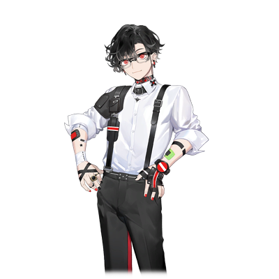
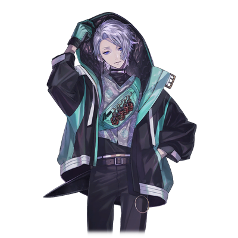
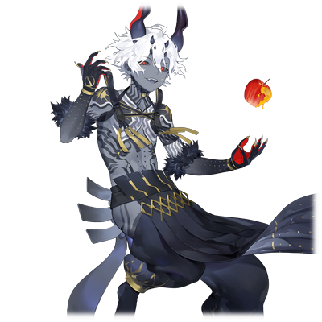
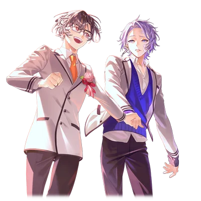

# 御影 昴

| 角色信息   |          |
| ----------- | ----------- |
| 名称    |御影昴|
| 年龄   | 16岁 |
|职业|高中一年级学生/半人半妖|
|对应曲|Charlatan|
|初出|Chunithm Paradise Lost|
|CV|保志总一朗|

## Episode 1 挚友

>对我来说，隼就是我最初结交的朋友——不，应该说是挚友吧？

新宿某栋大楼的一个房间里。

每次回到这里，我的心情总会不由自主地雀跃起来。

无论在外变得多么狼狈不堪，对我们俩而言，这个地方，都比任何城堡都更有价值、更为珍贵。

 

“哼～哼～哼～♪”

 

我哼着最喜欢的小调，推开了房门。

 

“……”

 

——在呢在呢♪

今天他也在床上安静地睡着，发出均匀的呼吸声。

 

“啊，隼，还在睡呀～。该去现场啦～！”

 

他就是向来隼——我最重要的搭档。

从小就有着能听见死者声音的体质，想必吃了不少苦吧。

 

“快醒醒啦。再不出发，天就要亮了！”

“昴，再让我睡会儿……”

 

虽然我也想一直看着他这张睡脸，但是现在可不能再让他睡了。

 

“不行哦，隼。我们待会儿要出门呢，得赶紧准备好才行～”

“你需要的，是我能听见死者声音的能力？还是这把刀的力量？”

 

说着，隼拿起了放在床边的刀剑。

——那是百鬼。

一把吸食妖魔血液的刀，只有隼才能使用。

以前我曾偷偷试过，想看看自己能不能用，结果连刀鞘都拔不开。

后来被他发现了，还被狠狠训斥了一顿，说“万一受伤了怎么办”……

那时候的隼可凶了～。

从那以后，我就再也不敢碰百鬼了。

 

“好啦好啦，是不是因为我打扰你睡觉就闹别扭啦？我需要的才不是什么力量呢，隼的一切对我来说都不可或缺哦♪”

“又在说这种大话了……”

 

我可没说谎，也不是在拍马屁。

明明我说的都是真心话，为什么隼就是看不出来呢？

 

“好啦好啦，快准备吧。我可是说好了要好好‘答谢’你的哦～”

“知道了……”

“那我们今天去哪里转呢～♪”

 

我一边看着手机地图，一边琢磨着。

是去个没去过的地方好呢？还是说去昨天去过的地方？要是约会的话，去同一个地方好像有点不够尽兴呢。

 

“好！就去这里试试看！”

“决定了的话就赶紧出发。要是在现场收集情报太久，天就真的要亮了。”

 

其实我倒是无所谓啦，主要是隼上课总爱打瞌睡～。

虽然有点可惜，但今天或许可以早点结束任务呢。

 

“那个可憎的神明‘阿德拉斯’还在沉睡着吗？”

“嗯。不过，他好像差不多要醒了。得赶紧找妖魔让他吸食力量才行……”

 

沉睡在我体内的，是远古的神明“阿德拉斯”。

有一个非常重要的“理由”，迫使我们必须让他吸食妖魔的力量。

 

“……知道了，抓紧时间吧。”

“嗯。请多指教啦，搭档♪”

 

虽然日期早就过了零点，但新宿的街道依旧灯火通明。

一成不变的风景，和隼一起在这条街上狩猎妖魔。

这就是属于我们的、无可替代的日常。

## Episode 2 孤独

>我之所以对独处毫不在意，不过是因为从来没有想共度时光的人罢了。

我一直都是孤身一人。

每当某种情绪突然涌上心头，我的意识便会陷入沉睡，与此同时，“神” 会苏醒过来取而代之。

而当神陷入沉睡时，我才会醒来。我无比厌恶这样的瞬间。

向来如此。每次醒来，我总会被抛在陌生的地方，眼前躺着陌生的尸体。

没错——每次睁眼，我的双手都沾满了鲜红的血迹。

 

“哈啊啊啊！”

 

隼的斩击利落斩断妖魔的四肢，失去力量的妖魔轰然倒地。

 

“不愧是搭档！剑法还是一如既往的厉害呢！”

“少废话，赶紧吸收掉，不然它就要消散了。”

“知道啦知道啦。”

 

我伸手对准倒地的妖魔，它的身体瞬间崩解，化作一团黑色雾气钻入我的体内。

这样一来，阿德拉斯应该能安稳沉睡一阵子了。

 

“好啦，搞定收工！”

我们狩猎妖魔的原因，其实源于我自身。

阿德拉斯一心想要积蓄力量，彻底铲除当年封印它的阴阳师后裔。

而我，被迫成了它的帮凶。

若是我胆敢违抗它的意愿——

我下意识看向隼，发现他正担忧地注视着我。

 

“怎么了？一副忧心忡忡的样子。”

“没事啦。万一我失控了，隼你会杀了我对吧？”

“哦？那可不一定哦。”

“啊～你又故意逗我！我们可是约定好的，你必须遵守承诺才行！”

“好好好……”

 

他真的必须遵守约定才行。

否则，我一定会伤害到其他人的……。

就像那次一样，再次——

 

* * * 

——数年前——

“又是这样，就没办法对付那东西吗……”

“我也对付不了那样的怪物啊。你也冷静下来好好想想！”

 

父母争吵的声音传入耳中。

即便那时我还年幼，也能听懂他们的话。

父亲口中的 “那东西”，母亲口中的 “怪物”，指的都是我。

 

——好无聊。

 

我独自待在空无一人的房间里，什么也做不了。

不能玩耍，也不能做任何事。

因为一旦我体内的力量失控，就会伤害到别人。

学校、朋友、游戏……我什么都没有。

可是——即便如此，我还是想出去看看，想和大家一起玩。

 

“对不起……”

 

——某天傍晚。

我趁父母不注意，偷偷溜出了家门。街上有许多和我年纪相仿的孩子，背着书包说说笑笑地走着。

我好想加入他们，可是 —— 我没有那样的勇气。

突然，眼前的景象开始天旋地转。

『桀桀桀，这不是正好有猎物送上门了吗！』

又是这个声音……好可怕……。我……不能睡着……绝对不能睡着——

 

“是、是你干的吗……？”

 

等我回过神来，眼前只剩下一只巨大的怪物，和一个哭得满脸鼻涕眼泪的小男孩。

到底发生了什么……。

我只知道一件事。 

——我的双手，被染成了夕阳般刺眼的鲜红色。

 

“我、我…… 哇啊啊啊啊啊！！！”

## Episode 3 恩人

>让我明白了他人的温暖，还有与他人相处的快乐的，正是隼。

啊，我又闯祸了。

又伤害到别人了……。

怎么办才好，都怪我擅自跑出来。

因为我的力量，这个孩子也……。

 

“是你救了我吧，谢谢你。”

 

男孩说出的这句话让我大吃一惊。

为什么，你要向我道谢呢？

 

“哎？你、你是……？”

“我叫向来隼，你叫什么名字？”

 

自报姓名为向来隼的男孩，紧紧回握住了我的手。

这就是我与隼的相遇，也是我们故事的开端。

那时的我，不仅因为被握住手而紧张，更担心自己能不能好好报出名字。

毕竟我已经很久没和别人说过话了，真的能说清楚吗？

 

“御影昴……”

 

呼，没说错吧？应该好好报出名字了吧？

 

“原来你叫昴啊！好！走，咱们一起去买果汁喝！”

 

说着，隼拉起我的胳膊，两人一同奔跑在被暮色染成金黄色的小路上。

我从未这样和别人一起奔跑过。

说不定，我可以和隼成为朋友呢。

——可要是隼知道了我的真面目，会不会也就这样一走了之呢？

我一边这样忐忑地想着……。

 

从那以后，我便常常和隼见面。

我每天都偷偷溜出家门找他玩，不知不觉间，也开始去他家做客了。

当然，我很想和隼待在一起，但同时也因为不想待在那个家。

所以，有时我会在隼家待到很晚。

隼的父母也很疼爱不怎么愿意回家的我——。

 

“你们俩真像一对亲兄弟呢。”

 

说这句话的是隼的妈妈。

我一直记得这句话，因为它让我无比开心。

正因为我感受到了与隼超越朋友的羁绊，那天我才下定决心，不再对他有所隐瞒。

 

“那个，隼。我有件事必须告诉你。”

“嗯？什么事？”

 

我一边喝着隼给我买的果汁，一边向他坦白了我的一切。

说完之后，我还在担心他会害怕我，但隼的反应却出乎我的意料——

 

“抱歉，我也有件事瞒着你。其实，我早就知道你拥有特殊的力量了。”

“哎？什、什么意思？”

“我也有个秘密。我能听到死人的声音。”

 

也是在那时，我才第一次得知。

我的失控是由一位名叫阿德拉斯的神明引起的，而且如果不让他吸食妖魔的力量，他就会失控暴走。

 

“那、那我该怎么办才好……”

“别担心，我会帮你的！”

“……真的可以吗？可是，这很危险的啊？”

“你可是我的救命恩人啊？更何况，我们是朋友不是吗！”

 

——就在那一刻，我终于遇到了可以称之为朋友的人。

 

完成任务后，我们像往常一样分着喝一瓶果汁。

一开始我还在想，给隼选的这个口味会不会有点奇怪，但不知为何，只要看到隼喝得津津有味，我就觉得不管什么口味都很美味。

最后，我还是忍不住向他要了一口。

隼虽然一脸不情愿，但还是把果汁递给了我。

 

“啊！一不小心喝太多了。把我的给你吧，这次就饶了我嘛♪”

“好好好……”

 

从那以后，我和隼就一直并肩作战，狩猎妖魔。

隼也一直在为我寻找解放阿德拉斯的方法。

 

“你干嘛呢，看着别人的脸傻笑。”

“没什么啦♪”

 

现在，隼对我而言已经不只是朋友了。

我觉得我们的关系，绝不是“朋友”这种浅薄的词语就能概括的。

没错，隼他——是我最重要的挚友。

## Episode 4 变调

>那些我坚信不会改变的事，不过是我的一厢情愿罢了。

某天——。

我来到据点，却没看到隼的身影。

他又独自跑到哪里去了吗？

要是这样连一声招呼都不打就走，肯定是在隐瞒什么。

毕竟他的活动范围，我可是了如指掌。

 

新宿——。

这座城市，就是我们的根据地。

正因为如此，要猜到隼的去向，对我来说再简单不过了。

 

“嘻嘻～真巧啊，居然在这里碰到你。在做什么呢？”

 

我向独自漫步的隼搭话，他却露出了一丝不耐烦的表情，说了句“是你啊”。

 

“秘密哦。”

“什么嘛～。你越藏着掖着，我就越好奇啊！”

“话说回来，我从死者那里得到了情报。今天我们去那里看看吧。”

 

隼说着就要快步离开，我急忙追了上去。

 

“啊，等等我！别丢下我啊～！”

 

靠近隼所说的地点时，隐约传来一阵嘈杂的打斗声。

 

“昴，前面好像有人在战斗。在我说可以之前，不许动用阿德拉斯的力量。”

“嗯，我知道了。”

 

说着，隼握住了百鬼。

可惜现在的我，并没有像隼那样的战斗能力。

真到了必须战斗的时候，就只能借助沉睡在我体内的神明之力——阿德拉斯的力量了。

这种事我其实一点也不想做。

但即便如此，让我眼睁睁看着隼战斗而无动于衷，我也做不到。

 

“我去打探情况，你待在这里别动。”

 

隼似乎打算先去摸清状况。

 

“哇啊啊啊！”

 

传来一个男人的惨叫声。

听声音很年轻，难道是他一个人在战斗吗？

 

“看你们似乎在忙着啊，我也来帮忙！”

 

话音未落，隼就冲了出去。

 

“你是什么人！？”

“至少不是你们的敌人。现在就让我们通力合作把看着像敌人的家伙全砍了如何？”

“哦，说，说的也是啊！”

“北斗，你可不要因为多了个人就放松警惕啊！”

“我知道啦，玄武大人！”

 

我躲在暗处观察战况，只见隼一马当先，挥舞着百鬼砍向敌人。名叫北斗的男人紧随其后，跟着打倒了不少妖魔。

一个人？不对，好像是三个人？一个男人正带着两个孩子，手持着刀战斗着。

 

“切，搞什么嘛。这种程度的配合，我也能做到啊。”

 

妖魔的反击擦过了隼的脸颊。

 

“隼！？这只妖魔，竟然敢伤到隼！！”

 

一瞬间，我冲了出去，引出阿德拉斯的力量，一拳将妖魔打飞。

 

“你、你干什么！？”

“谁让你总想着一个人硬撑。我们不是说好，战斗的时候要两个人一起上的吗？”

“昴！？”

 

果然，我还是无法袖手旁观。

不管是谁，敢伤害我的搭档，我都要把他狠狠揍扁！

 

“那家伙是你的同伴啊。既然这样，就请他来帮个忙吧！”

 

北斗朝着倒地的妖魔挥剑砍去。

 

“别乱来啊，昴！”

“知道啦知道啦，我心里有数！”

 

几分钟后——。

妖魔庞大的身躯缓缓倒在了地上。

 

“终于结束了吗。昴，你没事吧——”

 

隼向我搭话，但现在我顾不上回应，必须尽快吸收妖魔的力量……。

或许是刚才太急于动用阿德拉斯的力量，用得有点过量了。

一阵强烈的睡意袭来。

现在把妖魔的力量吸收掉，阿德拉斯应该就不会出来了。

 

“喂，你在干什么？”

“……少废话，安静看着就好。”

 

我对着妖魔伸出手，一团黑色的雾气随即出现，被我的身体缓缓吸了进去。

这样你该满足了吧，阿德拉斯。

 

“这是怎么回事？”

“他在吸收妖魔的力量哦。”

“呜……”

“昴！？”

 

眼前一阵眩晕，我差点摔倒，还好隼温柔地抱住了我。

 

“哈哈哈，好像有点用力过猛了……搭档，接下来就交给你啦……”

 

说完，我闭上了眼睛。

真的太困了，而且使用力量后浑身疲惫，稍微撒个娇应该没关系吧。

另外，这也算是对他之前故意瞒着我“秘密”的小小报复。

 

“那家伙没事吧？”

“只是睡着而已，没什么大碍。我要带他回去休息，我们就先走了。”

“啊啊，今天真是多亏了你们，欠你们一个人情了。”

“我们也是为了自己的目的才战斗的，并没打算让你们欠什么人情。”

“别在意，就当成是我的个人想法吧。要是以后遇到什么麻烦尽管找我们，我们平时基本都在中野一带活动。”

 

听着他们的对话，隼背起我准备离开。

啊，真的越来越困了……。

 

“你们俩真是对有意思的组合呢。……用‘吴越同舟’来形容也不为过。”

“这话是什么意思？”

“你该不会是想拯救那家伙吧？”

 

好像听到隼在和谁说话……。

吴越同舟……拯救……？

总觉得他们在说什么很重要的事……。

不行了，太困了，意识开始……模糊了。

## Episode 5 真相 

>想知道的事总是一头雾水，可不想知道的事却偏偏一眼看穿，为什么会这样呢？

自那以后，又过了好几天。

最近总觉得，突然失去意识的次数比以前多了不少。今天也一样，我婉拒了隼特意邀请我的约会，独自蜷缩在据点里。

 

等我回过神来，发现自己身处一片漆黑的空间中——。

放眼望去，四面八方全是无尽的黑暗。

这里到底是什么地方？

 

“桀桀桀！怎么，居然醒过来了吗？”

空无一物的空间里，一个与我身高相仿、长着犄角的白发少年出现在我眼前。

他的声音粗野刺耳，根本不像是人类能发出的。

 

“……难道你就是阿德拉斯！？为什么……”

如果真是他，那这里应该就是我的意识深处了。

可之前阿德拉斯从未在我的意识里现身过，他这次为什么会出现在这里？

 

“没错，正如你所想。要进入你的意识，对我来说也并非易事。”

“什！？你怎么会知道我在想什么……”

“哎呀呀，时间到了。也罢，这次就先把身体还给你吧！”

“还给我？这本来就是我的——”

 

下一秒，熟悉的天花板映入眼帘。

我站起身，环顾四周。

 

“这里是我们的据点，对吧？难道我只是睡着了而已……”

 

我本以为只是做了个噩梦，却突然察觉到身体的异样。

我的手上沾满了泥土——不仅是手，仔细一看，衣服上也到处都是泥污。

 

“难道说，阿德拉斯他……”

 

不可能的。

虽然我确实动用了一点力量，但以前也有过类似情况，从来都没出过问题。

 

“我能保持自我意识的时间，正在不断缩短吗？难道是因为给了他太多力量……”

 

这么一想，阿德拉斯之前那副胸有成竹的模样就说得通了。

“这次就先把身体还给你”。

难道说，我的身体已经快要被阿德拉斯……。

 

“隼……”

 

这个名字不由自主地从嘴里脱口而出。

可此刻，没有人能回应我。

虽然我不想承认，但这次他不在，或许反而是件好事。

要是让他看到我这副模样，肯定又要为我瞎担心了。

而且百鬼还好好地放在原地，看来他应该不是去做什么危险的事了。

 

“先把这身脏衣服处理掉再说……”

 

我走向洗手间，洗掉手上的泥土，又洗了把脸。

稍微清爽了一些后，我突然想起之前那个孩子说过的话。

 

“好像是叫‘吴越同舟’对吧。”

 

那句话是冲我们说的。

再也没有比这更不适合我们的词了。

 

“他们也太过分了吧～。我和隼可是搭档，关系好得不得了，根本不是什么敌人！”

 

当然，我们也有过生气、争执甚至吵架的时候。

但每次都能很快和好如初。

所以，我从来没有过一丝一毫憎恨隼、把他当成敌人的想法。

 

“不过，要是隼和阿德拉斯的话——”

 

这只是我随口说出的一句话，可一个可怕的猜想却在我脑海中逐渐成型。

如果玄武那句话是针对隼和阿德拉斯的，那阿德拉斯憎恨并视为敌人的对象。

——就只有一个人。

 

“隼他……是阴阳师……？”

 

现在回想起来，隼手中的百鬼，为什么只有他才能使用？

还有，他能听到死者的声音，能看见妖魔。

如果这些都是阴阳师的能力的话……。

 

“不可能吧……”

 

怎么会呢，隼不可能是阴阳师的。

我喃喃自语，试图说服自己——可身体却在不知不觉中因恐惧而颤抖。

 

“既然如此……试试看就知道了……”

 

那把斩杀妖魔的刀——百鬼。

……既然它能斩杀妖魔。

我缓缓伸出手，朝百鬼探去。

## Episode 6 诀别 

>多想……一直一直……和你在一起啊……

——我曾以为这样的日子会永远持续下去。

回到据点，叫醒熟睡的隼，然后一同出门。

两人在夜晚的街道上漫步，偶尔也会去挑战一些惊险的事……。

肩并肩分享着一瓶果汁，笑着讨论今天的口味真合心意……。

这些对我而言，都是无可替代的日常。

所以，我绝不允许任何人破坏它。

哪怕那个人是——。

 

“以前我用不了它，但现在的我，说不定可以。”

 

隼从小就比我强大。

所以，他得到百鬼时，肯定也能轻松驾驭吧。

而我，比起以前也变强了不少，至少能自如引出阿德拉斯的力量了。

我伸出手，想要拿起百鬼。

就在那一瞬间——手掌传来一阵仿佛被灼烧般的剧烈疼痛。

 

“呜！？刚、刚才那是……？”

 

我低头一看，手上已经留下了淡淡的烧伤痕迹。

 

“哈哈，原来如此……看到这一幕，我也不得不承认了啊。”

百鬼绝非一把只能斩杀妖魔的刀。

它连神明都能斩断。

如果说有谁能使用这样的武器，那一定是拥有足以封印神明之力的人。

阴阳师——隼就是他们的后裔。

要是阿德拉斯察觉到这一点，说不定在我不知情的时候，就会对隼下手……。

我绝对不能让这种事发生。

 

“只有趁阿德拉斯还在沉睡的时候，才是唯一的机会。”

 

……我要去一个遥远的地方，远到隼再也找不到我的地方。

必须在隼回来之前出发。

因为我太了解他了，要是让他知道真相，他一定会说“我来帮你”之类的话追上来的。

隼表面上看起来很酷，其实内心特别温柔……。

所以，这种时候，必须由我来主动做出选择。

 

“至少得留下一封告别信啊……”

 

我想写下一句——一句诀别的话语。

……可仅仅是这一句话，却耗费了我许久的时间。

眼泪一次次打湿信纸，我只能反复重写。

我不想让隼为我担心，

所以不能留下这样字迹模糊的便签。

 

“终于……写好了……”

 

好痛——胸口像是被紧紧揪住，痛得发不出声音。

眼泪夺眶而出，呜咽声忍不住从喉咙里溢出。

不行啊，好不容易才写好，要是被泪水打湿，就全白费了。

我小心翼翼地把便签放在桌子上，再次环顾这个曾是我们据点的地方。

这里以前总觉得有些狭小，但或许是因为有隼陪伴在身边，才让我觉得无比温暖。

而现在，它却显得空荡荡的，显得异常宽敞。

 

我再也不会回到这里了。

我沉默地踏出据点的大门。

没有什么想说的话，也没有什么能说的话。

因为我所有的心意，都已经写在那封便签里了……。

## Episode 7 憎恶

>日积月累的憎恨如同诅咒一般，不断侵蚀着我的身体。

——我醒了过来。

眼前铺展开的是一片湛蓝的天空。

我急忙忍着身体的疼痛，从长椅上坐起身。

 

“果然，又被阿德拉斯掌控了身体……”

 

昨天明明应该住在酒店里，醒来却出现在这种地方，肯定是他搞的鬼。

离开据点大概已经十天了吧。

从那以后，我和阿德拉斯的意识已经交替了好几次。

不知道是因为百鬼就在附近，还是因为身为阴阳师的隼离我不远，意识交替的频率越来越高了。

就好像原本各自独立存在的两个人格，正在逐渐融合为一体……。

 

“真是的，一大早心情就糟透了……”

 

这种在陌生地方醒来的日子，我差不多也该习惯了，哈——

 

“好险好险，差点就叫出他的名字了。”

 

从那天起，我就再也没说过“他”的名字。

因为我害怕，一旦叫出口，他真的会出现在我面前。

 

“今天就来挑战一下，看看能走到多远吧。要是能吃到好吃的就太好啦～♪”

 

我必须勉强自己打起精神来。

我已经取出了所有的积蓄，今天就奢侈一把，找个好地方……

就在我从长椅上站起身的瞬间，眼前的景色突然晃动起来。

 

“难道是在这种地方睡觉的缘故吗……”

 

而且喉咙也干得厉害。

正好旁边有台自动售货机，买点什么喝吧。

我正盯着售货机挑选商品，它却突然晃动了一下，我的手传来一阵刺痛。

 

“喂，你别砸售货机啊！没钱买吗？”

“……哎？”

 

我看着疼痛的手，发现我的拳头竟然把售货机砸出了一个凹陷。

 

“这……是我干的吗……？”

 

我是想破坏什么东西吗……

不可能的，我怎么会想破坏东西……

我不想破坏，我不能破坏——

 

“喂、喂，你没事吧？”

 

我憎恨人类吗？我憎恨阴阳师吗？

我才没有——憎恨任何人——

 

“不行，我必须……逃得更远……”

 

为什么？……到底为什么？我为什么要逃得更远？

是因为不想杀了他吗？

为什么我会想要杀他？明明我并不憎恨他啊？

不，我应该憎恨他的，我本该憎恨他的。

不对，他可是我最重要的朋友啊。

曾经是——世界上最……重要的朋友。

 

可为什么，我会感到憎恨？

 

因为他是——阴阳师啊。

 

他是阴阳师——我憎恨他——

 

憎恨憎恨憎恨憎恨憎恨憎恨憎恨憎恨憎恨憎恨憎恨憎恨
憎恨憎恨憎恨憎恨憎恨憎恨憎恨憎恨憎恨憎恨憎恨憎恨
憎恨憎恨憎恨憎恨憎恨憎恨憎恨憎恨憎恨憎恨憎恨憎恨
憎恨憎恨憎恨憎恨憎恨憎恨憎恨憎恨憎恨憎恨憎恨憎恨

 

“不对！我才没有——！”

 

等我猛然回过神来，一切都已经太迟了。

眼前陷入一片黑暗，内心被无尽的憎恨彻底填满。

 

“哈哈哈！我等这一天等了多久啊！”

 

我（阿德拉斯）的声音从体外传来——

发生了什么，我瞬间就明白了。

我的身体，已经彻底属于阿德拉斯了。

 

“好了，该去实现我的夙愿了。去那个小子身边吧，他还在等你回去呢！”

 

不要，快住手！

我想放声呐喊，可所有的声音都被黑暗吞噬了。

我的声音，再也传不到任何人的耳朵里了。

拜托了……不要接近我了……

## Episode 8 归还 

>我根本没打算回来。明明都已经决定，再也不见面了！

我在黑暗中拼命挣扎。

伸出手却什么也抓不住，放声呐喊也得不到任何回应。

 

“桀桀桀……很怀念对吧！没想到自己还能回到这里对吧！昴！”

 

听到这句话，我瞬间明白了。

阿德拉斯现在，已经回到了那个据点。

 

“哼～哼～哼～♪”

 

阿德拉斯开心地哼着小调。

那是我平时常哼的歌。

此刻的我，只能默默祈祷。

求求你，不要回来啊。

 

“别白费力气了，那小子已经回来了。”

 

——不要靠近我（阿德拉斯）！

 

“啊，我想到一个好主意。作为对你把我关在身体里这么久的‘奖赏’，我可得好好‘报答’你。”

 

被黑暗笼罩的世界突然变得清晰起来。眼前出现的，是我无比思念的人——隼的身影。

 

——隼！

 

“桀桀桀！这景色不错吧？我得让你在‘特等席’上，好好看着那家伙死去的样子！”

 

隼满脸担忧地朝我走来。

不要过来，别靠近我！

我拼命在心里哀求，可他根本听不到。

 

“你……真的是昴吗——”

 

下一秒，我的拳头突然朝着隼的脸挥了过去，打断了他的呼唤。

 

“什——！？”

 

隼虽然被阿德拉斯的攻击逼得摔了个屁股墩，却还是勉强躲开了。

我刚松了口气，阿德拉斯挥出的拳头就砸在了墙上，墙壁瞬间碎裂，裂缝一直延伸到地板。

这样强大的力量，我以前根本无法掌控。

看来这具身体，真的不再属于我了……

 

“桀桀桀，你这小子运气不错嘛。”

“难、难道是……阿德拉斯！？”

 

没错，现在掌控身体的是阿德拉斯。

所以——快战斗啊，隼！

 

“要逃跑吗？桀桀……哈哈哈哈！好啊，再让我多乐呵乐呵！”

 

阿德拉斯狂妄的笑声在据点里回荡。

这里曾是我们无比珍视的地方，如今却被我（阿德拉斯）的双手一点点摧毁……。

 

“可恶！”

 

面对挥下的拳头，我却再也无法控制这具身体。

我只有一个愿望。

希望隼能阻止我。

 

“怎么了？你腰上的刀只是摆设吗？既然如此，就让我好好折磨你这千年的仇敌吧！”

“你早就知道了吗……知道我是阴阳师？”

“当然，是你的好伙伴告诉我的啊！”

“好伙伴……？……你把昴怎么了！”

“桀桀桀，现在才反应过来？你这小子真是后知后觉啊？”

“……！把昴还给我！！”

 

隼的眼中没有丝毫绝望，他只是直视着我，眼神里满是直面困境的坚定。

竟然关心到了这个地步……

我既为隼的温柔感到欣慰，又担心这份温柔会束缚住他的手脚。

够了！我不想看到隼受伤的样子！

趁着隼低头思索的瞬间，阿德拉斯抓住破绽，挥出的拳头击穿了地板。

隼被崩塌的落脚点裹挟，身体失去了平衡。

 

“糟了——！？”

“哇哈哈哈！先吃我一拳！”

 

隼仓促间挡住了阿德拉斯的拳头，我甚至能听到“咔嚓”的脆响。

可我却没有任何触感，明明是我的身体在战斗，我却什么也感觉不到。

 

“哈哈哈！太爽了，简直太爽了！折磨你这小子的快感，还有你绝望的样子！真想永远这样享受下去啊！”

 

为什么——为什么隼还不反击啊。

 

阿德拉斯追着隼，从大楼上跳了下去。

下方不仅有隼，还围了一群无辜的路人。

 

“我还没折磨够你呢——！”

“快躲开！！”

 

隼强行推开围观的人群，迫使他们远离危险区域。

阿德拉斯抬起脚朝隼踹去，隼在千钧一发之际躲开，脚掌狠狠砸在地面，将地面震碎。

 

“喂喂，别躲啊！”

“什、什……！？”

 

周围的人似乎还没反应过来发生了什么，全都僵在原地。

 

“快跑啊，会被杀的！！”

 

听到隼的呼喊，人们终于尖叫着四散奔逃。

隼，你别管别人了，先顾好你自己啊！

快逃啊，隼！

 

“桀桀桀，你还真是个烂好人！既然如此，不如先从他们开始收拾怎么样？”

 

隼伸手握住了百鬼。

对，就是这样！终于，你要对我——

 

“昴……”

 

可他却迟迟没有拔出百鬼。

为什么……我们不是约定好了吗！

别犹豫了，用百鬼砍我啊！

 

“胆小鬼，你就连战斗的勇气都没有吗！”

 

阿德拉斯抓住隼停滞的瞬间，一拳再次狠狠砸进了他的身体。

 

“哇啊——！？”

 

这一次的声响与之前截然不同。

伴随着仿佛全身骨骼碎裂的声音，隼被径直击飞，撞在建筑物的墙壁上，忍不住呕吐起来。

 

“哈哈哈，瞧你这傻样，都吐满全身了啊，小鬼！”
 

阿德拉斯的笑声在我脑海中回荡。

我流不出眼泪，声音也传不到隼的耳中。

但我清楚地知道，是我的拳头、我的脚，伤害了隼。

“我可还没玩够呢！可别那么快就死掉啊！”

 

……我绝不允许。

 

“——昴”

 

……我绝对不允许！

 

『你在说不允许谁？就凭现在的你，能做什么——』

 

啊，我以前真是个一无是处的家伙。

如果不借助你的力量，我甚至无法和隼并肩战斗。

我曾以为，只要能和隼在一起，借用你的力量也无所谓。

可我错了！

我根本不需要你的力量！

这具身体是我的！

和隼一起战斗、受伤、哭泣、欢笑！

这具身体，还有这些回忆！全都是我的！

所以——

 

“我怎么可能把身体交给你这种家伙！！”

“什——！？”

 

我的视线、听觉、触觉瞬间变得清晰。

眼前是伤痕累累、摇摇欲坠的隼。

我终于夺回了身体的控制权，可我知道，这状态维持不了多久。

我必须快点告诉他……。

 

“隼……”

## Episode 9 活路 

>此刻我别无选择，唯有拼尽全力，守护我最重要的人！

我已经记不清我们第一次定下约定是在什么时候了。

依稀记得，是隼第一次见到被阿德拉斯掌控身体的我时。

 

“那就是阿德拉斯吧，隼。你果然还是害怕了，对不对？”

“哈哈，我一点都不怕。毕竟，他长着和你一模一样的脸啊。”

 

他笑着这样回答我。

 

“我好害怕。我怕有一天，我会彻底变成阿德拉斯。要是那样伤害到你了怎么办……”

“我才不在乎这些呢……这样吧，要是你真的完全变成了阿德拉斯，我就亲手把你打醒，阻止你。”

“真的吗？”

“当然，这是我们的约定！”

 

或许隼已经不记得了，但那一天的约定，对我而言——。

 

“昴——”

 

我握住隼的手，将百鬼塞进他的掌心。

我的右手在触碰百鬼的瞬间，就被严重的烧伤覆盖。

灼热、剧痛——。

可隼承受的痛苦，比这要深重得多。

这点伤痛根本不算什么。

而且，要是我露出痛苦的神情，隼就无法下定决心了。

 

“……要遵守约定哦。”

 

隼的表情瞬间变得快要哭出来一般。

别露出这样的表情啊，我认识的隼，一直都是那样坚定。

 

“让我看看，最帅气的隼吧。”

“……好。”

 

此刻，隼的眼中已经没有丝毫犹豫。

 

『给我适可而止啊啊啊！』

 

阿德拉斯的咆哮声在脑海中炸开。

我下意识地猛地向后一跃，与隼拉开距离。

这是我能做的最后抵抗。

很快，我的四肢就开始失去知觉，连声音都发不出来了。

但还好，我赶上了。

我想对隼说的话，终于传达给他了。

我能做的一切，都已经做到了。

 

“你这小子，竟敢多管闲事——！啊，可恶！我的右手怎么会变成这样——！”

 

你还有心思在意这种事吗？

我的搭档，已经准备好拔出斩杀你的利刃了。

 

“你这小子，你——！？”

 

隼的目光径直锁定在我（阿德拉斯）身上。

他的手中，紧紧握着那把百鬼。

 

——对，就是这样。

这才是我想看到的，最帅气的隼啊！

## Episode 10 搭档 

>有些东西，无论过去多少年、数百年，都永远不会改变。我在这世上唯一的搭档——就只有隼一个人!

搭档——

我一直这样称呼隼。

但在此之前，我并非他真正的搭档。

以往战斗时依靠的，从来都不是我自己的力量，而是阿德拉斯的力量。

所以，这场战斗，对我们而言，才是第一次，也是最后一次的并肩作战！

 

“你这小子啊啊啊啊！！！”

 

阿德拉斯鼓足气势，发出一声怒吼，倾尽全身力气挥拳向隼袭来。

 

“你的左手，由我来斩断！”

 

下一秒，电光火石之间，隼已然冲入了阿德拉斯的怀中。

 

“什——！？”

 

我能清晰感受到阿德拉斯的震惊与恐惧。

那个一直被他肆意戏耍的对手，此刻终于露出了獠牙，要向他的咽喉发起致命一击。

这正是他过去强加给世人的痛苦。

如今，轮到他亲身体验了。

阿德拉斯仓促间想要抬起左手防御——

一闪。

挥出的百鬼利刃，径直划破了他的双眼。

 

“呜啊啊啊啊！？眼睛，我的眼睛啊啊啊！饶不了你！我饶不了你啊！我一定要杀了你啊啊啊！！”

 

在此之前，我看到的世界，都是阿德拉斯眼中的景象。

双眼被废的此刻，我的眼前只剩下无边的黑暗。

但战斗，还远未结束。

 

“不过是无用功！只要能感知到你的气息，你的位置对我来说就一目了然！！”

 

我能听到阿德拉斯疯狂挣扎的声响。

他似乎已经锁定了隼的位置，但拳头始终未能命中目标。

隼早已满身伤痕。

想必已经没有多少挥舞百鬼的力气了。

稍有不慎，这或许就是他最后的一击。

那么，隼一定在寻找给予阿德拉斯致命一击的最佳时机吧。

我懂的，就算看不见，我也懂。

因为我们是一直相伴同行的“搭档”啊！

 

“去死吧啊啊啊！！”

 

我能“感觉”到他高高举起了右手。

呵，你还真是个愚蠢的神明。

难道忘了吗？你的这只手，早已被百鬼净化过了！

我集中全部意识在右手上，阻止了它的动作。

 

“什！？”

 

虽然只有短暂的一瞬间，连一秒都不到，但我终究还是拦住了阿德拉斯的拳头。

这已是我如今所能做到的极限，但这一瞬间，对隼而言，便是最好的机会。

下一秒，一阵灼烧般的剧痛猛地袭来，穿透了我的胸膛。

 

“——啊？”

 

百鬼，贯穿了我的身体。

不愧是隼，时机把握得恰到好处。

撕裂般的剧痛席卷全身。

此刻感官正在逐渐复苏，想必是因为阿德拉斯的灵魂正在燃烧，我的身体终于重新属于我自己了。

不过……确实挺疼的呢……。

全身的疼痛感在缓缓消散。

但胸膛被贯穿的剧痛，却丝毫没有减退的迹象。

意识也在渐渐模糊……。

原来，我要死了啊……。

 

“都结束了，一切都结束了……”

 

在逐渐远去的意识中，我听到了隼的声音。

 

“隼……”

 

我希望隼能记得。

记得我的模样。

不是哭泣的、痛苦的模样，而是我最灿烂的笑容。

 

“昴，昴……！”

 

有冰凉的液体滑过我的脸颊。

真没想到，隼竟然是个爱哭鬼。

看不到他哭的样子，还真有点可惜呢。

尤其是因为我而哭，就更可惜了。

 

“喂，隼……。我们，永远都是挚友（搭档）对吧……”

“嗯……嗯，那是当然！我们永远都是——”

 

你是我生命中第一个，也是最后一个挚友。

谢谢你，遵守了和我的约定——

## Episode 11 旅途 

>走吧——搭档。

妖魔——。

人们有时也称之为妖怪，或是恶魔。

它并非任何人都能看见。

只有灵感敏锐且拥有特殊力量的人，才能目睹这异形怪物的真容。

 

“别、别过来！不要靠近我——！”

 

被妖魔逼到绝境的少年，因恐惧而发出惨叫。

就在妖魔挥下的利爪即将撕碎少年的瞬间——

 

“哼～哼～哼～♪”

 

一阵轻快的哼唱声，突然不知从何处传来。

 

“消失吧——”

 

一道赤色的闪光划破夜空，将妖魔劈成两半。

被斩碎的妖魔在原地崩解，化作飞散的尘埃。

 

“请、请问……”

“这可不行哦，小孩子独自待在这种地方，会被坏怪物吃掉的～”

“对、对不起……”

“别放在心上，斩杀妖魔本就是我的工作。”

“快，赶紧回到妈妈身边去吧。”

“嗯！”

 

少年从巷子里飞奔而出。

 

“啊，对了！谢谢你们救了我！叔叔，哥哥！”

 

——猎魔者。

那是一群一边在各地游历，一边斩杀妖魔的人。

传闻他们携带的刀，会吸食妖魔的血液而染上猩红，如赤色闪电般斩尽魑魅魍魉。

有人说猎魔者是一位年迈的男性，也有人说，是一对伴随着哼唱声出现的年轻男子与少年搭档。

 

“好了，前往下一个战场吧——搭档。”

