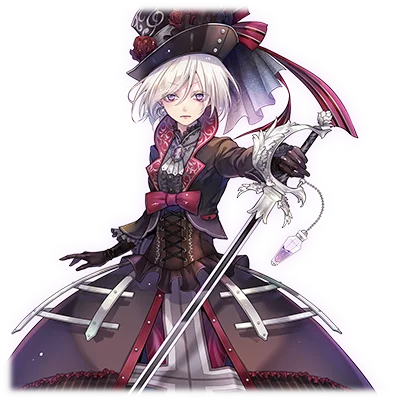
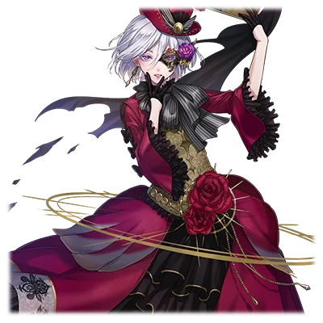

# 特尔敏特·薇尔吉

| 角色信息   |  |
| ----------- | ----------- |
名称|特尔敏特·薇尔吉
年龄|14岁
职业|贵族（子爵）、吸血鬼猎人
特技|治疗、剑术
| 对应曲   |EXECUTOR
| 对应版本 | Chunithm STAR

## Episode 1 薇尔吉家的当主

>薇尔吉家是历史悠久的一族。他们生为吸血鬼猎人，身负着将那些黑暗中的存在消灭的使命。

薇尔吉家是从古时候便在维加地区管理此处的贵族。历代的当主都是悬壶济世之人，他们不分贫富贵贱，拯救那来此寻求救赎之人，所以，薇尔吉家也时常涌现出许多深受领民爱戴，甚至名留青史的家主。

但是，薇尔吉家却还有另一层身份。那便是奉教皇之命，狩猎黑暗世界的居民——“吸血鬼”的，身负荣耀使命的猎人。

## Episode 2 可疑的边境伯爵

>那是某处地区的边境伯爵。听人说他似乎有已经转化成吸血鬼的嫌疑。为了完成使命，我立刻前往了那里。

“特尔敏特小姐。这是教皇陛下的亲笔书信。”

 

寄来的书信上印着法皇亲手盖印的特殊印章，那正是让我前去讨伐吸血鬼的命令书。

 

“据说鲁贝里埃地区的边境伯，已经转化为吸血鬼了。”

“什么！……可是，说起鲁贝里埃边境伯，他可是以贤明著称的领主。怎么会发生这样的事……”

“…… 总之，我先去调查一下吧。”

 

抵达鲁贝里埃地区的特尔敏特，为了搜集关于边境伯的传闻，乔装成旅行者在城镇中漫步。

 

（看起来边境伯确实深受爱戴的样子……但是最近他的身边似乎也流传着不少风言风语。）

 

虽也有人打趣说 “他刚娶了年轻的后妻，不过是乐昏了头而已”。

 

（……还是直接去问问他本人吧。）

面对特尔敏特的突然来访，边境伯仍旧不慌不忙，以最高的诚意欢迎了她。

 

“哦哦，欢迎你的到来，薇尔吉子爵……”

 

（面对比自己地位还低的子爵……甚至还是身为年轻女子爵的我，还能如此热烈的欢迎吗……那么……）

特尔敏特决定开门见山。她向伯爵告知了自己从教皇陛下那里接到的命令，还有他已经被怀疑为吸血鬼的事情。

听到这番话后，边境伯的变化显而易见。他脸色发青，身体不停颤抖。

 

“边境伯。如果您察觉到什么异常，还请告知我。”

“……抱歉，子爵。能否给我一点时间？明天我会举办宴会欢迎你。到那时，我会把一切都告诉你。”

 

特尔敏特相信了边境伯的话，暂时先行告辞。

## Episode 3 吸血鬼之宴

>真正的吸血鬼，是边境伯的新妻子。边境伯直到最后一刻还在保护着她，却仍旧被她杀死。我将那丑陋的吸血鬼消灭了。

特尔敏特与管家罗伦斯一同前往了边境伯的城堡。罗伦斯是从特尔敏特的父亲一代便服侍于薇尔吉家的管家。自从前代家主逝去之后，辅佐特尔敏特的他，实际上已经成为了她的监护人。

 

“……罗伦斯，你就送到这里吧。接下来交给我。”

“小姐，还请您多加小心啊……”

 

走进预定举办晚宴的大厅，这里虽已备好盛大的宴席……地面上却散落着全身血液被吸干的参会者遗体。

 

“怎么会……竟然连边境伯也……！”

 

正当特尔敏特检查尸体时，一道优美的声音从楼上传来：

 

“欢迎你，子爵小姐。欢迎来到我的宴会。”

 

身着华丽礼服、迈着优雅步伐走下楼梯的，正是边境伯的新妻子西特里。

特尔敏特瞥见西特里的嘴唇染着一抹不同于口红的猩红，立刻握紧了剑柄。

 

“西特里夫人……你才是吸血鬼，对吧。为什么连自己的丈夫边境伯都要杀害？”

“因为他已经没有利用价值了呀…… 那个男人，好像隐约察觉到了我的真面目，到死都在劝说我改邪归正。真是愚蠢！”

 

话音刚落，无数饥肠辘辘的蝙蝠骤然向希特里聚拢，下一秒，她便变身成了一头巨大的狼。

獠牙毕露的狼以非同寻常的速度扑向了特尔敏特！

但特尔敏特镇定自若，手持银剑，精准避开狼的每一次攻击。

当不耐烦的西特里张开血盆大口猛冲过来的瞬间，特尔敏特借力打力，长剑从她敞开的嘴部刺入，将其身体劈成两半。

西特里发出一声惨叫，化作灰烬消散无踪。

特尔敏特摘下大厅中摆放的百合花，轻轻放在边境伯的遗体旁。

 

“再见了，边境伯。你的爱纵然愚蠢，却如这百合一般纯洁美丽……”

## Episode 4 枢机卿的待命命令

>收到了新的吸血鬼的情报。然而只因为对方是枢机卿，我就被要求先按兵不动。……话是这么说，但我不能眼睁睁看着悲剧发生。

特尔敏特为了汇报鲁贝里埃边境伯的事件，前往了王都。在那里，她听到了一则令人无法忽视的传闻。

（据说，韦尔索的大商人比弗隆斯可能是吸血鬼……）

特尔敏特本想将此事禀报教皇，便向常任联络人——埃利戈斯枢机卿提出了调查的请求，希望调查比弗隆斯。

然而，枢机卿的回复却出乎她的意料。

 

“不必了，薇尔吉子爵。”

“为什么？……关于吸血鬼的调查是必须慎之又慎的事情，正因如此，才需要进行周密的调查，不是吗？”

“我认为没有必要再去调查比弗隆斯……你就别再继续追究此事了。这是作为律法的守护者、身为教皇陛下的代理人的我亲自做出的判断……还有什么异议吗？”

“不……在下不敢。”

 

特尔敏特虽如此回应，心中却无法信服。本来，她就时常对埃利戈斯枢机卿的想法抱有疑问。而面对近来持续增多的吸血鬼受害事件，枢机卿如此谨慎的决策显得十分不合常理。

（尤其是埃利戈斯枢机卿的眼睛……）

这位作为现任教皇心腹的枢机卿，拥有一副宛如被能工巧匠精心打造过的美貌。那双玻璃珠似的眼眸，总让特尔敏特的内心莫名躁动不安。

（放任吸血鬼不管，必将酿成大祸。可现在连调查都不允许……这样下去，被吸血鬼夺走性命的人或许会越来越多。说不定还会有人因此陷入悲痛之中，就像曾经的我一样……）

特尔敏特下定决心，要独自展开对比弗隆斯的调查。

## Episode 5 美女云集之洋馆

>以仆人身份潜入可疑商人宅邸的我，竟发现那里有众多少女在此工作。

 

特尔敏特决定无视枢机卿的命令，开始对韦尔索地区的大商人比弗隆斯进行调查。

 

“小姐……这样真的没问题吗？您这是在违抗埃利戈斯枢机卿的命令啊。”

“罗伦斯……你说的确实有道理。违抗枢机卿的命令，或许会让我的处境变得危险。但即便如此，面对那些可能发生的悲剧，我也不能坐视不管。”

“小姐……我明白了。请您务必保重。”

 

特尔敏特以仆人的身份成功潜入了比弗隆斯的宅邸。她发现，除她之外，宅邸中还有好几名年轻少女在工作。

（真令人惊讶……在这里工作的少女不说倾国倾城，至少也都是美若天仙……）

这些被聚集到宅邸的少女，各有特色，聚在一起就宛如散发着不同光彩的宝石。

特尔敏特决定直接向少女们打探比弗隆斯的情况。

 

“老爷？他是个好人哦……我们全都是孤儿，但他却收养了我们，让我们无忧无虑地生活，还让我们加入了他的剧团呢。”

“剧团？你们不是仆人吗？”

“我们是会帮着做些宅邸里的杂活啦。但我们的本职是学习成为歌手或演员。前不久，我的朋友就被大型剧团选中，从宅邸‘毕业’了……不过之后就再也没有了联系，有些让人担心就是了。”

“……除此以外，还有什么让你们在意的事吗？”

“对呢……老爷有提过一间‘绝对不能靠近那里’的地下室。要说有什么在意的地方，大概就是那里了吧？”

“谢谢你，这很有参考价值。”

## Episode 6 大战比弗隆斯

>果然，大商人也是吸血鬼。他吸收那些美丽的少女们的血液，并且将她们的尸体做成人偶。我一把火将这个穷凶极恶的家伙烧成了灰烬。

待到深夜时分，特尔敏特轻手轻脚地潜入了屋主严令禁止进入的地下室。

在昏暗的地下室中，特尔敏特面对看到的景象，不禁发出了惊叹。

 

“这些……是那些在屋子里工作的女孩子们的尸体吗……竟然都被做成了人偶，这是何等的骇人……”

 

那些女孩子们的脖颈处，都整齐地印着两颗红红的引子。

 

“这是吸血鬼吸血的痕迹……那么，比弗隆斯果然也是吸血鬼吗。”

“……傻孩子，竟然会跑到这种地方。”

“是你！比弗隆斯！”

 

吸血鬼不声不响地出现，绕到了特尔敏特背后。

比弗隆斯舔了舔嘴唇，眼中闪烁着暗红色的昏光。

 

“这么在我的屋子里到处打探，小姑娘，你是在找什么东西呢？……恰好，我也在找某样东西……就是像你这样美丽的躯体！……来吧，成为我的收藏品吧！”

“休想！”

 

特尔敏特拔出藏在身上的银剑。

看到在黑暗中闪耀的剑刃，比弗隆斯瞬间摆出戒备姿态：

 

“你这家伙，是吸血鬼猎人吗！既然如此！”

 

比弗隆斯从手中凝聚出裹着火花的高温火球，下一刻，数颗火球便同时朝特尔敏特袭来。

尽管在能自由操控火焰的吸血鬼攻击下陷入苦战，特尔敏特还是奋力挥剑，成功在比弗隆斯身上划下一道伤口。

从伤口喷涌而出的鲜血溅落在特尔敏特身上，当这污秽的吸血鬼之血染红她脸颊的瞬间——

（怎、怎么回事？这股力量是！？）

特尔敏特感觉到体内有股力量猛然涌出。

她以快得惊人的速度一剑刺穿比弗隆斯的身体正中央。

比弗隆斯连临终的悲鸣都来不及发出，就被自己手中的火焰吞噬，化作了灰烬……

战斗过程中，火势蔓延到整座宅邸。

特尔敏特救出幸存的少女们后，凝视着熊熊燃烧的宅邸。

“可怜的少女们啊……愿你们的灵魂随着这团火一同安息吧。”

## Episode 7 不可理喻的谨慎处分

>明明我打倒了吸血鬼，我却被下达了闭关的处分。虽然无法理解为何会如此，但我也只能接受命令了。

特尔敏特虽然漂亮地打倒了可怕的吸血鬼，比弗隆斯，然而等待她的却只是埃利戈斯枢机卿的一纸禁令。

听闻大小姐要接受闭关处分，家中的众人都为此感到震惊。

 

“明明是大小姐亲自打倒的吸血鬼啊！”

“这也没办法。毕竟是我自己违反了命令。”

 

特尔敏特安抚着愤怒的罗伦斯，但她的心中也对这一处分感到不满。

（埃利戈斯枢机卿到底在想什么？而且打倒比弗隆斯时，我体内涌现的那股力量，究竟是什么……？）

目前的窘状让特尔敏特皱起了眉头。罗伦斯见她这般模样，提出了一个建议。

 

“小姐，不如去看看戏剧转换下心情？”

 

特尔敏特其实没什么兴致，但感念罗伦斯的贴心，还是接受了提议。

看着强打精神的特尔敏特，罗伦斯心中藏着一个秘密。作为看着她长大的监护人，他本应在特尔敏特成长为能承担一切的家主时，将这个秘密告知她。

（小姐已经成长得如此优秀…… 或许是时候告诉她『那件事』了吧？）

特尔敏特到访的剧场里，一张熟悉的面孔迎了上来。

 

“你是……之前在比弗隆斯宅邸里见过的人！”

 

得知曾在比弗隆斯宅邸工作的少女们，虽历经波折，却终于踏上了自己的道路，特尔敏特由衷地为她们感到高兴。

但少女们随即提起了一件令人在意的事。

 

“虽然我们也成功地走上了舞台……但有些同伴去了大人物的宅邸当差，之后就再也联系不上了。”

“你说的‘大人物’是……”

“名叫埃利戈斯大人……也就是埃利戈斯枢机卿大人。”

## Episode 8 被红莲业火所包围的宅邸

>趁家主不在之时，宅邸遭遇了火灾！赶忙回到宅邸的特尔敏特从濒死的管家罗伦斯口中得知的，却是惊人的事实。——袭击宅邸的正是枢机卿，而他也是吸血鬼的一员。

从剧团少女口中听到埃利戈斯枢机卿的黑暗传闻后，特尔敏特对枢机卿的怀疑愈发加深，决定直接向教皇说明。

（必须尽快把枢机卿的事禀报给教皇陛下）

特尔敏特本打算回到自己的宅邸准备行装，可等待她的，却是被熊熊烈火包裹的家园。

 

“怎、怎么会！？…… 罗伦斯！罗伦斯在哪！”

“小、小姐……”

 

只见罗伦斯靠在门上，气息微弱，身上已经布满了致命伤，脸庞因痛苦而扭曲。

 

“到底发生了什么！罗伦斯！”

“是、是埃利戈斯枢机卿的骑士团……！”

 

从罗伦斯的话中，特尔敏特终于得知，袭击宅邸的是埃利戈斯枢机卿的直属骑士——弗卢卡斯。

 

“可恶……埃利戈斯！果然是你们在暗中捣鬼！……罗伦斯，先离开这里，我带你去治疗……”

 

可罗伦斯仍挣扎着想要说完未尽的话。

 

“小、小姐…… 我有件事必须告诉您…… 您的母亲她……”

 

然而，没等罗伦斯说完，一把匕首就刺穿了他的胸膛。

 

“罗伦斯！罗伦斯！”

 

罗伦斯圆睁的双眼，缓缓失去了光芒。

 

“……不必如此悲伤。特尔敏特。很快，你就会下去陪他们了。”

 

四周突然起了大雾，埃利戈斯枢机卿与骑士弗卢卡斯的身影从雾中骤然显现。

两人眼中散发着有毒的瘴气，那光芒与特尔敏特一直狩猎的生物 —— 吸血鬼的眼神如出一辙。

 

“埃利戈斯！弗卢卡斯！……这种能力——你们竟然是！”

“没错。正如你所察觉的，我们是吸血鬼。……特尔敏特子爵，你最近的行动实在碍眼。今天就在这里了结你的性命吧！”

## Episode 9 宝剑·真空刀

>面对这千钧一发的绝境，我取出了家传的宝剑·真空刀。在那瞬间，一道狂风呼啸而过！

（**宝剑·真空刀**：恶搞了初登场于《恶魔城·月下夜想曲》的超强力武器“真空刃”（ヴァルマンウェ，Crissaegrim）的日文名称。该武器的日文名据说是以《魔戒》中司掌大气的瓦拉神“曼威”为原型，写为Vala-Manwe之后，音译而来，对应了真空刃在游戏中可以释放连续空气刃的设定。）

弗卢卡斯将身体化作雾气，攻击轨迹让人捉摸不透；埃利戈斯则制造出多个幻影，不断戏耍着特尔敏特。

仅凭手中现有武器，根本无法对抗这两名强大的吸血鬼的。特尔敏特毅然冲进了熊熊燃烧的宅邸！

 

“呵呵呵，已经吓破胆了吗？”

 

当然，特尔敏特并未向恐惧屈服。她的目的地是宅邸的宝库——为了寻找沉睡在那里的宝剑“真空刀”。

（真空刀，是威尔吉家族初代家主使用过的宝剑。传说只有被选中的人才能将其拔出，就连父亲都无法使用它。但现在，我也只能依靠这把剑了！）

就在这时，一个声音在特尔敏特的脑海中响起……

 

（特尔敏特……往这边来。）

 

遵循声音的指引前进，她果然看到了真空刀。

就像是拥有驱散火焰的神力一般，静静伫立在那里。

特尔敏特伸手握住宝剑的瞬间，埃利戈斯与弗卢卡斯也恰好追上了她。

 

“死吧！特尔敏特！”

“拜托了！阿尔达曼韦！赐予我力量！”

 

当特尔敏特从剑鞘中拔出宝剑时，一股力量瞬间涌入她的体内。

这把宝剑只需一挥，就能产生无数真空之刃，同时释放出威力惊人的斩击。

即便弗卢卡斯化作阵阵雾气、埃利戈斯制造无数分身，如此神速的斩击也远超他们所能够应对的程度，顷刻间，他们已被大卸八块。

看着这把以压倒性力量将两名吸血鬼化为灰烬的宝剑，特尔敏特心中的惊讶远多于喜悦。

 

“为什么我能拔出真空刀……这股力量究竟是什么？”

 

那一刻，她仿佛正被风温柔地祝福着。

## Episode 10 觉醒的血脉，黑幕的真相

>我本想将枢机卿一事上报给法皇的，没想到的是，当今的法皇大人竟然也是由来已久的吸血鬼。既是吸血鬼，那便由我讨伐！

“……无论如何，必须向教皇陛下禀报此事才行。”

 

身为法王厅的中枢干部的枢机卿竟是吸血鬼。

——如此紧急的事态，必须立刻制定应对策略才行。

 

特尔敏特径直前往了教皇所在之处。

获得谒见许可后，她被引领至的并非王座所在的大殿，而是教堂深处一间名为 “旧圣堂” 的，一处昏暗的仪式场所。

听完特尔敏特汇报的扎刚教皇，深深叹了口气。

 

“原来如此……没想到埃利戈斯枢机卿竟是吸血鬼…… 你能成功破除这场可怕的危机，真是辛苦你了，薇尔吉子爵。”

“斩杀吸血鬼、守护民众安宁，本就是我家族的使命。猊下的赞誉，是我莫大的荣幸……”

“嗯。你确实做得很好。但这次想必也累了吧。好好休息吧……没错，永远地安息吧！”

 

教皇骤然释放出刺骨的杀气，直逼特尔敏特。

 

“教皇！？您这是何意！？”

“到现在还不明白吗…… 我是说，你该去死了。”

 

狞笑的教皇眼中染上深红，嘴唇间露出修长的獠牙。与此同时，无数利剑从他体内浮现。

这张脸、这招式，是特尔敏特无比熟悉、曾多次在梦中见到的模样——怒火瞬间席卷了她的全身。

 

“这眼神、这能力…… 可恶！你竟然是赤月的狂王！扎刚！”

“哦？你竟然知道这个名字。没错，我正是赤月的狂王。”

 

但特尔敏特心中仍有一个疑问：

 

“既然如此，你为何要让我们这些吸血鬼猎人去狩猎其他吸血鬼！”

“我虽为吸血鬼之王，却不需要这世上存在除我之外的吸血鬼。所以我才成为教皇，命令你们替我清除他们。如今你知晓了这个秘密，自然不能再留你性命…… 就在这里受死吧！”

 

扎刚操控着数以千计的利剑，朝特尔敏特猛冲过来。

## Episode 11 吞噬吸血鬼的白蔷薇

>我的真实身份是半人半吸血鬼的产物。从双亲那里继承了力量的我，打倒了法皇。从此之后，我踏上了永无止境的讨魔之路。

无数形态各异的宝剑在特尔敏特周身浮现，只需其主人一个信号，这些剑便如活物般齐齐朝她扑来。

 

“……赤月的狂王！今天我就在这里替天行道！”

 

特尔敏特的呐喊唤醒了宝剑，真空刀瞬间绽放出耀眼的光芒。

即便手握至宝·真空刀，特尔敏特也无法完全避开利剑围成的牢笼。为此，她毅然选择承受数道剑刃的攻击，以伤换得近身之机。

鲜血飞溅的间隙，特尔敏特纵身跃至扎刚身前，奋力挥动手中的宝剑。

 

“斩断这可憎恶魔吧！真空刀！”

 

无数风刃骤然席卷，径直贯穿了扎刚的身体。

 

“呜哦哦哦哦 ——！！”

 

……就这样，被称作 “赤月狂王” 的吸血鬼之王，在特尔敏特全力以赴的一击下彻底败亡。

无论扎刚的真实身份如何，亲手斩杀教皇的特尔敏特终究被打上 “大罪人” 的烙印，沦为了逃犯。

逃亡途中，特尔敏特再次与剧团的少女们相遇，也从她们手中接过了已故管家罗伦斯留下的信。

信中，记载着她出生的秘密。

 

（我的母亲…… 竟然是吸血鬼！？）

 

「小姐，您的父亲与母亲曾深爱着彼此。即便这份爱情不被世人允许……您仍是他们爱情的结晶。」

（原来如此……我是吸血鬼与人类的混血。难怪当初沾染鲜血时，会有股力量不受控制地涌上来。能掌控真空刀的强大力量，或许也正因如此吧……谢谢你，罗伦斯。到最后，还是一直受你照顾啊……）

 

特尔敏特落下一行泪水，随即再次踏上了旅程。

 

——此后，世间出现了一位被称作 “白蔷薇的罪人” 的传说级吸血鬼猎人。

这位猎人周游各国，从邪恶吸血鬼的手中守护无辜的民众。她的功绩，被人们长久地传颂着……

[(续)](/relation/marymare.md)