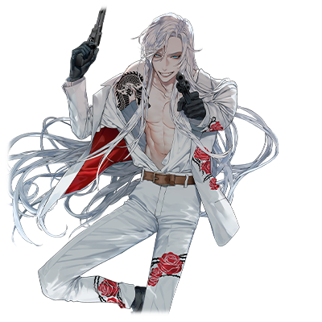
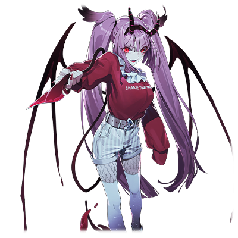

  

# 文迪特·让·拉迪奥尔

| 角色信息   |  |
| ----------- | ----------- |
| 名称    | 文迪特·让·拉迪奥尔  |
| 年龄   |23岁    |
| 职业 |  少爷/怪物收集爱好者  |
| 对应曲   |Tattoo |
| 对应版本 | Chunithm Paradise Lost|

注：本篇故事与另一个角色[姬月露娜](/relation/luna.md)有着极大的关联，且与该故事互为表里关系。强烈建议先阅读[姬月露娜](/relation/luna.md)的故事以获得最佳的阅读体验。

## Episode 1 布满谎言的王子大人
> 一切正如我的预料……直到那个时候到来之前……我就一直扮演着我的角色吧。

闪亮的银发，纯白的西装。以及那宛如一幅画般俊美的脸庞。

以及西装底下无法彻底隐藏的，强健的身体。就是这样一名只要在街上走着，不管是女性还是男性都会为之侧目的美男子。

这名男人的名字，叫文迪特·让·拉迪奥尔。

  

他正被某个组织追杀着。

而那天晚上，刺客们正趁着月黑风高的时候展开了刺杀行动，于是他不得不进行了反击。

但是，战斗的现场却被一名叫做姬月露娜的少女目击到了。

从她的视角来看，文迪特应该就是个滥杀无辜的犯罪者吧。

为了解开误会，文迪特追上了露娜并打算向她解释，但却失手将她打晕，结果文迪特不得不把她带回了她家。

然后，醒来的露娜就对文迪特一见钟情，于是文迪特就成了寄住在露娜家的关系。

文迪特和露娜。

本来只是因为偶然的事件开始的同居生活，不知从何时开始，两人之间变成了不可或缺的存在——。

  

到这里为止，都是文迪特为何会待在露娜家的理由。

但这一切——实际上都在文迪特的掌控之中。

两人的邂逅并非“偶然”。

因为，全部的事情都是他一手策划的。

  

“我回来了哦~今天也是疲惫的一天哦哦~~~~！！文迪特，快点摸摸我的头夸夸我吧~~~”

“欢迎回来。今天也辛苦你了，露娜。”

  

对一切都毫不知情的露娜正在向着她“所爱的人”撒娇，她一边发出了宛如猫一般的亲昵声音一边靠了上来。

文迪特温柔地抱着她，并顺着她的要求抚摸着她的头，在谁都看不到的角落静静地微笑着。

——不，准确来说只有一个人。

透过房间角落的镜子，映照出了正在抱着露娜的文迪特的正脸。

而镜中映照出来的文迪特，正在微笑着。

那是冷酷而邪恶的笑容。

## Episode 2 疯狂之旅的终点

>追求力量什么的，有什么错？金钱，权力，地位……人类这种生物想要的东西，从来都没有变过。

文迪特，是某个财团家族的次男。

不仅学识丰富，甚至还精通各类体育项目甚至格斗技。才能方面几乎十全十美的他，甚至还拥有着一副过于俊美以至于让人无法嫉妒的相貌。

从童年时期就展露了过人才能的他，很早就被寄予厚望。

随着时间流逝，被称为神童的他，也慢慢长成了青年。

在社交场上，不论是资本家，还是政治家，面对各界名流，他都表现出了十足的风度，以及温和的笑容。

不管是谁见到他，都会认为他是个温文尔雅，清廉洁白的年轻人吧。

然而，实际上的他，却在童年时代就留下了一个小小的“污点”。而这个污点非但没有随着时间流逝消失，反而越来越大，最后成为了他心中挥之不去的阴影。

才能，美貌，出身，金钱。

拥有这一切的文迪特，无限地渴望着某样东西。

那就是——力量。

这里说的不是什么权力，还是武力这样简单的东西。

而是超越了人类的正常认知的——“超越人类的力量”。

至于为什么要追求力量，其实也没什么深刻的理由。

只是想满足自己的“乐趣”而已。

骨头，皮肤，内脏，大脑。

他利用各种最先进的技术，改造着自己的肉体。

要走得比任何人都更远。要改造到永无止境。

但是，不管技术再怎么先进，说到底不过是人工的产品，无法满足自己的欲望。

而这不断膨胀的欲望，终于让他将手伸向了真正意义上超越了人智所及的范围，伸向了那些“非人之物”的存在。

利用无尽的金钱和庞大的人脉网，他抓住了各种各样的“怪物”，并且使用各种各样的手段将“它们”的力量收集至人类的体内。

即便如此，文迪特依旧没有得到满足。

每当获得了崭新的力量，那股从未体会到的力量感和幸福感，都不过是过眼云烟之物。

——因为追求超越人类的力量这件事，本就是永无止境的。

  

终于，他的暴行很快就暴露于大庭广众之间。而那正是他刚刚第二次从那些怪物身上获得力量的时候。

结果，文迪特被迫逃离了自己的祖国，被自己的亲哥哥带领的组织追杀着。

文迪特，实质上已经被他的祖国流放了。

然而他却没有一丝悲痛的感觉。不如说，他很享受这个状况。

因为只有这种时候，那些在和平的时期无法得到利用的“力量”才终于有了用武之地。

  

在不断的逃亡中，文迪特依旧没有放弃他的欲望。

他已经决定好了下一个目标。
  

（啊啊……这是多么美妙的事情啊。吸血鬼的不老不死之力……只要我能够获得这个力量的话……！呵呵……欲速则不达啊。现在的等待……为的不过是将来的收获之时……）

## Episode 3 吸血鬼的村落

> 如果要和这么多人打的话会非常不利。那么就改变策略，盯准一个人吧……

“我们已经有了吸血鬼在什么地方的报告。”

数年前——来自文迪特手下的一份报告，传达到了刚刚逃离自己祖国的文迪特手上。

“此事属实？这可是大好的消息啊。说说详细的内容吧。”

“是。不过……关于这个情报，其实就连我们自己都半信半疑。”

“就算不太靠谱也罢，继续说。”

“其实……根据我们的情报，吸血鬼所处的地方……就是日本。”

听着报告的文迪特露出了少许惊讶的表情。

本该传遍西方世界的这个存在，居然会是在千里之外的东洋岛国那里发现了踪迹。而且他们甚至在那里建立了聚落，避人耳目地活着。

“虽然我们可以保证获得的情报可信，不过我们也没法打包票啊……”

“那么，就靠我们自己去验证真伪吧。很简单的事情。”

已经从祖国被驱逐出来，毫无牵挂的文迪特。

同时还身兼逃离组织追杀的目的，文迪特立刻就前往了日本——。

  

在这之后，又过了半个月。

文迪特出现在了日本某地的深山之中。

“这种地方真的会有村落吗……不过，的确能够稍微闻到一点血味……”

吸血鬼的村落，正如他们选择住在人迹罕见的山中一般，他们对外来的人士也十分排斥。

但是，完全的自给自足终究是不可能的，于是他们还是得依靠一些可靠的人类，跟山下的人类世界互相联通。

文迪特便利用了这个机会，买通了在吸血鬼之村牵线搭桥的商人，并以“介绍可以信赖的新人”为名目，进入了村中。

  

“老板，您还是不要轻举妄动比较好哦。要是惊动了那些吸血鬼的话，那可就是吃不了兜着走了啊……”

就算这些吸血鬼潜藏在这样偏僻的山中，他们也不是完全没有见过外面的人类。

大概是几年前，有个所谓的“怪物收藏家”的资本家打算靠武力强行打开村子的大门，结果在吸血鬼的袭击下，他率领的部队立刻就被消灭干净。

商人一边小心翼翼地说着各种忠告，一边带着文迪特走向村长所在的房子。

虽然在路途中有看到几间屋子，但非常不自然地……看不见一个人影，抑或是吸血鬼的影子。

但是，文迪特的确感觉到了视线和气息。

那些吸血鬼们早就已经进入警戒的状态，在暗处观察着他了。

终于，两人走到了村里最大的屋子门前。

而出门迎接他们的，则是这里的村长。

是一名和村长这个名头不太相称的，仍然保留着年轻姿态的男性吸血鬼。

“……欢迎你们的到来。就把这里当你们自己家吧。”

“能够得到您的垂怜是我的荣幸。这次，是带着能让各位都有利的话题前来的。”

  

聪明伶俐的头脑，舌绽莲花的话术。还有从头到脚都毫不松懈的微表情和小动作将自己的意志传进对方的心中。

文迪特非常自如地说着各种各样的谎话，和对方展开了交涉。

如果是普通的人类的话，估计不出三句，就会对他产生接近于信仰心般的崇敬感吧。

但是，不论文迪特再怎么展开攻势，村长依旧没有放下他的戒心。

（果然没那么简单的吗……看来我还是太小看吸血鬼了。只靠我的力量的话，对付这堆吸血鬼可不是什么好策略啊……）

就算文迪特吸收了那些“非人之物”的力量，但和纯正的“非人之物”——吸血鬼硬碰硬，甚至是和全村的吸血鬼为敌的话，那则是更加无谋的决定。

获得了这个答案的文迪特，决定转换一下思路。

既然无法对“一群”吸血鬼出手的话，对“一个”吸血鬼就可以了。

毕竟，文迪特只要能够获得吸血鬼的力量，就足够了。

不管这群吸血鬼再怎么团结，总会有一两个非常规的存在。

“说起来，村里的人有出去过的经历吗？那个……这只是我个人感兴趣的提问而已。”

“这个村子的吸血鬼，是已经约定好了不袭击人类的一族。虽然跟你们这样的人类打交道获得物品什么的还是有的，但没有一个人出过村子。”

然而，这么说着的村长，他的视线却投向了房间角落的某个方向。

那里摆着一张照片，照片上的人，似乎是村长，还有他的妻子，还有个估计是他们的孩子的小孩。

“那张照片，是您的亲人吗？”

“是，是的……是我的妻子，还有女儿。”

“哦哦，这可真是美妙的一家人啊。如果可以的话，能不能让她们出来打个招呼呢？”

“这可不行！……不，没有这个必要……那么，我们继续说别的事情吧。”

  

——中了。

文迪特控制着自己内心中的窃喜，再次回到了商业交涉的话题中。

文迪特确定了一件事。

那就是，村子外，有“一个”吸血鬼这件事。

## Episode 4 大都会的角落

>真是个头脑简单的女人。像这样庸俗的人要用什么满足她们，我早已经一清二楚了。

不久，文迪特就得知了，吸血鬼之村的村长唯一的女儿·姬月露娜正在东京的情报。

“非人之物”也有隐藏于人类社会之中的家伙存在。

而在这之中，既有那些毫不隐藏自己本性加害人类的，自然也有那些拟态成人类的样子并且默默无闻地活着的存在。

属于后者的露娜，虽然已经拼尽全力不让自己身为吸血鬼的事实暴露，但是她身为吸血鬼的特性还是让她露出了马脚。

露娜需要定期向那些“非人的存在”获取血液包。

就算再怎么模仿人类的生活，但是吸血鬼始终是需要血液维持生命的。

只要知道追求着血液的怪物这个条件的话，就非常容易筛选了。
  
在城市见不得光的角落，有一群以贩卖血液为生的怪物。而文迪特抓住了他们之中的一人，并对他实施了惨无人道的毒打。

面对着这些不肯说出情报的怪物，文迪特只是一边笑着，一边加重了力度。

“……好吧……我……我知道了……我把情报给你，所以请饶我一条小命……”

被打到半死的怪物用着自己颤抖的双手递给了文迪特一本笔记。

“哈哈。简直就像人类一样啊。”

一边嘲笑着奄奄一息的怪物，文迪特翻开了记录查询了起来。

那本笔记上记载着的，正是购买过血液包的客户信息。

应该是为了更好地管理血液交易吧，笔记里，交易的频率，收入，顾客信息等都一应俱全，甚至还贴着照片。

文迪特根据从村长屋子里的全家福的记忆，很快就找到了他的目标。

“找到了。这个的话……应该就是他的女儿吧。”

只要确定了目标，那剩下的事情就很简单了。

几天后，文迪特读着他的部下传来的报告书，思考着这次的猎物。

  
姬月露娜。女性吸血鬼，生于吸血鬼之村村长的大家闺秀。

目前正在东京的一间便利店内打工。

性格十分幼稚，自私。情绪变化巨大，非常不安定。品味偏少女。

虽然是个以自我为中心，非常自恋的人，但也有自虐的一面。

喜欢以貌取人。

  

“……呵。”

文迪特把报告书放在一旁，嗤笑了起来。

（像这种女人，社交场上可是一抓一大把。都是些养尊处优的家伙，只有那点自尊心膨胀的要死……）

文迪特只会以“数据”将那些女孩们分类，不论那些人是资产家，政治家，还是贵族的千金小姐们。

对于已经和无数女性打过交道的文迪特，这次的对手，不过是个杂鱼罢了。

找到对方的心中的空隙并且展开攻势，然后就可以按自己的需求控制她。为了达到这个目的，文迪特必须做一件事情，那就是“扮演”。

“如果是这种对象的话……是呢……用‘依存’的方式是最快的方法了吧。”

文迪特闭上了眼睛。只要这样的话，文迪特就能够慢慢地变成对方“心中最想看到的人物形象”。

封印自己的本性，扮演其他的人。

虽然说这都是为了最终的目的所需的工作，但是文迪特很享受这件事。

因为操纵别人的心，对他来说也是一种游戏。
  
然后，计划进入了下个阶段。

充满谎言的罗曼蒂克剧就此开幕。

## Episode 5 不曾知晓的爱的形式

>虽然有点震惊……不过这应该就是一时兴起吧。本性是不会噶变得，就像我一样。

文迪特所准备的“喜剧”，正顺利地进行着。

首先是惊险刺激，危及生命的，充满暴力的邂逅。

虽然说[那次登场](/relation/luna?id=episode-3-这是在拍什么？动画吗？)本来就是通过非日常感的情景刺激到对方的精神，不过在这之中，文迪特也确实确认到了露娜是货真价实的吸血鬼这件事。

接着，只要利用露娜感兴趣的关键字提起她的注意力，并扮演出一个“孤独的王子”的形象的话，就可以完美抓住她的心了。

轻松攻陷了露娜的文迪特，就这样作为露娜的“王子大人”，开始了虚伪的同居生活。

（反正，再也不能回到有着**研究所**的祖国了，不过这里也挺容易引来耳目。但是，直接强制夺走吸血鬼的力量不是什么上策……那么就只能够想办法让这个女人自发地将力量奉献出来了……）

这次的目标是吸血鬼。

迄今为止，文迪特从那些非人之物上获得力量的方法，就是利用研究所的各种工具，进行残酷到用“拷问”二字形容都过于温和的方法，强行将那些怪物的力量提取出来。

但是，吸血鬼有将人类变为眷属的能力。

也就是说，有着可以智取的方法。

随着两人的生活愈发长久，露娜越来越依赖文迪特。

文迪特只要向她念着“我只有露娜可以依靠了。”这样的话，露娜的自尊心就会得到满足，同时也使得露娜越来越将文迪特当成自己的全部。

虽然说是跟着自己谋划的计划进行着，不过由于进展太过顺利，文迪特甚至感觉不到一丝困难。

某天。

一个小时后就要出门去便利店打工的露娜，正在自己的房间里剪着指甲。

文迪特察觉到了些许违和感，不禁问了一下。

“剪了真的可以吗？明明之前那么小心地留着并且好好地打扮了一番啊。”

“嗯？啊……是呢。虽然说我的头发还勉强能够接受，不过指甲什么的店长还是说不行啊！所以也就只能剪掉啦~~！”

“不过……你不是相当珍视的吗？”

“没关系没关系的！为了露娜和文迪特那美妙的未来，就必须从现在开始存钱啊！嘿嘿，露娜，是不是稍微像个好太太了！？……话说回来，反正只要露娜想的话，指甲随时都能再伸长……啊不对！是还能够再长出来的啦~！”

露娜的这番话，让文迪特稍显震惊。

本以为已经把握了她的行为模式的文迪特，却在此刻发现了差错。

迄今为止，文迪特已经不知道面对了多少带着目的接近他的女人。

为了金钱，为了地位，为了名声。那些女人们丝毫不掩饰自己的欲望，卖弄着自己的魅力之处。

但是，文迪特没有见过一个人，为了他而“牺牲”自己身上的某样东西。

所以，露娜为了文迪特而牺牲了自己“重要的东西”的这个行为，对他来说是破天荒的第一次。

（哼……就算是吸血鬼的名族千金，原来也不过是个不知世道辛苦的蠢货吗……不过竟然能够让我稍微不那么无聊呢）

对于文迪特来说，这个小插曲也不过是他那操纵人心的游戏上的一点点刺激物罢了。

游戏的剧本已经突破了中盘，正向着绝佳的状态而去。

## Episode 6 落下帷幕之前

>这样的话，吸血鬼的力量就归我了！终于可以结束这无聊透顶的家家酒了！

露娜憧憬着人类的生活，所以她都是隐藏着自己身为吸血鬼一事静静地生活着。

所以，为了让她能够以自己的意志使用“让别人成为眷属”的能力，就必须创造出让她不得不使用这股力量的危机才行。

  

首先，是雇人绑架露娜。

绑架之后在夺去她的身体自由的状态下关上一段时间，确认她能够在不吃不喝的状态下的生存极限。

这不仅是测试吸血鬼的身体极限，也是为了将她弱化到无法反抗的地步。在这之后，只要趁机救走她就可以了。

而当两人被追兵追到山穷水尽的时候，露娜肯定会为了拯救文迪特而将他变为眷属。

这就是文迪特所设想的一连串的剧本。

一切都在顺着文迪特的计划行动。

救出了露娜，并且两人被黑衣人追到了大楼顶端的宽广房间。

从顶楼的窗向外望去，是整片由落地窗建成的玻璃幕墙。两人站在破裂的落地窗前，文迪特则以保护她的姿势将露娜抱在怀里。

（就是这样……终于要到高潮阶段了……姬月露娜，这场戏的最后一幕，就由你来亲自执行吧！）

  

露娜的视线飘向了文迪特的脖颈。

露娜虽然只露出了一瞬间的苦恼表情，但很快就下定了决心，小声地说着。

“文迪特……对不住了……”

露娜张开了嘴巴，伸向了文迪特的脖颈。

露娜已经做好了决定。为了唯一的脱险方法——从空中逃出这里，她决定将文迪特变为眷属。

（对！就是这样……就是这样……！我终于……要拿到吸血鬼的力量了！！那份能够超越永久的时间的，能够吸收各种各样的异形之物的基础的力量！！终于要成为我的囊中之物了……！！）

这场戏终于来到了最高潮。

只要吸血鬼的力量到手，文迪特就没有必要伪装自己的本性了。

是把她抓起来变成新的实验材料呢，还是在这里直接杀掉呢。

文迪特正思考着。

  

但是——预想以外的人踏入了舞台。

“还是别这么做比较好哦。”

一个陌生的声音在房间里回响。

对于文迪特来说，这个声音再熟悉不过了。

（真不愧是你……总能够在最关键的时候阻挠我的计划……）

声音的主人沉着冷静地向着露娜说到。

“我，是那边那个叫文迪特的男人的兄长。”

## Episode 7 拙劣的浪漫场景

>虽说来了个不速之客，但是对我的计划毫无影响。只要找到最佳的解决方法就可以了。

文迪特在和露娜接触的时候，为了扮演出一个“孤独的自己”，于是向露娜说明了自己哥哥已死的事情。

所以理应“死去”的哥哥出现在两人面前，当然会让露娜惊讶。

在无数谎言中构筑起来的“露娜的王子大人”的形象，出现了少许裂痕。

文迪特的哥哥只是挥了挥手，旁边的黑衣人就收起了手上的枪。

文迪特这才意识到。

自己千辛万苦雇来的人，已经全部都被哥哥收买了。

（真不愧是你啊……不管是执着，还是烦人的程度都超出我……）

  

文迪特的哥哥向露娜全盘托出了文迪特的计划。

包括了文迪特追求着吸血鬼的力量的事情。

包括了文迪特接近露娜只是为了获得她的力量的事情。

还有迄今为止他已经重复了不止一次这样的事情的事实。

以及，他的出身，他的话语，他对露娜的爱，不管什么，都是谎话的事情。

一边是平淡地讲述着事实的兄长，一边是无数次露出惊讶神色的她。

文迪特只是看着他们两个，露出了沉着的表情。

他正在等待着一个转机。

因为目前他构筑的计划不但被兄长无情地摧毁，甚至还反过来将自己逼到了绝境。

（为什么会变成这样……再这样下去的话，姬月露娜就会脱离我的控制范围了……）

在罪证败露的现在，估计露娜会毫不留情地离开文迪特的身边吧。

就算再度将她收入囊中，估计也是一件天大的麻烦吧。

不过，这又是另一种乐趣了。还是享受现况为好吧。

就在文迪特这么预料着的时候——眼前发生的事情，和他所预料的背道而驰。

  

“你懂什么……你懂文迪特的……什么啊啊啊啊啊啊啊啊！！”

露娜居然不愿去相信这些事实。

在她眼前摆着的，是人证，物证，是各种铁一般的事实。即使这样，她还是不愿意相信兄长所说的事情。

不如说，她选择了无视这些。

这就是，她将文迪特放到无比重要的位置的证明。

这就是，露娜那沉重过头的爱的表现形式。

露娜展现了自己吸血鬼的能力，冲向了文迪特的哥哥。

那些黑衣人们本想用子弹阻止她，但是在吸血鬼变换自如的能力面前不过是杯水车薪。

  

（呵呵呵……看来，机会仍旧在我的手中……）

文迪特注意到有数枚瞄准着露娜的子弹飞向了自己的地方。

他故意让一颗子弹命中自己的腹部，并且发出很大的响声倒在地上。

对于已经拥有超越人类认知的肉体强度的他，这点小伤根本无法致命。但是，文迪特在露娜的认知中，并非经受过改造的人类，而只是一个普通的人类而已。

露娜也注意到了倒地的文迪特，慌忙调转方向奔跑过来。

文迪特就这么倒在地上看着露娜，感觉到了一阵不可思议。

（……为什么在这种状况下，她还选择了信任我呢……我本以为只是个一无是处的女人而已，竟然能够让我如此惊讶……）

  

倒在露娜怀里的文迪特，再次开始了他的剧本。

而这次的剧本名，叫做“被流弹击中的王子大人和女主角被迫分离的悲痛一幕”。

这都多亏了露娜。只要她还信赖着文迪特，局面就仍然能够挽回。

“就算只有你一个人活着……也要获得幸福啊——”

文迪特说出了宛如廉价的恋爱电影般，露娜喜欢听到的台词，便同时将她击飞了出去。

她只要使用身为吸血鬼的飞行力量的话，就算是从万丈高楼掉下去也能够幸存的吧。

表面上看，这是为了让露娜能够脱离兄长的组织魔爪所作的行为，但，实际情况恰恰相反。

自己会被怎么样都无所谓，但是，只有露娜要被抹杀这件事，必须避免。

  

（这就够了……我的计划，还没有结束呢……！）

不仅保护了自己贵重的样本，还给她留下了“最爱的人挺身而出保护了她”的记忆。

文迪特露出了笑容，仿佛看到了他大获全胜的未来画面。

## Episode 8 扭曲的器物

>我倒是不讨厌已经疯狂了的你。不过，还是请你不要再妨碍我的事情了。

“戏演完了吗？”

文迪特听到哥哥这么说着，立刻就从之前捂着子弹伤口的状态恢复了过来，以无事人般的状态站了起来，拍了拍膝盖。

“还是被你发现了吗。”

“毕竟我可是比任何人都知道你这个人的底细啊。”

“哦……你是想说，比我自己都清楚吗？”

“是的。你可不是会做这种事情的人啊。”

在露出对自己所说之事拥有绝对自信的表情的兄长面前，文迪特不禁歪了歪嘴瞪着他。

  

从小，文迪特的哥哥，就是个非常爱护，甚至到了过度保护自己弟弟的人。

为了让自己的弟弟能够走上既定的人生轨道，他对文迪特的一切行动都进行了超乎想象的监视和管理。

“文迪特……本来你应该是个比现在更好的孩子的啊。这点是一直不变的啊。”

“少废话，那只不过是‘你心目中的我’对吧？能不能不要把妄想和现实混在一起啊？”

“妄想吗。不管怎么说，你都是那个爱着国家，爱着家人，爱着我的，拥有着这个世界上最纯洁清净心灵的弟弟啊。就算是在那个女孩的面前为了点醒他，将你贬低到如此程度还是让我无比地心痛啊。好了，赶紧放弃那些疯狂的想法，跟我一起回去吧。”

“疯狂？你可是比我更加疯狂的人啊。”

  

那个人的脑子里，早已经将妄想和现实彻底倒置了。

对于兄长来说，那些因为文迪特的欲望和兴趣死去的人，怎么都无所谓。不管是再多的人类，还是再多的怪物被杀死，对于他来说，都是无足轻重的事情罢了。

他想看到的，不过是让自己的弟弟被囚禁在自己理想中的监牢里，一生都在自己的支配之中过活而已。

  

“有个还在反抗期的弟弟真是件麻烦事啊……喂。”

随着一声令下，黑衣人们纷纷举起了枪瞄准了文迪特。

“对自己最爱的弟弟举枪相向，还真是过分啊。”

“这不过是以爱之名的惩罚罢了。有的时候，爱是伴随着痛苦的。我的心里现在也十分悲痛呢……你能明白吗？”

“哈哈哈哈。果然你总是比我高人一等啊。”

“……这家伙可不会那么容易死掉。给我干的彻底点。”

  

就在黑衣人们即将射击的时候。

文迪特大声笑了出来，直接扯开了自己的上衣。

裸露的上半身。还有背上黑色的翅膀——那毫无疑问，是来自于吸血鬼的翅膀。

“什么……！？”

“你真的以为我事到如今，什么都没做，只是跟个小丑一样扮演着某个角色过活的吗？我早就从她的身上得到了些许血液进行了实验……虽说还不够完全，不过还是获得了可观的结果啊！！啊哈哈哈哈哈！！”

呆住的黑衣人们射出了第一枪之后，更多的子弹向着文迪特袭来。

文迪特在尽可能不使用羽毛的情况下利用自己的身体躲避着子弹，躲避不了的就用双手接住。

终于，子弹全部都耗尽了。随着枪声的停息，一阵笑声响了起来。

“真是遗憾呢，兄长。有缘再见吧。”

“怎么会这样……我悲哀的，被命运扭曲了的弟弟啊！”

将兄长的声音甩在脑后，文迪特飞身一跃，奔向了无尽的夜空。

张开了那非人存在的黑色翅膀扬长而去。

## Episode 9 誓约之吻

>虽然还有其他的方法，不过不够精妙罢了。没什么特别的。

在某个地方的深山中。

在前往吸血鬼隐居的村庄的道路上，看到了文迪特的身影。

文迪特是为了迎接前几天还在一起生活的吸血鬼——姬月露娜，才会出现在这里的。

前几天的那场戏由于不速之客的打扰不仅让整场戏走向了其他的方向，甚至还戏剧性地上演了生离死别的戏码。

早早就在露娜的身上装了GPS发信器的文迪特，即便在看不见露娜的地方，也能确认她的行踪，而这次发信器也派上了用场。

“和已经死别的恋人再度相会”……这样感人的戏码肯定能讨露娜的欢心。

文迪特在深思熟虑了以后，明白了一件事。那就是露娜对“爱”这件事有着疯狂般的迷信。

那么，就不需要耍什么小手段了。

只要用上最简单的方法就可以达成自己的目的。

  

终于，文迪特看到了从远处慢慢地走过来的露娜。

死气沉沉地拖着行李箱走着的露娜，在旁人看来似乎多了几分落寞。

但是，当她看到文迪特的身影出现在她视野内的时候，她就立刻将手上的行李箱扔到一旁，并以最快的速度飞奔到了文迪特的怀里，嚎啕大哭。

抱着露娜的文迪特注意到了某种违和感。

  

“文！迪！特！！！！！我可是一直一直一直一直……都相信着你会回来迎接我的啊啊啊啊啊啊！！！露娜的王子大人啊啊啊~~~！！”

  

迄今为止，文迪特也见过好几次说着泄气话抱在怀里哭的露娜。

但是，现在抱在他怀里的露娜哭泣的样子，却是以前从未见过的模样。

天生就是撒谎好手的文迪特，相应地也能辨别出别人所言所行是否真情实意。

现在他可以确定，在他怀里痛哭着的露娜，是由于久别重逢，能够再次见到文迪特所流的感动之泪。

（……真是个有趣的女人。说不定如果我让她为了我而死的话，也会照办的吧。这个女人就是如此地爱着别人吗……看来是和我无缘的感情呢。）

  

文迪特重整了下思绪，向着露娜说到。

“露娜，就让我们两人一起获得属于我们的幸福吧……这次一定。”

“呜呜……呃咕……嗯……我们要幸福地生活在一起哦~~！！”

“如果可以的话……请把我变成吸血鬼吧。”

“嗯……吸血鬼……咦！？”

“我就算知道了露娜是吸血鬼这一事实，我的爱也不会改变。如果你决定回到你的家乡的话，我也会跟着你一起去的。”

“嗯……”

“不过，身为人类的我是不能进去露娜的村子里的。那么，只要不当‘人类’就好了。我已经下定了决心，只要我能够成为吸血鬼的话，就能和你一起在这个村子里生活下去了。”

“文迪特……真的，真的可以这么做吗……？”

“那是当然。在这个世界上，我已经没有比露娜更加重要的东西了。”

  

露娜再次感动得泪流满面。

虽然走了一条远路，但文迪特的计划还是成功了。

虽然不知道文迪特的内心深处发生了什么变化。

但是，这次获得非人的力量的手段，却是迄今为止最温和的一次。

“那么，要开始了哦？可能会有些痒，忍一下哦。”

露娜终于停止了哭泣。

露出了自己的尖牙，咬向了文迪特的脖颈。

就像是——誓约的亲吻一般。

## Episode 10 沉重的爱与欲望的野兽

>这真是迄今为止未曾有过的感觉啊。虽然不知道是为什么……不过这个样子也不坏。

不久，整个吸血鬼的村子就被全灭了。

以最终和露娜结为伴侣关系，同时成为了吸血鬼的文迪特，在两人一起回到村庄之后不久，文迪特就显露出了他的本性。

文迪特的目的，是将整个村落都据为己有。

在他被祖国放逐出去之后，想要再建失去的研究所的话，像吸血鬼的村庄这样偏僻的地方是最好不过的了。

而且，他还谋划着要将吸血鬼全部变成自己手中的棋子。

如果能够成功将这些吸血鬼变成自己的势力的话，那对以后的活动可是一大助力。

当然，那些吸血鬼们也曾拼命抵抗过，但是文迪特不仅和他们拥有着同等的能力，甚至因为拥有着其他的怪物的能力，所以无人能敌。

曾经还是一片祥和的田园风光，现在已经变成了一片巨大的研究设施。

吸血鬼们被施以药物进行洗脑，成为了替主人卖命的奴隶。

但在这之中，只有一只吸血鬼没有被施以药物洗脑，而她正在文迪特的房间里。

  

“那……那个……为啥只有露娜没有被洗脑……？”

“这是什么我必须回答的问题吗？我现在可是很忙的。”

“虽然说其他的村民都被洗脑，只剩下露娜安然无事什么的听起来很可怕……嗯嗯，倒不是说不相信文迪特的做法啦！如果是为了露娜把这穷乡僻岭彻底拆了倒也行，只不过~总觉得是不是做的太过火了啊……”

“……你讨厌这么做吗？你要知道，这一切都只是为了创造能让我们‘普通地，幸福地’生活着的世界啊。这不过是开始罢了。”

“……嗯！”

文迪特很清楚。

即便从家人，到村人都被自己支配，甚至连自己的故乡都变得面目全非，遭到了无情的蹂躏，露娜也会从心底里支持着文迪特。

“文迪特……文迪特啊啊啊！！这些事情，肯定是为了我们两人美好的未来准备的东西对吧！！！刚刚说做过火了实在是对不住了！！！！就让我们一起努力吧！制造出一个吸血鬼也能获得‘普通’的幸福的世界吧~~~~！！”

（哼，真是个笨女人。）

  

正靠在沙发上看着泪目中的露娜的文迪特，就算一边说着刻薄的话，也注意到了自己的脸上出现了自然的笑容。

不知为何，和露娜在一起，就会自然地觉得安心。

面对自己心中的这份未知的感情，文迪特只能默认了其存在。

而为了判明这份无名的感情为何物，他才决定了让露娜陪在自己的身边。

“那么，下次要获得什么样的力量到这具身体里呢……”

在摆满了桌子的一堆报告前，文迪特开始了漫长的评定过程。

仿佛就像打开了玩具的销售目录的小孩子般。

## Episode 11 国王与女王

> 姬月露娜……我如果要永远地活下去的话，陪在我旁边的，说不定就只有你了啊……

“文迪特~真的要这么做吗？”

“当然。还有犹豫的必要吗。只要靠你的力量的话，这些家伙都不值一提。”

“嗯……怎么说呢，我对人类以外的生物的血还算是有点忌惮的……毕竟是我所知的范围外的东西，有点担心卫生方面的问题啊~”

“是吗。那这算是我的失算了。没问题。活干完了，你可以吸我的血。”

“当真！？露娜酱，干劲满满！！只要是为了文迪特的话，就算是同族的血，我也会一滴不剩地吸干！！”

两人的对话一如往常般轻松，但是说的内容却相当恐怖。

就像是为了打破这种气氛一般，露出了杀气的“非人之物”们，向他们攻击了过来。

  

瞬间精神起来的露娜变成了巨狼的样子，闪开了怪物的攻击，翻了个身咬中了敌人的脖颈。

被尖牙刺破的血管喷出了大量的血液，露娜便一口气喝了个精光。

怪物虽然仍然尝试着抵抗了一下，但很快就失去了反抗的力量。

  

“为什么……为什么同样身为‘我们这边’的你，会向我们……”

“咦咦咦……别这么看着我嘛……毕竟，这也是为了我们两个人的幸福才这么做的嘛~”

“没想到……我竟然会被这种小妮子给……可恶……”

“咦欸欸欸欸~~！！竟然死了吗！？南无阿弥陀佛南无阿弥陀佛……”

  

露娜不假思索地双手合十念起了经，但文迪特扯了露娜的尾巴一把。

“呀！？”

“你都念起经了是想干啥啊。而且，我不都说了，别杀掉的吗。”

“啊，一个不小心就……不过没事的！我稍微努力了一下，只吸到了濒死的地步啦！！大概！哦不，绝对是！！”

“是吗。干得不错啊，露娜。”

“哦，终于夸我了吗！！而且还说了‘露娜’对吧！！呐！呐！呐！再来一次！再来一次嘛！！”

“露娜，干的不错。”

“不行！！！再来一次！！”

“……我可不会再说了。赶紧把东西带走。”

“哎呀~~~真是急性子啊！！不过我就当成说过啦！！”

  

本来，文迪特是应该成为露娜的眷属的。

但是，文迪特经过非人改造的肉体强制性的打破了支配的关系，结果就是，两人之间的主从关系颠倒了过来。

露娜慌忙地将怪物的双脚用绳子绑了起来，然后就这么放在地上粗暴地拖着，跟上了文迪特的脚步。

  

  

寄宿了数种异形之力，为了目的绝对不择手段的，冷酷残忍的，“原人类”的怪物之王。

  

还有服侍于他身边的，吸血鬼的女王。

——这对极为异质的男女，开始了他们的“怪物狩猎”之旅。

而他们的传言，很快就传遍了整个黑暗世界。