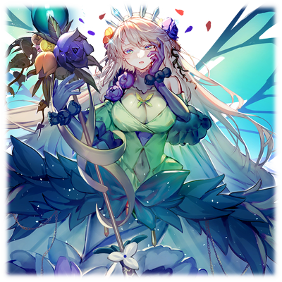
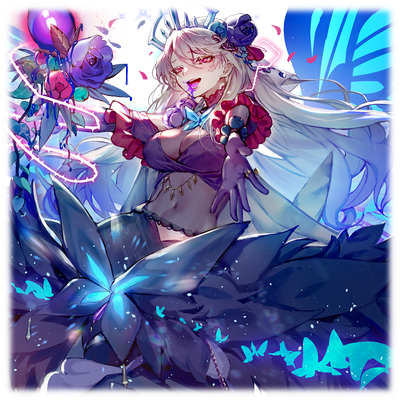

# 尤古多拉希尔

 

 | 角色信息   |          |
| ----------- | ----------- |
| 名称    |尤古多拉希尔   |
| 年龄   |无法确定     |
|职业|大树的守护神|
|对应乐曲|Blazing Break|
|初出| Chunithm NEW|

注：角色名尤古多拉希尔，致敬了北欧神话中世界树的名称Yggdrasill。

## Episode 1 生命的大树

> 世间万物，皆生于大树的加护之下。

——在很久很久以前的神话时代。

在世界的中心，有一棵高耸入云的大树。

这棵大树滋养着大地，让周围长出了茂密的森林。

但是，由神赐予这片大地的恩惠，必须合理地使用才行。

负责管理这一切的，是一名被称作“尤古多拉希尔”的神明。

身为管理大树的神明，她严格遵循着“对一切的生命赐予平等的爱”这一规矩。

花草，树木，野兽，人类——各种各样生活在这片大树的恩泽之中的生物，都是她所爱护的东西。

## Episode 2 偶然与规则

> 既然是既定的命运，那么就不能违抗。

在巨树之下的森林中生活着的生物们，将这片地方称作“原初之森”。

而会如此称呼的，正是人类这一具有知性的生物。

虽然没有其他生物那样强大的身体优势。

与之相对的，是拥有其他生物所没有的智慧。

自知弱小的人类，为了保护自己，在远离其他生物的森林角落静静地生活着。

但是，某样东西向他们发起了进攻。

魔物——那是原本生活在森林中的一部分生物，被大树溢出的魔力影响到产生变异从而诞生的存在。

这些魔物拥有本来那些生物不该有的尖牙厉爪，将森林中的全部生物都当成了它们的猎物。

魔物就这样成了人类的天敌。

“再这样下去的话，过不了多久，人类就会灭绝了吧……这难道也是自然的规律吗？”

尤古多拉希尔对全部的生命都是平等的。

所以她不会干涉一切的进化和淘汰的进程。

因为只要她一介入的话，本来处于绝妙的平衡之中的森林生态系统就会彻底崩盘。

然而——

“这件事情，是因为大树溢出来的力量导致的……即便如此，还是要选择放着不管吗？”

尤古多拉希尔看着大树，露出了复杂的表情。

大树，还有守护着它的尤古多拉希尔是赐予森林加护，从这些生息的生物中获取力量的存在。

也就是说，如果在森林中生长的花草树木，飞禽走兽受了伤的话，那么回归大树的力量就会减弱。

“我必须做正确的事情……至少，我必须在我力所能及的范围内做到该做的事情……”

这么说着，尤古多拉希尔奔向了发生厮杀的地方。

那里已经是一片肃杀而残忍的景象。

草木被破坏，略微看得出原貌的人的尸体碎片散落在四周。

“……怎么会这样……至少，让森林接纳它们的残骸，成为新诞生的生命的土壤吧……”

尤古多拉希尔举起了手中的法杖。

法杖顶端的蓝色宝石闪烁着耀眼的光芒。

宝石散发出鲜艳而耀眼的光芒，将那些粉碎的不成人形的尸块变成了大地的养分。

这就是女神尤古多拉希尔的力量。

通过让这些生命回归大地成为大树的能量，从而让森林的生命力活性化。

“愿你们能够在这森林中重生……嗯？”

尤古多拉希尔闻到了一股血的味道。

“去看看吧。”

跟着血的气味，她发现了一个人正身受重伤，躺在地上奄奄一息。

“啊啊……好重的伤……不过好像还活着的样子……”

尤古多拉希尔陷入了迷惘。自己究竟应不应该介入森林中生物之间的争斗，拯救眼前的这个人呢。

但是，产生魔物的原因，就是大树自身。

那么，答案只有一个。

“生命的气息哟，注入此人的体内吧——”

魔杖闪烁着光芒，将受伤的男人的身体包裹住。

男人身上的伤痕慢慢的愈合，痛苦的表情也渐渐地消失，最后沉沉的睡了过去。

“这……应该是正确的行为吧。如果不这么做的话……”

尤古多拉希尔将自己的魔力分给了人类，治疗了他的伤势。

即便这个行为已经触犯了长久以来的禁忌。

## Episode 3 知识与智慧

>生者跟着时代前进，谱写着属于他们的历史。

自从尤古多拉希尔在森林中拯救了那个人类之后，森林的生态发生了巨大的变化。

人类文明开始了急速的发展。

原因是尤古多拉希尔那天分给人类的一部分魔力，还掺杂了属于女神的一部分智慧。

“竟然会变成这样……不过，这样的话，人类应该就能够和魔物对抗了吧。”

人类明白了火的使用方法。

通过向魔物的巢穴放火，魔物和森林都被烧成了灰烬。

利用火的力量，人类获得了冶炼金属的技术，制造出了魔物的尖牙厉爪也无法损伤分毫的盾牌和铠甲。

而利用精炼的金属做成的锋利武器，又能将那些强韧无比的魔物一刀两断。

人类就这样渐渐地在和魔物的战斗中掌握了方法。

随着文明的发展，人类的生活也变得越来越丰富，迄今为止还是住在木头或者石块堆砌而成的简陋小屋，渐渐地人类开始聚集起来形成聚落，并且建起了高墙用来抵御外敌。

——在这之后，过了数百年。

森林中建立起了人类的大国。

人类和魔物的对抗已经由人类占据了彻底的上风，魔物反而成为了濒临灭绝的存在。

自从向人类出手相助的那天起，尤古多拉希尔就再也没有干涉森林中的一切生命。

但是，那一次的出手让森林的生态不可避免的走向崩坏，令尤古多拉希尔无比痛苦。

要变得更加富有，更加丰饶，让生活更加美好——

人类的欲望是永无止境的。

他们不但靠武力和科学技术击退了魔物，甚至开始染指于森林，还有其他的生物。

只要是有意志的生命，要么成为人类利益的牺牲品，要么就是失去自由，被强行驱使，仿佛奴隶一般。

人类就像是一个无情的支配者一样，统治着这个世界。

能毫不犹豫地伤害别的生命，破坏赖以为生的森林——尤古多拉希尔看着这样利己而自私的人类，不禁感到一丝恐惧。

“我的所作所为，究竟是不是正确的呢？”

没有人能回答尤古多拉希尔的问题。

再这样继续下去的话，森林就会被彻底破坏，尤古多拉希尔甚至会丧失力量。

代表着她力量的魔杖顶端的蓝色宝石也变得越来越浑浊，失去了以往的光辉。

“保护大树，保护这座森林……这一切才是我应该做的事情……”

尤古多拉希尔想起了那些森林中的生命，流下了一行泪水。

“至少，希望这样的日子能够尽早结束……”

## Episode 4 欲望的终点

>不管获得多少东西，总是得不到满足。

很快，人类和魔物的战争落下了帷幕。

被称为“魔王”的，在魔物的军团中持有超越常规的强大力量的存在，在人类的不懈努力之下，终于被击败了。

失去了魔王统领的魔物们群龙无首，变成了毫无组织，只能被人类无情消灭的存在。

“魔物的存在，也是生命的扭曲体现呢。只要魔物消失了的话，森林应该就能够回到原来的平稳样子了吧……”

已经不知道原本是大树的扭曲，还是尤古多拉希尔的傲慢才导致这一切的发生了。尤古多拉希尔只知道，一直为此茶饭不思，担心流泪的日子，终于要到头了。

“这样的话，森林就会回到应有的样子了吧……”

尤古多拉希尔仰头望向大树。

“大树也损失了很多的力量……要彻底恢复的话，究竟要花上多久的时间呢……”

自己也已经损失了大半的力量。

到底要做什么，才能让森林恢复曾经美丽的样子呢。

现在还不是沉浸于悲伤的时候。

必须抬起头向前看，尽可能地将整个森林导向好的方向才行——

“……？”

某个凶险的气息打断了尤古多拉希尔的思考。

“这是……人类？他们已经走到了这么深的地方吗……？”

就像要将陷入困惑中的尤古多拉希尔逼入绝境般，一群手中握着长剑和长弓全副武装的人们出现在了她的眼前。

“这棵大树就是产生魔物的元凶！”

领头的人类高声说着，举起了手中的剑。

“只要将这棵大树破坏掉，这个森林就会迎来真正的和平！”

就像是跟着领头人的号令一般，其他人也举起了手中的武器。

排山倒海的战吼声响彻了整个森林。

“……何等的愚蠢啊。”

人类究竟是多么愚蠢而扭曲的存在啊。

尤古多拉希尔的心中，静静地萌生了一丝绝望。

## Episode 5 扭曲的生命

> 看来，从最初我就做错了。

杀到大树面前的人类们，为了破坏这棵大树，举起了自己的武器。

但是这样的参天巨树，靠人类的火箭或者刀剑，都没法动其分毫。

即便如此，这些微小的攻击仍然在慢慢地积累着伤害，缓缓地破坏着整棵大树。

人类看来是下定了决心要将大树破坏掉。

“全员！准备攻击！”

人们举起了武器。就在这时，尤古多拉希尔出现了。

“请各位等一下。这颗大树就是这座森林本身啊！为什么身为森林中的生命要对自己的生存之本下手呢……难道你们都不明白吗！？”

看到突然出现的尤古多拉希尔，人们不禁迟疑了一下。

然而，很快就被另一件事所打断。

“区区魔物竟然敢扮成人的模样……！！给我上！宰了这家伙！”

人群中发出来的微弱喊声，渐渐地响亮了起来。

“杀了它！杀了它！杀了它！！”

整个场地已经被恶意的喊声包围。

“……怎么……会这样……”

尤古多拉希尔的心中充满了绝望。

即便如此，她还是想试着去相信森林中的这些生命——这已经是她的最后底线了。然而眼前的一切却轻易地践踏了她的心意。

“——放箭！”

弓箭直接贯穿了尤古多拉希尔的胸口。

“……啊……不可以——”

又有几根箭直接命中了尤古多拉希尔。

“唔……没办法了……！”

尤古多拉希尔从地面唤起了几根藤蔓扫掉了飞来的箭。

然后将藤蔓立起来当成了掩体。

“我不想伤害大家。人类哟，请不要再继续这样的行为了——”

即便这样呼喊着，人类的攻击仍未停息。

尤古多拉希尔心中那祈求着争斗即将结束的想法，被锋利的刀剑斩断了。

“噫……”

人类这超乎想象的行动令尤古多拉希尔感受到了恐惧。

瞬间，藤蔓伸了出去，直接将人类的手腕切断。

“呜……啊啊啊啊啊啊啊啊……！？”

即便人类发出了惨叫，尤古多拉希尔也未能听到。

因为她已经因为恐惧再也控制不住藤蔓，放任它们自由生长，蹂躏着人类们。

“啊——”

等到尤古多拉希尔将藤蔓从已经被刺的千疮百孔的人类身体中抽出的时候，那个人早已死去多时。

尸体上已经浸满了鲜红的血液，甚至浸湿了地面，沾到了尤古多拉希尔的脚边。

缓缓地伸手过去，尤古多拉希尔的手指沾到了某种十分熟悉的，红色的东西。

“……我……我刚刚……做了些什么……”

尤古多拉希尔终于理解了自己犯下了怎样的过错。

她伤害了本该保护的，本该爱着的东西。

“啊，啊，啊……”

同胞的死令人类们为之一颤。

但是尤古多拉希尔对人类出手这一行为，立刻就成为了人们发起攻击的导火索。

“杀死那个邪恶的魔物！为我们的同胞报仇！”

“唔哦哦哦哦哦哦哦哦！”

人类举起了剑，向尤古多拉希尔发起了进攻。

和尤古多拉希尔的意志相反，藤蔓就像是顺着她心中的绝望一般伸展着，屠杀着眼前的人类。

“呜……唔……啊……”

尤古多拉希尔仿佛在忍耐着从体内涌出的某种冲动，紧紧地捂着嘴。

而就像是要将她最后的心理防线击破一般——

“……咦？”

眼前的景象仿佛就在嘲笑尤古多拉希尔的努力一般。

她的双手被砍了下来。尤古多拉希尔呆呆地望着自己被砍断滚落在地上的双手。

然后意识到了什么。

原来，这就是所谓的“恶意”吗。

“啊哈……啊哈哈哈哈哈哈哈哈！！”

尤古多拉希尔终于意识到自己在这里应该做的事情了。

那就是，为这棵大树和森林带来彻底的和平。

尤古多拉希尔有气无力地杵在原地，盯着人类们。

而她的表情也变得无比扭曲，露出了一丝笑容——

发起攻击的人类们，也不禁为尤古多拉希尔这妖艳的表情驻足停步。

“——嘻嘻”

下个瞬间，尤古多拉希尔的身体被光所包围。

地面开始剧烈摇晃。

“那究竟是……？”

人们只能默默地看着眼前的景象发生。

## Episode 6 慈爱与自爱

> 一切终将回归为一体。

眼前冒出了巨大的魔物，令人们心惊胆战。

人对于自己无法理解的东西通常都是恐惧的——很奇妙的是，现在的她，也抱着同样的心情。

“——嘻嘻”

 

已经变为巨大的“魔物”的尤古多拉希尔露出了扭曲的笑容。

那副妖艳而且充满危险的笑容正是人类所恐惧的魔物的样子。

“噫”

——双目对视。

尤古多拉希尔只是舔了舔嘴唇露出一副慈爱的笑容。

下个瞬间，刚刚对上视线的那个人就被荆棘遍布的藤蔓贯穿了心脏。

“哈……”

一击毙命。

被藤蔓贯穿的尸体立刻就被大地所吸收。

然后就像是成为了养分一般，从尸体被吸收的地方长出了翠绿色的树苗。

“哈哈……”

尤古多拉希尔十分怜惜地抚摸着刚刚长出来的树苗。

在场的人类无法理解这幅光景。

“哇”

呆呆地望着这一切的人们，被一个个地变成了树苗。

一人，两人，三人，四人……人们三五成群地被变成了树苗。

“哇啊啊啊啊啊啊啊啊！！”

人们终于意识到了威胁，拼命逃窜。

但是尤古多拉希尔却没有任何挽留的意思。

“没关系的……大家，都是这棵树上的一员生命啊。”

尤古多拉希尔眯着眼睛，露出了笑容。

## Episode 7 生命，回归大树

>在这之后，森林回归了平静。

“哈哈，不管逃到哪里都是没用的哦。痛苦只不过是一瞬间的事，只要大家合为一体的话，大家就是形影不离的哦。”

不管是那些逃窜的人类，还是那些生活在城镇中的人类，不过是尤古多拉希尔掌上的玩物罢了。

尤古多拉希尔能够支配森林中的全部东西。

不仅是花草树木，动物植物，甚至是那些没有生命的无机物。

在此刻，都成为了尤古多拉希尔的爪牙，向人类发起了进攻。

人类们最熟悉的丰饶的大地，反而变成了令他们死无葬身之地的模样。

“……这一切都是为了让森林回到应有的模样……所以，我对一切的事物，都要施以最公平的‘爱’……”

——尤古多拉希尔小心翼翼地处理着森林中的每一个生命。

不管是杀死的人类，还是丧命的森林中的动植物，全部都回归了大地。

这些东西就像是未曾存在过一般，和大树和为了一体。

“呵呵呵……来吧，生存于这座森林中的一切生物哟……接受来自我的无私的爱吧。然后，一起成为一个个体，永远地活下去吧。”

这正是“平等的爱”这一目的背后所代表的现实。

也是尤古多拉希尔的终极目的，还有约定。

——最终，森林中的一切生命都回归了大地。

在一片寂静的森林之中，尤古多拉希尔注意到一件事。

“还有一个存在没有回归……呢。”

是的，这个存在就是——

“啊”

尤古多拉希尔巨大的身体和大树融为了一体。

没有任何生命听到这最后的一句话。

一切的生命，都已经从这原初的森林中离场。

只剩下树叶的沙沙声在风中永远地回荡着。

## Episode 8 永远流传下去的生命之歌

> 生命是永久不息，轮回流转的。这一自然规律只会持续下去，直到永远。

在某个地方，有着一棵高耸入云的大树。

大树就像是仰望着下方葱葱郁郁的森林般，矗立在森林的中央。

在大树的树脚下，有两个身影正仰望着大树的树冠。

那两个身影虽然看着和人非常相像，但很明显是不同的存在。

它们长着宛如翠绿的树叶般的头发以及树皮一般粗糙的皮肤，还有宛如果实版的眼睛——简直就像是人类最后的下场。

在这之后，响起了宛如树叶摇动一般的沙沙声，似乎是什么东西正在商量着。

很快，那两人向着大树双手合十行了一礼，便立刻奔向了森林之中。

两人毫不犹豫地穿行在森林之中，最终它们来到了一处开着无数的洞穴的岩壁。

两人轻轻的敲着小块的岩石，击碎的岩石碎片中便开始渐渐的浮现某样东西的样子。

那些碎片最终形成的，正是各式各样的，人类外表的物体。

又是过了一阵，树叶响起了声音之后，这些聚成人形的身影就像是祈祷一般，唱起了和蔼的歌声。

那是温柔，和蔼，却又充满了生机和力量的生命之歌。

歌声不知何时传遍了整座森林。

就像是森林整体在表达着自己的意志一般。

生命周而复始，又开始了一轮新的循环。

只有大树和森林亘古不变，一直在这片地方。

大树和森林仍然一如既往地向森林中的生命平等地赐予丰饶的物产，还有保护生命的庇佑。

——只要生命仍旧在这片森林中诞生的话。