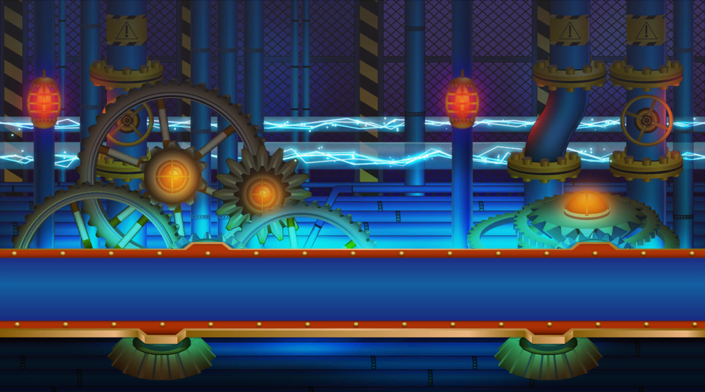

# Seelisch Tact

由生机盎然的大地，以及远古遗迹所组成的大陆，艾玛格。

虽然局势看似和平，但是为了获得古代文明的强大力量的帝国军已经开始了行动，战乱即将爆发。

突然出现在北边的兰特村的一名少年“静间·黑崎”，被突然入手的太古之剑“神统奏魂”所引导，为了找到自己的人生之路，他举起了武器，和帝国军展开了战斗……

|
头像
| 角色   |日文原名|对应乐曲 |初出版本|
| ----------- | ----------- | ----------- | ---------- | ---------- |
||[静间·黑崎](/seelicht/shizuma.md)|シズマ・クロサキ|Theme of SeelischTact|Chunithm
||[菲涅•阿尔托莉奈斯](/seelicht/fenne.md)|フィーネ・アルトリネス|Grab your sword|Chunithm
||热砂的蒂斯|熱砂のディース|砂漠のハンティングガール♡|Chunithm
||[克莱门司·吉克哈尔特](/seelicht/clements.md)|クレメンス・ジークハルト|The ether|Chunithm
||[格伦·梵·特兰克罗](/seelicht/glen.md)|グレン・ヴァン・トランクイロ|overcome|Chunithm
||青之死神|青の死神|luna blu	|Chunithm
||阿尔玛·维斯·奥达琪亚|アルマ・ヴィス・アウダーチア|Alma|Chunithm
||露米艾拉·维斯·阿尼玛特|ルミエラ・ヴィス・アニマート|STAR|Chunithm
||帝国魔导师 伊赛利亚|帝国魔導師 イセリア|Tango Rouge|Chunithm
||帝国骑士 古斯塔夫|帝国騎士 グスタフ|Gustav Battle|Chunithm
||机神 托尔|機神 トール|怒槌	|Chunithm
