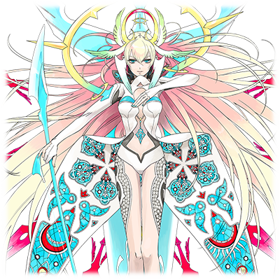

# 阿尔玛·维斯·奥达琪亚

| 角色信息   |          |
| ----------- | ----------- |
名称	|阿尔玛·维斯·奥达琪亚
年龄	|19岁
职业	|守护圣域的白骑士
特长	|用谱术器进行战斗和飞空
对应乐曲	|Alma
初出	|CHUNITHM

翻译：天堂麻弥 

## EPISODE 1 守护圣域的白骑士阿尔玛

>能守护露米艾拉大人的，只有身为骑士的我一人。请好好享受，我器身一体的谱术吧……

她是在教国的圣域，为了守护圣女而被选拔的精锐。

因为达到了圣域的传统试炼中被称为“白之试炼”的最高位评价，所以获得了白骑士这个称号。

 

将先史传承隐藏在圣域的教国，由于感知到了持续侵略着大陆的帝国军的机械以太兵器的威胁，便敦促阿尔玛和骑士团等人提高警戒。

 

“想要挑战试炼的话，就先由我作对手吧！”

作为一名骑士，阿尔玛对自己的职责感到非常自豪和骄傲。圣女对她而言，就是绝对且唯一的主人。

然而她的高度忠诚导致了她的视野无比狭窄，不能很好把握当今的现实。

## EPISODE 2 骑士的使命和职责

>圣女露米艾拉大人的力量，各位信徒创造的心之壁，以及我等白骑士。只要有这三者，神话教国就是不可侵入的。

我们的教国，一直被圣域中充盈着的以太的力量，和从古至今信徒们创造出的坚固的“心之壁”守护着。

至今为止数次席卷整个艾玛格大陆的自然灾害，以及其带来的人们的恐慌和战争……教国也仿佛与它们无关一样，几乎完好无损地度过去了。

另外，当大陆各地呈现出荒凉的景象时，教国的巫女们就会以她们信奉的神话开解人们，使人们沉闷的心灵绽放光明和活力，让人们的希望重燃。

巫女们如此，骑士们也是如此……正确展示这基于以太而存在的，艾玛格应有的样貌，正是信仰并传播教国的教义的信者们的使命了。

 

将巫女们集结起来的圣域之主便是圣女大人，而我们白骑士的职责便是保护她免受任何苦难。

圣女大人只要集中精神便可以感知到自然的以太流动，并从中知晓世界的命运。然而在进行的途中圣女毫无防备，所以很容易遭到恶意攻击。

如果敌人现身的话，我们将替无力的圣女大人举起剑。保护神圣的存在，正是我们骑士的骄傲。

## EPISODE 3 圣域的日常

>优雅传统的仪式支撑着神话教国。让我们通过做礼拜来度过愉快的日常生活吧。

天空和海洋在地平线的彼方融于一体，那是“世界的尽头”。

圣域位于一个向“世界的尽头”突出的岬角上，被高浓度的以太所覆盖。

枝叶繁茂的森林之中，建立着一座巨大的<ruby>留声<rp>（</rp><rt>Phono</rt><rp>）</rp></ruby>神殿。

 

而这矗立的白色神殿的每一天，都是从做礼拜开始的。

从日出到正午，在神殿工作的巫女们与圣女大人一起，代表信徒们进行礼拜的仪式。

感谢自己度过的昨日，祝愿人们美好的明日，以及为以太的安定祈祷。

正是信徒们的精神才支撑着这个教国。

人们纷纷乞求着摆脱焦虑和不安，并从中获得满满的希望。

 

中午，则是吃一顿教义规定的简餐。

从午后开始，巫女们的任务是分享神话解读，精神修养，以及农活。如果是骑士的话，除了这些还有持续到傍晚的战斗训练。

日落时还有例行的礼拜（比早上的简短），结束之后是晚饭时间。大家将今日的收获的感谢之情献给每个人、献给神明、献给以太，静静地享用晚餐。

夜里是自由活动的时间，但因为第二天要早起，所以大家基本上很快就去睡觉了。

## EPISODE 4 神话教国的现况

>那个机械兵器，是扰乱自然环境的恶魔。为了防备帝国的威胁，必须更加保持警惕。

不仅是圣域，教国的夜晚也比其他国家来得更早。保持夜间安全也是我们骑士的职责。

 

最近在巡逻时，我发现了些事情。

有时，埋在国土各地的古代装置，在夜间会发出奇异的光芒。这些装置便是教国的国防中心——“心之壁”的发生装置，但它们的输出变得不稳定，从而发出了可疑的光芒。

从中也可以窥探到国民们的不安。

 

不安的源头便是正在迫近的帝国军……

曾经携手应对大陆危机的帝国，现在却正以拿下圣域的势头，向着夺取全大陆的以太控制权的目标前进。

他们的机械兵器，会破坏自然的平衡。

对于遵守教义保护自然，并享受着这一切的教国人民来说，这些操作以太的机械，其存在本身就令人不安和恐慌了。

对教国来说，人心的不安直接影响着国家的存亡。

作为骑士的我们，也必须做好准备来应对任何可能发生的状况。

## EPISODE 5 关于“白之试炼”

>以心和技合身为一体……严于律己，坚守信念，自然的以太便会成为骑士的助力。

只有挑战并跨越了圣域传承的“白之试炼”，圣域的白骑士才能达到白骑士应有的实力。

立志成为骑士之人，必须牢记心技力三项均衡发展，管理约束自己，才能通过试炼。

 

骑士试炼这个传统，如果追根溯源的话其实是从外界流传进来的。教国本身是由那些通过祈祷接受神明和自然的恩惠的人民聚集起来的产物，并没有战斗的习惯。

但对于持有恶意的外敌，仅仅只靠“心之壁”的防御还是存在限度的。于是圣域向外界掌握战斗奏法的剑士发出委托，成立了崭新的骑士道。

而这个骑士道的训练，便是如今流传的白之试炼了。

 

将战斗技巧教与我们，并数次将我们从“心之壁”的危机中救出来的剑士究竟是谁，有很多种说法。在教国，神话是我们的第一要义，所以对历史的研究并不深入……

不过只有一点能够确定，那便是“<ruby>神统奏魂<rp>（</rp><rt>ゼーレタクト</rt><rp>）</rp></ruby>”的存在。

既是失传的古代大剑，又是能与神对话的道具……那正是英雄“奏者”使用的控制器。

## EPISODE 6 以太的海与天空

>如果是穷尽此道的白骑士的话……即使是水面行走，或是空中飞翔，都不过是易如反掌之事。

在白骑士当中，能使用制空的谱术的人也是稀少的。

但是我很擅长飞行。对于在高浓度以太的环境中养育长大的我，相比一般的谱术，特殊的术更适合我。

根据发掘自次元之门遗迹的古代记录，异世界有着能够飞行的乘坐物。在大陆上它们是不存在的……那么它们是如何在空中飞来飞去的呢？

 

我作为大陆上少有的、能从空中俯瞰大地的人之一，被各种各样的人询问过看法和意见。

从天上能看到什么？能看到多远？

在空中是什么样的感觉？

不过，到目前为止，我只在圣域里和周边地区升空飞行过。我对外面世界的天空一无所知。

所以作为骑士的我也只能在已知的范围内回答。

在空中飞行的感觉，就像是在水面上行走一样。

 

有一次，我试着从圣域所在的岬角上向“世界的尽头”飞去……我本来是在空中飞行的，但意识到时已经是在“游泳”了。在那里，有种不可思议的满足感……

## EPISODE 7 白骑士道之精神

>看来你也掌握了约束自己和控制的技巧呢……那么在试炼的最后，让我来帮你点缀一下吧！

名为静间的少年向圣域的“白之试炼”发起挑战，克服了途中的种种苦行，抵达了最终试炼。

仅仅一次的挑战就成功度过了那种苦难？

他到底是什么人？

似乎精通剑术……但从克莱门斯先生那边得知，他还是个异世界人。不管怎样都不普通。

毕竟在试炼的路上，充斥着寸步难行的严酷环境和高浓度的以太。

要在无路之路上从容前进，并且要承受剧变的以太带来的身心混乱，才能称得上是一名出色的骑士……他连这些都做到了吗。

 

但是，好吧。

最终试炼，需要现役白骑士的第一人来决定。

那么就由我来作为静间大人的对手吧。

当然，是一对一的模拟战斗。

地点是空中。即使飞不了也不用担心，静间大人就利用这双能够暂时获得飞行能力的靴子吧。

那么，要上了……！

## EPISODE 8 面临决战的白骑士

>快到大战的时间了……我，绝不屈服于帝国的暴政！

大战的时刻即将来临。

因为环境变化，周边地区荒野的魔物们更加凶暴了。一直对付这些入侵教国的魔物们的是我们骑士团。

但是这次，出现的是帝国的新型机械兵器。

它们的炮口，最终指向了教国。

 

帝国军把位于教国附近曾经的旧首都作为前线基地，准备向教国发动全面进攻。

此外，帝国军还在利用旧都内古代的次元之门企图着什么。

难道……是要用次元之门连接异次元吗？

帝国打开异次元的大门究竟是要做什么？

绝不能允许更进一步的自然破坏了！

 

白骑士不仅有守护圣女大人的职责，还要为了保持自然环境和以太的平衡，清理掉想要破坏平衡的邪恶敌人。

那么……就让我做先头的尖兵吧。

因为这样不仅能保护圣女，还能保护教国的所有人。

## EPISODE 9 旅行和对圣女的担心

>露、露米艾拉大人！真的要前往外界吗！？那、那么让我来担任贴身护卫……

我，艾尔玛的担心事增加了。

无非是圣女露米艾拉大人的事情。

确实，圣女是个固执的人，一旦决定了什么就听不进其他的意见了。

居然要离开圣域，在外面的世界旅行什么的。

那不就意味着我也不得不去了吗！

 

露米艾拉大人暂且不论，我也几乎没有走出过教国前往外界的经历。毕竟为了好好维持教国的教义，圣女大人和白骑士们都有各自的日程。虽然我因为外交上的理由去过附近的帝国旧首都就是了……

 

我无意职责不同民族的风俗习惯，但首先，那些发掘旅团的人每天都要喝酒喝到彻夜狂欢的地步，简直难以置信。

为什么连静间大人和身为学者的克莱门斯先生都融入他们了呢？而且那些人里面还有长得像盗贼一样的人（虽然实际上是猎人）……

应该不会对露米艾拉大人的圣洁力量有坏影响吧。

不，不要说力量被影响了，首先要是被教会了一些奇怪的话或言辞，就这样误以为是常识的话……啊啊，真是担心太担心好奇心旺盛的圣女大人会不会被教坏了……

## EPISODE 10 阿尔玛的苦恼

>身为白骑士的我却成了被守护的人……露米艾拉大人，真的十分抱歉……

真是难以想象，在围绕传送门与帝国军的攻防战中，打破僵局的王牌是圣女的绝对防御令。

明明是要守护大家的我，没想到连自己却被露米艾拉大人保护了。

被值得尊敬的主人救了，却什么也无法回报。

就这样，白骑士阿尔玛的名誉被添上了一个污点。

 

但是……离开圣域，在外界我明白了一点。

我仅仅只能在空中飞舞，连战斗都做不到。

那个充满高浓度以太的天空和这里完全不同。在这里，我无法随心所欲地使用谱术。

真是太可悲了。

至今为止的我，太依赖于自然之力了吗。

什么白骑士，什么骑士的骄傲啊……但是……

 

我的战斗力，对于现在的旅团来说实在太弱小了。

尽管如此，我也要做能够做到的事。

露米艾拉大人目睹了战争的恐怖，她的心被深深地刺痛了……而治愈并守护这样的心灵——

那就是，只有我才能完成的任务了。

## EPISODE 11 阿尔玛的开光

>在这个战场上，我要作为一名光荣的骑士扬名立万。将我的身影好好的铭刻下来吧，傲慢的帝国军哟！

决战的枪声，在帝国的新首都打响了。

以曾经是发掘旅团的货物的古代兵器“<ruby>神统奏魂<rp>（</rp><rt>ゼーレタクト</rt><rp>）</rp></ruby>”为开端的战斗，现在已经发展到了以旅团为中心的崛起实力与帝国军全军的大战。

然而……虽然挥舞着神统奏魂剑的静间大人有着无与伦比的战斗力，但是旅团侧的人员实在是过少了。

然后，那耸立如城塞般的新首都……帝国军将其坚固的指挥塔放置在重重防御壁中。

如果能够攻破它的话那就有胜机了。

然而，究竟该怎么做呢。

 

……原来如此。为什么我之前就没想到呢？

确实，在这种低以太环境中，我也能在空中飞行。

不管敌人的防御有多坚固，只要飞过去就行了。

如果能在敌人的头上迷惑他们的话，那就能突破这个重围……

蒂斯小姐，克莱门斯先生，谢谢你们。

格伦大人，不用担心。没问题的。

菲涅小姐，如果能回来的话我也想参加茶会。

露米艾拉大人……那么我暂时告辞了。

那么静间大人，请下令吧！

