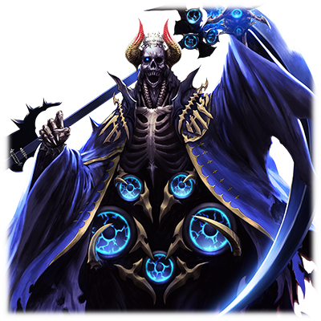

 # 菲涅•阿尔托莉奈斯

 

| 
角色信息 
  |          |
| ----------- | ----------- |
名称	 |菲涅•阿尔托莉奈斯
职业	 |旅团的发掘助手
特技	 |以太环刃、跳舞
对应乐曲	 |Grab your sword
初出	 |CHUNITHM

## Episode 1 菲涅•阿尔托莉奈斯

>只要有旅团的大家陪伴在身边的话，我就不是孤单一人了！不管在哪里，我都能够前进下去！

菲涅，所属于发掘旅团，是一个不管何时何地都一直专心一致、积极向上的少女。她对未来怀抱着美好的理想，和朋友们一起旅行。

虽然菲涅在小时候就失去了家乡，但天性天真浪漫的她，和旅团轻松愉快的环境相辅相成，最终让她在旅团之中健康成长。

  

“别站在那儿了，一起来跳舞吧！”

菲涅还记得家乡传统的环刃之舞。只要伴随着独具特色的舞步起舞的话，空气中的风之以太就会随着她的舞步转动，在空中聚成道道光轮。

这套舞蹈不仅仅只是跳着好看，还能应用到战斗当中。菲涅也凭借这个技术跻身成为了旅团警卫队的一员。

## Episode 2 漂泊者

>我们旅团常年行走在大陆各处做生意。真希望下次的集市也能顺利举行啊。

陆行船的船帆被大大地张开。船帆兜住以太之风，在林间道路上滑动前行。

  
我们发掘旅团的谋生手段，就是在艾玛格大陆的各地之间的旅途上，收集一些地下资源、遗迹古董还有地方特产之类的东西，然后把它们带到其他地方倒卖掉。

所以，一年到头，我们都一直在旅行。

  
我虽然不像旅团的大人们那样擅长挖掘之类的力气活，但我会做各种家务，还擅长跳舞。于是我就做些像是做饭、洗衣服，在旅途各地的节日上台表演之类的工作……就像这样，为旅团的大家帮忙。

  
啊对了，偶尔也会有些试图袭击旅团，夺走货物的强盗出现。但只要用我的以太环刃格斗术，就能轻松把那群不长眼的土匪打飞！我，可是很强的哦？

  
陆行船来到了兰特村。这里真漂亮啊……

到了举办庆典的时候，就和大家一起在这里办个集市吧……

加油吧！为了让节日气氛能够更加高涨！

## Episode 3 第一步

>别站在那儿了，一起来跳舞吧！我把家乡的舞蹈教给你！

提到夜场的祭典的话，那就是大家一起参加的舞会了！

我也在舞会上向大家展示了自己压箱底的舞步。

  
但是，我注意到了会场边上有一个扭扭捏捏的男生……应该是这个村子里的男孩吧？

不过，看他的样子，与其说是扭扭捏捏，倒不如说是跃跃欲试……吧？就像是非常想做什么，但一直没找到机会的样子。

  
当我试着邀请他：“来跳舞吧！”的时候，就听到他回应了一句：“跳舞是什么？”……这也太稀罕了！

这世界上居然还有人不知道跳舞是什么的吗！？

  
我就教了那个男生比较简单的舞步。

一开始他跳的还很别扭，但很快就学会了。我也抛开了固定的舞步，和他一起即兴地跳舞。

这还是我第一次这样做。

……但是，真的太有趣了！

  
而这，就是我和他，也就是静间，最初的邂逅。

## Episode 4 困惑与愤怒与预感

>就为了那个像巨剑一样的东西吗？所以说帝国军的做法真是不可原谅啊！

节日庆典结束之后，旅团开始收拾集市准备前往别的地方了。唉，真希望能在这多待一会啊。

  
话说，我一直都很在意留在船上的那个像是巨剑一样的东西。它虽然是在前往兰特村的路上的一处悬崖被我们挖出来的古董，但却没有被卖出，而且旅团长还说要把它运到青之国去。这是为什么呢？

  
稍微有些不妙的预感。

如果那个像剑一样的东西是古代文明的兵器的话……

  
预感成真，我们被帝国的军队袭击了。他们也太过分了……为什么要烧掉兰特村！

我被激怒了，找到了军队的队长。但他根本没法沟通，我擅长的环刃格斗术也对他没有效果。

虽然我怒不可遏，但却因为恐惧站在原地无法动弹……。

究竟该怎么办……

就在这时，那个男孩——静间拿着剑站了出来。

他掩护着我，挺身而出，向着帝国兵和队长而去……！！

## Episode 5 惊讶与反省与干劲

>没想到他竟然保护了我……看来，我也得更加努力了！

我本以为静间只是个温柔文静的少年，但现在的他却举起了长剑，轻而易举地就打倒了那些敌兵。那与平时判若两人的英勇形象，让我惊讶的说不出话……

我的心脏砰砰直跳，视线完全无法从他的身上移开。

  
直到那群士兵消失，村里的火灾也结束之后。

我才从恍惚中回过神来，这时，我才发现自己正抱着静间哭着。

如果静间没有来救我的话，还不知道事情会发展成什么样子……！

  
之后，当我听说静间要离开村庄加入我们旅团一同旅行的时候，我虽然很高兴，但是也稍微有点害羞，或者说心里有点怪怪的感觉……这种感觉，到底是什么呢？（译者：少女心啊孩纸）

由于实在不知该如何排解这份心情，所以我在旅途中偶尔会挑逗他一下。

毕竟！我实在搞不懂那个叫什么神统奏魂剑的东西，而且还有一个叫蒂斯的怪女人也在追着他嘛！

拜此所赐，我完全没注意到这个叫蒂斯的家伙是个来偷剑的坏人。于是我们不得不去追回被盗的奏魂剑了。

对不起，静间……

## Episode 6 是秘密特训的成果哦

><ruby>右之琴弓<rp>（</rp><rt>デストラ・アルコ</rt><rp>）</rp></ruby>，还有<ruby>左之流弦<rp>（</rp><rt>シニストラ・レーニョ</rt><rp>）</rp></ruby>……只要有这对环刃在，我就不会输！

没想到，静间居然原谅了蒂斯，这也太温柔了吧。如果是我的话，我早就把这棵长在沙漠里的蓟草一刀两断了！

  

但是，我不想再给他添麻烦了。我发誓再也不会被任何人欺骗，也开始偷偷练习起了环刃。

环刃的技巧分为<ruby>断奏式<rp>（</rp><rt>スタッカート</rt><rp>）</rp></ruby>和<ruby>连奏式<rp>（</rp><rt>レガート</rt><rp>）</rp></ruby>两种，在我的努力之下，我成功地同时掌握了这两种不同的技巧。

疾速挥动的右手，流利优雅的左手！结合了这两种相异技法的环刃战法，即便面对那些帝国兵的精锐，也能够打个五五开吧。

  
然后，我们的旅团终于顺利到达了青之国……然而，帝国的那些人又在袭击无辜的人民了。不可原谅！

虽然很在意王子格伦的情况，但首先还是得对付敌兵吧。我这么想着。

  

然而这时，传说中的青之死神降临了。死神的外形映射出了人们心中的恐怖，所以，任何人都理应会感到害怕才对……

但是……我！完全！不怕！

静间君，不要被那东西吓到！不要输给他啊！

就由我为大家加油打气吧……！！

## Episode 7 我能做到的事情？

><ruby>A大调・轻快滑奏<rp>（</rp><rt>アードゥア・グリッサンド・レッジェーロ！</rt><rp>）</rp></ruby>！把能够战胜一切的强大和勇气，传递给大家！

我的环刃是一种格斗武器，但也能收集以太，变成鼓舞大家的舞蹈道具。

就连一度失去自信的格伦，也因为我的舞蹈而拿起谱铳，发挥出它原有的力量！

就这样，大家终于脱离了危机。

  
然而不知为何，蒂斯也和旅团合流了。旅团长被蒂斯的花言巧语所迷惑，开始说什么“我们去神话教国”之类的话。怎么这样……别被她骗了啊！

静间也因为剑的状态不佳而很失落的样子。克莱门斯先生说，去教国的话或许可以明白一些原因。

如果是这样的话，那，把教国作为下一个目的地应该也行吧……？

  
怎么才能让静间振作起来呢？

如果是我力所能及的事情的话，我什么都会做的……

话是这么说，我也只会干一些做饭之类的事情了。

既然静间说他想集中精神挥舞<ruby>奏魂剑<rp>（</rp><rt>タクト</rt><rp>）</rp></ruby>的话……

那我也暂时远离一阵，专心练习做饭和跳舞吧。

## Episode 8怀着不可思议的心情的我
	
>一想到他，我就会脑袋一热，有点坐立不安，感觉有点苦涩，但是……内心深处又热乎乎的。

教国的圣女，露米艾拉，说静间有可能就是那个传说中的英雄“奏者”。

于是静间为了再一次能够支配奏魂剑而去挑战试炼……加油啊，静间。

  

但，但是……啊啊，真是的！

圣女大人你在做什么啦！一直用手摸这摸那，都把静间全身摸了个遍了！？

这算哪门子的仪式了！！

  
……等等，所以我到底是在生什么气啊？

尤其是最近，我变得好奇怪哦。到底该怎么办啊……

但是，我不会让任何人妨碍到我的哦。

静间平时在做什么，在想什么，我已经在意到无法忍耐了。我也想让静间知道我的事情啊。

怎么感觉身体有点发热。心脏都在砰砰直跳了，也许是发烧了吧。

唉，睡觉吧……

  

睡个好觉吧。醒来之后，好想和静间说说话啊。

## Episode 9为未知的旅途而准备
	
>离次元之门启动还有段时间。静间，我想跟你……聊一聊。

静间。我啊，基本上记不清自己的父母和出生的国家了。

  
当时，大陆上还到处都有战争爆发。

以太也更加不稳定。

和那时相比，现在已经算平和了。

当然，帝国军还是很可怕……

  

旅团的大家也是，大多都是失去了自己的家园。

但是，大家靠着自己的努力去工作，去经营……都在积极的生活着。

大家都很开朗，都很有精神。

当时，旅团的大家在全是火的荒野上找到了正在哭泣的我……

于是，我也从大家那里得到了这份开朗和精力。

所以我才能像现在这样长大成人吧。

我啊……想守护这份乐观活力的精神。

  

啊哈哈。我为什么会说出这种话啊？

但也不知道为什么，我就想告诉你这些而已。

## Episode10 决战前的营地
	
>如果不去战斗的话，我们的未来是不会改变的。但是……呐，静间是为了什么才战斗到现在的呢？

明天终于要和旅团的大家一起，突入帝国的新首都了……

虽然知道那个帝国的队长古斯塔夫绝不是坏人……但是，他依然还是敌人呢。

如果不去战斗的话，我们的未来是不会改变的。

  

呐，静间是为了什么才战斗到现在的呢？

我明明只是想保护旅团的大家，让大家的自由不被限制而已。

但静间，你的记忆一直没有恢复过来。为什么你要和我们一起战斗呢？

静间，你不觉得很辛苦，不感到害怕吗？

如果觉得辛苦觉得迷茫还打算硬撑的话，这样我会不开心的哦。

  

……为了保护大家的归宿吗？

是这样啊。果然静间很善良呢。

那要是战争结束了的话，静间又要回到哪里去呢？

那个……如果可以的话，我们继续在一起吧。

我想和静间永远，永远地在一起。

绝对不会输给任何人的。

## Episode11 静间，向着闪光的彼岸

>静间的家，就在这哦。是我做的……相信着，等待着你。

为什么，静间……明明前方那么的危险！拜托了，去战斗吧！

大家都这么说着！然后都向它攻击，都受伤了！

那个机神托尔，明明是很可怕的东西……！！
……

  

静间面对着巨大的托尔，却放下了奏魂剑，张开双臂，和机神对话。

本应语言不通的托尔，却好像在听他说话一样，弯下腰，变得老实了一些。

喂露米艾拉！这就是那个英雄的力量吗！

克莱门斯先生！你肯定知道些什么吧！

但我真的，真的什么不知道啊……

静间在这之后，究竟要去到哪里呢……？

  

然后托尔庞大的能量溢出，变成了光……

大家什么都做不了，只能眼睁睁地看着静间和托尔的身影，消失在那片灿烂夺目的光芒中……

  

快点回来吧，静间。我一直相信着，等待着你。

静间的归宿，就在这哦。
