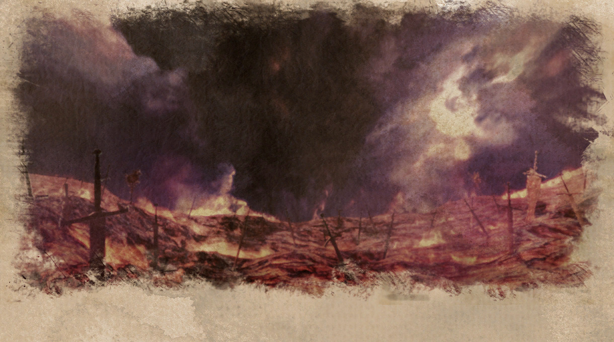

和以往的世界观不同，称为“人类与被精灵寄宿者的四名巫女之间的争斗的故事”。

发表之初的宣传语是“被残酷的命运和悲剧所左右的少女们的记忆”。

Paradise Ep2推出的角色和剧情为Crystal Ep2的前传内容。对应的宣传语是“少女们被精灵的力量灼烧着灵魂，诅咒着世界直到毁灭的那一刻。”

世界观中，成为巫女的角色后面的姓氏都会变成精灵的名号。

从打歌的背景可以找到Crystal Ep2角色们的武器。

这个系列的角色立绘和封面并不对应，而是分开来绘制的。

|
头像
| 角色   |日文原名|对应乐曲 |初出版本|
| ----------- | ----------- | ----------- | ---------- | ---------- |
|| [泰达·艾薇尼亚斯](/sibula/tidus.md)  |ティータ・アヴェニアス| 《混乱》 ～ Muspell      | Chunithm Crystal|
|| [米安·泰尔斯乌拉斯](/sibula/mian.md)|ミァン・テルスウラス| 《理想》 ～ Cloudland|Chunithm Crystal|
|| [西艾洛·梅薇](/sibula/cieo.md)  |シエロ・メーヴェ |《逃避》 ～ The Deserter     | Chunithm Crystal|
|| [朱娜·萨拉基亚](/sibula/juna.md)| ジュナ・サラキア|《最愛》 ～ Curse|Chunithm Crystal|
|| [圣女 安娜·玛尔格雷迪](/sibula/anna.md) |聖女 アンナ・マルグレーテ| 《運命》 ～ Ray of Hope| Chunithm Crystal|
| |[創造神 伊迪亚](/sibula/idea.md) | 創造神 イデア|《破滅》 ～ Rhapsody for The End|Chunithm Crystal|
|| [露琪亚·雷贝尔娜蒂特](/sibula/lucia.md)|ルチア・レ・ベルナデート  | 《狂乱》 ～ Cataclysm| Chunithm Paradise|
|| [米安·克雷斯塔尼](/sibula/mian2.md)|ミァン・クレスターニ|《投影》 ～ Oh My Baby Doll|Chunithm Paradise|
|| [希斯缇娜·梅薇](/sibula/sistina.md) |システィーナ・メーヴェ |《信仰》 ～ Eudaimonia| Chunithm Paradise|
|| [朱娜·菲利克斯](/sibula/juna2.md)|ジュナ・フェリクス|《選別》 ～ Refuge|Chunithm Paradise|
|| [维斯塔·格洛丽奥萨·佛缇娅](/sibula/vesta.md)|ウェスタ・グロリオサ・フォティア  | 《本能》 ～ ReCoda| Chunithm Paradise|
|| [原初的巫女·艾薇尼亚斯](/sibula/avenis.md)|原初の巫女アヴェニアス|《自戒》 ～ Paganelope | Chunithm NEW
|| [原初的巫女·泰尔斯乌拉斯](/sibula/telsuras.md)|原初の巫女テルスウラス|《紀律》 ～ As One| Chunithm NEW
|| [原初的巫女·梅薇](/sibula/mever.md)|原初の巫女メーヴェ|《種子》 ～ Set You Free| Chunithm NEW
|| [原初的巫女·萨拉基亚](/sibula/saragia.md)|原初の巫女サラキア|《偏愛》 ～ Shattered Memories| Chunithm NEW
||[火之精灵](/sibula/irius.md)|炎の精霊|《真紅》 ～ Pavane Pour La Flamme|Chunithm SUN PLUS
||水之精灵|水の精霊|《慈雨》 ～ La Symphonie de Salacia: Agony Movement|Chunithm SUN PLUS
||土之精灵|土の精霊|《楽土》 ～ One and Only One|Chunithm SUN PLUS
||风之精灵|風の精霊|《散華》 ～ EMBARK|Chunithm SUN PLUS
||希望的巫女·尼非谢|希望の巫女 ネフェシェ|《創造》 ～ Cries, beyond The End|Chunithm SUN PLUS

