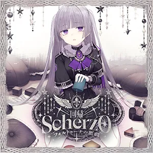

# 蕾娜斯·奥尔斯奎拉

| 角色信息   |  |
| ----------- | ----------- |
| 名称    |蕾娜斯·奥尔斯奎拉
| 年龄   |16岁
| 职业 | 魔导士官
|出身|土之国·奥伦|
| 对应曲   | 〚回帰〛 ～Scherzo ～フォルトゥーナの悪戯～
| 对应版本 |Chunithm X-Verse-X

警告：该剧情中含有残酷以及令人不适的描写，请谨慎观看。

## Episode 1 选定侯家的女儿

>我一定会掌握大权，回到这里。到时候，我们就住在一起吧，妈妈……

——为什么。为什么我要遭受如此残酷的命运？

 

蕾娜斯在漆黑的森林中拼命地奔跑着。远处传来的，是野兽的低吟。
 

——不要，不要吃我……我要回到妈妈那里。我不是你们的食物……！！

 

被恐怖所支配的她，眼中看到的一切都变得可怖起来。

从脚下跨过的树根，此刻看起来就像是盘根错节的手臂，从树干中破开的大洞，都像是一张张对她进行谴责的嘴巴。

太阳已经西下的夜空，也挂着一轮皎洁的月牙，就像是上天也在嘲笑着蕾娜斯一般。

 

——不要，不要啊……！救救我！妈妈……妈妈，妈妈，妈妈——

* * *

* * * 

“恭喜老爷！是个女孩！”

“赛菲，辛苦你了。”

“也谢谢你，亲爱的。”

 

看着正躺在接生婆的怀中嚎啕大哭的婴儿，孩子的母亲——赛菲利妮也露出了笑容。

 

“蕾娜斯……你能降生下来，真是太好了。”

 

蕾娜斯·奥尔斯奎拉，生于土之国·奥伦的选定侯家。

虽然奥尔斯奎拉家的之名早已不如往昔，但现在还是土之国中屈指可数的强势豪族。

奥尔斯奎拉世代以神职工作为其主业，代代都出了不少优秀的圣女与圣职者。

所以，身为嫡女的蕾娜斯，也被寄予了厚望，希望成为不辱先祖之名的圣职者。

 

“亲爱的，蕾娜斯还太小了！必须要给这孩子更多的关爱才行！”

“非也，不如说，现在已经太晚了。我奥尔斯奎拉家的人，生来便是需要施以优良教育，引导民众的人上之人。你也是知道这点，才会入赘于我们家中的，不是吗？”

 

在家族的传统面前，亲情也不过是无用之物。

深知这点的赛菲利妮，从此便心灰意冷，蜗居于自己的房中，闭门不出。

 

——啊，执掌命运的神明啊。

被本该赠予蕾娜斯的成堆玩偶环绕着，塞菲莉尼轻声哼唱着献给女儿的歌谣。

 

“真是的，温室里养出来的神职者就是这样……蕾娜斯，你身负奥尔斯奎拉之名，是被神明选中的非凡之子。你的层级本就与其他人不同，引领众生，便是你的宿命。”

“是，父亲大人。”

“嗯，真是个听话的好孩子。去吧。”

 

被父亲强行带离母亲房间时，蕾娜斯的耳畔始终萦绕着母亲的歌声，还有那首旋律轻柔的摇篮曲。

某天，蕾娜斯趁父亲不在，偷偷地来到了母亲的房间。可是，在那里的等待着蕾娜斯的，却是已经判若两人的母亲。

 

“蕾娜斯，今天想去哪里玩呢？”

 

她怀中紧紧抱着一个同样取名为 “蕾娜斯”的玩偶，温柔地抚摸着，仿佛那就是自己的亲生骨肉。

 

“妈妈，我就在这里呀……”

“哎呀，原来蕾娜斯想去看喷泉呀。”

“不是的！那不是我！我才是蕾娜斯啊！”

 

蕾娜斯急得伸手去抢那个玩偶，可母亲抱得太紧，凭她这点力气，根本无法撼动分毫。

 

“那，先去睡个午觉，之后再一起去吧？”

“妈妈！我就在这里啊！快看着我啊！”

 

不论蕾娜斯如何拼死呼喊，赛菲利妮的眼中，却始终只有那个玩偶。

 

“蕾娜斯！不是说了不准随便闯进来吗！”

“父亲！？”

 

蕾娜斯循声望去，只见父亲正带着一众侍从站在门外。侍从的身后，还站着一个眼神冰冷的女人。

 

“你要是继续待在这种地方，你也会变成这样的。来吧，跟我回去。”

“不，我不要！我要跟妈妈——”

“你在说什么？她只不过是把你生下来的一个女人罢了。”

“不是！我的妈妈，只有眼前的妈妈而已啊！”

“那你就叫她一声试试看，她会回应你吗？”

 

凝视着塞菲莉尼的脸庞，蕾娜斯用尽全部的力气大喊着。

 

“妈妈！我在这里啊！妈妈 ——！”

“呵呵，蕾娜斯也真是的，一听说要去散步就这么开心。那等我们吃完饭，就一起去吧。”

“妈妈……”

“这下你明白了吧？来人，把她带走。”

 

侍从们不由分说地抱起蕾娜斯，将她硬生生拖出了房间。

自始至终，她都没能和母亲说上一句话。

唯有那只被她下意识攥在手心的玩偶，成了连接她与母亲的唯一羁绊。

从那以后，为了让蕾娜斯彻底远离塞菲莉尼，父亲没有送她去贵族子弟就读的寄宿学校，反而聘请了数位专属家庭教师，让她终日埋首于各类课程之中。

她没有一丝属于自己的时间。

身边时时刻刻都有人监视。哪怕是在睡梦中，也能感觉到那无处不在的视线。

没过多久，蕾娜斯便觉得，这样的生活，和待在监狱里没有任何区别。

 

“我一定要离开这里，去那所学院。”

 

下定决心后，蕾娜斯将所有时间都投入到了学习中。

功夫不负有心人，凭借过人的天资与不懈的努力，她终于凭自己的实力，叩开了学院的大门。

那所学院里，汇聚了众多权贵世家的子嗣。

对于意图重振家族影响力的奥尔斯库拉家而言，蕾娜斯考入学院，无疑是一族复兴的象征。

父亲和新的母亲为此欣喜不已，还特意为她举办了饯行宴。

可蕾娜斯的心中，却对这两人充满了冰冷的恨意。

 

——你们就尽情地笑吧，笑到此刻就好。我会手握比你们更强大的权力，将你们从现有的位置上狠狠拽下来。总有一天，我还要把妈妈——

 

怀揣着这满腔的执念，蕾娜斯毅然踏上了离开奥伦的旅程。

## Episode 2 目标的顶点

>只要有那位大人作为靠山的话，就算是父亲想必也得乖乖听从。所以，我要朝着这所学院的顶点进发。

距离蕾娜斯进入学院就读已经过去了两年。

她进入了士官科。

这里是研习战争学、地缘政治学，以及学习如何指挥协同作战的步兵科部队的地方。

与以枪械操作、精灵之力掌控为核心课程的步兵科相比，士官科的课业内容繁杂晦涩，极难吃透。

若是没有扎实的学识底蕴，连跟上课程进度都很困难，因此在入学前，学员们就要经过层层筛选。

如此一来，学员自然会渐渐分化为优劣两派，而蕾娜斯无疑属于前者，稳居成绩的顶峰。

 

“蕾娜斯同学，要不要和我们一起——”

“我们家世世代代都是商人，想在奥伦开拓点门路——”

 

不知不觉间，蕾娜斯的身边围拢了不少人。

她们打着学习会、茶话会的旗号，要么想方设法要把蕾娜斯拉入自己的圈子，要么就是想借她的关系拉近家族间的往来，可以说，这里的每个人都心怀鬼胎。

面对这些邀约，蕾娜斯始终委婉地一一回绝，既不加入任何派系，也始终与众人保持着不远不近的距离。

和有权势的贵族建立人脉，对蕾娜斯达成目标至关重要。可她心里清楚，即便和这些人搞好关系，也未必能换来自己想要的结果。

因此，蕾娜斯选择在这所奉行实力至上主义的学院里持续创下佳绩，静静等候着“那个人”主动找上门来。

也就是学院的长老——奥蕾莉亚。

唯有和这位院长建立起深厚的联系，才是解救母亲塞菲莉尼的关键。

除此之外，蕾娜斯的心底还藏着一个念头：

 

（这些主动来搭讪的人，身上都散发着和父亲一样的臭味。满脑子只想着自己的利益。我……和你们不一样。）

 

**你的层级本就与其他人不同。**

 

父亲灌输给她的诸多话语里，唯有这句话，在她的心底深深扎根、悄然生长。

 

“我要在这里证明，我比任何人都要优秀。”

 

蕾娜斯从包里掏出那个玩偶，紧紧攥在掌心，在心中暗暗起誓。

对从前几乎足不出户的她而言，这座能够切实感受到自身优越性的学院，正是证明自己灵魂居于高处的绝佳舞台。

 

自那以后，蕾娜斯正式投身于对抗天灾兽的战事中。

按常理，学员需要循序渐进地适应实战，可蕾娜斯从一开始就展现出了不输老兵的惊人实力，在战场上屡立奇功，声望也随之水涨船高。

伴随着名声日盛，围在她身边的人越来越多，但与此同时，投向她的嫉妒与敌意的目光，也同样与日俱增。

 

“呵呵，随你们去做这些毫无意义的事吧。”

 

无论旁人如何在背后说三道四，在蕾娜斯眼里，这些闲言碎语都不过是点缀自己高洁灵魂的装饰品。

她刻意不与任何人深交，选择了孤高自守的道路。

于她而言，孤身一人的日子，既谈不上痛苦，也算不上煎熬。

这天，蕾娜斯一如往常结束了一天的课程，走在返回宿舍的路上，耳畔传来一群少女兴奋雀跃的交谈声。

 

“什么事这么热闹？”

她悄悄凑过去张望，只见人群中央站着一位身材高挑的金发少女。

那位少女眼戴眼罩，肩上扛着一把巨剑——正是艾蕾海姆。

她虽是士官科学生，却拥有着极强的战斗力，在学院里声名远扬。

她说话严厉、学识渊博，更有着一身凛然秀美的气质，深深吸引着众人的目光。

 

“艾蕾海姆同学，我们听说您在战场上的英勇事迹了！其实呢，拉比斯大人即将举办一场沙龙，要是您能赏光出席、给我们讲讲战场的故事，拉比斯大人一定会非常开心的！”

“……不、不用了，我——”

“别这么说，您可一定要来呀！”

 

在少女们的死缠烂打下，艾蕾海姆显得有些难以招架，最终还是拗不过众人，被簇拥着准备前往沙龙。

躲在暗处的蕾娜斯见状，露出了轻蔑的笑容。

 

“真是愚蠢。明明只是被人当作消遣的玩物，却半点没发觉自己正在浪费宝贵的时间——”

 

就在这时，即将被带走的艾蕾海姆，恰好与蕾娜斯的目光撞了个正着。

蕾娜斯被这突如其来的对视惊得心头一颤，连忙低下头掩住脸，慌慌张张地快步逃离了现场。

匆匆赶回宿舍后，她随手将外衣和手杖扔在地上，一头栽倒在床上。

 

“为什么……我会这样……”

 

连她自己都不明白，刚才为何会落荒而逃。

只觉得胸口隐隐传来一阵刺痛，她忍不住蜷缩起身子，双手抱膝。

 

“我和她们不一样……明明我的灵魂层级，和那些人根本不同……可为什么……会这样……”

 

蕾娜斯含着拇指，一遍遍喃喃自语，试图平复纷乱的心绪。

她的拇指指甲，早已被啃咬得参差不齐，边缘崩裂得如同被怪物啃噬过一般。

## Episode 3 怪人贝丝蒂

>果然是个如传闻般的怪人呢……不过，难得有这个机会接触，绝对要好好利用。

那天，蕾娜斯手持一份写着“调令”的文件，来到了某一处地方。

这里是学院里无人不知，无人不晓的某处场所，但也是恶名在外，谁都不愿靠近的地方。

穿过回荡着不知何种生物嘶吼的走廊，目的地便出现在眼前。

 

“魔物研究对策室……”

 

蕾娜斯望着那块字迹异常娟秀的门牌，迈步走进了这间透着古怪气息的房间。

与外面阴森昏暗的走廊相比，室内竟意外整洁，给人的印象截然不同。

 

“一个人都没有……”

 

对策室里感觉不到任何人的气息。调令上只写着“莉艾尔”这个名字，没有任何能表明她所在位置的信息。

光是找到这里、确认她在此处就费了不少功夫，没想到还要再花时间寻人。

 

“哈……虽然早有耳闻，但是也别把麻烦人物硬塞给我们小队啊。”

 

蕾娜斯忍不住将满心的不满与烦躁脱口而出，而这番话，竟得到了回应。

 

“可不行哦，人类小姐。还没见面，就用自己的标准去衡量别人。”

“欸？”

 

蕾娜斯像受惊一般猛地转过身，只见一位女子正居高临下地打量着她，镜片后的眼眸闪烁着异样的光芒。

 

“贝、贝丝蒂教官！您既然在这里，怎么不打声招呼啊！”

“因为没人叫我呀。”

“哈？”

“有事找我的话，就得喊我的名字。我对普遍的‘人类’可没什么兴趣。”

“是、是哈……”

 

这位有着“怪人贝丝蒂”绰号的教官，是研究天灾兽生态的权威。

性格虽然有些古怪，但专业能力毋庸置疑。

 

“话说回来，你找我有什么事？”

“我听说有位叫莉艾尔的人在这里，特来寻她。贝丝蒂教官知道她在哪儿吗？”

 

贝丝蒂瞥了一眼蕾娜斯递过来的调令，只“啊”了一声，随手指向里间的房间。

 

“莉艾尔小姐就在那里面哦。跟我来吧。啊，对了对了，千万别碰我的收藏品哦。”

 

在贝丝蒂的带领下，蕾娜斯穿过房间角落的一扇门。

两人走过两侧摆满玻璃瓶的通道，那些瓶子里塞满了碎成小块、连辨认不出部位的肉片，最终抵达了一间研究室。

 

“莉艾尔小姐，有客人来找你哦。”

 

随着贝丝蒂的话音，房门被推开，一股令人作呕的恶臭扑面而来。这股臭味浓烈到即便捏住鼻子也无法忍受，蕾娜斯皱紧眉头，忍不住向教官逼近一步。

 

“这、这是什么味道啊……”

“我刚才正让她帮忙做解体工作呢。”

“解、解体？解体什么——”

 

听到这惊悚的字眼，蕾娜斯下意识地后退一步。

 

“没错呀。要研究天灾兽的构造，就得把它们拆解得彻彻底底才行呢。”

 

说这话时，贝丝蒂的脸上露出了痴迷的笑容。蕾娜斯终于明白了，她为何会被冠上那个不太光彩的绰号。

 

“……那个，教官……您叫我吗？”

一个怯生生的声音从两人面前传来，说话的是一位皮肤黝黑、身材娇小的少女——她正是莉艾尔。

 

“是啊，叫你呢。这位人类小姐说找你有事，我就把她带过来了。”

“那个……请问您找我有什么事——啊！”

“啊？”

 

莉艾尔突然指向两人的身后。

可蕾娜斯和贝丝蒂回头望去，那里却空空如也。

蕾娜斯以为自己被捉弄了，语气顿时变得严厉起来。

 

“喂，你搞什么鬼？”

“啊、那个……我好像看到有个女人……”

“这不是什么都没有吗？别突然说些奇怪的话！”

“对、对不起……”

 

面对这说话吞吞吐吐的少女，蕾娜斯不顾教官就在眼前，直接表达了自己的不满。

 

“真是的，为什么要把这种人分配到我的小队里啊……”

“……对、对不起。”

“呼啊啊啊……唉，人类就是这样。”

 

贝丝蒂打了个大大的哈欠，一脸百无聊赖地看着两人，那眼神仿佛在说“真想快点回去”。

 

“您、您这话是什么意思！这种人待在小队里，会拉低整个队伍的评价的！”

“这我可就不知道啦。这孩子可是个射箭高手哦，我觉得她会很可靠的……对吧？”

“唉？啊……是、是的。”

 

即便贝丝蒂这么说，看着眼前连对视都不敢的莉艾尔，蕾娜斯心里的不安丝毫没有消减。

 

“哈……算了。总之，莉艾尔，你现在已经是我小队的一员了，给我打起精神来。”

“请、请多指教……蕾娜斯队长。”

“……啊啊啊！原来您就是蕾娜斯小姐啊！”

“别、别突然大吼大叫的！你搞什么啊！”

 

刚才明明给你看过调令了——本想这么说的蕾娜斯，转念想起贝丝蒂说过“对人类没兴趣”的话语，又将嘴边的话咽了回去。

 

“哎呀，我突然想起来了，之前我还跟奥蕾莉亚小姐提过，想请成绩优异的蕾娜斯小姐多多关照她呢。”

“唉……？您说的这个请求，是奥蕾莉亚大人的意思吗！？”

“嘛，差不多啦。”

“而且，您居然直呼奥蕾莉亚大人的名字……您对学院院长也太没规矩了吧。”

“嘛，因为我和她关系很好呀。”

 

绝对是她单方面这么认为的。

蕾娜斯本想拆穿她，又觉得这种争论毫无意义，最终还是选择了沉默。

 

“话说回来，您要拜托我的事，到底是什么？”

“是这样的，想请你去回收名为‘青骑士’的天灾兽。”

## Episode 4 被看透的心意

>在我的字典里，没有败北二字。我和奥蕾莉亚大人一样，都是注定成为站在塔尖的人。但是，为什么……

统称“青骑士”的这个存在，是天灾兽的特殊个体、

这是不知从何时起，开始在战场上被人们口耳相传的一种天灾兽。

天灾兽本是依据体型与外貌划分等级，可这一特殊个体却无法被归入任何类别。

它的身躯被苍蓝色的火焰包裹，因总是孤身仗剑战斗的姿态，渐渐被冠以“青骑士”之名。

贝丝蒂想要得到这个个体，多半是出于纯粹的好奇心，但对研究天灾兽的生态而言，这似乎也是必不可少的一环。

 

清晨，蕾娜斯召集小队成员来到作战室。在说明完以讨伐并捕获青骑士为目标的任务后，她向众人问到。

 

“距离作战开始还有些时间，大家有什么疑问吗？”

“……那个，我能问一个问题吗？”

“什么事？”

“我们也听说过，已经有好几支小队死在青骑士的手上了。面对那样的怪物，我们真的有胜算吗？”

 

队员们虽然嘴上这么说，实力却毋庸置疑。

蕾娜斯之所以能一路累积功绩，也并非全凭她一人的指挥调度。

支撑着队伍的关键之一，便是高昂的士气。

小队里既有信奉蕾娜斯的追随者，也有想借她的关系攀附其家族的人。

众人各怀心思，相互作用，才让整个队伍维系着一种微妙的平衡。

可即便是这样的队员们，也无法驱散对青骑士这头怪物的不安。

 

“你是在质疑我的指挥能力吗？”

“不，并非如此。”

“只要遵从我的命令，就不会有任何问题。迄今为止我们不都是这么一路走过来的吗？”

 

蕾娜斯将锐利的目光投向队员们。

 

“今后也绝不会改变。”

“是、是啊！有蕾娜斯大人在，我们绝对不会输给青骑士的！”

“嗯……说得对！”

“一定要打赢青骑士！”

 

蕾娜斯在心底暗自窃喜。

这种时候率先出声附和的，都是她的忠实信徒。她们自认是最理解蕾娜斯的人，总会抢在人前表现，以此来博取关注。

而蕾娜斯也利用了这点，刻意在队里安插了这么一小批追随者。

对于从小便被教导如何煽动人心的蕾娜斯来说，眼前的一幕不过是意料之中的光景。

判断队伍的斗志已然高涨的蕾娜斯，在告知了出发时间之后，便宣布解散。

就在队员们各自回房准备，作战室里只剩下蕾娜斯一人的时候，她不由得轻轻叹了口气。

 

“好了，我也该去准备——”

“蕾、蕾娜斯……队长。”

身后突然传来怯生生的声音，蕾娜斯猛地绷紧脊背转过身，只见莉艾尔正站在那里。

或许是因为拥有风之精灵的加护，她身上几乎没有散发出任何气息。

 

“别、别吓我啊。”

“啊……呜，对、对不起。”

 

看着低头道歉的莉艾尔，蕾娜斯一时竟不知该如何与她相处。

正如贝丝蒂所说，莉艾尔的箭术极为精湛，在队员中也是出类拔萃的水准，执行命令时也总是严格遵照指示，毫不含糊。

可蕾娜斯却总觉得，莉艾尔的身上还藏着不为人知的另一面。

 

“你不去准备吗？”

“我、我只要有这张弓，就、就没问题。”

“那你就慢慢准备到出发前好了。还是说，你也有什么问题要问？”

“啊……嗯，是、是的。”

 

话音刚落，莉艾尔便伸手握住了蕾娜斯的手。

 

“什、什么？”

“因、因为蕾娜斯你，看起来好像很不安……”

“……！”

 

莉艾尔的话，正中蕾娜斯的心事。

 

“我、我想让你能冷静一点……”

“你又懂我的什么！”

“因，因为你背后的那个女人……是这么说的……”

 

莉艾尔的指尖轻轻抚摸着蕾娜斯戴着手套的拇指。就在即将触碰到指甲的瞬间，蕾娜斯猛地甩开她的手，厉声喝道。

 

“别一副什么都懂的样子！”

“呜……对、对不起……”

 

莉艾尔像是受惊一般，慌忙逃离了作战室。

独自一人被留在房间里的蕾娜斯，一把扯下手套扔在地上，将拇指含进嘴里。

直到把指甲咬得残破不堪，她才终于稍稍平复了心绪。

## Episode 5 回转的车轮

>青骑士……今天我一定要让你声名扫地。乖乖成为我的手下败将吧！！

距离搭载着蕾娜斯小队的装甲运兵车驶离学院已经过去了两个小时。

他们正依照最新目击情报的地点，搜寻着他们的目标——“青骑士”，可这怪物似乎在战场上四处游荡，始终无从锁定方位。

坐在运兵车后排的蕾娜斯只觉时间白白流逝，心中焦躁难耐，忍不住烦躁地用脚尖踢着车厢地板。

 

“到底……藏到哪里去了？”

 

要在广袤无垠的大地上搜寻区区一个目标，本就不是件容易的事。

蕾娜斯满心郁愤，下意识地就想把拇指凑到嘴边。就在这时，负责从车顶瞭望口监视远方的队员突然大喊起来。

 

“蕾娜斯队长！发现天灾兽！”

 

车厢内顿时一阵骚动。待命在后排的队员们，目光齐刷刷地投向蕾娜斯。

 

“……等级是多少？”

“二级……不对，是一级！”

“那就别管它！”

“哎？”

 

队员一时没反应过来她的意思，满脸困惑地反问。

 

“可、可是……歼灭天灾兽是学院赋予我们的使命——”

“哈……吵死了。听好了，我们的任务是讨伐或捕获青骑士！除此之外的事，都和我们无关！”

 

“发现天灾兽即刻排除”——这是所有学院学员都铭记于心的铁则。

低等级的天灾兽本就构不成太大威胁，就算不借助操控精灵之力的西比拉，也能将其铲除。

但这绝非对眼前的敌人视而不见的理由。

理所当然地，队伍里那些认定蕾娜斯会依循铁则行事的人，当即提出了异议。

 

“我老家的城镇，就是因为疏于对低等级天灾兽的处理，才酿成了惨重的伤亡。谁也不能保证这只一级天灾兽不会冲向城镇！而且对付它根本花不了多少时间，就算顺手排除——”

 

蕾娜斯一声令下，运兵车骤然停了下来。

提出异议的队员以为自己的想法被采纳，脸上刚露出安心的笑容的时候。蕾娜斯冷冷地开了口。

 

“你……是蠢货吗？”

“……哎？”

“这么想去的话，你一个人去就好。”

“怎么能……”

“不服从我命令的人，根本没必要待在我的队伍里。立刻下车去战斗啊！开门！”

 

队员手忙脚乱地打开车门。

门外是一片空旷的荒野，若是被丢在这里，想回学院都难如登天。

 

“磨磨蹭蹭的干什么？赶紧滚下去啊？”

“……”

“你们也是！要是谁不服我的命令，尽管下车！”

 

蕾娜斯这番话，无异于一盆冷水浇头，众人顿时噤若寒蝉，再也没人敢出声反驳。

 

“我、我收回刚才的话。非常抱歉……”

“早这样不就好了。给我记清楚，你们还没资格对我顶嘴。别再浪费时间了。”

 

蕾娜斯简短地对驾驶员吩咐了一句“开车”，运兵车便缓缓重新启动。

车厢里的气氛凝重得让人窒息，不知道还要持续多久。

先前顶撞蕾娜斯的女队员，此刻正被众人投来混杂着同情与责备的目光。

 

“哈……真的有青骑士这种东西吗？”

 

蕾娜斯忍不住对着这乏味的任务叹气。

她正琢磨着要不要构思一下营救母亲的计划来转移注意力的时候，却突然察觉到运兵车的晃动有些不对劲。

 

“刚才……怎么回事？”

 

那只是车体单侧轻微晃了一下，之后便再无异常。询问坐在驾驶员身旁负责观察前方情况的队员，对方也表示没有撞到任何东西。

蕾娜斯心头莫名升起一股不安，打算起身让车顶的瞭望员汇报情况。可就在她刚要离座的瞬间——

 

——吱呀啊啊啊！！

 

一柄利剑猛地刺穿车顶，硬生生插进了车厢内部。

队员们被这突如其来的变故惊得呆立当场，一时竟无法动弹。直到顺着剑身滴落的大量赤红液体在地板上蔓延开来，众人才如梦初醒。

 

几乎就在蕾娜斯对驾驶员下达指令的同一时刻，那些赤红的液体突然被青蓝色的火焰吞噬，熊熊燃烧起来。

 

“驾驶员！把车顶那家伙甩下去！！”

“可是队长，车顶还有我们的队员——”

“来不及了！快把青骑士甩下去！！”

## Episode 6 青色火炎的骑士

>我可是被命运之神所祝福之人，跟你们这些人从骨子里可不一样啊。为什么你们就是不明白呢？

青骑士的剑刺穿装甲车的瞬间，瞭望口的缝隙里传来女队员撕心裂肺的惨叫，响彻整个车厢。

恐惧迅速在队员间蔓延，此起彼伏的尖叫淹没了一切。

可青骑士对此全然不顾，伴随着刺耳的声响，利剑猛地从车体中抽出。剑刃抽离后，车顶的破洞成了血与碎肉的通道，队员的残躯碎屑混着鲜血汩汩淌进车厢——队员们的恐惧瞬间被推向了顶峰。

 

“不要啊啊啊啊啊！！”

“驾驶员！快点甩开它！！”

“是——！！”

 

驾驶员猛打方向盘，装甲车的尾部顿时左右晃动了起来。

就在这时，一阵指甲刮擦般的刺耳声响过后，有重物滚落的声音传来。

声音有两道。想必是被杀死的队员的尸体，以及被甩下去的青骑士。

 

“全速前进！跟那家伙拉开距离！”

“明白！”

 

装甲车轰鸣着向前疾驰。这辆连三级天灾兽都能抵御的战车，竟被青骑士轻易洞穿，绝不能再让它靠近分毫。

蕾娜斯立刻得出了判断，仅凭一次交手便可知道，青骑士的威胁程度远超三级的天灾兽。

 

“贝斯蒂……那种怪物，她居然想让我们单独解决？”

 

无论心中如何愤懑，现状都不会改变。

对方就像凭空降临的天灾。可若是无法战胜它，蕾娜斯的所有计划都将化为泡影。

 

“我……我绝对不能死在这里！”

 

车体的剧烈晃动搅乱着思绪，蕾娜斯强压着慌乱，开始修改迎击青骑士的战术。

此刻的车厢早已是被惨叫所包围的炼狱。

当务之急，是重新鼓舞队员们的士气。

蕾娜斯一脚踩灭沾着碎肉的灯火，随即朝着队员们厉声喝道。

 

“都冷静点！现在开始执行作战！”

“队、队长，我们真的要和那种怪物战斗吗？不、不可能的啊……！”

“连上官的命令都不听了吗？只要我们不把那怪物捕获，这样的惨剧只会不断重演！”

“……！”

 

队员一时语塞。毕竟直到刚才，她还在向自己的队长据理力争前去歼灭弱小的天灾兽。

 

“青骑士的确拥有恐怖的力量，但它绝非不可战胜的对手！”

 

蕾娜斯推测，青骑士是极度擅长近身战的个体。也就是说，只要彻底限制住它的行动，或是保持距离展开远程集火、以消耗战拖垮它，就能将伤亡降到最低并完成捕获。

 

“说到底，这和应对普通天灾兽的基础战术没有任何区别，不过是远程集中火力而已。这么简单的事，谁都能做到吧？”

“是、是啊……现在想来，这不是理所当然的吗……不愧是蕾娜斯大人！”

“能行！这样一定能行！”

 

尽管仍有些畏缩，但蕾娜斯的信徒们已经开始主动活跃气氛。

就连那些战意全无的队员，神色也渐渐松动。

只差最后一把火了。

 

“好了，让我们去拿下青骑士——”

 

就在这时，一声沉闷的巨响轰然炸开。一柄利剑猛然击穿车厢后壁，径直刺穿了站在墙边的队员的头颅。

 

“……呃……啊……”

 

队员的脑袋从鼻梁以上的位置消失了，她像个坏掉的人偶般发出不成声的呜咽，轰然倒地。飞溅的血肉溅满了周围队员的身体。如此绝望的场景，已经足以让眼前的所有队员失去战意了。

 

“哇啊啊啊啊啊！！”

 

蕾娜斯小队自组建以来从未有过牺牲，此刻，瞬间横死于众人面前的队员，就仿佛点燃的炸药一般在众人心中炸了开来。亲眼目睹同伴惨死的队员们，再也无法承受死亡的恐惧。

事到如今，就算是蕾娜斯，也束手无策了。

——糟了。必须想点办法才行。

蕾娜斯的目光在车厢里慌乱地扫过，很快注意到了一件事。

队员中唯一没有陷入恐慌的，只有莉艾尔。蕾娜斯当即向她下令，让她去查看车厢后方的情况。

“莉艾尔！去确认后方的动静！”

“……啊，是、是！”

 

莉艾尔从没有被剑刺穿的那扇车门向外张望，却并未看到青骑士的身影。原来青骑士只是掷出了剑，杀死队员后便没了后续动作。

 

“没、没看到它！”

 

——这样的话……还有机会！

蕾娜斯立刻朝着队员们高声下令。

 

“青骑士已经丢掉了剑！现在正是压制它的好时机！所有人一起上，干掉青骑士——”

 

蕾娜斯的话音再次被打断，这一次，是青骑士从车门外投进来的苍蓝色火焰。

火焰恰好命中了站在门边的队员，瞬间将她变成了一根火柱。队员甚至没反应过来发生了什么，就惨叫着滚出了装甲车。

 

“和那种怪物战斗根本是找死！快逃吧！”

“这是命令！想活着回去，就给我攻击青骑士！”

“要去你自己去！谁知道该怎么对付那种怪物啊！”

 

另一名队员猛地冲到蕾娜斯面前，对着她嘶吼起来。

 

“没人愿意和那东西战斗！队长的职责，难道不是守护大家的性命吗！？”

 

生死关头，队员们瞬间就想通了——

他们找到了从这场绝境中脱身的办法。

 

“别、别胡闹！不打倒它的话……我们就是违抗军令！会被送上军事法庭，甚至判处死刑的——”

 

话音未落，满腔怒火的蕾娜斯突然被一股巨力掀飞，狠狠撞在车厢壁上。

 

“咳……！？”

 

蕾娜斯浑身脱力地抬起头。

她这才发现，自己竟被人狠狠推到了墙上。

眼前的女人半步未动，那么动手的人，一定是在场的某个队员。

先前和蕾娜斯争执的女人，缓缓朝着瘫在地上、连动弹都做不到的蕾娜斯走来。

她的手，轻轻按在了蕾娜斯的胸口。

 

“多谢你了，队长。”

 

下一秒，一股失重感席卷了蕾娜斯的全身。

她被自己亲手带领的队员，狠狠推出了装甲车外。

蕾娜斯最后看到的，是队员们如释重负的表情。

## Episode 7 无人能够逃脱命运

>为什么？为什么我要遭这样的罪？不要，不要不要不要不要！我不想死啊！！

“刚才发生的一切，都是意外！队长被青骑士投出的剑击中身亡，我们是迫不得已才逃走的！”

 

队员中，也有不少人压根没料到，真的会有人把蕾娜斯当成献给青骑士的祭品。

那个带头的女人伸手拍了拍因无法承受罪恶感而瘫坐在地的队员的肩膀，凑到她耳边低语：

 

“敢把真相说出去，我就杀了你。明白了吗？”

 

这片空间已然被恐惧与疯狂吞噬。

木已成舟。幸存者们唯有驾车狂奔，直到这场失控的逃亡被某个人强行制止为止。

所有人都被迫按照那个女人的吩咐，清理着蕾娜斯存在过的痕迹。莉艾尔默默看着队员们把蕾娜斯的行李一件件扔出车外，这时，策划了这场凶行的女人朝她走了过来，开口质问到。

 

“你之前好像和蕾娜斯走得挺近的……该知道什么话能说，什么话不能说吧？”

 

女人的手按在莉艾尔的胸口上，仿佛随时都能把她也推下车去。可莉艾尔却一脸淡然，语气还是和往常一样怯生生的。

 

“嗯……我知道的……蕾娜斯队长她……一定会没事的。”

“怎么可能没事！她面对的可是青骑士啊！”

“因、因为……有妈妈陪着她呢。”

“哈？你在胡说什么……”

 

在场的人，没有一个能听懂她这句话的意思。

* * * 

“呃……呜……”

 

被狠狠抛到地面上的蕾娜斯，终于从昏迷中悠悠转醒。

本该高悬天际的太阳，已然西斜。

必须立刻追上装甲车才行，否则一旦入夜——那可是天灾兽最擅长作战的时段。

 

“对，我得……呃！”

 

蕾娜斯连忙检查自己的身体，竟意外地没有大碍。想来是体内流淌的精灵之力，帮她缓冲了落地时的冲击。

身上既没有痛感，也看不到任何伤痕。

 

“明明晕过去了……居然既没被青骑士盯上，也没遭遇到其他天灾兽……”

 

不幸中的万幸。这简直是命运的恶作剧。

蕾娜斯一时间竟不知道该如何为这份因祸得福而欣喜，只能沿着装甲车留下的车辙，踉跄着向前走去。

又走了好一阵子，蕾娜斯在路边发现了散落的个人物品。她捡起自己的手杖，又快步冲到掉在一旁的包前，拉开拉链一看——里面正是那个从母亲房间里带出来的怪物玩偶。

 

“太好了……妈妈……妈妈……”

 

蕾娜斯紧紧抱住玩偶，那颗被不安撕扯得快要崩塌的心，终于渐渐平静下来。

她继续往前走。天色已经彻底临近黄昏，靠双腿走回学院，已经是不可能的事情了。

要说附近哪里能躲避天灾兽的追捕，大概就只有右手边那片看得见的森林了。

 

“还好这一带地势平坦……这样的话，就算遇到天灾兽，也能第一时间发现。”

“呃……呜……救命……”

 

就在这时，蕾娜斯隐约听到了一阵微弱的呻吟声。

声音是从前方不远处的岩石堆后面传来的。

蕾娜斯握紧手杖，小心翼翼地循声靠近，只见一道拖拽状的血迹，一直延伸到岩石堆那里。

她从岩石的缝隙里探出头张望，眼前的景象让她浑身一震——

一个女人正被几只小型天灾兽扑倒在地，腹部被啃噬得血肉模糊。

 

“……！”

 

四目相对的瞬间，蕾娜斯认出了对方。

这个女人，正是亲手把她推下车的那个主谋！

 

“这个……混蛋！”

 

当时的画面在脑海中一闪而过，滔天的怒火瞬间涌上心头。

可那个女人根本没察觉到蕾娜斯的愤怒，在看清她的脸后，立刻用充满希望的眼神望着她，朝她伸出了手。

那只手臂的肘部以下，已然被利刃齐刷刷地斩断，断面平整得触目惊心。

 

“救……救……命……”

 

救她？让我去救她？

这个女人，到底哪来的脸，敢向自己求救？

蕾娜斯虽然就读于学院，但并没有什么出众的术士天赋。她所拥有的精灵之力，和步兵科的学员比起来，都要逊色不少。也正因为如此，她才不得不选择了士官这条道路。

万幸的是，啃食女人的都只是些一级天灾兽，不过是些杂鱼罢了。

只要用手杖里镶嵌的水晶增幅自身的力量，应该就能轻松解决它们。

可问题是，对方是那个背叛了自己的女人。

自己凭什么要救她？

 

“救我……蕾娜斯！！”

“可恶……啊啊啊啊啊！”

 

满腔的怒火冲破理智，蕾娜斯猛地从岩石堆后跳出来，不顾一切地冲上前，将那些天灾兽尽数斩杀。

 

“哈……哈……”

“呃……蕾……娜……谢……谢……”

“你、你撑住！我这就把这些东西弄开！”

 

蕾娜斯试图挪开压在女人身上的天灾兽尸体，可当她搬开尸体的那一刻，整个人都僵住了——

女人的下半身，竟和她的手臂一样，被利落地斩断了，早已不知所踪。

 

“……呕——”

 

浓重的死亡气息扑面而来。

蕾娜斯不忍直视那被啃得面目全非、连原本形状都看不出来的内脏，捂住嘴别过了头。

 

“身、身体……动不了……我……我要死了吗……”

“你自己看看就知道了！伤成这样，怎么可能活下去……”

 

亲眼目睹一个活生生的人在自己面前走向死亡，这对蕾娜斯来说还是第一次。尽管她平日里总是刻意表现得冷酷无情，但说到底，她也不过是个涉世未深的少女。

 

“救……救我……”

 

蕾娜斯正僵在原地动弹不得，女人却伸出了那只尚且完好的手。

鲜血沾湿了蕾娜斯的黑色靴子。

看着这个女人拖着残破的身躯，用一只手在地上艰难地爬行、朝自己逼近，蕾娜斯恐惧不已，下意识地抬脚将她踹开。

 

“呃！别、别过来！”

“呜……啊……蕾娜……斯……为、为什么……为什么你……还能活着……”

 

女人用尽最后一丝力气，满脸怨毒地嘶吼着。

那些话语破碎不成句，只剩下赤裸裸的恨意。

可任凭女人如何嘶吼，那些带着怨毒的话语，却没能在蕾娜斯的心中激起一丝波澜。

 

“闭嘴！”

 

对这个女人的愤怒，此刻正灼烧着蕾娜斯的五脏六腑。

凭什么？凭什么背叛了自己的人，还有脸对自己怒吼？

如此荒谬绝伦的事，绝对不能容忍！

 

“这一切，都是你自己选的命运！是你不听从我命令的惩罚！你这种人，死了也是活该！”

 

蕾娜斯丢下这句冰冷的话，转身就跑。

身后女人凄厉的叫喊声，渐渐被风吹散，最终彻底消失在了夜色里。

## Episode 8 徒留轻声的呢喃

>妈妈，我们要永远在一起哦。

——为什么？为什么我非要遭遇这样的命运不可？

 

蕾娜斯在漆黑的森林里漫无目的地狂奔，一心只想逃离远方传来的野兽般的嘶吼。

 

——不要，我不想死。让我回到妈妈身边。我才不要变成那些怪物的晚餐……！

抛下那个企图杀了自己的女人后，蕾娜斯在路上撞见了好几具部下的尸体。

每具尸体上都留着明显是青骑士所为的痕迹，死状凄惨无比。

目睹如此多的惨死景象，蕾娜斯的精神几近崩溃。

就在这时，一群一级天灾兽出现在她眼前。数量并不算多，若是平时的蕾娜斯，用手杖就能轻松赶跑。

可此刻的她，满心都是对青骑士的恐惧，慌不择路地逃进了这片昏暗的森林。

黑暗笼罩的世界本就是天灾兽的领域。

主动闯入这不利境地的她，恐惧更是成倍翻涌。

被恐惧攫住的蕾娜斯，看什么都觉得阴森可怖。

在地上蜿蜒的树根，仿佛化作了缠上脚踝的女人手臂；树干上的大洞，似乎传来了斥责自己的声音。

夕阳沉落的天际，一弯残月正居高临下地俯瞰着她，像在无声地嘲笑。

 

——不要，不要啊……！救救我，妈妈，我好想回家！妈妈，妈妈，妈妈啊——

 

她只顾着埋头狂奔，没留意脚下的树根，狠狠摔了一跤。

身上的东西散落一地，潮湿的泥土混着枯叶钻进嘴里。

口腔里的异物感让她一阵反胃，反射性地想要起身——刹那间，一阵钝痛猛地袭来，她像断了线的木偶般再次摔倒在地。

 

“呃啊啊啊——！？”

 

她的右脚踝以一个诡异的角度扭曲着，显然是摔断了。即便咬紧牙关强忍，剧痛还是毫不留情地啃噬着蕾娜斯的神经。

 

“呜……！啊啊啊啊啊啊啊！”

 

她只能靠尖叫来维持最后一丝理智。

叫喊过后，疼痛似乎稍有缓解，可代价却太过沉重。

 

“——！！”

“噫……！？”

 

黑暗的彼方，传来了震得地面微微发颤的天灾兽咆哮声。

那东西隐在暗处，看不清大小，但至少有二级的水准。

随着天灾兽不断逼近，一股浓重的死亡气息扑面而来。

 

“哈……哈哈，哈哈哈哈哈哈！”

 

无论逃到哪里，都躲不开死亡的命运吗？

她本该是蒙受神明祝福、被神选中的人。

为什么，为什么非要被神明抛弃不可……不对，难道那个怪物，才是执掌命运的神吗？

 

“哈哈哈……搞不懂了，我已经搞不懂了啊啊啊啊……！”

 

蕾娜斯连向神祈祷的力气都没有了。

绝望之中，天灾兽的巨臂朝着她的头顶狠狠挥下。

就在这千钧一发之际，蕾娜斯下意识地向后伸出手，指尖触到了一个柔软的东西。

那正是那个怪物玩偶——从妈妈房间里带出来的那个玩偶。

 

——妈妈！！

 

蕾娜斯猛地侧身翻滚，堪堪躲过了天灾兽的利爪，却让受伤的脚重重磕在地上。

可此时此刻，脚踝的剧痛已经无关紧要了。

必须赶在其他天灾兽围过来之前，杀了眼前这头怪物，活下去。

蕾娜斯一把抓过腰间饰品里封印着精灵之力的水晶，将力量一口气释放出来。

耀眼的光芒瞬间笼罩四周，被夺去视线的天灾兽顿时僵在原地。

蕾娜斯抓住这一瞬的间隙，捡起掉落的手杖，用尽全身力气朝着天灾兽的头部狠狠刺去。

然后，将体内所有的力量倾泻而出。

 

“啊啊啊啊啊啊啊！！”

 

在精灵之力的洪流席卷下，天灾兽的头颅被轰得粉碎，尸骨无存。

 

“哈啊……哈哈哈！做到了，我做到了啊……！”

 

她的脸上沾满了血、泪和天灾兽的体液，狼狈不堪。

怒气渐渐褪去，脚踝的疼痛愈发剧烈，她已经连站都站不起来了。

而身后，其他天灾兽的嘶吼声，已经近在咫尺。

 

“呼……呼……呼……”

 

蕾娜斯大口喘着粗气，拼命思索着能从这绝境中活下去的办法。

终于，一个念头在她脑海中浮现——

 

“——啊啊啊啊啊！！”

 

蕾娜斯突然将手杖狠狠刺入天灾兽的腹部，用力向下一划，硬生生将它的肚子剖开。

紧接着，她双手捧起涌出的黑色体液，不顾一切地往自己头上、身上浇去。

一遍又一遍，仿佛要将自己的存在彻底掩埋。

浑身沾满腥臭体液、变得漆黑一片的蕾娜斯，扒开天灾兽的内脏，蜷缩着钻了进去。

这是利用天灾兽尸体隐藏气息的苦肉计。

就在蕾娜斯躲进尸骸的瞬间，好几道脚步声在周围响起。

肌肤感受着尸体内残留的、令人毛骨悚然的温热，蕾娜斯紧紧抱着怀里的怪物玩偶。

 

“不要……不要……我不想死啊……”

 

脚步声久久不散，最终在她藏身的尸骸周围停下，紧接着，此起彼伏的野兽般的咆哮响彻林间。

 

“——！！”

 

仅仅隔着一层薄薄的皮肉，外面就是步步紧逼的死亡。

难以言喻的恐惧，无情地蹂躏着蕾娜斯濒临崩溃的心。

 

“不要啊……妈妈……妈妈——”

 

同伴们一个个惨死的模样，在她脑海中反复闪现。

那个女人的内脏被啃噬的声音，在耳边挥之不去。

她很清楚，一旦被发现，自己也会落得和她们一样的下场。

光是想想，她就呼吸急促，耳鸣阵阵。

剧烈跳动的心脏，仿佛下一秒就要从喉咙里蹦出来。

 

“好可怕……太可怕了啊……妈妈……救救我……妈妈啊——”

* * *

那之后，蕾娜斯·奥尔斯奎拉被负责回收遗体遗物、送交遗属的小队发现了。

她躲在散发着血液、内脏和排泄物混合的、令人作呕的恶臭的天灾兽尸骸里，整整三天三夜没有合眼。

她的模样早已不复往日，只是空洞地望着虚空，一言不发。

没人知道，她究竟承受了何等撕心裂肺的恐惧。

回收小队的一名男子曾好奇地追问她遭遇了什么，可当他看到蕾娜斯那光秃秃的指甲，听到她嘴里不停念叨的胡话后，便悻悻地放弃了。

 

如今，蕾娜斯待在一处特殊的设施里。

那是收容战争中的伤员的收容所——别名“庇护院”。

这座坐落于学院管辖的城区一角、风格迥异的建筑，收容着那些再也无法重返战场，也无法回归正常生活的人。

被送到这里的人，都要在被管制的日常中，等待着能再次“发挥作用”的那一天。

 

“已经到午饭时间啦，蕾娜斯。”

 

正呆呆望着窗外天空的蕾娜斯，突然露出一个天真的笑容，朝着看护的职员小跑过去。

 

“……妈妈，妈妈。”

“呵呵，跑这么快呀。看来是很开心呢。今天天气这么好，要不要一起去散散步？”

“嗯！”

“好好好，那我们先吃完饭再去哦。”

 

女职员隔着铁栅栏准备午餐的时候，蕾娜斯被床头传来的、断断续续的摇篮曲吸引，又跑回了房间里。

 

“哎呀……真是个调皮的孩子。”

 

蕾娜斯住的这间白色病房，无独有偶，竟然和她母亲曾经的房间一模一样。

堆积如山的积木和玩偶，奏着轻快旋律的摇篮曲。

还有那个被污渍染得看不出原本颜色的怪物玩偶。

蕾娜斯抱着玩偶，脸上洋溢着幸福的笑容，轻声低语。

 

“妈妈，我们要永远在一起哦。”

 

她就这样，感受着最爱的妈妈的气息，一天天活下去。

活在只属于她们两人的、永远不会被任何人打扰的世界里。

