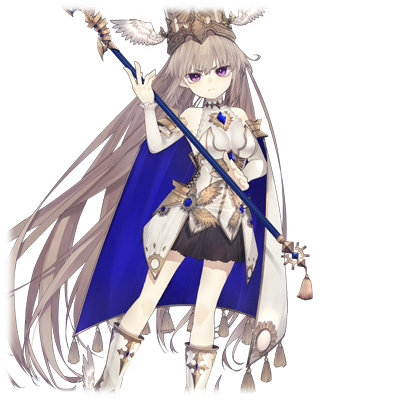

 

# 圣女 安娜·玛尔格雷迪

| 角色信息   | |
| ----------- | ----------- |
| 名称    | 圣女 安娜·玛尔格雷迪      |
| 年龄   | 15岁        |
| 职业 | 人类的希望——圣女  |
|所属国家|罗姆尼斯联合|
| 对应曲   |《運命》 ～ Ray of Hope   |
| 初出   | Crystal Ep.2     |

## Episode 1 一章：临终的世界

> 人类说不定就是这么的愚蠢。即便如此，圣女也必须为了人们挺身而出。

由神制造出来的人类，以及让世界变得多姿多彩的精灵们，两者共同生存在这个世界上。

从某个时候开始，人类将自己的生命献给精灵，从而让精灵寄宿到他们的身上，从而产生了大自然的代言人——巫女。

巫女们秉持着造福人类世界的志向，操纵自然的力量，大幅推进了文化的繁荣，人们也过上了富足的生活。

然而，在这个世界渐渐变得繁荣起来的途中，人的内心也被黑暗的东西所侵染。

“想将他人的繁荣成果据为己有”。

就像这样的念头开始产生，而人类也开始了争夺的历史。

而被战争卷入的巫女们，由于人们各种不可理喻的行为，最终纷纷对世界绝望，从这个世界上消失了。

 

而这些历史，都是我——被众人选中作为圣女的安娜·玛尔格雷迪，出生以前发生的历史。而这些历史，也成为了创造神伊迪亚进攻人类的原因。

为了对抗神的进攻，人类需要一个希望的存在，也就是巫女的替代品。

而他们所选择的替代品，就是圣女。

我从初代的圣女那里继承了力量，成为了第二代的圣女。

最开始我还曾经为这过度奢侈的生活而欣喜，向着连存在本身都不得而知的神明祈祷，然而连人们的声音都不曾入耳。

后来，随着与神的交战日渐接近，我也不得不履行起了圣女的职责。

成为人们希望的象征，成为人们的力量。这就是我身为圣女的使命。

无论如何，我都必须完成我的使命。这就是作为圣女而付出的，名为自由的代价。

所以我要为人们发誓。

直面创造神·伊迪亚，并且以人类自己的力量获得胜利。

即便最后与神同归于尽——我也必须选择这条道路。

## Episode 2 二章：崩坏的世界

> 曾经，有着为大自然带来恩惠，养育着这个世界的四名巫女。现在失去了她们的整个世界，正渐渐地走向崩坏的末路。

这个世界，曾经有四名各自掌管着火，水，风，土四种能力的巫女。

四名巫女使用着她们的力量，为大自然带来恩惠，为人类带来快速的发展和繁荣。

然而，由于对巫女过度的崇拜，有些人将魔爪伸向了巫女，希望支配她们。世界也开始慢慢地走上了歧路。

这些不和谐的东西最终变成了引发战争的火种，将整个世界卷进了一片混沌。

而被人类的争斗卷入的巫女们，在这些战争中遭遇了各种各样的悲剧，甚至绝望到了希望整个世界都毁灭的地步。

而对这个世界而言，深深的绝望与死同义。

四名巫女就这样，卷入人类开展的战争，并且最终悲惨地从这个世界上消失了。

而失去了控制自然的力量的巫女们后，这个世界开始出现各种各样人类无力抵抗的自然灾害。

## Episode 3 三章：灭绝人类者

> 神化身为年幼的少女的姿态。而她正是为人类带来破灭的存在。

自从巫女从这个世界上消失之后数年，世界崩坏的脚步突然加速了。

“我是创造神·伊迪亚。作为创造这个世界的神，前来灭绝愚蠢的人类的存在。这个世界已经无比丑陋，没有留着的意义。我要将你们灭绝，然后创造新的世界。”

以年幼少女的姿态现身，自称为神的存在，从比阿基迪斯更远的北方的极寒大地召唤出了被称为“黑暗的野兽”的异形魔物，冲向了阿基迪斯的首都。

光是魔物的出现就给人们带来了恐慌，当人们看到曾经销声匿迹的四名巫女们的力量在伊迪亚手中自由地操控的时候，人们束手无策，只能坐以待毙。

“人的生命，竟然这么脆弱，真是不值一提的东西。”

伊迪亚只是挥动一下手指，眼前众多的人类就被强大的力量夺走了生命。

即便听着无数人的悲鸣，伊迪亚也丝毫不为所动，脸上丝毫看不出喜怒哀乐。

对于伊迪亚来说，这场进攻，不过是将自己曾经创造出来的失败作品从这个世界上彻底清除掉的工作罢了。

而在神明的自私想法中，曾经依靠火之巫女而发展起来的阿基迪斯的王都，只花了一个晚上就彻底地从地图上被抹去了。

## Episode 4 四章：圣女诞生

> 没有任何特别的力量的普通少女，被人们抬上高位，被人冠以希望的象征所崇拜。

自称为创造神的伊迪亚的力量实在是太强大了，人类无法对抗，只能四处逃窜。

而活下来的人们，纷纷逃向了曾经因为战争而彻底荒废的鲁斯拉的土地。

注意到已经不能继续内斗的人们，集结了阿基迪斯，鲁斯拉，迪奥基亚三地的人民，组成了罗姆尼斯联合。

然而，只是把人聚集起来，是不足以打倒拥有全部巫女力量的伊迪亚的。

人们分析了当下的情况后，认为现在必须要拥有的是，具有曾经的巫女那样强大，甚至超越她们的超常力量。

然而，精灵已经从这个世界上消失了，而人们也不知道如何再次让精灵降临于世的方法。

即使这样仍旧希望找到希望的象征的人们，最终编造出了“持有特异的力量的人”——也就是圣女的存在。

被选中为初代的圣女的，是来自鲁斯拉的贵族少女。

当然，少女并没有什么特别的力量，除了样貌比别人好看之外并无特别之处。

然而即便是这样普通的少女，当被人塑造成“拥有特别的力量的圣女”之后，成为了人们的希望的象征，从而提高了大家的士气。

于是乎，希望从绝望中脱离的人们开始崇拜起了圣女，从而产生了子虚乌有的信仰。

 

然而这样的局势并没有持续很久。

被称为圣女的少女冲上了前线，在和伊迪亚对抗的过程中，不幸失去了生命。

毕竟本来就是没有什么特别力量的少女，这个结果可以说非常合理。

虽说如此，人类也不是只有坏消息。

在创造神·伊迪亚杀死了初代圣女后，为了恢复全部的力量，陷入了沉眠。

对于人类来说，这段时间是为对抗神明而做准备的最后机会了。

 

而人们做的第一件事，就是立刻选出第二名圣女。

圣女的存在已经成为了人们的希望象征，如果失去了这个存在的话，对于人类来说毫无疑问是精神上的重创。

而想到这点的人类，通过“从初代圣女那里继承了力量”这样的理由，选出了第二代的圣女——一位名为安娜·玛尔格雷迪的少女。

年纪尚小的安娜和初代圣女一样，并没有什么特别的力量，只是因为长相好看的理由便成为了下一代的圣女。

即使是这样仓促地让安娜成为了圣女，人类反抗军持续低迷的士气也在显著地恢复。

这就足以证明，圣女对于现在的人类来说是多么不可或缺的存在。

而人们做的第二件事，就是尽可能地增强战力，对抗伊迪亚。

不仅士兵们的装备得到了强化，人们还开始大幅生产火枪和大炮等热兵器。

不仅如此，人们还注意到了那些曾经被巫女所使用过的武器上，还残留着精灵的些许力量。

虽然这些残留着力量的武器无法直接投入实战，但是以这些武器的碎片为基础，人类还是开发出了被认为会对创造神·伊迪亚有效的新装备。

 

就这样经过了数年，等到第二代的圣女安娜成长到15岁的时候。

创造神·伊迪亚再次降临至这个世界，率领着魔物的大军攻向了她所驻守的地方——圣都·瓦尔瓦拉。

## Episode 5 五章：少女安娜

> 我现在所经历的，是只需要对着连存在与否都不得而知的神明祷告的无聊日常。即便是这样无聊的日常，也代表着和平。

——圣都·瓦尔瓦拉。

这座位于城塞都市·安谢塔的更南端的城市，正是那些被伊迪亚的进攻破坏了家园，无处可逃的人们最后的堡垒。

在瓦尔瓦拉的圣堂里，圣女·安娜正在人们的面前诚心祈祷。

“真正的神明啊……请救救我们吧……”

那祈祷的样子仿佛带着一股神秘的气息，看着这样诚心祈祷的圣女，人们心中的伤痕也在渐渐地平复。

甚至在场的人还感动得落下了眼泪，可以说安娜的存在本身就是人们的救赎。

祈祷仪式结束后，安娜微笑着向人们道别，回到了自己的房间。

等走到了别人看不到的地方后，安娜大大地叹了一口气。

从温柔的笑容瞬间一变，露出了一副百无聊赖的表情。

“这样今天的祈祷就结束了呢。”

“辛苦了。圣女大人。”

结束了每天的工作，本以为已经解放了，结果侍从又从身旁冒了出来。安娜皱着眉头露出不爽的表情。

 

“好好，谢谢关心啦。到底弄这样的仪式有什么作用啊？”

“圣女大人，这话可不能乱说啊。”

“但现实不就是这样吗。就算刚刚才祈祷着‘神啊请救救我们’什么的，但是那个所谓的‘神’，不是现在正在准备毁灭我们吗？这也太奇怪了。话又说回来，光是有个叫伊迪亚的‘创造神’什么的就觉得很奇怪了。”

“此话怎讲？”

侍从歪着头询问着这句话的含义，安娜望向了窗外。

“我听说创造神·伊迪亚操纵着和曾经的巫女一样的自然之力。但是你看看，外面这蔚蓝的天空。还有外头平和的街道。这些东西难道不能证明现在还很和平吗？”

“现在说不定是这样，但是总有一天这里也会变为战场的……圣女大人现在还是需要有点身为圣女的自觉比较——”

“安啦安啦，我知道啦。圣女是人们的希望的象征对吧。为了大家，以后也会向着能‘拯救我们的神’祈祷的啦。”

安娜成为了圣女后，已经过了数年。

然而这副仍未对圣女的职责有所自觉的样子，令侍从们只能叹气。

## Episode 6 六章：无知和幸福

> 对世界的真相毫不知情，圣女就这么自由自在地活着。和神之间的战斗什么的，一直当成不存在的童话故事。

安娜的一天行程，除了向神祈祷，以及出巡和人们见面以外，别无他物。

而在完成了这些公务之后，安娜就必须回到在圣堂里自己的房间，连外出也不被允许。

虽然每天都必须被关在屋里这点并非没有怨言，但是身为圣女的生活还是宛如天国一般。

每天都能吃到美味的饭菜暂且不提，如果有什么东西想要的话都能立刻拿到。

虽然说是为了对抗创造神·伊迪亚而拥立起来的位子，但是和神的争斗什么的暂时不过是只存在于虚构中的事情罢了。

常年生活在这种环境中的安娜，也渐渐变得任性起来。只能说是无可奈何了。

“呐，我口渴了。能不能给我来杯茶呢？还有，感觉有点饿了呢。能不能给我送点吃的东西过来呢。”

听着躺在屋内的安娜的命令，侍女立刻就走出了房间前去准备东西。

安娜在目送着离开房间的侍女，轻轻地叹了口气望向窗户。

“那些大人物们说要把我送到前线什么的，不知道是不是真的呢……。听说上一代的圣女就是命丧于战场的。万一我要是上了战场，也会死的吧……我可不要这样……！”

虽然对和神之间的战斗这点仍然当成虚构的故事，然而一旦听说要前往前线的战场，还是会害怕的。

要前去那种可能丧命的地方，会害怕是人之常情。

有没有什么方法能不去战场呢。

在侍女回来之前，安娜仍旧在苦恼着这个问题。

## Episode 7 七章：血染的圣衣

> 眼前看到的是宛如噩梦般的光景。飞散的血液，甚至将圣女的长裙染成了红色。

为了向身为圣女的安娜寻求帮助，前来巡礼的人络绎不绝。

虽然能和安娜说上话的时间是很有限的，但是圣堂门前每天仍然门庭若市。

 

“和伊迪亚的战争很快就能结束。只要大家还活着的话，未来就在我们手中。”

“曾经引导着我们的精灵，它们肯定还会再次降临的……在它们到来之前祈祷吧。”

“没问题的。我们一定能够将神打倒的。”

这些话不过是模板化的回答，安娜只是机械地念出来，并未投入一丝感情。

即便如此，听到的人们仍然会恭敬地倾听安娜的话语，有的甚至感动落泪。

像这样的日子，肯定会一直持续下去的吧。

安娜像这样想着，度过了一天又一天。直到某一天的来临。

那天，圣堂运来了大批的伤兵。看到这幅场面的安娜不由得紧张起来。

 

“这是怎么了？发生了什么事！？”

“……水之都·迪奥基亚被攻陷了……创造神·伊迪亚带领的魔物们，现在正陆续进攻着鲁斯拉的领土……！”

“怎么会这样……！快点给这些人治疗！”

躺在圣堂的伤兵们所说的话语，对于安娜来说，仿佛是在听着另一个世界发生的事情。

明明是一成不变的日常，明明身在一成不变的地方。

但是为什么，呈现在安娜眼前的，却是迄今为止从未见过的悲惨光景。

（这到底是，什么……难道说，战场的情况比这里还要糟糕吗……？像这样的事情，我从未去了解过……！）

安娜呆呆地站在原地，似乎仍然对眼前的这幅光景无法接受。

“圣女大人……！”

有一名士兵接近了安娜，而走路的途中因为伤口的缘故倒在了地上。

伤口撞击到地面的时候溅出了鲜血，将安娜纯白色的长裙染成了红色。

“圣女大人，还请救救我们……！”

“……嗯！？”

倒在地上的士兵，仍然拼尽全力向着安娜伸出了手。

然而对于平日与战争绝缘，持续过着安稳日子的安娜来说，眼前的画面未免太过可怕了。

但是安娜并没有发出尖叫，不知是不是想起了圣女的职责所在呢。

然而，身体中还是感觉到了一股逆流而上的气息，安娜只能对着附近的侍从耳语。

“圣女大人的身体状态似乎欠佳。还请回到自己房间休息吧。”

“……嗯嗯，虽然有点抱歉，不过还是让我先告退吧。”

注意到情况的侍从帮忙打了圆场，安娜很快回到了自己的房间。

亲眼目睹重伤的士兵，初次体会到与神之间的战斗为何物的安娜，刚回到房间就将胃中的东西吐了出来。

## Episode 8 八章：圣女的职责

> 理解了众多人们的悲伤的圣女，终于萌生了身为圣女的自觉和使命感。

自从目睹伤兵出现在自己的眼前后，安娜的日常发生了天翻地覆的变化。

曾经以为是另一个世界才发生的残酷战争正化为现实在自己眼前，并且不断地侵蚀着自己的日常。

送到圣堂的伤兵越来越多，有的人直接失去了生命。

自从收到迪奥基亚被攻陷的消息之后，几乎每一天，都是这个样子。安娜什么也做不了，只能望着这一切在眼前发生。

“只是被赋予了‘圣女’之名的我……到底能为这些人做什么……？ ”

战斗方面的话题安娜并不了解，而她也没有治疗受伤的士兵们的能力。

虽然平时只能站在那里，然而还是有很多的人因为安娜身为圣女的身份而前来觐见。

有一次，圣女收到请求，前去照顾一名濒死的士兵。

“……你已经很努力了。请好好休息吧。”

“……啊啊……在弥留之际……能被圣女照顾着，前往那个世界……是我最大的心愿啊……”

不知是否看到士兵已经用尽了力气，安娜握住了士兵伸出来的手。

士兵露出了安心的笑容，闭上了眼睛。

“爸爸……妈妈……呜呜……呜呜……”

“很辛苦对吧……很寂寞对吧……”

面对着失去双亲而嚎啕大哭的孩子，安娜默默地陪在孩子身边，尽自己最大的努力，希望能安抚住那份悲伤。像这样的场合，也并不少见。

“这是我作为‘圣女’才能做的事情……不知能不能稍微安抚人们心中的不安和悲伤呢……”

在接触到了众多人们内心各种各样的伤痕和悲伤后，安娜慢慢开始思考着这些问题。

安娜很清楚，想要将全部人们的悲伤消除，是绝不可能的事情。

然而，她希望，能在眼之所及，力所能及的范围内帮得上忙。

只要背负圣女之名的自己的笑容不会消失的话，压迫着人们的悲伤和不安想必也能烟消云散吧。

“竭尽全力缓和人们的悲伤，保护人们的笑容。这就是，我作为圣女所能做的事情。”

开始接受神与人之间的战争这一现实的安娜，终于萌生了作为圣女应有的自觉和使命感。

## Episode 9 九章：圣女安娜

> 在灭绝人类的神明面前，毫不放弃笑容的圣女，成为了人们的希望。

迪奥基亚被攻破之后过了一阵子。

安娜得知了作为最终防线的城塞都市·安谢塔也被攻陷了。

“怎么会这样……看来，伊迪亚最终攻入这座瓦尔瓦拉看来也不过是时间的问题了呢……”

想到瓦尔瓦拉即将成为战场的安娜，感觉到了自己的无能为力，握紧了拳头。

由于伊迪亚的大举进攻，人类能生存的地方已经只剩下瓦尔瓦拉了。从各地逃难而来的人们已经挤满了瓦尔瓦拉的街道。

一旦瓦尔瓦拉最终被攻破的话，那就意味着人类的彻底落败。

面对这生死存亡的时刻，人们心中的不安开始膨胀。

即便如此，安娜仍然没有放弃那份笑容。

她始终坚信，缓和人们的悲伤，努力将自己的那份精神分给别人，正是自己应该起到的作用。

没问题的，我们一定能打倒神。

同样的鼓励之言和之前说的别无二致。

但是从已经萌生圣女的自觉的安娜口中说出来之后，显得更加有力，治愈了人们的心灵。

而安娜也受到了人们更高的崇拜。

“您终于有所成长了呢，圣女大人……”

“不，还不够呢。我必须成为人们的精神支柱，在最终打倒神明之前，都不能松懈。”

对于一直服侍着安娜的仆从来说，现在觉醒了作为圣女的自觉的安娜正是他们理想中的形象。

已经再也看不出曾经那个任性妄为，毫无自觉的安娜的影子了。

“创造神伊迪亚……我们是绝对不会屈服于你的。我们一定，要打倒你，将人类的未来夺回来！”

面对向着人类施加不可理喻的死亡与痛苦的恶神，安娜感受到了愤怒。

而与此同时，面对拥有强大力量的伊迪亚，安娜还是感觉到了一丝不安，到底人类能不能胜过神明呢。

“……可不能在这种时候气馁啊。”

安娜小声地说着，扫除了不安。

至少，作为圣女的安娜，是不能为此不安的。

因为，她是必须随时带着坚定的笑容，成为人们的希望的圣女啊。

## Episode 10 十章：聚于大旗之下

> 圣女发誓，一定要打倒神明，让世界重新和平。而决战的时刻已经逼近。

由于城塞都市安谢塔已经被攻破，创造神伊迪亚的大军到达安娜所在的圣都·瓦尔瓦拉，也不过是时间的问题了。

而安娜为了消除人们的不安，决定为了守城的士兵们，发表激励的演说。

集结到圣堂门前的人们看到安娜从圣堂里走了出来后，纷纷静了下来，等待着安娜的发言。

安娜在行礼向大家致意了之后，便慢慢地开始了演讲。

 

“我是圣女，安娜·玛尔格雷迪。我成为了人们希望的象征，一直陪着各位走到了今天。想必这点，在未来也不会改变。创造神·伊迪亚，很快就要率领异形的魔物大军来到这座圣都·瓦尔瓦拉了吧。”

当人们听到神明的名称时，脸色纷纷暗淡了下来，注意到这点的安娜皱起了眉头。

“我很清楚，在座的各位心中的不安。敌人并非人类，而是由神明所率领的魔物大军。因为他们的攻击，迄今为止牺牲了多少生命，光是想象这个数目，都令人心惊胆战。”

安娜从悲伤的表情一瞬转变成了充满希望的笑容。

“即便如此，我们仍然不能舍弃希望。对抗神明的方法，我们仍然握在手里。的确，敌人拥有压倒性的力量，在这力量面前的我们显得如此脆弱无力。”

安娜的身影充满了希望，人们纷纷从低落中恢复，抬起了头望着她。

“但是，我们人类只要手牵手，互相合作的话，即便是神明的强大力量，我们也能够抗衡。虽然看着这座瓦尔瓦拉成为战场有点于心不忍，但是，这座城市是我们人类最后的堡垒。让我们打败神明，为这个世界带来和平吧！”

 

话音刚落，人群中便爆发出了震天的欢呼声。

不管是心中抱持着不安的市民们，还是即将奔赴死地的士兵们，他们脸上的表情都稍微夺回了光彩。

只要不放弃的话，即便是强大的神明所带来的破灭的命运，也能够打破的吧。

看着台下的人们，安娜更加确信了这点。

## Episode 11 十一章：箱庭之主

> 为了打破即将灭亡的命运。人与神的战斗，终于来到了最后一幕。

创造神·伊迪亚，终于现身于瓦尔瓦拉的城下。

伊迪亚以年幼少女的身姿，漂浮在空中眺望着地上的人类。

而在她的脚下，魔物的大军宛如千军万马之势，显出宛如噩梦般的光景。

“那就是……创造神·伊迪亚……！”

安娜怒目瞪着眼前的恶神，而伊迪亚终于初次在人类的面前显露了表情。

 

“人类之所以还未舍弃希望选择抵抗，是因为仍然持有着强大的灵魂。既然如此的话，就把那强大的灵魂献给我吧。只要这样做的话，这座城市——不，我将不会再收走人类的灵魂了。”

“你说什么……！？”

 

面对伊迪亚的意外要求，人们冒出了困惑的声音。

只要献出圣女一人的生命的话，那么现在活着的数万，数十万人们的生命就能够得到拯救了吧。

“只要献出圣女的话……我们就可以……”

“但是，圣女大人不是一直支撑着我们到现在的吗……怎么可以这么做……”

士兵之间开始了窃窃私语，渐渐地，困惑的各种声音开始喧闹起来。

声音分成了两股，一股选择接受伊迪亚的要求，另一股则认为不能在这里失去安娜。

安娜意识到再这样下去是不行的，于是向士兵发表了演说。

 

“各位。如果真的只用我的一条生命就能拯救这个世界的话，那我将毫不犹豫地献出我的生命。”

那么难道就这么牺牲自己了吗。

人群中传来这样的声音。安娜只是静静地摇了摇头。

“即便我不在了，创造神·伊迪亚也会继续留存在这个世上，而她什么时候会再次选择毁灭人类也是不得而知的。请大家回想起来，回想起神明给我们带来的牺牲和痛苦。曾经被她毫无慈悲地带走的生命。为了用笑容迎接明天的到来，我们，除了将神打倒以外，别无选择！”

 

随着安娜的演说，士兵们的意思也渐渐团结起来。

而他们的答案，并不是献出安娜，而是——打倒伊迪亚。

听到人们的回答，伊迪亚露出扫兴的表情回答道。

“果然，人类还是这么愚蠢。原计划保持不变。”

随着伊迪亚大手一挥，魔物的大军便向着圣女的大军冲了过去。

士兵们摆好了架势，开始了正面战斗。

面对拥有压倒性力量的魔物大军，人类毫无抵抗之力，最后纷纷败退。

这是伊迪亚本来料想的战况，然而，现实却与她的预想大相径庭。

人们为了保护自己最重要的人们，以及这个世界，齐心协力，慢慢地将魔物的大军逼退了。

以安娜为中心，人们那充满希望，希望反抗绝望的那股意志，让人类体内微弱地留存着的，宛如精灵般存在的“灵魂”，迸发出了超越常理的力量。

“没想到只是持有那么强大的希望，就能让灵魂的力量爆发到如此的程度吗。”

伊迪亚遭受到了意料外的反击，再次张开了口。

“但是，人类仍然要面临毁灭的命运。——不，由我来毁灭的命运。”

“不会的。像这样的命运不会让你得逞的！”

面对漂浮在空中的伊迪亚，安娜用最大的声音向着神呐喊着。

“人类的话，肯定能够跨越这终将灭亡的命运的……！只要不放弃的话，希望就绝不会被击碎！”

为了人们而拼命地呐喊着的安娜。

人们借着安娜的呐喊，又增幅了力量。伊迪亚也感知到了这份力量。

 

“好吧。那么……曾经从我那儿分出来的碎片所铸成的那强大的灵魂……就在这里还给我吧！”

“创造神·伊迪亚……我是绝对不会屈服于你的！”

 

露出笑容，藐视着人类的伊迪亚，以及宛如祈祷般，双手合十怒视着恶神的安娜。

到底，最后能生存下来的，是人，还是神呢。

决定世界的命运的时刻，即将到来。

