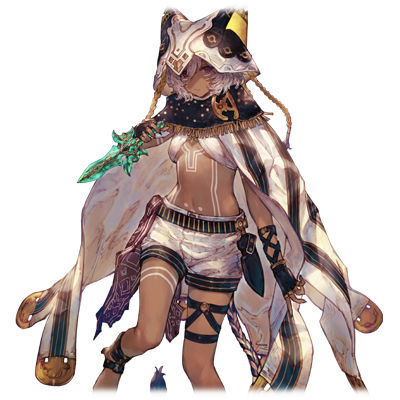

 

# 西埃洛·梅薇

| 角色信息   |          |
| ----------- | ----------- |
| 名称    | 西埃洛·梅薇      |
| 年龄   | 大约16岁        |
| 职业 | 风之巫女   |
|所属国家| 流浪之民|
| 对应曲   | 《逃避》 ～ The Deserter    |
| 初出   | Crystal Ep.2     |

## Episode 1 一章：异质的巫女

> 精灵的力量什么的，我可从来就没指望过。被这种东西左右着人生的话那还是致谢不敬了。

这个世界，从某个时候开始，就产生了被称为“巫女<西比拉>这样的由精灵与人共同联系产生的人。

手持超常力量的巫女们，受到人类的敬仰。

然而，巫女们实际上也不过是人们为了实现他们的私利私欲的道具而已。

 

总是被迫站在前方用于煽动战争，被要求承担各种各样的责任，一旦大势已去，甚至连巫女都可以当作牺牲品。

巫女就像用完即弃的道具一般。由于毕竟她们还是人类，能听得懂话，所以甚至会有人觉得比不懂人心的道具还要难以把控。

我们“风之巫女“也是这样的存在，大多数也是像这样被人们玩弄命运，最后失去自己的性命的。

 

这个大陆上有着这两个国家——贫富悬殊的阿基迪斯，还有美丽富饶的鲁斯拉。

我所居住的，正是这个贫富悬殊的地方，阿基迪斯。

由于厌恶那些把巫女当成实现私欲的道具的人们，我和母亲二人选择了离群索居的生存之道。

结果，这种行为引来了报复，曾经生存的集落被无情烧毁，而我和母亲则成为了挂着赏金的逃犯。

 

……实际上，我和母亲之间还有一个秘密。

那就是，我们母子两人共同享有着巫女的力量。母亲在生下我的时候，虽然看起来似乎是继承了全部的力量，但是母亲还残留着一小部分。

 

现在，我——西埃洛·梅薇，正和母亲一起，踏上了寻找不需要巫女力量的一方净土的，永无止境的旅行。

## Episode 2 二章：逃亡的终点

> 只要和母亲一起的话就能平静地生活了……。明明是这么想的，但是为什么要来打扰我们？

在旅途开始后的一阵子后。

我和母亲来到了水之都·迪奥基亚。

在这片水源充裕的街区的话，我们母女俩也能偷偷地在这里隐居的吧。

“母亲，看来终于能放心下来定居了呢。”

“我也很高兴哦，西埃洛。能和你在一起的话就很幸福了。”

这个时候的我们……还天真地这么想着。

 

我们在城镇边缘的一间马房的遗址处住了下来。

然而第二天，本应久违地享受有着像样住处的平静生活的我们，却被尖锐的怒吼声和悲鸣打破了这份宁静。

从窗口的缝隙向外看了一下，结果目睹了阿基迪斯士兵们正蹂躏着这片城市的光景。

“母亲，赶紧从这里逃走吧。”

“不要……为什么我要面对这种事情……我已经受够了啊！”

“母亲……”

母亲看来是因为长期逃亡导致身心俱疲，结果变得和集落时期的母亲那样似是而非了。

不管怎么样，先从这片街区逃出去再说。

但是，这个愿望连神明都没有听到。

阿基迪斯兵很快就冲入了屋子开始抓捕那些居民。

“那些家伙，到底要做什么？”

“呼，呼呼……肯定要沦为他们的奴隶啊。不管是我，还是西埃洛，最终都会被他们弄得不成人形。我已经不想回到以前那样了！”

“母亲……”

母亲不停地碎碎念的状态，在我的心中激起了一阵波澜。

现在这种情况如果跑出去无异于送命。

就在我正静心思考的期间，突然传来了小屋的门板被踢烂的声音——

“你们这些家伙，竟然躲在这种地方啊？”

慢慢逼近的男人们正在互相交流。

“喂，这些家伙不是从那集落里逃出来的幸存者吗？”

“是啊。这么一看的话，没想到还挺漂亮的嘛。嘿嘿，干脆拿来当我们的奴隶好了。”

男人们用着下流的眼神盯着这里，舔了舔嘴唇。

发出了会让人下意识皱起眉头的恶心笑声。

像这样的家伙的话，用狂风的力量的话就可以一击解决战斗！

……好奇怪。

为什么明明摩擦手掌集中精力就能发动的，为什么没有使出来？

“那手是怎么了吗？啊?”

“噫！不要靠近我！不要啊！“

曾经被众多壮汉们包围着的恐怖以及在那片村落的恐怖回忆在脑海中重新复苏，身体失去了力气。估计是这个原因让我无法使出巫女的力量。

“给我老实点！”

突然袭来的冲击，直接把我打倒在地上，身体在地上滚着，最后撞到了墙。

因为突然被踹飞的缘故，身体没法正常呼吸。

“……咳咳……”

意识已经渐渐模糊，视线投向了草堆的方向。

“喂喂，这么快就晕过去了？别那么粗暴啊……”

“不过是早晚的问题而已吧？喂，赶紧把这家伙运走。”

太好了，他们还没注意到了母亲的存在。

虽然我没法继续旅行了，但是只有母亲还能活着也好。

## Episode 3 三章： 孤独的旅行

> 手可以动了……要逃的话看来只有趁现在了。在这之后，立刻前往迪奥基亚！

身体感觉到了轻微的摇动。

随着意识的恢复，当时的记忆也渐渐明朗起来。

（对了……我是被那些家伙带走了啊——好痛）

应该说是不幸中的万幸吧，当时在马房中的伤口的疼痛似乎让我强制清醒了起来。

从身边感知的这股震动来看的话……现在应该在前往阿基迪斯的路上吧。

即便面对这样的险境，我还是打起精神拼命思考要怎么脱身。

虽然手脚都被绑着，不过这种情况还能做些事情。

不知道是不是被放到货车的深处了，旁边没有看到那些家伙。

从身上传来的震动已经越来越剧烈了来看，马车应该已经在阿基迪斯的山道上了吧。

也就是说——想要逃走的话就是现在！

将精神集中到极限，解放力量。

从手中产生的微小风刃将身上的绳子切断了。

之后，我用同样的方法解除了身上所有的束缚。

“虽然想直接治治他们，不过现在还是逃命要紧。”

在确定后面没有阿基迪斯兵跟随之后，我驱动着风的障壁直接跳下了车子。

“呸……还不能稳定操纵力量吗。”

嘴里直接进了一口沙子。

将远去的马车放在脑后，我直接奔向了迪奥基亚。

——直到夕阳西沉的时候，我才终于看到了城镇的影子。

母亲没事就好了。脑海中抱着这个念头，我拼命地向城镇的方向前进。再一点儿就到了。再走一点儿……

“……咦？这是什么？”

在我眼前的，曾经被称作“水之都”的这座城市，已经几乎被付之一炬，只留下堆积成山的“死亡”的气息。

“……呕……呃……母……亲……”

呕吐感瞬间涌了上来，眼前的视线一片模糊。

小小的哽咽声，随着沉入地平线的夕阳被黑暗吞噬。

## Episode 4 四章：向这把苍穹的短剑起誓

> 这把短剑是我和母亲之间联系的证明。只要有这把短剑在的话，我就算一个人也能活下去。

等太阳升起后到马房的附近找了一下，还是没有找到母亲的踪迹。

要是继续留在这里的话，感觉总有一天会被这些人找到的。

“总之，还是能离阿基迪斯跑多远就跑多远吧。”

正在想着这件事的时候，眼睛被前方的某样东西吸引住了。

那个东西就在眼前，是一把带着淡淡光芒的短剑——“苍穹的短剑”

“这把短剑……是母亲的……”

这把短剑，是我们巫女代代相传的魔法道具。只要手持这把短剑的话，就可以增强风的力量。 

和母亲在逃跑的时候，这把短剑交给了力量已经很微弱的母亲。

既然短剑掉在这个地方的话，那母亲已经……

“……呜”

我手握着短剑指向了天空，对着自己自言自语。

“……从今以后，我要一个人活下去。”

这就是，唯一能支撑我支离破碎的精神的支柱了。

从今以后，不仅为了自己，也要为了母亲，一定要找到那片净土。

我在此刻下定了决心。

而在这之后——我为了生存下去，什么都干过了。

逃亡到了一座村子后，常常为了生存而去附近的田里或者摊贩那儿偷东西，忍饥挨饿。

而在这路上遇到的阿基迪斯兵抑或是那些对我有敌意的人们，我都不由分说地杀死了。

这双手已经彻底被鲜血弄脏了。

所以，再也不能回头了。

## Episode 5 五章：一丘之貉

> 哼……你原来也和我差不多处境啊。我是不会同情你的。不过，在我面前死去还是免了。

“风之巫女”这个位子什么的，老实说随它去了。

但是这股力量实在是太方便了，渐渐地已经变成了我为了生存不可或缺的技能。

“给我站住！你这小贼！”

“不就是一两块面包吗！吃我这个！”

“呜哦！？……咳咳……”

卷起狂风造成了一个小小的沙尘暴，成功地阻止了后面追着的店主。

有这个力量的话，稍加利用就能轻易夺人性命。而不这么做的理由，则是对做出这美味的面包的店主的最低限度的感谢。

——我在逃离了阿基迪斯的势力范围后，向着迪奥基亚的东南方向前进。

在一边躲着阿基迪斯，一边沿着鲁斯拉的国境行动的途中，来到了这个刚好适合避难的地方。

这座新城市稍微有点繁荣，而且未曾受到战火的波及。

而在这座城市里，由无数的棚户区所组成的贫民窟，就成了我这样的“有故事”的人们的隐藏之所。

“到这里的话应该就没问题了。”

跑到巷子角落的我，立刻坐在了地上，从纸袋里拿出了面包。

新鲜出炉的面包在口中化开。

这个瞬间，我感受到了自己还活着的实感。

“呼……谢谢招待。”

我站起身来去寻找休息处，这时从某个角落看到了一个在动的物体。

手中握着短剑慢慢匍匐接近了之后，发现是个奄奄一息的少年。

应该是快饿死了，只有嘴巴能上下动弹。

“救……救……我……“

唉，我只是不想看到比自己小的孩子死在自己面前。

仅此而已。

“没事吧？要吃这块面包吗？“

“！“

少年的气色瞬间变了，立刻抓起了面包开始疯狂咀嚼。

看着他拼命吃着面包，我不知从何时起嘴角露出了笑容。

微笑什么的，到底是多久没出现了呢。

“……姐姐，谢谢你。“

“没什么的。毕竟是我给的啊。“

在这之后和少年攀谈了一阵子。少年的名字叫菲恩。似乎是因为战争失去了双亲的孤儿。

看来今天，在这里碰到了拥有相同遭遇的人啊。而且，他还有一个特质，让我产生了亲近感。

而那个特质正是和同岁的孩子截然不同的锐利眼光。

虽然没有直接和菲恩道明，不过可以看出这孩子也是经历了各种大风大浪才来到这里的呢。

话是这么说，同情是不可能的。

因为如果深入去了解并且去在意的话，总有一天会成为阻碍自己的枷锁吧。

“那么，我就先走了。“

“……等等，不要走啊。“

看吧，还是过来了。

“不等你哦。“

“等我一下啊！最少也得报答这份恩情啊……！”

“吵死了。”

无意识对着握着的手使出了力量。

少年被突然出现的强风吹飞并且撞到了墙上，失去了意识。

“啊……对不起……”

伤到别人了还是老老实实认错吧。

毕竟是自己招来的东西。全都是我的责任。

……还是先离开这座城市一阵子吧。

对更进一步的关系不抱期望，才是对双方最好的选择吧。

## Episode 6 六章：偶然的再会

> 这些威胁着我的人只会追到天涯海角。必须要走得更远……不穿越沙漠的话是不行的。

离开了那座和菲恩见面的城市，我在路上毫无目的地流浪着。

难道是我的皮肤颜色那么稀有吗。不管我走到哪里，都有来追杀我的人。

虽然他们基本上都说是不问理由要直接把我“处理”掉的，虽然还不太清楚事实，不过应该是阿基迪斯悬赏的吧。

我只是想逃离这种被追踪的生活而已……。

然而如果不走的比现在更远的话，这个局面也不会改变的吧。

为了达到这个目的，必须穿过眼前这片沙漠。

而为了穿越沙漠，则需要大量的食物和水。

而就在这个时候。

“咕呜呜……”

我的肚子发出了抗议的声音。

而当时吃到的面包的记忆也在我脑中复苏。

要是能在最后吃到那个面包的话也不坏啊。

——回到街上的我，迅速地偷出了块面包，在一片无人到访的废墟中吃了起来。

“要是母亲在这里的话……”

“姐姐，找到你了哦。”

废墟中响起了熟悉的声音。

仔细一看，面前是露出和之前判若两人的笑容的菲恩。

“菲恩……？好久不见了，居然还能认出我啊。话说，你身上的这衣服是……”

身上本来应该破破烂烂的亚麻布变成了干干净净，毫无污渍的白色布料。

那毫无生机的颜色，甚至让我的眼睛开始发痒。 

“面包店的大叔可是已经报案了哦。现在从这座城市出去的话很危险的哦？卫兵们已经开始严格搜查了。”

“看来这次是被面包吊上勾了啊……真失败。”

“也不要这么说。我觉得难得能和姐姐再见面，应该也是神的恩赐吧。”

神？菲恩居然会对这种模糊不清，连存在与否都无法确认的东西信以为真什么的……

“所以说，为了过几天能够趁机逃出这里，要不要这几天先在照顾我的教会那儿避避风头呢。卫兵们也没那个耐心连续搜查全城好几天吧。“

“是呢。“

“终于，能还那个时候的人情了呢。“

虽然一直在说不要在意，但是毕竟那次还误伤到了菲恩，还是没有拒绝他的请求。

“我知道了，能带路吗？“

“交给我吧。姐姐，往这里走。“

菲恩牵着我的手，离开了废墟。

## Episode 7 七章：谢谢招待

> 这一片惨白的空间……总觉得有什么奇怪的地方。话说回来，为什么大家都是这幅笑容！？

“欢迎！你就是菲恩常常提到的那个孩子对吧？能见到你很高兴哦！”

“欢迎！那个时候救了菲恩一命，真是太感谢了！”

到达“教会”之后，我很快就和菲恩的监护人夫妇见了面，收到了热烈的欢迎。

对这个地方的第一印象是，宛如病害一般的白色。

不论是毫无灰尘整齐排列的桌椅，还是到处都挂着的花圈。

还有全身白衣的孩子们。

在这里住着的人们身上总带着一股奇怪的感觉，而脸上虚假的笑容增强了这股违和感。

他们和阿特利玛教徒们不同，是另一种别的存在。

“从菲恩那里听说了各种各样关于你的事哦。既然已经孤零零的话，那就在这里和大家一起生活吧。”

“啊啊！这真是太棒了！教主大人也会很高兴的吧！”

“不……不用这样关照的……”

我被他们过度热情的态度吓到，甚至感到一阵恶心。

果然还是得来硬的，从这座城市离开吧。

“今天虽然受照顾了，明天就不麻烦你们了，我会直接离开这里的。”

“是吗……那么至少让我们做一顿精心制作的晚餐吧。”

“谢谢。”

“菲恩，去帮忙做饭吧。你不是一直在期待今天的到来吗？”

被叫到的菲恩露出平静的笑容慢慢地点头。

#### “姐姐，之后见哦。”

——而在这之后，晚餐会就开始了。

桌上摆着鲜红色的肉和多种多样的蔬菜。

如果是同龄的孩子看到这番光景应该会兴奋雀跃的吧，然而在场的孩子们却一贯保持着沉默。就像在等待着什么东西一样。

然后，长得像领导一样的人看着眼前的景象，以一种奇妙的眼神望着大家，然后就像祈祷一般念起了祷词。

“为这个世界上降生的所有生命们祝福。感谢他们最终成为我们血肉的一部分，与我们永远的活着。“

“我要开动了！！“

孩子们非常礼貌地分发了桌上摆着的肉片。

不知何时，他们的脸上恢复了平时的笑容。

除了一个人。

“谢谢招待！“

很快，晚餐会便结束了，大家各自收拾了自己的餐具。

我模仿着他们，刚想拿着餐具离开的时候。

“——维嘉。为什么，还留着不吃呢？“

“……果然，我还是不能接受……”

正在接受回答的是，没有保持着笑容的女孩子。

女孩子露出胆怯而扭曲的表情望向了这里。

“维嘉，你又这么做了吗？”

“对，对不起。但是我，还是吃不了肉……”

“在客人面前竟然还表现的这样差劲……这可不行啊，维嘉。”

那人仍然带着笑容，慢慢接近了这里。

躲在角落的维嘉，一边哭着一边祈求着原谅。

“我已经道歉了啊，所以请原谅——”

“接下来是我们之间的问题了！来，要走了哦。”

“不要，不要啊！！”

我正为刚刚发生的变故惊讶的时候，维嘉已经被带走，消失在屋子的深处。

而看着这些事情发生的孩子们表情没有一丝变化，只是保持着那奇怪的微笑。

## Episode 8 八章：被隔绝的世界

> 这些家伙……这里的人都疯了。无论发生什么，我得立刻离开这里。

深夜。

我趁着大家熟睡的机会，偷偷地起身离开了房间。

果然，我得立刻离开这个教会。

从双脚踏进这个教会开始，就感觉到一股包围着四周的闭塞感。虽然因为灯光引导的缘故很难注意到，但是这里通往外界的道路几乎被封锁了。可以说是和外界彻底隔绝的地方。

就像是毫无慈悲地阻止信徒离开这里一样。

“我可真是笨啊……明明自己发誓要一个人活下去的……”

一边说着，一边脑中回想起了少年的脸庞。

从那之后就没找到机会和菲恩说话了，果然还是心存芥蒂啊……。

由于我休息的房间在这片空间的深处，所以我必须抑制住脚步声，慢慢地向外张望情况。

看起来走廊没有照明，偷偷走过去是没问题。

就算竖起耳朵，也没察觉到什么声音。

努力隐藏气息，贴着墙壁前进，跟着楼梯慢慢下去。

看来楼下的房间也没有点灯。大家应该都去睡了吧。

继续前进，穿过吃饭的屋子后，沿着这条通道的话就能够立刻逃到外面去了对吧。

虽然已经很小心谨慎了，但是这里并没有设置什么陷阱。而我就顺着通道来到了门口。

然而走到门口的我注意到一个现实。

那就是门已经被坚固的铁栅栏封锁住了。

看守或者陷阱根本没有必要。

“真是坏孩子啊。居然偷偷从屋子里逃出来。”

“——？！”

突然从背后传来一个声音。

而与此同时头部受到了强烈的冲击，意识瞬间就被击飞。

“坏孩子就要管教呢。”

灯火映照出的笑容，是充满着不详和邪恶的狞笑。

## Episode 9 九章：爱之深

> 这算什么“爱”啊！这种不可理喻的规定，怎么可能对这些孩子来说算是爱啊！

朦胧的意识慢慢地在恢复。

而从手边传来的冷冷的感觉，宣告了一个事实。

我现在……正被关在铁笼子里。

这就代表着，即便使用风的力量，也无法逃出去了。

苍穹的短剑也被夺走了。

不管是铁栅栏也好，还是现在这个情况也好，对方似乎已经针对这些情况做出了相应的对策。

“看来醒了啊。”

我把头转向了声音传来的地方，正是那对表情不变的夫妇。

“你们知道你们现在在干什么吗？”

“当然。明明我们好心准备了床铺和食物的……”

“居然不尊重我们的好意招待。甚至还想从屋子里逃出去……你这可是在做坏事哦？”

“坏孩子可不能回到外面的世界呢。我们必须负起责任，将你引导到好的方向呢。这样的话，你也能注意到我们给予你的爱了呢。”

这两人从刚才就在说什么？

这种东西能叫做真正的爱吗？

这不过是，虐待而已。

“你觉得我可能乖乖就范吗？”

“嗯……看来相当地顽固呢。”

“既然不愿意接受我们的爱的话，那你难道想和维嘉一个下场吗？”

“这是什么意思？”

两人带着笑容，宛如歌颂一般回答了起来。

“她残留了我们为她准备的东西。那就证明她拒绝和我们成为一体。”

“对于拒绝教诲的坏孩子来说，就必须要被大家吃掉呢。”

吃掉？把维嘉吃掉？

话说回来，刚才维嘉一直就在抗拒那种肉。这样的话，难道……。

“你吃掉的东西，就是那些人类啊。你已经和我们一样了哦。”

“在身体献给神的同时还能救赎罪孽，最终在我们的身体里一起永远地活着。听起来很美妙对吧？”

疯了。真的疯了。

所以维嘉才那么害怕的。因为早就知道了会变成这样的。

一边忍受着呕吐感，我努力地大喊着。

“不要开玩笑了啊！”

“哦呀？看来菲恩身上的肉还不能满足你啊。”

这句话瞬间就让我的心理防线彻底崩溃。

“呕——呕……”

“哎呀，吐出来了啊？本来那孩子想把自己的身体当作礼物献给大家的……这还真是可怜呢”

就在听到这句话的瞬间。我已经忍无可忍了。

我使出了身为风之巫女的全部力量。

宛如爆炸一样的风刃，直接切割着面前的两人。

“咿呀啊啊啊啊啊啊啊！好痛……为何要这么做……！”

“闭嘴。”

随着响指一振，男人的喉咙瞬间爆出了一条红线，并且喷出了鲜血。而旁边发狂惨叫的女人，由于看着非常碍眼，也一起送往了那个世界。

“哈……哈……对不起……对不起啊……菲恩。要是没遇见我的话，就不会有这种遭遇了……”

“是啊。西埃洛。这都是你的错哦。”

一个与目前这幅惨状毫不相称的声音在室内回响。

我听到这个声音的时候，身体不由自主的打了个寒颤。

这个声音从小就非常熟悉了，绝对不可能认错的。

“母……亲……？”

“好久不见了，西埃洛。真没想到你还能活到现在呢。”

母亲身披蕾丝花边装饰的纯白色斗篷，带着花冠露出了扭曲的笑容。我看着这一片整齐划一的白色，心中顿时有了某个问题的答案。

“母亲，难道是这个教会的教主？”

“嗯嗯，是这样的哦。不过准确来说是我夺取的。”

“……从什么时候开始的！？”

“大概是从迪奥基亚逃离之后没多久吧。只是稍微展示一下巫女的力量，他们立刻就从顺了起来。”

接下来，母亲宛如回忆一样说着这些话。

“对了对了，从菲恩那里听到你的消息的时候，我很开心哦。没想到居然逃到了我的地盘呢。”

也就是说。

“那么……从之前到现在，那些派来的杀手，实际上都是母亲一手指派的？”

“嗯，答对了哦。目的是把你抓过来关在这里哦。”

“就算不这么做，直接和我说要来这里不就行了吗！”

“我才不要呢。这里的富足日子才不想放弃呢。”

母亲已经彻底变样了……。

我心目中母亲的形象，已经渐渐地被粉碎。

“哦对了，还有一件事呢，西埃洛……我有一个愿望需要求求你。”

母亲带着期待地眼神说出了这句话。

#### “能不能为了我，去死呢？”

眼前的女人，确确实实地说出了这句话。

## Episode 10 十章：充满爱的一家人

> 我在心底的某个角落仍然相信着。母亲仍旧还是爱着我的。呐，到底是哪里弄错了呢？

“能不能为了我，去死呢？”

面对着突如其来的话语，我的脑子拒绝接受这个现实。

对现在的我来说，只能从脑海里寄出几个字句了。

“咦？……母亲，您在说什么……”

由于胆怯，牙齿已经开始打颤，没法正常说话了。

“只要你去死的话，精灵的力量就会回到我的身体里。只要有这股力量的话，我就能够再一次以‘风之巫女’的身份，找到比现在更富裕的生活啊！所以能不能给我呢，这份力量！”

……这个女人，难道迄今为止，都是为了一己私欲而动的吗。

每当她开口，我就感觉到自己心中某些东西在慢慢崩塌碎裂。母亲在说的这些话，到底是什么东西呢。

 

“你不是说过吗……只要有我在，就很幸福，什么的……”

“对不起呢。实际上并不是这么想的哦。但是怀孕的时候还是奴隶的身份所以也拒绝不了。当时可真的痛的要死呢，不如说应该反过来感恩一下吧。哎呀，难道哭了？”

当我回过神来的时候，眼眶里已经看到大颗大颗的泪珠了。

不管怎么擦，泪水仍旧如决堤一般涌出来。

“……呜……呜呜……呜啊啊啊啊啊啊啊！！”

“……嗨。所以说孩子什么的就是麻烦，没耐性呢。自己自以为是地享受着。自己妄想着这些东西。真是让人觉得恶心呢。呐，至少最后为我而服务一下吧。拿着这把短剑去死行吗？”

那女人这么说着，把苍穹的短剑扔了过来。

我为了活下去，什么脏活累活都已经做过了。

而这个女人，甚至连为自己的生存而把别人杀死这点，都做不到吗。

 

“快点，西埃洛。你也累了，对吧？差不多是睡觉的时间了哦。只要把力量还给我的话，你就能在我的身体里永远地活下去哦？”

我在心底的某个角落仍然相信着母亲。相信着母亲仍旧还是爱着我的。

因为……厌恶把自己生下来的人什么的……我做不到。

但是，说不定连我自己都已经分不清这些了。我现在见到的这个世界也罢，熟悉的母亲也罢，已经不复存在了。

啊哈，啊哈哈哈……就像笨蛋一样。

 

我到底是为了什么才那么拼命活下来，为了什么才和她一起生活的啊。

就连曾经一起欢笑，同床共眠的记忆也不过是我自以为是想象的幻影吗。

我到底，是弄错了什么？

我到底，应该去做什么？

已经，无所谓了。

 

“母亲……我，会去死的。”

“真的！？这可真是太棒了。这样的话，就能够过上更好的生活了啊！”

即便在选择了去死的我的面前，母亲的眼中，仍旧没有我的身影。

“……再见了。”

我手持着短剑，直接刺向了胸口。

这就是我，对这个世界诀别的方式。

啊啊，既然最后会变成这样的话——

那我，不如从一开始就不要出生就好了。

## Episode 11 十一章：风的尽头

> 原来如此，原来是这样啊。……我所做的一切，不过是徒劳啊。

当死亡将近，死前的走马灯开始在我脑中回转。

这些记忆不仅仅有我的，还有那些迄今为止的精灵和巫女们的记忆。

而我，最终看到了世界诞生的真相。

然后，当指针回到太古，一切为零的那个时候，我看到的是，拥有者病怏怏的白色皮肤的少女的身影。

啊啊，原来如此啊。原来是这样的啊。

这个无聊至极的世界，从一开始就不存在那片远离一切的净土啊。

这是何等的残酷。

这是何等的丑陋。

微微摇曳的生命之火也消失了。我的灵魂慢慢从肉体中剥离出来。

与此同时，一股宛如柔顺肌肤的温柔的风在那里不停地吹拂着。

“呀！这是什么玩意儿啊。这股风。虽然感觉有点恶心但根本看不见摸不着……咦？好奇怪啊……明明西埃洛已经死了啊，为什么力量没有回归？”

就在这个瞬间，世界被某种力量撼动了。

母亲带着困惑的表情，注意到了站在我身旁的白色皮肤的少女。

“那股力量，我可没有给你留的份哦。更何况，那本来就是我的东西。”

少女悄无声息地接近了女人。

“你是什么人？话说回来是从哪里……啊啊……呼吸……被！？”

“虽然你那点力量不过是轻如鸿毛，不过还是不能放过。”

白色的手腕举起了女人。

并且像蛇一样紧紧地缠绕住了脖颈。

“……啊……救救我……”

“放心吧，对你们这些巫女来说，死才是真正的救赎呢。”

母亲就像是翅膀被拔掉的蝴蝶一样疯狂挣扎。

然而，再怎么挣扎都没法从这股力量中挣脱。

终于，随着挤碎东西的声音响起，母亲的头被完全挤碎，撕裂成了碎片。

那因贫血而苍白的脸上留下血泪痕迹的模样，就像是祈求神的饶恕的信徒一样。

白色的少女一言不发地吸收了尸体的全部力量，并且扔到了一边。

最后，向着我的尸体慢慢地说：

“真可惜。就算持续逃避，不愿面对残酷的现实，对于这个世界来说也是无济于事呢。对于这个已经成为失败作的世界来说，就是这样。”

少女吸收了苍穹的短剑上残余的光芒，不知不觉便消失了。

看来，我的灵魂也到了要消散的时候了。

——最后我望向了母亲一眼。

感觉最后，似乎和母亲的目光相交了的样子。

太好了呢，母亲。

我们最后永远在一起了呢。

