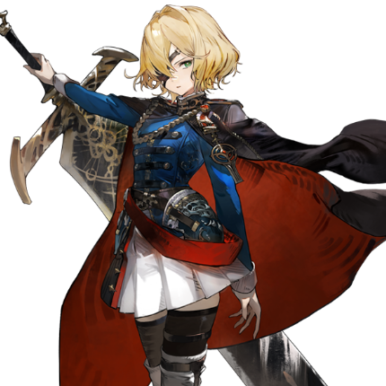
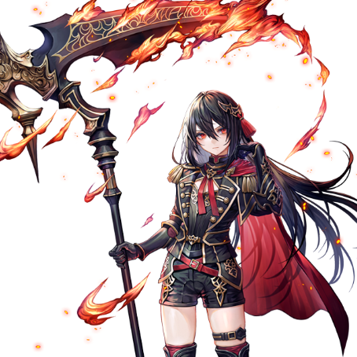

 

# 埃雷海姆·埃尔德

| 角色信息   | |
| ----------- | ----------- |
| 名称    |  埃雷海姆·埃尔德      |
| 年龄   | 17岁       |
| 职业 | 土之西比拉/魔导士官  |
|出身|土之国·奥伦|
| 对应曲   |〚献身〛 ～Paradox of Choice |
| 初出   | Chunithm Verse   |

警告：该剧情中含有残酷以及令人不适的描写，请谨慎观看。

## Episode 1 尽是错误的人生

>我已经不想做出选择了。不论那是正确的，还是错误的，都已经无所谓了。

“――到底要我说多少次你才能明白！！你是打算给埃尔德的家族名誉抹黑吗！？”

随着愤怒而投掷出的茶杯，朝着少女的脚边飞去。  
草药的香味在房间里升腾而起，滚烫的茶水顺着她的腿部流到了地上。    
被热水烫过的地方立刻红肿起来，侵蚀着她那白皙细腻的肌肤。  
刺骨的疼痛应该正在侵袭着她。然而，她却没有发出一声悲鸣。  
因为在她眼前，有比自己的痛苦更优先的事情。

“呜……对、对不起，父亲……”

她勉强挤出的回答，却只得到眼前男子的一声嗤笑。

“哼，你以为这样沉默就能让我消气吗？所以说女人这种东西……”

――我，又做错了啊……

一直在观察父亲反应的少女，终于意识到自己的判断是错误的。
少女慌忙想要表达歉意，身体扭曲着。

“喂，我什么时候说过你可以动了！？你真是个听不进人话的家伙！”  
“对、对不起――”

她意识到自己几乎是反射性地道歉，便立刻闭上了嘴。  
但这是她父亲所厌恶的行为之一。  
果然，男人的脸上露出了充满厌恶的轻蔑眼神。即便眼前的是自己的**亲生女儿**。
在模糊的视线前方，男人在说些什么。  
自从身体因男人的责骂而僵硬后，她的听觉似乎也麻痹了，什么也听不清。

――不能哭。

少女不知道经历过多少次恶毒到足以让人失去生存意志的辱骂。    
但她每次都认为这是无可奈何的事。因为自己给父亲添了麻烦，因为自己一直是个不听话的孩子——总之以这样的想法为理由，以此来约束自己。

――父亲的行为，全都是为了名门埃尔德的家族着想。所以，错的是自己。

她一直选择让父亲满意的选择。  
她相信这对父亲和自己都是正确的选择。  

在经历了不知第几次的责骂后，父亲的“教育”突然结束了。
少女对父亲与往常稍有不同的态度感到困惑，等待着他开口。

“……埃雷海姆。”  
“是。”  
“立刻去收拾准备。”  

男人说完，用手指向外面。

“……啊？”  
“哈……你又没听进去吗？你真是个“不够格”的女人啊。你是打算让我从1说到100吗？”  
“啊……呃……那个……”  
“你就去‘学院’吧。”  
“！？”  
“像你这样不成器的女人，通常是不可能进入学院的。但宽容的奥蕾莉亚大人却愿意接纳你。”  

简而言之，男人是在告诉她，离开这个家，独自搬到学院去住。  
这已经称得上是放逐了。  
少女不知道对于父亲来说，什么才是正确的答案。  
看着一直无法动弹的女儿，他故意叹了口气，然后说道：

“不要让奥蕾莉亚大人的家名蒙羞。明白了吗？”  

目送父亲的背影后，少女忍着脚上的烧灼之痛，开始收拾散落在地上的茶杯碎片。

“――在此等候多时了，埃雷海姆大人。”

当少女整理好行装走出门外时，那里除了仆人使用的马车和车夫外，还有两名护卫在等着她。  
埃雷海姆抬头望着宅邸，低下了头。

“……我走了，父亲。”  
“哎呀，您的脸色看起来不太好，发生了什么事吗？”  
“不，没什么。我们走吧。”  
“明白了。”  

想必从此以后，便再也不会回到这里了吧。  
埃雷海姆一边这样想着，一边将眼前逐渐远去的奥尔伦街景深深印在脑海中。  
坐在摇晃的马车中，正眺望着外面景色的埃雷海姆，看到了一对父子正笑着从马车旁经过。  
埃雷海姆急忙从车窗探出身去，只见那个男孩正被父亲扛在肩上，那个男孩正挥舞着双臂，幸福地笑着。

『你什么都不够格』  
『如果无法做出决定，就不要有自己的想法』  
『为什么我这一代，生的都是女儿』

父亲记忆中涌现的，全都是充满诅咒的话语。  

“如果我……也是个男孩的话。就能像那对父子一样……”

小时候，认为父亲会为之高兴的少女，便扮作男人的模样。  
回想起来，那天正是一切“错误”的开始。  
如今，她既无法回到那一天，也无法修复与父亲的关系。    
所以，至少。   
她只能继续前行，确保自己的行为符合父亲眼中的正确选择。  
这就是少女――埃雷海姆・埃尔德所立下的誓言。

## Episode 2 无路可退

>终于，我成为了一军之长，获得了保护他人的力量。这样的话，就能认可我了吗，父亲，母亲……

自从进入学院以来，埃雷海姆便废寝忘食地投入战斗技术的学习和学术研究中。  
对“选择”的恐惧感使她的思维变得迟钝。  
因此，她选择了跟随那些过来人的选择来克服这种恐惧。  
对她来说，那种可以完全沉浸于眼前事务、毫无杂念的日子，正是无比害怕作出决定的她所渴望的理想环境。
从战术和精灵力量的控制方法，到每日的饮食和穿着。
她花费了大量时间，系统地，认真地学习了系统地掌握了什么是正确的，什么是错误的知识，并且大量学习了各种领域的知识。

当埃雷海姆完成她的学习时，她已经成为了一名优秀的土之西比拉。

就在那时，她收到了来自学院征兵和召集部门的直接召唤。埃雷海姆从一名职员手中接过了一卷卷起的信纸。

“……”  
“怎么了，难道是不愿接收吗？”    
“啊……不，我确认一下。”  

她拆开封条，目光扫过信纸中的内容。那里，以她的名字为首，下面列着三个名字。

“埃、埃雷海姆队……我，我来当这个小队的队长？”  
“没错，您的努力得到了回报。恭喜你，埃雷海姆·埃尔德。”  
“谢、谢谢您……”  
“嗯？”  

男子注意到埃雷海姆的手在颤抖，露出了一个笑容。

“没问题的，是你的话一定能做到。”  
“抱歉，我先走了……！”  
“啊，喂——”  

埃雷海姆没有余力回应。  
她微微低头致意之后，便一溜烟地逃走了。

“…………呼”  

埃雷海姆找到了一个避开人眼、可以平静下来的地方，调整呼吸冷静下来后，她意识到自己的手中一直紧紧地攥着那张纸，从未松手。  
手还在颤抖着。

“……好害怕。”  

脱口而出的，全是对即将身为队长的自己，需要做出决策的不安。  
脑海中，阴暗的想法不断涌现。

——如果现在立刻去拒绝这份任命书的话，还有机会。  
离出发日还有时间。只要现在回到职员那里，说“我想退出”，他们应该会处理的。如果是那位看起来看起来很和善的人的话，肯定没问题。

如果只是“逃避”的话，那是再简单不过了。  
但是，选择这条路，就意味着否定自己至今为止积累的一切努力。  
当然，这件事也会传到父亲的耳中。
而她最终选择的答案是——  

“不、不行……我做不到……我做不到啊……”  

即便来到了这里，埃雷海姆也别无可选。  

埃雷海姆加入的，是以她为中心的，仅有四人的部队。  
最初虽然遇到了些困难，但埃雷海姆通过模仿其他部队队长的行为并在实战中实践应用，她也渐渐取得了成果。  
然后，当她开始展露出自信自己作出决策，展现出队长的风范时，她的部队的规模已经翻了个倍。  
过去那个愚蠢的自己，已经不复存在。  
埃雷海姆思念着故乡的父母。

“父亲，这样您能稍微重新审视我了吗？和母亲一起欢笑的日子会到来吗？”

现在的自己，应该能够直面父亲说出这些话。  
因为埃雷海姆已经有了足够的经验。

——我不是“不够格”的女人。我已经成为能够做出最好的，最正确的选择的女人了。

但是，埃雷海姆忘记了一件事。  
她能够做出正确选择，仅仅是因为模仿了过往他人的经验而已。  
当面对从未经历过的情况时，便会暴露出致命的问题。  

而让她的意志再次大幅动摇的契机，则是在那之后不久的事情。

## Episode 3 生命的选择

>我……到底要做错多少次，才能做出正确的选择呢……

——救出被异形怪物天灾兽袭击的商队。  
这项任务，正是上层基于对埃雷海姆能力的认可才发出的。  
对于学院来说，失去运送重要资源的风之国埃皮塔法的商队，对双方来说都是无法估量的损失。  
埃雷海姆听说，商队原本配备了许多西比拉作为护卫，但当她们到达在天灾兽袭击的地方时，剩下的只有护卫的尸体以及马车的残骸。从现状来看，商队很可能也被天灾兽吞噬了。但有些地方让她感到在意。

“那些家伙可没那么聪明。考虑到商队的规模，这些家伙吃的实在是太干净了。”  
“埃雷海姆队长，有事向您报告。”  

根据负责周围侦察的队员报告，天灾兽群正在攻击离马车不远的一栋房屋。

“商队逃到那里了吗？”  
“是的。而且，在群中发现了一只高级天灾兽。”  
“什么？”  

移动到可以俯瞰房屋的山丘上后，埃雷海姆注意到在攻击房屋的天灾兽群中，有一只格外显眼的个体，她厌恶地皱起了眉头。  

“三级……”

那是一只最近才开始被报告的稀有个体。  
天灾兽被大致分为五个等级，其中大多数都属于一级和二级。
四级及以上维持着空缺，原因是这些仅仅是黑暗时代的传说中描述的怪物，并没有人亲眼见过。
而如果是那些体型相当于普通房屋的三级天灾兽的话，其耐久力和攻击力都不可小觑。
再这样下去，房屋被摧毁也只是时间问题了。

“玛尔蒂娜，你怎么看？”  
“我们都没有战斗经验。以队长的实力或许能赢。但敌人不止那一只……”  

站在埃雷海姆身旁观察情况的副官玛尔蒂娜分析到。

“埃雷海姆队长……！马车那边有人影！”  

这时，观察马车的少女喊道。  
埃雷海姆和玛尔蒂娜用望远镜确认，在马车之间，似乎站着一个人影。  
那是一名本以为已经死去的护卫西比拉。  
护卫没有携带任何武器，只是茫然地站在那里，随风摇曳。  

“队长，请指示。”

队员们一齐看向埃雷海姆。  
埃雷海姆被迫做出重大决定。  
是与那个护卫汇合，歼灭天灾兽群呢？  
或是抛弃护卫，仅凭自己奇袭天灾兽群，救出商队——就是这样的二选一。  

“……”

埃雷海姆思索着。  
是应该救看得见的护卫，还是救尚未确认的商队？信息都是不确定的，但也并不是所有的战斗都能掌控一切。
身为部队的领头人，就必须在这些不确定性中选择出自己认为最好的，做出自己的决断。

“再这样下去就来不及了。请指示！”  
“可恶……”

然而，埃雷海姆无论如何都无法做出将众多生命放在天平上衡量的决定。  
现在，所有人的命运都压在她的背上。  
时间拖的越久，失败的可能性就越大，弥补的可能性就越小。光是想到这一点，埃雷海姆的心就被重重束缚着。

“我——”

身体如灌了铅一般沉重。呼吸也变得困难。仿佛被什么占据了身体。

『你真是个“不够格”的女人。』

父亲的话在脑海中闪过。

“我……”  
“队长，请允许发言。”

在模糊的视野中，埃雷海姆注意到玛尔蒂娜的手与自己的手重叠在了一起。颤抖也不知不觉停止了。

“……允许发言。”  
“谢谢。”  

玛尔蒂娜代替埃雷海姆提出了作战计划。

“队长你们去救商队，我一个人去马车。我是风之西比拉，使用力量的话就可以迅速确认马车的情况，之后再与你们汇合。”  
“但如果马车里藏着天灾兽怎么办？”  
“没问题。请相信我。”

玛尔蒂娜的眼神中充满了坚定的意志，仿佛就像在说绝不会让任何人牺牲一样。  
埃雷海姆被玛尔蒂娜说服，做出了**决定**。  

“……明白了。按她说的，各自就位！”  
“是！”

将重大决定托付给玛尔蒂娜后，埃雷海姆便立刻开始制定战术，然后执行。  
目送借助风之精灵的力量，快速向着马车接近的玛尔蒂娜后，埃雷海姆等人开始对天灾兽群发动攻击。  

埃雷海姆等人将天灾兽从房屋引开的同时，到达马车的玛尔蒂娜谨慎地观察周围情况。  

“应该……是这附近。”  
『……救……我……』  
“！？”  

她拔出腰间的匕首，同时竖起耳朵。  
那声音是从密集的马车中心微弱传来的。  
正当她试图悄悄靠近时，马车之间的某样东西晃动了起来。
那是被天灾兽活生生吞噬的护卫西比拉。半个身体被吞下，鲜血从巨大的口部缝隙中滴落。

“……救……我……”  
“啊……！”

——糟了。当玛尔蒂娜捂住嘴时，一切已经太迟了。  
啪嗒，一阵沉闷的声音响起。  
正在吞噬西比拉的身体的天灾兽，正俯视着玛尔蒂娜。

“三、三级……”  
“——，————！”  
“必须在这里阻止你……由我来阻止你！”

玛尔蒂娜一边祈祷埃雷海姆等人的安全，一边向强大的天灾兽发起挑战。

与此同时。  
埃雷海姆正与从房屋引开的三级天灾兽单挑。  
她躲过镰刀般的巨大手臂，时而用大剑，时而用土精灵力量硬化的身体弹开攻击，同时将精灵力量打入天灾兽的身体。  

“——，————！”

天灾兽退缩了。 
埃雷海姆的攻击确实奏效了。  
但她不能放松警惕。战斗看似对她有利，但若正面挨上一击，局势将瞬间逆转。  

“哈……！”

伴随着裂帛般的吼声，她挥起大剑，斩断了天灾兽伸长的巨臂。  
突然失去一只手臂的天灾兽，身体大幅失衡。  

——能赢！  

埃雷海姆抓住这一机会，迅速收回手臂，将精灵力量凝聚在大剑上。她用尽全力挥出了致命一击，直接向着天灾兽的天灵盖劈了下去。

就在刀刃切入蠕动的复眼的瞬间——

“啊……！”

一记横击击中了埃雷海姆。
她无法承受这如同被圆木击中的冲击，被狠狠打飞，翻滚着重重摔在地上。

“……啊……咳……”

她操纵体内流动的精灵力量，迅速站起，口中涌出的大量鲜血染红了地面。  
在混乱的意识中，她怒视着天灾兽。

“——啊……啊啊啊！”

右眼就像是被灼伤般的疼痛。
这时，天灾兽挑衅般抬起尾巴。在那尾巴尖端似乎刺穿了什么——随着尾巴的晃动，那东西掉在地上，滚了几圈。   
埃雷海姆意识到自己的视野变窄，顿时明白了，尾巴上刺穿的是自己的眼球。
或许是判断她已无力再战，天灾兽朝埃雷海姆猛冲过来。    
以她现在的状态，若被那巨躯撞上，必死无疑。  
要是在这里倒下，一切就都结束了。眼球被撕裂的疼痛让她的头阵阵作痛。  
面对迫近的死亡，埃雷海姆惊讶地发现自己竟逐渐恢复了冷静。  
她感到体内涌动的精灵力量发生了变化。虽然不知什么缘故，但她觉得自己与精灵力量融合的更深了。  
她轻轻吐出一口气，将大剑插入地面。  
瞬间，在天灾兽撞上她之前，无数土枪从地面刺出，贯穿并固定了天灾兽的身体。

“——，————”  
“哼，想求饶吗？去死吧，怪物。”  

埃雷海姆使出了全力一击。  
被劈成两半的天灾兽，连临终的哀嚎都未发出便死去了。

战斗结束了。  
在商队男人们庆幸得救的欢呼声中，埃雷海姆拖着沉重的身体，急忙赶往仍未归来的玛尔蒂娜所在之处。

“——啊……怎么会……”

然而，等待她的却是被天灾兽吞噬了半个身体、已经悲惨死去的玛尔蒂娜的尸体。  
她的手中紧握着心爱的匕首，准确地刺穿了天灾兽的头颅。  
她的表情仿佛在宣告，即使牺牲自己，也要将天灾兽一同带走。  
她用自己的生命，拯救了同伴。  

“对不起……都是因为我不够格……”

她轻轻合上玛尔蒂娜的眼睑，忘记了右眼的疼痛，独自哭泣着。  
这场用战友的生命换来的教训，实在太过沉重了。

## Episode 4 对极的二人

>就算明白这些事情，也有些东西无法改变。我……很羡慕你。

埃雷海姆因成功救出商队而在学院内获得了高度评价。即便这场战斗让她失去了重要的同伴。  
大人们似乎对同伴的生命漠不关心，这让埃雷海姆的内心始终无法平静。  
然而，在思绪尚未整理清楚之际，季节已悄然更替——

埃雷海姆接受了新的任务，正乘坐运输车辆前往目的地。

“小队的救援吗……”

苦涩的记忆在她脑海中闪过。  
她预感又会有谁的生命牺牲，右眼隐隐作痛。  

“呐，你的右眼怎么了？”

向陷入沉思的埃雷海姆搭话的，是新加入她小队的少女——阿尔米娜。

“你一直在擦眼罩，所以我有点在意。”  
“啊……”

直到被提醒，她才意识到自己一直在触碰眼罩。

“如果不想说也没关系。每个人都有不想提的事。”  
“新人，别对埃雷海姆队长问这么失礼的问题。”

队员们投来责备的目光，对阿尔米娜的冒失提问表示不满。

“不，没关系。”

埃雷海姆这样说着，安抚了突然变得紧张的队员们，然后带着自嘲的微笑看向阿尔米娜。  
接着，她便将自己迄今为止的经历告诉阿尔米娜。

“——原来如此，你也有这样的过去啊。”  
“你说‘也有’，难道你也背负着什么东西吗？”  
“啊……没什么，不是什么大事。”  

虽然她这么说，但眼中的情绪却完全潜藏不住。  
埃雷海姆内心涌起一股冲动，想要追问她究竟背负了什么，但既然她说“不是什么大事”，也就无从深究。  
距离到达目的地还有一段时间。  
为了养精蓄锐，埃雷海姆准备闭上眼睛休息，这时阿尔米娜用只有她能听到的声音低声说道：  

“就当这是我的自言自语，别放在心上。”  
“好。”  
“如果我没猜错的话，听你说了这么多，我觉得你似乎把你自己和整个部队的命运都**交给了别人**。”  
“……”  
“希望有一天，不会发生**无法挽回的事**。仅此而已。”  

说完，阿尔米娜闭上了眼睛。  
埃雷海姆瞥了一眼已经迅速进入梦乡的她，心中默默自语。  

——这种事，我也明白。

车辆“嘎嗒”一声晃动了一下。

## Episode 5 死得其所

>对于死不足惜的我来说，现在这副样子简直再合适不过了吧。

前往废都救援被困的小队的埃雷海姆小队，成功消灭了遭遇的天灾兽，并救出了幸存者。    
无论是小队成员还是幸存者，都没有出现伤亡。  
埃雷海姆因无人牺牲而松了一口气，但这份短暂的安宁很快被打破，坠入了无间地狱。
一名身披青色火焰的骑士挡在了埃雷海姆等人面前。   
埃雷海姆曾听闻，这名青焰骑士曾给多个小队带来巨大伤亡。  
若正面交锋，必将造成大量死伤。  
现在撤退还来得及。埃雷海姆迅速做出判断，向全员下达了指令。  

“全体人员，立即带着伤员撤离！”  

埃雷海姆以强硬的语气命令那些提出异议的少女们。  
她们最初虽表现出抗拒，但很快改变了想法，带着伤员开始撤退。  

“这样就好。”

埃雷海姆没有回头去看远去的同伴，满意地微笑着。然后，像失去右眼的那天一样，她抱着同归于尽的决心，朝青骑士走去。  

“你还真是果断呢。”  
“……为什么你还在这里，阿尔米娜？”

阻止她继续前进的，是她以为已经撤退的阿尔米娜。  

“我是来阻止你去送死的。”  
“你以为我会输给青骑士？”  
“因为对你来说，无论生死，都是最好的结果吧。”

尖锐的指责让埃雷海姆无言以对，她试图转移话题。

“你疯了吗？你以为两个人就能对抗那个怪物？”  
“嗯。至少比一个人生还的几率大。”  

阿尔米娜直视着埃雷海姆。  
她的眼中充满了强烈的意志，几乎让埃雷海姆忍不住移开视线。  
那是与玛尔蒂娜相同的、渴望拯救他人的坚定意志。  

“我不在乎你执着于什么。但我觉得，如此轻易地放弃生命是错误的。所以我不能坐视不管。”

就在阿尔米娜举起武器的瞬间，青骑士的咆哮震动了周围的空气。

“——！！”  

青骑士一跃而起，瞬间拉近距离，向两人袭来——

与青骑士的战斗异常激烈。  
阿尔米娜以手臂和身体为轴，灵活地挥舞着镰刀，近距离化解青骑士的连击，而埃雷海姆则在她攻击时填补空隙。  
尽管她们从未一起训练过，但此刻的配合却出奇地默契。  

——不，这是阿尔米娜在配合我……  

这个新人，为何如此熟练？她究竟是什么人？  
战斗中，这样的疑问在埃雷海姆脑海中闪过，但很快她就被青骑士逼得无暇思考。  
无论她们对青骑士造成多少伤害，它都能再生身体，一次又一次地站起来。

“竟然……还能站起来？”   
“果然是传闻中的怪物吗。”

两人力竭，跪倒在地。  
青骑士缓缓逼近。

“我不能死……在洗清姐姐的嫌疑之前，我绝对不能死……”  
“阿尔米娜……”  
“我还能战斗。我还能战斗！！”  

然而，无论她如何虚张声势，都无法对青骑士造成致命伤害。  
青骑士的剑刺穿了阿尔米娜的腹部。  

“啊……——！！”
“阿、阿尔米娜！！”

阿尔米娜被高高举起，无论她如何挣扎，都无法摆脱正随着自身重量，越刺越深的剑刃。  
埃雷海姆也竭尽全力用精灵力量攻击青骑士，试图救下她。但攻击不仅无法致命，反而让青骑士的动作加剧了阿尔米娜的痛苦。  
简直是无比绝望的情况。  

“我还不够……是我还不够强吗……”  
“埃雷……海姆……快……逃……”

即使在被青骑士折磨的痛苦中，阿尔米娜依然希望埃雷海姆能活下去。  
然而，埃雷海姆却一步也动不了。  

是选择保全自己的生命，还是与阿尔米娜一起被青骑士杀死——二选一。

“呜……我……为什么……为什么我根本选择不了啊！”

她害怕做出选择。  
无论从与玛尔蒂娜的分别中学到了多少，埃雷海姆依然无法做出生命的取舍。  
蹲在地上抓着头发的埃雷海姆，突然发现阿尔米娜的惨叫声消失了。  
青骑士的咆哮也听不见了。  
她抬起头，看到阿尔米娜正在吞噬青骑士的火焰。  

“……难道，她在将那些火焰转化为自己的力量？”

阿尔米娜吞噬了青骑士的火焰后，径直将匕首刺入了青骑士的脖子。

“——”

青骑士摇晃了一下，随后像逃离废都般，扬长而去。

“得救……了吗？”

阿尔米娜也一脸难以置信，呆呆地站在原地。

“我……还活着？为什么……”  
“阿尔米娜！”

埃雷海姆跑向阿尔米娜，试图检查她腹部的伤势，却发现伤口正在迅速愈合。

“这是……怎么回事？”  
“！？呜……身体好热——”  
“阿尔米娜？喂，振作点！阿尔米娜！”  
“啊——”

埃雷海姆触碰阿尔米娜的手感到灼烧般的疼痛，同时感受到肌肤被炙烤的热度，不得不与她拉开距离。

“阿……阿尔米娜……你也要变成那个怪物了吗？”  

在埃雷海姆面前，阿尔米娜被赤黑色的火焰包裹。  
无论她如何呼唤，阿尔米娜都没有回应。她眼中曾经强烈的意志也消失了，仿佛被什么操控着。  
火焰中的阿尔米娜缓缓拾起镰刀，步履蹒跚地向她逼近。  

“怎么了，阿尔米娜！你听不到我的话吗？”

阿尔米娜没有回答。
她只是举起镰刀，径直挥下。

* * * 

埃雷海姆醒来时，眼前已经是熟悉的景色了。

“……这、这里是学院的医疗部门……”

她试图仔细观察房间，但身体无法动弹。

“明明没有被固定在床上……为什么手脚动不了——”  
“啊……您醒了吗！”

听到欢快的声音，她转过头，看到一名隶属于埃雷海姆小队的少女正站在那里。

“太好了，我们平安回来了。”  
“是的。多亏了埃雷海姆队长，我们都没事。但是……”

埃雷海姆没有错过少女脸上突然浮现的阴霾。不祥的预感掠过她的脑海。

“抱歉，能帮我掀开毯子吗？我感觉很热。”  
“啊……那个，我被吩咐说如果埃雷海姆队长醒了就去叫医生！我马上去叫！”

少女急匆匆地说完，跑出了房间。  
不久后，被叫来的医生走了进来。简单寒暄后，埃雷海姆询问情况。

“医生，我的身体怎么了？是被打了强效的麻醉吗？”   
“埃雷海姆君……该怎么说呢……”  

医生显得有些犹豫。

“请直说吧。我必须尽快回归战场，不能让埃尔德之名蒙羞，我必须与天灾兽战斗。”  
“……做不到的。”  
“什么？”  
“你已经再也无法回归战场了。”  
“你、你在说什么……我现在意识清醒，精灵力量也没有减弱。相反，我感觉力量更强了！这样的我，为什么不能回归！？”

医生谨慎地选择措辞，缓缓开口。

“听我说，请冷静下来。……你的手脚，已经不存在了。”  
“…………哈、哈哈，别开玩笑了。”  
“这不是玩笑。你看。”  

医生慢慢掀开埃雷海姆身上的毯子。逐渐显露的身体，肩膀以下和腹部以下的部分“消失了”。  
字面意义上的，**消失了**。  

“啊——”

少女的悲鸣在房间中回荡。

## Episode 6 无法选择

>我到底是哪里做错了？已经什么都无所谓了。

医生曾说，能在这种状态下存活下来已经是奇迹了。  
尽管他解释了许多，但埃雷海姆因突如其来的不幸而尊严尽失，根本无法听进他的话。  
她唯一勉强记得的，是自己的身上有烧伤和被天灾兽咬碎的痕迹。  
失去的手脚无一找到，大概也是被天灾兽吞噬的缘故。  
医生离开后，埃雷海姆只是茫然地盯着疗养室的天花板，一动不动。  

失去身体部分几天后，阿尔米娜来探望埃雷海姆。  
她询问阿尔米娜发生了什么，但阿尔米娜似乎也没有当时的记忆，只记得醒来时倒在平原上，被学院的部队发现。  

“没能帮上忙，真是对不起。”  
“你要走了吗？”  
“我被分配到别的部队了。”  
“……这样啊，保重。”  
“那个，真的很抱歉。”  
“别在意，我本来就想与青骑士战斗至死。只要还活着，捡回的命总能**派上用场**的。”  
“埃雷海姆……谢谢……咳咳……”  
“喉咙烧伤了不舒服吧？别太勉强自己。”  
“嗯。”  

阿尔米娜话不多，离开了埃雷海姆的房间。  
虽然没怎么交谈，但失去人的气息后，她感到寂寞。  

“房间真大啊……不，只是我‘变小’了吧。”

她感到胸口仿佛开了一个洞，试图挣扎却无济于事。

“虽然对阿尔米娜说了那些话，但这副样子还能做什么呢……”

疗养初期，埃雷海姆队的成员还来看望她，但队伍解散后，再无人来探望。  
她觉得这些人太无情了。  
但这也是无可奈何的事。  
她们害怕看到她那惨不忍睹的身体，哪怕只是一眼。  

“呵，那种眼神……我永远不会忘记吧。”

连一起战斗的她们都如此，埃尔德家的反应更不用想了。  

“我再也得不到父亲的认可了……这就是……无法自己选择的女人的结局吗。呵呵——”

现在，父亲大概也听说了吧。埃雷海姆自嘲地低语，突然感到脸颊上有冰冷的东西滑过。  

“不能哭……”

哭泣不是父亲眼中的正确行为。明明在理智上明白这一点，但无论怎样试图控制自己，泪水还是止不住地涌出。

“……呜……呜……”

她没有手臂擦去泪水。  
也没有脚可以愤怒地跺地。  
她只能任由泪水浸湿枕头，感受着那份湿冷。  

“——啊啊啊啊！”

父亲的话语如潮水般涌来。  

『你什么都不够格』  
『如果无法决断，就别有自己的想法』  
『为什么我这一代，生的都是女儿』  

这些诅咒般的话语一遍遍回响。  
最终，她没能推翻父亲的任何一句话。  

“我该……怎么做才好……”

仿佛要流尽十几年来压抑的泪水，埃雷海姆不停地哭泣。  

“我不知道，我不知道啊……！！”

没有人来安慰她。  
这一切，都是因为她一直将自己的命运交给别人的缘故。  
她明白这一点，所以只能像婴儿一样不停地哭泣。  

埃雷海姆的哭声大到传到了房间外。她沉浸在哭泣中，完全没有注意到房间的变化。  
室内的墙壁和家具，仿佛被什么压碎般，全都扭曲变形了。  

## Episode 7 些许的希望

>我明白，即便我的身体已经变成了这样还是能够发挥用途。所以，如果是我能做的事情的话，我什么都会去做。

自从那天痛哭流涕、仿佛将一切情绪都倾泻而出后，几周过去了。  
泪水早已干涸，埃雷海姆重新找回了冷静。然而，她开始对自己这个毫无用处的人为何还能继续存活感到疑惑。  

“为什么我还没有被放逐？”

学院不会永远庇护那些对与天灾兽战斗毫无贡献的无能之人。  
要享受自由，就必须持续展现出相应的实力。  
而最能体现这一方针的，正是始终站在学院顶点的奥蕾莉亚·格伦特拉格。  
她被学生和职员评价为“冷酷而冷血”，绝对不可能放任自己不管。  
至少，埃雷海姆是这么认为的。  

“哈哈……这副样子，父亲大概也拒绝接纳我了吧。或许放逐我反而更困难。”

就在这时，埃雷海姆察觉到有人正朝她的房间走来。从脚步声的间隔判断，来人并不是平时照顾她的医疗部门的少女。  
自从失去四肢后，埃雷海姆自主进行了感官敏锐度的训练。她的感知能力显著提升，现在甚至能准确判断出接近房间的人数。  
而且，训练的成果不仅如此——。  
门被敲响，她回应后，传来一个陌生的男声。  

“埃雷海姆小姐，能占用您一点时间吗？”  
“可以，进来吧。”  

在埃雷海姆的示意下，一个穿着破旧、沾满煤灰的白衣的男人走了进来。  
从他沾满煤灰的臂章来看，他显然隶属于**武器研究与制造部门**。  

——是要被处理掉了吗？

紧张让她的身体不由自主地僵硬起来。  
男人敏锐地察觉到了埃雷海姆的变化，用担忧的语气说道：  

“抱歉我穿成这样。我不是来伤害您的——”  
“别说废话了，直接说正事吧。”  

埃雷海姆的眼神变得锐利，男人不由得小声惊叫。此刻，几乎分不清谁的立场更强势。

“其、其实，我们想请您协助一项研究……”

男人提出的请求是，希望埃雷海姆成为**某项研究的核心人物**。  
这项研究旨在让那些在适龄期前因某些原因无法继续战斗的西比拉重新回归战场。  

“这项研究需要受试者的积极参与。尤其是像您这样曾取得卓越成绩的埃雷海姆小姐，我们非常希望您能协助。”  
“……看到我**这副样子**，你还能说出这种话？”  
“是的，这完全不是问题。”

男人故作神秘的语气，以及他一边看着她的残缺身体一边嬉笑的态度，让埃雷海姆的怒火逐渐升腾。

“你说‘这完全不是问题’……？你懂我的什么！”  

她狠狠地瞪了男人一眼，随即用精灵的力量轻轻教训了他。虽然对人类使用力量是被严格禁止的，但如果不这样做的话，她感觉自己随时就会崩溃了。  
男人被无形的力量压垮，蜷缩在地上。  

“呜……啊……就、就是这个力量！”  
“什么？”  

随着精灵力量的释放，男人像弹簧一样跳起来，冲到埃雷海姆躺着的床边。

“这对您来说，将是一次非常有意义的经历。”
“别、别靠近我。你到底想让我做什么？”
“我要，让人更‘**接近**’精灵。”
“接近？你到底在说什么……”

据他所说，操纵精灵力量的西比拉们会在无意识间在体内循环力量，从而提升身体能力和自然治愈力。

“那么，如果能更高效地循环这股力量……您觉得会怎样？”

男人的话让埃雷海姆心头一震，她瞪大了眼睛。  

“您似乎想到了什么吗？”  
“我能以这种状态活下来，也是因为精灵力量的影响。是这样吗？”    
“正是如此。您的理解真快，真是帮了大忙。”  
“难怪我的力量变强了。那时感受到的变化，果然没错。”  

埃雷海姆将目光投向探病时摆放的花。  
瞬间，花朵迅速枯萎，随后又绽放出新的花朵，接着再次枯萎。  

“以前的我是做不到这种事的。”    
“真是……令人惊叹的力量。”  
“等等，如果我的力量是因**失去身体**而增强的话，那你们的研究是——”  
“没错。正如您所想。”  

男人对着惊愕的埃雷海姆，抛出了最关键的一句话：  

“实际上，这个提议不仅得到了奥蕾莉亚大人的许可，也得到了您父亲的同意。”  
“什……父亲？父亲他说了什么！？”  
“至少在我看来，他似乎很高兴。”  

这句话像毒药一样侵蚀着埃雷海姆的身心。  
它轻易地剥夺了她的判断力。  

“可能会**有点痛**，但我们已经准备了克服疼痛的方法。一个美好的世界正等着您。”  
“这样的我……还能为父亲效力……！？”  
“当然！您的名字——不，埃尔德的名字将被铭刻在学院的历史中！”  
“我做……我已经受够待在这里了。现在就让我开始吧！”

埃雷海姆再次将自己的命运**交给了他人**。  
即使前方等待她的是**地狱**。  
此刻的她，已没有任何阻止自己的理由。

## Episode 8 以埃尔德家之名 

>（父亲，母亲。我一定会回应你们的期望的。请你们保佑我吧。）

“实验成功了！”

在黑暗中观察的人们鼓掌称赞。  
他们的视线前方，散落着无数为实验而回收的二等级天灾兽的残骸。  
这些残骸的肉体已被碾碎得无法辨认原形，混杂的肉片形成了抽象的图案，仿佛一件艺术品。  
地面被撕裂般凹陷，显示出巨大的破坏力。  
那么，造成这种破坏的究竟是什么？  
答案就在他们饶有兴趣地注视着的箱子里。  

“这次的实验是通过将结晶化的精灵力量嵌入体内实现的。”

主导研究的男人兴奋不已，滔滔不绝地解释着。

“虽然还需要反复试验才能实用化，但这无疑将为与日益凶恶的天灾兽的战斗带来新的转机！”  
“太棒了，干得好啊！”  
“谢谢！”  

从黑暗中走近的是一个面容严肃的男人。

“威力确实无可挑剔。那么，正式运用时的主要问题是什么？”

果然是成本的问题吗？

面对这个问题，研究者冷淡地回答：

“进入实用阶段时，操作上的问题应该能解决。”  
“嗯。”  
“但由于**性质限制，无法量产**，维护成本也必须谨慎……**毕竟一旦‘削减’，就无法恢复原状了**。”

研究者抱歉地垂下眉梢，目光小心翼翼地观察着男人的脸色。

“没关系。”  
“真、真的可以吗？”  
“事到如今还问什么？那东西的所有权在我手里。既然我说了可以随意使用，你就专心研究如何在与天灾兽的战斗中取得优势吧。”  

得到所有者的许可，研究者的脸色顿时明朗起来。他不停地向男人鞠躬，几乎要把头贴到地上。

“谢、谢谢您！”  
“……那东西虽然一直是我家的耻辱，但现在总算能派上用场了。”  
“啊？”  
“我们与格伦特拉格家也有盟约。如果需要材料，随时告诉我。材料要多少有多少。”  
“真是太感谢您了！”  
“我期待你的成果。好了，我们该去开会了，剩下的事就交给你了。”  
“是！我一定不负您的期望！埃尔德大人！”  

面容严肃的男人与其他观察实验的人一同离开了。  
直到他们消失在视线中，研究者才从感激的话语转为充满斗志的宣言。  

“呵，呵呵，哈哈哈！我们一定会做到的！我们要为这个世界带来和平！”

男人高声笑着，目光投向训练场中央孤零零的箱子。

箱子四周被铁制固定装置包围，从远处看，宛如一口铁棺材。  
中央部分设计为可观察内部的结构，隐约可见某种红色闪烁的东西。

“……”

**那是一个连接着无数流动红色液体的管道的“少女般”的存在。**   
**之所以只能如此形容，是因为她已经几乎失去了人类的外形。**    
**她没有手臂，也没有腿，更没有女性的特征。**  
**为了适应实验，不必要的器官已被移除。裸露的身体瘦骨嶙峋，骨骼清晰可见。**  

“——呜”

**一瞬间，她美丽的绿色眼眸微微颤动。**  
**即使在这种状态下，她依然活着。**

“——啊”

突然，她的身体开始剧烈颤抖，随后全身喷出蒸汽。

“哎呀……这可不行。你还好吗，**埃雷海姆小姐**？”

男人用轻松的语气问道，就如同刚才与埃尔德家主对话的一般。当然，她无法给出任何回应。  
但男人毫不在意，开始毫不客气地检查埃雷海姆已经被“高效化”地改造了的身体。

“嗯……散热似乎不太理想……”

确定需要改进的地方后，男人平静地说道：

“既然已经得到了您父亲的许可，那就把这里、这里，还有这里都**削掉**吧。嗯，这样最好。”
“——呜，啊”

听到“父亲”这个词，她的身体微微颤抖了一下。  
即使变成这副模样，她依然想着要为父亲效力。  

“太好了，埃雷海姆小姐。这样您就能更好地为父亲大人效劳了。”  
“——”  
“呵呵，您还能笑出来，真是了不起。或许这也是精灵力量的恩赐吧。……好了，时间宝贵，我们该回去了。”

说完，男人将装有埃雷海姆的箱子倾斜，准备运往某处。  
在摇晃的箱子中，埃雷海姆心中浮现的是幸福的情绪。  
她相信，通过献出自己的身体，她能让抛弃她的父母重新接纳她。  
而且，还有一件令她高兴的事。  

“——”

我再也不用做选择了。  
光是想到这一点，就感到无比轻松。  

“哎呀呀，看来您非常开心呢。”

埃雷海姆·埃尔德的最终下场。  
终有一天，她将成为人们在与天灾兽战斗中的希望象征。  
她最后选择的道路，对人们来说是正确的答案。然而，这是否是她自己的正确答案——就连她自己也无法知道了。