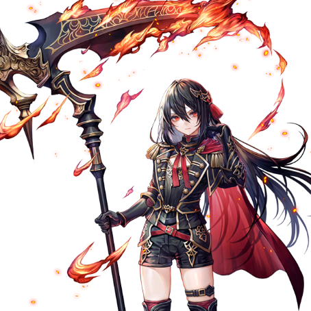
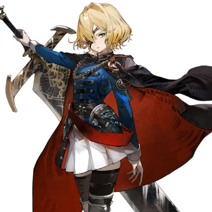

# 阿尔米娜·弗拉姆

| 角色信息   |  |
| ----------- | ----------- |
名称|阿尔米娜·弗拉姆
年龄|16岁
职业|火之西比拉/魔导步兵
所属|火之国·瓦尔加
| 对应曲   |〚隔絶〛 ～Flame of Determination |
| 对应版本 | Chunithm Verse

## Episode 1 残留于无神世界的存在

>这个世界是不可理喻的。不管怎么循规蹈矩地活着，最终也会被这个世界无情夺去。

箱庭。

这是一个由神自己的意思所创造出来的，小小的理想世界。

在那里有着分配了神明的部分力量的精灵，还有为了让这个箱庭世界能够繁荣起来而准备的生命体。

对于生活在这个世界中的生命体来说，精灵就是特别的存在，不知从何时开始，精灵就被他们当成了神的代言人。

见识到是神明伟岸力量的人们，要么为之恐惧，要么为之敬畏，渐渐地，精灵成为了人们信仰的象征。

而这就是神所期望的世界模样。

 

这个世界本该就这样持续下去。

然而，以一个契机为首，一切都开始了崩坏。

那正是寄宿了神明力量的，距离神最为接近之人的出现。

 

最初，那只不过是个小小的裂痕。

但是，一旦出现了裂痕，便只会产生更多的裂痕，渐渐地影响到了整个箱庭的世界。

神利用某位少女的身体作为其容器，决定将这个即将崩坏的世界带回正轨。

 

然后，神决定将这些曾经被带到地上的生命体——也就是那些丑陋的人类一一清除。

然而，却有一名少女超出了神明的预料。那是一名甚至连精灵的力量都没有的，普通而柔弱的少女。

神不禁侧首发问。

为何明知绝对无法战胜却仍要反抗？

为何人类如此丑陋却仍要守护？

而这名少女，也有即便只剩她一人也要反抗的理由。

那就是诞生于她内心之中的——“希望”的力量。

 

希望只不过是无比细小的力量。

只是生于心中，是绝对无法伤到神明一根毫毛的。

但是，对于这个神亲自创造，却又彻底失望的世界来说，只有这名少女，才算得上是神明唯一看得上眼的存在。

在这场惨烈的战争结束之后，神从这箱庭的世界消失了。

 

现在，不管是神，还是身为神的分身的精灵，都已不复存在。

逃离了神的审判的人类们，只能在这荒废的世界中行走着，在末日到来之前尽情地释放着自己的欲望。

即便这世间已经充满了激情与悲哀，沦为不是杀就是被杀的末法之世，即便如此，人类的历史依旧没有迎来终结。

 

即将讲述的，是发生于这神已不复存在的箱庭之中的故事。

这是那些跨越漫长的时光，踏出全新一步的人类们的故事。

## Episode 2 以这道火焰立誓

>就算现在闭上眼睛，那副光景也仍旧会浮现在眼前。总能想起那无法保护自己所爱之人，对这个世界一无所知的自己。

天空中飘着鹅毛大雪，盖住了一片正在慢慢扩大的血泊。

在这血泊的倒影之中，显现着两道影子，在血泊中摇曳着。

那是被吊在铁柱上的人类的尸体。

 

“父亲……母亲……”

 

在两具尸体的面前，正跪着一位在地上呜咽哭泣的少女。

到底是跪在那里多久了呢。那一头乌黑的秀发和露肩的白色连衣长裙也积满了血。

从这个少女的衣着可以看出她出身高贵，但对现在的她来说，这些东西已经无足轻重了。

至少比被直接处刑的父母比好多了。

 

“你说他们两人……做了什么……”

 

与正跪在地上努力挤出几句话的少女正对的，是一名穿着白银盔甲的女性。面对少女的质问，那名女性只是淡淡地回答到。

 

“‘四大精灵，绝不可互相交锋’。就算是你，应该也听过这样的说法吧？”

 

操纵着精灵力量的“西比拉”是绝对不能自相残杀的。这是这个世界不成文的规定。

 

“就因为触犯了这样的禁忌……就把他们杀死了吗？明明，他们是绝对不会这么做的……！”

 

少女露出了愤怒的表情，仿佛随时都会扑上去一样，但是看着那女性周围围着的士兵，只能默默地待在原地。

无尽的不忿无处发泄，只能狠狠地锤着地面。

 

“你的父母并没有犯什么错。”

“……哈？”

 

那为什么还要杀了他们呢？

少女完全无法理解眼前的女人所说的话，回过头去。

 

“因为你的姐姐打破了禁忌。她用了精灵的力量，杀死了我的女儿。”

“威斯卡姐姐……杀了人？不，这不可能……姐姐她可是个比谁都要认真，比谁都要更有正义感的人啊！”

 

少女的视线与女性相对。眼前的女性虽然刚刚才提到自己的女儿被杀的事情，然而她的表情却格外的平静。

不但如此，她望向这里的眼神甚至感觉不到一丝感情。

少女面对眼前的女性，感觉到了一股异样。

 

“真是信口开河。不管你怎么证明你的姐姐是个多好的人，这也是千真万确的事实。”

“姐姐呢……姐姐到底怎样了！？”

“死了哦。”

“怎么……会……”

 

看着正为姐姐的死亡而痛苦的少女，穿着铠甲的女性只是淡淡地说了句“接着”，然后就向旁边的部下们下达了指示。

“烧掉弗拉姆家的屋子” “如有人将弗拉姆家主的尸体取下来，必将严惩”……她一句一句地颁布着对于少女来说过于残酷的指示。

等到士兵们都走了之后，女人向少女说到。

 

“就剩你了。”

 

这么说着，女人向着少女一步一步缓缓走来——就在这个瞬间，少女向着女人扑了上去。

刹那间，刀剑相碰的尖锐声音响起。

 

“……竟然直接就往我的要害处冲了过来吗。看来身手还不错啊。”

“为什么……明明应该命中了啊！”

 

那尖锐的声音，正是少女准备刺向女人的脖颈的小刀被那名女性用臂甲架开的声音。

 

“如此干净的动作，还有毫不犹豫地将对手杀死的强烈意志，还有最重要的那双眼睛。不愧是她的妹妹，跟她如出一辙啊。”

“……！……你这家伙，还有脸提到我姐姐吗！”

 

就像呼应着少女的怒火一般，少女伸向女人的手燃起了赤红色的光芒——向着那名女性的脸部喷出了火焰。

然而，女人只是发梢稍微被烧焦了点，并无大碍。

接下来的数发近距离火球，也只是跟女人的身子擦肩而过罢了。

 

“怎么会……”

“作为火之西比拉，这股力量还算不错了。”

 

西比拉——这是能够操纵身体内流淌着的精灵之力的人们的称呼。

 

“再露几手吧，阿尔米娜·弗拉姆。看看，你灭门之仇的仇人现在就站在你面前哦！”

 

女人向前踏了一步。

 

“……呜哇啊啊啊啊啊啊啊啊啊啊啊！！”

 

去死，去死，去死吧！

名为阿尔米娜的少女全力挥舞着手中的火焰，试图将眼前的女人杀死。

然而，无论怎么做，阿尔米娜的攻击都未能命中女人。

 

“这就结束了吗？”

“还没呢……我还没……！！”

 

突然，阿尔米娜一个踉跄，就这样被女人整个背了起来。阿尔米娜已经没有能力反抗，只能这么看着自己的双亲的尸体距离自己越来越远。

 

“父亲，母亲……！！”

 

阿尔米娜被女人带走，前往了火之国·瓦尔加与别的国家连通的命脉——机关列车的车站。

在通往车站的道路上，部下的士兵们已经等候多时。他们全都穿着统一的制服，在两排竖直纽扣的外套之上还披着一件厚实的大衣。

仅凭这些全副武装的士兵，应该不用多少工夫就能镇压阿尔米娜生活的这座城镇吧。

女人将阿尔米娜放到了地上，并指示部下们给她戴上枷锁。

 

“放开我！你们要把我怎样！”

“你已经没有去处了，不如来我的‘学院’吧。”

“哈……？把别人的家人都杀死之后，竟然还说这样的大话……！”

“本来你也应该一起被处决的，但是你的素质不亚于你的姐姐，就这么死掉实在是太可惜了。”

“尽在那里自作主张……！”

“你没有拒绝的权利。我只要决定了一件事，那就不论采取什么手段都会达成。看看那里吧。”

 

女人所指的方向，那里站着的正是服侍着阿尔米娜的家族，也就是弗拉姆家的仆人们。

他们都被遮住了眼睛，带着手铐。

站在正以横排排成一列坐在地上的他们背后的，是已经拔出利剑的女性士兵们。

这代表什么意义，不用多说。

 

“不！快停下来！这一切跟他们没有任何关系吧！？”

“那么，该怎么做不用我多说了吧？”

 

女人淡淡地问到。

从那副态度来看，除非阿尔米娜允诺，否则她就会一个一个地将眼前这些可怜的人的头颅砍下来吧。

阿尔米娜无力地低下了头，用几乎是从丹田内勉强挤出来的微弱声音回答到。

 

“……够了，杀鸡儆猴什么的已经足够了……”

“这才对嘛。懂事的孩子就是方便。那，我们走吧，前往我等的‘学院’！”

 

很快，载着两人的列车发车了。

车辆向着南方而去，阿尔米娜待在窗前，望着渐渐远去的故乡。

 

“啊……啊啊……”

 

最先跃入眼帘的，是已经化为一团大火的弗拉姆家的屋子。

熊熊燃烧的火焰，就像是在向身为仅存的“家主”的阿尔米娜求救一般。

自己曾经所珍爱的一切，就在这一天之内被彻底夺走。

即便如此，她也没有将目光从那火焰中移开。

这是为了将今天所感觉到的一切一切，都深深刻在自己心中。

 

从今日起，阿尔米娜对天发誓。

总有一天要将夺走了自己珍爱的家人的女人——奥蕾莉亚，亲自手刃。

## Episode 3 终末之兽

>如果没有觉悟的话，是没法在这里活下去的。如果想要活下去的话，那就只能战斗。

奥蕾莉亚口中的“学院”，拥有比四大国更广阔的土地和技术力量，是一个从世界各地聚集具有操纵精灵力量潜质的孩子们的机构。

阿尔米娜虽然从姐姐威斯卡那里听说过学院的名字，但这里与她所想象中的样子大相径庭。  

充斥着惨叫与怒吼的训练，实力至上的风气。  

没有许可甚至无法外出的严格纪律。

阿尔米娜刚到这里，就亲眼目睹了学院的现实，自嘲般地低语道：

 

“……简直就像监狱一样啊。”

“阿尔米娜小姐，怎么了吗？”

“不……没什么。”

 

阿尔米娜现在被奥蕾莉亚交给了眼前的少女——拉比斯。坐在轮椅上的她，似乎是就算在这所群英荟萃的学院中，成绩也特别优异的才女。

从她的衣着和谈吐来看，她可能是某个国家的贵族出身。

在充满肃杀气氛的学院中，她身上飘散着淡淡的花香，语气温和，仿佛能治愈阿尔米娜接连遭遇不幸的心灵创伤。

 

“已经带你大致参观了学院，有什么问题吗？”

“……”

 

拉比斯停下轮椅，转向阿尔米娜。她似乎对阿尔米娜的遭遇表示同情，微微垂下眉梢，露出了温柔的微笑。

 

“呵呵，这也难怪。你的事情我已经从奥蕾莉亚大人那里听说了，今天肯定是很辛苦的一天吧。”  

“……你……！”

 

——你懂什么。阿尔米娜正想发作，突然注意到了自己面前是个看起来比自己还要柔弱的轮椅少女，慌忙将怒火收了回去。

 

“怎么了？”

“没、没什么。”  

“……是吗。”

 

拉比斯轻声笑了笑，突然像是想起了什么似的，“啊”地叫了一声。

 

“对了，我还有一个地方没带您去呢。我们去那边吧。”

 

阿尔米娜被拉比斯带着，来到了一个地方。那里矗立着一扇像城门一样的巨大门扉。

 

“来，请进。”

 

阿尔米娜按照指示走进门内，却被昏暗房间中飘散的异样气味止住了脚步。

 

“野兽的气味……不，不仅如此。这是……血？”

 

她感到一股不祥的气息。然而，拉比斯却毫不在意阿尔米娜的反应，径直向宽敞房间的中央移动。

 

“阿尔米娜小姐，怎么不过来？”  

“……你到底想在这里做什么——”

 

就在阿尔米娜走到拉比斯所在的中央部时，地面突然从四周向上隆起，将两人包围。

 

“什么！？”  

“其实，我忘了一件事。”

 

拉比斯的声音中开始掺杂着一丝不祥的意味，阿尔米娜不由得警惕起来。

 

“你的目的是什么？”  

“呵呵……别这么冷淡嘛？这只是一个小小的游戏——给你举办的‘欢迎会’哦。”  

“完全不像欢迎会的样子。还是说，你在这里待得太久，感觉都变得奇怪了？”  

“作为瓦尔卡的人，你还真是能说会道呢。”

 

拉比斯眯起眼睛，露出戏弄般的笑容。阿尔米娜正想抓住她的肩膀质问时，突然——拉比斯的身体发出“啪嚓”一声，化作了一滩水。

 

“……咦？”

 

阿尔米娜的脚下，出现了一大滩水。

 

“水之西比拉……！？在哪里，拉比斯！”  

“突然直呼我的名字，真是过分呢。”

 

随着拉比斯的声音在房间中响起，灯光突然亮起。

紧接着，阿尔米娜面前的地面开始隆起，刺鼻的气味瞬间弥漫开来。

那气味的来源，是一只漆黑的、形似人形的异形怪物。

 

“为什么会有<ruby>天灾兽<rp>（</rp><rt>Scourge</rt><rp>）</rp></ruby>……！”

 

终末之兽——<ruby>天灾兽<rp>（</rp><rt>Scourge</rt><rp>）</rp></ruby>。

根据古老的传说所说，[这种黑色的怪物是神明为了毁灭人类而创造出来的产物。](/sibula/idea.md)

而学院聚集西比拉的原因，也正是为了对抗它们。

 

“我说过这是欢迎会吧？我对奥蕾莉亚大人对你的评价很感兴趣。所以，请让我也看看你能战斗到什么程度吧。啊，如果害怕的话，随时都可以求救哦？”  

“……还真是个糟透了的地方啊。”

 

阿尔米娜露出无畏的笑容，举起手对准逐渐逼近的<ruby>天灾兽<rp>（</rp><rt>Scourge</rt><rp>）</rp></ruby>。  

“好啊，正合我意。”  

瞬间，火焰迸发。

## Episode 4 前往战场

>无论奥蕾莉亚怎么想都无所谓。我只要考虑我目前能做的事就够了。

在学院的演习场上接受了拉比斯的“欢迎会”的阿尔米娜，展现了自己身为火之西比拉的力量，成功地击败了天灾兽。  
拉比斯虽然面带温和笑容向阿尔米娜表示了赞赏，但似乎因为没有看到她惊慌失措的样子而感到不满。她向阿尔米娜单方面地传达了奥蕾莉亚的口信后，便离开了那里。

 

之后，阿尔米娜因展示了与天灾兽战斗的能力，被分配到了某支小队，成为对抗天灾兽的战斗人员。

 

“没想到，仅仅因为拥有火之西比拉的力量，就能活下来……”

 

当时，奥蕾莉亚确实说过要让她进入学院，但阿尔米娜并没有完全相信她的说辞。  
她已经做好了被当作杀鸡儆猴的牺牲品，或是遭受奴隶般残酷对待的心理准备。  
然而，奥蕾莉亚真的只把她视为对抗天灾兽的战斗工具。  

 

“那家伙肯定是想让我一直与天灾兽战斗，直到我失去利用价值为止。不过，现在这样也无所谓。只要继续挣扎下去，总有一天会找到出路。”

 

阿尔米娜手中的召集令上布满了深深的皱褶。  
召集令的内容，是加入一支搜寻小队，去寻找在国境附近失踪的魔导士官蕾纳斯的小队。

 

“无论是什么命令都无所谓。只要去战斗，然后胜利。仅此而已。”

 

阿尔米娜前往指定的集合地点，发现那里已经有好几名少女在等待。  
她们的中心站着一位戴着独眼眼罩、扛着大剑的女性，俨然一副队长的模样。  
她注意到阿尔米娜后，走了过来，伸出右手。

“我是这支小队的队长，魔导士官埃雷海姆·埃尔德。”  
“我是阿尔米娜。”  
“嗯……你没有家名吗？”  
“是的，我已经不需要了。”  
“这……失礼了。”  
“……”

 

阿尔米娜默默地注视着坦率道歉的埃雷海姆。  
学院里有很多人都是出身于贵族。  
贵族们往往喜欢抱团，阿尔米娜也曾多次见到像拉比斯那样傲慢无礼的人。  
她本以为埃雷海姆也会如此，但她似乎不一样。

 

“我的脸上有什么东西吗？”  
“不。这边才是请多指教，埃雷海姆。”

 

握手之后，埃雷海姆向所有人说明了本次任务的内容，随后带领队员们前往机库。  
那里停放着由学院最新技术制造的运输车辆。  
驾驶员确认全员上车后，车辆便出发了。  
在车辆嘎吱嘎吱的摇晃中，埃雷海姆从怀里掏出一个小巧的怀表，确认时间。

 

“如果蕾纳斯小队还活着，她们很可能逃到了国境附近的废弃都市斯雷尼卡。到斯雷尼卡大约需要三个小时，大家趁现在好好休息。”  
““是！””

 

坐在座位上的队员们随后便一言不发。  
这是一支训练有素的队伍。阿尔米娜在心中如此想着，坐在了离她们稍远的地方。  
她一边遥想着远方的故乡，一边闭上了眼睛。

## Episode 5 疑念

>由西比拉组成的小队怎么想都不可能那么简单就被击溃……她们到底发生了什么事？

阿尔米娜等人的车辆，已经来到了可以用肉眼看到废弃都市斯雷尼卡的距离。  
就在都市的近郊处，一辆属于失踪小队的运输车辆正侧翻在地。  
埃雷海姆在确认那是蕾纳斯小队的车辆后，指示手下的一名少女点燃了狼烟。  
不久后，都市中接连升起了四根同样颜色的狼烟。  
埃雷海姆回到车辆上，向等待的队员们再次确认了本次任务的目标。

 

“幸存者大概有四名，其中可能还有伤员。斯雷尼卡已经脱离人类掌控很长时间，天灾兽极有可能潜伏在城中。务必在日落前救出幸存者！”  
“是！”

 

话音刚落，车辆便向都市方向驶去。随着逐渐接近都市，车内的紧张感也越来越强。  
有人闭着眼睛小声低语，也有人默默祈祷。  
看来，即使是身经百战的埃雷海姆的部队，也难免感到紧张。  

 

不久后，车辆停了下来。  
埃雷海姆站在车门前，向队员们发表了动员。  

 

“废弃都市对天灾兽来说是绝佳的藏身之地，大家要互相掩护，不要放过任何可疑之处！”  
“是！”

 

部队冲入了都市。  
用石头和砖块建造的房屋大多已经倒塌，只剩下地基部分。  
草木茂盛的地方和野兽栖息的痕迹随处可见，显然这里已经被废弃了很长时间。  

 

“呼……呼……”  

 

阿尔米娜不知不觉间发现自己的呼吸变得急促。  
说不定小型的天灾兽就藏在瓦砾的缝隙中，随时准备发动突袭。  
光是想到这一点，从未在都市中战斗过的阿尔米娜便明白了大家紧张的原因。

 

“埃雷海姆队长，发现天灾兽！”

 

走在最前面的队员，在广场边的破败喷泉旁发现了一群天灾兽。  
确认到的天灾兽共有八只。  
它们都是被归类为二级的个体。  
拥有比大型肉食野兽更庞大身躯的天灾兽，挥舞着锐利的爪子和长臂，普通人一旦被击中，必死无疑。不过，那只是对没有任何力量的普通人而言。  
即使数量稍多，它们也绝不是能够操纵精灵力量的西比拉的对手。

 

“退后，我来解决。”  
“没问题吗？”

 

阿尔米娜对独自走向喷泉的埃雷海姆感到担心，一旁的队员少女回答道：

 

“埃雷海姆队长的力量在这里就是如鱼得水。请看着吧。”

 

埃雷海姆等到所有天灾兽都进入自己的射程范围后，将手臂猛地插入地面。

 

“土之精灵啊，回应我的呼唤吧。”

 

瞬间，大地中出现了凝聚成长枪形状的土块，贯穿了天灾兽的身体。  
天灾兽挣扎了一会儿，很快便不再动弹。

 

“那就是埃雷海姆队长的精灵之力。很厉害吧？”

 

其中一名少女队员像是炫耀自己一般一样自豪地说道，阿尔米娜点了点头。

 

“这附近应该有蕾纳斯小队的幸存者。仔细搜索！”  
“是！”  

 

队员们开始搜寻幸存者，而阿尔米娜则对面前这些脆弱的天灾兽的脆弱感到了一丝违和感。

——埃雷海姆一个人就能解决的天灾兽，真的能让身经百战的小队全军覆没吗？还是说，这里还潜藏着什么别的东西……？

最终，阿尔米娜没能得出答案，只能加入了搜寻的行列。

## Episode 6 仇恨人类之物

>说不定，我们从一开始就搞错了。我们自顾自地以为它们只有野兽程度的知性，结果走窄了路。

被救出的蕾纳斯小队队员们，脸上都挂着一副悲壮的表情。  
她们的制服被暗红色的血迹浸染，甚至看不出原本的颜色。  
没有一个人能正常行走，如果不是埃雷海姆小队的队员搀扶着，她们虚弱得仿佛随时都可能倒下。  
卫生兵见状急忙跑过来准备进行急救，但她们只是受了些轻伤，并无生命危险。  
那些看似是重伤的血迹，其实都是同伴飞溅出来的“鲜血”。  
埃雷海姆向阿尔米娜搀扶着的少女问道：

“指挥官蕾纳斯去了哪里？你们到底遭遇了什么，有人能说明情况吗？”

背着与自己身高相仿的巨大弓箭的少女，似乎被埃雷海姆的气势吓到，避开目光，断断续续地低声说道：

“我……我们……”  
“慢慢说，没关系。”  
“我、我们……放弃了任务……”  
“嗯……任务是什么？”  
“是……捕捉青骑士……”  
“青骑士……？”

埃雷海姆露出困惑的表情，阿尔米娜接着问道：

“你知道青骑士吗？”  
“青骑士是学院里广为流传的怪物。据说它出现在战场上，专门猎杀西比拉。虽然被归类为天灾兽的特殊个体……但没想到会在这里听到它的名字。”  
“这些孩子，遭遇了青骑士的反扑。”  
“是的，看来就是这样。”

话音刚落，阿尔米娜和埃雷海姆的脸上都浮现出警惕的神色。  
如果两人的猜测正确，青骑士很可能就潜伏在废弃都市附近。  
就在她们感到背脊发凉的那一刻——

“——啊啊啊啊啊啊啊啊啊！！”

一声撕裂空气的惨叫声响遍了整个都市，紧接着，某样东西滚到了两人的脚边。  
那是被残忍撕成两截的，埃雷海姆小队的驾驶员的尸体。

“呜——”

令人作呕的恶臭瞬间弥漫开来。  
那臭味的来源，是从尸体中流淌出的半熟内脏。  
许多队员捂住嘴巴发出呻吟，而蕾纳斯小队的少女则瞬间想起了可怕的回忆，开始哭泣并道歉：

“啊……啊，哈哈哈……对不起……！都、都怪我们……活了下来！”

少女的声音激起了所有人的不安。  
这种不安已经开始在埃雷海姆小队中蔓延。

“冷静！如果乱了阵脚，就正中对方下怀了！”  
“埃雷海姆！你看那边！”

阿尔米娜的声音紧接着响起，她指向某个方向。  
在少女们的视线聚焦之处，一个被青色火焰包裹的怪物正静静地伫立着。

“那就是……青骑士……？”

## Episode 7 活下去，活下去，活下去

>我不喜欢这种需要牺牲某个人才能活下去的战斗方法。因为我最清楚了，清楚那些被舍弃的人们是怎样的想法……

在青骑士面前，队员们都被震慑住了，唯独阿尔米娜却出奇地冷静。  
对于生活在极寒之地火之国瓦尔卡的人民来说，火焰是信仰的象征。他们崇拜火焰，却从不畏惧它。  
正因如此，阿尔米娜从这异形的青骑士周围摇曳着的青色火焰中，感受到了一种别样的东西。

“那火焰……似乎在痛苦着——”  
“全体队员，立即带着伤员离开这里！”

阿尔米娜的思绪被埃雷海姆的声音打断。  
埃雷海姆小队的少女们虽然希望留下来战斗，但在理解了埃雷海姆的意图后，迅速开始撤退。

“这样就好。”

埃雷海姆说完，便朝着青骑士走去。她大概是打算牺牲自己来换取其他人的安全。  
在她看来，牺牲一人拯救多数是一种美德吧。

“这……太自私了。”

对阿尔米娜来说，这种行为不过是浪费生命。  
她的心中渐渐燃起了怒火。

“你还真是果断呢。”  
“……为什么你还在这里，阿尔米娜？”  
“我是来阻止你去送死的。”  
“你以为我会输给青骑士吗？”  
“因为对你来说，这样更方便吧。无论是死是活。”  
“你疯了吗？难道你以为两个人就能对抗那个怪物？”  
“没错。至少比一个人独自面对更有生还的机会。”

埃雷海姆的眼神动摇了。

“我不在乎你执着于什么。但我觉得，如此轻易地放弃生命是错误的。所以我不能坐视不管。”

阿尔米娜很清楚。  
这个世界上有许多人毫无意义失去自己的生命。她也明白，那些被留下来的人的感受。  
就在阿尔米娜举起大镰的瞬间，青骑士的咆哮响彻了整座废都。

“——！！”

青骑士首先冲向阿尔米娜，刺出了利剑。  
那超越人类的力量所挥出的剑速极为惊人，不管任何一击都足以致命。

“……哼！”

然而，阿尔米娜冷静地看穿了青骑士的攻击，用大镰的柄巧妙地化解了刺击。  
接着，她利用青骑士的力量顺势旋转身体，以高速挥动大镰反击。  
阿尔米娜的一击在青骑士的身体上留下了宛如被巨兽撕裂一般的深深伤痕。  
如果是人类，这样的伤势早已致命。但对方是天灾兽，无论受到多少伤害，它的动作都不会停止。

“真是个怪物，不过——”

就在这时，埃雷海姆的精灵之力填补了阿尔米娜攻击的空隙，直接在青骑士的身上炸开了花。

“多谢！”

青骑士即便承受了从地面突然冒出的土枪攻击后，仍旧继续向前冲去，而阿尔米娜的大镰再次挥下。

“——！！”

青骑士发出了一声近乎呻吟的吼叫。  
——这下应该——！阿尔米娜和埃雷海姆感觉到了一丝希望。或许他们真的能击败青骑士。  
然而，仿佛在嘲笑两人的希望一般，原本脆弱的平衡逐渐开始崩溃。  
无论受到多少伤害，青骑士始终没有倒下。  
它一次又一次地再生，执拗地瞄准阿尔米娜。

“可恶……这个……！”

每一击都可能致命的紧张感，无情地消耗着阿尔米娜的集中力。  
她的手臂因持续抵挡沉重的攻击而麻木，用于反击的精灵之力也因疲劳而失去了光彩。  
负责支援的埃雷海姆也同样疲惫不堪。

经过十几次交锋，两人终于跪倒在地。  
尽管她们已经竭尽全力，但眼前的怪物仍然有余力。

“还能……站起来吗……？”  
“果然如传闻中的一样吗。”

两人喘着粗气，拼尽全力。

“我不能死……在我洗清姐姐的嫌疑之前，我绝对不能死……！”  
“阿尔米娜……”  
“我还能战斗。我还能继续战斗！！”

阿尔米娜愤怒地激励自己站了起来，但她的视线已经模糊不清。  
因此，她只能眼睁睁地看着青骑士的剑刺穿了自己的腹部。

“啊……啊————！！”  
“阿、阿尔米娜！！”

## Episode 8 即便，化作灰烬

>由你所连接起来的这道锁链，就由我亲手解放。只要这温暖与我同在，我便会无数次地再度起来。

“阿尔米娜，武器的本质是为了夺取性命。要在对方察觉之前，以最快最短的一击命中对方的要害。这样你能立于不败之地了。”  
“不论是谁的生命都一样吗？”  
“是的，如果是在战场上的话。”

所以，绝不能把目标从对方的要害上移开。  
姐姐用手帮我握着一把小刀的时候，微笑着这样说道。  
那是我的姐姐威斯卡·弗拉姆给我的第一个教诲。

当姐姐还在家的时候，我经常接受她的训练。  
姐姐对自己和他人都很严格。  
大概是因为她比任何人都继承了火之国人民在严酷雪山中生存的血脉吧。所以，即使是对刚拿起武器的我，她也毫不留情。  
瞬间的疏忽都会致命，任何敌人都必须全力以赴将其打败。
这是姐姐的第二个教诲。  
我又不是敌人，为什么对我这么狠！  
每当我忍不住抱怨时，姐姐的拳头总会毫不客气地敲在我的头上。  
结果，我一次也没能赢过姐姐，甚至连碰到她都做不到……  

“……米娜。”

这时，我感觉有人叫我的名字，睁开了眼睛。

“阿尔米娜。”

当我回过神来，姐姐就站在我面前。  
我的脚不由自主地向姐姐走去。

“姐姐！是我啊，阿尔米娜！”

即使这是梦或幻觉也无所谓。我只是想再次见到姐姐。  
我知道姐姐没有做错任何事，姐姐不是那种无缘无故杀人的人。  
即使全世界都与姐姐为敌，我也想告诉她，只有我会站在她这边。  

“威斯卡姐姐，我——”  
“阿尔米娜，你忘记了我的教诲吗？”  
“诶…………，……啊！？”

就在我试图触碰姐姐时，突然一阵剧烈的疼痛席卷了我的身体。那种疼痛仿佛从内部将我烧尽。

“呐，姐姐……”

姐姐没有回答。她俯视着痛苦挣扎的我，说道：

“很痛苦吧。但你不必抵抗。只要你放下一切，你就将从所有束缚中解放。”  
“解、解放……？那是……让我去死的意思吗？”  
“这不是死亡，而是重生。”

说完，姐姐伸出了手。

“来吧，将一切都委身于我吧……”

姐姐总是对的。但是——

“……不对。”

姐姐从不会用甜言蜜语来哄我。  
只有当我坚持抵抗到最后，她才会伸出援手。她就是这样的人。

“你到底是谁！”

就在我喊出这句话的瞬间，我所看到的世界如同被朝阳照耀的雪原般闪耀——

——

“啊、啊啊啊啊啊啊啊！！！”

被青骑士的剑刺穿的阿尔米娜，痛苦地挣扎着，试图减轻哪怕一丝疼痛。  
但她的身体被高高举起，双脚离地，完全不听使唤。

“阿、阿尔米娜！！”

在视线的角落，阿尔米娜看到埃雷海姆释放了精灵之力。她大概是想封住青骑士的行动。  
然而，她越是尝试，被剑刺穿的阿尔米娜的身体就越是深陷，更剧烈的疼痛和火焰袭击了她。  
已经没有任何办法改变这绝望的局面了。

“还不够……是我还不够强吗……”

阿尔米娜对着叹息自己无力的埃雷海姆，挤出了最后的声音。

“埃雷、海姆……快逃……”

她已经连说话都变得困难。  
但，阿尔米娜没有放弃抵抗。

——如果我主动放弃了这条命的话，姐姐一定会对我失望。所以我不能放弃……！我要活下去，为了活下去，我愿意做任何事。即使……要将你吞噬掉也好！！

就在这时。  
阿尔米娜感觉到某种东西从自己的身体中涌出。  
那种感觉疼痛而又炽热。但这并不是身体上的疼痛，而是一种奇妙的、仿佛填满心灵的感觉。

——原来如此，这是……青骑士的火焰。我，正在吸收它的火焰……

青骑士的火焰逐渐消失在阿尔米娜体内。  
随着力量的流入，阿尔米娜感觉到青骑士正在变弱。  
终于，阿尔米娜从青骑士的束缚中挣脱出来。  
她拔出刺入腹部的剑，朝着痛苦抱头的青骑士的颈部，将怀中的小刀刺了过去。

“——，——！！”

这一击虽然未能致命，但已经足以击退青骑士了。  
阿尔米娜茫然地看着受伤的青骑士离去，喃喃自语，语气中充满了困惑和惊讶。

“我、我还活着……？为什么……”  
“——！！”

她似乎听到了谁的声音。  
那是埃雷海姆的声音，她在观察着这边的情况。然而，阿尔米娜听不懂她在说什么。

“——，——”  
“！？呜……身体，好热——”

刹那间，阿尔米娜被一种仿佛全身沸腾般剧烈疼痛袭击，身体扭曲。与此同时，她感受到了通过青骑士的火焰所传递来的思念。

“啊——”

阿尔米娜瞬间明白了。  
那火焰，那温暖。  
以及，她正在战斗的东西究竟是什么。

——难道我……用自己的手……杀死了姐姐吗……！？

阿尔米娜的身体变得更加炽热。  
埃雷海姆忍不住放开了触碰她的手，拉开了距离。

“阿——米娜——连你也——”

阿尔米娜的身体被赤黑色的火焰包裹。  
那被火焰笼罩的身影，竟与刚才战斗的青骑士极为相似。  
即便已经以命相搏，却仍未能察觉真相，她被自己的愤怒和悔恨所吞噬，已经听不进任何人的话语了。

——必须找到姐姐。

此刻，驱使阿尔米娜的只有对姐姐的思念。她捡起视线角落的大镰，朝着青骑士离去的方向走去。

“——！！ ——！？”

有什么东西在拼命叫喊。  
大概，这个“什么”是想阻止我吧。阻止我的人，就是敌人。

——敌人……没错。敌人，必须杀掉。

阿尔米娜只是挥动大镰，朝着眼前的“什么”砍了下去。

——

——

被赤黑色火焰包裹的少女，继续追寻着青骑士的踪迹。  
她所经过的地方，只剩下化为焦土的大地和无数天灾兽的尸体。  
然而，最终她力竭倒下。

“呐，姐……姐……”

少女虚弱地蜷缩起身体，手中燃起青色的火焰。  
她之所以还能勉强保持人形，大概是因为从青骑士那里夺来的火焰吧。

“啊，啊啊……好温暖……”

在小小的火焰中，少女仿佛看到了与姐姐的回忆。她像藏起宝物般紧紧抱住火焰，沉沉睡去。