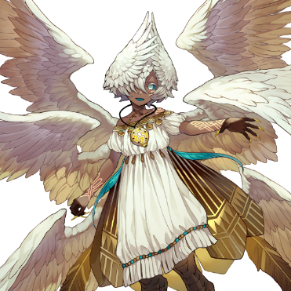

# 风之精灵

| 角色信息   | |
| ----------- | ----------- |
| 名称    | 风之精灵   |
| 年龄   | 未知     |
| 职业 | 风之精灵  |
| 对应曲   |《散華》 ～ EMBARK|
| 初出   | Chunithm SUN PLUS  |

## Episode 1 前往沙漠之海

>梅薇，就是梅薇哦。

谁都能获得幸福，谁都能平等生存的世界。

能够实现这点的，还得是作为唯一无二的存在的现世神明——尼非谢，才能够做到。

在神的伟力之下，世界皆是正确无比的事象，任何人都为他人着想，会为他人互帮互助。

这美好的世界，正是因为有尼非谢的慈爱才得以成立。

但是，即便是神，也有一些事情未能看透。

那就是——欲望。

潜藏在人们心中的，就像是随时盯着猎物的猛兽一般的，野蛮的存在。

没有注意到那样东西是多么的危险的尼非谢，最终被洪水般袭来的欲望所吞没，消失。

那些人们想要的，是寄宿于她体内的精灵之力。

那些执拗地追着她的人类们，在穷追猛打之下，终于将那四种精灵的力量从她身上扒了下来。

然后，这四种精灵的力量，继承到了四个人身上。

土之力量，分给了泰尔斯乌拉斯。

水之力量，分给了萨拉基亚。

风之力量，分给了梅薇。

火之力量，分给了艾薇尼亚斯。

自从尼非谢失踪，还有精灵的力量被继承出去以后，世界那脆弱的平衡局面就被轻易打破。人们为了争夺力量，展开了无尽的争斗，不知道在这期间究竟造成了多少悲剧。

人类的欲望是没有极限的。

面对眼前的东西，只会吃干抹净，然后去寻找下一个目标。

——下一个呢？下一个呢？下一个呢？

这才是，人类的本质。

——还要继续！还要继续！还要继续！

说到底，人也不过是野兽的一种罢了。

——这里是常年干燥无雨的沙漠之中。

而这里，也有着那些完全为了欲望而活的人们的身影。

“嘿嘿，没想到能够在这沙漠之中，捡到这样的宝啊！”

两个衣衫褴褛的男人，正用着仿佛要将对方吃干抹净一样的眼神看着面前呆呆站在自己面前的少女。

与之相对的，那位少女则是披着一条破布，手中拿着一把跟那娇小的体型完全不合拍的翡翠色短剑。

随着风沙卷起，从那破布底下就能看到毫无防备的赤裸身体。

完全不知道是什么来头，看起来也不像是旅行者的样子。

“……？”

看起来才不过十岁的样子。少女看着对面的两个男人，只是歪着头，并没有任何的反应。然而如果是**正常**的同龄孩子的话，看到几个男人正大口喘着气盯着自己的话，再怎么说也会有一定程度的拒绝反应吧。

“这家伙，意外地老实啊。虽然好像正在看着我们的样子呢。”

这么说着，其中一名男人为了能看清少女的脸，直接粗暴地将披在少女身上的布掀开了。

“这是怎么回事……竟然还长着角！？”

长在少女头上的，是一对像羊一样的角。双角分开了头发，而在耳朵的斜上方能看到角的根部的样子。

“这可真是活见鬼了……喂，你有名字吗？”

“名……字……？”

“对对对，就是你的名字！”

少女睡眼惺忪地盯着天空沉默了半晌。然后，像是突然想起来了一样，缓缓道来。

“梅薇。”

“梅薇？感觉好像在哪里听过的样子……嘛，这都不重要啦。我们可真是撞大运啦！这家伙，肯定能**赚一大笔钱**，肯定啊！”

就像是品鉴着商品一样，男人