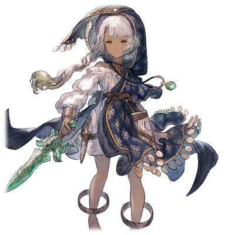

# 风之精灵 

 
  

| 角色信息   |          |
| ----------- | ----------- |
| 名称    | 风之精灵   | 
| 年龄   | 未知     | 
| 职业 | 风之精灵  | 
| 对应曲   |《散華》 ～ EMBARK| 
| 初出   | Chunithm SUN PLUS  | 

 
  
警告：该故事剧情含有非常多残酷和色情方面的描写，请谨慎阅读。承受能力低下者请在他人陪同下阅读。

## Episode 1 前往沙漠之海 
 
>梅薇，就是梅薇哦。 
  
  
谁都能获得幸福，谁都能平等生存的世界。 
 
能够实现这点的，还得是作为唯一无二的存在的现世神明——尼非谢，才能够做到。 
  
在神的伟力之下，世界皆是正确无比的事象，任何人都为他人着想，会为他人互帮互助。 
  
这美好的世界，正是因为有尼非谢的慈爱才得以成立。 
 
 
  
但是，即便是神，也有一些事情未能看透。 
  
那就是——欲望。 
  
潜藏在人们心中的，就像是随时盯着猎物的猛兽一般的，野蛮的存在。 
  
没有注意到那样东西是多么的危险的尼非谢，最终被洪水般袭来的欲望所吞没，消失。 
  
那些人们想要的，是寄宿于她体内的精灵之力。 
  
那些执拗地追着她的人类们，在穷追猛打之下，终于将那四种精灵的力量从她身上扒了下来。 
  
然后，这四种精灵的力量，继承到了四个人身上。 
  
 
 
  
土之力量，分给了泰尔斯乌拉斯。 
  
水之力量，分给了萨拉基亚。 
  
风之力量，分给了梅薇。 
  
火之力量，分给了艾薇尼亚斯。 

 
 
  
自从尼非谢失踪，还有精灵的力量被继承出去以后，世界那脆弱的平衡局面就被轻易打破。人们为了争夺力量，展开了无尽的争斗，不知道在这期间究竟造成了多少悲剧。 

  
人类的欲望是没有极限的。 

  
面对眼前的东西，只会吃干抹净，然后去寻找下一个目标。 

  
——下一个呢？下一个呢？下一个呢？ 

  
这才是，人类的本质。 

  
——还要继续！还要继续！还要继续！ 

  
说到底，人也不过是野兽罢了。 
  
 
 

——这里是常年干燥无雨的沙漠之中。 
  
而这里，也有着那些完全为了欲望而活的人们的身影。 
 
   
  
“嘿嘿，没想到能够在这沙漠之中，捡到这样的宝啊！” 
  

  
两个衣衫褴褛的男人，正用着仿佛要将对方吃干抹净一样的眼神看着面前呆呆站在自己面前的少女。 

  
与之相对的，那位少女则是披着一条破布，手中拿着一把跟那娇小的体型完全不合拍的翡翠色短剑。 

  
随着风沙卷起，从那破布底下就能看到毫无防备的赤裸身体。 

  
完全不知道是什么来头，看起来也不像是旅行者的样子。 
  

  
“……？” 

  
看起来才不过十岁的样子。少女看着对面的两个男人，只是歪着头，并没有任何的反应。然而如果是**正常**的同龄孩子的话，看到几个男人正大口喘着气盯着自己的话，再怎么说也会有一定程度的拒绝反应吧。 

 
   

  
 “这家伙，意外地老实啊。虽然好像正在看着我们的样子呢。” 
  
  
  
 这么说着，其中一名男人为了能看清少女的脸，直接粗暴地将披在少女身上的布掀开了。 
  
 
  
  
“这是怎么回事……竟然还长着角！？” 

 
长在少女头上的，是一对像羊一样的角。双角分开了头发，而在耳朵的斜上方能看到角的根部的样子。 

  
 “这可真是活见鬼了……喂，你有名字吗？” 
  
 “名……字……？” 
  
 “对对对，就是你的名字！” 
  
 
  

  
 少女睡眼惺忪地盯着天空沉默了半晌。然后，像是突然想起来了一样，缓缓道来。 
  

  
 “梅薇。” 
  
 “梅薇？感觉好像在哪里听过的样子……嘛，这都不重要啦。我们可真是撞大运啦！这家伙，肯定能**赚一大笔钱**，肯定啊！” 
 
    
  
 就像是品鉴着商品一样，男人上下打量着梅薇的身体。

 即便被人用猥琐的眼光看着，梅薇也只是以纯洁的眼神回应，没有任何厌恶的表现。

 
 “那么，小姑娘，就跟我们一起去个好地方吧？”

 “好，地方？”

 “呵呵，那可是个‘非常舒服’的好地方啊。”

 “嗯，我知道了。”

 
  

那些男人们并不知道这一切。

这位皮肤棕褐色，长着一对角的少女——梅薇。

她正是寄宿着风之精灵的少女。

## Episode 2 流浪者们的理想乡

>为了吃饱饭，为了活下去，梅薇会努力。

白色的鸟儿们在蔚蓝的天空中翱翔着，向着南方的方向飞去。

在那群鸟儿的下方，是如同蔚蓝的天空一般广阔的大沙漠。此起彼伏的沙丘绵延到地平线的远方，偶尔则随着强风的吹拂散去踪影。

这一切显得那么的随性，又显得那么自由——

 
  

纯洁无瑕的少女，梅薇，被那些男人们带到了一片位于沙漠之中的街区。

虽然说叫街区，但是并不像鲁斯拉和迪奥基亚那样金碧辉煌，亦或是整洁宽敞。

不管走到哪里，都是些又矮又破的茅草屋，虽说也不是什么惊世骇俗的地方，但怎么看都不像是人能居住的屋子。然而从那些建筑物的阴影之中，却能够窥见那些宛如猛兽般鬼鬼祟祟的眼睛，直勾勾地盯向这里。

这里是那些流离失所的人们为了寻找栖身之所从而自然建立起来的共同体。虽然被称作是共同体，但如果没有明确的领头人的话，那就没有任何规矩可言。

这里，正是一片没有任何道德和法律约束的街区。

随着男人带着梅薇绕过一个个拐角之后，他们来到了一座三层楼高的，整洁气派的大房子面前。

 
  

“到了哦，梅薇。”

“从今天起，这里就是你的**家**了。”

“……梅薇的，家？”

“啊啊。就是住在里面的话，就能够安全生活的地方。”

“嗯。”

“不！过！啊！你可不能在这里吃白食啊。如果想要在这里吃饭睡觉的话，那你就必须干活才行。”

“……？干活？”
 
  

梅薇歪着头，等待着男人们的话语。即便话已经说到了这个份上，梅薇却仍未有一丝警戒之心。

男人们看着梅薇，从他们那苍白的脸色中浮现了一抹奸笑。

 
  

“那么，这可得**实践**一下才行啊。”

“嘿嘿，就让我们好好地**教育**下你吧！”
 
  

这些占据着这间屋子的男人们，是盘踞在这一带的奴隶商人。

奴隶的话，一般会分为两种用途。

其一，是作为劳动力而使用。其二，是作为把玩的对象而使用。

 
  

虽然同样是奉上了自己的身体，但是这两种用途却完全不同。

前者，就要被派往严苛的环境中，拼命干活干到死去为止。

后者，则是**要以自己的身体侍奉那些付钱了的客人们。**

当然，天真无邪，样貌娇好的梅薇，自然是后者。

* * *

* * *

在一间被腥臭的气味所占据的房间之中。

在一张占据了室内大半空间的床上，正躺着受尽屈辱，被折磨得不成人形的梅薇。

完全不清楚自己的身体刚刚经历了什么，她只是呆呆地望着沾着些许污渍的天花板。

男人们看着梅薇的惨状，只是冷冷地说着。
 
  

“梅薇。从明天起，你就要在这里**工作**了。你可要记得今天教你的**工作内容**哦？”

“……嗯……我明白了。”

“虽然我还是觉得稍微表露些感情会比较好啦。”

“管他呢。说不定这样反而会有人喜欢呢。这个样子就足够啦。”

 
  

男人们说着任性的话语的时候，从外面传来了声音。

他们似乎想起了什么似的，向着外面大喊着。

“你们，都给我过来！”

 
  

被这么说着缓缓走进来的，是一群被禁止穿着衣服的，年龄尚小的少年少女们。

不，准确来说还是有一件东西“穿”在他们身上的。

——莎拉、莎拉。

随着蹒跚的步伐，铃声响起。

挂着铃铛的粗劣项圈，就是这些孩子们唯一拥有的东西。

简直就像是被圈养的家畜一般。

 
  
“从今天起，梅薇就是你们的同伴了！”

“接着就和平时一样，后面就交给你们收拾了！”

这么说着，男人们走出了房间。

然后，一名男人说着“哦对了”之后，回过头，把手伸向了掉在床上的翡翠色的短剑。

就在这时，直到刚才还毫无反应的梅薇，突然出现了意外的感情反应。

“……不要。那个，是梅薇的。”

那是在被“教育”的时候从未见过的，执着。然而，男人们并未在意这些，只是狠狠地将环抱着手臂的梅薇甩到一旁。

“……还给、我……”

“你想要拿回来的话，就乖乖用你那身体拼命干活吧！不努力干活的人，可是没有任何权利的啊！！”
 
  

等到男人们离开了房间之后，担心梅薇状况的孩子们围到了她的身旁。

“没事吧？很可怕对吧……”

“……？不，并不害怕。”

“咦？”

“可是，很痛对吧？”

“‘痛’……是什么？”

那些孩子们也曾遭遇过同样的事情，然而，不管怎么拼命地呼喊，痛哭，也无法将内心深处涌现出来的感情全部释放出来。以至于现在这些负面的感情仍旧弥留在他们的心中，让他们寝食难安。

所以，面对梅薇这预想之外的回答，孩子们反而不知该如何回应了。
 
  

“把梅薇的东西，还回来……”

不知是不是积累了不少疲惫呢，梅薇就这样在这止不住的念叨之中，缓缓地沉入了梦乡。

“怎么办，她睡着了啊……”

“总之，至少帮她擦干身体吧。”

“嗯。”

孩子们互相点头示意，然后仔细地帮她擦拭着身上的污秽。

“那对角，难道是真的吗？” “好漂亮的眼睛啊……”

在孩子们各不相同的反应之中，只有一位少年，正远远地看着梅薇。

## Episode 3 示范

>幸福。只要跟大家在一起的话，梅薇就很幸福了。

起床，吃饭，**工作**。

**工作**，吃饭，睡觉。

自从梅薇被带到这座房子之后，已经经历了数日。

谁都无法看透内心在想什么的梅薇。

但，她却有着比谁都更加强的学习能力。

人类是一种以迄今为止积累而来的思考和经验为基准，对现有的境况做出判断的生物。

所以如果是正常人被强行带到这座房子里的话，肯定会因为感觉到危及性命，从而抵抗那些登门拜访的“顾客”吧。

然而，并未被这些世间常理所影响的梅薇，将现在的这种生活，当成了理所应当的样子。

所以，一直持续不断地**承受着**大人们的欲望的梅薇，最终成为了店里的“头牌”，也是理所应当的事情。

那些奴隶商人们，也以“怪物之子”的名号，将梅薇的名声传至周围的那些城市和居住共同体。

 
  
一心一意谋求生路的梅薇，也在这之中不知不觉地获得了那些少年少女们的信赖，渐渐地能说上话了。

“……嗯。梅薇记住了。”

“呵呵，真了不起。那么这次就——”
 
  

对话语的理解，可以说就决定了这个人对整个世界的看法。

随着她慢慢地理解那些曾经暧昧不清的东西，她也开始渐渐的理解人类的感情是什么样子的了。

虽然，仍有一些人为她头上的角感到恐惧，但是更多的，是被她身上那股不可思议的魅力所吸引住。

 
  
“……呵呵”

“啊，刚刚笑了对吧！”

“嗯？……梅薇，刚刚笑了？”

“嗯，看起来很幸福的样子呢。”

“……幸福？就是因为幸福，才会露出笑容吗？”

 
  

她们所生活的环境，绝对算不上是多好。

但是，就算是短暂的瞬间，只要能够在某个角落获得一片安宁之地，就已经足够让人继续活下去了。

 
  
所以，梅薇第一次许下了一个愿望。

希望以后“幸福”也能如影随形。
 
  

但就是如此渺小的栖身之地，却也被人无情破坏。

一天早上，在大家都会前来集合的大厅之中，梅薇却见不到其他的人。

 
  
“为什么大家都没来呢？”

“——就让我来告诉你吧，梅薇……”

 
  
回答梅薇的问题的，是一个看起来十分暴躁的奴隶商人。男人歪了歪下巴示意她跟过来，然后男人就打开了房子的大门。

然后，出现在房门外的——正是那些之前还在欢声笑语，互相问候的那些孩子们。然而，他们却被赤裸裸地钉在木桩子之上。
 
  

“……呜……啊？”

曾经和梅薇很要好的那些孩子们，已经被折磨到不成人形了。

大家的身上都布满了被各种器具严刑拷打的伤痕，还有被狠狠凌辱过的痕迹。

不管怎么看，他们都已经没了性命。

一阵腥臭的味道乘着风闯入了鼻腔。

“……嗯……啊！”
 
  

梅薇面对着这股从未经历过的痛苦感情不知所措，只能杵在原地一动不动。

 
  
“这些家伙，全都是给我的店捣乱的祸害！啥事儿不干就天天教坏你，才让工作的成效下降了啊！”

 
  

男人越说越来气了。

简直就像是要将他所认为的“邪恶”的东西一并制裁一般。

“为什么……要做……这样的事情？大家，只是想在这里活下去而已……”

“哼，没想到竟然已经染上了他们的坏习惯了啊。”
 
  

这些管教者无比厌恶那些不服从他们意志的人。就算那只是存在于乳臭未干的小孩子之中的“思想”，也绝不放过。

因为他们深知，星星之火，可以燎原。就算只是一个微小的想法，也总有一天会成为让自己身首异处的诱因。
 
  

“你可得由我好好地再**教育**一番啊。”

男人皱起了眉头。

已经完全理解了“教育”是什么意思的梅薇，拼命地抵抗着。

“不要！我不要再被带到那里了！！”

“哈啊……真是令人悲伤啊，梅薇……明明刚来到这里的时候还是多好的一个孩子啊……”
 
  

然后，男人就像是念着咒语一般，开始说着某些东西。

罗诺，米莉，耶纳……

那些是仍未被遭到毒手的，曾经和梅薇接触过的孩子们的名字。

 
  
“……！不要，求你了……”

“一切都要看你自己了。你要是不回到平时那副样子的话，等到那些尸体被那些家伙吃掉之后，他们就会落得个同样的下场啊。那么，你要怎么办啊？梅薇！！！！！！”

 
  
“……！”

梅薇紧紧地抱着男人的脚，拼命地趴在地上恳求着。简直就像是家畜跪在地上请求主人的原谅一般。

“对，就是这个样子！但是，这还远远不够啊！过来，让我再一次教你，身为家畜，应该怎么**活着**啊！！”

就这样，梅薇被男人狠狠地抓着角，拖进了男人的屋子里。
 
  

“梅薇……”

在不远处，有一个人正躲在角落观察着这一切。

那是个皮肤些许黝黑，长着一头被太阳稍微晒过的黑发的少年，鲁歇。

他正是之前一直躲在远远的地方观察着梅薇的少年。

他把手放在胸口，集中精神呼吸了几下后，接着，就露出了仿佛下定某种决心的表情，向着梅薇被带走的方向进发。

## Episode 4 温和的风

>这把短剑，一直跟梅薇形影不离。是梅薇最重要的宝物。

那个男人——名叫达尔巴的奴隶商人，将梅薇直接拖进了房间，然后把她扔到了一张足以让四个大人躺在上面睡觉的大床铺上。

达尔巴大口喘着气，逼问着梅薇。
 
  

“喂，要做什么，你应该明白的吧？”

“……”

如果是以前的梅薇的话，肯定会立刻开始，按照达尔巴教她的方法取悦面前的男性。但是，萌生了感情的梅薇，已经不会再盲从于达尔巴的命令了。

“不要……不要啊……！”

“小兔崽子，都这个时候了还说什么傻话啊！”

 
  

一只大手挥了过来，狠狠地拍到了梅薇的脸上。大床发出被挤压的响声，与之伴随的，是项圈上铃铛的响声。

达尔巴就是如此十恶不赦。

当遇上什么不爽的事情立刻就会发作，拿周围的东西泄愤。甚至还是个只是为了发泄自己的不满和欲望，就向那些身为盈利道具的孩子们出手的男人。

承受了达尔巴身体全部重量的大床，发出了悲鸣声。

为了逃离眼前这个远比自己高大健壮的男人，梅薇拼命地向着背后退去……但很快，她就被逼到了墙边，无路可退。

 
  

“不要……”

“真是遗憾啊。不过就算这样我还是很感激的哦？因为你不管被怎么折腾，也不会厌恶，而且还很**耐操**啊。就算受了点小伤也能立刻恢复。所以我的饭碗才能够持续这么久不动摇啊。不过啊，这说不定也是一个机会呢。”

“……咦？”

“因为越不容易坏，就越想要把它破坏掉不是吗！？”

“……怎、怎么会……”

 
  
随着大床嘎吱作响，达尔巴正在慢慢逼近梅薇。

他的眼球里都是血丝，从嘴角处流出了口水。

露出这番面貌的达尔巴，简直就像是被肥肉所吸引的贪婪猛兽一般。

就在达尔巴贴到梅薇的面前轻声说着“你已经无路可逃”的时候，紧闭的大门被打开了。

 
  

“哦，已经开始了吗？”

出现在门外的，是达尔巴的同僚，另一个奴隶商人。

还有站在他前面，脸色铁青，低着头不敢直视眼前的景象的少年——鲁歇。

 
  

“喂喂喂，难道说你也想加入进来吗？”

“不、不是的！我只是……！”

“你这小变态给我闭嘴。这个家伙啊，从刚才可是一直在外面看着屋子的样子啊。你就那么想看梅薇被达尔巴‘教育’的样子吗？”

“搞什么啊！你这小子，想要一起玩玩就直说嘛！还是说你是那种……喜欢在远处看着的类型？”

“不、不要胡说！不、不要把我跟你们这些利益熏心的家伙相提并论！”

“少装蒜。我可是看的一清二楚的。你每次都会躲在角落里偷窥梅薇的样子的啊。想必，在梅薇跟那些男人们**玩**的时候，你也躲在一旁偷看对吧？”

“鲁歇……这是真的吗？”
 
  

梅薇那质问的眼神，让鲁歇低下了头，不敢正面回答。羞耻心和罪恶感涌上了心头，让他只能背过身去。

“嘎哈哈！果然你也是个变态色狼啊！”

“不是的……我……不是这样的……！”
 
  

看着正拿着自己的事情作为耻笑对象的达尔巴，鲁歇还不知道自己已经被人下了套，只是站在那里拼命地辩解着。
 
  

“不是的，不是的，不是的……！我……！”

鲁歇大喊着，然后在大家的注意力分散的时候，将那把放在架子上的翡翠色的短剑取了下来。
 
  

“不、不准你们碰梅薇！！”

“哼，那你倒是试试看啊。只要你觉得这种玩具刀能够伤到我们的话。”

“咦……？”
 
  

在鲁歇的注意力转移到手上短剑的时候，达尔巴起身一跃从床上跳了下来，然后冲到鲁歇的面前，以一记手刀直击鲁歇的手腕，鲁歇手上的短剑打了下来，在地上发出了响亮的金属音。

“呜——哇啊啊啊啊啊！！”

“太慢了！”

就在鲁歇想要直接扑上去的时候，达尔巴使出一记膝撞，直接命中了鲁歇的侧腹。
 
  

“鲁歇！”

“……嘎……啊……哎……”

“弱者，就要被夺走一切！这就是这条街上的规则啊！一直都在强取豪夺的我，怎么可能输给你这种小鬼头啊！”
 
  

然后，达尔巴捡起了地上的短剑，然后狠狠地插进了正向着大床上爬过去的鲁歇的左手。

“噫、啊啊啊啊啊啊啊啊啊啊啊啊啊啊啊啊啊啊啊啊啊啊啊啊啊啊啊啊啊啊！！！”

“哦，忘了说了，这把短剑当然是真货啊。”
 
  

鲁歇在地上拼命挣扎着，手臂的前端开始麻木起来。

刚才那一记足以让自己昏死过去的剧痛，立刻就将鲁歇的反抗之心扫了个烟消云散。

达尔巴握着仍旧插在左手之中的短剑狠狠地搅动了几下，然后就把短剑一口气拔了出来。
 
  

“——！”

“哦，不好意思啊，好像干得有点过火了呢。这样你连用这只手自己慰藉都做不到了呢。佐拉，给我按住这小鬼头。”

“好嘞。”

“鲁歇，你就坐在这里乖乖地看着吧……看看眼前这只怪物绝望地哭喊着的样子啊！”

 
  

达尔巴将手伸向动弹不得的梅薇的角。然后，不知道是不是想到了什么，他向着梅薇露出了一个奸笑。
 
  

“呐，我一直在想啊，要是把这对角砍下来的话，还能够再长出来吗？这可不得不试一下了啊！”

“不要！不要啊！”

“快住手……梅……薇……”

（救救，我们——）

就在短剑举到胸口的位置，向着角的根部砍去，最终触碰到角的那一刹那。

房间中，突然卷起了一阵风。
 
  

“这是，怎么了……”

那是一股十分温暖，温和的风。

达尔巴在被风吹拂而过的一瞬间，看到了梅薇身后正在蠢动着的某些东西。

那张开翅膀的样子，既像是野兽一般威严挺立，却又像是充满慈爱的某样东西。

简直就像是被早已不在这个世上的母亲抱在怀里，渐渐沉入梦乡一般——

在这满溢于这片空间的幸福感之中，达尔巴却一言不发。

因为，他就在并未注意到自己“已经死了”的情况下，被切成了稀碎的肉片。
 
  

“达、达尔巴啊啊啊啊！！？”

面对眼前这不可思议的光景，佐拉不禁叫出了声。

怎么可能，这里怎么可能有人能杀的了达尔巴？

这对未知事物的恐惧让他的心砰砰直跳。

就在这时，大床突然发出了嘎吱的响声。

在那里的，是一双宛如宝石般闪耀着的琥珀色的双眼————

“——！”

被切成无数碎片的肉块，在空中像雪花一样飞舞着。
 
  

“梅……梅薇……你，干了什么……”

“……嗯？”

面对这个疑问，梅薇也只能歪着头表示不解而已。

## Episode 5 欲望如蜜

>这里是梅薇们的城市。那些坏坏的大人们，已经不见了。从现在起，再也不会有谁被伤害了。

“梅薇，没事真是太好了。”

“鲁歇，没事吧？”
 
  

梅薇的视线，投向了鲁歇的手。

虽然已经用干净的布条好好包扎起来，但是血仍旧流个不停，渗透了布条，在上面留下鲜红色的污渍。

现在虽然算不上是平安无事的状态，但是鲁歇有更重要的事情要做。

 
  
“梅薇，拜托你，能不能穿一件衣服呢？”

“嗯……为什么？”

“达尔巴他们已经死了。所以，已经没有东西能束缚住我们了。那个项圈也不要了。穿自己喜欢的衣服就行。”

“……这是必须的吗？”

在鲁歇的面前，梅薇正在那里上蹿下跳。只有那跟这个地方毫不相称的铃声在室内回响着。

“这、这是必要的啊！在外面的世界，大家可都是穿着衣服生活的啊！”

“嗯……我明白了。”

虽然梅薇嘴上说着同意，但似乎并不是完全理解的样子。一边默默念着之后一定要好好地教她，鲁歇一边走进了房子深处的柜子中，开始寻找起适合梅薇穿的衣服。

  
  

“……呼，这样就行了。”

“嗯，那我们走吧。”

“咦？要去哪？”

“去外面。把那些邪恶的大人全部收拾掉。”

 
  
虽然刚刚才经历了无比惊悚的体验，但她仍是一副睡眼惺忪，看不出什么意思的表情。

明明她的年纪还很小。

但是，她还能够如此镇定的原因，难道是因为刚刚将达尔巴他们直接分解成了完全看不出原型的碎片的缘故吗？

还是说，梅薇，真的就是他们口中所描述的那样，是个怪物呢——

将这些想法努力收回自己脑中，鲁歇转移了话题。
 
  

“首先，还是将房子中的大家都聚集起来吧！”

在这之后，两人就在大房子中四处寻找着其他的孩子们，向他们传达达尔巴已死，他们已经自由了的消息。

“你们再也不用出卖自己的身体了。”，“你们已经自由了”——

他们无数次地向这些孩子们传达着这一喜讯，告诉他们已经安全了。

然而，和鲁歇的预想完全不同，这些孩子们却没有一个人感谢他们。

能够从毫无人性的奴隶生活中解放出来，这确实是一件好事。

但是，这说到底，也只是那些能够以其他方式生存下去的人才会有的想法。

这些孩子们能够不必面对那些流落于街头的无赖们的威胁威胁，还是多亏了达尔巴的名声。

他们自己也很清楚这点，所以，在那些有力量的大人底下接受被管理着的生活，相比在街头无所适从地流浪着来说就要好出十倍百倍。

* * *

* * *

看着大家渐渐冷静下来之后，鲁歇将房子里所有的孩子们聚集到了大厅，讲述了之后的方针。

虽然鲁歇一直向着孩子们讲述着一同生活，一同团结的重要性，但是还是有不少人难以认同这点。

就在这时，他向众人讲述了在塔尔巴的房间由梅薇的力量所引发的奇特现象。虽然大家的反应差强人意，但不管是否在梅薇面前目睹了她风之精灵的力量，许多的孩子们还是加入了鲁歇的队伍之中。

虽然想要统一大家的想法还需要些时间，但为了净化这条街道，鲁歇他们还是展开了行动。

排除那些危害他们的大人们，创造一个不可侵犯的，由孩子们所组成的城市。

* * *

利用梅薇的精灵之力所进行的净化行动很快获得了成效。才没几天，他们很快就把那些盘踞于城中的无赖赶了出去。

之后的几天，整座城市就变成了只有孩子的乐园。

虽然偶尔还会有同伴之间的冲突，但并没有发生什么较大的乱子。整座城市就这样朝着安定而充满未来的方向前进着。

仅靠孩子们运营一座城市，并不是一件一帆风顺的事情。但是，面对未知未来的美好憧憬，还有对自由生活的期待，还是成为了他们的精神支柱。

这座城市，正在逐渐向着美好的未来进发。

是的。这个时候的众人，还是这么想的。

 
  

“切切切，各位初次见面。在下名叫阿基纳，只是个名不见经传的行商人而已……”

变化的征兆，其发端总是如此细小的事情。

第一个来到这片重获新生的城市的人，正是定期将食物和其他日用品送到这里的行商人。

和鲁歇差不多身高的瘦小男人，摆着一副假惺惺的笑容，用惋惜的语调说到。

“没想到才没过几天这里就发生了如此巨大的变化啊。真是可惜啊……听说达尔巴大人死了，是吧？达尔巴大人的店，对于长途跋涉的在下来说，这里可是不可多得的‘绿洲’啊……”

 
  
这个家伙也是那些将孩子们当成猎物的坏人吗。鲁歇对男人的警戒心又添加了一分。虽然早已和代表这座城市的梅薇见过了面，但现在的他开始对自己的选择感到后悔。

“可惜……吗？”

“是的。你们对于这座城市的认识还是太单纯了。这里啊最缺少的，就是**欲望**啊。像是蜜糖一般，无比甘甜的欲望……”

“我们可是一直都在你们脚下痛苦着啊。你们这些掠夺的人又怎能明白这些事情？”

“切切切，话可不是这么说哦，鲁歇君。人啊，要是不将自己的欲望释放出来的话，那又何以称之为人类呢？就算是你们，想必也有自己的欲望吧。”
 
  

这么说着，阿基纳突然露出一副想到什么的表情，指向了鲁歇那只被绷带包扎着的手。

“作为给你们的见面礼，还有表示友好的证明，今天就让我免费提供这些事物还有好用的药膏吧。”

“咦……”

“看你也有些困扰对吧？看看这伤口处，都渗出血来了，而且你们也应该没有多余的绷带用来包扎了吧？食物方面，既然那么多人要生活在这里，那肯定是多多益善啊。”

“可是，怎么能就这样收下这些东西……”
 
  

阿基纳看着鲁歇这摇摆不定的态度，立刻从中看到了商机，顿时说了下去。

“那么，这样又如何？既然觉得不能这样白白收下这些东西的话，那就请让我去街上逛逛，好好见识一下这座城市吧。让我自己确认确认，现在这座城市需要些什么。这样，算得上扯平了吗？”

“不、不，倒也不用这样……”

明明两者的体型差距不大，但阿基纳的背后却隐隐传来一种无形的压力。明明外表只是一个游走于世界各地的行商人而已。

当然，能够跟达尔巴他们做生意，那阿基纳也得有两把刷子才行。
 
  

“——鲁歇。如果只是让他看看城市的话，可以哦。”

“可是，梅薇——”

“那么一言为定！非常感谢您！这位拥有宝石般漂亮的双眼的小姑娘！”

 
  
阿基纳将自己骡子上的货物卸下来交给鲁歇他们之后，立刻就开始游历这座城市……然后在太阳下山之前就离开了这里。

虽然看起来很可疑，但是目前的整个城市也没出什么大问题。

而鲁歇也在日渐繁忙的生活之中，将这件事彻底忘在了脑后。

## Episode 6 乐园失坠

>大家已经变了。不能再留在这里了。

——这是谁干的！犯人是谁！

那一天，这里仿佛回到了曾经一片混乱的时候。

发起暴动之人，妖言惑众之人，挑拨离间之人——那些孩子们就像是着了魔一样，在城市里大肆破坏。

而这暴乱的原因，就是——存放于大房子之中的食物，在一夜之间不翼而飞。

虽然他们在存放食物的地方布置了看守，但当他们走进空空如也的仓库的时候，却只发现了他的尸体。而这也导致了他们迟了一步才发觉这件事。
 
  

“怎么办，鲁歇……大家都在四处破坏……”

“怎么可能，这怎么可能……这到底是……”
 
  

骚动已经越来越大，甚至扩大到整座城市的地步。

想要将这些化为暴徒的人们停止下来，光靠鲁歇的话语是不够的。

 
  
只要使用梅薇的力量的话，想必事态很快就能平息下来。

但是，对于鲁歇来说，利用暴力控制和支配这里，是无论如何都不能做的事情。

因为一旦使用过一次暴力的话，鲁歇梦想中的那个城市就会烟消云散。

必须找到使用暴力手段以外的方法解决这次危机。

然而，对于年纪轻轻就成为了领导者的鲁歇，还有对世事万物一无所知的梅薇来说，这实在是太难了。

 
  

不止如此，他们烦恼的还有别的事情。

那就是本该保护他们这些弱者的年长的男人们，竟然在背地里偷偷地对数名少女施暴。

鲁歇犯的最大的错误，就是在将那些孩子们从房子中解放出来之后，并未对他们实行教育这件事。

这些被带到大房子中的孩子们，绝大多数都没有受过像样的教育。

而要是一直都在达尔巴那样的大人手下过活的话，沾染上他们的恶习也是在所难免。

 
  

而就在他们磨磨蹭蹭的途中，骚乱还在持续地升级着。

外面的暴乱已经发展到难以维持一个居民共同体的地步了。

必须尽快做出决定才行。
 
  

“切切切，看你们很困扰的样子呢？”

“你、你是……”

简直就像是瞄准了这个时机一样，出现在大房子面前的，正是之前的行商人，阿基纳。

仔细一看，在他身后，还跟着以那个年长的男人为首的，许多的孩子们。

他们的手上，握着大大小小，形态不一的武器，脸上则挂着古怪的表情。简直就像是心不在焉，并未在意这里的一切一样——
 
  

“难道说，引起这场骚动的人……”

即便鲁歇怒目圆瞪，狠狠地盯着阿基纳，阿基纳也只是平静地笑着。

“哎呀，您这是在说什么呢？我只不过是帮助大家，想办法让大家能活的更加舒服而已啊？”

“帮助？把这座城市搞得一团糟，这也算得上是你的‘帮助’吗？”

“怎么会。我可从来都没这么想过哦？这一切，可都是他们自己的想法啊，对吧，各位？”

后面的人们纷纷举起了武器高声喊着。

“鲁歇，就你小子一个人独占便宜，太狡猾了！也把那个怪物女借我们玩玩啊！”

“嘿嘿，有那双角，应该会很方便的吧……”
 
  

怪物，怪物……眼前的这些人们都纷纷暴露出自己内心最为丑恶的欲望。在场的所有人，都并未把她当做一个正常的人类看待。

“……梅、梅薇才不是怪物……！”

“啊啊，梅薇，可是人类啊！”

鲁歇站在梅薇面前，大声呼喊着。但是，不论他们怎么劝说着，都无法阻止眼前这些失去理智的人们。

必须在被他们杀死之前做些什么。

“鲁歇，已经足够了哦。要出手吗？”

梅薇将手伸向了翡翠色的短剑——然而，鲁歇却伸手制止了她，摇了摇头。

“这样是不行的，梅薇。如果在这里出手的话，我们就和那个家伙没有两样了。”

“可是，再这样下去的话，鲁歇会……”

“切切切，这就是传说中的那把操纵风的力量的短剑吗！”

阿基纳刺耳的声音响起，顿时，骚动的现场都冷静了下来。

 
  

“那么！果然，你就是传说中的风之<ruby>巫女<rp>（</rp><rt>西比拉</rt><rp>）</rp></ruby>，对吧！？”

“<ruby>巫女<rp>（</rp><rt>西比拉</rt><rp>）</rp></ruby>？”

“鲁歇君，这是你不必知道的事情。这些事情对于小孩来说可是根本处理不了的事情啊。那么，我在此提出一个建议吧……只要把她和那把短剑叫出来，我就可以保证你的性命哦~？”

阿基纳故意提高了声调，阴阳怪气地提出了不公平的要求。

“这不就是单纯的威胁吗！我可不会屈服于这种东西！”

“哦，是这样吗。”

阿基纳回头向着后面的人们说到。

“那么各位，就请你们把鲁歇君杀掉咯。”

“梅薇！我们逃吧！”

“嗯……！”

 
  

比那些人们的动作更快，梅薇在千钧一发之际建起了风的墙壁。风之墙壁挡住了阿基纳一行人前往梅薇他们的去路，毫不费吹灰之力，就把那些暴徒们打得七零八落。

“切切切，这还真是厉害啊！你们可要给我记好了，就算追到天涯海角，我也不会放过你们的！”

 
  

就这样，两人逃离了那座大房子，离开了城市。

这一天，孩子们的乐园彻底崩坏了。

但是，鲁歇却没有一丝后悔之意。

因为，在他身边，还有这位既美丽，又拥有可怕力量的少女。

对他来说，没有什么比这位少女选择了他更加高兴的事情了。

* * *

甚至都没来得及收拾，梅薇他们就这样匆忙地离开了这座城市。

本以为会是一场永无止境，漫无目的的流浪，但他们才踏上旅程不久，他们就碰上了一些从那座城中逃出来的人——他们因为厌恶阿基纳的统治，也选择了离开。
 
  

“鲁歇，今后我们该怎么办？”

“老实说我还没什么想法……不过，至少有一件事必须做。”

鲁歇从麻袋中取出了一株幼苗。

那是之前从阿基纳那里得到的一株幼苗，但由于事情太多，一直没来得及找个地方将它种下来。

“让我们找一片土地，种下这株幼苗吧。”

“嗯……我知道了。”

 
  

虽然他们的心中燃起了希望，但对于没有准备像样的食物和交通工具的他们来说，这场旅途未免太过辛苦了。

众人只能以树根虫子果腹，沿着一切可以休息的地方前进。

但是，这种长途跋涉的旅行，肯定会为众人带来巨大的负担。

几天之后——就有人再也走不动，倒在了旅途之中。

 
  

“……可恶，都是我不够努力才会……”

“呐，鲁歇……帮他们安葬一下吧……？”

“梅薇，你还是不要乱动为好。”

 
  
虽然那些年轻的男人们还撑得住，但是身材娇小的梅薇已经吃不消了。

她已经十分衰弱，再这样下去的话，说不定她也会步那些人的后尘的。

就在这时，鲁歇做出了某个**决定**。
 
  

“各位，听我说。”

鲁歇强忍着颤抖的声音，努力地将之后的话说了出来——

“……这些，可，可不能**浪费**啊。这可是，重要的，‘食物’啊。所以，安葬什么的，之后再做吧。”

“鲁歇……？”

“等等……你当真的吗！？你知道你在说什么吗！竟然要把一直跟我们同甘共苦的同伴们的尸首吃掉……是这样的吗！”

“你们也要理解啊。即便要背负那两个未能够跨越这场旅途的人的命，我们也要活下去。虽然真的很痛苦，但是，光靠这些是填饱不了肚子的……！”

谁都没有为鲁歇的话语感到惊讶。因为这位曾经比任何人都希望大家活下去的少年，在这连日的劫难和跋涉之中，早已经被无数的不幸和变故摧残到无以复加的地步了。

“虽然还有更残酷的事情要说，但还是……希望你们能够理解……”

为了不再出现拖队者，所以鲁歇将要做些什么，大家都心知肚明——

那就是——将同伴们的尸首分解。

 
  
“就算是为了公平起见，至少各位都来帮一下忙吧。然后如果是在是无法忍受的话，那就默念着这句话吃下去吧——‘感谢你们能够成为我们的血肉，一同永远地活下去’……”

“鲁歇……真的，要吃下去吗……？”

“嗯。我实在是，不想失去你啊……”

 
  
鲁歇把手放到了梅薇的肩上。

那只手还在颤抖着。即便说出了那样的话，他还是对要将同伴吃掉这件事心存恐惧。

“我们，可是由坚固的羁绊所组成的家人啊。不管是辛苦的事，还是快乐的事，我们都是一同共享着的——”

然而这么说着的鲁歇，他的眼中却黯淡无光。即便没有人指出这点。

以鲁歇为定点所组成的流浪者的共同体。

曾经在心中种下的理想，在残酷的现实面前也只能被锤个粉碎，只剩下某些可怕的东西留在那里。

* * *

在那之后又过了一阵子，梅薇他们终于在沙漠的边缘找到了一个可以定居的洞窟。

有水源的话，那附近肯定有湿润的土地。只要在这里的话，肯定能够让种子开花结果的吧——在这之后，一切也会顺利起来……

不管是谁，都这么想着。

“可恶……又枯萎了！为什么不管怎么做都没办法栽培起来……！”

积累很久的种子和幼苗，不知不觉间已经见底。明明培育的环境已经很齐全了，为何还会如此……

结果，这一天也是空手而归。

 
  

深夜。

在能够听到些许风声的昏暗洞窟之中，鲁歇正和梅薇一起躺在铺好的床上，肩靠肩地躺着。

“梅薇……求你了，哪里都不要去……”

在同伴们接连不断倒下的噩耗之中，鲁歇已经快坚持不住了。

而作为其寻求慰藉的对象，他开始向梅薇寻求着温暖。

距离鲁歇和梅薇初次见面，已经经历了许久。

曾经还和梅薇一个个头的鲁歇，现在也已经长大到环抱双臂就足以将她纳入怀中的地步了。

在共同体的同伴们一个个逐渐长大的过程之中，只有梅薇从未变化，仍旧是初见面时的那副样子。

身体娇小的她，已经没办法伸手环抱住他的背部了。所以，梅薇选择了直接把手伸向他的脖颈……也就是围着后颈这样，抱住了鲁歇。

 
  

“我明白的，鲁歇一直都在为大家而努力着呢。下次肯定能够成功的。”

“谢谢你……梅薇……”

 
  
如果是平时的话，两人的互动也就到这里了。

“梅薇……”
 
  

但是，背负着众人的生命的重担，正在缓缓地夺取鲁歇的理性——回过神来，两人的嘴唇已经重合了。
 
  

“……我、我到底在干什么——”

慌乱的吐息从嘴边漏出。明明只是互相亲吻了一下而已，心脏却在拼命地狂跳，简直像是一柄巨锤敲打着自己的脑袋一般，鲁歇感到一阵强烈的冲击。

恐怖。恐怖，实在是太恐怖了。

简直就像是自己即将不再是自己一样——

“没事的……”

“……！”

就像是要将自己的一切交付给鲁歇一样，梅薇张开了四肢。

鲁歇的脑海中，回想起了第一次见到她的时候的光景。

那宛如刚出生的孩子般的身姿，还有承受着那些大人欲望的时候的身姿。

其实，他打从心底里，就想要这么来一次。

就算一生只有一次也好，想要将自己所有的欲望在允许的范围内，尽情地释放到她身上。
 
  

“梅薇，哪里都不会去的哦。”

这正是，鲁歇一直都在等待着的那句话。

## Episode 7 参差不齐的生命

>鲁歇，一直都会和梅薇在一起的哦。

——第二天早上。

鲁歇在席卷全身的倦怠感之中，从睡眼惺忪中起来。

似乎听到了什么声音，难道是梅薇在他身旁的梦话吗？鲁歇这么想着，把手伸向了身体周围。

然而，他却没有触碰到那应有的温暖。

 
  
“——！”

声音再次响起。这次听得清清楚楚。

声音在洞窟内回响着，就像是警钟一般尖锐。
 
  

“难道说——是追兵！？”

鲁歇条件反射般跳了起来，冲到了洞口。
 
  

“梅薇……梅薇！”

在不远处，他所寻找的人就在那里。
 
  

**她**似乎是被门口的其他同伴围住的样子。

鲁歇不禁松了口气。就在他即将向着正背对着自己的**她**打招呼的时候……

 
  
“嗯……？”

不知是不是自己的错觉，**她**的个头似乎比平时还要高大。

梅薇的个头，本来应该就到鲁歇的胸口而已。对于平时形影不离，甚至昨晚还一同翻云覆雨的她来说，鲁歇怎么都不可能认错。

那么，眼前这个跟自己**同样**个头的**她**，又是谁呢？
 
  

“啊，鲁歇，早上好。”

注意到鲁歇的存在，梅薇转过了头。

她正在温柔地笑着，而在她的身边——两个跟她长得十分相像的小女孩，正被她抱在身上。
 
  

“鲁歇、鲁歇——！”

“鲁歇——鲁歇！！”

两个女孩子从梅薇的手上降了下来，然后抱住了因为震惊差点站不稳脚步的鲁歇的双腿。

 
  
浅黑色的皮肤，琥珀色的双眼。还有——那动物一般的角。

她们的样子，简直就像是梅薇一样。

除了样子看起来年幼几分以外，不管是声音，还是行为举止，不管从哪里看，都跟她很像，或者说——像过头了。
 
  

“——！！”

在认识到这一点的瞬间，一股恶寒从鲁歇的背上传来，令他胆战心惊。
 
  

（我、我到底是……我昨晚，到底是和什么东西“接触”了啊……！？）

和人类完全不同的，异形的生命。

她到底……应该说她们，到底是什么样的存在啊？

在这个时候，鲁歇的脑中想起了阿基纳威胁自己交出梅薇的时候的事情。
 
  

——风之<ruby>巫女<rp>（</rp><rt>西比拉</rt><rp>）</rp></ruby>。

 
  

难道说，从一开始，他就知道这一切的事实？

而他正是追寻着像她这样的奇异存在，才在城市中搜寻的话——

“嗯？鲁歇，怎么了？”

“不、不要靠近我啊啊啊啊啊！！”
 
  

面对鲁歇的突然变化，梅薇顿时哑口无言。

这响彻洞窟的悲鸣，很快就吓得刚才还在他的脚边玩着的两个小女孩落荒而逃。那两个小女孩露出惊恐的表情，一溜烟逃回了母亲的背后。

“……梅薇，是做了什么错事了吗？”

梅薇露出一副怯生生的样子，只是怯生生地看着鲁歇的反应，眼睛中甚至还泛着泪光。

“……”

“能不能，能不能说点什么……”

就在梅薇颤抖着手伸向鲁歇的脸的瞬间——

啪。

一道响亮的声音响起，她的手被某样东西弹开。

“你到底是谁……”

“咦？梅薇，就是梅薇啊？”

“不对……这不对，这不对，这根本不对啊！！你，你才不是梅薇啊！！我所知道的梅薇……梅薇……！！”

如果是还在那座城中的鲁歇的话，说不定还有些余裕去接受梅薇这突如其来的成长也说不定。

但是，在踏遍死地，经历了无数生离死别，心灵已经枯竭，变成了只懂所求的野兽的他，再也无法抑制住自己内心的冲动了。

“把‘**我的**’梅薇还回来啊！！你这个……怪物啊啊啊啊！！！”

这句话，一直潜藏在鲁歇的内心深处的某个角落。

那充满愤怒的脸庞，被恐惧着的双眼。

被自己最爱的人全心全意所拒绝，所恐惧的反应，给纯粹的梅薇造成了无比沉重的打击。
 
  

“啊……啊啊——”

梅薇的悲鸣，在洞窟之中响起。

这感情的爆发产生了短时间的扭曲，令梅薇在不经意间，发动了风之精灵的能力。

当风再度停下来的时候，周围，已经没有任何活人了。

曾经一起前行，一同分享悲伤和喜悦的重要之人。

现在，他已经变成了一滩不会说话的肉酱，散落在洞窟的地上。

“——鲁，——鲁歇——”

从他那嘴唇的口型上，仿佛是在说些什么的样子。然而，已经没有人能够告知，这未曾说出的话语是什么了。

“对不起……对、不起……”

琥珀色的眼睛哭到红肿，梅薇一边努力地从血水和残渣中试图将“那个人”聚集起来，一边像是梦话一般，不停地重复着。

“鲁歇……？” “鲁歇，在哪里————”

仍旧不能理解究竟发生了什么事情的女孩子们，在血水的池子之上兴奋地跳着。每当小脚踩在血池之上，就发出清澈响亮的，啪嚓啪嚓的水声。那些女孩子们不能明白眼前的这些东西究竟意味着什么，只是尽情地享受着**戏水**的快乐。

“妈妈？” “怎么了吗？”

女孩们注意到了蹲坐在原地一动不动的母亲，纷纷上前询问。梅薇只是露出了个无力地笑容，一边说着“没事了”，一边温柔地抱着两个女孩。

* * *

那天晚上。

梅薇郑重地吊唁了鲁歇他们。

那些曾经是“鲁歇”的肉块，被无数的灯光所包围着，在光芒的中央熠熠生辉。
 
  

“呐？” “这是要做什么吗？”

梅薇向着对眼前的一切浮现好奇心的女儿们，平静地解释着。

**身为她们生父的鲁歇，为她们这个共同体所定下的，无一例外的戒律——**

“今天，是个特别的日子哦。为了向我们的**爸爸**表达感谢的心意，所以，我们要把**爸爸**吃掉哦。”

“嗯。” “不胜感激——”

“那么跟着梅薇……不对，跟着妈妈的指示做。”

“这个知道——” “像这样吗？”

“咦？”
 
  
女孩们双手合十，闭上了眼睛，口中诵读这感谢的话语。明明自己从来都没有教过她们，这一刻，却从她们的口中说出——
 
  
“这些孩子们，难道说连记忆也……”

梅薇发现自己正被女儿们催促着，赶忙转过头来，将视线转向了**鲁歇**的方向。

然后，双手合十，为那些已经逝去的人们诚心祈祷。

“**感谢你们能够成为我们的血肉，一同永远地活下去——**”

**曾经所爱之人的肉片，是那么地柔软——**

## Episode 8 风流依旧

>来吧，让我们一同祈祷吧。为这个世界上诞生的一切事物，存在于这个世界上的一切生命——

“抱歉啊，鲁歇。最后的幼苗，也枯萎了啊……”

当梅薇在洞窟里安葬好大家之后，她就带着女儿们展开了漫无目的的旅途。

“妈妈？” “这是要去哪呢？”

“呵呵，那么，究竟该去哪里呢——”

 
  

身为原初的风之<ruby>巫女<rp>（</rp><rt>西比拉</rt><rp>）</rp></ruby>，生母为丰穰神·尼非谢的梅薇，在她的体内，并不像她的母亲一样拥有四种精灵的力量。

所以，对于仅靠风之精灵的力量分裂形成多个身体的梅薇和她的女儿们来说，如果要维持现在的状态的话，就要在无意识之中吸收大量的生命力。

而这不仅限于大自然，也包括人类在内。

 
  
她们自己，则根本无从知晓自己的生平，还有她们自己究竟是如何诞生于这个世上的。

而她们能够渐渐厘清这些谜团的时候，那已经是她们再度被人类的欲望所沾染，所玷污之后的故事了——

* * * 

“切切切，就是这个地方吗……”

一个男人正骑着骡子，在洞窟里眺望着远方。

他正是阿基纳，曾经让鲁歇和梅薇所建立起来的美好城市一夜之间被欲望侵染，付之一炬的矮小男人。

当时还是一头黑发，瘦小干练的样子的他，现在也变得圆润起来，四肢则像是枯枝般细小。混杂着白发的头发，彰显着时间在他身上留下的道道痕迹。

而为什么他这样年老力衰，还要不辞辛劳，带上护卫来到这种地方呢？

 
  

“据说，在沙漠的尽头，有一座俘虏男人芳心的究极乐园”

这个传言，是从阿基纳所支配着的那座充满欲望的城市之中，突然传开的。

听说，到达那里的男人，会受到一群有着琥珀色的双眼的不可思议的女性们的盛大欢迎，在里面享受着三天三夜，永不停歇的快乐盛宴。

 
  

“阿基纳大人，在那个洞窟之中真的有这样的东西吗？”

看着讶异的护卫，阿基纳急促地喘着气回答到。

“正所谓空穴来风，不论是什么样的传言，绝对是有源头可以追溯的。就算是看起来十分离奇的话，只要追根究底，总能够找到最根本的真相啊。而且……切切切……”

 
  

看着在那边滔滔不绝的阿基纳，那些护卫们也放弃了继续追问的想法。

阿基纳呢，则正在沉浸于即将将年岁已高，却仍旧拥有精灵力量的少女——<ruby>巫女<rp>（</rp><rt>西比拉</rt><rp>）</rp></ruby>收入囊中的美梦。

那双放光的眼睛里，仿佛映照着那个男人对阿基迪斯、迪奥基亚，鲁斯拉这样的拥有<ruby>巫女<rp>（</rp><rt>西比拉</rt><rp>）</rp></ruby>力量的国家的无限憧憬一般。

 
  

“快，快！我们现在就赶紧下去吧！”

从骡子上降下来，阿基纳带着护卫们走进了洞窟。

洞窟比他们想象的还要深，而且形成了一条缓缓的下坡道。

即便护卫再三吩咐有多危险，阿基纳仍旧身先士卒，向着洞窟的深处进发。这幅神采奕奕的样子让人不禁怀疑如此衰老的身体里究竟还潜藏着多少能量。

在他们继续前进了片刻之后——阿基纳感觉到了从深处传来的物品的声音，还有漏出来的灯光。

随着他们距离深处越来越近，这一切也越来越清晰。

 
  

“切切切，果然传言是真的啊！”

“啊，请等一下啊！阿基纳大人！！”

无视了护卫的呼喊，阿基纳冲进了洞穴深处。出现在他眼前的景象是——

 
  

“啊、啊啊啊——” “哼、哼哼嗯——”

“已经、已经不行了……求你们，放过我——”

 
  

许多男女在洞穴深处，正一丝不挂地缠绵在一起。四肢就像是盘卷的蛇一般，进行着混乱而又疯狂的交合之宴。

这到底是经历了多久呢？里面的男人已经有不少在拼命祈求着那些女人们放他们回去了。然而，那些或跨坐着，或缠绵着的女人们，却像是没听到一般，持续地榨取着他们……持续地索求着他们。

要是一个吃干抹净了，那就去找下一个。之后再找下一个，再找下一个……

这深不见底的渴求着的身姿，简直就像是动物一般。
 
  

“切切切，这还真的是……”
 
  

女人们的年龄参差不齐。既有年幼的孩子，也有青涩的少女，更有妙龄的女性，或者正值壮年的女人。

即便是利欲熏心，简直可以堪称是欲望结晶的阿基纳，都未曾见过如此奇异的光景，只能杵在原地目瞪口呆。
 
  

吞了吞涌上来的口水，他慢慢地走进了正在交合的男女之中。

 
  
“那、那个……能不能让我……加入其中呢！”

“阿基纳大人，您没事吧！”

 
  
就在这时，被甩在后方的护卫们，紧随其后到达了洞窟深处。沉浸于交合之中的女人们被脚步声惊醒，一同转向了阿基纳他们所在的地方。

琥珀色的双眼，野兽般的角。

不管是哪个人，都露出一张极为相似的脸微笑着，引诱着眼前的男人。

不管哪一张脸，都让阿基纳十分熟悉。
 
  

“梅……梅薇……！”
 
  

即便在异常的状况之中能够冷静思考着的他，现在也已经不剩一丝理智了。

就像是被什么东西吸引一般，阿基纳向着那些长着和梅薇有同一张脸的女人之中冲刺过去。

随着奔跑，他一件一件地褪下自己身上的衣服。随着他渐渐地宽衣解带，他的心跳就变得越来越快，越来越兴奋。即便如此，他仍旧没有停下来，而是拼命地呐喊着，释放着自己的欲望。

——快一点，让我尽情地享受这群女人啊！

阿基纳，冲进了女人的海洋之中。

 
  

——那到底是经历了多久呢？

——究竟是几个小时，还是一个晚上呢？

在昏暗的洞窟之中，时间的观念已经被搅乱。

再加上那些女人们能够让比阿基纳强大的多的男人都为之屈服，为之取悦的高强技术，阿基纳再也没有任何反抗之力，思考被彻底遮断，甚至连意识都变得极为朦胧。

在这交合之中，感觉就像是无数的生命都混合成了一个存在一般。

片刻，在侧躺于一旁的阿基纳的视野里，他看到了那些他带来的护卫们。

他们，已经完全失去了理智，变成了仅剩欲望的野兽。

自己也终有一刻会变成那样的吧。

阿基纳靠着自己仅剩的一点理性，向着正跨坐在自己身上的少女大喊着。

 
  

“快，快……快停下来啊……！！已经……够了啊！！！”

“为什么？明明还完全不够哦，阿基纳？”

“什么……竟然知道我的名字……果然，你是……”

 
  
回过神来，自己的周围，已经被大大小小，各种各样的“梅薇”所包围着了。

大家就像是唱歌一般，咏唱着阿基纳的名字。

那一模一样的无数张脸，一模一样的无数双眼睛，都在无比渴望地盯着阿基纳。
 
  

阿基纳在这些女人之中，注意到了一个截然不同的视线。

 
  
“看起来是很熟悉的人呢？”

 
  
在这些“梅薇”之中，走出了一个年事已高的女人。

这个“梅薇”，眯着眼睛，露出一副沉浸于回忆中的表情。

她正是那个时候，和阿基纳正式见过面的梅薇本人。
 
  

“切、切切……这还真是久违了啊，梅薇小姐……”

“是啊，真的是，好久不见了。我啊，一直都相信着你，会来到这里的。”

“……这、这难道说……”
 
  

梅薇露出自信的笑容。
 
  

“你也应该见过这里的景象了吧？被欲望所填满，这座城市，实在是美丽至极，对吧？”

“切、切切……”

“呵呵，大家也似乎在说想要早点享用的样子呢。”

女人们开始缓缓接近仍旧躺在地上的阿基纳。

只是一个人就已经把阿基纳榨取到如此地步，要是继续跟这群怪物们混在一起的话——

“男……你要多少男人，我都能给你！所以，求你了！求你救我一命啊啊啊啊啊啊！！”

“没关系的。就由我来‘救’你吧。”

“咦——？”

阿基纳就这样，目送着露出母亲一般慈祥温柔表情的梅薇，缓缓地被围上来的女人们彻底吞没，消失——

* * * 

阿基纳已经变成了一具尸骸，而梅薇们仍旧在索求着他。

他的头颅被精妙地分成了几块。随着他的头颅被人举起，那位身为“母亲”的梅薇，如此祈祷着。

“为这个世界上诞生的一切事物，存在于这个世界上的一切生命——施以祝福！”

那尸首上男人的表情，是如此的恍惚——
