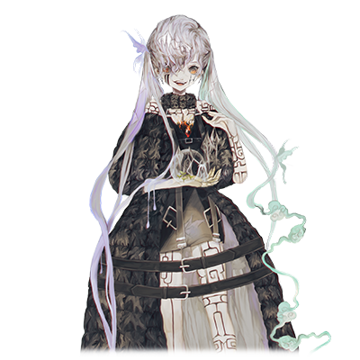

 

# 创造神·伊迪亚

| 角色信息   | |
| ----------- | ----------- |
| 名称    | 伊迪亚      |
| 年龄   | 不详        |
| 职业 | 创造神  |
| 对应曲   |《破灭》～Rhapsody for The End   |
| 初出   | Crystal Ep.3    |

## Episode 1 创造神·伊迪亚

> 神制造了一个箱庭般的世界。然而，神却将这个世界认定为失败的作品。

太古往昔，创造神·伊迪亚出现在这个小小的箱庭世界。

神为了创造出自己理想中的世界，利用了感情的力量，制定了两个“法则”。

 

其一，是名为“希望”的，能够让灵魂固定于肉体的容器之上的力量。

其一，是名为“绝望”的，能够让灵魂脱离于肉体的容器之外的力量。

 

在这之后，神为了创造出代替自己为世界带来繁荣的生物，创造了人类。

不仅如此，神甚至将自己强大的力量的一部分以“精灵”的形式分了出去，解放到这个世界上。

就这样，精灵的力量让世界变得多姿多彩，而人们也在神的信仰之中慢慢壮大。

然而，这种局面并未持续很久。

随着人类的数量逐渐增多，世界被人类的欲望所侵蚀并破坏。

认为这样不对的神明，选择了使用精灵的力量对人类施以制裁，但是人们渐渐开始积累了对神的不满。

最后，人类获得了被称为“巫女<西比拉>”的，能够引出精灵的力量的存在。

 

通过献上人类的灵魂，精灵就能够被赋予姿态和意志，以“巫女<西比拉>”的身份降临这个箱庭世界。

除了能够使用精灵的力量以外，巫女和普通的人类并无区别。

而人们利用巫女的力量，大力发展着自己的文明。

而这就意味着，这个由人类的欲望做出来的世界，完全背离了神曾经期望成为的理想世界的样子。

为此而忧虑的神明，将这个世界判定为失败的作品，并且，为了制裁愚蠢的人类，开始行动了起来。

 

为了将变为四体精灵的自己的力量回收回来，以及减少地上的人口，神一手策划了人类间的战争。

想要让人类之间互相争斗，对神来说不过是易如反掌。

地上的人们，早已分成了两派，一派选择崇拜巫女，而另一派则选择支配巫女。

对于那些选择崇拜的人，便以丰壤神的名义赐予了他们肥沃的土地与丰饶的收成。

对于那些选择支配的人，则以英雄王之名义煽动他们去掠夺和战争从而获得财富。

 

而这样下去，世界会变成怎样呢。

很快，愚蠢的人类就因为嫉妒他人的繁荣开始了行动，为了夺走他人的繁荣抑或是保护自己的繁荣，开始了永无止境的战争。

而战火瞬间就扩大到了整个世界，世界也因此，充满了死亡——亦或是绝望。

面对这无尽的绝望就连巫女也被侵蚀，而陷入绝望的四只精灵，也从巫女的肉体中脱离了出来，也就是从人类的手中离开，回到了神的手里。到此为止，一切正如神所预料。

之后，神派出了异形的魔物，开始清除剩余的人类。

然而，人类却祭出了“圣女”的存在，选择了反抗神明。

 

现在，在这个箱庭般的世界里。

到底是人最终怀抱着希望击退神明呢。

还是神完成自己的目标，最终毁灭人类呢。

——最后的审判之时，已经到来。

## Episode 2 人类的希望

> 神为了毁灭人类。人为了赢得未来。圣战的战火，已经打响。

圣都·瓦尔瓦拉。

这座城市是人类最后的堡垒，对他们来说也是最后的希望。

吞噬了众多生命，决心毁灭人类的创造神·伊迪亚，正带着魔物的大军，出现在瓦尔瓦拉的城下。

面对伊迪亚的是，相比之下脆弱无力的人类军。

而之后要上演的是，迄今为止已经在无数的城市进行过的，一边倒的屠杀。

飞在空中用着无趣表情眺望着地上的战场的伊迪亚，从人群中看到了一丝光芒，嘴角不禁露出了微笑。

 

“哦……”

伊迪亚看到的东西是，和其他的人类所不能相比的，拥有强大而充满光辉的灵魂的人类。

而以那个人类为中心，软弱无力的人们的灵魂也被跟着增幅了。

“人类仍未放弃希望继续抵抗，是因为那个拥有着强大灵魂的人的缘故吗。”

伊迪亚望着那名年幼的少女的脸，露出了轻蔑的微笑。

而那名少女——圣女·安娜则是向着讥笑着的神明怒目而视。

 

“那这样吧，人类哟，把那个强大的灵魂献给我吧。只要这么做的话，这座城市——不，不止如此，这个世界上的人类的灵魂，我都不会再染指于他们了。”

伊迪亚想要的东西是，四体精灵的力量，以及强大而充满光辉的人类灵魂。

迄今为止的进攻，除了将人类清理掉之外，同时也是在选拔出强大的灵魂的过程。

而现在，梦寐以求的东西，就出现在伊迪亚的眼前。

 

虽然最终的目的仍旧是毁灭人类。

但是如果能够不耗费多余的力量获得这个灵魂的话，这就最好不过了。

人们面对伊迪亚突如其来的交易，纷纷困惑起来。

那些人的话，肯定会选择最简单，最明哲保身的道路的吧。

无法反抗具有压倒性力量的强者，这就是脆弱的人类的本质啊。

然而，伊迪亚的如意算盘，被拥有着强大灵魂的人类——圣女安娜无情地打碎了。

 

“即便我不在了，创造神·伊迪亚也会继续留存在这个世上，而她什么时候会再次选择毁灭人类也是不得而知的。请大家回想起来，回想起神明给我们带来的牺牲和痛苦。曾经被她毫无慈悲地带走的生命。为了用笑容迎接明天的到来，我们，除了将神打倒以外，别无选择！”

随着安娜的演讲，人们的意思逐渐统一了起来——打倒伊迪亚。

 

看着人们选择的答案，伊迪亚脸上扭曲的笑容消失了。

“也罢。不过是改变一下顺序而已。”

等到将人类灭绝了之后，再拿到强大的灵魂也不迟。

伊迪亚率领的魔物大军，以及安娜带领的人类大军。

两股势力，现在终于正面交锋。

神与人类。

这场最后的战斗，终于打响了。

## Episode 3 希望的力量

> 圣女的力量，超越了神的预想。然而人的抵抗，对于神来说，不过是小打小闹罢了。

即便人类选择抵抗，但是面对魔物的力量，人类也只能被无情碾压。

这本来是伊迪亚预想的结果，然而实际却大相径庭。人类的抵抗比想象中还要厉害。

即使面对压倒性的力量也不曾放弃，齐心协力起来的人类。

 

“没想到只是持有那么强大的希望，就能让灵魂的力量爆发到如此的程度吗。”

 

人类的军中并没有像巫女那样拥有特别力量的存在。

只有那些弱小的人类，面对着强大的魔物军团浴血奋战。

光是这点，就让伊迪亚无比震惊。

这个世界的法则，身为神的伊迪亚也很清楚。

然而，充满希望，走向未来的意志的力量，常常能够产生超越常理的力量。

而这股力量，丝毫不劣于曾经巫女所拥有的四名精灵的力量，以及魔物们的力量。

人们获得了被称为“圣女”的这道光芒后，即便面对这片生死存亡的危机，仍然引发了奇迹，成功地获得了能和魔物分庭抗礼的这份力量。

再这样下去的话，魔物的大军只会被击退，圣女的灵魂将再也无法拿到了。

如果伊迪亚不再出手干预的话。

 

“找到希望，并且将其化为自己的力量吗。真是有趣啊。”

伊迪亚一边说着话，一边将手指向了魔物的大军。

随着手中闪过灾厄般的光芒，魔物的军队发生了某种变化。

异形的魔物们，随着呻吟的声音，身体发生了扭曲，将眼前的人类宛如覆盖住一般压到了地上。

而压到地上的魔物们就宛如爆炸了一样，身体破裂四散，魔物的体液和人类的血液纷纷飞溅了出来。

面对连自己的死亡都毫不在意的魔物们，刚刚取得优势的人们正在慢慢后退。

 

“人类仍然要面临毁灭的命运。——不，由我来毁灭的命运。”

望着宛如地狱般画面的战场，伊迪亚露出了扭曲的笑容。

“不会的。像这样的命运不会让你得逞的！”

在那战场上，安娜的声音冲破了天空。

即便眼前是这幅惨状，那眼睛中仍未放弃着抵抗。

伊迪亚从心底感觉到了一丝高昂。

## Episode 4 希望碎裂的声音

> 即便人类被蹂躏着，仍未放弃希望的圣女。然而，这股力量在神的面前仍旧是如此的渺小。

“人类的话，肯定能够跨越这终将灭亡的命运的……！只要不放弃的话，希望就绝不会被击碎！”

安娜的眼中仍然充满着希望，为奋战的人们鼓舞。

然而，想要将已经被压制着的战局逆转过来的话，这丝希望之光也未免太微弱了。

有人的四肢被撕成了碎片，还有人的头颅被尖牙咬碎。

曾经还是人类的肉块正慢慢地堆成一座座小山。

“创造神·伊迪亚……我是绝对不会屈服于你的！”

即便眼前是尸山血海，身为圣女的安娜依旧没有放弃，宛如祈祷般双手合十，怒视着恶神。

伊迪亚轻蔑地看着这样的圣女。

 

曾经寄宿着四体的精灵的巫女们，最后都被绝望所侵蚀。

伊迪亚露出了狞笑。

看着曾经充满希望的眼睛因为过度的绝望而失去光芒，最后舍弃灵魂的样子也是一种乐趣。

看到神露出的邪恶笑容，安娜虽然心有胆战，但仍然散发出不屈不挠的意志。

安娜手持着身边的长杖，聚集了人们的希望，放出了充满希望之力的魔法。

昨日依旧是普通的少女的安娜，在这绝望的世界中找到了希望，最终获得了超越人类认知的力量。

然而化为光弹放出的魔法，对于同样身为超越人类认知存在的伊迪亚来说不值一提，甚至连惧怕的必要都没有。

只是轻轻地挥了挥手，魔法便消失得无影无踪。

 

“什么……！？”

无法接受这个事实的安娜，继续放出了魔法。

到底释放了十次百次呢，还是更多呢。

到底放了多少次，到底对神能不能见效呢。

这点谁都不得而知。

然而对于人类来说，已经没有别的可以相信的东西了。

当然，安娜也是如此。

毫不停息的光芒的奔流，直接袭向了伊迪亚。

 

终于，安娜失去了力气，单膝跪在了地上。

只有眼睛依旧望向天空中的伊迪亚。然而，双眼很快就因为惊讶而瞪大了。

 

“希望的力量还真是不可小觑啊。但是，这种程度的力量，在身为这个世界的创造主面前，不过是轻如鸿毛。”

安娜所释放的希望之力，在伊迪亚的面前显得那么无力。

即便进行了无数次攻击，仍然未能伤到分毫。

而这个残酷的事实，让安娜，还有其他人们心中的希望出现了一道裂痕。

伊迪亚看到安娜身上散发的希望的光芒越来越微弱之后，满足地笑了出来。

在伊迪亚的脚下，魔物的军团正开始了进军，为的是将失去希望的人类悉数吞噬。

## Episode5 扩散的不安

> 毫无胜利的希望，只是一边倒的屠杀。人们之间的意志，以最糟糕的形式团结在了一起。

安娜的魔法无法对伊迪亚伤及分毫的事实，将人们逼向了绝望。

眼前是无论打倒多少都会再度出现的魔物的大军。

而与之相对的，人类的士兵是有限的。

面对这压倒性的力量，身边的人，一个又一个地变为沉默不语的尸体。

在这持续着的无尽噩梦中，人们想起了创造神说过的某句话。

 

**“那这样吧，人类哟，把那个强大的灵魂献给我吧。只要这么做的话，这座城市——不，不止如此，这个世界上的人类的灵魂，我都不会再染指于他们了。”**

 
 
那正是，在战斗开始前，还有希望打倒创造神的时候，创造神开出的条件。

然而，事实又是怎样的呢。

即便是有圣女的力量，人类也无法触及神明，被魔物无情地蹂躏。

没有胜利的未来，从一开始就已经决定好了。

 

如果……如果那个时候们直接听取神明的提议，乖乖将圣女交出去的话。

说不定就不用经历这场看不到尽头的痛苦战斗了。

只要牺牲圣女一个人的生命的话，这个世界说不定就能得救了。

现在的话应该还不迟。

只要将圣女献出去的话，现在自己

这条命就能够留住了。

圣女自己不也说过了吗。

——为了人类的话，甘愿献出自己的生命。

 

“圣女！只要把圣女交出去的话！我们就能得救了！”

下面的某个士兵，说出了这句话。

圣女是不能背叛的。

而即便是在这么想着的人们，也不知何时开始，背叛圣女就能够得救的念头占据了上风。

而欲望一旦产生，瞬间就会膨胀起来，曾经对圣女的信赖和忠诚心，立刻就被吞没了。

最终，“交出圣女”的声音聚成了一股大合唱。

最终化为乌合之众的士兵们调转了矛头，不是向着魔物，而是走向了安娜。

 

不管是什么时代，人类都是想着明哲保身的。

## Episode 6 人类的选择

> 人类的选择，践踏着圣女的意志。圣女流泪的眼睛里，已经看不到一丝希望的光芒了。

安娜的魔法对伊迪亚并未凑效。

即便这样，安娜仍旧没有停止攻击。

说不定释放出去的攻击能造成致命的伤害。

说不定能找到伊迪亚的弱点攻击。

安娜仍然坚信着那微小的奇迹。

然而，即便是那小小的愿望，也被无情地打碎了。

——打碎它的不是应该打倒的神明，而是本应保护着的人们。

 

“你们，你们是怎么回事！”

“这到底是怎么回事！”

集中攻击着伊迪亚的安娜并未注意到。

不知何时，那些本该和魔物战斗着的士兵们，已经调转矛头包围了自己。

而在上空眺望着这一切的伊迪亚，正抱着一副兴趣盎然的表情望着这场戏的进行。

“不要挡路！给我抓住圣女！”

本该保护自己的近卫部队，竟然倒戈相向，斩向了曾经身为同伴的士兵。

而这异样的光景，安娜一瞬间竟无法理解。

“……为什么。为什么……会这样？”

由于突然目睹了残忍的杀戮而停止了动作的安娜，很快就被士兵们放倒了。

“嘿嘿，对不住了，圣女大人。我们可还不想死啊。”

“圣女大人会让我们得救的对吧？”

曾经一起浴血奋战着的身为通知的士兵们发出的话语，现在却完全无法理解。

“那么，这条命也干脆就这么献出去吧。为了我们人类的生存啊！”

“只要圣女大人的一条命大家就都能得救啦！这交易是不是太便宜了！？”

安娜无力地挣扎着，四肢被死死地控制住，甚至连脸都被按到石头上固定着。

明明从刚才还在一起拼死战斗的人们为何要这么做？

安娜心怀着疑问，听着毫无良心的话语，承受着不可理喻的压力，心中不禁无限悲伤。

“呜……呜呜……”

少女的哽咽，被士兵们的怒吼淹没了。

大家都是在神无比强大的力量面前，最终疯狂了吗。

还是因为，人们的本质就像现在眼前的士兵那样呢。

 

安娜再也承受不住，一行泪水从眼中滑落。

迄今为止，安娜一直为了成为人们的希望象征而努力着。

如果是为了拯救人类的话，即便献出这条生命也在所不辞。

她的所想没有一丝虚假。

然而……现在，在她眼中出现的这些人，究竟是不是值得献出自己的生命去帮助呢。

她的意志在动摇的同时，也感觉到心里有一股黑暗的漩涡正在吞噬着她。

 

“大家……为什么……我到底……为什么要为这样的人们……尽心尽力……？”

从嘴边漏出的这句话，在场的人们谁都没有听见。

圣女的眼中希望的光芒正变得暗淡，她正被人们的手托着，献到了神的面前。

## Episode 7 愚蠢的人们

> 被献出去的圣女留了下来，而神将其他的一切都破坏殆尽。现在仍然留在这战场上的，就只有圣女和神而已。

那些将圣女当作祭品献祭出去的人们的表情，是那么的爽朗。

只要这么做的话，就可以拯救我们人类自己了。

只要献出少女的一条生命，世界就能得救。无论是谁，都觉得这是一笔非常赚的交易。

而正因如此，神露出了无聊的表情并说着。

 

“真是愚蠢。果然，你们是失败的作品。”

 

而这句话，不仅没有滔天的愤怒，也没有胜利的喜悦。

神用着比先前眺望着安娜时更加轻蔑的表情，眺望着人类。

然后，人们再也没有对着伊迪亚说出什么话。

伊迪亚向着人群只是挥了挥手，便爆发出了耀眼的闪光。

连一滴血，一片肉都不剩，闪光所及之处，皆灰飞烟灭。

整片战场回归到了死寂，就像这里本来就没有过人一样。

而在这片世界末日般的景象中，只有安娜还活着，趴在地上。

不知是不是伊迪亚放出的闪光的影响，手脚的束缚都被解除，获得了自由。

曾经洁白通透的皮肤已经是遍体鳞伤。

安娜由于过度疼痛，甚至连支撑起自己的身体都做不到。身上的白衣宛如安娜被黑暗所侵蚀的内心一般，布满了泥土和血污。

安娜只能在地面上匍匐前进，连抬起头来看看这完全归于虚无的战场都做不到。

曾经自己努力保护的人们的意志被无情践踏，甚至连他们自己，都在自己的眼前灰飞烟灭。

到底是该为被他们背叛而愤怒呢，还是应该为失去了自己所保护之物而悲伤呢。

安娜被数种复杂的感情卷进了漩涡中，连思考都放弃了。

 

而在这个时候，不知道从哪里传来了一个熟悉的声音。

这个声音的主人，正是安娜被按住的时候，说着不想死赶紧把生命交出去的士兵。

虽然勉强保住一命，但是四肢已经不复存在，死亡也不过是时间的问题罢了。

“圣……女大人……救救……”

“……你……你这家伙！！”

面对眼神交汇，说出如此话语的士兵，安娜反射性地踢飞了他。

明明刚刚才要把自己当成祭品献祭出去的，现在却反过来向自己求救吗。

这是多么丑陋啊。

安娜心中充满了愤慨，同时，还有不甘心。

“圣……女……大……”

叫唤着的士兵终于停止了声音。

伊迪亚将士兵的头踩烂，降落在安娜的面前。

安娜终于站了起来，望着正在自己眼前的神明。

曾经满溢着希望的强大灵魂，距离被黑暗完全侵蚀也只是时间的问题而已了。

## Episode 8 世界的去向

> 神与圣女四目相对。圣战即将落下帷幕。

圣女迄今为止，都是为了人们而努力着的。

虽然直到觉醒自身的使命感为止耗费了一些时间，但是，只要为了人们的希望的话，圣女也愿意为了这个世界而战。

然而，这些人只是为了让自己得救。

就轻易地把安娜舍弃了。

 

“人类果然是愚蠢透顶。为了让自己活下去，就连自己最爱的同胞都能毫不犹豫地舍弃吗。”

 

即便身处在愚蠢的人类中，抑或是面对神明压倒的力量中，仍不绝望，仍然为他人提供希望的存在。

这就是伊迪亚所寻找的人类的心……那是在这个失败的世界中最稀有的东西。

所以，伊迪亚才想要那样的灵魂，想要用自己的双手为其染上绝望，从肉体中剥离出来。

然而，这一切的结果和伊迪亚的预想完全不同，甚至更加无聊。

结果，这个灵魂被自己最信赖的事物所背叛，染上了绝望。

 

“果然，这个世界是需要重新开始构建的呢。这次将不会是这些愚蠢的人类，而是聪慧的物种所组成的全新世界了。”

 

听着伊迪亚的话语，安娜对接下来即将发生的事情有了预感。

自己的灵魂，即将成为神明的囊中之物了。

 

“为什么……人类要生在这个世界上呢？”

 

面对即将袭来的死亡，安娜的眼中已经无比空虚，从发颤的声音中提出的这个问题，连丝毫的败北和抵抗的意思都没有。

只是面对这个不可理喻的世界本身的疑问罢了。

 

“这一切都是我造成的失败后果。”

 

这成了圣女听到的最后一句话。

战场中央爆发了耀眼的闪光。

安娜被闪光吞没，眼前一片白色，在意识即将消散时这么想着。

我被拯救了啊。而这个世界，这片地狱的模样并不是自己造成的啊。

这一切不过是由神的恶作剧，由神的错误所生下的人类本身的原罪……。

这一切并不是我的……错。

 

足以灼烧眼睛的强光，一瞬间便收束了起来。

而战场上所剩下的，只有抱着化为黑炭般颜色的双手的伊迪亚。

以及，被神所完全吸收殆尽，曾经身为圣女的残骸罢了。

## Episode 9 绝望的深渊

> 人与神的圣战终于宣告了结束。不管是人类，还是圣女，甚至神自己，都不复存在。

——在温暖的光中，听见了声音。

为什么没有拯救我们。

圣女什么的不过是徒有其名罢了。

因为你没有保护好的缘故大家都死了。

 

曾经生为人的时候的记忆。

那些曾经快乐，曾经欢笑着的回忆，本来应该很多的啊。

然而不知从何时起，安娜自身的意志，渐渐地被从黑暗中走来的人们的怨念慢慢地吞噬。

而最后，这些充满光辉而温暖的回忆，被痛苦覆盖。

安娜最后只能沉没在无限延伸着的地狱景象以及痛苦之中，被黑暗所吞没，永远地消失了。

 

伊迪亚站在少女的残骸面前，慢慢地蹲下身子。

用手触碰了已经被黑暗而深邃的绝望而烧尽的残骸后，一颗发光的小球浮在了空中。

这是曾经圣女所持有的，闪耀着光芒的强大灵魂。

而现在，正被创造神握在手中。

 

“取回了四体精灵的力量，而强大的灵魂也成功到手了。这样，重新再造世界的准备就完成了！”

 

心满意足的笑声在这片即将终结的大地上响起。

终于可以创造出没有愚蠢的人类，而是由聪慧的生命们所居住着的理想世界了。

伊迪亚的心中，现在正充满了喜悦。

“那么，吸收了灵魂之后，就前去收拾那些残存的生物吧。”

 

伊迪亚手中握着安娜的灵魂。

然后吸收进了体内。

一瞬间，伊迪亚感觉到了一股高昂的情绪。这是曾经赐予太古时期人类的自己身体的一部分。

然而在这之后，伊迪亚因为突然袭来的痛苦而扭曲了表情。

 

“！？这个，是……！？”

 

由于身体中突然出现的剧痛，伊迪亚倒在了地上。

这是从灵魂深处涌出来的无垠黑暗。

痛苦，悲伤，黑暗彻底笼罩了神明的灵魂。

“这个是……那个人类的……不对……连精灵的力量，也共鸣了——”

这种感觉，正是灵魂与肉体将要分裂的感觉。

难道是迄今为止吸收到体内的四体精灵的力量，和刚刚吸收的圣女的灵魂中的绝望互相共鸣了吗。

一共有5份——不对，四体精灵，以及历代的巫女所积累的绝望，甚至还在自己的预想之上吗。

无量大数般的绝望从底部涌了上来，将伊迪亚一人的灵魂彻底吞没。

曾经，这股力量为神所建立的世界带来了繁荣。

而将这份力量分给人类之后，经历了经年累月的积累，最终变成了绝望的集合体，而现在正回到原主人的体内。

即便是神明自己，也没有足够的器量能容纳这无尽的绝望。

 

结果就是，伊迪亚从自己创造出来的寄宿身体中被剥离了出来。

而这个世界的法则就是，一旦被绝望所吞噬而让灵魂脱离身体，就意味着死。

而这个法则，甚至连身为神的自己也是有效的。

既然降临到这个世界的话，无论任何存在都必须遵守这个铁则。

 

**“就算死了也要将神明拉下地狱吗！到底要愚蠢到什么地步啊，人类！！”**

 

神明承受着灵魂被剥离身体的痛苦，大喊着。

而这声音，宛如宣告着世界的终结一般，传遍了整片大地。

## Episode 10 失去神的世界

> 被神所吸收的灵魂所汇聚成的绝望的漩涡，其规模，甚至连神自己都无法承受。

——神的惨叫，让整个世界都为之震撼了。

 

失去了精灵的加护，已经荒废的这个世界，只有走向崩坏的末路。

大地冒出了裂缝，喷出了熔岩，疯狂吹拂的飓风将树木森林纷纷卷倒，无尽的暴雨汇聚成了淹没大地的洪水。

不只是人类，甚至连所有生物能生存的地方，都随着这天灾被慢慢破坏掉。

而这一切，就像是要把迄今为止人类所建立的历史，付之一炬般。

 

伊迪亚的灵魂从寄宿着的身体里被剥离出来。

由于神仍然保持着强大的力量，即便是只有灵魂，也仍然能保持着自身的存在。

只要再造出新的寄宿体的话，就能再度回归这个世界了。

本来，应该如此发展的。

然而，伊迪亚所吸收的五个灵魂，并不允许这种事情发生。

四体精灵，以及拥有着强大的灵魂的安娜，早已经被深邃的绝望彻底染黑。

而伊迪亚的灵魂，正被这灵魂们束缚住，经历着曾经为她们染上绝望的故事。

 

那些是，被自私自利的人们所利用，最终被绝望侵蚀殆尽的巫女们的记忆。

永远持续着的痛苦，悲伤。

而这痛苦的记忆奔流，甚至连能强硬地保持着意识，拥有绝大力量的创造神·伊迪亚的灵魂，也无法反抗。

连制造出新的寄宿体都做不到，就算想着要寄宿到附近的人类和生物，都无能为力。

曾经拥有着全知全能的力量的伊迪亚的灵魂，在这无限延续永不停息的绝望之中沉沦，已经再也看不到那曾经崇高的样子了。

 

伊迪亚最终也和她所厌恶，所蔑视的人类一样，成为了没有反抗之力的弱小存在。

而即便是被追到如此脆弱的地步，圣女和巫女们的深邃绝望仍旧没有停息的迹象。

无法忍受的痛苦仍在持续，伊迪亚被困在这无间地狱中无限徘徊。

 

到底最后经历了多久的时间呢。

经过了一瞬间却仿佛度过千万年的痛苦时间后，即便是伊迪亚自己，也只能跪着祈求着自己。

 

如果非要承受这样宛如活着的地狱的痛苦的话，还不如彻底消失，化为灰烬，呢。

 

在这个伊迪亚承受着无尽绝望的时候。

当伊迪亚祈求着自身的消灭的时候，一切迎来了终焉。

 

身体被夺走，被破坏的疼痛，持续失去重要之物而最终坏掉的心灵之痛……。

少女们曾经的绝望，如今正不停切割着神的灵魂。

而随着一声足以将世界彻底粉碎的惨叫，神明，连带自己存在的灵魂，彻底从箱庭的世界中湮灭了。

那些仍然活在这个已死的世界中的人们，不知是否听到了伊迪亚死前的惨叫呢。

## Episode 11 走向崩坏的箱庭

> 四体精灵，希望的圣女，创造世界的神。失去了这些的世界，究竟最后会走向灭亡呢。还是说——

经历了圣女与创造神的大战，世界已经完全崩坏了。

曾经支撑着世界运转的四体精灵的力量，还是曾经成为人们希望的支柱的圣女，还是将这一切都吸收了的圣女，都已经不在这个世界上了。

然而，还有那极少数仍然活着的人们在祈祷。

 

向着地面伏着身子，双手举向天空。

说着“神啊，请救救我们。”

向着不知道究竟在何方，到底能不能拯救自己的善良的神明。

向着不知道是否存在着的希望的象征。

人们，除了祈求，什么都做不了。

 

由于创造神的进攻，人类的数量大幅减少了，而由于天灾的影响，人类几乎失去了能平安生活的大地。

而勉强留存下来的圣都瓦尔瓦拉，已经看不出曾经的繁荣景象了。

要么彻底沉沦于绝望，放弃思考向着天空祈祷，要么面对日渐稀少的物资，自相残杀。

秩序也罢，法规也罢，都已不复存在，世界已经走上了末路。

 

而在瓦尔瓦拉的废墟中的一个角落。

一名年轻的女性坐在形状稍微完整的废墟中，正用空虚的眼神望着窗外的天空。

本来，此时的天空应该已经被夕阳染成红色的。

然而从世界被破坏的那天起，天空就被完全失去了颜色般的灰黑色的云所覆盖了。

不管是什么时候看着，天空依然是毫无变化，仿佛就像在告诉人们并不需要光一样。

而宛如体现这片绝望一般，建筑物外传来了怒吼和悲鸣。

“光也罢，未来也罢，什么都没了……。世界也罢，人类也罢，什么都没改变呢……”

闭上眼睛思索着过去所浮现的，是曾经忌惮的记忆。

曾经背上期待与责任的重担，被派到不知什么时候就会死亡的战场上的记忆。

被信赖的事物所背叛，自己曾经最亲近的人死去的，宛如地狱般的记忆。

而最后能够相信的东西，还是只有自己罢了。

“就算要我趴在地上，苟且偷生也罢……我才不会，就这样简单死去呢……”

“喂，叫你呢。”

眺望着灰色天空的女人，被老人叫住了。

女人往那个方向一看，房子里是一个老人和一个男人正在对话。

男人用着鉴赏商品般的视线望着这里，女人不由自主地向后退了几步。

“客人，这孩子如何？”

“看起来不错呢。就这孩子了。”

 

老人和男人那猥琐的对话传来，女人露出了厌恶的表情。

而连反应的时间都没有，男人抓住了女人的肩膀。

在这个瞬间，鼻子传来了甚至连眼睛都会觉得刺眼的恶臭味。

“嘿嘿，谢谢惠顾。喂，给我好好招待客人啊。”

“……我知道了。”

没有力量反抗的弱小女子，只能听从着命令。

女人用着颤抖的声线回应了老人后，便咬着牙，被男人带到了别的房间。

女人和老人错过的瞬间，女人用充满杀意的眼神瞪着老人，但老人丝毫不在意。

而两人走出了房间后，露出死鱼眼般眼神的老人，也和女人一样望向了窗外。

 

“这个世界已经没有神，也没有奇迹了。在这个行将就木的世界里，还不如死前尽情狂欢，在享乐之中离世好呢。……嘻，嘻嘻……”

 

老人宛如坏掉般的笑声在屋内回响。

仍然信着神明，抱有希望的人，已经不在这个世界上了。

在这片绝望之中，默默地等待死亡降临。

对于仍旧活着的人来说，这是他们最后能迎来的结局了。

