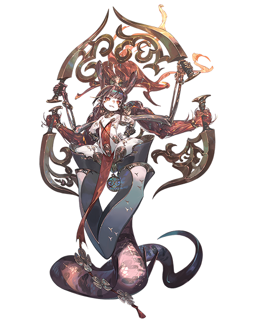

# 火之精灵

| 角色信息   | |
| ----------- | ----------- |
| 名称    | 火之精灵    |
| 年龄   | 未知     |
| 职业 | 火之精灵  |
| 对应曲   |《真紅》 ～ Pavane Pour La Flamme  |
| 初出   | Chunithm SUN PLUS  |

注：此故事与[原初的巫女·艾薇尼亚斯](/sibula/avenis.md)一篇有十分紧密的连接，可以先前往阅读已获得最佳的观赏体验。同时，故事中的部分背景与[原初的巫女·萨拉基亚](/sibula/saragia.md)也有关联。强烈建议先看完原初的四篇再来。

## Episode 1 某位生还者的证言

>火焰的魔人，现在仍旧在山中徘徊着。说不定，那个家伙，是在寻找什么东西呢。

最初观测到那个东西的时候，还是阿基迪斯曾经仍是一片未开拓的山地的时代。

虽然无法证明真伪，但是据说那个东西全身被火焰所包裹，却从未见其火焰燃尽，只是在阿基迪斯的山地中仿徨着的样子。

之所以用这样模糊的描述，那是因为这一证言，来自于某位“幸运”与这个物体遭遇，并且成功生还的男子口中。

那名男子观察了一阵子那个东西的行动，发现那个东西并不会去捕食什么东西，也不会将眼前的一切都烧成灰烬。

男人说，他在观察着那个东西的时候，注意到了一件事。

那就是那个东西之所以徘徊于山中，说不定只是在寻找什么东西而已。

男人最后这么说到。

  

“当然，我很清楚这些话听起来很像是天方夜谭。不过，我不知为何，总是觉得那个东西的吼声之中，总带着些许‘悲伤’。因为我曾经也在山中失去了伙伴，说不定，那个家伙也是一样的呢……”

男人所描述的内容在人们之间口耳相传。虽然在这期间那个东西常常被以多种名字称呼，但是随着时间流逝，这些名字也渐渐统一起来，最终汇聚成了一个名字。

以敬畏和恐惧之名，人们将那个东西称作——炎之魔人。

  

曾经，在某个信仰着丰壤之神·尼非谢的国家，发生了一场悲剧。

那些明明没有资格，却仍痴心妄想想要将尼非谢所寄宿的神力纳入手中的愚蠢人们引发了这一切的悲剧，这个世界，还有生于这个世界的人们的命运，在顷刻间都被扭曲了。

他们所渴求的神之力量，那正是“精灵”的力量。

那是分为火、水、土、风四种元素的力量。

四种力量互相制衡，互相作用，才让整个世界趋于安定与繁荣，让这个世界的生命得以循环流转。然而，随着平衡被打破，这个世界的命运，也开始渐渐地走向破灭的方向。

从尼非谢身上剥离出来的精灵之力，完全罔顾了她的意志，分散到了四处。

土之力量，分给了泰尔斯乌拉斯。

水之力量，分给了萨拉基亚。

风之力量，分给了梅薇。

火之力量，分给了艾薇尼亚斯。

祈祷着平等与安宁，甚至奉献自己的身体的尼非谢，她的愿望，能有达成的那一天吗？

世界会重新被祈愿所恩泽，重新回到那光明的时代吗？

就让我们再度踏入这箱庭的世界中，窥探那其中的一则故事吧。

## Episode 2 伊达尔之子，伊利欧斯

>我等一族背井离乡，发誓要在这片未曾开拓的土地上生息。既然已有誓言，那就必须完成才行。

在一片能够尽览阿基迪斯的广大山脉的开阔地，传来了一阵阵划破空气的唰唰声。

声音十分整齐，与这声音互相照应的，是稍显混乱的呼吸声，还有摩擦地面的声音。

一名穿着皮甲的栗色头发的战士正在那里。

手中握着自己爱用许久的阔剑，有条不紊地挥舞着。

现在正是几近数九隆冬之时，即便是在山脚下，也免不了被刺骨的北风侵扰。

但是，对于久经沙场的战士们来说，这不过是不值一提的小事罢了。

裸露在外的手臂皮肤被太阳晒黑，汗水随着阔剑的挥舞慢慢渗了出来，沿着久经锻炼的身躯渐渐地滑落下去。

突然，一阵干燥的风匆忙地吹过了战士的脸庞。

战士露出了自信的笑容，然后，就像是要给这阵北风一个回礼一般，高举双手，从上段垂直地挥下了利剑。

之后，战士在原地定住了片刻，然后就像是绷紧的弦放松了一般，大声叹了一口气。

  
“……真慢啊。这样的话，根本就跟不上老爹的水平，也不会有人愿意承认我。那个家伙也是……该死。”
  

就在稍微发泄了点怨言，再次握紧了手中的剑的时候，突然，从周围传来了一个低沉而稳重的声音。

“伊利欧斯，果然在这里吗。”

“老爹啊……有什么事吗。”

战士并未给这位称作老爹的人一个好脸色，脸上写满了不满。被称作“老爹”的这个男人，整整比伊利欧斯大了两圈，跟身材矮小的伊利欧斯相比差距赫然。

和那虎背熊腰，孔武有力的外表相反，那男人只是轻轻地走到伊利欧斯的面前，轻轻地拍了拍被汗水浸湿的肩膀。
  

“距离征讨的日子也很近了。虽然说坚持进行练习是件好事，不过也不能忘了去打猎，准备好过冬的物资啊。”

“哼，我这种人，就算不去也没问题吧？”

“不行。”
  

在这个瞬间，伊利欧斯顿时感觉到父亲的身影又高大了几分。这时，他才意识到，自己刚刚已经触到了父亲的底线。

  
“那些子民们，可都是从那些领导者的背影中判断他适不适合当自己的领导。但是，现在的你又是什么模样？一直远离人群，终日追求着所谓的强大而已。像这样的你，能够让他人接受吗？当你陷入绝境之中，又会有多少人愿意救你呢？”

“我、我知道了……至少这些事情，还是懂的。”

  
那些将戒律看得无比重要的家伙如果不跟自己相处的话，那也毫无意义。

然而，伊利欧斯独自的想法，是绝不可能跟眼前如此伟大的父亲讲述的。

  

“要走了哦。”

伊利欧斯望着走下山坡的父亲的背影。

“老爹你也该明白的吧。我和老爹之间，究竟有着何等遥远的‘距离’……”

既是勇敢的战士，又是统领着住于聚落的全氏族的族长，同时，还是在考虑着在这片未曾开拓过的土地上建立国家的男人——这就是伊利欧斯的父亲：伊达尔。

那遍体鳞伤的背影，是那么的强壮。

同时，也是那么的高大。

## Episode 3 迪奥基亚的豪族们

>死亡，不过是愚蠢之人的选择罢了。人，即便苟延残喘，只能忍辱负重，但是只要生存下来，活到最后，才能被称作赢家。

英雄王·伊达尔。

后世被人如此称呼的这个男人，其实，他出生于距离阿基迪斯千里之外的地方——位于南方的水之都·迪奥基亚。

曾经的他，也是流着统治着迪奥基亚的豪族们的血脉。

他们一族分成了复数氏族，各自在商业和工业的方面钻研深造，创造了无数的财富。

他们在迪奥基亚可以说是只手遮天，就算说他们才是实质上统治了迪奥基亚的存在，也不为过。

他们一直相信着自己会永远位居于迪奥基亚的定点，任意使唤着这里的人，然而，这一体制，却在某一天被搅了个天翻地覆。

从丰壤之神·尼非谢手上继承了水之精灵的力量的少女——萨拉基亚。

在那些以她为中心的人们的努力下，曾经不透明的冲突构造，也渐渐清晰起来。

如果想要统治整个城市的话，利用金钱和暴力的力量，是最管用，也最实际的方法。所以，对于站在他们的对立面上的萨拉基亚来说，毫无疑问是他们的敌人。

那些豪族之中专门擅长惹事的男人们，已经开始了行动，试图强迫萨拉基亚服从他们的管教。
  

“精灵的力量，不过是骗小孩的把戏。”

“不过一个女人，再怎么说都有方法能够搞定的。”

  
那些男人们说着难听的话，打算就这么直接拿下萨拉基亚。然而随着萨拉基亚小手一戳，被触碰到的男人们，都一个一个“溺水而亡”。

在等同于神的精灵之力面前，人类的力量是那么的渺小。

而当这样的神力展现在他们眼前的时候，就算是再强悍的豪族，也只能俯首称臣。

然而，就在同族人和其他的贵族们都纷纷宣誓效忠的途中，以伊达尔为首的氏族，却选择了其他的行动。

他们既不想服从于萨拉基亚，也不想拼个鱼死网破，就这样逃离了迪奥基亚。

他们的气质比较接近商人。

当政局出现变化的时候，商人就容易成为政治家的猎物。

而如果手上的财产被夺走的话，那一族所能继承的东西也就一无所有了。

所以，即便自知艰险，但就算是前往未知的新天地开疆扩土，他们也心甘情愿。

  

在这之后，一组人在向着北方进发建立集落的途中，他们听到了阿基迪斯有着炎之魔人的传说，之后他们就在这片荒地上建立了国家。

他们非常清楚。

只有支配了精灵的力量的人，才能够建立全新的世界秩序。

如果没有精灵作为靠山的话，那就只能永生永世屈膝遵从于手握军力的鲁斯拉和迪奥基亚了。

自从全族人于阿基迪斯的山脉脚下建立集落以来，已经过去了接近十年。

开拓工作十分顺利，他们渐渐地取代了住在这里的原住民，在暗地里扩张着自己的势力。

而与此并行的，是那些族中的女性，她们沉心与生产，持续增加着人口。

那是为了创造出更多能够讨伐炎之魔人的战士。

只要能够支配操控火焰的精灵，利用其力量的话，就能够创建一个坚如磐石，不会被外敌肆意侵略的国家了。 

* * *

伊达尔一行人结束了为了过冬而进行的狩猎活动，沿着山道，从山脉的中核部分向着山下走去。

曾经这里还是条人类难以立足的艰险兽道，但是在擅长土木工作的氏族的协力之下，已经建立起了一条可以自由来往的大道。

看着身为人们努力结晶的这条山道，伊达尔想着。

（聚沙成塔，人定胜天。即便是强大无比的魔人，想必也难道这一道理。而如何打倒它的方法，已经想好了——）

“老爹，快看天空！”

突然，伊达尔的思考被伊利欧斯的呼喊打断。当伊达尔望向指着的那个地方，他发现了一阵红黑色的烟雾，正从远方的某个地方袅袅升起。

“那个地方，我记得有集落的样子。”

“记得……是那些移居到河流附近的家伙的吧？”

“是。”

即便是现在，烟雾也在变得越来越浓。不知何时，甚至能够感觉得到物品被烧灼的味道乘着风传了过来。
  

很快，伊达尔就集结起了那些在后面待机的同伴们，大喊着。

“有实力的就跟我过来吧！如果炎之魔人在集落的话，那就看情况开始讨伐！剩下的人，就做好准备以防万一吧！”

“哦哦哦哦哦哦哦哦哦！！”

战士们震耳欲聋的战吼响起。

年轻的男人们先行回到了聚落之中，只剩下那些久经沙场的强壮男人们。他们跟随着伊达尔，走向了冒着阵阵黑烟的集落。

伊达尔所说的“万一”，就是自己死的时候。

在这个时候，准备好的戒律就会生效。

由复数个氏族所组合而成的一族人，每个氏族都有着自己的族长，甚至还分好了前后顺序。

不管遇上什么情况都能够立刻重组，由强韧的管理体制所形成的组织。

这就是伊达尔他们一族的强悍之处。

等到伊达尔他们来到河边的聚落的时候，已经是日薄西山之时。

随着他们愈发接近，气味就愈发清晰。

“……唔。”

  

仍未习惯的伊利欧斯，反射性的捂住了自己的嘴。即便是那些已经习惯这一切的战士们，也只能低下头来，不去细看。

“赶紧趁现在习惯为好！我们要是不再奋战的话，就会落得他们这样的下场！”

“老、老爹，这些东西……难道是……”

那些从无数战争中活着回来的人们，肯定不会忘记这一刻所闻到的气味吧。

那是一种混杂着焦香的，丑恶的味道。

那就是被烤熟的人类尸体的味道。

## Episode 4 讨伐者们

>架起弓箭，举起武器！现在，正是将那家伙讨伐的好机会！

以泥土砖和茅草所建成的聚落，现在大多都已被火焰吞没，只剩下熊熊燃烧的残骸，还有随着啪叽啪叽的声音一同冒起的黑烟。

在这些房屋的旁边，四处散落着被烧到几近炭化的家畜和人类的尸体。

正如伊达尔所说，气味的来源正是这些人。从那些由于高温而膨胀爆裂的腹部和头颅中，器官和脑浆都散落一地，然后又被外界的热量所炙烤，散发出更加强烈的气味。

“真是凄惨……”

“伊达尔大人，果然，这些是……”

听着男人的报告，伊达尔点了点头。

“是炎之魔人。虽然这家伙从来都没有出现在山脚下过……但从现在的情况看，很有可能就藏在这附近。除了确认是否有生还者，也必须小心周围的情况啊。”

  

就在战士们四处散开开始寻找生还者的时候，伊利欧斯却仍站在原地一动不动。

“伊利欧斯。”

“……啊。老爹，怎么了？”

伊达尔拔出了自己背后的剑，向着自己和伊利欧斯之间划了一道刻痕。

然后，他再度望向了伊利欧斯。眼光无比锐利，伊利欧斯也从未见过眼神如此尖锐的父亲。

“这条就是分界线。你想要前进也好，还是后退也行，想要为了我们一族完成‘本职的工作’也是可以的。来吧，自己选。”

“……别开玩笑了。我啊，从成为战士的那一刻，就打算跟随老爹的脚步前进了。现在还有后退的道理吗！我肯定要去！”

“那么，我也不会阻止你的。你就做好能做的事情吧，战士伊利欧斯。”

“啊啊……我就做给你看看吧！！”

* * *

就在其他人正坐在从火灾中幸免于难的屋子里休息的时候，伊利欧斯仍旧在四周寻找着。不管是散落于集落中的尸体堆，还是偏僻的村子角落，他都没有放过，甚至还跑到了集落的外面进行搜索。

“哈……感觉终于舒服一些了……”

来到集落外头，终于呼吸到干净空气的伊利欧斯，才终于有心情稍微环顾一下周围的环境。

这时，他听到了迄今为止未曾注意到的声音。

那是混杂在火光和爆炸声中的，河流的水声。

“说起来，这附近似乎是有河流的样子。”

顺着声音的方向望去，那里似乎有一条羊肠小道的样子。说不定在另一头就能找到那条居民们常去的那条河流也说不定。

“不会说，那个魔人也会在那里吧……”

怎么可能。伊利欧斯这么想着。然而一旦说出了这句，再怎么忘都忘不掉了。

就像是为了寻求答案一般，伊利欧斯走向了那条小道。

就像是回应着期待一般，河流的水声也越来越清晰，越来越响亮。

当穿过狭窄的小道之后，出现在眼前的，是一片开阔的地方，还有那条缓缓流淌着的河流。

  

“果然魔人什么的不可能在这里的啊——嗯？那是什么？”

突然，伊利欧斯在河岸边看到了一团黑色的东西。

当仔细观察着的时候，伊利欧斯发现那个东西居然还会微微动一下。

“难道是幸存者吗？躺在那儿难道是想要喝下河水？”

然后伊利欧斯向着那个黑色的东西呼喊了一次。然而对方并没有回应。于是伊利欧斯只得一步又一步地，往那个东西靠近。

明明距离越来越近，可是怎么看，都只能看得到一片漆黑的模样。

就在这时，那个黑色的东西缓缓地站了起来。

“喂！我说你，除了你之外还有其他聚落的居民吗——”

  
就在说出口的瞬间，伊利欧斯突然扑向了旁边的岩石堆里，潜藏身形。

“等等，那个家伙是怎么回事啊……”

额头冷汗直流。

眼前的那个物体明显很不一样。

这时伊利欧斯才明白自己刚才那轻浮的行动带来了何等的恶果。

在那瞬间，那全身都被炭化了一般的恐怖身姿，已经深深地刻在了脑海里。

四处龟裂的身体表面，就像是被雨水侵蚀过的岩石一般，四处都出现了裂痕。

最可怕的，是在那一团漆黑的双眼之中熊熊燃烧着的，宛如蛇信子一般跳跃的火焰。

  

“是，是魔人……”
  

既然已经对伊利欧斯的声音起了反应，那敌人迟早都会来到这里的吧。

虽然很想立刻就从这里逃离，但是由于实在是太紧了，说不定连小道的入口都没到，就会被敌人追上，落个死无全尸的下场吧。

“可恶……脚竟然开始不由自主地发抖了！哈……哈……既然这样的话，那就只能，拼命了！由我，将那个家伙给！”

不管是为了让自己能够得到认可，还是能够让**男人们**不再多嘴，伊利欧斯都要得到这份大功。

伊利欧斯做好了和魔物战斗的准备，于是从岩石堆中抬起了头确认情况。魔人正在渐渐地接近这里。然而，现在还不是能够攻击的时候。

（再十步就好。十步之后，就是我最佳的攻击距离了）

伊利欧斯再度潜入岩石中，集中精神等待着那个时刻的到来。沙沙的脚步声，正确实地向着自己逼近。
  

——沙。

气息是从右边传来的。

“——噢噢噢噢哦哦哦哦哦哦！！”

瞬间，伊利欧斯发出了猛兽般的怒吼，举起了手中的阔剑向着前方刺去。

之后，从他握着剑的手上，传来了一股确实贯穿了的感触。

（这把剑能造成伤害……！就算是我，也能够办到啊！）

伊利欧斯的剑，狠狠刺进了魔人的腹部。从左侧的侧腹插入的剑，穿过肋骨，从身体的另一边冲了出来。

对魔人的奇袭攻击成功了。

  

然而即便是被利剑贯穿，魔人也没有任何反应。

但是对手可是魔人，既然敌人不做任何行动的话，那继续攻击就行了。

就在伊利欧斯即将拔出剑打算再来一击的时候。

“……！？”

仍然插在魔人的身体上的剑，不知何时已经变得无比滚烫，甚至发红。回过头来才发现，外表已经四处开裂的魔人的身体内部，燃起了赤色的灯光。

魔人的脸庞发出了宛如被重物压折一般的声音，向着伊利欧斯而去。

那空洞的双眼，正闪烁着赤色的火光。

不知是不是被如此非现实的光景所吸引呢，伊利欧斯竟然一动不动。

然后，魔人伸出了左手——
  

“快向前跑！伊利欧斯！！”

“——！”

伊利欧斯立刻做出了反应，他放弃了剑，向着正前方——也就是魔人的侧边翻滚过去。下一秒，刚才还站着的地方就燃起了一道火柱。

要是刚才稍微迟了一点的话，现在估计就会像那个魔人一样被烧成焦炭的吧。

“要灵活运动，不要让他捕捉到你的行踪！”

声音的来源，是伊达尔。他正向着自己的儿子发出准确而有效的指令。

当伊利欧斯顺着伊达尔的指挥离开了此处之后，伊达尔指挥着同伴们，向魔人发射了无数的弓箭。

“尼……、……谢……”

“！快散开！”

“哦哦！！”

伊达尔一边吸引着魔人的注意力，一边让部下各自散开，分散到了灌木丛和岩石之中。

而在此期间，弓箭的攻击也没有停息，这让魔人的判断也迟钝了不少。

他们的战斗方式，可以说是已经与炎之魔人对峙了无数次，从中积累出来的对策战法。

  

“……得救了，老爹。”

“现在不是说这话的时候！现在，那个家伙已经变得十分虚弱了！”

“那、那究竟是！？”

“听好了，伊利欧斯。这可是千载难逢的好机会啊。要是等到他恢复力量了的话，那全身上下的火焰就会把我们的弓箭直接烧成灰烬。所以，我们必须在那之前，尽快打出致命的伤害才行。”

“致命伤什么的……可是那个家伙就算把剑刺进侧腹，也依旧能够行动啊！？”

“那个家伙拥有让肉体再生的能力。看他的身体，从那个被刺穿的伤口那里的深处能看到火焰在燃烧吧？”

正如伊达尔所说，魔人的身体现在比被伊达尔刺中的时候还要灼热几分。

流淌于全身的光芒，简直就像人类的血管一般。

“如果要和那个家伙正面对决的话，还有一个重要的事情。”

“那个，我记得是……”

“——呀啊啊啊啊！！！”

突然，一个惨叫声打断了伊达尔的说明。

原来，是一个战士被火焰彻底吞没，正在地上疯狂打滚。

明明同伴已经被干掉了却仍不胆怯，这些战士们，仍旧在持续攻击。但是再这样下去，形势的逆转也不过只是时间的问题。

伊达尔很快就说出了下一句话。

“据我们所知，那个力量，是有‘指向性’的。魔人是以自己的意志，向那些被当成危害的敌人发动攻击的。”

这么说着，伊达尔拔出了背上背着的两把阔剑，并且将其中一把拿给了伊利欧斯。

“既然决定攻击对象的是头脑的话，那么，只要把它的头砍下来，然后掩埋起来，就能够停止魔人的行动了。”

“可是，要是阻止不了呢？”

“那就只有让我们之后的那些人们，为我们报仇了！”

伊达尔举起了剑，向天指着。

“炎之魔人的传说，今天就在这里结束吧！要上了，伊利欧斯！”

## Episode 5  继承之物

>我们现在能够在这里生活，都是多亏了先人们的引导。

与炎之魔人的战斗无比激烈。

在魔人的注意力被弓箭吸引住的瞬间发动攻击，伊达尔很快就冲进了敌人的怀中。目标，毫无疑问就是控制意志的“头部”。

利剑挥舞的轨迹，不偏不倚地命中了脖颈。

然而，这一击却不足以将头颅砍下，剑身只是陷入了脖颈之中，未能将其斩断。

“——啊、——谢——”

“切！”

“哈啊啊啊啊啊！！”

比魔人瞄准伊达尔的速度更快，伊利欧斯向着魔人挥出了一剑，打乱了魔人的攻击。魔人的准头出现了偏移，附近立刻升起了一道新的火柱。

每当伊利欧斯挥出一剑，伊达尔就紧随其后从伊利欧斯的破绽之处向魔人发动攻击。

虽然两人从未一同锻炼，但父子二人却像是心有灵犀一般，相辅相成，天衣无缝。

“要上了，老爹！”

“可不要大意了啊！”

现在，为了讨伐魔人而做了充足准备，历经重重修炼，身负无数经验智慧的人类，正与能够使出超越人类认知的精灵之力的魔人进行着激烈的大战。

凄厉壮观的大战正在眼前上演，直教人目不转睛。

随着魔人难以发挥全力，战局开始倾向于人类一方，将魔人身首分离，也不过只是时间的问题了。就在场的众人都这么想着的时候——

叮——一道响亮的声音突然响起。

  

“什么……！？”

在不知不觉间，疲劳也渐渐地占了上风。伊利欧斯的剑路开始迟钝起来，就这样和刺中了魔人的腹部的另一把剑撞上了。

面对这意料之外的反震，伊利欧斯的架势失去了平衡。

“不好——！”

然而已经太迟了。

在众人掩护的攻击未到达之前，魔人的手掌就伸向了伊利欧斯的身体——向着他放出了火焰。

“伊利欧斯！”

顿感自己死期将至，伊利欧斯不禁开始思考着。

——啊啊。这样，我就能够从所有的束缚中解脱了吧。再也不会被区别对待。再也不会为此烦恼了吧。

不管是这个喘不过气的世界，还是让我被当做**异端**不被他人认可的**戒律**……

只要我一死，就能够从这一切的重压之中解放——

仿佛死神就在自己身旁一般。

伊利欧斯的脑海中回响着这些诱惑着自己放弃的话语，最后，他选择的是——
  

——怎么可能这样结束呢！！

伊利欧斯怒目圆瞪，稍微后退半步将半边身体错开，让左半边暴露在魔人的面前，接着，将剑插在地上当成了掩体。

下一秒，魔人的火焰就席卷而来，吞没了伊利欧斯。

“……咕，啊啊啊啊啊啊啊啊啊啊啊！！！”

“伊利欧斯！”

“就是现在！！老爹！！！”

“哦哦哦哦哦！！”

呼应着伊利欧斯的呐喊，伊达尔挥下了利剑。这次再也没有失手——魔人的头颅与身体，终于被分成了两半。

被斩断头颅的身体部分，就像是断线的人偶一样瘫倒了下去。头颅的切面处，虽然还能见到些微的火星，但没过多久也渐渐地熄灭了。

  

刚将魔人斩于剑下的伊达尔并未在意自己已经烧伤的身体，只是将一瘸一拐的伊利欧斯赶紧送到河边，进行了应急处理。

只要有些许的犹豫就会危及性命。最终，伊利欧斯虽然一半的身体都被火焰造成了严重的烧伤，但还是勉强保住了一命。

“从开始直到最终讨伐为止，虽说也有上天的垂怜，但终究也是我等锲而不舍才能得来的成果。这一切，都是我等持之以恒努力的结果。让我们，敬那些为我们开创了这条道路的同胞们一杯吧！”

就这样，历经数年的魔人讨伐战争，就此结束。

在这之后，为了防止魔人立刻再生，伊达尔将魔人的四肢切断，然后就和幸存下来的战士们一起回到了聚落。

* * *

阿基迪斯的夜晚是十分残酷的。

要是在昼夜温差更大的冬天，如果没有炉火取暖的话，是基本不可能度过夜晚的。

而对于生活在这种冰天雪地的阿基迪斯人来说，也有一样东西是不可或缺的。

那就是被称作桑拿的东西。

在集落附近的一座小山丘上，有一个足以容纳数人的大洞，在里面，有用石头砌成的内壁和简易的火炉设施。在炉子的周围则用木板围起来。

火炉里会存放烧热的石头。只要将水泼到上面就会产生热腾腾的蒸汽，从而让洞窟里的气温上升到远超外面的地步。

在洞窟之中暖身，再到外面吸收寒冷的空气。这样一来一往的行为，对于阿基迪斯人来说就是最棒的时光。
  

“——咕啊啊啊啊啊啊……！好痛啊！！”

在这其中，也有一人，趁着众人都睡觉的深夜期间，偷偷前来这里用蒸汽暖和自己的身子。

那就是被火严重烧伤的伊利欧斯。

伊利欧斯正一丝不挂地坐在洞窟中，让身上的烧伤和刀伤经受蒸汽的洗礼。

被炎之魔人灼烧的左半身体，露出了未经保护的赤红色皮肤，就像是在彰显着那场大战的凄惨情形一般。

即便是被太阳暴晒褪为栗色的头发，现在也因为高温而跟焦炭化的皮肤黏连在一起。

伊利欧斯，并不知道自己现在是什么模样。

那是因为自己的父亲伊达尔拼命阻止了他。

  

“虽然我也能明白老爹的想法。可是……从大家的反应来看，不用说我都知道是什么样啊。”

女人和小孩那恐惧的眼神，还有男人们怜悯的眼神。

简直就像自己被当成了怪物一般。

所以，伊利欧斯为了不让自己思考这些烦心事儿，才故意趁着半夜来到这里，希望以疼痛麻痹自己。

  

“既然选择了活下去，那么面对这样的结果那也是没办法的吧……啊啊，不行！越想心越乱！！”

伊利欧斯烦躁地喊着，就在他想要沿着楼梯爬上去离开这里的时候，刚好撞见了一个想要沿着楼梯下来的人。

“伊、伊利欧斯大人！？”

伊利欧斯偶然撞见的，是一位身材瘦削的少年。根据自己的记忆，这名少年应该是隶属于负责看管集落家畜的氏族。

“怎么，你也睡不着吗？”

“啊啊，应该算是这样吧……等等，为什么**光着身子啊**！？”

“**这有什么了不起的**？我们不是一直都在一起玩吗？你看，**我自己都不在意**。”

“可、**可是我会在意啊！！**”

由于刚好撞见人，伊利欧斯的脑子也冷静了下来，就这样不假思索地回答了问题。然而，少年听到这样的回答，却只是呆呆地站在那里，嘴巴像鱼一样张合着。片刻，他就大喊着“我先回去了！”，然后狂奔着离开了洞穴。

“喂、喂……！”

伊利欧斯伸出了手想要叫住那名少年。可是，那只手因为烧伤的疼痛动弹不得。

“搞什么啊。就连你，也要把我当成怪物看待吗……真无情啊……真的……”

## Episode 6 炼成

>老爹你也好好想想看吧……要是能够真的做出寄宿着炎之魔人的力量的武器的话，整个世界，都会大变样的啊！

距离炎之魔人被讨伐，已经过去了几天。

各个氏族的族长们齐聚一堂，正讨论着建国的各项协议，然而，会谈却陷入了僵局。

如果要让那些保守的人们接受的话，无论如何都必须证明他们有能力掌握火之精灵的力量才行。

在集落的郊外，在桑拿洞穴所在的小山丘之上的地方，有着另外一个坚固的洞穴。

本来，这个洞穴是为了惩罚那些违反了戒律的人而建设的。那些人会被关在洞穴中三天三夜，在伸手不见五指的黑暗之中反省自己。

深不见底的洞穴，还有为了防止攀登而设置的无比宽广的构造，对于监禁魔人来说，没有比这里更加适合的地方了。

伊达尔向着洞穴的深处望去，似乎听到了洞穴深处魔人的怨恨之声，嘴角上扬，露出了满足的笑容。

  

“看来，魔人的身体再生，是从躯干开始的样子。”

  

伊达尔在和魔人战斗的时候，一直抱有一个疑问。

那就是，魔人到底是从哪里开始自我再生的呢？

为了测试这个，伊达尔将被五马分尸的魔人的头颅，手臂，腿脚分别放置到了别的地方。

除了躯干以外，别的身体部位都用石造的棺俑封印，并且派遣专人监视保管。但是却从未听过那些人报告这些身体部位开始复原的情况。

就在陷入僵局的时候，躯干出现了复原的迹象，然后渐渐地转移到了比较细节的部分。

  

“说不定……可以利用一下呢。”

“——老爹原来想到了这么多吗。”

“伊利欧斯吗。身体怎么样了？”

“混杂了药草的药膏似乎起了效果的样子，至少没昨天那么痛了。”

  

伊利欧斯一边这么说着，一边举起了被麻布绷带绑的严严实实的左臂。

虽然说基本都是擅长医疗的氏族进行的治疗，但是伊利欧斯年轻的身体，还有沿袭于父亲的强壮体质，也让他能够恢复得如此之快。

  

“是吗。那么有一件事要拜托你做。”

“还真是稀奇啊。老爹居然向我提出了请求。说吧，要做什么？”

“利用被斩断的魔人的残骸，制造武器。”

“制造武器？由我来？”

“虽然还只是假说的阶段，不过如果被切断的头颅和手臂还残留着精灵力量的残渣的话……说不定我们也能够从中提取出这份力量呢。”

“哈！？”

“就算没有什么利用价值，那也是让你背上了这一生都难以愈合的重伤的魔人，要杀要剐随你的便。”

“要杀要剐什么的……算了，我知道啦。”

“我会把石棺送到工坊的。之后就拜托你了。”

  
伊达尔在这么说明之后，就向着周围观察着的同僚们高声呼喊到。

“各位！炎之魔人的传说已经是过去式了！克服了恐惧的我等，迎接的必将是充满光明的未来！就用这个利用了炎之魔人的力量的‘精灵炉’，为我等创造崭新的未来吧！”

“噢噢噢噢哦哦哦哦哦哦！！！”

  

伊达尔的宣言，令仍有不安的众人重新恢复了生气。

看着人声鼎沸的会场，伊达尔更加确信了一件事。

只要有魔人的火焰的话，就再也不必担忧有人无法度过那冰冻三尺的寒冬。能够制造出更加坚固的武具，也可以创造出别国无法轻易模仿的技术力优势。

而技术力的优势，通常又是和武力直接联系起来的。

而结果，就是战士们的生存率会上升不少。

“迪奥基亚，还有水之精灵……总有一天一定要归我等所有。”

* * *

“那么，也差不多是时候了吧。”

在伊达尔他们建造着精灵炉的时候，伊利欧斯也在山中进行着自己的作业。

不久，太阳就会沉入山中，夜幕也将降临。

在这晚霞与夜幕互相交织着的幻想般的夜空之下，只有伊利欧斯的周围像是被太阳光照射着般，闪耀着无比明亮的光芒。

那是在火炉中加热了许久的，带着些许黑色的，由铁矿石和木炭，还有魔人的残骸混合而成的生铁。

在将周围的边角料用铁锤敲打掉的期间，生铁也被渐渐地敲打到人头的大小。

就在伊利欧斯深吸一口气再度将铁锤高高举起的时候——

  
“……哼！”

随着伊利欧斯的突起，铁锤向着发红的生铁敲了下去。

  

——锵！

“————！！”

“咕啊……！刚刚的声音是怎么回事……感觉有点耳鸣啊……”

  

难道是敲打的位置不对吗？被铁锤敲打到的生铁，发出了宛如悲鸣一般的尖锐声音。

稍过片刻，生铁尚未凝固的中心部分，就像是流出泪水一般渗了出来，形成了放射状的水花，扩散开来。

流到地面的生铁在接触到地面的瞬间，立刻就失去了热量，变成黑色的硬块。

制造铸铁，本就是一件与时间赛跑的事情。
  

“只能习惯了啊。要是生铁凝固，那一切就都结束了。”

  
伊利欧斯继续用铁锤拼命敲打着生铁。

随着伊利欧斯的敲打，他的表情也渐渐地从苦闷之中解脱开来。
  

“哼，这难道是魔人的垂死挣扎吗？到底要给人添麻烦到什么地步啊！”

“——给我——”

“啊……？”

“——快——给我——”

就在伊利欧斯以为自己习惯了的时候，他又听到了那个尖锐的声音。

不知道是不是因为在脑海中回响许久了呢，不知何时甚至变成了足以影响伊利欧斯感官的幻听。

剧痛缠身，令伊利欧斯失去了冷静。

再这样下去，自己就无法控制住自己了。

  

“不要……在我的脑中……随便叫唤啊！！给我放老实点啊啊啊啊！！”

随着愤怒，伊利欧斯举起了铁锤，狠狠地向着被锤扁的生铁敲去——

——咕沙！

这倾尽全力的一击，让生铁溅射出了前所未有的火花。

  

“哈啊……哈啊……”

直到刚才还在折磨着自己的声音，不知何时已经消散。

伊利欧斯重新夺回了冷静，这时才意识到自己已经身心俱疲。

铁块应该已经锻造好了。今天已经很累了，还是赶紧休息吧。

就在伊利欧斯思绪万千的时候，铁锤从刚刚敲好的生铁上滚了开来。

  

“……咦？”

伊利欧斯看到的，是一个被敲的粉碎，脑浆像是盛开的花朵般飞溅四散的头颅。

“为……什……么”

除了嘴部，其他地方已经被敲得认不出原型了。

少数还能辨认的特征，是那宛如燃烧的火焰一般美丽的头发，还有一张生前**像是少年，又像是少女一般，难以辨认雌雄的**，无比端正的脸庞。

伊利欧斯捂住了自己的嘴，瘫倒在了地上。

就在自己想再次确认自己的所作所为的伊利欧斯想再度确认而将目光投向打铁的工作台的时候。

伊利欧斯不知为何感觉到了，自己正和这个头颅的残骸对上了眼的样子。

“噫——”

然而，当他再度揉了揉眼睛看着工作台，却只发现了一块形状平整的，**没有任何事情发生过**的铁块，静静地躺在那里而已。

## Episode 7 漫无止境的黄昏

>啊啊，原来是这样的吗。原来，只是一直在寻找着吗。只是一直在寻找着自己最爱的人吗……

虽说那只是幻觉，但伊利欧斯还是觉得自己刚刚敲碎了一个少年的头颅。

为了逃避这个现实，伊利欧斯躲进了被窝。然后，那天晚上，他梦到了一个神奇的梦。

那个梦格外的鲜明。

在平整的石墙上等距离排列着的油灯。

绒毯厚实的质感。还有从远远高于自己身高的窗顶处垂下来的天鹅绒制成的窗帘。

看起来，这像是某个国家的宫殿的样子。

眼中看到的一切，和伊利欧斯所居住的阿基迪斯差距实在是太大了。

“难道说，这里就是那个名为‘鲁斯拉’的国家吗？”

原本只在童年时期从父亲口中口述的这个国家，竟然就在自己的梦中再现了。

  

就在伊利欧斯目瞪口呆的时候，突然，视野开始摇晃，身体开始向着前面移动了。

“唔哦，这是怎么回事啊……！”

跟自己的意志相反，身体只是走得越来越快，视野里的画面也开始逐个逐个地变化。

首先是来到了看起来似乎在祭祀着什么东西的金碧辉煌的祭坛，下一刻就来到了昏暗的下水道之中。

在眼前的景象风云变幻之余，突然，视野就固定在了一片被地毯所覆盖着的地板上一动不动。

看起来，是在向什么人跪地的样子。

从视野中可以看到脚上穿着的看起来很高级的黑色皮靴。伊利欧斯只是看了一眼，就能够感觉得出这双靴子的主人花了十分的心思进行打理。

这时候，伊利欧斯才真真切切地意识到，自己正在梦境中，亲身经历着某个并非自己的人的记忆。

就算在心中呐喊着无数次“快动啊！”，这双靴子的主人也纹丝不动。

  

“怎么就偏偏只有意识这么清醒。真是个怪梦……快点动起来啊，鞋子的主人！”

就在伊利欧斯放弃了抵抗，只能乖乖看着的时候，突然，他听到了个物体的声音，下一刻，鞋子的主人就快速站了起来。

接着，映入伊利欧斯眼帘的，是一位长着仿佛不是这个世界的存在一般的，宛如精细的手工艺品一般美貌的少女的身姿。

在淡淡的灯光照耀中显现出艳丽光泽的金色头发。

仿佛能够看透内心的，充满慈爱感觉的双眼。

与自己完全相反的，没有一丝伤痕和劳损的细腻肌肤。

只是看了第一眼，伊利欧斯就被眼前的少女的美貌所征服。

  

“初次见面。我是尼■谢。你就是新上任的艾薇尼亚斯对吧？难道说，你在紧张吗？”

“不、不。怎会有这种事情……”

视野向左右狠狠地摇晃了一下。

“是吗。既然如此的话……”

少女露出一个微笑，然后缓缓地靠近，将脸贴到了足以感觉到吐息的极近距离。然后，伸出小小的双手，将艾薇尼亚斯的脸颊包住。

“呀啊！？尼、尼■■大人！？”

“这样总该能放松一些了吧？……啊，感觉眉头还是紧皱着的样子呢。那么接着就是……”

“够了、真的够了啦！而且，我可是护卫，在尼■谢大人身边尽忠尽职地守护着才是我的使命——”

“哈哈，这个家伙，难道说是一见钟情了吗？还真是纯情啊。”

  

倒也不是不能理解这种心情。就在这个念头闪过脑海的时候，伊利欧斯不禁对自己为何见到这个梦发出了疑问。

“……哈。难道说就连我也会有这样的愿望吗？”

想到自己在现实中与这梦境中的世界相差甚远，伊利欧斯不禁自嘲了一下。

“不过啊，果然还是已经看够了啊。拜托了，我自己！还是赶紧让自己从睡梦中苏醒吧！”

就在这么想着的时候，场景再度发生了变化。

  

眼前是像贝壳一样形状挺立起来的几间屋子，还有带着些许怀念感觉的街道。接着是拒绝着人类通行的险峻山道，还有昏暗的洞窟。最后是横躺着的少女，还有从她身上掉下来的——她的头颅。

“——！？”

以这突然出现的残酷光景为开始，被称作艾薇尼亚斯的这个人的世界也开始剧烈改变。

在应接不暇，白驹过隙般不断变化的光景之中，就连目视清楚都很困难。记忆宛如浊流般席卷而来，时间的流淌宛如逆转一般开始回旋。

最终，一切被分割出来的记忆都被混杂在了一起，褪去了颜色，融为了漆黑的一体。

那一切，全部都是与少女之间建立起的记忆。

“这个家伙……竟然那样重视那个女的吗……”

艾薇尼亚斯的心，已经被摔了个粉碎。

然后，本该像他人的事情那样看待的，艾薇尼亚斯的意志，痛苦，愤怒。

不知何时占据了伊利欧斯的身体。

瞬间，视野变成了清一色的赤红——

  
——咔锵！

**周围开始响起敲打着某样东西的金属音。**

“不要夺走她！”

——因为我已经下定了决心。

**——咔锵！**

“不要从我那里，将尼■谢的——”

——因为我要从所有让她悲伤的事物中保护好她。

**——咔锵！**

“将与尼■谢大人的回忆……”

——因为只有我能够救她！能够将她！能够将她的——

**——咕嚓！**

“■■■■■……■■■■■……”

——由我……来保护……

咦？……我到底，是要保护谁来着？

我到底，是为了谁，才让这双手沾满鲜血的？

我到底，是为了什么，才让自己燃尽周围的一切的？

……不要。不要啊！不要夺走我的一切啊……！

我只是、我只是——
  

“不对……我，到底是谁啊？”
  

这突然说出的话语，在空中升腾，消失。

向上望去，那是由晚霞和夜幕交织组成的云团。

然后，视野被什么东西覆盖住了。

仔细一看，那正是高举着铁锤，正准备向下挥去的**伊利欧斯**——
  

“——唔啊啊啊啊啊啊啊啊啊啊啊啊！！”

伊利欧斯从床上跳了起来。

为了确认自己现在所在的地方是如假包换的现实世界，她拼命地确认着周围的一切。

在确认了很久之后，伊利欧斯才终于放心下来。

“可恶，手一直抖个不停……那不就是个噩梦吗。真不像我……”

  
要是心情烦躁，那就去做个桑拿吧。

伊利欧斯急急燥燥地前往了小山丘。

“嗯……？怎么好像有些吵闹的样子……”

周围围满了神色不安的居民们。他们似乎都望着山丘上方，却不敢行动。那么，应该就不是受到袭击什么的吧。

“那个方向，难道是……”

他们视线的方向，正是将炎之魔人封印者的洞穴的所在地。

## Episode 8 然后，神托降临

>你的力量，将会成为阿基迪斯的基础。这样，我们就能够改变这个世界了！以阿基迪斯之名起誓！

来到洞穴门口的伊利欧斯，见到了正在急速建造着的精灵炉，还有正在将空气拼命冲入炉心中的人们的身影。

在洞穴中熊熊燃烧着的太阳，不知何时就已变成了风中的残烛。

不管再怎么投入燃料或者空气，魔人的火焰都未能重新燃起。

已经燃烧殆尽的魔人的躯干没有任何反应。

精灵之力的消失。

这个事实，就足以让许多跨越了同胞的死伤，却仍旧不肯停下脚步，向前迈进的人们受挫了。
  

“明明再生一直在顺畅地进行着的，为什么会……我等希望的灯火，难道就这样熄灭了吗……”

伊利欧斯并未立刻意识到，眼前这个怅然若失的男人就是自己的父亲。那个身为一组之长，在大家面前威风堂堂的父亲，竟会有此等模样。

  
“老爹……”

伊利欧斯伸出了手，拍了怕沮丧的父亲的肩膀。

父亲回过头来的时候，脸上满是惊讶之色。

“呐。那个，肯定，还有能够做的事情，对吧。精灵的力量总有一天能够再次入手。而且，我们还有用魔人的残骸造出来的武器。只要我能更加努力的话……所以……”

“……怎么了”

“咦？”

就在伊利欧斯打算回问父亲的时候。

伊达尔的手，紧紧地抓住了伊利欧斯**白净**的左手。

“好痛……你在搞什么啊，老爹！”

惊讶的伊达尔只是看着伊利欧斯的身体，眼珠子在眼眶中拼命飞转着。

然后他的嘴角，露出了一个充满疯狂的笑容。

“伊利欧斯，你的脸怎么了？”

“啊……不好！忘了卷上绷带了！”

“现在这种事已经无所谓了！”

  

伊达尔的双手抓住了伊利欧斯的胸口。

然后不由分说地——撕开了伊利欧斯的衣服。

  

“我说，你这是在干什么啊！？”

伊利欧斯的衣服被纵向撕开，露出了衣服下潜藏着的身体。曾经在被烈日晒黑的身体上遍布着的刀伤，还有覆盖了几乎一半身体的烧伤，都**消失的无影无踪**。在紧致的肉体之上，竟然还长着一对丰满的“乳房”。

  

伊达尔淡淡地质问着自己的“**女儿**”，伊利欧斯。

“身上的伤怎么了？”

“哈？等、等一下……这是……！！我的烧伤呢！！”

“所以我问你究竟怎么了！！”

“所以说啊！！我也不知道究竟发生了什么事啊——”

就在伊利欧斯一头雾水的时候，她想起了在梦中见到的光景。

被称作艾薇尼亚斯的人物，在自己都未曾想到的情况下，就将火之精灵的力量传授给了少女。

成为了炎之魔人，即便被火焰侵蚀着身体，也仍旧在搜寻着自己最爱的人，来到了河岸边，见到了自己丑陋的样子。

  
伊利欧斯才注意到一件事。

那就是这一切的记忆，都已经被继承到自己的身上了。

然后——

从满脸困惑的伊利欧斯背后，传来了悲鸣声。

那些人们不知何时，已经将关注点转移到了被火焰吞没了的自己。

“伊利欧斯！？”

伊达尔他们目睹了一切。

目睹了伊利欧斯身上发生的变化，以及变为非人之异形的景象。

伊利欧斯变成了像蛇一样蜿蜒盘曲，持有着四条手臂的火炎之怪物。

如同海市蜃楼一般晃动着的火焰，在伊利欧斯的身上就像自己身体的一部分一样，被她灵活地操纵着，最终收束于自己的掌心之中，变为了火焰的团块。

然而，伊利欧斯的变化不止于此。

原本栗色的头发，现在也变成了宛如火焰般鲜艳的红发。

  

“这、这该如何是好啊，老爹……我……我！！”

伊利欧斯露出了悲喜交加的扭曲笑容。

伊达尔也露出了一个僵硬的笑容。

  

“对、对了。这样的话，就算是我，也能被认可了吧？追随着父亲的脚步，成为一名合格的后继人，对吧！！大家，都会认同我的，对吧！！就算我是**女的**，也不会因此不当回事的，对吧！？”

“……啊啊。正是如此。如果是你的话，肯定能够好好地**履行自己的职责**吧。”

“哈、哈哈……我绝对要好好地使用这股力量！就由我，来引导阿基迪斯走向光明的未来吧！”

  

伊利欧斯欣喜若狂。

可是，由于过度的欣喜，她并未注意到一件事。

那就是伊达尔这句话，背后**真正的含义**。

就这样，伊达尔的**女儿**，伊利欧斯，成为了继承精灵的力量的火之<ruby>巫女<rp>（</rp><rt>西比拉</rt><rp>）</rp></ruby>。

她为阿基迪斯带来了名为繁荣的灾难。

在这之后，这个世界就爆发了无数的战争，死亡也渐渐地扩散到世界的各个角落——终于，染上了所有的欲望的，真正的怪物们，终于降生于阿基迪斯。

存在已然扭曲的世界，向着看不见未来的前方猪突猛进。

直到整个箱庭的世界迎来其终焉为止。