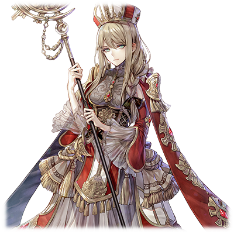

# 露琪亚·雷·贝尔纳蒂特

| 角色信息   | |
| ----------- | ----------- |
| 名称    | 露琪亚·雷·贝尔纳蒂特      |
| 年龄   | 16岁        |
| 职业 | 初代圣女  |
|身份| 豪族·贝尔纳蒂特家的女儿|
|所属国家|罗姆尼斯联合|
| 对应曲   |《狂乱》 ～ Cataclysm |
| 初出   | Paradise Ep.2     |

## Episode 1 神的选择，人的罪业

> 在圣女安娜与神的战斗之前。有一名少女的历史，潜藏在这场大战的背后。

曾经，这个世界存在着四位各自寄宿着火，水，风，土四体精灵的巫女。

四名巫女使用精灵的力量，养育着自然，而随着时间推移，人们利用她们的力量发展了自己的文明。

然而，由于对持有精灵之力的巫女过度的崇拜，产生了一些妄图支配她们的力量的人，而世界的平衡就在这些历史中慢慢地开始崩溃。

最初，不过是非常微小的火苗罢了。

然而，斗争的火种以人类无法阻止的速度向外扩张，最终将整个世界卷进了混沌。

巫女们被无情地卷入人们的斗争中，最终都落得个死无葬身之地的结局。

而她们心中的绝望，强烈到足以毁灭这个世界。

在漫长的战争中，四名巫女纷纷逝去。

而巫女的消失让人们变得更加狂乱，更加丑陋。

而观察着一切事情发生的神明悲叹着。

“人类是何等的愚蠢啊”。

对创造出如此愚蠢的人类非常后悔的神，决定肃清地上的人类。

而这，就是创造神·伊迪亚进攻人类世界的开端。

面对伊迪亚的强大力量，无法抗衡，从大军的魔爪下生存下来的人们，逃向了鲁斯拉的都市，圣都·瓦尔瓦拉。

集结到瓦尔瓦拉的各国人们终于注意到了。现在并不是国家间，人类之间互相争斗的时候。

然而，只是将人聚集起来，想打倒拥有全部巫女力量的伊迪亚不过是天方夜谭罢了。

人们思索着，如果要和伊迪亚战斗的话，就需要和曾经的巫女同等的，甚至是在她们之上的超常力量的人才可以。

而在逐渐逼近的伊迪亚的大军面前，找不到如何让已经从这个世界上消失的精灵再次降临的方法的人类们，只能将丝毫不知状况的年轻少女，当作希望的象征，抬举成为“圣女”。

这段故事，正是在第二代圣女——安娜·玛尔格雷迪诞生之前，不为人所知的，初代圣女的故事。

## Episode 2 虚假的圣女

> 普通的我居然成为了圣女什么的……不过，如果这样就能够救到大家的话，我也没办法拒绝呢……

圣都·瓦尔瓦拉。

虽然说这片地区还相对来说较为完整，但是战争的伤痕仍旧没有从这片土地褪去。而居住在这里的鲁斯拉人和迪奥基亚人仍残留着愤慨的情绪。

因为曾经发动了侵略他国的战争的阿基迪斯的人们，现在正大摇大摆地走在曾经自己掠夺过蹂躏过的鲁斯拉的国土上。

然而，伊迪亚带领的魔兽大军此时仍然在四处肆虐，已经没有给人类之间互相内斗的时间了。

人们的心是仍旧一盘散沙。各个势力的贵族们，认为在这样下去迎接着他们的只有毁灭的悲惨结局，于是，为了将民众们的意志集结起来，他们决定创造一个能够替代巫女的寄托物。

然而，选出适合的人选的过程，也如往常一样，不过是贵族们在政治上的互相争斗罢了。

最后，为了镇住与阿基迪斯人势不两立的鲁斯拉人和迪奥基亚人，最终让鲁斯拉出身的有权贵族——贝尔纳蒂特一家担起了大任。

贝尔纳蒂特家的长女——露琪亚·雷·贝尔纳蒂特，在之前的战争因为阿基迪斯的战争失去了一切，最后和家人们逃往瓦尔瓦拉，并隐居在这里。

“要我……成为圣女吗？”

“是的，露琪亚！为了保护这个世界，以及民众们，你被授予了打倒神明的重大责任！”

面对父亲突如其来的宣告，露琪亚仍旧不能理解这句话的重要性。

露琪亚并无任何特别的才能，也没有异于常人的能力。她只是从战争开始以来，就这么普通地生活着而已。

而她自己也很清楚这点，所以面对自己被选中的事实，她内心比起惊讶，更多的是困惑。

“我们现在，必须要有一个年轻而聪明的人站出来，成为人们心目中的精神寄托。这不算什么，不需要想太多事情的。露琪亚，你需要做的事情只有一件，就是为前往战场的士兵们，还有痛苦中的民众们带来精神上的慰藉。”

“我，我知道了……如果只是做这些事情就够了的话……”

露琪亚对自己的平庸无奇这点非常清楚，而那些选出她的贵族们也心知肚明。

那么，为什么还要选中露琪亚呢。

原因无他，能够成为值得民众信仰的对象，只需要做到“容资秀丽”就够了。

仅仅因为这个理由，露琪亚就被人们抬上了圣女的宝座。

## Episode 3 幸福生活背后的盘算

> 我依然还在担心着能不能胜任圣女的位置……不过能够看到人民露出笑容的话，这样应该就够了。

自从露琪亚成为了圣女之后，她的生活发生了翻天覆地的变化。

本来因为战争，她失去了全部的东西，过着一穷二白，只能保证生存的最基本要求的生活。而现在，她正过着身旁有数位侍女所侍奉着的奢华生活。

每天身穿着华美的衣服，还有专门掌管食膳的厨师服侍着日常三餐。

这种待遇别说民众，就连贵族们都享受不到。而她正享受着宛如做梦一般的奢华生活。

而不仅仅是她的生活迎来了辉煌，改变的同样还有民众们的看法。

只要走在街上，身旁必定会传来“圣女大人！”的呼声。

本来身为原贵族，早已习惯平民生活的露琪亚由于已经习惯了事事亲力亲为，所以对于这翻天覆地的变化感到非常困惑，但是也慢慢地开始习惯，对这极度奢华的生活开始慢慢地满足起来——。

 

在瓦尔瓦拉的圣堂中，正举行着这里唯一的公务——祈祷仪式。

这是用仆从们所准备好的各种祷词，由露琪亚在现场像朗诵一般复述出来而已的仪式。

即便这样，民众们还是将露琪亚当成了唯一的救赎。

并非神的使者，只是由人们在背后推波助澜成就的圣女，面对人们的祈求，没有什么能做的事情。

然而，露琪亚面对着这些将自己崇拜起来的民众，还是感受到了自己成为人们希望的象征的意义。

在背后观望着这一切的贵族们，偷偷地笑了出来。

他们选择创造出圣女这一存在的目的，不过是为了争取时间，让贵族们能够尽早离开这个国家，渡过大海乘船逃离的障眼法罢了。

而宛如察觉到了贵族们心中的盘算一般。

创造神·伊迪亚，就这么突然降临了。

## Episode 4 消失殆尽的水之都

> 这就是神的力量吗……这未免也太难以置信了吧……！而我居然要和这样的东西战斗？这是不是什么恶劣的玩笑啊？

伊迪亚带领着魔物的大军，蹂躏着水之都·迪奥基亚。

在人们重新夺回迪奥基亚的反攻队伍正在进军的途中，露琪亚在瓦尔瓦拉的圣堂中持续地祈祷着。

“啊啊，请真正的神明保佑他们吧——”

然而这样的祈求也无济于事，反攻的部队被打的溃不成军。

而这悲报，不过是部队进军之后片刻间就传来的消息。

一封请求救援的紧急书信被送到了瓦尔瓦拉。

而这封书信的到来，也预示着已经有众多人的生命永远消失了的事情。

大部分国内驻扎着的士兵接受了援助的请求，前往了前线。

因此，国内组建了义勇军，而露琪亚和她的侍女也应召前往了前线。

虽然身旁由护卫保护着，但是从未料到自己会被派到前线的露琪亚，在心中感到不安而颤抖的同时，仍然对这件事情没有实感，仿佛是别的世界发生的事情。

然而，她很快就理解了一切。

这个世界的“现实”，是何等残酷——

露琪亚所在的义勇军到达迪奥基亚的时候，城市已经是几近全毁的状态了。

尸体的臭味满溢于整个战场，剩余的尸骸已经不成人形，整片战场被魔兽的大军所蹂躏，展现出一幅地狱的画卷。

光是将这座城市夺回来后，重新建设所需要的人力物力已经无法计算。而做出如此判断的义勇军，立刻就决定撤回到国境的附近待命。

然而，伊迪亚很快就挡在了志愿军的面前。

伊迪亚就这么悄然出现，仿佛从身边路过一般。

在这被这突发情况所动摇的士兵们之中，露琪亚望着初次见面的创造神的身姿，不禁发出了感叹。

“那就是创造神·伊迪亚……？看起来不就是小孩的样貌吗……！”

伊迪亚正站在人类的话绝对无法被听到的遥远距离上。

然而，伊迪亚还是听到了这句话，并且嗤嗤笑了出来。

“呵呵，还以为是什么人呢……你就是率领这些人的领头吗？不过是没有什么力量的女孩吗。真是贻笑大方。”

而随着这句话，随行的魔兽大军便冲向了人类们，一瞬间，前排的士兵便失去了战斗的能力。

那些士兵们被魔兽踩踏，手足，头颅都不能幸免，被魔兽们生吞活剥。

而这些魔兽们仿佛玩弄着生命一般，并未直接杀死他们，而是将半死不活的士兵们的身体丢在了战场上。

战场上被充满了痛苦和绝望的惨叫声填满，汇成了代表着死亡的交响乐。

被伊迪亚嘲笑“没有任何力量”的露琪亚。

正如神明所言，她在这个战场上没有任何的作用。

“到底要怎么做……我到底能做到什么……”

露琪亚即使努力地想了想能做到什么，也还是发现自己什么都做不了。

在眼前这片地狱般的景象面前，圣女只能呆呆地站着看着一切发生。

## Episode 5 作为圣女的器量

> 曾经我为了完成身为圣女的使命，也努力过了。然而现实却是如此残酷，残酷到了只想背对着逃避的地步。

“这……一定是噩梦啊。求你了……但愿这只是一场梦啊……”

曾经对与强大的神明战斗这件事，一直以为不过是虚构的故事罢了。

然而以直面残酷的现实这一最糟糕的形式理解了的露琪亚来说，由于实在是太恐怖了，她只能瘫在原地，不停地自言自语。

“露琪亚大人，请往这里走！”

露琪亚连身旁侍女的呼喊都没听到，被侍女强制抓着手臂，拉着失去力气的双腿带离了现场。

魔兽的大军仍然在追击她们。在众多侍女和士兵们的牺牲下，露琪亚一行人最终逃离到了国境边上的军营。

不知是不是跟丢了，魔兽的追击停止了。

露琪亚由于恐惧不停地发抖，只能努力地抱着身旁的土堆站起身来，然后又回想起了刚才发生的事情，大呼了一口气。

“露琪亚大人，水。请先喝一些压压惊吧。”

“谢谢……我不客气了……”

虽然握着水杯的手仍在颤抖，但是喝完了之后，还是稍微镇定了下来。

而回头望着身边的人们，才发现跟随队伍的士兵，已经降到了一半以下。

在逃走的过程中，好几次目睹了士兵和侍女死亡的场面。

而那副光景，已经在露琪亚的脑海里留下了烙印。

（我只是一个普通的人类而已……甚至连神的声音什么的都没听到过……像我这样的人……为什么还要经历这样的事情呢……？）

露琪亚最终理解了现实。然而，理解并不意味着能接受。

露琪亚的心理素质并不出众，想要在目睹这样的惨状之后，还能立刻振作起来，未免过于苛求了。

（会遇见这样的事情，是因为我担当了圣女的大任吗……？不对，现在这种事情怎么都好……不想死……我还不想死啊……！）

对可能降临于自身的，死亡的恐惧心。

就宛如涂满剧毒的弓箭一般，贯穿了露琪亚的心，并且深深腐蚀着她。

## Episode 6 彼之希望，吾之诅咒

> 我的意志已经决定不了什么东西了……。我只能继续以圣女的身份活下去。宛如被操纵着的人偶一般。

迎接着和义勇军一起回到城市的露琪亚的是，和战场的空气所截然不同的，宛如凯旋归来般盛大的欢迎仪式。

“圣女大人把恶魔赶走了啊！”

“真不愧是救世主大人啊……！”

从洋溢着欢乐的街道上，传来了民众的欢呼声。

（……赶走了？我明明什么也没有做到……只是不停地逃着……而且不止如此，还有那么多人丧命了……）

在民众充满期待的欢声笑语中，露琪亚只感觉到一股空虚。

即使这样，努力维持着表面笑容的圣女，还是坐在马车中无力地挥手示意。

而在归来之后没多久，露琪亚便和家里的人举行了家庭会议。

看着和民众一样露出同样欢欣表情的父亲，露琪亚拼命地诉说着。

“创造神的恐怖之处，已经不是人类能够面对的了……和那种东西战斗什么的……不对，连与其战斗的念头都显得不知天高地厚……”

“哦哦，看来留下了不好的回忆呢。战斗就是这样的东西啊。你很快就会习惯的。”

“不是那种程度的东西就能了事的！我，根本不适合担当圣女这样的重任……请让我退出这个位置！”

“你在说什么傻话！如果这个国家失去了身为民众的希望的你，那么大家的士气都会下降的。而且，就算被同志们这么说着也……“

“父亲大人是不是认为我变成怎么样都可以呢！？”

“……不是这样的。好好听着，露琪亚。圣女正是因为其存在才能救赎大多的民众。你还是好好思考一下其中的含义。”

在家人面前无法说服的露琪亚，回到自己的房间关上了大门，就这样背靠着门瘫坐在了地上。

本来以为家人会成为信任自己的后盾的，然而现实却打破了这浅薄的幻想。

已经，没有可以相信的人了。

“圣女到底是什么样的存在……就算能够成为人们的救赎，我也只是普通的人类啊……根本不能成为战力啊……”

露琪亚只能一人蹲在角落哭泣着诅咒着自己的命运。

曾经离自己最亲近的侍女也丧命了。

非常讽刺地，就连能稍微听着哭声而为她担心的必要都没有了。

## Episode 7 在望见星空的森林之中

> 和他相遇之后，我终于感觉到了自己不再是孤身一人。我，一直认为，自己被这个世界遗弃了。

由于服侍露琪亚的侍女减少了，露琪亚每逢夜晚，总会偷偷地从屋子里溜出去，来到附近的一片小树林中。

话是这么说，也不是要做什么大事。仅仅是望着夜空中闪烁的星星，还有吹拂着植物的香气的微风，陷入沉思而已。

而这，就是露琪亚自己的小小的逃避行为罢了。

某天夜里，露琪亚坐在一块岩石上，正回想着自己的现状，并且怨恨着眼前的境况的时候，从她的身后传来了踩着草地的声音，她被吓得立刻转头。

而那里站着的是一名身穿着猎人般的装束的，和露琪亚差不多岁数的青年。

“啊，是圣女大人啊……真是万分抱歉！难道让您受惊了吗？”

“没有……”

虽然男人的外貌显得人畜无害，然而是个来向不明的人。

而且，不论露琪亚怎么想，她对外仍然是身为一国的圣女的立场。平时应该避免这样毫无必要的见面和交流。

露琪亚不想与青年产生交流，打算默默地离开。

青年却叫住了她。

“如果可以的话，能让我为你祈祷一下吗。”

青年就这么说着，就这么无视了回答，直接跪在地上开始了冥想。

露琪亚虽然被吓到，但是仍然放心不下青年，于是就这么望着他。就在这时她注意到了一件事。

由于平时是面对着人群和民众表现自己的感情，所以像这样一对一的，和陌生人直接进行对话这件事，对于圣女来说，这毫无疑问是第一次。

不知是不是也有这个原因，露琪亚不知不觉心跳加速了起来。

而且，眼前的青年这副一直呆在原地持续祈祷着的样子显得滑稽可笑，这也让露琪亚放下了戒心。

而结束了祈祷的青年，露琪亚上前询问了为何这么虔诚地祈祷着地时候，青年终于抬起了身子回答了问题。

听他描述，青年似乎希望当猎人，而身为骑士的父亲却强硬地要求他子承父业当骑士。

“虽然说我作为猎人的技术也不过是二流的呢！啊哈哈……”

露琪亚看着大笑着的青年，并没有跟着笑起来。

那是因为露琪亚从这个青年上找到了些许共通的点。

“我也……和你一样。被迫选择自己所不情愿的事情……”

等露琪亚回过神来，她已经如同竹筒倒豆子般，把自己身处的立场，感想，现况等，这些未曾向他人吐露出来的事情全部都说了出来。

最初青年露出了惊讶的神色，但是直到最后，青年露出了笑容，温柔地说着。

“是吗……感觉稍微有点安心了呢。圣女大人，看来也是普通的人类呢。”

而听到这句话的瞬间，露琪亚第一次感受到了，自己并不是被当作圣女，而是一个普通的人类。顿时喜不自禁，泪如雨下。

“哇，哇！我是不是说了什么不对的话！？“

“嗯嗯……不是这样的……不是这样的……”

敞开心扉的二人的距离瞬间就靠近了不少。而从此以后，每天的夜晚，露琪亚和这名青年都会在这片小树林中幽会。

就像是为了逃避不知何时会到来的，下一场战争那样。

## Episode 8 留存下来的伤痛

> 那些日子的经历什么的，全都是假的？这一切都是欺骗我的吗？……我早就该知道的了。我又变成了一个人呢。

露琪亚和那名青年之间越走越近，两人之间已经热火朝天。

露琪亚是以一名男性看待青年，而且深爱着他的。

然而，这样禁断的关系，全国上下无论是谁都不会接受的吧。

某天晚上，青年提出了私奔的提案。

只要到其他的地方就好。就算世界上只剩下最后两个人也罢，就算要一生在创造神的魔爪下逃亡也罢。只要有这份爱的话，一切都不成问题。

而这血气方刚而缺乏长远考虑的提案，对于正值年少的露琪亚来说，实在是正中红心。

 

第二天，打包行李偷偷从房间里溜出去的露琪亚，来到了远离城市的废弃小屋里，和青年度过了一晚。

那晚，露琪亚第一次全身心地感觉到他人的温暖。

巫山云雨后，露琪亚体验到了前所未有的幸福感，干涸的身心渐渐地夺回了滋润——

露琪亚躺在青年的怀中，注意到了自己从未向青年表明自己心意的事实。

是不是因为两人交往至今一直心意相通呢，甚至从未开口说明过。

“等到早上起来后，就直接和他表明心意吧。“露琪亚这么想着，便陷入了梦乡。

然而，第二天起来的露琪亚，再也找不到青年的身影了。

不仅如此，露琪亚搜遍了整个小屋，甚至连自己带来的行李和身上的衣服都不见了。

是不是去哪里散心了呢，露琪亚就这么一丝不挂，只能在屋子附近搜寻着青年的痕迹，然而一无所获，就这样一天过去了。

而直到夕阳西下，露琪亚并没有等到青年的归来，她等来的是慌张地四处寻找着她的侍女们。

“露琪亚大人！我们一直在找您啊！？啊啊，这副样子是……您的身体没什么大碍吗！？”

“嗯嗯……我没事……”

露琪亚努力地向侍女说着“我没事”，而听到的侍女纷纷安下心来，回答道：

“那可真是太好了……最近传言有年轻的盗贼出没在这座城市……看起来并没有受到什么伤害，不过还是要多加小心啊。”

——被侍女们拉着回到了宅邸的露琪亚被半强制地送到浴室去泡澡。而泡在水中的露琪亚不禁思索着。

难道那个青年就是盗贼吗。

那这样的话，迄今为止，他在我眼前的所有表现，都是演技的一环吗。

是不是知道自己是圣女，才趁机接近了呢。

不管露琪亚怎么思考，头脑中仍然思索不到答案。

——曾经亲身感受到的人的温暖……。

明明那个时候，我亲身感受到了那份温暖的啊……。

想着想着冒出了厌恶感的露琪亚，只能蜷缩着身子，将脸埋入水中浸泡着。

对于露琪亚来说，可以信赖的人和事物。

在这个世界上，已经不复存在了。

## Episode 9 血溅飞花

> 大家，都为了保护我而死去了……为了没有任何力量，只是一个普通人的我而死去……

经历了和青年的这件事之后，露琪亚变得愈发憔悴。

宛如对着如此的露琪亚落井下石一般，创造神伊迪亚带领的魔兽大军，已经逼近了边境线。

而周围的人们并不允许露琪亚继续这么消沉下去。

她被再次拖到前线，被要求为守护边境的军队举行祈福的仪式。

而摆出一副沮丧脸，非常不情愿地进行着祈福仪式的露琪亚，对士气造成了不好的影响。

 

也不知是受其影响呢，还是本来对手就过于强大呢。

从战斗开始后，战线就瞬间崩溃。士兵们溃不成军，死伤无数。

而随着前线的崩坏，露琪亚所在的军队被逼退到了边境线上的位置。

而伊迪亚一直盯着的，只有露琪亚的身影。

作为毁灭人类的神明，以及反抗神明的圣女。

两者的命运终有交汇，并且对峙的一天。

 

“愚蠢至极……现在还把那个人偶一般的家伙抬上来供奉吗……就让你们人类明白，你们所供奉的那个东西是什么货色吧……”

就像在玩弄他们般，伊迪亚将露琪亚当成了目标。

而以最快的速度逃离着战场的露琪亚，背后是那些舍生忘死的士兵们在保护着她。

为的是保住身为希望的象征的露琪亚。

然而，力量差距过于悬殊，甚至连战斗都说不上。

敌人轻易地就让士兵们身首异处。

而这场一边倒的杀戮，已经只能用活祭来形容了。

## Episode 10 人生落下帷幕的少女的故事

> 我终于获得解放了。不管是从那残酷的命运，还是那虚伪的自己中……虽然有更多人死去了，然而不知为何，心底里的某处感觉如释重负一般。

伊迪亚驱使着魔兽展开了追击，慢慢地接近了露琪亚的身后。

而保护着露琪亚的护卫兵们，一个一个的死在她的眼前。

露琪亚她们迎来了从瓦尔瓦拉到来的后续部队，然后就将他们当做争取时间的牺牲品，继续撤退。

不想死。露琪亚的心中只有这个念头。

即便将友军当做牺牲品，露琪亚也仍然在逃离。

甚至脑海里连他们的性命有多重这点，都没有想到。

 

**“为什么我非得遇上这种事情！？就因为是圣女什么的……我才不要因为这种理由而死啊！！”**

 

在逃亡的途中，露琪亚已经大惊失色，甚至对着身旁的侍女发作。

本应引导着人们前行的圣女，现在却是这副一心只求苟命的状态，身旁的士兵和侍女的脸上写满了疑惑。

而露琪亚所在的义勇军早已失去了士气，完全变为了虚有其名的乌合之众，只是等着被敌人收割的猎物。

 

而在持续逃亡中的露琪亚的眼前，出现了一片广大的森林。

这片森林中布满了机关陷阱。这些陷阱是按照着一定的规律设置的，为了能让友军识别从而避免误伤发生。不仅如此，陷阱的量也十分充足，足以拖住眼前的魔兽大军。

也就是说，只要能够进入这座森林的话，就能够逃离追击了。

露琪亚这么想着，突然注意到身边的侍从和护卫已经少到屈指可数的地步了。

难道现在就已经摆脱追击了吗。

露琪亚的脑中冒出了这个念头，但很快就被扔到一旁，继续逃亡。

 

——我要活下去。我一定要活下去。

这个世界已经陷入疯狂了。我不应该在这个地方呆着的。

是的……这里不是我该在的地方。

圣女什么的无聊透顶。我要……获得自由……！

 

露琪亚往我地穿梭在森林中，一边躲闪着陷阱一边飞奔。

过了片刻，露琪亚注意到已经没有东西跟在身后了。而停下脚步后，露琪亚也发现身边的护卫，不知道是不是都被杀死了呢，也一个人都不见了。

 

“我……终于逃出来了吗……？”

 

露琪亚努力地让自己因逃亡的恐惧和兴奋感而加速的心跳镇静下来。

 

说不定只有自己这么活下来了呢。露琪亚瞬间放下了心中的大石头，双腿止不住的颤抖着。

然而，这并不是什么坏事。

露琪亚控制不住自己发抖，喉咙里传出了“啊哈……啊哈哈……”的干笑声。

我还活着。

自己仍然活着的这个事实让露琪亚不禁咬紧牙关。

就在这个时候。

 

“露琪……亚……大……人……”

 

一个呻吟声从树丛中传来，那是露琪亚身边的侍女。

侍女从树丛中一瘸一拐地走出来，已经遍体鳞伤。

侍女在走向露琪亚的途中便失去力气倒在了露琪亚的眼前，连一句话都说不出来，就这么死去了。

露琪亚试着将侍女的遗体翻过来确认一下，然而翻过来后，眼前的画面却让她惊恐。

 

“————噫！！”

 

出现在露琪亚眼前的，是被魔兽的毒液无情腐蚀到不成人形的尸体。

特别是脸部，已经认不出原来的样子，所以分辨不出是曾经服侍着自己的侍女中的哪一位。

然而，就在看着这副惨状的瞬间。

本来正为侍女的逝去而悲伤的露琪亚的脸上，已经失去了表情。

而剩下的是，宛如面具般冰冷的表情，以及略微倾斜的嘴角。

露琪亚端详着侍女的尸体，当她发觉侍女的年岁和自己相仿的时候，一个念头闪过脑海，她立刻开始扒下尸体上的衣服。

然后把自己身上的衣服和尸体上的衣服互换了过来。

这一连串的行动极其粗野，完全看不到对死者的一丝尊敬。就像对待一尊人体模型一般。

换好衣服的时候，露琪亚望着远方自言自语。

 

“……从此，圣女已死。我从现在开始就只是一个普通的人类了。为了国家，为了人民什么的……这些事，随他去了……”

 

穿着破破烂烂勉强成型的侍女衣服的露琪亚，一边碎碎念着什么东西，一边踉踉跄跄地消失在森林的深处。

从此，美丽的圣女露琪亚·雷·贝尔纳蒂特已死。

曾经被命运所玩弄而疯狂的，普通的贵族女子。

她选择了为自己的人生落下了帷幕。

为的是，能够重新展开本应一片光明的下一个人生舞台——

## Episode 11 曾经身为少女之人

> 这是一段，不为人知的少女的历史。即便故事已经落下帷幕，她的故事仍旧还在继续。从她选择继续活着的那个瞬间开始。

在这场战斗结束后的某一天。

瓦尔瓦拉发表了“初代圣女牺牲了”的悲报。

留存在森林中的侍女的遗体，被当做露琪亚的尸体下葬了。而真相，无人知晓。

贵族们为了不让民众们陷入恐慌和混乱，立刻就决定了尽快选出下一代的圣女，从而为失去心灵依靠的民众们提供新的崇拜对象，而很快，新的圣女便被选出，并且抬上了圣女的宝座。

然而这些努力不过是徒劳罢了，匆忙选出的新的圣女·安娜和创造神·伊迪亚的战斗，以世界全面的崩坏落下了帷幕。

不论是曾经支撑着世界的四体精灵的力量，还是曾经为人们带来希望的，拥有着强大灵魂的圣女，还是将这一切收入囊中的神明。

这一切都不复存在了。

 

即便是这样。

仍然还有极少数的人苟延残喘着。

他们向着天空，向着曾经存在的神祈祷着。

向着存在与否都不得而知的神明祈祷着。

 

——在被伊迪亚之手化为废墟的瓦尔瓦拉的一角。

一名年轻的女性，正用空虚的眼神望着窗外的天空。

而窗外则是被悲鸣和怒吼所填满，秩序已经不复存在的世界。

 

“就算要我含辛茹苦，摇尾乞怜般的活着也行……我才不想那么轻易地就去死……”

 

正在女人碎碎念的时候，老人叫着她的名字。

而女人回头一看，一名满头大汗的男子正看着她。

“客人，这孩子如何？”

“看起来不错呢。就这孩子了。”

男人接近了女性，强硬地抱住了肩部。

“今晚你可得让我好好爽一下啊。呐？”

 

男人露出了猥琐的表情贴近了女人，即便露出了厌恶的表情，女人连反抗的动作都没有。

老人最后说了一句要小心对待之后，女人便被男性带出了这间破烂到甚至不能称之为屋子的地方。

就在这时，女人小声地说出了这句话。

 

“自由什么的……自从我被当做圣女的时候，就已经不复存在了啊……”

 

即便已经面黄肌瘦，她依旧是风韵犹存。仍然能从脸上看出曾经的美丽。

然而她的眼中已经无比空虚。她只是空虚地望着远方。

 

这就是曾经为自由而疯狂的少女所走到的，人生的最后一站。

不仅最后没有拿到自己的自由，甚至被绝望打入了地狱，而且甚至连尊严都已舍弃，只能卑躬屈膝地活着。

即便如此，她还是选择了活下去。

即便这条路的前方，只有无尽的绝望。

