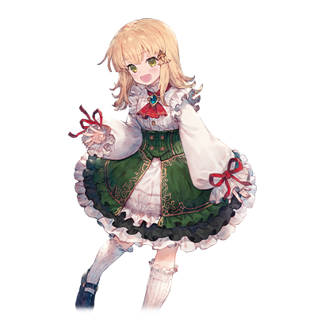

# 米安·克雷斯塔尼

| 角色信息   | |
| ----------- | ----------- |
| 名称    | 米安·克雷斯塔尼     |
| 年龄   | 9岁        |
| 职业 | 代代选出巫女的家族中的长女  |
|身份| 次期巫女候补|
| 对应曲   |《投影》 ～ Oh My Baby Doll |
| 初出   | Paradise Ep.2     |

土之巫女·米安9岁时的样子。

## Episode1 由法院搜查官发布的记录调查

> “这也太过分了……只留下巫女大人一个人……。等到巫女大人长大了的话知道这件事一定会哭出来的吧。”

**机密事项**

* * * 

**关于在克雷斯塔尼一家领地内发生的灭门事件的相关报告书**

今日凌晨到早晨时分，克雷斯塔尼一家含地主在内的12人被发现死于领地内被杀害。

第一目击者是身为巫女后继者而被抚养长大的长女。

根据其证言，长女发现了一伙侵入克雷斯塔尼宅邸的盗贼团，长女在向其母亲米利艾拉夫人呼救后，盗贼团在房内与米利艾拉夫人发生冲突所造成的事件。

盗贼团在杀害了米利艾拉夫人后，为了安全逃走，将包括家主在内的住户一共12人杀害。

特别是米利艾拉夫人的尸体受损严重，从身旁发现了护身用的短刀来推测，应该是为了保护孩子从而发生了激烈抵抗所导致。

另外，长女由于事件造成的精神冲击过大，记忆已经丧失，无法继续获得证言。

令人不解的点是，并未发现盗贼侵入的迹象，而且房檐和窗户等房子的一部分遭到了破坏。

以后，会继续现场调查该案件的内容。

* * *

**记录更新**

该搜查，由于巫女继承戴冠式就在近日，应长女的后继监护家庭的朴特蕾亚家的请求，该调查即日中止。

* * *

**记录更新**

该调查书内容为国内机密事项。除干部级别的人员以外禁止阅览。

* * *

## Episode2 本应约定俗成的血统

> “圣女什么的，对我来说言重了。不过如果能够被选中的话……我一定会完成应有的使命。”

以阿特利玛教为国教所组成的大陆最大的宗教国家鲁斯拉。

保护此地的存在是，为丰饶的大地带来安宁与治愈的力量的土之精灵，以及将土之精灵寄宿于身体内以其为媒介的巫女。

对于鲁斯拉这个国家来说，巫女被当作阿特利玛教的圣女所崇拜，代代巫女都是以其聪慧的头脑和丰富的知识引导人们。

而这一切，有的时候是基于巫女自身的意思，也有的时候并非如此——

——朴特蕾亚一族。

作为在鲁斯拉国中历代都能选出土之巫女，家族全体在阿特利玛教内多数担当指导者地位的高贵一族。

当然，他们的家名，在贵族间也非常有名，全国上下无人不知。

 

而在这样的名门血统中，出现了一位血统较为完整继承的长女·米利艾拉。

是一位从小就被人称赞拥有稀世的才能的美丽少女。

拥有一头令微风都要折服的金色长发。

还有深邃如渊，仿佛能被吸进去一般的透明的眼瞳。

以及，对任何人都能平等而温柔对待的作风。

无论是谁都对米利艾拉充满憧憬，即便是只为了留下一面之缘，大家也愿意和她打招呼。

出行时总被众多的人围着，在嘈杂的人群中鹤立鸡群的米利艾拉，是这条街最常见的风景线。

 

“米利艾拉小姐，今天也非常漂亮呢！”

“谢谢。您也很不错哦。”

 

“今天穿的衣服也非常适合您的美貌呢……”

“能受到褒奖我很荣幸。不过毕竟是穿了很久的衣服了，一直被这么夸着总是不好意思呢。”

 

“米利艾拉大人，以前受了您的意见尝试了向他吐露真心后……他欣然接受了！”

“哎呀，这可真是个好消息啊！我一直关心着这件事呢。”

 

不论是谁都认可的，才色兼备的米利艾拉，并不因为被大家认可的事实而自傲，而这点又让更多的人爱戴她。

平素宛如聪明和平和的代名词般的言行举止。可以说与“圣女”这个名号非常般配了。

下一届的巫女将有米利艾拉担任这点，大家都是这么想的。

 

然而——米利艾拉并未成为巫女的候补对象。

即便拥有那美色与才能，也无法成为巫女的资质。而米利艾拉就这么随着时间的推移，慢慢地长成大人。

精灵为了寻找寄宿物，会寻找恰逢花季的少女。也就是说，对于米利艾拉而言，“成长”就和“失去成为巫女的机会”画上了一个等号。

米利艾拉并未成为巫女候补的事情，很快就传遍了朴特蕾亚一家。

如果这样下去不能成为巫女的话。

如果让其他家族的人抢先担任的话。

 

——那就意味着朴特蕾亚一家的家名受辱了。

 

这对于一向安定选出巫女的朴特蕾亚一家人来说，这毫无疑问是火烧眉毛的事态。

而家中的如此乱状，聪明的米利艾拉不可能没有注意到。

即使家中亲戚出现对米利艾拉的素质产生质疑的各种声音，米利艾拉也只能当作没有听见一样默默地承受下去。

而对于未被选中这件事，米利艾拉自己比任何人都更不甘心。

 

而朴特蕾亚一族为了下一届的巫女选出做的准备，则是为米利艾拉提供更严苛的教育。

一切的自由都被剥夺，连睡眠时间则被压缩到极限的严苛训练，以及来自家中的冷酷视线。

即便是拥有十足耐心的米利艾拉，她的心也在这重压中被慢慢的磨损——。

## Episode 3 树下的小小约束

> “呵呵，和妈妈说了要成为巫女大人的话，妈妈听到了非常开心。所以，我也很开心！”

即便是拼命的练习，其结果也是空虚无比。米利艾拉终究是没能成为巫女。

而她的青春岁月则已经全部献给了成为巫女的训练。

而在顿悟到无法成为巫女之后，她的内心也开始渐渐变得空虚了起来。

朴特蕾亚家对她的关心也渐渐地淡薄起来，现在基本上就把她当成了“以前曾有的东西”而已。

而对她而言，一个小小的转机即将到来。

 

“米利艾拉，我是来找你谈相亲的事情的。”

“相亲吗……可是，我还没有到这个时候呢……“

“已经成不了巫女的现在，总不能赶不上一些别的事情吧。也不会对你做什么坏事的。“

“好的……我知道了……“

 

米利艾拉就像被当作垃圾处理掉一般，以未能成为巫女的人的身份，半强制地被家里安排了相亲。

而出嫁的家族是克雷斯塔尼一家。而他们家则是和朴特蕾亚家齐名，常常能选出巫女的名门。

米利艾拉认为，即便从朴特蕾亚家出嫁出去，她的一生也终究不能从巫女这件事情脱身，无论去到哪儿都是地狱吧。

 

“无论怎么努力都没有成为巫女，就像泼出去的水一般出嫁，我的一生应该也就这样空虚地落幕了吧……“

 

放弃了一切追求的米利艾拉，甚至连生存这件事都不再奢求。

只打算满足作为克雷斯塔尼一家中夫人的最基本的义务。而要是连这点都达不到的话，那干脆这条命都不要了。

 

——但是，由于某件事情，彻底改变了米利艾拉那充满无力感的人生。

那正是女儿降生的事情。

而这小小的宝物，正是让米利艾拉的心慢慢愈合伤口的重要存在。

 

而在米利艾拉的女儿——米安诞生的数年后。

也不知道是不是长年的血统继承终于开花结果，米安在还是幼年的时候就被选为了下一届的巫女候补。

像这样早早就决定了巫女候补的事情在这个国家长年的历史中也是前所未闻，而朴特蕾亚家的态度则一百八十度大转弯，对着身为母亲的米利艾拉无尽赞赏。

米利艾拉自己呢，虽然对娘家那见风使舵的态度无比轻蔑，但是，自己的女儿能被选中这件事，还是让她打从心底里高兴的。

而随着米安的成长，米安开始长得越来越像自己的样子。

而夸赞这样的女儿，就像是对着米利艾拉的认可一样。

 

在她们的屋子旁有一棵榆树。

在那巨大的枝干下方垂着一条秋千，而米利艾拉正抱着自己的女儿跟着秋千摇荡，米利艾拉温柔地对着女儿说：

“呐，米安，你真的很厉害哦。将来说不定能够成为巫女哦。“

“wu nǚ ？“

“是的……妈妈最终没能当上的巫女大人。不过，如果是米安的话，就有可能当上哦？“

“成为巫女大人的话，妈妈，会开心吗？“

“嗯，会非常非常开心哦。“

“那么，我要当上巫女大人！因为妈妈如果开心的话，我也会很开心的！“

“真的吗？可不能中途放弃哦？“

“不会的啦！约定好的事情嘛！“

“我知道了。那么，拉勾约定哦。“

“嗯！拉钩约定！！“

 

这么快就展露出成为巫女候补资质的米安，想必最后成为巫女的可能性也不会太低。

而长着一张和年少时的自己无比相像脸的女儿竟然宣言了“我要当巫女“。

米利艾拉决定，将自己曾经放弃的梦，寄托在孩子的身上。

梦想布满灰尘，曾经连巫女这个词汇都生理性厌恶的米利艾拉。

如今，一颗星星之火正在她寒冷的心中点亮。

曾经那样渴望成真的梦想说不定就能实现了。而这股再次燃烧起来的火焰变得越来越大。

而这股火，论谁都无法消灭掉。

 

没有注意到米利艾拉心境变化的米安，只是抱着想要看到妈妈笑容的想法，一心追着梦想而努力，用纯真的笑容面对着米利艾拉。

这对母子仍未知道，这个小小的约束会在将来引来怎样残酷的结局。

## Episode 4  母爱的背后所潜伏之物

> 感觉，和平时的妈妈不一样了……。嗯嗯……米安的妈妈应该是很温柔的才对啊……

“米安~来玩啊！”

一个充满活力的声音传到了米安所在的二楼房间。

这个声音来自克雷斯塔尼的分家的儿子·艾丁。他从小就和米安认识，由于年龄相近，两人很快就成为了挚友。

艾丁把米安当作自己的妹妹看待，平常就像哥哥一样照顾着她。

而没有兄长的米安则像对着哥哥一样粘着他。

两人常常带着天真无邪的笑容，每日在阳光明媚的树林中玩耍。

 

“妈妈！我回来啦！”

“欢迎回来，米安……怎么弄的全身上下都是泥土！”

“咦嘻嘻……和艾丁一起玩追逐，就变成这样了。”

 

米安虽然长着和母亲相似的容貌，但平时就是个活蹦乱跳的孩子，就算穿着贵族才能穿到的名贵衣服，也毫不在意被泥土弄脏。

看着这样的米安，米利艾拉目瞪口呆。

 

“真是的，也不知道这个性格是像谁了。还·有·啊！不是说好了要叫母亲大人而不是妈妈的吗？”

“好——！”

“每天这样调皮捣蛋的……这样可是不能成为巫女的哦？”

“咦——成为巫女的话就不能像这样出去外面玩了吗？那巫女什么的不当就好了嘛。”

 

米利艾拉由于童年体弱多病，所以即便米安从小就这样贪玩，活泼也并没有觉得是一件坏事。

相反，看到女儿拥有着多余的精力玩耍，反而为之高兴。

所以，这本该是一句夹杂着玩笑意味的，没有任何深意的亲子间的谈话而已。

然而这句话，却让米利艾拉的心坠入了无底黑暗之中。

 

“……你刚刚说了什么？”

“咦……？”

“再说一遍。”

“所以说，如果不能出去外面玩了的话，巫女什么的不当就好了……”

 

——巫女什么的不当就好了？刚刚……我的女儿说了这句话对吧……？

不可能……不可能这样的……。

要是这个孩子无法成为巫女的话，那我们的立足之地不就会……。

不对……那“我的”存在的价值不就会……？

不行。

这样是不行的。

不行的，不行的，不行的，不行不行不行不行不行——

绝对不能变成这样。

 

“不准你这么说！！”

米利艾拉的表情瞬间被愤怒填满，眉头紧皱，怒目圆瞪，向着米安吼了起来。

看到母亲这副从未见过的表情的米安，被吓得两眼瞪大。

米利艾拉看到女儿变成了这副表情，立刻静下心来向米安缓缓道来缘由。

“……米安，你要听好。成为土之巫女是你命中注定的事情。所以说，不要再提这种事情了。”

“好的……对不起……”

 

米安看着母亲变回平时的表情，放下了心中的大石头，然而刚才瞬间爆发的母亲的样子已经深深刻在了脑海里。

到底那是怎么一回事呢。

而在那之后，米利艾拉直接下达了禁止外出的命令，而米安才终于明白其中缘由。

 

而这还只是一个开始。

米利艾拉那过剩的爱，渐渐地转向了疯狂。

一切，只为了那个愿望。

## Episode 5 米利艾拉的手记 1

> 对我来说，唯一能依靠的就只有女儿，米安了。所以我，无论发生 什么都会保护那个孩子。

* * *

13XX，龙之月，07（晴）

那个时候的我，对成为巫女的事情简直如痴如醉。

而现在，我的女儿将会为我实现这个梦想。

这一定……这一定是神给我的恩赐。

 

但是那孩子居然说了“巫女什么的不当就好了”这种话……。

光是从脑海中想起来，握笔的手都会为之一颤。

明明每天从头到晚都不停宣传者巫女的美好之处的，居然还会说出那种话。

……不对，肯定有什么不对劲的地方。

那孩子虽然说太过好动太活跃了，但本质还是一个会好好听话的孩子的。

肯定是受到了什么坏的影响。

肯定是那个叫艾丁的野小子干的。

明明就是个分家的儿子，却天天和本家的女儿鬼混在一起，真是不要脸。

 

说到不要脸，朴特蕾亚家也是，为了将米安纳入家族中，甚至还送来了玩偶。

明明能垃圾一样把我丢出家门，女儿一当上了巫女候补，立刻就转变态度。

这个家族真的太讨厌了。

那个孩子是我的女儿。

绝对，绝对不会让任何一个人影响到她。

* * *

## Episode 6 爱为谁而存在

> 我会被妈妈责怪一定是我不努力的缘故……一定要达到妈妈的要求……一定……要达到……

为了成为巫女，米利艾拉开始了对米安的贴身训练。

和自己曾经为了成为巫女，从自己的母亲那里收来的严苛的训练一般，米利艾拉也给自己的女儿安排了和当时一样的训练。然而，训练的内容却是严苛到无法以“训练”二字形容。

自己曾经学到的知识，体术，教养，行为举止，都纳入了米安的训练内容。

但是，即便是容貌再怎么相似，米安终究不是米利艾拉的分身。

不知道是不是没有继承到米利艾拉的那份天才的资质，米安常常没法完成米利艾拉给予的训练任务。

 

——为什么做不到呢。

这种易如反掌的事情，我都一件件熬过来了。

难道是女儿没有才能吗。

不，这绝不可能！

 

内心充满偏执的米利艾拉一边不停重复着自问自答，一边用着血丝满布的眼睛瞪着米安发号施令。

“这样的行为举止你觉得能被认可吗！？快点，再来一次！！不要发呆了，赶紧再来一次！！”

“好的……”

 

米安俯着身子，却仍然必须手抓着裙边向着母亲回答。

每当米安失败，由于愤怒变得凶神恶煞的母亲总会破口大骂。

对于年纪尚小的米安来说，母亲的叱责比任何东西都可怕。

而这样的生活每天都在持续，米安变得非常懦弱，意志也不断被消磨殆尽。

 

而另一方面，米利艾拉在持续不断的教育过程中，对女儿的感情也渐渐地扭曲变质。

每当她训练自己的亲身骨肉，宛如自己的“分身”一般的米安的时候，感觉就像在重新塑造自己的人生一样。

每当米利艾拉把米安和其他巫女候补的女孩们进行对比的时候，如果比对方好，就会心情放松，而如果比对方差，则会瞬间怒火中烧。

这一切的所作所为，不仅超越了母亲的职责，甚至连作为人的道德底线都被踏破了。然而，在“代代产出巫女的名家”的这个特殊环境之下，却没有一个人站出来阻止她。

 

——时光飞逝，米安也到了14岁。

一天深夜，艾丁和偷偷从屋子里逃出来的米安在领地里的花园角落见了面。

 

“米安，生日快乐！”

“谢谢！能从艾丁那里得到祝贺，我很开心……”

“虽然还想送些花的……但我怕溜回去的时候被发现啊。”

“呵呵。光是能说上话就足够了。”

两人如往常一般和睦谈话。

而快乐的时间总是短暂的，当时间到了不得不回去的时候，米安的脸上覆盖了一层阴云。

“呐……艾丁……我，真的能够成为巫女吗？”

“是米安的话肯定没问题的！不管是做什么事情总是能拿到第一名啊！”

“虽然是这么说……可是要是我没有被选中的话，母亲大人就会……“

“……米安，你要是怎样都没法信任自己的话，信任我就好了。”

 

一边这么说着，艾丁抱住了米安。

米安先是有点惊讶，然后便抱紧了艾丁。

每天承受着随时可能崩溃的艰苦训练。

能够让米安继续下去的理由，正是艾丁的存在。

两人的关系从单纯的儿时玩伴，青梅竹马，开始慢慢向着别的方向发展了。

虽然仍旧未能说出口，但是两人之间已经心意相通。

“虽然现在米安的母亲仍旧严苛，但这都是为了成为巫女所必需的对吧？等到米安成功的那一天，她也一定能喜笑颜开的吧。

“……嗯，一定……是这样的吧。我还会加油的！”

 

在这仍旧青涩而甜蜜的一刻。

米安的表情已不再是愁云满布，取回了平时的开朗表情。

然而。

一双眼睛正在窗口静静地望着庭院里的两人。而月光正洒落在这对眼睛上。

那双眼睛——毫无光芒。

## Episode 7 米利艾拉的手记2

> 那些围绕在女儿身旁的害虫们……既然怎么强行赶走都没用的话，那就只能用别的方法让他们沉默了……

* * *

13XX，花之月，24（毛毛雨）

 

为了那个终将成为巫女的日子而努力修行的日常生活……。

虽然真的非常辛苦，但是年轻的时候我仍然挺了过来。

那是因为我一直相信着能够成为巫女才能做到的。

但是，我最终还是没能成为巫女。

为何？为什么？成为巫女的不是我？

我无数次的怀疑这个残酷的现实，甚至产生了自杀的想法。

但是，现在不一样了。我已经拥有了米安。

我最终没能成为巫女，一定是神明大人弄错了什么吧。

而作为补偿，米安才会降生于这个世上对吧。

那个孩子在努力完成我的课题。但是，只是简单完成的话是不够的。

为了完成我的梦想，肯定需要更努力对吧。那个孩子现在还不能达到超越极限的心境呢。

而为了让她达到这个心境，必须比以前更加得严格才行。

……但是。

归根究底，为什么不是我被选中了呢。

如果那孩子也能被选中的话，那么我不也可以吗。

为什么？为什么？为什么？为什么？为什么？

——不行啊。我要是不努力怎么行。

能够将这个孩子教育好的人只有我而已啊。

 

——话说回来。

那个叫做艾丁的男人。

明明说了不能继续接近米安的，结果还偷偷摸摸地去找她……。

带着那副毫不掩饰情欲的表情接近米安……真是恶心……！

那个孩子也是，对这点毫无自觉，看来是成为巫女的自我意识还不够的样子呢。

……对了。想到个好主意。

这么想要在一起的话。我也有我的想法呢……。

* * *

## Episode 8 腐坏而甘甜

> 为什么会变成这样？我要是失去了艾丁……这样残酷的日子还怎么坚持下去……

米利艾拉的训练依然持续。不仅严苛，甚至内容上也渐渐失去了合理性。

例如一旦失败就要重复做50次相同的训练。像这样大量毫无意义的机械重复劳动在慢慢地蚕食米安的睡眠时间。

更糟糕的是，每天几乎都要像咒语一般朗诵着“为了成为伟大的土之巫女，要变得更加美丽，变得更加高贵”这样的宛如宣传标语般的句子。

而朗诵这样句子的次数，可不是50次那样简单的数目了。

 

——要成为巫女。

要成为巫女。要成为巫女。要成为巫女——。

要成为巫女……是什么来着……。

 

米安在无数次的朗诵中，连话语代表的意义都模糊了起来。

“为了成为伟大的巫女大人，大家都要承受这样的磨难吗？”像这样的问题，也只在脑海里残留了几天而已。

而现在，米安的瞳孔已经失去了焦点，就宛如义务劳动一般机械的朗诵着。

而米安即便是这样，仍旧努力地完成了米利艾拉的各种无理取闹的任务。

这是因为从母亲发怒的那天起，米安就再也对那张充满愤怒的脸无法忘怀导致的。她只能这么做了。

为了回应母亲的期望，子女能做的事情没有别的选择，仅此而已。

 

某一天，米安完美地完成了所有的任务，一次也没有受到母亲的责骂，就这样安然地度过了一整天的训练内容。

对于长期以来对女儿施展魔鬼训练的米利艾拉来说，这还是破天荒的第一次。

米利艾拉满怀着笑容，温柔地抱着米安。

曾几何时，米利艾拉就是这样宠着米安的。

母亲温柔的声音和躺在怀里的温柔香味。

每当米安沉浸在其中的时候，无论迄今为止经历了多少痛苦的记忆，都会在这片温柔中烟消云散，化为泪水散去，只剩满满的幸福感。

对于米安来说，无论母亲怎么变化，米利艾拉依旧是那个米安心目中的温柔的母亲。

无论平日遭受了多少非难，责骂，一旦被母亲这么抱着的话，这一切的行为都会被曲解成“母亲的良苦用心”。

而这份感情，就宛如让人上瘾的药物一般——腐坏，然而甘甜。

 

“就差一点点了。距离成为‘巫女的我’，就差一点点了……”

米利艾拉一边抱着女儿，一边默默地说着。

这句话到底意味着什么呢。米安心中冒出了这个疑问，然而，很快就随着母亲传来的温暖拥抱消失的无影无踪。

 

那天晚上。

米安和往常一样，偷偷从屋子里跑了出来，来到了庭园。为的是和事前已经约好的艾丁见面。

随着月光下艾丁的身影出现在米安的视线里，米安开心地跑了过去。

 

“艾丁，今天我被母亲大人表扬了哦！”

 

然而，艾丁就像是在回避着米安一样，遮遮掩掩的，而开口的第一句话就是艾丁的道歉。

 

“对不起。我，已经不能和米安再见面了。”

“咦……？这到底是为什么？”

“我现在还有学院的入学考试要忙啊。米安不也是，巫女的选拔日期近在咫尺了吗？”

“虽然是这么说……但这也太突然了吧。艾丁你自己也知道的吧？我对你其实——”

“不要再来烦我了！求你不要再来了！”

艾丁宛如大叫一般地说出了这句话后，便头也不回地走向了自己的住处。

 

——这是几天前发生的事情。

艾丁被米利艾拉的美人计诱惑，不幸成为了她的猎物。

米利艾拉虽已为人母，但风华犹存。

虽然面对这样的米利艾拉，艾丁曾经严正拒绝过，然而由于正值血气方刚的年纪，艾丁终究是招架不住米利艾拉的攻势，终究被攻陷了下来。

而在事后，米利艾拉在艾丁的耳边吐出了宛如诅咒般的话语。

“米安，要是知道这里发生的一切的话，可不知道会变成什么样呢……”

 

艾丁由于深陷情欲的陷阱犯下了不可挽回的错误，而面对着这双充满了疯狂的眼睛，艾丁再也没有反抗的理由，只能默默地遵从她的命令——

 

由于受到艾丁突然的拒绝，米安宛如遭受晴天霹雳一般，呆呆地站在原地不动，而片刻后拖着沉重的身体慢慢地走向了屋子。

艾丁的存在，对于米安来说并非可有可无。

而现在，米安正被艾丁这位几乎是自己生存下去的原动力的，最重要的人所拒绝而带来的无尽痛苦折磨着。

米安的心灵，正稳定地向着崩坏的方向慢慢前进。

即便如此，地狱般的训练依旧向着米安袭来。

由于巫女选拔的日子近在咫尺，米利艾拉的训练开始变本加厉，而失去心灵支柱的米安则越来越跟不上训练的内容，眼神开始变得暗淡无光，身体也开始日渐消瘦。

而看到这等惨状的米利艾拉却更加愤怒，最终付诸于暴力的手段。

由于不能伤到成为巫女的那张脸庞，米利艾拉用小小的鞭子对着米安的背后无情地鞭打。

米安已经无法对疼痛做出反应了。

而她只能用着一成不变的表情，持续着残酷的训练。

## Episode 9 米利艾拉的手记3 

> 那个孩子也能做到的话，我肯定也能做到的啊。那么，做错的人难道是我吗？不对，不是这样的……

* * *

13XX，雪之月，17（雷雨）

上天保佑，那个孩子最后还是在选拔中成为了巫女。

接下来，就剩下任命的戴冠仪式了。

已经快想不起为了这一天的到来经历了多少个日日夜夜了。

 

——但是，为什么。

为什么我的心中还是那么的空虚呢。

……不对。我其实早就知道为什么了。

本来，能够成为巫女的人，应该是我的啊。

要是没有那些把我的人生夺走的巫女，还有即将成为巫女的米安的话，巫女的位子一定是我的啊。

能够引导鲁斯拉这个国家的巫女的宝座。

能够拥有这个资格的人，一定只有我而已。这点大家都很明白的吧？

话说回来，最终选择了米安也太不寻常了吧。

明明表现那么差劲，明明资质差劲到完全无法和巫女的宝座相称，却还是被选中了啊。

果然是这样的啊……果然是这次候补们的整体素质太差了啊……肯定是这样的。

现在还不算太迟。

能够成为巫女的人只有我。只有我而已啊。

只要那个孩子不存在于这个世界上的话，就算是我……。

就算是我……。

 

是我。

 

我。

 

只要那个孩子不存在的话我

 

* * *

行文至此笔记已经被擦掉，手记的内容也到此为止。

## Episode 10 美好结局

> 当我和精灵最终合为一体的时候，我获得了新生。而留下来的只有温柔的母亲的回忆而已。

米安在15岁的生日那天，巫女继承的仪式在克雷斯塔尼一家的秘密地点举行。

参加仪式的人里，并未看到米利艾拉的娘家，朴特蕾亚一家人的身影。

这是因为米利艾拉始终痛恨着娘家，所以拒绝了让他们出席的缘故。

 

终于将精灵纳入体内的米安，不知是不是因为迄今以来的严苛训练将身体弄得遍体鳞伤，在仪式结束之后便失去了意识。

米安被人送到了床上，正在床上安稳地睡觉。

而休息的房间，是一间只有床头桌和小小的灯笼照明的昏暗卧室。

有一个人影正躲在墙边的阴影中。

而那个人影，正慢慢地抚摸着米安的脸庞，默默地自言自语。

 

“……最适合的 人是我……最适合的人是我……最适合的人是我……”

 

那个人影不是别人，正是米安的母亲，米利艾拉。

米利艾拉的眼神异常空虚。

只能看见眼球中布满了血丝，疯狂地在眼眶中滚动。

米利艾拉眼前看到的，已经不是自己的女儿了。

在她眼前的，只是自己成为巫女后被万民敬仰的幻觉而已。

 

米利艾拉停止了抚摸，转而慢慢地将系着自己头发的缎带解了下来。

然后手握着缎带，缠住了米安的脖子后用力勒了下去。

 

“……唔，呜呜！？”

 

曾经从自己的肚子中产下的女儿，正在自己眼前发出痛苦的呻吟声。

然而米利艾拉毫不在意这些，继续施加了力道让缎带勒的更深。

米安从喉咙中发出了断断续续的呼救声，然而很快就在房间中消散，手臂也慢慢失去力量不再挣扎，只能无力地呻吟。

——就在这个时候。

 

米利艾拉的杀意不知道是被米安的意识，还是精灵的意识察觉到了呢。

米安的身体开始放出神圣的光芒，从身体里长出了壮硕的树木枝干。

这股力量是基于拒绝和自我防卫的目的所发动的巫女之力。然而控制这股力量的米安却失去了意识。

树木以意想不到的速度成长，聚合缠绕，最终形成了一棵参天大树冲破了屋顶。

而那棵大树的样子，正是那棵曾经靠悬挂秋千让米安在树上挂着的，大榆树。

 

茁壮成长的枝干仍旧在从米安的身体里向外扩张。

而其中一根枝干，直接贯穿了米利艾拉的身体。

 

“嘎哈……！！”

米利艾拉由于贯穿的内伤而口吐鲜血。即便能从这里脱险，也已经回天乏术了。

但是，米利艾拉眼中的杀意却仍未停息。

米利艾拉在失去意识的最后一刻从自己的衣服里掏出了匕首，直接刺向了米安的方向。

就在这个瞬间，另一根伸长的枝干刺破了米利艾拉的头颅。

枝干冲破了右眼的位置，贯穿了头盖骨。

不知是米利艾拉最后的一点意识呢，还是纯粹的生理反应呢。

米利艾拉仅存的左眼望向了米安，眼中流下了一行泪水。

 

——母亲·米利艾拉，就这么彻底死去了。

头发和衣服都被自己的鲜血染红而凝固。

即便直面死亡的恐怖，那副脸庞仍旧被欲望填满，扭曲而丑陋。

这张脸，已经再也看不出曾经那美丽而聪慧的样子了。

那温柔的母亲的脸，已经不复存在了——。

 

——第二天。

朴特蕾亚一家的几名人员即便被米利艾拉拒绝，然而仍然基于家族的情面，以探望米安的名义来到了克雷斯塔尼家。

 

“这，这到底是怎么一回事……？！”

“怎么会发生这种事……这到底……不，难道说……”

 

曾疯狂生长完全覆盖了整座屋子的参天大树已经消失了。

留下的东西，只有包括米安的父亲在内的，克雷斯塔尼一家全员，以及家中仆人等相关人员的尸体堆成的小山。

以及，完全失去意识，一丝不挂的米安。

 

“既然米安还没有事的话……虽然不想承认，不过这应该是精灵的力量暴走导致的吧……明明克雷斯塔尼一家应该也很清楚巫女之力的危险性的……为什么还会变成这样……”

“原因什么的随便了。现在最重要的是米安啊……”

 

巫女就任后力量暴走。

如果这件事情被国民知道的话，毫无疑问的，米安会被剥夺巫女的位置。

万一演变成这样的话，不只是克雷斯塔尼一家，朴特蕾亚家的家名都会被严重玷污。

朴特蕾亚家的人正在原地抱头烦恼的时候。

失去意识的米安慢慢地睁开了双眼。

 

“呜……呜呜……”

“哦哦！终于醒来了吗！米安！身体的状态怎么样？”

“没事……我看来还没事……”

“您还没事真是不幸中的万幸啊！昨晚到底是怎么回事呀？”

“昨晚……？不行……我什么都想不起来……”

 

由于力量暴走，以及和过去巫女们的记忆互相混合后的副作用。

现在的米安由于各种原因，除了习得的知识以外，其他的记忆都慢慢地消失了。

不知道是不是偶然。失去的那些记忆，正是从母亲开始严厉起来，疯狂训练米安至今的痛苦回忆而已。

 

“妈妈……？妈妈在哪里？”

“非常抱歉……夫人的话，已经……”

 

失去全家人的米安，最终被朴特蕾亚家收养。

朴特蕾亚家最终决定，将那天发生的事情以攻击贵族的强盗团造成的袭击事件向公众发表。

当然，从各种线索来看，许多东西都和调查结果相比很不正常，但最后靠着权力金钱上下打点，终究还是被埋藏在了黑暗中。

而最终获得了米安的朴特蕾亚家，再度夺回了曾经的辉煌。

 

——终于，来到了这天。要在举国上下的国民面前登场并且戴冠授予巫女位子的日子。

从米安的角度来看，这就只是突然失去了双亲的变故而已。

虽然说失去双亲的悲伤依旧沉重，然而米安与生俱来的坚韧帮助了她撑过了这份苦痛。

米安闭上双眼，手中握着母亲唯一的遗物——那把短剑。

 

“妈妈。我终于，实现梦想了哦。”

 

米安悄悄地念着这句话，一步一步地走向了欢呼四溢的瞭望台——。

## Episode 11 米安的手记

> 和母亲相关的记忆总是那么温暖。只要有这些温暖的回忆的话，我可以去到任何的地方。

* * * 

给妈妈：

 

我成功地履行了约定了哦。

平安无事地继承了精灵的力量，从今天起，我就是鲁斯拉的巫女了。

我听说了，我能够最终实现梦想成为巫女，是靠着妈妈充满热情的教育才做到的哦。

所以，从这以后，我作为巫女的人生并不只是属于我的东西。

这是属于妈妈，还有我的人生。

成为伟大的土之巫女，不仅为了我自己，也为了妈妈的份而努力尽责。

这就是我和妈妈的新的约定。

 

不过……还是好寂寞。

我迄今为止还不能相信，再也听不到妈妈那温柔的声音了……。

 

但是，像这样一直消沉下去可是不行的呢。

朴特蕾亚家的人对我也很关心，青梅竹马的艾丁也在我的身边。

虽然我没什么记忆，不过艾丁据说一直一直在我的身边为我加油打气呢。

所以，我会努力的。

为了成为令妈妈自豪的巫女而努力。

妈妈，请在天上看着我的努力哦。

 

追记。

戴冠式结束后，我被正式授予了精灵的名号了。

虽然还要点时间适应，不过我的心中为此感到无比的光荣。

 

米安·泰尔斯乌拉斯

敬上

* * *

