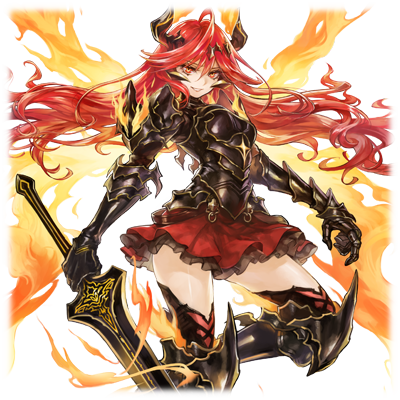

# 泰达·艾维尼亚斯

| 角色信息   | |
| ----------- | ----------- |
| 名称    | 泰达·艾维尼亚斯      |
| 年龄   | 大约15岁        |
| 职业 | 火之巫女   |
|所属国家| 阿基迪斯|
| 对应曲   | 《混乱》 ～ Muspell    |
| 初出   | Crystal Ep.2     |

## Episode 1 “箱庭“的世界

> “因神明的恶作剧所产下的人类们，在这个世界上还有能幸福生活的地方吗？”

在一切为零的时代。

产生了一个箱庭般的世界。

为了产生神的形体，世界被赋予了“法则”。

然后，作为灵魂的容器的“人类“，以及神的分身——“精灵”被制造出来，然后投放到了箱庭之中——

精灵没有自身的意志，只是跟随着神的意思向人类展示力量。

有的时候带来丰收，有的时候带来灾难。

然后，人们在确认了神的力量确实存在的时候，选择了和精灵一起共存的道路。

但是，数百年的时间过去之后，这之间的关系发生了改变。

将人的身体奉献给精灵的话，精灵就能寄宿于人的身体之中，并获得自我意识。

而像这样的存在，曾几何时开始被人称为“巫女<西比拉>”，作为施展神力的代表从而被万民崇拜。

——而接下来将要开始讲述的是这个名为“箱庭”的世界中发生的，神与人的故事。

那是被强大的力量所左右，互相争斗，互相憎恨的，愚蠢的人类的故事。

有人选择了憎恨世界，有人选择了为世界所殉身。

有人对世界发出了悲叹，有人选择向世界诀别。

而在这个世界降生的泰达·艾维尼亚斯便是被精灵的存在彻底搅乱命运的人物之一。

## Episode2 从火中诞生的野兽

> “我已经没有父亲，母亲，也没有朋友，或者是所爱的人了。全——部都没有了。所以，我要把这一切都夺取过来！”

这个世界，正在被两个国家的战火所笼盖着。

一个是鲁斯拉教国。

由信仰着“丰壤神尼非谢”的阿特利玛教的人们所支撑，享受着富裕生活的国家。

另一个是铁之国“阿基迪斯”。

由“英雄王”伊达尔所建立的这个国家，是以制铁为生从而发家的国家。

但是国土周围都被险峻的山岭包围，非但没有过上富裕的生活，人民反而在贫困线上挣扎求生。

所以对他们来说，“掠夺”以外的选择是不存在的。

和鲁斯拉正式开战已经是时间的问题了。

而扩大的战火燃遍了两国的村庄，街道被毁，冲突愈发激烈。

一个村落被卷入这无情的战火中，并且永远从地图上消失了。

 

身旁是被怒吼和悲鸣所支配的世界，一个少女在这之中努力用着伤痕累累的身体移动着，而占据着她心中的感情只有一种。

 

憎恨。憎恨。憎恨。

对于这个夺去了自己所有东西的世界的，憎恨。

被这场不可理喻的战争夺走全部东西的少女正带着憎恨在战场上徘徊。

母亲的温暖，父亲的爱，仰慕的兄弟姐妹……这个不可理喻的世界把这一切都夺走了。

少女努力地逃跑着，仿佛要从无尽的战场中逃离一般。而她误入了一片燃烧着熊熊火焰的地方。

灼热的火舌在空中飞舞，仿佛要夺取生者的性命一般。

火焰的样子，仿佛就像失去了理智疯狂跳舞的人类一样。

在这片仿佛万物都要被燃烧殆尽的火海之中，少女见到了某样东西——亦或是说，被什么东西吸引到了。

那是一个被熊熊燃烧的火焰所包裹的女人的身影。

被那么猛烈的火焰包裹着的话，已经回天乏术了吧。

但是，火中的女人却扭动着自己的脖子，向着这边看了过来。

“找到了……”

带着狞笑说出了这样一句话。

本来在这火场之中不应该听到的话语，就像是直接传到脑海中一样，回响在耳边。

“呵呵，就决定，是你了……”

连问“什么？”的时间都没有。

瞬间被盯上的少女，突然跪在原地蜷缩成了一团。

“嗯！？啊啊啊啊啊！好热，感觉身体好像要燃烧起来了一样……！”

宛如身体内侧被烙铁推入一样的疼痛在全身周转，身体止不住地痉挛了起来。

而与此同时，少女在脑海中已经浮现了死前的走马灯。

（我还不能死在这种地方！我还有，我还有……）

——等到少女在失去意识后再次醒来，已经是村里的火焰全部灭掉之后的事情了。

“我还活着？”

总之先调查了一下自己的全身，本来以为被烧着的地方却没有留下烧伤的痕迹，不仅如此，全身还有种莫名的轻松感。

还在一片迷茫中的少女被脑海里突然出现的影像打断了思考。

这些影像并不属于少女自己。

而是那些寄宿了“精灵”的力量，被称为“火之巫女”的那些参与军事和政治生涯的少女们的记忆。

“……我成为了‘火之巫女’了吗？这是真的吗？”

首先尝试一下。少女举起了右手，并且集中精神。顷刻间，掌中生出了巨大的火球，将眼前的废屋吹飞并且烧成灰烬。

“嘻……咦嘻嘻……看来这是真的啊。这股力量太棒了啊！只要有这个的话！”

少女身上缠绕起火焰，向着天空呼喊。

“从今日起，我已经获得了新生啊！从火之巫女艾薇尼亚斯继承了这份力量……其名为泰达·艾维尼亚斯！”

少女以“火之巫女”的身份，浴火重生。

为的是——将一切都夺走。

## Episode3 于水之都满溢的眼泪

> “哼，没有杀人的胆子的巫女吗？那么看来我得给你上一课呢。”

作为“火之巫女”重生的泰达，靠着曾经获得的火之巫女的记忆前往了阿基迪斯。

然后，向世人展现了巫女的力量，从而获得了进入自己喜欢的军队的权力。

混合着先代巫女们的记忆和对爱的无穷渴望的少女，脑海中幻想着能像曾经的英雄王一样征战四方，夺取一切，最后被万民景仰……然而这不过是地狱的开始而已。

在这之后过了一段时间——

泰达作为阿基迪斯的先锋部队，正在前线大展身手。

泰达所率领的三千人的先锋部队，为了再次将已经平定下来的两国局势再次点燃，从阿基迪斯出发，踏上了前往鲁斯拉的旅程。

而在他们行军路线上，将要路过一个城市，水之都迪奥基亚。

迪奥基亚作为阿基迪斯和鲁斯拉两国交界线上的一个城镇，那里的军事势力主张与鲁斯拉和睦共处。对于阿基迪斯来说，他们也是应当打倒的敌人。

泰达要做的事情也就只有一件。

“攻下这座城镇！向他们展示我们阿基迪斯的荣耀！”

在泰达的命令下，阿基迪斯军展开了无尽的破坏，不论挡在眼前的是城墙，还是军民。没有像样战力的这座城镇，立刻就被攻陷了。

但就在这个时候，传来了一股清澈的声音，穿破了满溢于战场的怒吼。

“现在立刻停止战斗！我是“水之巫女”朱娜·萨拉基亚。你们总不可能不知道巫女的力量吧？如果不想被攻击的话，就赶紧放下手中的刀剑！”

由于巫女的突然出现，阿基迪斯兵瞬间动摇了。

然而就像是要打破这个局面一般，泰达出现在朱娜的面前。

“只要能够偷袭成功的话应该就能简单杀死的……好像也不行啊。话说回来，你这连杀人的胆子都没有对吧？“

“这个感觉……难道，你是火之……”

“回答正确。那么作为奖励我就给你上一课吧。”

随着话音落地，泰达开始将眼前见到的迪奥基亚的市民们一个一个烧成灰烬。

“咿呀啊啊啊啊啊啊啊啊啊啊啊啊！”

“朱娜大人，不要啊啊啊啊啊啊啊啊啊……！”

悲鸣笼罩了整个城市。

迪奥基亚的市民们陷入了半疯狂的状态。

“怎么样？这样就懂了吗？”

“为什么要做出这种事……！！”

水之巫女·朱娜刚想挥动法杖施展力量的时候，泰达就像要挟一般将剑刃指向了民众。

“太迟了！你要是敢反抗，这些家伙就死定了！”

剑刃前方喷出了火焰掠过被指着的民众们。看着眼前仓皇逃离的民众，朱娜战斗的意志被无情地打碎了。

“快停下来！你自己难道就不会有所愧疚吗！”

“那不是理所应当的吗。对敌人我还需要顾虑什么东西吗。”

泰达锐利的眼光注视了过来。

眼中仿佛说着“反抗的话会如何”一样。

“求……求你了，我自己怎样都好，所以请不要再对这里的市民出手了……！”

双手举高示意投降的朱娜，在这片充斥着疯狂的战场上失去了力气，瘫倒在了地上。

“哼……真是无聊的女人。这么快就屈服了吗。“

泰达走向瘫倒地上的朱娜，抓住朱娜的脖子，仿佛要将这副姿态晒于迪奥基亚的市民一般，将朱娜提了起来。

泰达瞥了一眼由于痛苦发出了呻吟的朱娜的表情后，大声宣告了这句话。

“从此时此刻开始，迪奥基亚正式收入阿基迪斯的势力范围！“

阿基迪斯兵和迪奥基亚的市民。

两种完全相反的反应在人群里炸开了锅，正如这场战斗的胜败一般。

“……这样……的话，大家的性命……就可以……”

“啊？你在说什么呢。说不定现在死在这里还会好点儿哦？这些人都要成为阿基迪斯的奴隶的啊。”

听到“奴隶“这个词汇，大家都不由得打起了寒颤。

“怎么……可以这样……他们可是人，不是物品啊……“

“沦为奴隶的人啊，哪里还有所谓的人权啊！男人就工作到死，女人和小孩就要作为服侍的对象啊！连这点都不懂，巫女还真是太平日子过久了啊！啊哈哈哈哈哈哈哈！”

“呜……我……并不是……这样的……啊……啊”

工整的脸庞被痛苦的感情扭曲，大滴大滴的泪珠从脸颊掉落。

泪水决堤，朱娜也和她眼前的迪奥基亚的居民一样，泪水浸湿了眼前的土地。

——迪奥基亚的民众被一个个送往了本国。而朱娜只能站着目送，却什么都做不了。然而泰达又一次出现在怅然若失的她面前。

“呵呵，你就成为我的奴隶吧。我会让你见识到最恐怖的地狱的，给我过来！”

“……”

“快停下来！不要伤害朱娜大人！”

一个男青年站了出来，停住了直接拉着朱娜走着的泰达。

而在他背后数人的男女也跟着在后面开始发出抗议的声音。

“哎呀，来送死的吗？那么！”

“不要再这么做了！”

朱娜大声劝阻打断了这一切。泰达手中拿着大剑“迪亚波罗斯”，持剑的手仍然举在半空，她看着朱娜的眼中正看着那个站在前方劝阻的青年，而立刻猜出两人关系非同一般的泰达，正犹豫着是否要挥下利剑。

但是，她脑中立马闪现了一个主意，放弃了挥剑斩杀的念头。

“想到个好主意了……。我说你们，都跟着一起上前线。这群人的命运如何，全部都要看你咯，朱娜？”

显而易见，泰达就是要拿这些人做为束缚朱娜的“人质”。

“是要……由我的行动决定吗……”

朱娜抬起头看到的是，少女那邪恶的笑容。

朱娜连对眼前的少女同样也是巫女这点的时间都没有。

“你如果不在战场上干掉那些鲁斯拉的邪教徒的话，你犹豫一次，这些人就得在你眼前被凌迟了哦。”

朱娜由于惊讶而瞪大的眼睛慢慢被绝望和放弃所笼罩，发出了微小的声音。

“我……知……道……了……”

就像这样，水之巫女·朱娜，也被命运的齿轮卷进了这场劫难。

只剩下被夕阳笼罩着的迪奥基亚……

## Episode 4 开战

> “今天就要在这里把你们都杀光！信仰啥的，能吃饭吗？能阻止战争吗？别说笑了！”

在将迪奥基亚纳入麾下后，阿基迪斯军继续向鲁斯拉发起了进攻。

由泰达带领的三千人的部队，正在肥沃的大地上全速前进。广阔到不知伸向何方的田野被被军队蹂躏，被战马践踏。

一切都是为了杀死鲁斯拉拥有的“土之巫女”米安，夺走他们的一切。

而在他们的目的地前阻拦的是，由阿特利玛教徒组成的六千僧兵。

而站在这队精兵前头的泰达，则向整齐列阵的教徒们宣告。

“赶紧把米安交出来！要是敢说不的话，你们的尸体血肉就要成为这里的装饰品咯！”

教徒们举起了武器拒绝了泰达的宣告。而看到此景的泰达露出了得意的笑容。果然还是得这样，啊。

“你们的命运已经决定好了！举起你们的利剑对准他们的喉咙！夺走一切！杀光一切！”

随着泰达的命令，军靴和马蹄声震彻战场。

——在此时此刻，两军正式交战。

“啊哈哈哈哈哈哈哈！死吧！死吧！都给我去死吧！”

随着大剑不停挥舞，血花和惨叫愈发刺耳。

在这化为炼狱的战场上，尸体的小山正在慢慢堆砌起来。

泰达的喊声愈发激烈，就像在唱着战歌一般。

泰达随着这份高昂的气势挥动大剑，不停斩杀眼前的教徒。

“呀啊啊啊啊！米……米安大人……！”

“米安大人啊啊啊啊啊！快救救我们啊啊啊啊啊！”

不管是左边还是右边的人。

从这些教徒口中说出来的总是“米安大人”。

明明自己已经要没命了，为什么他们仍旧保持着对米安的仰慕呢。

“噫！ 米……安……大……人……”

就连这个脑袋刚刚搬家的女人。

口中也是念着米安的名字。

本来正在兴头上的泰达，也慢慢地把脸沉了下来。

然后，宛如烈火一般，泰达的怒火燃烧了起来。

“……不管是这家伙还是那家伙！！这群人居然相比自己的性命，那个‘米安大人’要更加重要！？开什么玩笑啊啊啊啊！”

泰达将眼前的所有教徒烧成灰烬。

她将大剑“迪亚波罗斯”插入地面，仿佛发狂般地叫着：

“既然这样的话！那么就把你们全都烧光！让你们这群人知道，只靠信仰战争是不可能停止的！”

泰达的剑刃不停地砍过一个又一个人。

这些阿特利玛教的虫子们，要砍到他们的鲜血染遍大地为止。

不论是反抗的，还是逃跑的。

不论是男，女，老，幼，

泰达都会一视同仁地将他们斩杀。

“都砍完了啊……真无趣……”

等泰达回过神的时候，街上的广场已经是被尸体的小山上的血彻底染透了的状态了。

燃遍整个街道的火焰也不复存在，仿佛宣告死亡的寂静一般，夜幕也悄悄降临了。

“啊——啊……‘迪亚波罗斯’上都被血浸透了啊……”

泰达挺着背脊，发出了仰天大笑。

大笑后的她，仿佛要想起什么东西一样开始擦拭剑上的血液。

“你们信仰的那个‘米安大人’最后不也是没来救你们不是吗？真是可笑啊！啊哈哈哈哈……？嗯？“

由于大笑过头突然感觉头晕的她，一边呻吟着半蹲了下来，单手伏在了地上。

但是，明明这个光景旁边的士兵都看得一清二楚，却没有任何一个人上前接近，只是默默站在远处看着。

士兵们此时还没有注意到，他们对她的感情，已经慢慢从尊敬转向了恐怖了。

而他们开始在背后，开始将泰达描绘成不详面孔的恶魔姿态了。

“……哈哈，为什么大家有的东西，我却一个都没有呢……为什么呢……好不甘心……米安，朱娜……你们能被给予幸福，能被别人所爱……而上天给我的这股火焰却……“

明明可以作为将阿基迪斯引导至胜利的英雄，成为降生于这片不平等的世界中，给予阿基迪斯人民唯一希望的人。

少女的自言自语，宛如墨水溶解般，在空中消散的无影无踪。

## Episode5 战争的伤痕

> “喂，到底躲在哪儿啊米安……赶紧把你的脑袋给我啊！“

泰达带领的阿基迪斯军摧枯拉朽，如入无人之境。

鲁斯拉的肥沃大地就这么被无情的铁骑所蹂躏，而版图也被慢慢划入阿基迪斯。

这股势头，在杀死“土之巫女“米安之前，都绝不会停息。

 

泰达大声宣告着。

阿特利玛的邪教徒们和他们的家人，一个不留，格杀勿论。

这些人不是我们的同胞。

 

敢逃避命令者格杀勿论。士兵们由于害怕，将他们的刀刃对准了手无寸铁的民众们。

 

在这里还有任何的大义名分吗。

已经几乎不剩一点点理由了。

现在他们只是被恐怖支配，为了自己的那条性命而服从命令。

要是反抗的话，就会变成那一摊摊白花花的尸块。

 

“报告！泰达大人带领的先遣部队，已经深入腹地，距离鲁斯拉中央地带只有一步之遥！”

泰达的军队势如破竹，击破了无数的鲁斯拉军。

而听到报告的阿基迪斯军上层人员，露出了猥琐的笑容，满足地讨论着今后的安排。

 

“真不错，不愧是我们的‘火之巫女’。”

“像这样进军的话，烦人的鲁斯拉也不过是我们的盘中餐了。”

“那这样的话，就需要快点找到‘土之巫女’了”

“对巫女实施绞刑，带着在国内游街示众吧，然后……”

 

“一切为了我们阿基迪斯永远的繁荣强盛！”

 

这些人们的决定，让鲁斯拉陷入了更深的地狱。

而这场战斗的最后会是如何。

其结果没有人会知道。

## Episode6 燃烧的圣都

> “都听好了！把夺走你们性命的人的名字！深深刻在脑海里吧！泰达·艾薇尼亚斯！”

根据阿基迪斯上层的指示，军队加快了侵略鲁斯拉的脚步。

鲁斯拉境内那些散布着的村落被烧毁，无数栖息于此的生命被尽数埋葬。

灰烬和死亡的气息永不消散，耳边死前的惨叫永不停息。

那些跟随着泰达出征的兵士的眼中，已经没有了出征时的那股荣耀。在担心着一旦被发现就会被杀死的气氛中，他们继续前往下一个战场。

而在那些目的地之中，终于获得了米安所在的城镇的情报。

——巫女，就在圣都亚历山迪亚。

“啊哈哈哈哈哈哈！终于啊！终于能让我杀死你了！”

泰达直接前往了圣都。

而她的视线朝向的并不是那些面露憔色的部下们，而是远处似乎会现身米安。

——虽然圣都的防守和之前攻打的城镇不可同日而语，但是，这也只是仅限于人类之间的力量对决而已。

此时的守军面对的，是火之巫女——泰达·艾薇尼亚斯。

她双手放出的赤黑色的火焰，就像生物一样，扭动，进攻，将所有阻碍进军的东西烧成灰烬。

“喂！快点出来啊米安！再不出来的话，这座城里的人，就要全部都烧成肉干了啊！啊哈哈哈哈哈！”

战场已经充满了被烧焦的人体的味道，已经很难在这之中正常呼吸了。

而在这之中唯一还维持意识的，除了泰达别无他人。

面对这副令人作呕的地狱景象，失去战斗欲望的阿特利玛教徒开始四散逃离。

即便他们选择了逃跑，泰达仍旧没有停止屠杀。就在这时，一名身披黑色披肩手持一柄巨大法杖的少女映入了眼帘。

而那位少女，正是鲁斯拉人民的信仰象征的重要人物——“土之巫女”米安·泰尔斯乌拉斯。

“这个感觉——啊啊啊啊啊啊终于找到了啊啊啊啊！”

一边是仿佛和最爱的恋人再会一般，双脸潮红，露出年纪相仿的笑容的泰达。另一边则是混杂着不知道是恐惧，还是憎恨的表情的米安。

“你现在很幸福对吧……所以，我要把你的这一切……都夺走啊啊啊啊！”

泰达随着身体兴奋的抖动向着米安冲过去。

就在“帝亚布罗斯“的黑色刀刃即将命中米安的瞬间。

响起了刀刃碰撞的声音。

仔细一看，那是一个男人正在守护者米安。

而有勇气向着泰达举起武器的，正是米安的侍从，艾丁。

“米安大人！请赶紧趁现在逃走吧！“

“不行啊！艾丁！面对巫女你连万分之一的胜算都没有啊！“

“走啊！快走啊！你是不能死在这种地方的人啊！“

米安旁边被阿特利玛教徒围了起来并且被带离了此地。

“不要啊！艾丁！“

被称作艾丁的男人，一边望着渐渐远去的米安，一边向着泰达摆起架势。

“操纵火焰的恶魔啊！我可不会那么容易被打败！“

随着如虹的气势，男人发起了进攻，但是，就算男人的技艺再怎么高强，在巫女的力量面前还是不够的。

“真是扫兴啊……“

简单地把艾丁的剑架开的泰达，直接靠火焰的力量融化了剑刃。

“不可能……你这个……怪物！“

失去武器，脸上充满绝望的艾丁，泰达正一副满足的眼神看着，那是一种看着猎物的，充满愉悦表情的捕食者的眼神。

“从那个女人的脸上就看出来了，你应该对那个女人来说很重要对吧。“

“……米、米安大人……“

话还没说完，男人已经身首异处。

泰达踩着滚到一旁的头颅，对着空中大喊。

这声音宛如诅咒一般邪恶，在布满黑烟的上空回响。

“米安！都听好了！把将要夺走你性命的人的名字！深深刻在脑海里吧！泰达·艾薇尼亚斯！”

大家，都是被所爱的人围着，接受自己的存在的……。

对于泰达来说，不论是身为人，还是身为巫女，都没有能够接受自己的存在。泰达的心中想到这里，不禁燃起了嫉妒的业火。

远处米安的身影已经消失，而圣都在泰达的攻击下已经渐渐地被烧成了灰烬。

曾经四处都是美丽的街景的圣都已经被烧得毫无踪迹。

“……那个人拥有着我没有的好几样东西。不能原谅……不能原谅……”

失去发怒的对象的泰达站在原地不知所措。

看到这幅景象的阿基迪斯兵抱着关心的意图小心翼翼地搭话了。

“泰……泰达大人，没有受伤吗！？”

“吵死了！”

随着一阵响声，大地又被新的血液染红了。

由于嫉妒陷入疯狂的泰达，已经分不清敌我了。

“米安，你跑到哪儿都是没用的，绝对要找到你，让你在你最信赖的信徒面前一件一件地夺走你最重要的东西……就像我……那天失去了一切那样……啊！”

圣都——亚历山迪亚，就这样在一夜之内被火焰吞没，那些荣耀的历史随着这些建筑，付之一炬。

而泰达仍旧在向外播撒的灾厄之火，也渐渐逼近了最后的据点。

## Episode7 决战日

> “今天就是鲁斯拉教国的亡国之日。只要事成，我就会成为阿基迪斯的英雄。”

让米安逃走的泰达，靠着那股怒火继续进军。

而挡在前方的，则是鲁斯拉引以为傲的坚城——城塞都市安谢塔。

这个城市是以依山而建的大圣堂为基础围着建立城镇，最终成为一座布满高墙，拥有巨大都市区划的要塞。

如果能攻陷这里的话，鲁斯拉将再无东山再起之力。

在这历史的分水岭前，阿基迪斯军正急匆匆地向着决战之地前进。

因为一旦慢下脚步，就会被四周的夹击歼灭了。

开始进攻的泰达军所面临的是，鲁斯拉的顽强抵抗。教徒不要命的反击，配合易守难攻的斜坡地形，让进军陷入了僵局。

更糟糕的是，从山崖上方掉落的弓箭和铁球正在无情地干扰士兵们的进攻。

但是，无视着这惨烈战况的泰达，正一个人在嗤笑着。

随着她嗤笑的声音的是非常吵闹的沙拉沙拉的声音。

那是全身被锁链拘束着的，“水之巫女”朱娜。

“哼……城塞这两个字不是拿来摆设的啊。”

“明明友军正在不断伤亡，但是为什么还要继续进攻呢？为什么你要做到这种地步……”

“这就是‘火之巫女’的任务,啊。我对于这场战役，整个阿基迪斯军来说都是不可或缺的存在。还有什么别的理由吗？”

眼前是乌鸦集聚的尸体，燃烧后化为灰烬的街道。

一切都被毁灭了之后，阿基迪斯真的能够变得富饶起来吗。

朱娜的话并未传达到眼神空虚地望向远处的少女耳中。

“你不也夺走了不少人的性命，你还在说什么傻话啊？”

“那个……明明就是你的命令……”

泰达嘀咕着“还不够吗……”就继续说了下去。

“呐，把这个城镇的所有市民都杀了吧？这样的话你最重要的那个人质我就给你放了。反正你都杀了这么多人了，不缺这一点儿吧？”

泰达说着这话的语气，轻松地仿佛和去购买东西一般。

“把这里打下来，战争就结束了，这样的话，你也能获得解放了。皆大欢喜啊！啊哈哈哈哈哈哈哈哈哈哈！”

一旁站着的泰达举剑指着朱娜的侍从们。

只要心爱的人还在手上的话，那就无法反抗。

强忍着即将呕吐的感觉，朱娜只能努力地点了点头。

“等把圣堂打下来后再说。好好努力哦？”

留下这句话，泰达把侍从带向了前线。

而被悲伤打垮的朱娜，则带着沉重的足枷，缓缓地走向了广场的地方。

## Episode8 决坏

> “给我抢！给我杀！给我把这些异教徒都斩草除根啊！要是敢说做不到的话，我现在就在这里宰了你们！”

要想到达安谢塔的圣堂要塞的话，就必须通过一条十分漫长的单行道。但是，从墙壁间不停发动的进攻让阿基迪斯军防不胜防，始终无法集中进军。

这点给阿基迪斯军造成了很大压力，就算阿基迪斯军再怎么兵强马壮，他们最终还是只能屈服于此。

眼前是走到哪儿都长得一样的上坡道，士兵们已经隐藏不住疲劳的神色，失去战意的士兵开始慢慢脱队。

 

“这种要塞就靠我们打下来，不可能的啊！”

“不行了，需要更多的援军，只要能包围住他们的话，他们也是插翅难逃的！”

像这样说着说着，士兵逐个逐个脱离了战线。

然而他们却再也没有回来过。

因为突然出现的巨大火球包裹了他们，瞬间将他们化为了灰烬。

 

“你们太丢脸了！给我抢！给我杀！给我把这些异教徒都斩草除根啊！要是敢说做不到的话，我现在就在这里宰了你们！”

跟着这句话出现的是，在眼前被化为焦炭的同胞们的尸体。士兵们被恐怖笼罩，并且动了起来。

然后不知道是谁大喊了起来。

“开！开什么玩笑啊！你这个怪物！谁会跟着你这种家伙一起打仗啊！”

“是啊！我现在就要从这里离开！就算杀了你也要离开这里！”

一个一个的小小的反抗声，瞬间扩散到了全军。

士兵们开始反抗起泰达的指挥。

当然，泰达不可能乐见这种情况，口中发出了怒吼。

“为什么……！？明明把鲁斯拉打下来将他们的幸福夺走的话，就赢了啊！为了这么做，你们不就应该为此燃烧殆尽吗！和巫女一起！”

泰达的脑海里浮现的是那一天在被疯狂的军势中，被无情烧尽的村落里，那个露出狡黠笑容的女人。那个为阿基迪斯不停战斗的，曾经的巫女的影子……。

“你们这些人……又要从我这里夺走什么东西了吗！?”

那脸上的表情，并非悲伤和愤怒，而是两者交融的，充满苦闷的表情。

“不管谁最后都没有接纳我……不管谁最后都没有爱我。像你们这样……随便又无责任的人类啊！既然如此的话，那就让我烧光一切吧。把全部人都杀死吧！！”

对于两个国家来说，现在最大的敌人，变成了站在他们面前的巫女。

## Episode9 命运的弓箭

> 我只相信自己手中的这股力量。别无他物。所以，我只能夺走一切啊！

战局已经发生了翻天覆地的变化。

泰达只是跟着自己的感情，不分敌我地破坏面前的一切。

那逐个逐个将同胞斩杀的身姿，对于阿特利玛教徒的人来说，是令人不可思议的状况。

“现在正是反击的时候！向那个把无数同胞夺走性命的巫女施以最严厉的制裁！”

“哦哦哦哦哦！”

无数的教徒杀到了泰达面前。

身心已经被历代的巫女心中的愤怒和悲伤支配，已经失去了最基本的判断力的泰达，彻底化为了将眼前站着的所有敌人都屠杀殆尽的战斗机器。

而化为战斗机器的少女，以最尖锐的声音胡乱地挥舞着大剑，叫喊着。

“啊啊啊啊啊啊啊啊啊！你！你！还有你们！都把我当成了敌人了吗啊啊啊啊啊啊啊啊！”

……那么，把全部东西都燃烧殆尽就好了！

放出的烈焰跟着狭长的山道前进，将前面的教徒变为了灰烬。

即便目睹了此等凶状，教徒们仍旧继续前进。

阿基迪斯兵们也踩着同伴们的尸体，向着目标前进。

“杀死巫女”的念头占据了两军士兵，将对巫女的恐怖心吹到了九霄云外。

“去死啊啊啊啊”

“没用的！爆炸吧！”

在雪崩般前进的军势前端，泰达以自己为中心产生了爆炸，爆炸的热风将无数的士兵化为了难以名状的尸体。

“啊哈哈哈哈哈哈哈！我除了这份力量以外再无他物。所以只能不停夺取别人的东西了啊……不停地夺取……夺 取 ，夺    取       ……”

即便视线已经一片模糊了，泰达仍旧向着圣堂前进。

一瘸一拐地走着的双腿已经被鲜血染红，士兵的剑斩伤了腹部，喷出了大量的血。

“只要把那个女人杀掉的话……我……我就……会成为英雄的吧……只要把……这一切……夺走……的话……”

后面想说出来的东西是，希望认同自己，希望别人能够信任自己的愿望。而现在却宛如在给自己安慰一般无力。

还差一点点。杀死米安，把圣堂打下来的话就可以做到了。

“这次的话，一定能够成功的吧……”

就在这时，一支弓箭划破了浓浓黑烟飞了过来。

直接命中了少女的胸口——。

## Episode10 终焉之红

> “为什么我会遇到这种事情？我只是想……被认同，想被人爱，想被人需要啊……”

“咕……啊……”

那支命运般的弓箭，最终刺破了少女的胸膛。

视角扭曲失去平衡的泰达仿佛发出了呻吟般跪在了地上。就像是心照不宣一样，战场上响起了欢呼的声音。

“中了！中了啊啊！就算只有我们也能杀掉巫女的啊！”

“哦哦哦哦哦哦！”

“杀了她！杀了她！杀了她！”

战场的形势化为了一体。

而这片被疯狂覆盖的战场上充满了杀意。

（为什么？为什么我会遇到这种事情？我要把鲁斯拉毁灭了，给阿基迪斯……带来胜利……而已）

事未成的悔恨化为泪滴，然而却在瞬间蒸发消失。

泰达认为这是神在宣告，你连为此哭泣的权力都没有。

眼前是瞳孔中布满血丝的男人们正在接近。

……必须把他们，杀掉。

持续跳动的血管，冲击着头部，仿佛要将头脑沸腾一般。

为什么，会这么痛。

疼痛夺走了意识，没法集中思考了。

好痛。好痛好痛好痛。好痛，痛……

仔细一看的话，原来是身上插满了无数的箭矢。

然而即使这样还是没有停下脚步，泰达仍在前进。

至少那个女人，必须自己亲手手刃才行。

“这个怪物啊啊啊啊啊！去死吧啊啊啊啊啊啊！”

攻击而来的剑刃让泰达失去了平衡，向着地面摔倒了。

而此时此刻，无数多的刀剑贯穿，刺入了泰达的身体各处。

手腕被切成无数碎片，一只眼睛被破坏，受到冲击的铠甲被攻击到卷曲，被攻击卷入的身体肌肉发出了沉痛的悲鸣。

仿佛没有尽头的痛苦。

而在将死一刻，泰达脑中闪现了无数多的记忆。

那些是精灵的记忆，还是过去巫女的记忆都再也分辨不出来了。重重磨难后奄奄一息的少女的死前记忆，让泰达的精神也受到了重创。

（这些……都是巫女的……啊……我……）

（……救救……我……吧……）

喉咙已经被斩破的血管挡住，发不出声音了。

只能发出令人不快的声音。

（哈哈哈哈哈哈哈 ，啊哈哈哈哈哈哈）

（——这个世界，已经疯了啊）

一把剑正正挥下。

在渐渐浑浊的意识之中，她最后又见到了什么呢。

## Episode11 故事的结尾

> 人类，还真的是丑陋，傲慢，又浅薄呢。到底要重复几次争斗和混沌的历史才肯罢休呢。

无数的剑刃贯穿了泰达之后一阵子，终于完全停止了呼吸。

而就在这个瞬间。

由于巫女绝命从而开始欢呼的战场上，突然卷起了一阵爆炎。

那宛如深渊般黑暗的黑色火焰，一瞬间就将士兵们烧掉，将残垣断壁融化，大地也被划出无法愈合的伤痕。

就像要见证这幅惨状一样。

泰达本来的灵魂和生命从肉体中解放，和火焰一同化为了灰烬。

而在旁边伫立着的众多少女们……正是曾经成为巫女的人们。

承受了少女们无数次强行的继承和参加战斗从而暴走了的精灵的力量，不再前往别处寄宿，就这么消散了。

 

——在巫女死后过了一阵子。

阿基迪斯和鲁斯拉的战争，就这样以“巫女的暴走和死亡”这一事件为契机，最终决定了停战。

虽然看起来非常随便，这也是战争的一环吧。

经历了无数牺牲和悲伤的争斗的时代到此为止，新的时代正式开启了。

而被火焰烧尽的城镇，历经时间转移终会复兴的吧。

而经历过大战的城塞都市安谢塔，也终将带着这伤痕继续前进。

而在这片惨遭焚烧的都市角落，一把巨剑正被遗弃在那里。

那不祥的反光，正是曾经“火之巫女“驰骋战场的”帝亚布罗斯“。

浸满鲜血，锈迹斑斑的剑从剑柄开始，慢慢地露出了灰烬般的光芒。

那个颜色宛如表现愤怒一般，宛如业火一般，地狱一般——充满了红色。

而那光芒反射出去的对面站着一名少女。宛如头上落满了灰尘一般带着病怏怏肤色地少女像是在和友人对话一样地开口了。

“人类，还真的是丑陋，傲慢，又浅薄呢。只要互相交会一次，那里肯定就只会产生争斗和混沌啊。”

像这样一边说着一边用手指着。

红色的光就这样，被少女吸收进了体内，然后消失了。

而大剑也崩溃四散，化做了土块。

剩下少女留着不详的笑容，慢慢在黑暗中消失踪影。

